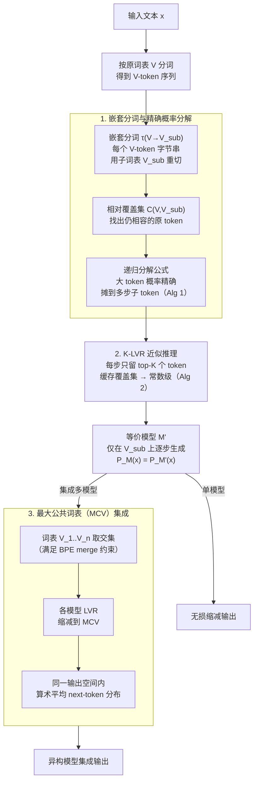

# Lossless Vocabulary Reduction for Auto-Regressive Language Models

**会议**: ICLR 2026  
**arXiv**: [2510.08102](https://arxiv.org/abs/2510.08102)  
**代码**: 无  
**领域**: LLM预训练  
**关键词**: Vocabulary Reduction, Auto-Regressive LM, Tokenization, Model Ensemble, Maximal Common Vocabulary

## 一句话总结

提出**无损词表缩减（LVR）**的理论框架，通过嵌套分词（nested tokenization）将任意自回归语言模型精确转换为使用任意子词表的等价模型，并基于**最大公共词表（MCV）**实现不同分词方案语言模型之间的高效集成，在 GSM8K、MATH、翻译等多个任务上验证了方法的有效性。

## 研究背景与动机

**领域现状**：分词（Tokenization）是语言模型的核心组件，BPE、SentencePiece、Unigram 等不同分词算法被广泛使用。每个语言模型拥有独立的词表 $V$，自回归模型在此词表上逐 token 预测 next-token 分布 $p(v_t | v_{<t})$ 来生成文本。

**现有痛点**：不同语言模型的词表通常不兼容（如 Qwen 使用 151,643 个 token、Falcon 使用 131,072 个 token），导致它们的 next-token 分布定义在完全不同的概率空间上。这使得模型集成（ensemble）、跨模型知识蒸馏等需要在 token 分布层面协作的技术无法直接应用于不同词表的模型。

**核心矛盾**：已有的解决方案要么局限于同词表模型的集成，要么采用 byte-level reduction（将所有模型退化到字节级词表），前者限制了模型选择范围，后者因词表过小导致生成序列极长、效率极低。缺少一种既能保证精度无损、又能在效率与通用性之间取得平衡的词表转换框架。

**本文目标**：如何将任意自回归语言模型**无损地**转换为使用任意子词表的等价模型？进而，如何找到多个模型间的最优公共词表，使之在保证无损性的同时最大化生成效率？

**切入角度**：从概率论出发，将词表缩减形式化为嵌套分词下的分布等价问题。论文证明了只要目标子词表满足覆盖条件，存在唯一的等价 next-token 分布，并给出了递归构造算法。

**核心 idea**：通过嵌套分词的精确概率分解，实现从大词表到任意小词表的无损转换，配合最大公共词表（MCV）统一不同模型的输出空间以实现集成。

## 方法详解

### 整体框架

LVR 要解决的事情很具体：给定一个自回归语言模型 $M$（词表 $V$）和一个更小的目标子词表 $V_{\text{sub}}$，把 $M$ 改造成只输出 $V_{\text{sub}}$ 中 token 的等价模型 $M'$，并保证对**任意文本** $x$ 都有字符串级的概率相等 $P_M(x) = P_{M'}(x)$。整条流水线分三步走通：文本先按原词表 $V$ 分词，再把每个 $V$-token 的字节串用 $V_{\text{sub}}$ 重新切一遍（嵌套分词），原来"一步生成一个大 token"于是变成"在子词表上多步生成"，这条多步路径上的概率由递归分解公式精确算出，保证不丢精度（这是无损性的数学根基，Algorithm 1）；但精确算法每步要遍历整个 $V$，所以推理时改用 K-LVR 做 top-$K$ 截断，把开销压成常数级（Algorithm 2）。前两步合起来就得到了单模型的无损缩减引擎。最后，当要集成多个异构模型时，把它们各自的词表取交集得到最大公共词表（MCV），所有模型先用这台引擎无损缩减到这个公共词表，就能在同一个输出空间里直接平均分布——这是 LVR 引擎的下游应用。

### 关键设计

**1. 嵌套分词与精确概率分解：把"一步生成大 token"无损拆成"多步生成子 token"**

直接按子词表截断概率（Naive Restriction）会破坏归一化、把分布算错，这正是要绕开的坑。LVR 的做法是定义嵌套分词 $\tau_{V \to V_{\text{sub}}}$，把 $V$ 中每个 token 的字节串用 $V_{\text{sub}}$ 重新分词——比如 $V$ 里的 "abc" 在 $V_{\text{sub}}$ 中被拆成 "a"+"b"+"c"，那么原来一步生成 "abc" 的概率就要被精确地传播到"先生成 a、再生成 b、再生成 c"这条多步路径上。难点在中间步骤：生成 "a" 时，不能只摊派 "abc" 的那份概率，还要把原本就以 "a" 开头的其他所有 $V$-token（如 "ab"、"axy"）的贡献一并算进来，否则条件概率就不归一。论文用**相对覆盖集**（relative cover $C_{V, V_{\text{sub}}}(y_{1:k})$，刻画"在已生成子词前缀 $y_{1:k}$ 的上下文下，哪些原 $V$-token 仍与之相容"）来圈定要累加贡献的 token 集合，并给出递归分解公式逐步算出每个子词表 token 的条件概率，从而保证整条路径乘起来恰好等于原模型的 token 概率。这个精确版本就是 Algorithm 1，它给出了 $P_M(x) = P_{M'}(x)$ 的存在性、唯一性与构造性证明。

**2. K-LVR 近似推理：用 top-$K$ 截断把精确算法压到常数开销**

Algorithm 1 虽然无损，但每步都要遍历原始词表 $V$ 中所有 token 来做分解，复杂度与 $|V|$ 成正比，对 15 万级词表的模型太贵——这是把理论变成可部署算法必须迈过的坎。Algorithm 2（K-LVR）只保留概率最高的 $K$ 个 token（$V^{(K)}$）参与分解，并把相对覆盖集的中间结果缓存复用——实验观察到覆盖集大小在前几步之后会稳定在约 $K$ 附近，不随序列长度增长，所以推理开销实际是常数级。$K$ 的取值有清晰准则：$K=1$ 就能精确复现贪心解码；集成场景下 $K \geq 10$ 已够做贪心；要近似原模型完整分布用于随机采样则需 $K \geq 250$。代价是 top-$K$ 截断使 K-LVR 不再严格无损，但 $K$ 越大越逼近精确 LVR。

**3. 最大公共词表（MCV）：为异构模型找一个尽量大的公共输出空间**

有了前两步的无损缩减引擎，集成不同分词方案的模型就归结为"先把它们投到同一个 token 空间再平均分布"。给定多个词表 $V_1, V_2, \ldots, V_n$，MCV 定义为它们公共 token 在 BPE merge 规则约束下能构成的最大集合——本质是取交集，但要满足合并规则的相容性。所有模型用 LVR 无损缩减到 MCV 后，next-token 分布定义在相同空间上，于是可以直接做算术平均或加权混合。相比退化到 byte-level（公共词表只有 256 个字节、生成序列极长），MCV 保留了模型间共享的高频子词，能大幅压短生成步数：例如 Qwen2.5-3B 与 Falcon3-7B 的 MCV 远多于 256 个字节级 token，因此比 byte-level 集成更快，而精度与之相当。

### 损失函数 / 训练策略

- **无需任何额外训练**：LVR 是纯粹的推理时概率变换算法，不涉及参数学习或梯度更新
- **理论保证**：在精确 LVR（Algorithm 1）下，转换满足文本级别的分布等价性 $P_M(x) = P_{M'}(x)$，这是一个严格的数学定理（存在性、唯一性、构造性证明完整）
- **近似策略**：K-LVR 通过 top-$K$ 截断引入近似，$K$ 越大越接近精确 LVR，$K=300$ 在论文实验中能以极小的精度损失覆盖几乎所有场景
- **集成策略**：各模型缩减至 MCV 后，直接对 next-token 分布进行算术平均，无需额外的集成权重学习

## 实验关键数据

### 主实验

在 GSM8K 和 MATH 基准上验证词表缩减的无损性和集成效果（greedy decoding，$K=300$）：

| 模型 / 配置 | GSM8K Acc (%) | MATH Acc (%) | 说明 |
|---|---|---|---|
| Qwen2.5-3B（原始词表） | 79.1 | 42.4 | 原始模型基线 |
| Qwen2.5-3B（K-LVR, N-bytes ≥ 3） | ~79 | ~42 | 无损性验证：与原始相当 |
| Falcon3-7B（原始词表） | 77.9 | 30.2 | 原始模型基线 |
| Falcon3-7B（K-LVR, N-bytes ≥ 3） | ~78 | ~30 | 无损性验证：与原始相当 |
| Naive Restriction（Qwen） | 大幅下降 | 大幅下降 | 朴素截断方法严重失效 |
| **MCV Ensemble（Qwen + Falcon）** | **82.6** | **44.2** | MCV 集成显著超越两个单模型 |
| Byte-level Ensemble | ~80 | ~41 | 字节级集成效率低、效果次优 |

### 消融实验

关于超参数 $K$ 对 K-LVR 近似精度的影响（Qwen2.5-3B 模型）：

| 超参数 $K$ | Greedy Acc (GSM8K) | Random Sampling 分布距离 | 说明 |
|---|---|---|---|
| $K = 1$ | ~79%（与原始一致） | 较大 | 贪心解码仅需 top-1 |
| $K = 10$ | ~79% | 中等 | 集成贪心已足够 |
| $K = 100$ | ~79% | 较小 | 开始接近精确分布 |
| $K = 250$ | ~79% | 极小 | 随机采样已足够 |
| $K = 300$ | ~79% | 可忽略 | 论文默认设置 |

### 关键发现

- **无损性验证**：K-LVR 在 $N$-bytes 缩减（$N \geq 3$）下，GSM8K 和 MATH 精度与原始模型一致，证明了理论保证在实践中成立
- **Naive Restriction 严重失败**：直接按子词表截断概率分布会导致精度崩溃，说明精确的概率分解不可或缺
- **MCV 集成有效**：跨词表集成在多个模型对（Qwen+Falcon、Qwen+OLMo2、OLMo2+Falcon、Phi2+Llama3.1、Phi2+Yi1.5）上一致优于单模型，在翻译任务（En↔Fr、En↔De）上 BLEU 也有提升
- **计算开销稳定**：相对覆盖集大小在前几步后稳定在约 $K$，不随序列长度增长，推理开销实际上是常数级
- **2-bytes 缩减的特殊问题**：初始实验中 Falcon3-7B 的 2-bytes 缩减精度下降，后发现是分词实现中的 corner case bug，修复后精度恢复正常

## 亮点与洞察

- **理论贡献卓越**：这是一个数学上完整的框架——给出了词表缩减问题的存在性、唯一性和构造性证明，将看似只能靠启发式解决的问题转化为有严格保证的算法，四位审稿人一致认可理论的严谨性
- **打破词表壁垒**：长期以来，不同分词方案的 LLM 被视为"不可互操作的"，本工作从根本上消除了这一障碍，为模型集成、知识蒸馏、统一评测等开辟了道路
- **无需训练的推理时方法**：不像 learned vocabulary reduction 需要重新训练，LVR 可以直接应用于任何已有的预训练模型，即插即用
- **MCV 的设计精巧**：通过交集 + BPE merge 规则约束构造的最大公共词表，在 byte-level（效率极低）和完整词表（不兼容）之间找到了最优平衡点
- **K-LVR 的实用性**：top-$K$ 近似将理论框架转化为可部署的实际算法，$K$ 的选择有清晰的指导原则（贪心 $K=1$，采样 $K \geq 250$）

## 局限与展望

- **生成效率下降**：缩减到更小词表后，同一文本的 token 序列变长（如 MCV 词表 < 原始词表），增加推理步数和延迟，尤其在公共词表很小的模型对上效率损失显著
- **K-LVR 非严格无损**：Algorithm 2 引入 top-$K$ 截断，理论上不再保证精确的分布等价性，且缺乏近似误差的理论上界（审稿人 zQB1 指出此问题）
- **实验模型规模有限**：当前实验主要在 3B-13B 模型上验证，更大规模模型（70B+）的效果和计算开销需要进一步测试
- **仅限自回归模型**：框架依赖自回归生成的顺序性，无法直接扩展到 BERT 类双向模型或扩散模型等其他生成范式
- **公共词表可能退化**：如果两个模型的分词方案差异极大（如 byte-level vs. word-level），MCV 可能接近字节级，削弱效率优势
- **缺少与 learned 方法的对比**：虽然目标不同，但审稿人建议与训练式词表压缩方法在效率方面做对比，能更全面地定位本方法的优势

## 相关工作与启发

- **分词算法**：BPE（Sennrich et al., 2016）、SentencePiece、Unigram LM 等不同分词方案各有优劣，本文为跨分词协作提供了统一解决方案，让分词选择不再构成模型协作的障碍
- **Byte-level reduction**：将所有模型退化到字节级词表是最简单的公共化方案，但效率极低；LVR 可视为 byte-level reduction 的理论推广和效率改进
- **模型集成**：传统集成要求共享输出空间，本文通过 MCV 突破了这一限制，为异构 LLM 集成开辟了新方向
- **跨词表知识蒸馏**：现有工作使用启发式方法对齐师生模型的词表，缺乏理论保证；LVR 框架可原则性地应用于蒸馏场景，但需要解决并行推理效率问题
- **启发**：能否预先设计一种"通用词表"使得主流 LLM 的 MCV 最大化？这可能成为未来分词标准化的理论基础

## 评分

- 新颖性: ⭐⭐⭐⭐⭐ 首次给出词表缩减的完整理论框架，存在性+唯一性+构造性证明，MCV 概念新颖实用
- 实验充分度: ⭐⭐⭐⭐ 覆盖多个模型对和多种任务，敏感性分析充分；但模型规模受限、缺少 wall-clock 时间对比
- 写作质量: ⭐⭐⭐⭐ 理论部分严谨清晰，示例直观；审稿人指出部分展示可改进（已在修改版中加入可视化）
- 价值: ⭐⭐⭐⭐ 打破词表壁垒的方向性贡献，对模型集成、蒸馏、评测有广泛影响；实际部署仍需工程适配

<!-- RELATED:START -->

## 相关论文

- [\[ACL 2025\] Large Vocabulary Size Improves Large Language Models](../../ACL2025/llm_pretraining/large_vocabulary_size_improves_large_language_models.md)
- [\[ICLR 2026\] Soft-Masked Diffusion Language Models](soft-masked_diffusion_language_models.md)
- [\[ICLR 2026\] Steering Language Models with Weight Arithmetic](steering_language_models_with_weight_arithmetic.md)
- [\[ICLR 2026\] Pretraining Scaling Laws for Generative Evaluations of Language Models](pretraining_scaling_laws_for_generative_evaluations_of_language_models.md)
- [\[ACL 2025\] FR-Spec: Accelerating Large-Vocabulary Language Models via Frequency-Ranked Speculative Sampling](../../ACL2025/llm_pretraining/fr_spec_speculative_sampling.md)

<!-- RELATED:END -->
