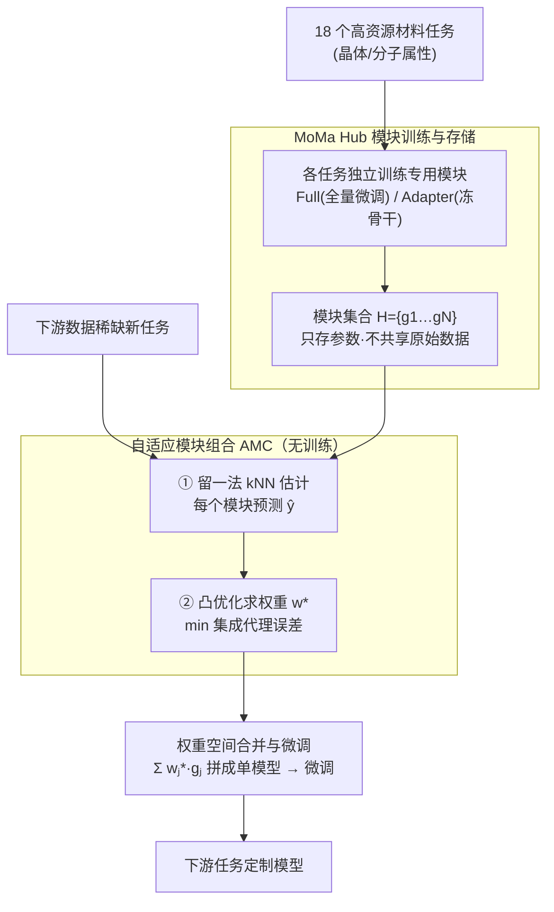

# MoMa: A Simple Modular Deep Learning Framework for Material Property Prediction

**会议**: ICLR 2026  
**arXiv**: [2502.15483](https://arxiv.org/abs/2502.15483)  
**代码**: [https://github.com/GenSI-THUAIR/MoMa](https://github.com/GenSI-THUAIR/MoMa)  
**领域**: 材料科学 / 模块化深度学习  
**关键词**: 材料属性预测, 模块化学习, 自适应组合, 迁移学习, 图神经网络

## 一句话总结
提出 MoMa 模块化材料属性预测框架，先在多任务上训练专用模块并集中存储为 MoMa Hub，再通过表示驱动的无训练自适应模块组合算法（AMC）为下游任务定制模型，在 17 个数据集上平均超越最强基线 14%。

## 研究背景与动机

**领域现状**：深度学习材料属性预测主要有两条路线：(1) 专用模型从头训练（如 CGCNN）；(2) 预训练-微调范式，尤其是大规模力场模型（如 JMP）在势能面数据上预训练后微调到下游任务。后者在多个任务上取得显著成功。

**现有痛点**：(1) **多样性**：材料任务涉及多种体系（晶体、有机分子）和属性（热稳定性、电子行为、力学性质），力场模型仅在势能面相关属性上预训练，泛化受限；(2) **差异性**：不同材料属性由不同物理定律支配，多任务联合训练导致知识冲突，单一模型难以兼顾。

**核心矛盾**：预训练范式追求"一个模型解决所有问题"，但材料任务的内在差异性使得联合训练反而引入负迁移。

**本文目标** (1) 如何利用多样化材料数据的知识而避免任务间冲突？(2) 如何在下游数据稀缺时高效适配？

**切入角度**：模块化学习——将每个任务封装为独立模块训练避免干扰，下游时自适应选择和组合最有协同效应的模块。

**核心 idea**：训练多样化任务专用模块存入 MoMa Hub，通过 kNN 表示空间估计 + 凸优化权重求解实现无训练自适应模块组合，再微调适配下游任务。

## 方法详解

### 整体框架
MoMa 把"训练知识"和"使用知识"拆成两个阶段。第一阶段在 18 个高资源材料属性数据集上各自独立训练一个专用模块，集中存进 MoMa Hub；第二阶段面对数据稀缺的新任务时，自适应模块组合算法（AMC）先用留一法 kNN 估计每个模块对该任务的亲和度，再用凸优化求出最优加权组合，最后把选中的模块在权重空间合并成单个初始化模型并微调。整套设计的核心赌注是：与其训一个大模型硬扛所有任务，不如让独立模块各管一摊、用时再按需拼装。

### 关键设计

**1. MoMa Hub 模块训练与存储：用独立训练隔离任务冲突**

材料任务彼此差异极大——晶体的热稳定性和有机分子的电子行为由完全不同的物理定律支配，把它们塞进一个多任务模型联合训练往往互相拖后腿。MoMa 的应对是为每个高资源任务单独训一个模块，互不干扰。所有模块以预训练好的 JMP 力场模型为共同骨干，提供两种形式：Full Module 对整个骨干做全量微调，Adapter Module 则冻结骨干、只训练插入的 adapter 层，参数代价小得多。最终得到模块集合 $\mathcal{H} = \{g_1, g_2, \ldots, g_N\}$，当前收录了 18 个来自 Matminer 的任务模块。Hub 的另一层价值在于只共享模型参数、不共享原始数据，天然保护数据隐私，也便于社区持续贡献新模块。

**2. 自适应模块组合 AMC：无训练地挑出并加权最有协同的模块**

下游任务样本少，既经不起搜索式试错（高差异模块上误差信号太嘈杂），也经不起训练路由网络（容易过拟合）。AMC 转而用"表示质量"代替"预测误差"作为监督信号，全程不引入可训练参数。它分三步：先把下游数据喂进每个模块 $g_j$ 得到表示 $\mathcal{X}^j$，用留一法 kNN 标签传播估计该模块的预测，$\hat{y}_i^j = \sum_{k \in \mathcal{N}_i} \frac{f_d(\mathbf{x}_i^j, \mathbf{x}_k^j)}{Z_i^j} y_k$，表示空间里近邻越靠得拢、预测越准，说明该模块越契合任务；再最小化集成代理误差 $E_\mathcal{D}(\mathbf{w}) = \frac{1}{M}\lVert\sum_j w_j \hat{\mathbf{y}}^j - \mathbf{y}\rVert_2^2$，在 $\sum_j w_j = 1,\, w_j \geq 0$ 的约束下做凸优化，求出每个模块的最优权重 $w_j^*$；最后按权重在参数空间合并 $g_\mathcal{D} = \sum_j w_j^* g_j$。整个过程 30 秒内收敛，而这个代理误差与最终微调 MAE 的 Pearson 相关超过 0.6，说明用它来选模块是靠谱的。

**3. 权重空间合并与微调：把多模块拼成单模型再适配**

AMC 给出权重后，MoMa 不是在推理时同时加载多个模块做集成，而是直接在参数空间把它们加权平均成一个模型。这一步能成立，靠的是线性模式连通性（linear mode connectivity）：所有模块都从同一个 JMP 预训练初始化出发，参数空间彼此兼容，加权平均不会破坏功能。合并后接上任务特定的预测头，在下游数据 $\mathcal{D}$ 上微调至收敛即可。好处是推理时只有一个模型，既省去多模块加载的计算开销，又保留了组合带来的协同知识。

### 损失函数 / 训练策略
模块训练和最终微调都用标准 MAE 损失，AMC 阶段则完全无需训练，权重由凸优化直接解出。评估覆盖 17 个低数据材料属性预测任务，每个任务跑 5 个数据分割 × 5 个随机种子以保证统计可靠性。

## 实验关键数据

### 主实验（17 个材料属性预测任务）

| 方法 | 平均排名 | Best/17 | 代表性任务 (3D Band Gap MAE) |
|--------|------|------|----------|
| MoMa (Full) | 1.35 | 14 | 0.200 |
| MoMa (Adapter) | 2.59 | 2 | 0.245 |
| JMP-FT | 3.12 | 1 | 0.249 |
| JMP-MT | 4.53 | 0 | 0.423 |
| UMA | 4.53 | 0 | 0.268 |
| MoE-(18) | 4.71 | 0 | 0.361 |
| CGCNN | 6.88 | 0 | 0.492 |

### 消融实验（AMC 组合策略对比）

| 配置 | vs AMC (MAE 增幅) | 说明 |
|------|---------|------|
| AMC (完整) | — | 最优 |
| Select Average | +11.0% | 保留 AMC 选的模块但均匀平均 |
| All Average (Model Soup) | +18.0% | 平均所有模块 |
| Random Selection | +20.2% | 随机选等数量模块 |

### 关键发现
- MoMa (Full) 在 16/17 任务上位列前二，平均提升 14% vs JMP-FT，24.8% vs JMP-MT
- 少样本场景优势更大：10-shot 下 MoMa 归一化 MAE 0.550 vs JMP-FT 0.700（-21%）
- Hub 扩展性：从 5 模块到 30 模块，归一化 MAE 从 0.204 单调下降到 0.176
- AMC 权重提供材料属性关系洞察：如介电常数预测高权重分配给带隙模块（物理直觉一致）
- Orb-v2 骨干上同样有效（13/17 任务提升，平均 +6.1%），验证骨干无关性

## 亮点与洞察
- 模块化范式巧妙解决了材料科学中"多样性 vs 差异性"的矛盾：独立训练避免冲突，自适应组合利用协同，两全其美
- AMC 的表示驱动 + 无训练设计特别适合数据稀缺的材料科学场景，代理误差的理论和经验验证令人信服

## 局限与展望
- MoMa Hub 目前仅包含 18 个晶体任务 + 12 个 QM9 分子任务，覆盖面仍有限
- 权重空间合并依赖线性模式连通性假设，当模块极度分化时可能失效
- AMC 的 kNN 估计在极低数据（<10 样本）时可能不稳定

## 相关工作与启发
- **vs JMP**: JMP 用多任务联合预训练（MT），MoMa 证明独立训练 + 自适应组合优于 MT（16/17 任务），暗示多任务损失在异质材料任务上引入严重负迁移
- **vs Model Soup**: 简单平均所有模块表现差（+18% MAE），AMC 的自适应权重优化至关重要
- **vs MoE-(18)**: 路由网络方法在 17 个任务上排名 4.71，AMC 的表示驱动策略更稳定

## 评分
- 新颖性: ⭐⭐⭐⭐ 模块化学习引入材料科学领域是新范式，AMC 算法设计合理
- 实验充分度: ⭐⭐⭐⭐⭐ 17 任务 × 5 分割 × 5 种子，消融/少样本/扩展性/多骨干全面覆盖
- 写作质量: ⭐⭐⭐⭐ 框架图清晰，实验叙述完整，动机铺垫充分
- 价值: ⭐⭐⭐⭐ 开源平台设计有望推动材料科学模块化知识共享

<!-- RELATED:START -->

## 相关论文

- [\[ICLR 2026\] Intrinsic Training Dynamics of Deep Neural Networks](intrinsic_training_dynamics_of_deep_neural_networks.md)
- [\[CVPR 2025\] A Unified Framework for Heterogeneous Semi-supervised Learning](../../CVPR2025/llm_pretraining/a_unified_framework_for_heterogeneous_semi-supervised_learning.md)
- [\[ICML 2025\] Algebra Unveils Deep Learning -- An Invitation to Neuroalgebraic Geometry](../../ICML2025/llm_pretraining/algebra_unveils_deep_learning_--_an_invitation_to_neuroalgebraic_geometry.md)
- [\[ICLR 2026\] Beyond Multi-Token Prediction: Pretraining LLMs with Future Summaries](beyond_multi-token_prediction_pretraining_llms_with_future_summaries.md)
- [\[ICLR 2026\] Accessible, Realistic, and Fair Evaluation of Positive-Unlabeled Learning Algorithms](accessible_realistic_and_fair_evaluation_of_positive-unlabeled_learning_algorith.md)

<!-- RELATED:END -->
