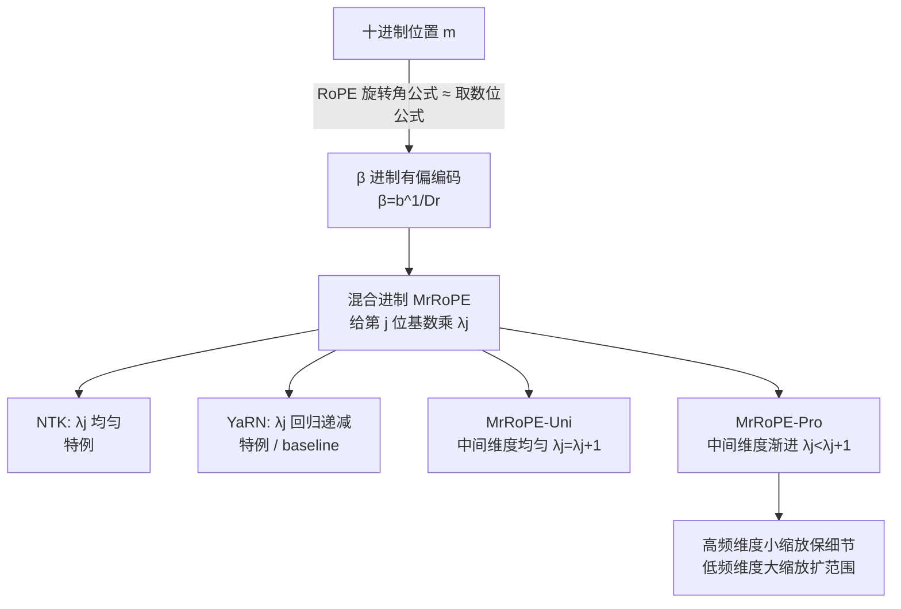

# MrRoPE: Mixed-radix Rotary Position Embedding

**会议**: ICLR 2026  
**OpenReview**: [https://openreview.net/forum?id=1J63FJYJKg](https://openreview.net/forum?id=1J63FJYJKg)  
**代码**: 待确认  
**领域**: 大模型预训练 / 长上下文外推  
**关键词**: RoPE, 位置编码, 长上下文外推, 进制转换, training-free  

## 一句话总结
本文从「进制（radix）转换」的视角重新审视 RoPE，提出统一框架 MrRoPE，把 PI / NTK / YaRN 等一众外推方法都解释为不同的混合进制转换策略，并据此设计出无需微调的 MrRoPE-Pro（渐进式进制转换），在 128K 长上下文上把 YaRN 的检索/对话精度翻倍。

## 研究背景与动机
- **领域现状**：RoPE 是当前几乎所有主流 LLM 的位置编码基座，它把每个维度的位置信息编码为不同频率的旋转角，高维旋转慢、低维旋转快。为了让「短训练、长测试」成立，社区涌现出一大批 RoPE 外推方法——PI 线性插值、NTK-aware 缩放、YaRN 的分段（NTK-by-parts）策略等。
- **现有痛点**：这些方法各自为政、动机各异，缺乏统一的理论解释。为什么 NTK 要均匀缩放？为什么 YaRN 要把维度分成高/中/低三段、中间段用线性插值？这些选择更像工程经验的拼凑，没人能说清「最优的频率重分配策略」长什么样。继续训练扩窗又太贵（Llama2-70B 扩到 32K 要 57740 GPU 小时）。
- **核心矛盾**：RoPE 泛化失败的根因是**高维「未完成一个周期」**——当 $L/\theta_j < 2\pi$ 时，这些维度在训练时从未见过完整的旋转角，测试时遇到 OOD 角度就崩。各家方法本质都在「重分配各维度的旋转周期」，但缺一把统一的尺子来衡量谁分得更好。
- **本文目标**：建立一个能把现有外推方法全部纳入的统一理论框架，并在框架指导下找到比 YaRN 更优的中间维度转换策略。
- **核心 idea**：**RoPE 本质是一次有偏的进制转换**——把十进制位置 $m$ 转写成 $b^{1/D_r}$ 进制的数字串；那么「扩窗」就等价于「给某些数位扩大进制基数」，于是所有外推方法都成为同一套混合进制系统下 $\lambda$ 向量的不同取值。

## 方法详解

### 整体框架
MrRoPE 的核心是把 RoPE 的旋转角公式与进制转换的取数位公式对齐：两者都靠取模/周期产生进位，只要忽略取整和模周期，RoPE 就是一次十进制→ $\beta$ 进制（$\beta=b^{1/D_r}$）的转换。在此基础上，给第 $j$ 个数位的基数乘上一个缩放因子 $\lambda_j$，就得到「混合进制 RoPE（MrRoPE）」的统一公式；不同外推方法对应不同的 $\lambda=\{\lambda_1,...,\lambda_{D_r}\}$ 取值。作者据此把 NTK（均匀缩放）、YaRN（回归式缩放）都还原为框架的特例，再提出两个新策略 MrRoPE-Uni（均匀）和 MrRoPE-Pro（渐进），系统比较中间维度该如何转换。

### 关键设计

**1. 把 RoPE 重写成有偏进制编码：理论的起点。** RoPE 把 $q/k$ 向量切成 $D_r=|D|/2$ 块，第 $j$ 块的旋转角为 $m\theta_j=(m\cdot b^{-(j-1)/D_r})\bmod 2\pi$。作者观察到这与进制取数位公式 $(m_{(\beta)})_j=\lfloor m\cdot\beta^{-(j-1)}\rfloor\bmod\beta$ 惊人地相似——当 $\beta=b^{1/D_r}$ 时两者共享 $m\cdot\beta^{-(j-1)}$ 这一项，且模运算与三角函数都贡献周期性。于是把之前被忽略的取整和模重新放回，可恢复出一个有偏位置估计 $\hat m=\sum_j \beta^{(j-1)}(m\theta_j)$。实验（Figure 2）显示 $\hat m$ 随真实位置近似线性，且 base 越大线性区间越长——这正解释了「为什么增大 base 能扩窗」，把工程直觉落到了理论上。

**2. 混合进制扩窗：把外推统一成 $\lambda$ 向量的选择。** OOD 问题对应进制系统里的「高位永不进位」：当输入限制在 $[0,L]$，从第 $d$ 位起 $\lfloor L\cdot\beta^{-(j-1)}\rfloor\bmod\beta<\beta-1$，高位从未走完一个进位周期。要扩展这种失衡的进制系统，自然做法是给低位（$d$ 之前）扩大基数。形式化为给第 $j$ 位乘 $\lambda_j$，则可表示范围放大 $\prod_j\lambda_j$ 倍，对应到 RoPE 即 $m\theta'_j=(m\cdot b^{-(j-1)/D_r}/\prod_{d=1}^{j-1}\lambda_d)\bmod 2\pi$。这条公式就是 MrRoPE 框架：**任何满足此式的外推方法都是一次对位置编码的混合进制转换**。NTK 对应均匀 $\lambda_j=S^{1/(D_r-1)}$；YaRN 对应高低频不转换（$\lambda_j=1$）、中频做线性插值——作者证明 YaRN 隐式是一种**回归式缩放（$\lambda_j>\lambda_{j+1}$）**。

**3. MrRoPE-Pro：渐进式进制转换，本文最优策略。** 既然中间维度的转换方式是关键自由度，作者提出三类候选：均匀（$\lambda_j=\lambda_{j+1}$，即 MrRoPE-Uni）、回归（YaRN）、渐进（$\lambda_j<\lambda_{j+1}$，即 MrRoPE-Pro）。Pro 的设计哲学是「**高频维度小缩放、低频维度大缩放**」：低维（高频）承载局部细粒度位置，应尽量少扰动；高维（低频）才是 OOD 重灾区，应大幅扩展。令 $\lambda_j=S^{\epsilon_j}$，并设 $\epsilon$ 为等差数列、约束 $\sum\epsilon_j=1$，解得中间维度 $\epsilon_j=\frac{2(1+j-d_l)}{(1+d_h-d_l)(d_h-d_l)}$，形成从缓到陡的缩放曲线。这样既避免高维 OOD，又保留原 RoPE 高频结构。

**4. 统一公式与可证的上界提升。** 总公式对低/高频维度取 $\lambda_d=1$，中间维度按 Uni 或 Pro 公式取值，其余实现技巧（$d_l,d_h$ 取值等）与 YaRN 一致——即本文与 YaRN 的唯一本质差异就在中间维度的外推策略上。作者进一步基于 RoPE Bound Theory + 余弦相似度证明，MrRoPE-Pro 显著抬高了 RoPE 可达编码长度的理论上界，并稳定了中间维度的注意力分数分布，为「为什么 Pro 更好」给出了理论支撑而非纯经验。

## 实验关键数据

### 主实验
在 LLaMA3-8B / Qwen2.5-3B 上的 RULER 检索基准（全 13 子任务），训练窗扩到 128K：

| 模型 | 方法 | 8K | 16K | 32K | 64K | 128K |
|---|---|---|---|---|---|---|
| LLaMA3-8B | YaRN | 95.5 | 92.1 | 92.7 | 89.5 | 79.9 |
| LLaMA3-8B | **MrRoPE-Pro** | **96.2** | **94.2** | **94.3** | **91.3** | **86.6** |
| Qwen2.5-3B | YaRN | 78.1 | 77.7 | 75.6 | 63.2 | 50.1 |
| Qwen2.5-3B | **MrRoPE-Pro** | **82.3** | **82.9** | **78.5** | **70.4** | **53.2** |

YaRN 在 64K→128K 从 89.5 急跌到 79.9，MrRoPE-Pro 仅微降到 86.6，长端稳定性优势明显。Infinite-Bench（100K–128K）上 MrRoPE-Pro 在 KV Retrieve（27% vs 9%）、QA Dialogue（22% vs 10%）大幅超过 YaRN，Passkey Retrieval 达 100%（追平 GPT-4），并在多个子集上超过专门微调的 Yi-34B-200K、Kimi-Chat——全程无需训练。

### 消融实验
Proofpile 困惑度（越低越好，对比中间维度三种转换策略）：

| 模型 | 方法 | 8K | 16K | 32K | 64K | 128K |
|---|---|---|---|---|---|---|
| LLaMA3-8B | YaRN（回归） | 3.68 | 3.08 | 2.75 | 2.49 | 2.38 |
| LLaMA3-8B | MrRoPE-Uni（均匀） | 3.66 | 3.06 | 2.74 | 2.47 | 2.41 |
| LLaMA3-8B | **MrRoPE-Pro（渐进）** | **3.63** | **3.03** | **2.71** | **2.45** | **2.34** |

Uni 在短端好于 YaRN 但长端略差；只有 Pro 在全程（8K→128K）都拿到最低困惑度，验证「渐进式」优于「均匀」和「回归」。

### 关键发现
- **NIAH 大海捞针**：MrRoPE-Pro 把 LLaMA3-8B 的有效窗口推到 ≥96K，即便在 120K（训练长度的 15×）仍在多数深度保持 >85% recall，而 YaRN 早早退化。
- **YaRN 的回归式缩放有内在缺陷**：它在低维空间做转换会扰动局部位置信息，导致短上下文反而变差——这恰好印证了 Pro「低维少扰动」的设计动机。

## 亮点与洞察
- **统一视角的优雅**：用「进制转换」一把尺子量遍 PI/NTK/YaRN，让原本零散的外推 trick 变成 $\lambda$ 向量的不同取值，这种「把工程经验收敛成一条公理」的工作极具解释力。
- **理论与实践闭环**：不仅提出框架，还据此预测「渐进优于回归」并实证验证，最后再用 RoPE Bound Theory 反过来证明上界提升，形成「理论→设计→实验→理论」的完整回路。
- **完全 training-free**：所有结果不需任何微调，部署成本几乎为零，对工业界扩窗极友好。

## 局限与展望
- **中间维度仍是经验设计**：Pro 假设 $\epsilon$ 为等差数列，是众多渐进形态中的一种特解；是否存在更优的非线性渐进曲线、$d_l/d_h$ 边界如何自适应，文中未充分探索。
- **模型规模偏小**：实验集中在 3B–8B，未验证在 70B+ 或 MoE 大模型上的表现，超长（>128K）场景的稳定性也只到 15× 训练长度。
- **任务覆盖**：主要是检索/语言建模类长上下文任务，对长链推理、多跳 QA 等更复杂能力的影响尚待评估。

## 相关工作与启发
- **RoPE 与外推谱系**：PI（线性插值）、NTK-aware（均匀缩放）、YaRN（NTK-by-parts 分段）是本文统一框架的三大特例，YaRN 被进一步证明为「回归式」并作为主 baseline。
- **理论工具**：借鉴了 RoPE Bound Theory（Men et al. 2024）的余弦相似度上界分析、以及注意力分数在中间维度的稳定性分析（Liu et al. 2023b; Barbero et al. 2024）。
- **启发**：把位置编码理解为「数制」是一个可迁移的视角——后续工作或可沿此设计可学习的 $\lambda$ 向量、或把混合进制思想推广到多维位置（如 2D 图像、视频 RoPE）。

## 评分
- **新颖性**: ⭐⭐⭐⭐⭐ 「RoPE = 有偏进制转换」是一个真正新的、且能统一现有方法的理论视角，远超「又一个外推 trick」。
- **实验充分度**: ⭐⭐⭐⭐ 覆盖困惑度/RULER/NIAH/Infinite-Bench 多基准、多模型、长达 128K，消融清晰；但模型规模偏小、超长端验证有限。
- **写作质量**: ⭐⭐⭐⭐ 理论推导环环相扣、图示（统一框架图、累积缩放因子曲线）到位，公式略密但逻辑顺畅。
- **价值**: ⭐⭐⭐⭐⭐ 既给社区一个统一理解 RoPE 外推的理论框架，又交付了 training-free 且 SoTA 的实用方法，理论与落地双赢。

<!-- RELATED:START -->

## 相关论文

- [\[ICLR 2026\] Selective Rotary Position Embedding](selective_rotary_position_embedding.md)
- [\[ICLR 2026\] LLM-JEPA: Large Language Models Meet Joint Embedding Predictive Architectures](llm-jepa_large_language_models_meet_joint_embedding_predictive_architectures.md)
- [\[ICLR 2026\] Deconstructing Positional Information: From Attention Logits to Training Biases](deconstructing_positional_information_from_attention_logits_to_training_biases.md)
- [\[ICLR 2026\] Beyond URLs: Metadata Diversity and Position for Efficient LLM Pretraining](beyond_urls_metadata_diversity_and_position_for_efficient_llm_pretraining.md)
- [\[ICLR 2026\] Scaling Laws Revisited: Modeling the Role of Data Quality in Language Model Pretraining](scaling_laws_revisited_modeling_the_role_of_data_quality_in_language_model_pretr.md)

<!-- RELATED:END -->
