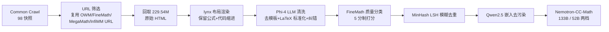

# Nemotron-CC-Math: A 133 Billion-Token-Scale High Quality Math Pretraining Dataset

**会议**: ICLR 2026  
**OpenReview**: [https://openreview.net/forum?id=rhPnkTKfMy](https://openreview.net/forum?id=rhPnkTKfMy)  
**代码**: [NVIDIA-NeMo/Curator (tutorials/math)](https://github.com/NVIDIA-NeMo/Curator/tree/main/tutorials/math) · [数据集](https://huggingface.co/datasets/nvidia/Nemotron-CC-Math-v1)  
**领域**: LLM 预训练数据 / 数学语料构建  
**关键词**: 数学预训练语料, Common Crawl, HTML 抽取, LaTeX 标准化, 数据清洗  

## 一句话总结
用「lynx 布局渲染 + 轻量 LLM 清洗」的领域无关流水线，从 Common Crawl 中可靠抽取并标准化数学/代码内容，构建出迄今最高质量的开源数学预训练语料 Nemotron-CC-Math（133B token），在数学、代码、通用知识任务上全面超越 FineMath、MegaMath、OpenWebMath。

## 研究背景与动机
**领域现状**：数学和代码这类高质量结构化数据对 LLM 推理能力至关重要，O1、DeepSeek-R1 等模型的数学能力高度依赖大规模高质量数学预训练数据。但 DeepSeekMath、Minerva、Qwen-2.5-Math 等 SOTA 模型用的数学语料并未公开，开源替代品（OpenWebMath、FineMath、InfiMM-WebMath、MathPile）在规模和保真度上都受限。

**现有痛点**：开源数学语料的核心瓶颈在**抽取流水线**——网页上的数学公式格式极度多样（MathML、LaTeX、KaTeX、MathJax、图片、自定义分隔符、`<pre>` 块等，见论文 Figure 2），且渲染策略不断演化，任何固定启发式规则都很脆弱。通用文本抽取工具（jusText、Trafilatura、Resiliparse）是为「去模板 + 提取叙事文本」设计的，会剥离或损坏公式、丢失行内 LaTeX、压平需要严格缩进的代码块。更糟的是，Common Crawl 里的 HTML 往往缺失配套的 CSS/JS，无法正常渲染，进一步阻碍公式恢复。

**核心矛盾**：Common Crawl 是大规模预训练的主要来源，但其数学价值远未被挖掘——一方面数学内容占比 < 1% 使得训分类器极难（人工标注困难、只有 FastText 这类极快方法可行，召回率一升精度就崩），另一方面 DOM-based 解析器又系统性破坏数学结构。

**本文目标**：构建一个**模块化、可扩展、领域无关**的框架，从原始网页中可靠抽取数学富集内容，产出大规模高保真数学语料。

**核心 idea**：**「用文本浏览器渲染替代 DOM 解析 + 用 LLM 标准化替代启发式规则」**。先用 lynx 文本浏览器执行 HTML 布局规则、把网页渲染成保留公式与代码缩进的纯文本，再用一个轻量 LLM 把异构数学表示统一成 LaTeX、去除模板噪声并纠错。

## 方法详解

### 整体框架
流水线从 Common Crawl（98 个快照，2014–2024）出发：先复用社区已过滤数据集（OWM、InfiMM-WebMath、FineMath、MegaMath）的 URL 列表筛出数学页面，回取 229.54M 原始 HTML；经 lynx 渲染 → Phi-4 LLM 清洗与 LaTeX 标准化 → FineMath 质量分类 → 模糊去重 → 去污染，最终得到 101.15M 文档、133.26B token 的 Nemotron-CC-Math。

### 关键设计

**1. 用 URL 复用绕开「分类器困境」：** 作者一开始也想训一个轻量分类器识别技术页面，但发现这条路存在根本性矛盾——数学内容在 Common Crawl 中占比不到 1%，人工标注 ground truth 极难；而分类器要扫全量 Common Crawl，只有 FastText 配简化 HTML 解析这类极快方法才可行，这天然导致高偏差，提升召回必然伴随精度暴跌。与其在这种分类器上做边际优化，作者转而直接抽取 OWM、InfiMM-WebMath、FineMath、MegaMath 四个社区数据集的 URL（含所有主要子集），从而一次性继承多个研究组各自不同的过滤策略，规避了单一分类器的局限。

**2. lynx 文本浏览器做 HTML→纯文本的「结构保真」渲染：** 这是全文最关键的设计选择。原始 WARC 里的 HTML 太冗长无法直接喂 LLM，而传统 DOM-based 解析器（前作普遍采用）会丢失关键信息。lynx 的特殊之处在于它**真正执行 HTML 的 layout 规则**，产出与人类视觉感知一致的页面结构，从而可靠捕获公式、维持代码缩进。相比之下，jusText/Trafilatura/Resiliparse 这些为通用去模板设计的工具会改变行内公式语义、压平 Python 这类依赖缩进的代码块。lynx 这一步保证了「结构层」的完整。

**3. 轻量 LLM 做「语义层」清洗与 LaTeX 统一：** lynx 输出仍含导航栏、冗余页眉等模板噪声。作者用 **Phi-4（14B）** 做一遍清洗：保留正文与引用、删除非必要内容，同时把 MathML、自定义分隔符、`<pre>` 块、图片 alt 等各种数学表示**统一标准化成 LaTeX**（论文 Figure 2 列举了 7 种输入格式映射到同一个 `f(x)=x^{2}`），并修正排版错误。「lynx 结构保真 + LLM 语义精炼」两段式，避免了前作脆弱的启发式规则。消融显示这个清洗任务足够简单，小模型即可胜任，无需大模型。

**4. 模糊去重 + 严格去污染保证训练安全：** 去重用 NeMo-Curator 的 MinHash LSH，命中同桶概率 $P = 1 - (1 - S^{b})^{r}$，取 $r{=}20$ 个 band、每 band $b{=}13$ 个哈希函数，目标 Jaccard 相似度阈值 0.8，相似度用 24-gram 计算。去污染则用 Qwen2.5 32B 把所有文档与 MMLU/MMLU-Pro/MATH/GSM8K 的 prompt/answer 嵌入，余弦相似度 > 0.9 的文档全部移除（实际仅移除 < 0.002% 文档）。两档产物：Nemotron-CC-Math-4+（分数 4–5，52.32B token / 45M 文档）和 Nemotron-CC-Math-3+（分数 3–5，133.26B token / 101M 文档）。

## 实验关键数据

**实验设置**：在 Nemotron-T 8B 模型的中训练 checkpoint 上做退火消融——把目标数学数据集上采样到占 30% 数据混合，其余 70% 按比例下调，以隔离数学数据的贡献。两档：100B token 退火（比小而精的 ≤30B 数据集，如 FineMath-4+/MegaMath-Pro/OWM）和 300B token 退火（比更大的 FineMath-3+/MegaMath-Web）。

### 主实验表格

100B token 退火（与 4+ 档高质量数据集对比，节选）：

| 指标 | OWM | MegaMath-Pro | FineMath-4+ | **Nemotron-CC-Math-4+** |
|---|---|---|---|---|
| MATH (EM) | 29.20 | 34.00 | 35.80 | **40.60** |
| GSM8K (EM) | 71.42 | 73.46 | 75.97 | **76.27** |
| HumanEval+ (avg@20) | 32.53 | 31.01 | 32.16 | **34.82** |
| MBPP+ (avg@20) | 43.76 | 46.03 | 28.88 | 45.11 |
| MMLU-Pro (EM) | 35.49 | 36.41 | 36.74 | **38.49** |
| MMLU-Stem (EM) | 58.83 | 60.86 | 61.62 | **62.67** |

300B token 退火（与 3+ 档大规模数据集对比，节选）：

| 指标 | OWM | MegaMath-Web | FineMath-3+ | **Nemotron-CC-Math-3+** |
|---|---|---|---|---|
| MATH (EM) | 34.20 | 31.60 | 34.60 | **44.20** |
| GSM8K (EM) | 76.42 | 78.24 | 79.45 | **80.06** |
| HumanEval+ (avg@20) | 33.54 | 32.29 | 34.18 | **37.16** |
| MBPP+ (avg@20) | 37.59 | 38.89 | 29.19 | **43.51** |
| MMLU-Stem (EM) | 59.20 | 59.88 | 62.29 | **64.26** |

数据集规模对比：Nemotron-CC-Math-4+ 含 52.32B token，是此前最高质量开源数学数据集 FineMath-4+（9.6B）的 **5.5×**。

### 消融实验表格

清洗模型选择（采样 7M 文档，比较不同 instruction-tuned LLM 做模板去除）：

| 模型 | 参数量 | MATH (EM) | GSM8K (EM) |
|---|---|---|---|
| DeepSeek-V3 | 671B | — | — |
| Qwen2.5-72B-Instruct | 72B | — | — |
| **Phi-4** | **14B** | **40.6** | **79.98** |

Phi-4 以 14B 的体量在数学任务上取得最佳，匹配甚至超过 DeepSeek-V3（671B）和 Qwen2.5-72B，因此被选为默认清洗模型。

### 关键发现
- **质量随训练规模放大**：100B → 300B，MATH 从 40.6 提升到 44.2，说明高质量数据持续随训练 scale 起效。
- **意外的代码增益**：尽管未刻意针对代码域，Nemotron-CC-Math-3+/4+ 分别含约 4.3M / 1.44M 带代码片段的样本，流水线完整保留了代码语法与结构，MBPP+ 相对 FineMath-3+ 提升高达 +14.32。
- **LLM-aided 质量评估**：用 GPT-5.1 作 judge 在 100 个共享样本上从「数学保留/代码保留/忠实度/可读性」四维打分，Nemotron-CC-Math 在数学与代码保留上得分最高（如 Math 2.87、Code 3.00），可读性也最高。
- 模板去除任务无需大模型，小型 instruction-tuned 模型即可高效完成。

## 亮点与洞察
- **范式转变**：首次用文本浏览器 lynx 做 HTML→纯文本并保留数学/代码格式，并引入 LLM 标准化数学表示，把「靠脆弱启发式规则」换成「靠布局渲染 + LLM 语义清洗」，是抽取方法论上的实质性进步。
- **领域无关**：流水线本身不绑定数学，只是应用到数学域，原则上可推广到物理、CS、统计等任何技术内容抽取。
- **工程可扩展**：用 Polars + Ray 优化，能高效处理 TB 级 HTML，使全量 Common Crawl 规模处理成为可能。
- **完全开源**：数据集 + 完整流水线（抽取/处理/打分）全部释出，对社区复现与扩展价值很高。

## 局限与展望
- **依赖外部 LLM 清洗**：Phi-4 清洗这一步引入了模型偏好与潜在幻觉/改写风险，标准化过程是否会在边缘 case 上改变公式语义，缺乏大规模人工核验。
- **URL 复用继承上游偏差**：通过抽取 OWM/FineMath/MegaMath 的 URL 来定位数学页面，意味着覆盖范围受限于这些上游数据集的过滤策略，可能漏掉它们都没覆盖的数学网页。
- **评估以 8B 模型退火为主**：未在更大规模模型或从头预训练设置下验证，质量增益能否在更大模型上保持有待确认。
- **质量评估样本量小**：LLM-aided 评估仅在 97,788 共享样本里抽 100 个，规模有限。
- 展望：把该流水线推广到其他科学域、探索更轻量的清洗模型、以及在更大模型上验证 scaling 行为。

## 相关工作与启发
- **数学预训练语料**：OpenWebMath、FineMath、InfiMM-WebMath、MathPile、MegaMath、DeepSeekMath、Minerva 等是直接对标对象，本文在规模与保真度上同时超越开源同类。
- **文本抽取工具**：jusText、Trafilatura、Resiliparse 是被本文指出「损坏数学/代码」的通用工具，凸显了领域专用抽取的必要性。
- **去重/去污染**：沿用 MinHash LSH（NeMo-Curator）和基于嵌入的去污染流程。
- **启发**：「换一个能执行 layout 的渲染器（lynx）+ 让 LLM 接管标准化」这一思路，对任何需要从脏 HTML 抽取结构化技术内容（公式、代码、表格）的数据工程都有借鉴意义；同时印证了「高质量数学数据不仅提升数学，还连带提升代码与通用推理」。

## 评分
- **新颖性**: ⭐⭐⭐⭐ — lynx 渲染 + LLM 标准化的组合在数学语料抽取上是首创，方法论上有实质创新，但单点技术（lynx、Phi-4 清洗、MinHash 去重）均为已有工具的巧妙组装。
- **实验充分度**: ⭐⭐⭐⭐ — 100B/300B 双档退火、多基线对比、清洗模型消融、LLM-aided 质量评估覆盖完整，唯独缺更大模型与从头预训练验证。
- **写作质量**: ⭐⭐⭐⭐ — 动机清晰、痛点剖析到位（Figure 2 的格式多样性极具说服力），流水线讲解有条理。
- **价值**: ⭐⭐⭐⭐⭐ — 释出迄今最高质量开源数学语料（133B token，FineMath-4+ 的 5.5×）+ 完整流水线，对开源数学/推理模型预训练是即取即用的高价值资产。

<!-- RELATED:START -->

## 相关论文

- [\[ICLR 2026\] GneissWeb: Preparing High Quality Data for LLMs at Scale](gneissweb_preparing_high_quality_data_for_llms_at_scale.md)
- [\[ACL 2025\] Nemotron-CC: Transforming Common Crawl into a Refined Long-Horizon Pretraining Dataset](../../ACL2025/llm_pretraining/nemotron_cc_pretraining_data.md)
- [\[ICLR 2026\] Rewriting Pre-training Data Boosts LLM Performance in Math and Code](rewriting_pre-training_data_boosts_llm_performance_in_math_and_code.md)
- [\[ICLR 2026\] Scaling Laws Revisited: Modeling the Role of Data Quality in Language Model Pretraining](scaling_laws_revisited_modeling_the_role_of_data_quality_in_language_model_pretr.md)
- [\[ICLR 2026\] FictionalQA: A Dataset for Studying Memorization and Knowledge Acquisition](fictionalqa_a_dataset_for_studying_memorization_and_knowledge_acquisition.md)

<!-- RELATED:END -->
