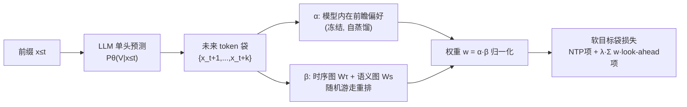

# Next-ToBE: Probabilistic Next Token-Bag Exploitation for Activating Anticipatory Capacity in LLMs

**会议**: ICLR 2026  
**OpenReview**: [https://openreview.net/forum?id=T8IJojfaOh](https://openreview.net/forum?id=T8IJojfaOh)  
**代码**: 待确认  
**领域**: LLM 预训练 / 训练目标  
**关键词**: 下一词预测, 多词预测, 前瞻能力, 软目标分布, 推理增强  

## 一句话总结
Next-ToBE 把标准 NTP 的 one-hot 目标换成一个覆盖未来窗口内多个 token 的"软目标袋分布"，不加任何额外参数就激活了 LLM 本就潜藏的"前瞻规划"能力，在数学/代码/常识推理上稳定超过 MTP 等强基线。

## 研究背景与动机
**领域现状**：自回归 LLM 虽然只被训练去预测下一个 token，但已有大量证据表明它具备"前瞻能力"——中间层隐状态能预测更远的未来 token，甚至在生成第一个 token 之前就已编码了全局响应特征。这种"先想后说"的能力对数学推理、代码生成等需要多步规划与长程逻辑一致性的任务至关重要。

**现有痛点**：NTP 的 one-hot 拟合目标会无意中**压制**这种前瞻能力——它把概率质量强行压向"唯一正确答案"，偏向 token 的边际分布，鼓励短程模式匹配、惩罚合理的高置信替代词（同义词/复述），从而削弱长程语义建模和多步规划。为弥补这点，多词预测（MTP）用多个并行辅助预测头同时预测多个未来 token，但它仍有问题：**额外参数/显存开销大**，且依然依赖 one-hot 拟合目标，继承了语义灵活性下降、概率过度集中等固有缺陷。

**核心矛盾**：LLM 内在就有前瞻能力且与生成质量正相关，但主流训练范式（NTP 与 MTP）要么压制它、要么以高成本绕过它，**少有工作系统地刻画并直接激活这种能力**。

**本文目标**：在不改架构、不加参数的前提下，量化、增强并利用 LLM 的前瞻能力以提升推理表现。

**核心 idea（软目标袋拟合）**：把 NTP 的 one-hot 目标替换为一个由未来窗口内 token 构成的**灵活"token 袋"分布**——立即下一个 token 仍占主导，更远的"look-ahead token"按其与模型内在偏好、时序与语义相关性动态加权后一并纳入监督，从而注入前瞻压力，同时尊重预训练模型的固有倾向以保持训练稳定。

## 方法详解

### 整体框架
Next-ToBE 在每个时间步构造一个长度为 $k$ 的"未来 token 袋" $\{x_{t+1},\dots,x_{t+k}\}$，把它转成一个软目标分布去拟合：第一项是标准 NTP（拟合立即下一词 $x_{t+1}$），第二项对 $k-1$ 个 look-ahead token 加权拟合。权重 $w_{x_{t+j}}=\alpha_{x_{t+j}}\beta_{x_{t+j}}$ 由两路信号相乘得到——$\alpha$ 编码模型自身的前瞻偏好，$\beta$ 编码时序-语义相关性（经随机游走重排）。推理时仍是单头、一次一 token，恰恰是这种逐 token 生成过程不断激活了潜在前瞻能力。它本质处在 NTP 与 MTP 之间：单头如 NTP，但每步考虑多个未来 token 如 MTP。

### 关键设计

**1. 前瞻能力的可量化刻画（FtHR）：先证明"它确实在前瞻"。** 方法立论的前提是 LLM 本就在前瞻，作者用未来 token 命中率 $\text{FtHR}^k_m=\frac{1}{k(N-k-1)}\sum_t\sum_{j=1}^k \mathbb{1}\{x_{t+j}\in\text{top}_m[P_\theta(V|x_{\le t})]\}$ 量化当前步 softmax 的 top-$m$ 槽位对未来 $k$ 个 token 的"预捕获"程度。Qwen-Math-1.5B 上 $\text{FtHR}^k_{50}$ 在窗口 2→10 时从 0.79 降到 0.40，说明模型在每一步都看到了远处的未来 token；更关键的是，未来 token 在当前预测里的排名越高，它日后被自回归生成出来的概率就越高——前瞻能力与生成准确率正相关。这条经验关系为"激活前瞻=提升生成"提供了依据。

**2. 软目标袋损失：用 one-hot 加权未来项替代纯 one-hot。** 训练目标写成 $L=-\sum_t\big[\log P_\theta(x_{t+1}|x_{\le t})+\lambda\sum_{j=2}^k w_{x_{t+j}}\log P_\theta(x_{t+j}|x_{\le t})\big]$，第一项保证局部连贯、防止语义漂移并稳定大规模优化，因此用小系数 $\lambda\in(0,1)$（实验取 0.05）让它占主导；第二项把 $k-1$ 个未来 token 作为额外监督注入前瞻压力。整个修改只动目标分布、不加任何参数，可直接嵌入标准 NTP 训练，本质是一种"标签平滑"的特殊形式——用未来 token 的时序-语义关系来软化立即下一词的 one-hot 标签。

**3. 双路权重 $w=\alpha\beta$：既尊重模型自身偏好，又注入数据侧相关性。** $\alpha_{x_{t+j}}=P_\theta(x_{t+j}|x_{\le t})^\gamma$（$\gamma=1/10$，并以阈值 $\varepsilon$ 滤掉过小概率、训练中冻结不回传梯度）追踪 LLM 当前对未来 token 的预捕获偏好，相当于一种自蒸馏，保留基座的知识与置信、缓解训练信号与已有预测的冲突；$\beta$ 则编码外部数据信号——时序得分 $\tau(t{+}j)=\exp(-j^2/2h^2)$ 让远处 token 权重衰减，语义得分 $s(t{+}j)=\exp(x_{t+1}^\top x_{t+j})$ 让与下一词语义近的 token 更重要。只有同时被模型预捕获、又真实出现在近未来窗口的 token 才会被优先拟合。

**4. 随机游走重排：建模 look-ahead token 之间的相互依赖。** 简单点乘的 $\beta$ 忽略了 $k-1$ 个未来 token 彼此的关系。作者对 token 袋构造 $k\times k$ 的时序矩阵 $W_\tau$ 与语义矩阵 $W_s$，融合为转移矩阵（实验中矩阵相乘 $W=W_\tau W_s$ 即 ASAP-attention，优于加权和），再从立即下一词 $x_{t+1}$ 出发做带跳回概率 $\rho$ 的随机游走 $\beta^{(q+1)}=(1-\rho)W\beta^{(q)}+\rho e^{(0)}$，收敛闭式解 $\beta^*=(I-(1-\rho)W)^{-1}e^{(0)}$ 同时刻画了下一词与各 look-ahead token、以及 look-ahead token 之间的关系，比点对点融合显著更好。

**5. 归一化目标：避免极小概率主导损失。** 未来 token 的实际概率可能低至 $10^{-7}$，直接取对数会产生极大负值并主导损失、引发训练不稳。作者把第二项的概率在 look-ahead token 上归一化：$L=-\sum_t[\log P_\theta(x_{t+1}|x_{\le t})+\lambda\sum_{j=2}^k w_{x_{t+j}}\log\frac{P_\theta(x_{t+j}|x_{\le t})}{\sum_i P_\theta(x_{t+i}|x_{\le t})}]$，整体可解读为两个交叉熵之和——立即下一词的 one-hot 交叉熵，加上 look-ahead token 上预测分布与权重分布 $\{w\}$ 的交叉熵。消融显示该归一化对性能至关重要。

## 实验关键数据

设置：4×A6000，全程 LoRA（rank 8）微调 3 epoch，token 袋 $k=10$、$\varepsilon=10^{-8}$、$h=2$、$\rho=0.3$、$\lambda=0.05$；对比 NTP、Medusa(MTP)、MuToR。

### 主实验表格（数学推理，5 数据集均值）

| 基座 | 方法 | MATH | Minerva | Olympiad | AIME24 | AMC23 | Avg. |
|------|------|------|---------|----------|--------|-------|------|
| Qwen2.5-Math-1.5B | NTP | 64.8 | 19.1 | 30.7 | 10.0 | 45.0 | 33.9 |
| | MTP | 66.0 | 20.6 | 29.0 | 10.0 | 47.5 | 34.6 |
| | MuToR | 67.6 | 22.1 | 31.4 | 6.7 | 52.5 | 36.1 |
| | **Next-ToBE** | **68.2** | **23.2** | **31.9** | **13.3** | **55.0** | **38.3** |
| Qwen2.5-Math-7B | NTP / MuToR / **Next-ToBE** | 71.4/72.2/**73.6** | — | — | 10.0/20.0/20.0 | — | 39.4/41.1/**42.7** |
| Llama3.1-8B-instruct | NTP / MuToR / **Next-ToBE** | 48.6/49.6/**50.6** | — | — | — | 25.0/27.5/**32.5** | 23.9/24.5/**26.7** |

### 消融 / 代码与常识表格

| 基座 | 方法 | 代码 Avg.(HumanEval/MBPP) | 常识 Avg.(5 任务) |
|------|------|--------------------------|-------------------|
| Qwen2.5-1.5B | NTP / MTP / MuToR / **Next-ToBE** | 52.6 / 51.2 / 52.9 / **55.1** | 77.7 / 76.2 / 78.2 / **79.5** |
| Qwen2.5-7B | NTP / MTP / MuToR / **Next-ToBE** | 71.6 / 72.8 / 72.5 / **75.2** | 88.1 / 87.8 / 88.4 / **89.4** |
| Llama3.1-8B | NTP / MuToR / **Next-ToBE** | 64.5 / 65.4 / **67.3** | 85.7 / —  / **87.8** |

关键消融结论：归一化目标、随机游走 $\beta^*$（优于点乘融合）、ASAP 矩阵相乘（优于加权和）均对性能必要（详见附录 E.1/E.3）。

### 关键发现
- **36 项对比中 Next-ToBE 在 35 项取得最高准确率**，跨 3 种基座规模、数学/代码/常识三域，长程多步推理收益尤其明显。
- 微调后 $\text{FtHR}^k_{50}$ 在 $k\in[2,10]$ 全面提升（图 3a），token 级生成准确率同步上升（图 3b），印证"前瞻↑→生成质量↑"；top-token 置信均值从 0.81 略降到 0.87 之外的分布更平滑（缓解过度集中）。
- **可扩展性好**：Qwen3-14B 上对 MTP/MuToR 的绝对增益（+3.4%/+1.6%）大于 7B；模型越大收益越稳。
- **预训练也成立**：从零训 GPT-2(124M) on WikiText-103，FtHR 比 NTP +3.29%、比 MTP +2.42%，HellaSwag +0.86%/+1.29%，说明前瞻能力可被从零培养。

## 亮点与洞察
- **"零额外参数"是最大卖点**：相比 MTP 的多预测头、MuToR 的 register token，Next-ToBE 只改目标分布，显存/计算更省，工程落地几乎零成本。
- **把"前瞻能力"从模糊观察变成可量化对象（FtHR）**，并据此设计监督信号，立论闭环清晰：先量化→证相关→再激活。
- **$\alpha$（模型自蒸馏）与 $\beta$（数据相关性）解耦相乘**的设计很巧妙——既不盲目相信 ground-truth 未来 token，也不放任模型自我强化，二者交集才被优先拟合。
- 把方法归约为"带未来时序-语义关系的标签平滑"，提供了一个统一且易懂的理论视角。

## 局限与展望
- **token 袋窗口 $k=10$、各超参（$\lambda,\rho,h,\gamma,\varepsilon$）较多**，跨任务/跨规模的最优配置可能需调，论文未给自适应方案。
- 随机游走需对每个 token 袋构造并求逆 $k\times k$ 矩阵，虽 $k$ 小但训练侧仍有额外开销，论文主要强调相对 MTP 省显存，绝对训练时间对比给得不充分。
- 主实验集中在 1.5B–8B（14B 仅附录），且全部用 LoRA 微调；全参数微调、更大规模、以及与推测解码等推理加速结合的效果仍待验证。
- 语义得分用初始 embedding 层的 $x^\top x$ 度量，可能无法刻画上下文相关的语义关系。

## 相关工作与启发
- **MTP 系**（Medusa、Gloeckle 等并行头，及非相邻 token、掩码生成+蒸馏等增强）：本文与之最直接对比，强调单头省参且不依赖 one-hot。
- **NTP 框架内增强**（MuToR 的 register token、预测未来 token rank 的辅助损失）：同属"不改大架构"路线，本文进一步只改目标分布。
- **标签平滑 / 自蒸馏**（Szegedy、Müller、Li & Lu）：本文给出"用未来 token 时序-语义关系软化标签"的新实例。
- **启发**：把"模型内在的隐式能力先量化、再用可微目标直接对齐"是一条通用思路，可迁移到长程一致性、规划、对齐等其他被 one-hot/短程目标压制的能力上。

## 评分
- **新颖性**: ⭐⭐⭐⭐ — "软目标 token 袋 + 双路权重 + 随机游走重排"在 NTP/MTP 之间开了一条零参数新路，FtHR 量化前瞻能力也很有启发。
- **实验充分度**: ⭐⭐⭐⭐ — 3 域 12 类 36 对比 + 3 种基座 + 预训练验证 + 多项消融，覆盖广；扣分在以 LoRA 为主、更大规模与训练成本对比偏附录。
- **写作质量**: ⭐⭐⭐⭐ — 立论闭环清晰（量化→相关→激活），公式与图示完整，可读性好。
- **价值**: ⭐⭐⭐⭐ — 零额外参数、即插即用、跨任务稳定提升且可扩展，对实际训练管线有明确实用价值。

<!-- RELATED:START -->

## 相关论文

- [\[ICLR 2026\] Understanding the Emergence of Seemingly Useless Features in Next-Token Predictors](understanding_the_emergence_of_seemingly_useless_features_in_next-token_predicto.md)
- [\[ICLR 2026\] Beyond Multi-Token Prediction: Pretraining LLMs with Future Summaries](beyond_multi-token_prediction_pretraining_llms_with_future_summaries.md)
- [\[NeurIPS 2025\] Next Semantic Scale Prediction via Hierarchical Diffusion Language Models](../../NeurIPS2025/llm_pretraining/next_semantic_scale_prediction_via_hierarchical_diffusion_language_models.md)
- [\[ICLR 2026\] Identifying and Evaluating Inactive Heads in Pretrained LLMs](identifying_and_evaluating_inactive_heads_in_pretrained_llms.md)
- [\[ICLR 2026\] StochasTok: Improving Fine-Grained Subword Understanding in LLMs](stochastok_improving_fine-grained_subword_understanding_in_llms.md)

<!-- RELATED:END -->
