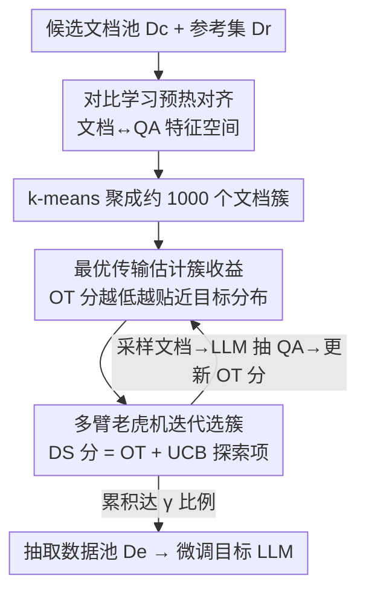

# Not All Documents Are What You Need for Extracting Instruction Tuning Data

**会议**: ICLR 2026  
**代码**: https://anonymous.4open.science/r/EQUAL-DD20  
**领域**: LLM预训练 / 指令微调数据 / 数据选择  
**关键词**: 指令微调, 数据抽取, 多臂老虎机, 最优传输, 对比学习

## 一句话总结
针对"从网络语料里抽取指令微调 QA 数据又贵又脏"的问题，本文提出 EQUAL：先用对比学习把文档和 QA 的特征空间对齐再聚类，再把每个文档簇当成多臂老虎机的一条臂、用最优传输分数衡量"这个簇能产出多贴近目标分布的 QA"，迭代地"选簇—抽取—更新"，从而把抽取成本降低 5–10 倍、同时下游准确率反升约 2.5%。

## 研究背景与动机
**领域现状**：指令微调（SFT）能显著释放大模型的推理能力，但严重依赖高质量训练数据，而开源模型权重虽公开、其 SFT 数据集通常私有。主流补数据手段是"用 LLM 合成"——给定一批种子 QA / 知识库，让强模型扩写出新样本。

**现有痛点**：合成数据天生倾向于模仿种子样本，种子缺乏多样性时合成数据就继承这个缺陷，整体质量下滑，还会偏离真实应用分布。一个更有知识密度的替代来源是网络语料（如 Common Crawl）。已有工作（Mammoth/Yue et al.）先检索领域文档、再用高性能 LLM 把文档里的 QA 对全部抽出来去微调，但有两个硬伤：(1) **成本爆炸**——对每篇文档反复调用大模型抽 QA，文档一多就贵得离谱；(2) **并非所有 QA 都有用**——大语料里混着大量噪声、异质分布的脏数据，把抽出来的 QA 一股脑塞进 SFT 反而可能掉点。

**核心矛盾**：两种直觉解法都顾此失彼。方案①"先抽全部 QA、再筛高质量"效果好但抽取本身就贵；方案②"先选好文档、再只抽这些文档的 QA"省钱，但**文档质量 ≠ 它能产出的 QA 质量**——文档和 QA 的特征分布不一样，文档 embedding 和某个 QA embedding 接近，并不代表这篇文档真能抽出贴近目标的 QA。所以"只看文档"没法准确预测"抽出来的 QA"好不好。

**本文目标**：在不抽全部 QA 的前提下，准确找出"能产出高质量、贴近下游目标分布的 QA"的那部分文档，把抽取量压到很小（如 5%）又不掉点。

**切入角度 / 核心 idea**：把文档选择和 QA 抽取**交错迭代**起来——每抽一点 QA，就更精确地刻画"文档簇 → QA 分布"的关系，反过来让选文档越来越准。两者互相喂养，避免了"只靠文档静态打分"的不准。

## 方法详解

### 整体框架
EQUAL 要解决的是"用尽量少的 LLM 抽取调用，从海量候选文档 $D_c$ 里挑出能微调出好模型的 QA 子集"。它的总体流转是：先用一次**对比学习预热**把文档 embedding 模型微调好，使得"会产出相似 QA 的文档"在特征空间里靠拢，然后 k-means 把 $D_c$ 聚成约 1000 个簇；接着把**每个簇看成多臂老虎机（MAB）的一条臂**，反复地"选一个最值得抽的簇 → 采样少量文档 → 用 LLM 抽 QA → 用最优传输（OT）更新这个簇的收益估计"；直到累积抽取量达到设定比例 $\gamma$，把抽到的 QA 池 $D_e$ 拿去微调目标 LLM。

整个流程的关键在于：簇的"好不好"不是靠文档本身的干净程度，而是靠"从它抽出的 QA 分布与参考集 $D_r$ 分布的接近程度（OT 分）"来衡量；而这个分数随着迭代抽取越来越多 QA 而越来越准。

### 关键设计

**1. 对比学习预热：把文档特征空间对齐到它能产出的 QA**

这一步直击"只看文档没法预测 QA"的痛点。原始文档里掺着大量与下游 QA 无关的内容（样板文字、标记、噪声），所以"文档相似"并不等于"抽出的 QA 相似"，直接用文档 embedding 聚类会让同一簇内的 QA 分布乱七八糟。但把所有文档的 QA 都抽出来再聚类又太贵。EQUAL 的做法是只**随机采样 5% 的文档**、用 LLM 把它们的 QA 抽出来，作为监督信号去微调文档 embedding 模型（`BAAI/bge-en-v1.5`）：把"文档 $d$ 与它抽出的 QA 对 $q^+$"当正样本，从当前所有 QA 里负采样得到 $q^-$，用对比损失

$$\mathcal{L} = -\log \frac{e^{\mathrm{sim}(d,q^+)}}{e^{\mathrm{sim}(d,q^+)} + \sum e^{\mathrm{sim}(d,q^-)}}$$

其中 $\mathrm{sim}$ 是文档与 QA 嵌入的余弦相似度。微调后，"会产出相似 QA"的文档在嵌入空间里被拉近，于是后续 k-means 聚类（约 1000 簇，簇数由 Elbow 法自动确定）就能让"同簇文档抽出的 QA 也相似"，为按簇粒度估计 QA 质量打下基础——这正是后两步能"以簇为单位省钱"的前提。

**2. 最优传输刻画簇收益：用分布匹配代替逐点打分**

这一步回答"怎么衡量一个簇值不值得抽"。已有启发式方法（influence、perplexity 等）是给每条数据单独打一个"对目标能力的贡献分"再简单相加当簇收益，隐含假设"每条样本独立贡献"——但这个假设即便在简单线性回归里也被证明不成立。EQUAL 改把"目标数据选择"建模成**分布匹配**：用最优传输（OT）衡量"从簇里抽出的 QA 分布 $\mu$"和"参考集 $D_r$ 分布 $\nu$"之间的差距

$$OT(\mu,\nu) \;\overset{\text{def}}{=}\; \inf_{\pi\in\Pi(\mu,\nu)} \mathbb{E}_{(e_\mu,e_\nu)\sim\pi}\big[c(e_\mu,e_\nu)\big]$$

其中 $e_\mu, e_\nu$ 是两个分布里 QA 对的嵌入，$\Pi(\mu,\nu)$ 是所有边缘为 $\mu,\nu$ 的联合分布，搬运代价取 $c(e_\mu,e_\nu)=1-\frac{e_\mu^{\top}e_\nu}{\|e_\mu\|\|e_\nu\|}$（即余弦不相似度），OT 分取所有搬运方案里的最小代价。OT 分越低，说明这个簇的 QA 整体上越贴近目标分布、越有价值。把"逐点打分"换成"分布对齐"，避免了 influence 之类指标的已知偏差（如偏好短序列）。

**3. 多臂老虎机迭代选簇：在"利用"和"探索"之间动态权衡**

光有 OT 分还不够——精确算 OT 要先把簇里 QA 全抽出来，仍然贵；而且只挑当前 OT 最好的簇会陷入局部最优、丢掉多样性。EQUAL 把整件事套进 MAB：每个簇是一条臂，"拉一次臂"= 从该簇采样若干文档、抽 QA、更新它的 OT 估计 $\hat{OT}_i$。选簇用文档采样分数（DS score），由 UCB 给出：

$$DS_j = \hat{OT}_j + \alpha \sqrt{\frac{2\ln \sum_{C_k\in\mathcal{C}} T(C_k)}{T(C_j)}}$$

其中 $T(C_j)$ 是簇 $C_j$ 被采样的次数，第一项是利用（簇质量），第二项是探索——采样越少的簇这一项越大，越容易被翻牌，从而提升抽取数据的多样性。权重 $\alpha=\frac{1}{\sum_k T(C_k)+1}$ 随迭代衰减：早期偏探索、后期偏利用。每轮选出 DS 最高的簇 $C_i$，采样文档 $B_i$、用 Qwen2.5-72B 抽 QA $Q_i$ 并入池 $\cup Q_i$，再更新 $\hat{OT}_i = OT(\cup Q_i, D_r)$、$T(C_i){+}{=}1$，循环直到 $|D_e|$ 达到 $\gamma|D_c|$。随着某簇被多次采样，它的 OT 估计越来越准——这就是"交错迭代让选择越来越精确"在算法上的落地。

### 损失函数 / 训练策略
- 预热阶段：随机取 5% 文档抽 QA，用上式对比损失微调 `bge-en-v1.5` 文档嵌入模型。
- 抽取阶段：QA 用 Qwen2.5-72B 抽取并再做一轮 refine（修格式、补缺答案、纠错配），prompt 见原文附录；本文只优化"抽哪些文档"，单条 QA 的抽取质量提升与本工作正交。
- 微调阶段：在抽到的 $D_e$ 上做 SFT，支持 FULL 与 LoRA 两种设置，batch size 512、峰值学习率 $1\times10^{-5}$、cosine 衰减（FULL 训 2 epoch / 32×H100，LoRA 训 4 epoch / 16×H100）。

## 实验关键数据

数据集：AutoMathText（数学，过滤后 1.4M 文档）、KnowledgePile（通用）、StackOverflow（作者自爬，1.2M 文档，编码域）；参考集 $D_r$ 用 GSM8K / MBPP 训练集。下游 13 个任务，主报告 GSM8K、MATH（数学）与 HumanEval、MBPP（编码）。FLOPs 统计"抽取 + 选择 + 训练"三阶段总开销。每个实验跑 3 次取平均。

### 主实验
固定每个方法只取 5% 文档（AutoMathText 约 70k、StackOverflow 约 60k），LLaMA-3-8B / FULL 设置下：

| 域/任务 | Base | Random | Influence | LLM-scoring | Influence-MAB | EQUAL |
|--------|------|--------|-----------|-------------|---------------|-------|
| GSM8K | 55.19 | 68.92 | 65.20 | 68.38 | 67.78 | **73.01** |
| MATH | 23.04 | 32.46 | 29.64 | 33.19 | 32.86 | **35.10** |
| HumanEval | 31.1 | 42.7 | 39.6 | 46.9 | 46.3 | **49.4** |
| MBPP | 51.9 | 52.3 | 53.7 | 53.7 | 53.5 | **56.3** |

EQUAL 在所有模型/任务上都超过全部 baseline：相比 Influence，GSM8K +4.09%、MATH +2.64%，同时省下约 5× 计算量。对 Mistral-7B 也有类似优势（GSM8K 67.73 vs Influence 56.18）。注意像 Avg-sim / Influence / Perplexity 这类"先抽全部 QA 再筛"的方法 FLOPs 极高（100+），而 EQUAL 与 MAB 类方法仅 13–20 量级。

### 不同抽取比例（vs Random / All，LLaMA-3-8B / FULL）

| 方法 | GSM8K | MATH | HumanEval | MBPP | FLOPs(Math) |
|------|-------|------|-----------|------|------|
| Random 5% | 67.40 | 32.46 | 42.7 | 52.3 | 8.83 |
| Random 20% | 70.05 | 36.18 | 44.1 | 55.0 | 34.61 |
| All(Mammoth) 100% | 70.28 | 40.02 | 45.6 | 56.0 | 164.9 |
| EQUAL 5% | 73.01 | 35.10 | 49.4 | 56.3 | 18.55 |
| EQUAL 20% | 74.40 | 41.40 | 49.6 | 56.4 | 43.67 |

EQUAL 仅取 5% 在多数任务上就超过用全部数据（All），最难的 MATH 也只需 20% 即追平 All——印证了"并非所有文档抽出的 QA 都对目标任务有贡献"。

### 消融实验（Table 3，LLaMA-3-8B）

| 配置 | GSM8K(LoRA) | MATH(LoRA) | GSM8K(Full) | MATH(Full) |
|------|------|------|------|------|
| no-warmup | 64.05 | 30.82 | 69.73 | 33.51 |
| no-MAB | 66.13 | 30.55 | 71.90 | 33.25 |
| no-DS | 65.59 | 31.08 | 70.77 | 33.40 |
| **EQUAL** | **67.32** | **31.86** | **73.01** | **35.10** |

### 关键发现
- 三个组件（预热对齐、MAB 迭代、DS 探索项）去掉任意一个都掉点，**预热对齐（no-warmup）掉得最多**——说明"先把文档/QA 特征空间对齐再聚类"是质量地基；t-SNE 可视化也显示预热后同簇 QA 嵌入明显更紧致一致。
- influence / perplexity 这类逐点打分一旦套进 MAB 框架（Influence-MAB / Perplexity-MAB），就能在低得多的 FLOPs 下逼近原方法效果，反过来佐证了 MAB"以簇为单位迭代抽取"的省钱本质。
- Rewriting（基于 $D_r$ 合成）效果最差且多样性低，再次说明合成数据"模仿种子"的天花板，而从语料抽取能引入更丰富的真实知识。

## 亮点与洞察
- **把"数据选择"从逐点打分升级成分布匹配（OT）**：绕开了"每条样本独立贡献"这个被证伪的假设，衡量的是"整簇 QA 与目标分布的距离"，对噪声/长度偏差更鲁棒。这个视角可迁移到任何"选子集匹配目标分布"的数据筛选任务。
- **MAB 把"贵的精确评估"变成"便宜的迭代估计"**：不需要把每个簇的 QA 全抽出来才知道好坏，而是边抽边更新 OT 估计，越抽越准——本质是用"序贯采样"换"全量计算"，是这类高抽取成本场景下很值得复用的范式。
- **对比学习预热解决"代理特征错配"**：当你要用 A 的 embedding 去预测 B 的质量、但 A≠B 时，用一小撮 (A,B) 配对做对比对齐，是个轻量又通用的桥接 trick。

## 局限与展望
- 方法只优化"抽哪些文档"，**单条 QA 的抽取/精炼质量被视为正交问题**，依赖 Qwen2.5-72B 这类强模型，抽取本身的幻觉/错配不在本文处理范围。
- OT 分、聚类、预热都建立在文档/QA 嵌入之上，**对嵌入模型质量敏感**；预热只用 5% 文档，若该子集本身分布偏斜，可能影响整体对齐与聚类。
- 簇数（约 1000）、抽取比例 $\gamma$、UCB 的 $\alpha$ 调度等超参对结果有影响，跨域迁移时可能需要重调；参考集 $D_r$ 直接取下游训练集，现实中"目标分布"未必这么干净可得。
- 评测集中在数学/通用/编码三域，更开放、主观或多语种的指令任务上是否同样有效有待验证。

## 相关工作与启发
- **vs 合成数据（Rewriting / WizardLM 类）**：它们基于种子用 LLM 扩写，受限于种子多样性且易幻觉；EQUAL 从真实网络语料抽取，知识更丰富、分布更真实。
- **vs Mammoth（检索后抽全部 QA）**：Mammoth 把领域文档的 QA 全抽出来训练，成本爆炸且混入低质数据；EQUAL 只抽 5–20% 就反超，核心差别是"选文档"而非"抽全部"。
- **vs Influence / Perplexity / LLM-scoring 等逐点筛选**：它们要么先抽全部 QA 再筛（贵），要么逐点打分（假设独立、易受序列长度等偏差影响）；EQUAL 用 OT 做分布级评估 + MAB 迭代抽取，兼顾省钱与质量。

## 评分
- 新颖性: ⭐⭐⭐⭐⭐ "交错选文档与抽 QA + OT 分布匹配 + MAB" 三者组合，视角和落地都干净利落
- 实验充分度: ⭐⭐⭐⭐ 三模型、两训练设置、多比例、13 任务、组件消融齐全；但域仍偏数学/代码
- 写作质量: ⭐⭐⭐⭐ 动机和两条限制讲得清楚，OT/MAB 公式完整（个别表格数值疑似排版错位，以原文为准）
- 价值: ⭐⭐⭐⭐⭐ 5–10× 降本还涨点，对"从语料造 SFT 数据"是很实用的工程范式

<!-- RELATED:START -->

## 相关论文

- [\[ICLR 2026\] Train on Validation (ToV): Fast Data Selection with Applications to Fine-Tuning](train_on_validation_tov_fast_data_selection_with_applications_to_fine-tuning.md)
- [\[ACL 2025\] SCAR: Data Selection via Style Consistency-Aware Response Ranking for Efficient Instruction-Tuning](../../ACL2025/llm_pretraining/scar_style_consistency_data_selection.md)
- [\[ICLR 2026\] Token-level Data Selection for Safe LLM Fine-tuning](token-level_data_selection_for_safe_llm_fine-tuning.md)
- [\[ICLR 2026\] What Scales in Cross-Entropy Scaling Law?](what_scales_in_cross-entropy_scaling_law.md)
- [\[ICLR 2026\] Programming by Backprop: An Instruction is Worth 100 Examples when Finetuning LLMs](programming_by_backprop_an_instruction_is_worth_100_examples_when_finetuning_llm.md)

<!-- RELATED:END -->
