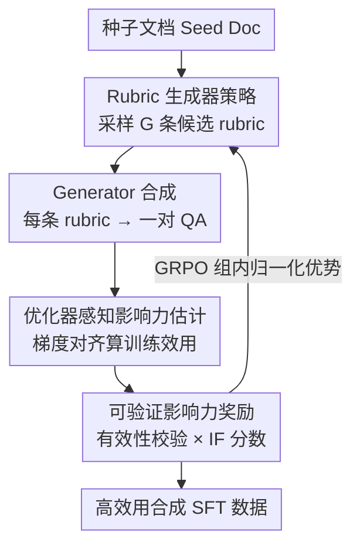

# OptimSyn: Influence-Guided Rubrics Optimization for Synthetic Data Generation

**会议**: ICLR 2026  
**OpenReview**: [https://openreview.net/forum?id=vFcm5sOitq](https://openreview.net/forum?id=vFcm5sOitq)  
**代码**: 无  
**领域**: LLM预训练 / 合成数据 / 强化学习  
**关键词**: 合成数据, 影响力函数, rubric优化, GRPO, SFT

## 一句话总结
OptimSyn 把"为合成数据写 rubric（生成规则）"从专家手工活变成一个可学习的策略：用基于梯度的影响力分数衡量每条合成 QA 对目标模型训练的真实贡献，再把这个分数当成奖励，用 GRPO 训练一个 rubric 生成器，在人文社科和医疗两类知识密集领域稳定刷出比主流开源 SFT 语料更好的下游精度。

## 研究背景与动机
**领域现状**：LLM 的强下游能力很大程度来自海量 SFT 数据。但在人文社科、医学、法律、金融这类知识密集垂直领域，高质量真实 SFT 数据极度稀缺——专家标注贵、隐私约束严、标签一致性难保证。于是业界转向合成数据：典型做法是拿领域文档喂给一个 teacher 模型生成问答对，再用人工设计的 rubric（规则或 prompt）去过滤和引导。

**现有痛点**：这套范式有两个根本问题。其一是**可迁移性差**——rubric 高度依赖专家、强领域绑定，在一个领域好用的规则换到另一个领域往往失效。其二是**启发式优化脆弱**——主流流程是一个"手写 rubric → 合成数据 → 训模型 → 看结果 → 猜着改"的循环，全靠经验，缺乏可靠的量化反馈：人根本没法把下游性能变化可靠地归因到某条具体的 rubric 选择上，导致整个过程慢、脆、不确定。

**核心矛盾**：判断一条合成样本"好不好"时，大家习惯看它在表示空间（embedding）里像不像真实数据。但作者发现一个关键裂缝：合成样本和真实样本在 embedding 空间里可能很近，对学习的实际影响却天差地别。换句话说，"看起来高质量"不等于"训起来有用"。

**本文目标**：用目标模型在具体任务上的**训练效用**来直接衡量合成数据质量，并用这个信号反过来指导数据生成；同时把 rubric 设计从专家手工活变成可学习、可迁移的优化问题。

**切入角度**：作者借鉴经典影响力函数（influence function）——它用一阶梯度信息近似训练动态、估计单个训练样本对留出集性能的贡献。既然现代 LLM 都用 Adam 训练，作者采用一个 Adam 兼容的影响力估计器，让信号对齐真实的优化过程。预实验（Fig.1）显示：梯度空间里更靠近验证集的合成样本下游表现更好，而 embedding 空间里没有这个规律；并且数据集级别的影响力聚合与留出准确率强正相关，验证了影响力是合成数据质量的可靠代理。

**核心 idea**：用"梯度影响力分数"代替"人手 rubric 直觉"作为奖励，闭合"合成—训练"反馈回路，用 RL 训出一个能针对目标模型和任务自动产 rubric 的生成器。

## 方法详解

### 整体框架
给定一批种子文档 $S=\{S_i\}_{i=1}^N$，目标是构造一批合成问答对 $\{(Q_i, A_i)\}$ 用于 SFT。OptimSyn 的核心是把"写 rubric"这一步交给一个专门的 **rubric 生成器（即 prompter / 策略模型）**：对每个种子文档 $S_i$ 和指定的目标模型，prompter 产出一条定制 rubric $B_i$；teacher 模型（generator）在 $(B_i, S_i)$ 条件下合成一对 $(Q_i, A_i)$；目标模型则对这对数据算出一个标量奖励，衡量它对训练的实际效用。这个奖励由"梯度影响力分数"主导，再用 GRPO 把 prompter 朝"最大化下游提升"的方向更新，从而闭合整条合成—训练回路。

整条流水线是一个 RL 回环：种子文档进来，prompter 采样 $G$ 条候选 rubric（rollout 组），每条 rubric 经 generator 变成一对合成 QA，目标模型对每对算影响力奖励，组内归一化成优势后更新 prompter，反复迭代。

### 关键设计

**1. 优化器感知的影响力估计：用梯度而非 embedding 量化"训练效用"**

这一步针对"看起来像但训不动"的痛点。经典影响力函数衡量单个训练点如何影响模型参数与预测；TracIn 用一阶、基于轨迹的可扩展估计器，把训练 checkpoint 上的梯度内积累加起来近似影响力，只需逐样本梯度、学习率和保存的 checkpoint，在 LLM 规模下可行。由于现代 LLM 用 Adam 训练，作者采用一个 Adam 兼容变体：给定训练样本 $z$，它对某评估样本 $z'$ 的影响力为

$$\mathrm{Inf}_{\text{Adam}}(z, z') = \sum_{i=1}^{T} \bar{\eta}_i \cos\big(\nabla_\theta \ell(z'; \theta_i),\ \Gamma(z, \theta_i)\big),$$

其中 $\bar{\eta}_i$ 是第 $i$ 个 epoch 的平均学习率，$\theta_i$ 是该 epoch 后的 checkpoint，$\Gamma$ 引入了依赖历史梯度的 Adam 矩统计量 $(m, v)$（细节在附录，⚠️ 以原文为准）。作者把合成对 $(Q,A)$ 相对验证集的这个分数记作 $\mathrm{IF}(Q, A)$。之所以用梯度而非 embedding：实验证明梯度分布更接近验证集的合成集下游更好，而 embedding 邻近性常常预测不了增益——语义对齐的样本可能把优化推向次优方向。这把"数据合成"从启发式 rubric 工程变成了以模型为中心的优化。

**2. Rubric 生成器作为可学习策略：把专家直觉换成模型反馈驱动的策略**

这一步针对"rubric 强领域绑定、不可迁移"的痛点。传统做法是人为每个领域精雕 rubric；OptimSyn 反过来，只给 prompter 一段轻量的"引导文本"（minimal guiding text），把具体 rubric 的产出完全委托给一个 rubric 专用模型，并以种子文档和目标模型为条件。形式上，给定种子 $S$，策略 $\pi_\theta$ 产出 rubric $B \sim \pi_\theta(\cdot \mid S)$；teacher 在 $(S, B)$ 条件下合成 $(Q, A)$。一条轨迹是 $\tau = \{S, B, (Q, A)\}$，目标是最大化 $\mathbb{E}_{\tau \sim \pi_\theta}[R(\tau)]$。因为 rubric 是以目标模型和任务为条件学出来的，它天然随领域/模型迁移，不再需要为每个领域定制规则——分析显示 RL 后的 rubric 在 embedding 空间覆盖更广更结构化，词云从"focus/align/short"这类泛泛指令转向"critical/clarity/completeness/parsability/信息密度/逻辑严谨"这类具体可执行的质量准则。

**3. 可验证的影响力奖励 + GRPO 优化：让 rubric 朝"真正提升下游"进化**

前两个设计要靠一个奖励信号串起来。OptimSyn 把轻量有效性校验和影响力分数组合成奖励：设 $\mathrm{Valid}(Q, A) \in \{0, 1\}$ 是一组轻量校验器（格式、非平凡性、安全）的合取，奖励为

$$R(\tau) = \mathrm{Valid}(Q, A) \cdot \mathrm{IF}(Q, A) - \lambda\,(1 - \mathrm{Valid}(Q, A)),$$

其中 $\lambda > 0$ 惩罚无效生成。这样既给出与下游提升对齐的可验证信号，又压制退化输出。优化用 GRPO/PPO 风格的裁剪策略梯度配组相对基线降方差：对每个种子 $S$ 采样 $G$ 条 rubric 得到轨迹 $\{\tau_i\}_{i=1}^G$，优势用组内归一化

$$\hat{A}_{i,t} = \frac{R(\tau_i) - \frac{1}{G}\sum_{j=1}^{G} R(\tau_j)}{\sqrt{\frac{1}{G}\sum_{j=1}^{G}\big(R(\tau_j) - \frac{1}{G}\sum_{k} R(\tau_k)\big)^2 + \delta}},$$

目标函数 $J(\theta)$ 用重要性比 $r_{i,t}(\theta)$ 做裁剪并对参考策略 $\pi_{\text{ref}}$ 加 KL 信任域 $\beta$，再加熵正则鼓励探索。这就闭合了合成—训练反馈回路：策略学到的 rubric 系统性地最大化实测训练影响，产出的不只是"启发式上看着合理"、而是"经验上真帮学习"的合成数据。

### 损失函数 / 训练策略
影响力估计前先用初始 prompter+generator 合成数据的 10% 对目标模型做 warmup，得到的模型提供参考梯度用于算影响力分数，再进入 RL 阶段。RL 用 GRPO：batch size 256，学习率 $1\times10^{-6}$，rollout 温度 1.5，rollout size $n=5$，训 1 个 epoch，$\lambda=0.1$。处理约 20K 样本约 10 小时，全程 8×H200。

## 实验关键数据

### 主实验
两个领域、12 个 benchmark。目标模型默认 Qwen3-8B-Base，teacher 默认 Qwen3-235B-Instruct，prompter 基座 Qwen3-8B-Instruct。下表为部分 HSS 与医疗结果（准确率，越高越好）：

| 领域 | Benchmark | Qwen3-8B-Base | Qwen3-8B-Instruct | 最强SFT基线 | OptimSyn(Ours) |
|------|-----------|---------------|-------------------|-------------|----------------|
| HSS | MMLU-pro | 22.83 | 49.87 | 52.76 (Wildchat) | **56.96** |
| HSS | SuperGPQA | 20.77 | 23.44 | 24.60 (Openhermes) | **26.07** |
| HSS | HLE | 5.70 | 4.66 | 8.29 (MAGACorpus) | 7.85 |
| 医疗 | SuperGPQA | 28.06 | 37.16 | 35.28 (Medical-R1) | **38.28** |
| 医疗 | PubMed | 65.90 | 65.70 | 85.40 (ChatDoctor) | 80.70 |
| 医疗 | MedQA | 51.45 | 57.09 | 58.75 (Medical-o1) | 58.75 |

关键结论：OptimSyn 把同一个 8B base 持续抬过主流开源 SFT 语料，多个指标上追平甚至超过 Qwen3-8B-Instruct；HSS 上 HLE 相对增益 +27.2%（0.0785 vs 0.0570），说明结构化、组感知的数据合成能在不依赖测试时推理的情况下蒸馏出推理能力。

### 数据特性对比（医疗）

| 数据集 | 样本数 | Token均值 | MTLD | HDD |
|--------|--------|-----------|------|-----|
| WildChat | 529,428 | 289.59 | 52.70 | 0.9188 |
| Condor | 20,000 | 428.79 | 101.48 | 0.8650 |
| SynthQuestions | 2,500 | 634.60 | 137.02 | 0.8584 |
| OptimSyn(Ours) | 25,875 | 196.49 | 133.82 | **0.9241** |

OptimSyn 在 token 长度不占优的情况下取得最高 HDD（词汇多样性）和较高 MTLD，说明它产的数据短而多样、不靠堆长度取胜。

### 关键发现
- **梯度 vs embedding**：影响力分数（梯度空间）与下游精度强正相关，embedding 邻近性则预测不了增益——这是全文最核心的"啊哈"，也是用影响力当奖励的依据。
- **IF 是可靠代理**：从合成池随机抽 2K/4K 子集分别 SFT，高 IF 子集一致带来更高测试精度，二次回归拟合 $R^2=0.57$（2K）/ $0.54$（4K），高 IF 端有轻微饱和。
- **跨模型族/规模稳健**：换 Qwen3-{4B,8B,14B} 和 Llama3-8B，增益从小模型到大模型都在，且能从 Qwen3 迁到 Llama3，说明不靠模型容量。
- **对 generator 稳健**：把 generator 换成 GPT-4.1、Gemini-2.5-Pro，增益依然在，且影响力分布一致被推向更高均值——奖励信号能跨 generator 放大高效用样本。
- **rollout 组大小 $G$**：$G\in\{5,10,15\}$ 中更大的 $G$ 奖励更高、方差更小，下游精度也随之提升，说明更广的 rubric 探索能稳定 IF 驱动的优化。

## 亮点与洞察
- **把"数据质量"重定义为"训练效用"**：不再问"这条数据像不像真实数据"，而是问"它对目标模型这个任务的梯度有没有正贡献"。这个视角把合成数据评估从感官判断变成可量化优化，很值得迁移。
- **影响力当奖励、rubric 当策略**：把一个静态的离线评估信号（influence）接进 RL 回路当 reward，让"生成什么数据"和"实测模型影响"对齐，是把 data selection 思想升级成 data generation 的巧妙一步。
- **轻量引导文本 + 委托生成**：人只给一段最小引导，把领域细节全交给模型条件生成，天然解决了 rubric 不可迁移的工程痛点，可移植性强。

## 局限与展望
- **间接信用分配**：prompter 用 RL 优化，但奖励是在一个独立 generator 合成 QA 之后才算出来的，梯度无法穿过生成这一步回传。这条间接路径让 reward 同时夹杂 generator 的随机性和影响力估计噪声，导致 GRPO 高方差、训练不稳，尤其在 rollout 组小的时候。
- **影响力估计的成本与近似**：Adam 兼容影响力依赖逐样本梯度、checkpoint 和 warmup，计算开销不小；$\Gamma$ 的矩统计近似细节在附录（⚠️ 以原文为准）。
- **领域覆盖有限**：只验证了 HSS 和医疗两类，法律、金融等同样数据稀缺的高风险领域尚未实测；医疗合成数据也明确声明仅为研究 artifact、不可用于临床。
- **可改进方向**：把奖励直接对生成步可微化（或用更稳的 credit assignment）以降方差；加大 rollout 组虽稳但更贵，探索更高效的探索机制。

## 相关工作与启发
- **vs WebR / MAmmoTH2 / Bonito**：它们把文档语料转成 SFT 对话数据，靠 pipeline 或元模板，仍是固定启发式；OptimSyn 用训练信号对齐的目标直接优化下游提升，而非靠预设规则过滤。
- **vs Condor / Evol-Instruct**：它们迭代改进合成数据（世界知识树+自反思、或进化指令增难度），改进准则仍由人定义；OptimSyn 从模型反馈学 rubric，不靠专家先验，跨域可迁移。
- **vs Montessori-Instruct / 失败诱导探索**：Montessori-Instruct 用 DPO 把 teacher 偏向"有益样本"，思路相近但停在样本级偏好；OptimSyn 把影响力分析摆到台前，揭示 embedding 相似性与训练影响的错配，并据此优化 rubric 这个上游可学习组件。

## 评分
- 新颖性: ⭐⭐⭐⭐⭐ 把梯度影响力当 RL 奖励来学 rubric，"训练效用 ≠ embedding 相似"的洞察扎实且反直觉
- 实验充分度: ⭐⭐⭐⭐ 两域 12 benchmark + 跨模型族/规模/generator 消融充分，但领域仅 HSS 与医疗、缺更广垂直域
- 写作质量: ⭐⭐⭐⭐ 动机—洞察—方法链条清晰，公式与算法完整，少数估计细节推到附录
- 价值: ⭐⭐⭐⭐⭐ 为数据稀缺高风险领域提供可移植、模型对齐的 SFT 数据合成范式，工程落地价值高

<!-- RELATED:START -->

## 相关论文

- [\[ICLR 2026\] Synthetic Bootstrapped Pretraining](synthetic_bootstrapped_pretraining.md)
- [\[ACL 2025\] Model Performance-Guided Evaluation Data Selection for Effective Prompt Optimization](../../ACL2025/llm_pretraining/model_performance-guided_evaluation_data_selection_for_effective_prompt_optimiza.md)
- [\[ICLR 2026\] SemHiTok: A Unified Image Tokenizer via Semantic-Guided Hierarchical Codebook](semhitok_a_unified_image_tokenizer_via_semantic-guided_hierarchical_codebook_for.md)
- [\[ICLR 2026\] Autoregressive Models Rival Diffusion Models at Any-Order Generation](autoregressive_models_rival_diffusion_models_at_any-order_generation.md)
- [\[ICLR 2026\] Reformulation for Pretraining Data Augmentation](reformulation_for_pretraining_data_augmentation.md)

<!-- RELATED:END -->
