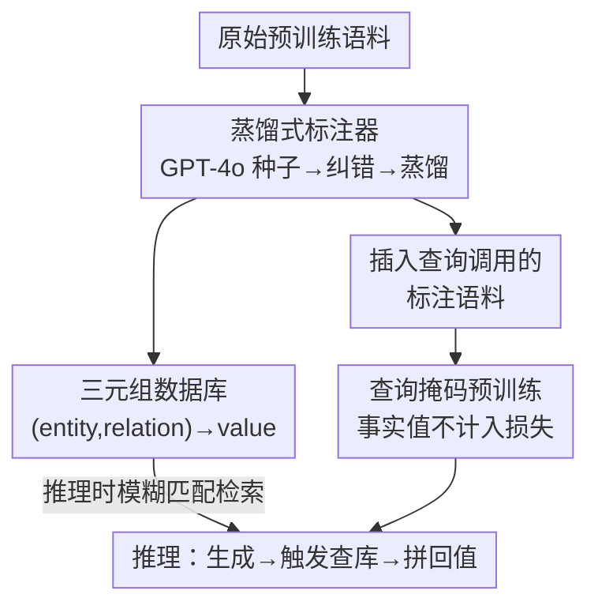

# Pre-training Limited Memory Language Models with Internal and External Knowledge

**会议**: ICLR 2026  
**OpenReview**: [https://openreview.net/forum?id=cvztBvlglK](https://openreview.net/forum?id=cvztBvlglK)  
**代码**: https://github.com/kilian-group/LMLM  
**领域**: LLM预训练 / 外部知识库 / 参数高效 / 机器遗忘  
**关键词**: 知识外置, 预训练, 查询掩码, 机器遗忘, 参数效率

## 一句话总结
LMLM（Limited Memory Language Model）在**预训练阶段**就把实体级事实查询调用插进语料、并把检索回来的事实值从损失里 mask 掉，逼模型学会「该查就查」而不是死记硬背，结果 382M 的小模型在事实精度上能逼近 LLaMA2-7B，还能靠改数据库一键遗忘。

## 研究背景与动机

**领域现状**：神经语言模型是个黑盒——语言规律和事实知识都被压进上百亿个不可解释的参数里。要让模型「知道」一个事实，预训练时这个事实往往要被看到几百次才能可靠记住（Allen-Zhu & Li 的研究指出，观测不足几百次的知识基本学不牢）。

**现有痛点**：知识和语言能力在权重里**纠缠**在一起，带来两头难。训练侧，长尾事实要反复曝光才记得住，浪费容量；推理侧，想删掉过时/不合规的知识极其困难——梯度遗忘、偏好优化这类方法（GA、GD、NPO、SimNPO）要么遗忘不彻底，要么连带把相关无辜知识也删了，要么把模型整体能力搞垮。一个餐厅客服 agent 理想上根本不该会回答历史、处方药、房产法的问题，但当前预训练做不到这种「知识可控」。

**核心矛盾**：把事实硬编码进参数，本质上就让「知识」和「语言能力」共用同一块不可分割的存储，于是「改一个不动另一个」几乎不可能。

**本文目标**：能不能在语言模型里把**事实记忆**和**语言理解**解耦开？子问题包括：怎么自动从语料里抽出可外置的事实、怎么训练才能让模型不去记这些事实、推理时怎么让它主动查库。

**切入角度**：与 RAG 这类「推理/后训练阶段往外加知识」的主流范式相反，作者反其道而行——**在预训练阶段就尽量限制存进参数的知识量**。观察是：实体级原子事实（entity, relation→value 三元组）最适合外置，既好抽好验证，又恰恰是最难塞进参数的长尾内容。

**核心 idea**：把事实改写成显式查询调用插进预训练语料，并在 next-token 损失里把「检索返回的事实值」mask 掉，从而教会模型**生成查询、而非记忆事实**。

## 方法详解

### 整体框架

LMLM 是一整套贯穿「数据准备 → 预训练 → 推理」的方案。先用一个轻量 ANNOTATOR 把原始语料里的实体级事实抽成三元组、构建外部数据库，同时把这些事实在原文里改写成显式查询调用（lookup call）；预训练时仍是标准 next-token prediction，但**唯一关键改动**是把检索返回值对应的 token 从损失里排除，逼模型只学「什么时候发起查询」而不学「事实本身是什么」；推理时模型自回归生成文本，遇到特殊 token 就触发查库、把返回值拼回去再继续生成。

具体地，每个事实在语料里被编码成 `<|db start|> entity <|sep|> relation <|db retrieve|> value <|db end|>` 的形式，其中 `value`（和结尾的 `<|db end|>`）在训练时被 mask。

### 关键设计

**1. 蒸馏式标注器：让事实抽取能在预训练规模上跑起来**

在预训练语料规模上手工抽三元组、建知识图谱不现实，所以作者搭了一条「种子标注 → 过滤 → 蒸馏」的流水线（图 3）。第一步用 GPT-4o 标注一个 $M=1000$ 篇知识密集文档的种子集，给文本插上查询调用和返回值；第二步训一个 CORRECTOR（LLaMA-3.1-8B-Instruct）做质量过滤，**故意欠拟合**让它对「格式不对、上下文不支持、过度具体」的查询调用打高 loss，按 loss 砍掉最差的 10%；第三步在清洗后的数据上指令微调出 ANNOTATOR（同为 LLaMA-3.1-8B-Instruct），再用它去标注整个语料。这一步一举两得：抽出的三元组既组成了随语料规模增长的数据库，又把查询调用插回原文，生成了带 lookup 的预训练语料。最终标注整个语料得到 **54.6M 条三元组**。

**2. 查询掩码的 next-token 预训练：用 loss mask 把事实赶出参数**

这是全文的命门。训练目标仍是标准 next-token，但给每个 token 配一个掩码 $m_t$：

$$L(\theta) = -\sum_{t=1}^{T} m_t \log p_\theta(x_t \mid x_{<t}), \quad m_t = \begin{cases} 0, & x_t \in \{\text{检索返回值},\ \texttt{<|db end|>}\} \\ 1, & \text{其他} \end{cases}$$

返回值 token 不计入损失，意味着模型**没有任何梯度信号去记住这个事实的具体内容**，但它仍要学会在正确位置生成「发起查询」的特殊 token、并从上下文推断查询参数（entity、relation）。于是建模被拆成两步：模型学「何时该查、查什么」，事实内容则显式存在数据库里、推理时取回。直觉上，当模型可以依赖外部提供的准确事实时，就不必再耗费容量去拟合复杂的长尾事实分布，腾出的容量可以投给推理和语言能力——这也解释了为什么 LMLM 收敛更快、验证困惑度更低。`<|db end|>` 之所以也跳过 loss，是因为检索后该 token 可直接插入、无需学习。

**3. 模糊匹配检索 + 数据库即知识：把「改知识」降维成「改数据库」**

推理时 LMLM 像 Toolformer 那样自回归生成，直到特殊 token 触发查库；检索用 ALL-MINILM-L6-V2 embedding 的余弦相似度做**模糊匹配**（拒绝阈值 0.6），取回值后继续生成。这一设计的最大红利是知识完全模块化：想遗忘某条事实，**直接删数据库对应条目即可**，不用任何额外训练、不碰模型权重、也不需要 Retain Set。同时，因为 LMLM 永远靠查库取事实，访问超纲知识会触发**可检测的查询失败**，而不像传统 RAG 那样在检索不到时悄悄退回内部记忆、产生不可控的幻觉。

### 一个完整示例

以「拿破仑何时出生？」为例走一遍：原文 "Napoleon was born on August 15, 1769." 经标注器处理，事实 (Napoleon, Birth Date)→August 15, 1769 被抽进数据库，原文被改写成 "Napoleon was born on `[（Napoleon, Birth Date）→August 15, 1769]` August 15, 1769."。预训练时，方括号里的返回值 "August 15, 1769" 被 mask 掉、不算 loss，模型只学会在 "born on" 后面发起 `(Napoleon, Birth Date)` 这条查询。推理时，模型生成到该位置触发查库，从数据库取回 "August 15, 1769"，拼接后继续输出完整句子——事实始终来自外部、可查可改。

### 损失函数 / 训练策略

核心即上面的掩码 next-token loss（式 1）。预训练在 OLMo2 项目的高质量 Wikipedia 语料（约 3B token）上从头训练，用 GPT-2 与 LLaMA2 风格架构及其标准 tokenizer，额外扩 4 个特殊 token；所有模型训 8 个 epoch、上下文长度 1024、混合精度，单模型 8 H100-day 内训完。困惑度在 1000 条留出样本（约 245k token）上评估。

## 实验关键数据

### 主实验

事实精度（FactScore 长文传记 / T-REx EM / PopQA Acc），下标为相对同尺寸 STANDARD 基线的绝对提升：

| 模型 | 类型 | FactScore↑ | T-REx EM↑ | PopQA Acc↑ |
|------|------|-----------|-----------|------------|
| LLaMA2-382M | STANDARD | 14.0 | 52.0 | 22.7 |
| LLaMA2-382M | **LMLM** | **31.9** (+17.9) | **58.1** (+6.1) | **50.8** (+28.1) |
| GPT2-355M | STANDARD | 14.4 | 44.9 | 21.4 |
| GPT2-355M | **LMLM** | 23.9 (+9.5) | 58.7 (+13.8) | 52.0 (+30.6) |
| Pythia-1B* | off-the-shelf | 21.1 | 47.8 | 19.5 |
| LLaMA2-7B* | off-the-shelf | 34.0 | 60.5 | 29.2 |

382M 的 LMLM 在 FactScore 上逼近 7B 量级模型，PopQA 甚至反超。困惑度方面，LMLM 在所有尺寸、所有困惑度变体（Static/Dynamic/Normalized）上都低于 STANDARD，Dynamic 设定下平均降低约 **1.98** 点——说明它不仅靠检索沾光，确实学会了「查得准 + 生成得好」。

### 消融实验

| 配置 | FactScore↑ | T-REx EM↑ | 说明 |
|------|-----------|-----------|------|
| STANDARD | 14.0 | 52.0 | 纯参数化基线 |
| LMLM (w/o database) | 12.8 (−19.1) | 38.5 (−19.6) | 禁用数据库、强制用内部参数 |
| LMLM (完整) | 31.9 | 58.1 | 正常查库 |

vs RAG（GPT2-355M）：LMLM 的 FactScore（23.9 vs 20.1）和 PopQA（52.0 vs 37.5）更高，但 RAG 在 T-REx 上更强（75.8 vs 58.7）——因为 T-REx 的 query 几乎逐字取自 Wikipedia，对同源检索近乎完美。两者互补：RAG 补上下文，LMLM 给可编辑、可验证的细粒度事实接地。

### 关键发现
- **禁用数据库后事实精度暴跌**（FactScore 31.9→12.8、T-REx 58.1→38.5，甚至低于 STANDARD），且对返回值 token 的训练 loss 全程维持高位（图 7），双重证明事实确实没被记进参数。
- **遗忘是真·一键**：在 TOFU 基准上删数据库条目即可达到理想遗忘（p>0.05）且模型 utility 零损失，而 NPO 等训练式方法要么遗忘不净、要么连带损伤 Retain Set。
- **外置比例越高越好**（在本文范围内）：用「LMLM 与 STANDARD 在事实值 token 上的 loss 差」给每条事实排序，loss 差大（长尾/难学）的优先外置；从 0% 到 100% 外置，困惑度持续下降、FactScore 持续上升、NLU 基本不变。

## 亮点与洞察
- **把范式倒过来**：别人都在推理时「往里加知识」，LMLM 在预训练就「往外赶知识」，一个 loss mask 就把事实记忆和语言能力解耦，思路极简却抓住了纠缠问题的根。
- **「遗忘 = 删表项」**：机器遗忘从一个需要训练、还会误伤的难题，被降维成一次数据库 DELETE，可验证、可追溯、不碰权重——这是把知识外置后自然掉出来的红利。
- **可迁移的 loss-mask 技巧**：「想让模型别学某类内容，就把那类 token 从损失里 mask」这个手法可推广到任何「想结构化剥离某种知识/能力」的场景。
- **查询失败可检测**：超纲就报错而非悄悄编，比 RAG 退回内部记忆更可控，对 fact-sensitive 部署很有价值。

## 局限与展望
- 作者承认：不保证生成绝对无误（数据库噪声 + 模糊匹配会引错），但错误**可追溯可验证**；查询调用引入额外 token，抬高训练/推理成本；目前只覆盖**实体级原子事实**，更抽象的知识怎么外置仍是开放问题；实验仅限小模型小数据，规模化效果待验证。
- 自己看：标注器质量直接决定数据库质量，GPT-4o 标注的事实正确性、CORRECTOR 砍掉 10% 的阈值都可能引入系统性偏差；评测语料（Wikipedia）与数据库同源，T-REx 上对 RAG 的劣势提示「换域后查询命中率」可能掉得更多。
- 改进方向：把外置粒度从三元组扩到关系/事件级、引入更鲁棒的检索（而非纯余弦模糊匹配）、研究外置比例随领域自适应的策略。

## 相关工作与启发
- **vs RAG**：RAG 在推理时往 prompt 里塞检索文档、但事实仍编码在参数里，改知识要重训或硬 prompt 覆盖；LMLM 在预训练就不让事实进参数，改知识只需动数据库。本文证明二者可混合（RAG 给上下文、LMLM 给可编辑事实）。
- **vs RETRO / REALM（检索式预训练）**：它们训练时引入检索以减少记忆、提升泛化，但仍以「增强」为目标、不支持即时遗忘；LMLM 直接**限制**预训练记忆，天然支持可扩展、可验证的遗忘。
- **vs MemSinks / Memory3（隔离/稀疏记忆）**：它们在结构上隔离或稀疏化参数内记忆；LMLM 更彻底，把事实**搬出模型本体**进数据库。
- **vs NPO 等机器遗忘方法**：梯度/偏好式遗忘受困于参数纠缠，会误伤相关知识；LMLM 把遗忘还原成删条目，规避了纠缠。

## 评分
- 新颖性: ⭐⭐⭐⭐⭐ 把「外置知识」从推理阶段提前到预训练阶段，并用 loss mask 实现解耦，范式层面的创新
- 实验充分度: ⭐⭐⭐⭐ 困惑度/事实精度/遗忘/外置比例多角度验证，但规模仅到 382M、语料单一
- 写作质量: ⭐⭐⭐⭐⭐ 动机—方法—实验逻辑清晰，图 1/2/3 把范式差异讲得很直观
- 价值: ⭐⭐⭐⭐⭐ 为「可控、可编辑、可验证、参数高效」的语言模型指出一条与 RAG 互补的新路

<!-- RELATED:START -->

## 相关论文

- [\[ACL 2026\] KoCo: Conditioning Language Model Pre-training on Knowledge Coordinates](../../ACL2026/llm_pretraining/koco_conditioning_language_model_pre-training_on_knowledge_coordinates.md)
- [\[ICLR 2026\] Pre-training under Infinite Compute](pre-training_under_infinite_compute.md)
- [\[ICLR 2026\] Soft-Masked Diffusion Language Models](soft-masked_diffusion_language_models.md)
- [\[ICLR 2026\] FictionalQA: A Dataset for Studying Memorization and Knowledge Acquisition](fictionalqa_a_dataset_for_studying_memorization_and_knowledge_acquisition.md)
- [\[ICLR 2026\] Steering Language Models with Weight Arithmetic](steering_language_models_with_weight_arithmetic.md)

<!-- RELATED:END -->
