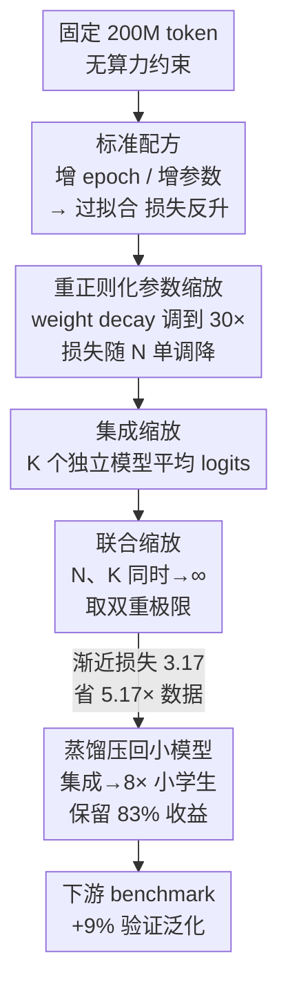

# Pre-training under Infinite Compute

**会议**: ICLR 2026  
**OpenReview**: [https://openreview.net/forum?id=ck0aZTAnwK](https://openreview.net/forum?id=ck0aZTAnwK)  
**代码**: 开源在 GitHub + WandB（论文未在正文给出确切链接，⚠️ 以原文为准）  
**领域**: LLM 预训练 / 数据高效 / Scaling Law  
**关键词**: 数据受限预训练, 正则化, 集成, 蒸馏, 渐近 Scaling Law

## 一句话总结
当算力远超网页数据时，作者用「重正则化 + 模型集成 + 联合参数/集成缩放 + 蒸馏」把固定 200M token 的预训练损失压到渐近值 3.17，相比标准配方节省 5.17× 数据，并把集成蒸馏进 8× 更小的学生模型仍保留 83% 收益。

## 研究背景与动机
**领域现状**：语言模型预训练的整套方法论建立在「算力受限、数据无限」的假设上——Chinchilla 这类配方在固定训练算力下联合缩放数据和模型规模（token 是参数的 20×），追求 compute-optimal。

**现有痛点**：现实正在反转这个假设。网页文本每年只增长 1.03×，而投入预训练的算力每年增长 4×。也就是说，未来会进入「算力极度充裕、数据成为唯一瓶颈」的 regime，而现有所有 scaling recipe 都没在认真回答「数据固定、算力不限时该怎么训」这个问题。

**核心矛盾**：在固定数据下，沿用标准做法（增大 epoch、增大参数量）很快就会**过拟合**——损失先降后升。这意味着即便你愿意烧无限算力换一个更好的模型，标准配方本身有一个天花板，多花算力反而更差。问题的根因是：标准配方的正则化强度（weight decay = 0.1，沿袭自 GPT-3）远不足以约束这些相对数据严重过参数化的模型。

**本文目标**：在固定 token 预算 $D$、解除包括算力在内的所有其他约束下，求 $L_D^* = \min_H L(A(D, H))$，即数据受限下的最优可达损失，并找到能逼近它的训练配方。

**切入角度**：作者提出一个关键的评估观念转变——不要在某个固定算力预算下比较两个配方，而是**比较它们 scaling law 的渐近值**（asymptote）。只要一个配方的损失随某个变量单调下降并服从幂律，就用该幂律 $N\to\infty$ 时的极限作为「最优可达损失」来给配方排序。

**核心 idea**：把一堆「数据受限深度学习」的经典武器（强正则化、集成、蒸馏）重新搬回大模型预训练，并用「渐近 scaling law」这把尺子去量，发现它们能显著提升数据效率——简单的算法改进，就能在算力富裕的未来更省数据。

## 方法详解

### 整体框架
本文要解决的是「数据固定、算力不限」下如何把预训练损失压到最低。整体思路是先证明标准配方会过拟合、不可用，然后逐层叠加四种干预：**重正则化让参数缩放重新单调** → **集成代替单纯放大单模型** → **联合参数+集成缩放取双重极限** → **蒸馏把大模型收益压回小模型**。每一层都配一条幂律来估计其渐近损失，最后用「渐近值」和「等效数据效率」两个指标衡量收益，并验证收益在更大 token 预算和下游任务上都成立。

### 关键设计

**1. 重正则化让过参数化模型重新单调缩放**

标准配方的痛点是：在 200M token 上把 300M 模型反复 epoch 或继续加大参数，损失会因过拟合而上升（1.4B 比 600M 还差），于是「多花算力换更好模型」这条路被堵死。作者发现根因是 weight decay 默认 0.1 太弱。他们用受 Wen et al. (2025) 启发的坐标下降法，对每个参数量 $N$ 联合调 weight decay、学习率、epoch 数，结果最优 weight decay 比标准实践大 **30×**（最过参数化的模型甚至到 1.6/3.2）。调好之后，损失在比 Chinchilla 大 140× 的参数-token 比下仍随 $N$ 严格单调下降，可用带渐近项的幂律拟合：

$$\hat{L}_{D,N} := \frac{A_D}{N^{\alpha_D}} + E_D, \qquad \hat{L}_{200M,N} = \frac{0.05}{N^{1.02}} + 3.43$$

参数缩放指数 1.02 远高于 Chinchilla 的 0.34，说明数据被更充分利用后，更大模型带来的改进更快。这与过参数化回归的理论一致：即便存在 double descent 让损失非单调，只要正则化最优调好，损失就会单调下降。最优可达损失即渐近值 $\lim_{N\to\infty}\hat{L}_{D,N} = E_D = 3.43$。

**2. 集成缩放：与其训一个大模型，不如训多个小模型**

正则化配方只能靠 $N\to\infty$ 改进，作者追问能否设计渐近值更低的配方。集成的做法是：独立训练 $K$ 个同样大小、仅随机种子（数据顺序+初始化）不同的模型，生成时**平均它们的 logits**。由于前向 FLOPs 近似正比于参数量，一个 $K$ 成员集成的总参数量记为 $NK$，与单模型公平对比。实验发现集成的超额损失随 $K$ 以接近 $1/K$ 的速率下降（与单模型随 $1/N$ 对称），$N=300\text{M}$、$K\to\infty$ 的渐近值为 **3.34**，低于正则化配方 $N\to\infty$ 的 3.43——甚至 $K=3$ 的集成就已超过正则化配方的渐近极限。为什么有效？Allen-Zhu & Li (2023) 的「multi-view」理论解释：当数据可以被多个特征之一很好分类、但用全部特征分类最优时，单个模型只学到一个特征，而每个集成成员学到不同特征。

**3. 联合缩放配方：参数与集成的双重极限**

集成虽好，但参数缩放和集成缩放可以叠加，办法是让成员数与每个成员的大小同时趋于无穷，取双重极限：

$$\hat{L}_D = \lim_{N\to\infty}\lim_{K\to\infty}\min_H L(E_A(D, N, K, H))$$

只要内层 $\min_H L$ 在固定另一变量时对 $N$、$K$ 都单调下降，极限值与取极限顺序无关；作者选这个顺序是为了调参方便。内层因实验约束无法完全找到局部最优超参，改用启发式：取正则化最优超参后再 ×2 epoch、×0.5 weight decay（让每个集成成员略微过拟合，实测比直接用最优正则化超参更好）。在 200M token 上，联合配方的渐近损失估计为 **3.17**，远优于正则化的 3.43 和无正则化的 3.75。

**4. 蒸馏把大模型收益压回小参数量**

前述渐近收益都依赖任意大的参数量，实用性受限。作者用蒸馏在不增加推理（甚至训练）参数量的前提下保住大部分收益。由于不受训练算力约束，先用现有配方训一个数据高效的教师 $M'$，再从 $M'$ **无条件采样**（不给 prompt）生成 $D'$ 个 token，把真实 $D$ 与合成 $D'$ 混合后从头训学生。**集成蒸馏**：把 8 个 300M 模型的集成（损失 3.32）蒸馏进单个 300M 学生，学生损失 3.36，以 8× 更小的尺寸保留了 83% 的集成增益，并超过正则化配方的渐近值。**自蒸馏**：教师与学生同尺寸（都 300M）时，混合真实与合成数据避免了 model collapse，新学生反而超过最佳正则化 300M 模型——Allen-Zhu & Li (2023) 把自蒸馏解释为隐式地对「教师 + 新初始化学生」做集成。

### 损失函数 / 训练策略
基础是标准自回归交叉熵预训练（细节在附录 B）。核心训练策略不在 loss 形式，而在三件事：① 用坐标下降对每个 $N$ 联合调 weight decay / lr / epoch，weight decay 取到 30× 标准值；② 集成时各成员仅种子不同、生成阶段平均 logits；③ 蒸馏时学生从头训练在「真实 $D$ + 教师无条件采样的合成 $D'$」混合语料上。默认环境为 DCLM 网页数据、200M seed token、300M 参数基准模型。

## 实验关键数据

### 主实验（200M token 下各配方的渐近损失与数据效率）

| 配方 | 渐近损失 | 相对标准配方数据效率 |
|------|---------|---------------------|
| 标准（无正则，调 epoch+参数） | 3.75 | 1× |
| 重正则化参数缩放（$N\to\infty$） | 3.43 | 2.29× |
| 集成（$N=300\text{M},\ K\to\infty$） | 3.34 | — |
| 联合缩放（$N,K\to\infty$） | **3.17** | **5.17×** |
| 最佳 1.4B 单模型（不取渐近） | — | 2.09× |
| 5×1.4B 集成（不取渐近） | — | 3.75× |

### 蒸馏与下游（消融/分析）

| 配置 | 关键指标 | 说明 |
|------|---------|------|
| 8-集成教师（300M×8） | loss 3.32 | 集成上限 |
| 集成蒸馏 → 300M 学生 | loss 3.36 | 8× 更小，保留 83% 集成增益，超正则化渐近 |
| 自蒸馏 300M→300M | < 正则化 300M | 同尺寸，避免 collapse，超过教师 |
| 最佳集成 vs 最佳无正则 | 下游 +9% | PIQA/SciQ/ARC-Easy 平均 |
| 蒸馏模型 vs 无正则 300M | 下游 +7% | 参数量不变下的泛化收益 |

### 关键发现
- **正则化是过拟合的总开关**：最优 weight decay 比标准实践大 30×，是让参数缩放从「先降后升」变成「单调幂律」的关键；不调它，整条 scaling law 都不成立。
- **集成在高参数量区优于单纯放大单模型**：$1/K$ 衰减的集成渐近（3.34）比 $1/N$ 衰减的参数缩放渐近（3.43）更低，且 $K=3$ 就超过单模型极限。
- **数据效率在更大 token 预算下不消失**：把 seed token 缩放到 1.6B，渐近本身也服从幂律（指数 0.23–0.24，渐近 1.89–1.96），外推显示 2×/5× 的数据效率优势在各数据尺度都保持。
- **验证损失收益迁移到下游**：作者直到项目末尾才看 benchmark（先按验证损失选配方），下游 +9% 是对泛化的强测试。

## 亮点与洞察
- **「渐近 scaling law」作为新评估指标**：跳出 compute-optimal 的固定预算比较，用 $N,K\to\infty$ 的损失极限给配方排序——这把尺子让「多花算力换更好模型」在数据受限下变得可量化、可预测。
- **30× weight decay 这个反直觉数字**：把一个被默认值 0.1 长期掩盖的过拟合问题摆上台面，提醒大家很多预训练超参是历史沿袭而非数据受限场景下的最优。
- **「训多个小模型 > 训一个大模型」**：在算力富裕、数据受限的设定下，集成的边际收益结构（$1/K$）天然优于参数缩放，且与 multi-view 特征学习理论自洽。
- **自蒸馏避免 collapse 的工程细节**：混合真实+合成 token 是关键，纯合成会塌缩；把自蒸馏理解成「隐式集成教师与新学生」给了它一个干净的解释。
- 可迁移性：渐近评估 + 强正则化 + 集成蒸馏这套组合，原则上可推广到任何「数据是硬约束、算力相对充裕」的训练场景。

## 局限与展望
- **token 规模仍偏小**：核心实验在 200M–1.6B token，远低于真实前沿预训练（万亿级），更大规模下 weight decay 倍率、集成增益是否同样成立需要进一步验证。
- **双重极限依赖外推**：渐近损失（如 3.17）是幂律拟合的极限，受 run-to-run 方差影响（作者称跨 3 seed 渐近变化 ≤0.02），本质是估计而非实测，外推到更高 token 预算的结论是「预测」。
- **联合缩放内层未取到局部最优**：因实验约束，$K$ 极限用的是「2× epoch、0.5× weight decay」启发式而非真正调优，可能低估或高估联合配方潜力。
- **算力代价**：所有收益建立在「无算力约束」假设上，集成 $K$ 个模型、蒸馏额外生成 $D'$ token 都成倍增加训练算力，作者也在 ethics 部分承认会增加预训练算力消耗。

## 相关工作与启发
- **vs Muennighoff et al. (2023)（数据受限 epoching）**: 他们提出损失随 epoch 单调下降的 scaling law，但为此从拟合中剔除了大部分过拟合 run；本文指出其根因是正则化不足，用 30× weight decay 修复过拟合，并提出渐近估计作为新指标。
- **vs Chinchilla / Kaplan (compute-optimal)**: 他们在固定算力下联合缩放数据和模型，增大 $N$ 会因数据变少而伤害性能；本文在固定数据、解除算力约束下追求单调缩放，参数缩放指数 1.02 远高于 Chinchilla 的 0.34。
- **vs 经典集成理论 (Vyas et al. 2023; Ruben et al. 2024)**: 部分理论模型认为深度集成不超过参数缩放；本文在预训练实证中显示集成渐近更低，并用 Allen-Zhu & Li 的 multi-view 理论给出解释。
- **vs model collapse 研究 (Shumailov et al. 2024 等)**: 他们警示训练在自生成数据上会塌缩；本文通过真实+合成混合，让自蒸馏不仅不塌缩还超过教师。

## 评分
- 新颖性: ⭐⭐⭐⭐⭐ 重新定义数据受限预训练的目标（渐近而非固定预算），把经典正则化/集成/蒸馏系统搬回大模型并量化收益
- 实验充分度: ⭐⭐⭐⭐ 多配方、多 token 尺度、蒸馏与下游都覆盖，但绝对规模偏小、关键结论依赖外推
- 写作质量: ⭐⭐⭐⭐⭐ 逻辑链条（过拟合→正则化→集成→联合→蒸馏）层层递进，图与幂律对应清晰
- 价值: ⭐⭐⭐⭐⭐ 面向「算力超过数据」的未来给出可操作配方，对数据高效预训练有直接指导意义

<!-- RELATED:START -->

## 相关论文

- [\[ICLR 2026\] Pre-training Limited Memory Language Models with Internal and External Knowledge](pre-training_limited_memory_language_models_with_internal_and_external_knowledge.md)
- [\[ICLR 2026\] Rewriting Pre-training Data Boosts LLM Performance in Math and Code](rewriting_pre-training_data_boosts_llm_performance_in_math_and_code.md)
- [\[ICLR 2026\] Pre-training LLM without Learning Rate Decay Enhances Supervised Fine-Tuning](pre-training_llm_without_learning_rate_decay_enhances_supervised_fine-tuning.md)
- [\[ICLR 2026\] Joint Selection for Large-Scale Pre-Training Data via Policy Gradient-based Mask Learning](joint_selection_for_large-scale_pre-training_data_via_policy_gradient-based_mask.md)
- [\[ICLR 2026\] Common Corpus: The Largest Collection of Ethical Data for LLM Pre-Training](common_corpus_ethical_data_for_llm_pretraining.md)

<!-- RELATED:END -->
