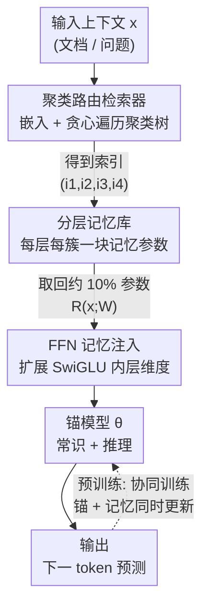

# Pretraining with Hierarchical Memories: Separating Long-Tail and Common Knowledge

**会议**: ICLR 2026  
**OpenReview**: [https://openreview.net/forum?id=XOu5z16cbY](https://openreview.net/forum?id=XOu5z16cbY)  
**代码**: 待确认  
**领域**: LLM预训练 / LLM效率  
**关键词**: 参数化记忆、分层记忆库、长尾知识、端侧部署、预训练

## 一句话总结
本文提出在预训练阶段给一个小的「锚模型」挂上一个超大的「分层参数化记忆库」：根据输入文档先做层次聚类路由，只取回约 10% 的记忆参数拼到锚模型上，让锚模型专注通用知识与推理、记忆库专门吸收长尾世界知识；万亿 token 实验显示，160M 锚模型 + 18M 取回记忆（从 4.6B 记忆库取）能追平参数量 2 倍以上的常规模型。

## 研究背景与动机

**领域现状**：现代大模型的性能提升几乎全靠堆参数——模型越大，存的世界知识越多、推理越强。所有世界知识都被压进同一套参数里，每次前向传播都要把它们全部加载进内存、参与计算。

**现有痛点**：这种「全知识压进参数」的范式有两个浪费。其一，单条 prompt 真正用到的知识只是极小一部分，绝大多数被永久占用的参数（比如「爱因斯坦生于 1879 年 3 月 14 日」这种长尾事实）对端侧助手任务毫无意义，却照样吃 RAM、照样进每一次计算。其二，端侧设备的瓶颈恰恰是「大而快的内存」稀缺，把几十亿参数全塞进高速内存不现实。MoE 虽然每个 token 只激活部分专家，但所有专家仍需常驻内存、随机访问，端侧并不友好。

**核心矛盾**：长尾知识和通用知识/推理被混在同一套参数里共享梯度。论文指出，长尾事实之所以容易被「灾难性遗忘」，正是因为内容差异极大的文档在更新同一批参数时产生了相互破坏的梯度——常见知识反复出现、主导了梯度方向，稀有知识被冲掉。

**本文目标**：把「通用知识 + 推理」和「长尾世界知识」在参数层面解耦，让前者沉淀进始终激活的锚模型、后者沉淀进按需取回的记忆参数，同时让整套机制天然契合「RAM→闪存→外部磁盘」的硬件存储层级。

**切入角度**：作者观察到，如果一块记忆参数只在「语义相似」的一类文档上被激活和更新，它收到的梯度就来自相近内容、彼此不再破坏，于是能稳稳记住长尾知识而不被遗忘。这把「按内容路由 + 稀疏更新」从推理优化问题，变成了一个能改善训练动力学的预训练问题。

**核心 idea**：用一个小锚模型当「常识 + 推理」的底座，外挂一个按层次聚类组织的大记忆库；预训练时按文档内容只检索/更新约 10% 的记忆参数，让长尾知识自动流进记忆、常识自动留在锚模型。

## 方法详解

### 整体框架

设锚模型参数为 $\theta$，记忆库参数为 $W$，检索器为 $R$。给定上下文 $x$，检索器只取回相关的记忆块 $R(x;W)$，拼到锚模型上做下一 token 预测。预训练目标就是普通的自回归损失，但建立在「锚 + 取回记忆」的组合参数上：

$$\mathcal{L}(x) = -\sum_t \log P_{\theta, R(x;W)}(x_t \mid x_{<t})$$

参数规模上满足 $|R(x;W)| \ll |\theta| \ll |W|$：锚模型小、取回记忆更小、整个记忆库巨大（实验最大到 21B）。因为每条文档只触发记忆库里一小撮参数，$W$ 的梯度天然高度稀疏；$\theta$ 则对所有文档都更新，于是被推着去学通用能力。推理时只用 $|\theta| + |R(x;W)|$ 个参数，相对纯锚模型几乎没有额外开销。

整条 pipeline 是：输入文档/问题 → 文本嵌入 → 沿聚类树贪心遍历得到 cluster 索引 → 按索引从分层记忆库取回各层记忆块 → 以 FFN 扩展方式拼到锚模型 → 输出。下面这张图给出鸟瞰：

### 关键设计

**1. 聚类路由检索器：用离线层次聚类把「按内容取参数」做到零训练开销**

要让相似文档命中同一批记忆参数，关键是一个又快又稳的路由。作者不学检索器，而是直接用现成文本嵌入模型 $\phi$（Sentence-BERT all-MiniLM-L6-v2，维度 384）对 32 亿篇 DCLM 文档求嵌入，再做层次 k-means：先分成 $k$ 个簇，每个簇再分 $k$ 个子簇，共 $p$ 层，得到每层 $k^l$ 个嵌套簇。论文取 $k=16$、$p=4$，于是各层有 16、256、4096、65536 个簇。检索时把 $x$ 映射成索引元组 $I(x)=(i_1,i_2,i_3,i_4)$：在每层把 $\phi(x)$ 和该层 $k$ 个质心比 L2 距离，贪心走向最近质心的子树。这样单次检索只需 $O(pk)$ 次比较，且所有文档的簇索引可离线预计算，训练时零开销；测试时对问题文本走同一遍遍历即可。这种「不可学习但确定」的路由，正是让同类文档稳定复用同一块记忆、从而稀疏更新的前提。

**2. 分层记忆库：把记忆按聚类层级摊开，自动分离常识与长尾**

记忆库给聚类树里每个簇都分配一块记忆参数 $W_{l,i_l}\in\mathbb{R}^{s_l}$（$l$ 是层、$i_l$ 是该层簇号、$s_l$ 是该层块大小）。检索器输出就是各层对应块的拼接：$R(x;W)=[W_{1,i_1},W_{2,i_2},W_{3,i_3},W_{4,i_4}]$。记忆库总参数量 $|W|=s_1 k + s_2 k^2 + s_3 k^3 + s_4 k^4$，而每次取回只有 $|R(x;W)|=s_1+s_2+s_3+s_4$。这套结构妙在它天然把知识按「常见程度」分层：第 $l$ 层的记忆块被激活的频率比锚模型低约 $16^l$ 倍，越深的层收到的梯度越少、且来自越相似的内容，于是被遗忘的风险越小、越能记住长尾事实；越浅的层被海量常见事实反复更新，常识更容易主导其梯度。结果就形成一条从第 1 层（最常见）到第 4 层（最特定）的知识谱。分层还带来两点可独立调控：固定取回大小，越深的记忆精度越高（信息更对口）；记忆库总量越大、精度越高（容量更足）。而一般分层配置 $(s_1,s_2,s_3,s_4)$ 允许独立调「记忆库总量 $\sum_l 16^l s_l$」和「推理取回量 $\sum_l s_l$」——想要大库小取回就把 level-3/4 做大，想要小库大取回就把 level-1/2 做大。实验在 4.6B/18.7B 两种库上验证，取回量固定时性能随库增、库固定时性能随取回量增，单调成立。

**3. FFN 记忆注入：把取回的参数当作 SwiGLU 内层的扩展**

光有记忆块还得决定「怎么拼回 Transformer」。作者比较了三类注入方式：LoRa-Memories（给 Q/K、V/O 或 FFN 三个线性层打低秩补丁）、KV-Memories（直接学一组 KV-cache 让 query token 去 cross-attend，相当于 prefix-tuning 的推广）、FFN-Memories（把取回参数拼到 SwiGLU FFN 的内层维度上，等价于一次快速加法扩展）。所有类型都初始化成「训练开始时对锚模型零影响」。在 160M 冻结锚模型上各训 275B token 后，FFN-Memories 在所有记忆尺寸下都显著领先，与「Transformer 知识主要存在 FFN 层」的已有发现一致，因此全文后续只用 FFN 记忆。每层块大小 $s_l$ 由记忆类型、锚模型结构和块尺寸乘子 $r_l$ 共同决定，可写成 $c_0(r_1,r_2,r_3,r_4)$；实践中让粗层块更大（$r_1\ge r_2\ge r_3\ge r_4$），某层不放记忆时令 $r_l=0$。

**4. 锚-记忆协同预训练：先把锚训出语义，再让它学会用记忆**

最后是训练策略。作者发现，从头同时训锚和记忆（A4）反而不如「先训好锚、再在其上协同训练记忆」（A2）——这暗示记忆要在锚已具备一定语义理解后再学才有效，作者类比为人类记忆要等大脑约 3 岁有了语义理解后才发育。协同训练时为避免偏向记忆库，按聚类分裂因子设计采样：以概率 $1/(16+1)$ 用「通用记忆」、以 $16/(16+1)$ 用「取回记忆」，保证训练不偏袒记忆库参数。「通用记忆」是一个和取回记忆同尺寸、但不按上下文检索、对所有输入都用的对照组，用来把「单纯多了参数和训练 token」的增益剥离出来。结果显示：允许锚协同更新（A2）比冻结锚（A3）在 Avg-SK 上从 39.2% 提到 40.3%，因为锚学会了更好地利用记忆；而取回记忆相对同尺寸通用记忆稳定高出约 4–5 个点，证明「按上下文检索」本身在隔离了参数量影响后仍有真实贡献。

### 损失函数 / 训练策略
训练目标即上文式 (1) 的标准自回归交叉熵，区别仅在于条件参数是「锚 $\theta$ + 取回记忆 $R(x;W)$」。训练数据用 DCLM-Baseline（约 32 亿文档、4.3 万亿 token）。锚模型先常规预训练 1.1T token，再在其上把记忆训 1.1T token（A2 协同 / A3 冻结锚）。最优取回记忆与锚的尺寸比约为 1:10，作为后续放大实验的指导。

## 实验关键数据

### 主实验

不同规模锚模型加记忆后的核心结果（Avg-CK 常识、Avg-SK 特定知识、WikiEn 困惑度），「Generic」为同尺寸通用记忆对照、「Fetched」为按上下文取回：

| 行 | 锚模型 | 协同 | 记忆配置 | 库大小 / 取回 | Avg-SK Generic→Fetched | WikiEn Pplx Generic→Fetched |
|------|--------|------|-----------|---------------|------------------------|------------------------------|
| A1 | 160M | — | 无 | 0 / 0 | 34.1（基线） | 17.2 |
| A2 | 160M | 是 | (256,64,16,0) | 4.6B / 18M | 35.7 → 40.3 | 16.7 → 14.2 |
| B2 | 410M | 是 | (512,128,32,0) | 12.7B / 50M | 41.8 → 45.9 | 13.8 → 12.4 |
| C2 | 1.4B | 是 | (768,256,16,0) | 21.1B / 153M | 51.3 → 54.9 | 11.0 → 10.2 |

160M 锚 + 约 240M 取回记忆（总运行参数 400M）在 Avg-SK 上达 44.5%，比常规训练的 410M 模型高 3.6 点——即「锚 + 记忆」用同等运行参数胜过 2 倍参数级的常规模型。原子序数预测任务上，1.4B 基线在最低频元素桶仅 17% 准确率，加 10% 记忆后飙到 83%，长尾增益尤为突出。

### 消融实验

| 配置 | 关键指标 | 说明 |
|------|---------|------|
| Fetched（A3，冻结锚） | Avg-SK +5.1 | 相比 A1 基线，仅约 10% 额外运行参数 |
| Generic（同尺寸通用记忆） | Avg-SK 34.7 | 比取回记忆低 4.5 点，证明上下文检索本身有效 |
| 协同 A2 vs 冻结 A3 | 40.3 vs 39.2 | 锚协同更新学会更好利用记忆 |
| 从头协同 A4 | 低于 A2 | 同等预算下不如「先训锚再训记忆」 |
| FFN vs LoRa/KV 记忆 | FFN 全面领先 | 各记忆尺寸下 FFN 都更好，故全文只用 FFN |
| 聚类 p=2,k=256 vs p=4,k=16 | SK 37.5 vs 36.6 | 对聚类深度/分裂因子、嵌入模型均不敏感 |
| 阻断 1/16 记忆库 | 原子序数 70%→20% | 对抗性屏蔽最匹配记忆后骤降，指向隐私应用潜力 |

### 关键发现
- **长尾增益最大**：记忆主要改善 Specific-Knowledge 与低频实体，Common-Knowledge 基本不降甚至小升（长尾被卸载到记忆后锚模型反而能更专注常识）。
- **越深越特定、越大越准**：性能随记忆库总量、取回量单调上升；固定取回量时更深的层精度更高。
- **端侧部署优势**：分层记忆可按「RAM→闪存→外部磁盘」分层存放，示例硬件下加载仅 38ms，而同尺寸扁平库需 198ms（>5×）；连续生成时浅层记忆基本不变、只换深层，复用后仅 47ms。1.4B 模型 40-token 生成含路由/取回/额外算力的总开销增加 <10%。
- **可与 RAG 互补**：410M 上把 RAG-Wiki 与 10% 参数化记忆结合，Avg-SK 达 45.7%，超过单用 RAG-Wiki（41.6%）或单用参数化记忆（44.5%）。
- **可后挂到开源模型**：把约 10% 的分层 FFN 记忆后挂到冻结的 Gemma 3 270M、Qwen 2.5 0.5B、Llama 3.2 1B 上训 1.1T token，特定知识一致提升，证明方法对任意 Transformer 架构通用。

## 亮点与洞察
- **把「检索」从推理 trick 变成预训练的训练动力学杠杆**：核心洞见是「相似文档复用同一块参数 → 梯度同质 → 抗遗忘」，这让稀疏路由不只是省算力，而是真正解释了长尾知识为何能被学住。
- **分层 = 一鱼三吃**：同一套聚类层次同时解决了「常识/长尾自动分离」「库大小与取回量解耦可调」「契合硬件存储层级」三件事，设计极简却高度复用。
- **零训练开销路由**：用现成嵌入 + 离线预计算簇索引，避免了端到端学检索器的不稳定与额外成本，对大规模预训练特别务实。
- **隐私/知识编辑的副产品**：训练 token 与记忆块一一映射，删/改某块记忆即可遗忘对应数据；阻断实验直观印证了这条路的可控性。
- **可迁移思路**：「按内容稀疏激活专用参数块」可迁移到持续学习（按任务分块抗遗忘）、个性化（私有数据建专属记忆挂到公共推理模型）等场景。

## 局限与展望
- **本文只补长尾世界知识，不碰推理**：作者明确把「提升锚模型推理能力」留给未来工作，当前增益集中在知识密集任务。
- **1:10 最优比未必普适**：该比例在特定运行参数/库大小/训练预算下得出，换设置或换「锚与记忆联合训练」时可能不成立。
- **检索器不可学且依赖嵌入质量**：贪心遍历可能取回非最近邻记忆（附录 J 显示此时大体仍不差于无记忆基线），但路由本身的次优性是潜在上限。
- **聚类用预训练数据的质量约束**：DCLM 当 RAG 数据源质量偏低；用更高质量数据或可学路由或能进一步提升。
- **隐私/知识编辑只是初步**：阻断实验是 preliminary，真正的可证明遗忘/访问控制还需系统化设计与评估。

## 相关工作与启发
- **vs MoE**：MoE 每个 token、每层都要随机访问全部专家，所有参数常驻内存，端侧不友好；本文按文档只取约 10% 记忆、可分层落到慢存储，专为端侧内存层级设计。
- **vs RAG / Retro / 外部知识库**：RAG 把原始文本拼进上下文，存储大、FLOPs 翻倍且受数据源质量制约；本文把长尾知识压成参数化记忆，压缩率高、开销小，且二者可叠加增益。
- **vs Memorizing Transformers / 参数化记忆类工作**：以往多是最近邻取回缓存的 KV 对或后挂记忆；本文系统化研究了记忆类型（FFN/LoRa/KV）、深度、大小、位置、记忆-模型比，并首次在万亿 token 预训练尺度上把记忆库放大到 21B。
- **vs Branch-Train-Merge**：本文的稀疏梯度特性同样利于「数据与算力就地协同」的大规模分布式训练（160M 锚 + 4.6B 记忆仅需单训 160M 的 <1.7× 算力预算）。

## 评分
- 新颖性: ⭐⭐⭐⭐⭐ 把层次聚类路由 + 参数化记忆做成预训练范式，并以训练动力学解释长尾抗遗忘，角度新颖且自洽。
- 实验充分度: ⭐⭐⭐⭐⭐ 万亿 token、多尺度（160M→1.4B）、记忆库到 21B，含记忆类型/深度/大小/比例消融、RAG 对比、后挂开源模型、端侧延迟与隐私阻断。
- 写作质量: ⭐⭐⭐⭐ 动机清晰、图表丰富；记忆配置记号与多组对照略密集，需对照附录细读。
- 价值: ⭐⭐⭐⭐⭐ 为端侧大模型与知识/推理解耦提供了可落地路径，且与 RAG 互补、可后挂现成模型，工程价值高。

<!-- RELATED:START -->

## 相关论文

- [\[ICLR 2026\] Beyond Length: Quantifying Long-Range Information for Long-Context LLM Pretraining Data](beyond_length_quantifying_long-range_information_for_long-context_llm_pretrainin.md)
- [\[ACL 2025\] Nemotron-CC: Transforming Common Crawl into a Refined Long-Horizon Pretraining Dataset](../../ACL2025/llm_pretraining/nemotron_cc_pretraining_data.md)
- [\[ICLR 2026\] FictionalQA: A Dataset for Studying Memorization and Knowledge Acquisition](fictionalqa_a_dataset_for_studying_memorization_and_knowledge_acquisition.md)
- [\[ICLR 2026\] SemHiTok: A Unified Image Tokenizer via Semantic-Guided Hierarchical Codebook](semhitok_a_unified_image_tokenizer_via_semantic-guided_hierarchical_codebook_for.md)
- [\[ICLR 2026\] Synthetic Bootstrapped Pretraining](synthetic_bootstrapped_pretraining.md)

<!-- RELATED:END -->
