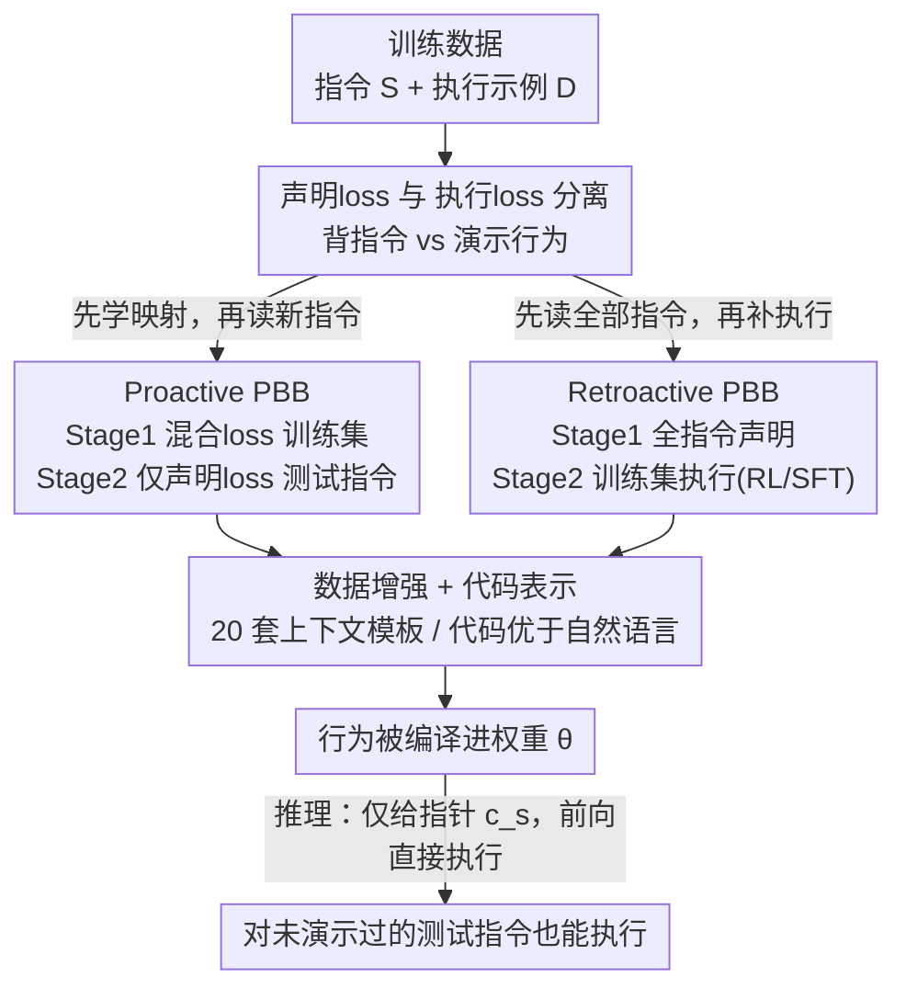

# Programming by Backprop: An Instruction is Worth 100 Examples when Finetuning LLMs

**会议**: ICLR 2026  
**OpenReview**: [https://openreview.net/forum?id=y1OWj26FCo](https://openreview.net/forum?id=y1OWj26FCo)  
**代码**: https://github.com/jonathan-cook235/Programming-by-Backprop  
**领域**: LLM训练 / 持续预训练 / 隐式学习  
**关键词**: 声明式知识, 过程式知识, 训练课程, 样本效率, 数据安全

## 一句话总结
论文提出 Programming by Backprop（PBB）——一套两阶段训练课程，让 LLM 仅凭训练数据里的"声明式指令"（如一段 Python 源码或一组语法规则）就把对应的可执行行为"编译"进权重，无需提供执行示例；实验证明一条指令最多能顶 100 条执行样例，且这一现象对数据治理与安全有直接含义。

## 研究背景与动机
**领域现状**：LLM 通常通过"演示"（预训练、SFT）或"经验"（RL）学会行为——也就是看着别人怎么做，然后模仿。但模型在预训练里接触到的海量数据其实大量是**声明式**的：指令、规则、算法描述、文档，它们只"规定"了一个过程该怎样，却没有在具体输入上演示如何执行。

**现有痛点**：人类能靠抽象指令（"快速排序就是选基准再分区递归"）直接学会一项技能，从而大幅提升学习效率；但 LLM 能否同样从训练数据里的声明式指令获得**过程式知识**（可复用、可执行的行为），此前是一个悬而未决的问题。已有的"脱离上下文推理"（OOCR）、隐式元学习等工作只提供了零散的暗示性证据，没有人**方法论上隔离地**验证"训练时见过一条指令，是否足以诱导出对应的多步、依赖输入的执行行为"，更没人提出能**增强**这种内化能力的训练方法。

**核心矛盾**：单纯最大化指令文本的似然（即把指令背下来）并**不会**自动诱导出对应行为——作者实验证明，只让模型在训练里读到一段代码，它在测试时几乎无法执行这段代码（准确率近零）。"知道"与"会做"之间存在鸿沟，这种行为获取依赖训练数据**整体分布结构**所驱动的一种隐式学习，而非局部的指令建模目标。

**本文目标**：找到能把声明式指令"编译"进模型参数、让模型在推理时仅凭一个指向指令的"指针上下文"就执行对应行为的训练方案，并刻画它的条件、可靠性与样本效率。

**切入角度**：作者借用编译原理里的**偏求值（partial evaluation）**视角——把通用解释器对固定程序做特化，得到不再需要原始指令作输入的残差程序；类比地，把基于梯度的训练看作一个特化映射 $\theta' = \Phi(\theta; \mathcal{L})$，PBB 就是用合适的训练目标 $\mathcal{L}$ 把指令的语义特化进权重。

**核心 idea**：用"声明式 loss（背指令）"与"执行 loss（演示行为）"的**分离与组合排序**设计训练课程，让模型先学会"指令如何映射到行为"的一般对应关系，再把这种对应关系迁移到只见过声明、从未见过执行的新指令上。

## 方法详解

### 整体框架
PBB 把训练数据视为可"编译"的程序：每条符号指令 $s$（一段 Python 程序或一套语法规则）都有其语义 $[\![s]\!]$，即它所定义的行为。模型 $M_\theta$ 在推理时面对的是一个**指针上下文** $c_s$（问题陈述、任务名、语法编号等，指向某条指令）和一个**输入** $x$。理想的"通用解释器"满足 $M_\theta(s, x) \approx [\![s]\!](x)$——把指令放进上下文就能执行；而 PBB 想做的是把 $[\![s]\!]$ 提前编译进 $\theta$，让推理时只需 $c_s$ 这个指针，无需再把指令喂进上下文。

整个流程由两个**互补的训练课程**实现，二者共享同一个核心原则——**把"学会指令→行为的映射"与"内化新指令"这两件事分开**，区别只在两阶段的先后次序：

测试指令（图中"评估指令"）对应被考核的行为，其执行示例在训练里**从不出现**；PBB 的成败就看模型能否对这些只读过声明、没见过演示的指令产生正确执行。

### 关键设计

**1. 把指令"编译"进权重：声明 loss 与执行 loss 的分离**

PBB 的全部设计都建立在两个训练目标的清晰区分上。**声明式 loss**（指令建模）$L_{decl}(\theta; c_s, s) := -\log p_\theta(s \mid c_s)$，是在指针上下文 $c_s$ 条件下对指令文本 $s$ 的下一 token 负对数似然——本质就是"把指令背下来"。**执行 loss**（行为建模）$L_{exec}(\theta; c_s, x, y) := -\log p_\theta(y \mid c_s, x)$，是在给定输入 $x$ 时对解 $y$ 的下一 token loss——只优化它就退化成算法蒸馏（Algorithm Distillation, AD），即从输入相关的示例里学行为。作者的关键观察是：单独优化 $L_{decl}$ 不会诱导执行能力（背了代码不等于会跑代码），但若先让 $\theta$ 经过适当训练，使得"通过 $s$ 反传的梯度"恰好与"执行相关的参数更新"对齐，那么再对 $s$ 单独做指令建模，这一步梯度更新 $\Phi_{pro}(\theta, L_{decl}) := \theta - \eta \nabla_\theta L_{decl}(\theta; c_s, s)$ 就能像"编译"一样把 $[\![s]\!]$ 写进权重。这正是把声明与执行**分阶段组合**的理论依据。

**2. Proactive PBB：先建立"指令↔行为"通则，再内化新指令**

针对"如何让背指令的梯度变得能编译行为"这个痛点，Proactive 课程把指令集划分为训练集 $S_{train}$ 与评估集 $S_{eval}$。**Stage 1** 在训练指令上优化**声明 loss 与执行 loss 的混合目标**：

$$\min_\theta \Big( \mathbb{E}_{s\sim S_{train}}[L_{decl}(\theta; s)] + \mathbb{E}_{D\sim D_{train}}\mathbb{E}_{(c,x,y)\sim D}[L_{exec}(\theta; c, x, y)] \Big),$$

实现上就是把两种格式的样本交错喂入，让模型学会"读到一条指令该如何执行"的一般对应关系。**Stage 2** 只用**声明 loss** 把评估指令 $s \in S_{eval}$ 暴露给模型（**不给任何执行示例**）。因为 Stage 1 已经把参数调到"指令梯度可预测执行更新"的状态，Stage 2 单纯背新指令就足以把对应行为编译进权重。这是 Krasheninnikov 等人隐式元学习的一种实例：Stage 1 相当于元训练阶段，为后续从指令快速泛化打底。Qwen3-14B 在 Random Arithmetic 上经完整 Proactive 课程后，对测试行为达到约 **37%** 的执行准确率，而只做单阶段则近乎为零。

**3. Retroactive PBB：先囤声明知识，再用执行监督"激活"它**

Retroactive 课程把次序反过来，解决另一种现实场景——所有指令先以纯声明形式灌入，之后才补执行监督。**Stage 1** 在**全部**指令（训练+评估）上做声明建模 $\min_\theta \mathbb{E}_{s\sim S}[L_{decl}(\theta; s)]$，此时模型获得了声明式知识但没有执行能力。**Stage 2** 只对训练集 $S_{train}$ 施加执行监督，特化算子为 $\Phi_{ret}(\theta, L_{exec}) := \theta - \eta \sum_{(c_s,x,y)\in D_{train}} \nabla_\theta L_{exec}(\theta; c_s, x, y)$。尽管梯度只来自训练指令的执行，但它们更新的是**共享参数** $\theta$，从而能"激活"Stage 1 囤积的潜在声明知识，让那些从未获得直接执行监督的评估指令在测试时也能被执行。一个重要发现是：Stage 2 用 **RL（GRPO）比 SFT 显著更有效**——SFT 初期倾向死记训练集的执行演示、要更多样本才泛化，而 RL 驱动更快、更稳健的泛化。

**4. 数据增强与算法表示：让"编译"真正发生的必要条件**

PBB 能否奏效高度依赖两个工程要素。其一是**上下文增强**：作者为每个数据集定义 **20 套上下文模板**作为指向指令的指针（如 Leetcode 的"Write a Python function that solves the following problem {s}"），每条指令随机采样一个模板；消融显示去掉增强会让 PBB 严重退化，这与 OOCR 的已有结论一致。其二是**算法表示形式**：同一算法用 Python 源码表达比用语义等价的自然语言描述更容易被学会（自然语言的歧义与冗长是主因，也可能因当前 LLM 预训练分布让它们对代码有更强归纳偏置），不过模型越大这一差距越小。此外 Proactive 的 Stage 2 还会混入 1k 条 OpenMathInstruct 样本以防遗忘指令跟随能力。这两点不是锦上添花，而是让指令梯度可编译化的前提。

## 实验关键数据

### 主实验
作者在两大领域、三套合成数据集 + 一套真实编程数据集上验证 PBB。

| 任务 / 设定 | 模型 | 关键结果 | 说明 |
|------|------|------|------|
| Random Arithmetic（完整 Proactive） | Qwen3-14B | ~37% 测试行为执行准确率 | 单阶段近乎 0%，零样本为 0 |
| 样本效率 vs 算法蒸馏(AD) | GPT-4o | 1 条指令 ≈ 100 条执行样例 | Stage 2 仅 1 条指令即媲美/超过 100 条 demo |
| Leetcode（已被预训练接触） | Qwen3 | 完整 Proactive 仍最优 | 即便零样本已较高，进一步训练指令仍能精炼执行 |
| Ciphers（OOD 自定义密码） | GPT-4o | PBB 对 shift 变化更鲁棒 | AD 在偏斜 demo 上有偏，PBB 学到输入无关函数 |
| 形式语法生成 | Qwen3 | 完整 Proactive 远超随机生成 | 无需 CoT，前向内隐式追踪语法状态 |

### 消融实验

| 配置 | 现象 | 说明 |
|------|------|------|
| 仅 Stage 1（训练指令+执行） | 测试行为表现极低 | 单靠训练集对应关系不够 |
| 仅 Stage 2（评估指令声明） | 近乎为零 | 单纯背指令不诱导执行 |
| 完整 Proactive 课程 | 显著跃升至 ~37% | 两阶段组合才是关键 |
| 代码 vs 自然语言表示 | 代码更优，模型越大差距越小 | 自然语言歧义/冗长拖累 |
| 去掉上下文增强 | PBB 退化 | 增强是必要条件 |
| Retroactive：RL vs SFT | RL 更快更稳泛化 | SFT 初期死记执行演示 |

### 关键发现
- **课程结构是充分条件、单纯加指令是不够的**：把指令塞进训练数据并不会自动赋予执行力，必须按 Proactive/Retroactive 的两阶段次序组织，"编译"才会发生。
- **隐式前向执行**：PBB 训练后的模型能在**不生成 CoT** 的情况下直接给出正确输出（虽比用 CoT 准确率低），说明多步算法运算可被隐式压进前向传播；在语法任务上模型甚至能在前向内追踪句法状态、保证规则合规。
- **组合性**：模型能在推理时组合两条**独立训练**的算法指令（如 `def Blorp(x): Zibble(Snurg(x))`），较大模型如 GPT-4o 即便不显式推理也有一定组合能力。
- **纠偏作用**：在偏斜（如偏好 ROT13）的密码演示上 AD 会学到有偏行为，PBB 学到输入无关的通用函数从而对参数变化更鲁棒；把 PBB 与偏斜 demo **混合**效果最佳——指令纠偏、演示接地。
- **可靠性边界**：从训练数据内化指令仍**不如**把指令直接放进上下文可靠，PBB 是"有噪声的编译"。

## 亮点与洞察
- **偏求值视角统一了训练与编译**：把梯度训练形式化为特化算子 $\Phi(\theta;\mathcal{L})$，借编译原理的"通用解释器特化为残差程序"类比解释 PBB，给"训练数据如何塑造行为"提供了一个干净的理论框架。
- **声明/执行 loss 分离 + 两阶段排序**是可迁移的训练设计思路：任何"想让模型从规则/文档而非演示中获得能力"的场景，都可以借鉴"先建立映射通则、再内化新规则"或"先囤声明、再用 RL 激活"的课程范式。
- **"一条指令顶 100 条样例"的样本效率结论**对数据治理极有吸引力——用少量高层规范替代大量标注演示。
- **安全含义最发人深省**：训练数据里仅以声明形式存在的指令，可能在推理时被无意"激活"出非预期行为，这把数据筛选/治理从"过滤演示"提升到"也要审查规则与描述"。

## 局限与展望
- **执行可靠性有限**：PBB 内化的行为仍明显逊于把指令直接放进上下文，是"有噪声的编译"，Qwen3-14B 在合成算术上也只有 ~37%。
- **依赖受控合成环境**：核心结论建立在自研合成数据（随机算术、自定义密码、人造 CFG）上，真实大规模预训练语料中 PBB 的强度尚不清楚；Leetcode 上 Retroactive 的"激活"收益在已熟悉域里就明显减弱。
- **Proactive 需摊销 Stage 1 成本**：高样本效率是以一次性的元训练（Stage 1）为代价的，单看 Stage 2 才"一条指令顶 100 条"。
- **机制未完全打开**：为何混合 loss 能让背指令的梯度变得"可编译"，论文给了偏求值类比与实证，但缺少对内部表示的机理级解释。
- **改进方向**：把 PBB 接入真实持续预训练管线、与课程学习已有工作结合，探索对模型规模与数据量的进一步缩放（论文观察到正向缩放趋势）。

## 相关工作与启发
- **vs 算法蒸馏 / Learning to execute**：传统执行学习（Zaremba & Sutskever；Yan 等）假设每个过程都有配对的输入-输出演示或执行级监督；PBB 反其道而行，从**符号描述**而非演示学会可执行行为，把指令当训练时的"程序"编译进参数，而非推理时的外部工具。
- **vs 代码训练促进推理**：已有工作（Aryabumi 等；Ruis 等）表明预训练接触代码/输入无关过程能提升下游推理；PBB 把这种相关性**方法论化**，给出能主动诱导该效应的训练课程，并隔离验证"一条指令是否足以诱导多步执行"。
- **vs 隐式元学习 / OOCR**：Proactive 课程紧密对应 Krasheninnikov 等的隐式元学习两阶段管线；PBB 进一步把 OOCR、隐式元学习等现象统一为"模型学到符号抽象的表示、从而在推理时执行"的一类机制，并首次给出能**增强**这一能力的训练手段。

## 评分
- 新颖性: ⭐⭐⭐⭐⭐ 把"从声明式指令编译可执行行为"形式化为训练课程，并用偏求值视角统一，角度新颖。
- 实验充分度: ⭐⭐⭐⭐ 两域三数据集 + 多模型族 + 丰富消融，但主要在受控合成环境，绝对准确率不高。
- 写作质量: ⭐⭐⭐⭐⭐ 概念清晰、形式化到位、图表与结论对应紧密。
- 价值: ⭐⭐⭐⭐⭐ 对数据治理与 AI 安全有直接、深刻的实践含义。

<!-- RELATED:START -->

## 相关论文

- [\[ICLR 2026\] Not All Documents Are What You Need for Extracting Instruction Tuning Data](not_all_documents_are_what_you_need_for_extracting_instruction_tuning_data.md)
- [\[ICLR 2026\] How to Train Data-Efficient LLMs](how_to_train_data-efficient_llms.md)
- [\[ICLR 2026\] Identifying and Evaluating Inactive Heads in Pretrained LLMs](identifying_and_evaluating_inactive_heads_in_pretrained_llms.md)
- [\[ICLR 2026\] StochasTok: Improving Fine-Grained Subword Understanding in LLMs](stochastok_improving_fine-grained_subword_understanding_in_llms.md)
- [\[ICLR 2026\] GneissWeb: Preparing High Quality Data for LLMs at Scale](gneissweb_preparing_high_quality_data_for_llms_at_scale.md)

<!-- RELATED:END -->
