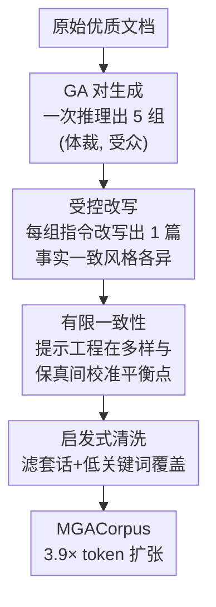

# Reformulation for Pretraining Data Augmentation

**会议**: ICLR 2026  
**OpenReview**: [https://openreview.net/forum?id=dIOYpj9K8P](https://openreview.net/forum?id=dIOYpj9K8P)  
**代码**: 数据集开源 [ByteDance-Seed/mga-fineweb-edu](https://huggingface.co/datasets/ByteDance-Seed/mga-fineweb-edu)  
**领域**: LLM 预训练 / 数据合成  
**关键词**: 数据增广, 预训练语料, 体裁-受众改写, 合成数据, 数据复用瓶颈

## 一句话总结
针对优质预训练语料不够用、反复重复又会掉点的困境，本文提出 **MGA（Massive Genre-Audience reformulation）**：用一个轻量 3.3B MoE 小模型，自适应地为每篇原始文档生成多组「体裁-受众」对，再据此把同一篇文档改写成 5 个风格各异但事实一致的新版本，最终把 195B 优质 token 扩成 770B 合成 token（3.9× 扩张），在 134M–13B 模型上都跑出比「数据重复 / 上采样」更好的 N/D 双向 scaling。

## 研究背景与动机
**领域现状**：LLM 的能力高度依赖模型规模和训练数据规模，scaling law 告诉我们效果越来越吃数据的「量」和「质」。但现实是：经过严格质量过滤后，网络语料里真正可用的高质量 token 增长速度，远远跟不上训练对数据量的需求。

**现有痛点**：当优质数据见底时，最朴素的办法是「重复训练」——把同一批数据多刷几个 epoch。这一招在传统深度学习里很常见，但在 LLM 预训练里会**反噬**：重复到一定程度模型性能不升反降，而且模型越大，发散（divergence）来得越早，重复反而成了 scaling 的瓶颈。用正则化（weight decay、dropout）去缓解重复退化又对超参极度敏感，调不好直接训崩。

**核心矛盾**：用 LLM 合成数据看似能「无限造数据」绕开重复，但主流合成路线有两类硬伤。一类是 **seed-based**（如 Phi、Cosmopedia），需要预先精心设计的种子系统和模板，工程门槛和算力门槛都很高；另一类是直接用超大模型去生成，本质是「蒸馏」而非真正的数据增广，既贵又不可复现。整个「怎么大规模合成数据」长期是大厂内部的黑盒，缺一套透明、可复现的方法学。

**本文目标**：做一个**透明、有原则、可复现**的语料改写框架，直接缓解重复瓶颈——即从原始文本里造出更多**真正唯一**的 token，而不是简单复制。同时回答三个问题：MGA 与现有合成策略是互补还是替代？多样性为什么能在高重复场景救场？改写到底从哪个层面让模型学得更好？

**切入角度**：数据改写的本质是一对矛盾——既要造出新颖、多样的内容（variance），又要保住原文的核心事实信息（invariance）。作者把这对矛盾命名为 **"Limited Consistency"（有限一致性）**，并主张：与其用固定的少量风格模板，不如**自适应地从每篇文档本身生成「体裁-受众」对**，用这两个正交维度撑开结构化的多样性。

**核心 idea**：用「为每篇文档动态生成 (Genre, Audience) 对 + 据此受控改写」来替代「固定模板合成」和「无脑重复」，在风格上放开、在事实上收紧，从而把有限的优质语料安全地扩张数倍。

## 方法详解

### 整体框架
MGA 把「一篇文档 → 五篇风格各异的改写」拆成一条两阶段流水线，再接一道清洗。输入是一篇原始优质文档，输出是若干篇事实一致但体裁/受众不同的新文档。**第一阶段**先为这篇文档生成多组创意改写指令（即 (Genre, Audience) 对），目标是把多样性拉满；**第二阶段**拿着每组指令把原文受控改写成一篇新文档，目标是在多样的同时锁住事实；最后一道**启发式清洗**滤掉套话模板和与原文关键词覆盖率过低的退化样本。整条线由两个针对子任务微调的轻量小模型（Tool SLM）驱动，总参数仅 3.3B MoE，使其能跑在 web 规模语料上。

### 关键设计

**1. 有限一致性：在「风格放开」与「事实锁死」之间找平衡点**

这是整个框架的指导原则，直击「改写要么太像原文没多样性、要么跑飞了事实出错」这个核心矛盾。作者把它定义为：**最大化改写内容的风格与结构方差（variance），同时严格保持原文核心事实的不变性（invariance）**。落地手段是提示工程（Prompt Engineering）——通过设计提示词来操纵生成过程的松紧。作者实验了三档：`SLM-Strict`（提示太严，高保真但分布几乎贴着原语料、缺多样性）、`SLM-Relaxed`（提示太松，过度偏离、分布漂移大、事实退化风险高）、`SLM-Base`（校准后的折中，在不丢主题连贯性的前提下把原分布往外扩）。t-SNE 可视化显示只有 Base 实现了「对原分布的均衡扩张」，而 Strict/Relaxed 分别过于保守和过度发散。这个原则也解释了为什么后面 Strict 在高重复下会出现类似「数据重复」的退化——光保真不够多样，救不了重复瓶颈。

**2. 自适应 GA 对生成：用「体裁×受众」两个正交维度撑开结构化多样性**

简单 rephrase 能造风格变体，但缺乏**结构化**的多样性。作者刻意选择 (Genre, Audience) 对作为改写指令的载体：**Genre 决定内容的结构与文体格式**（分析报告 / 分步教程 / 博客文章……，控制信息怎么组织呈现），**Audience 定义目标读者画像**（大学生 / 行业专家 / 好奇的青少年……，控制语气、词汇和概念深度）。关键在于 MGA 不用固定的小风格集，而是**为每篇文档自适应生成多组上下文相关的 GA 对**。实现上：让 teacher LLM 对每篇文档产出 5 组不同的 GA 对，经规则校验（JSON 结构、对数是否正确）筛过后，用这批数据训练 `GA-SLM` 执行 **"one-pass-for-many"**（一次推理出多组）策略——这样做能缓解 mode collapse，即对模型反复采样容易得到高度相似输出的问题。

**3. 受控改写 + 教师打分过滤：用「放宽到 3 分」的 SFT 防止学坏老师**

第二阶段要在 variance 和 invariance 之间落地。核心是一个微调策略：**不去死磕完美输出（5 分），而是放宽质量阈值，保证大比例改写是「广义可接受」的（≥3 分）**。形式化地，设 $D$ 为源文档、$G$ 为生成的 GA 对，teacher LLM 先产出初始合成集 $D_{synth}=\{(D_i, G_i, D'_i)\}$。但直接拿全量去训 Tool SLM 会让它**复刻老师的次优输出**，于是用 teacher LLM 当质量裁判，以打分函数 $S(D'_i)\in\{1,\dots,5\}$ 过滤出高质量子集：

$$D_{SFT} = \{(D, G, D') \in D_{synth} \mid S(D') \ge 3\}$$

`Reformulation-SLM`（参数 $\theta$）只在这个精选子集上用标准 SFT 目标训练：

$$L_{SFT}(\theta) = \mathbb{E}_{(D,G,D')\sim D_{SFT}}\big[-\log P_\theta(D'|D, G)\big]$$

这种「放宽到 3 分」而非「只要 5 分」的目标，恰好对应有限一致性——既保住高比例可用输出的多样性，又过滤掉老师的烂样本，让小模型学到「忠于原文又能换花样」的能力。Table 1 显示最终 Tool SLM 的改写质量（≥3 分占 92.06%）与 teacher LLM（93.11%）几乎持平，仅差 1.05%，证明用 3.3B 小模型替换大模型做生成是站得住的。

**4. 启发式清洗：滤掉套话模板与事实跑偏的退化样本**

两阶段合成后还有一道收尾清洗，直接守住语料质量底线。它做两件事：滤掉高频生成模式（如 "Please note that ..." 这类套话），以及删掉与源文档**关键词覆盖率极低**的文档（这类通常是改写时跑题、事实漂移的样本）。这一步是 invariance 的最后一道保险——前面靠打分过滤训练数据，这里靠规则过滤生成结果，最终在 3.9× token 扩张下仍保持高质量与多样性。

### 损失函数 / 训练策略
改写侧只用标准 SFT 目标 $L_{SFT}$（见上）。下游验证用 Llama 3 架构、134M/377M/1.7B/7B/13B 多尺寸预训练：主实验用 Warmup-Stable-Decay 调度（0.1% warmup、75% stable、25% decay）；scaling 动态实验为便于跨重复 epoch 直接比较，只用 warmup+stable 两段。语料基于 SmolLM-Corpus，改写其中 195B 的 fineweb-edu-dedup 子源，得到 770B 清洗后合成 token。

## 实验关键数据

### 主实验
固定训练预算下，把 MGA 数据并入训练（MGA-Expansion）对比只用原始源的 baseline，模型越大增益越明显：

| 模型规模 | #Tokens | baseline Avg. | MGA-Expansion Avg. | 提升 |
|--------|---------|------|----------|------|
| 134M | 600B | 31.51 | 31.77 | +0.26 |
| 377M | 600B | 34.57 | 35.52 | +0.95 |
| 1.7B | 1T | 41.15 | 43.40 | +2.15 |

增益集中在推理/知识密集任务，1.7B 上 TriviaQA +15.47、GSM8K +6.06、MMLU-Pro 也明显涨。作者推测：让模型见到同一信息的多样表述，培养了更鲁棒的泛化，进而带动了推理能力。

数据受限 scaling（13B、entire-set 场景，把 50B 优质数据扩到不同预算）：

| 策略 | 200B | 300B | 400B | 500B |
|------|------|------|------|------|
| 收集更多优质数据(+195B) | +0.2 | +0.15 | -0.16 | +0.11 |
| MGA(200B 改写扩张) | +2.65 | +3.14 | +3.43 | +3.46 |

subset 场景下，上采样（5×）的优势随模型规模基本不变（+0.89/+1.53/+1.23/+1.41），而 MGA 的 N-scaling 更好、增益随模型增大而放大（+1.46/+2.67/+3.59/+3.73）。

### 消融实验
不同提示工程档位（高重复场景下改写质量与训练表现）：

| 配置 | ≥4 分占比 | =5 分占比 | ≤2 分占比 | 训练表现 |
|------|---------|---------|---------|------|
| SLM-Base | 71.06% | 24.67% | 6.65% | 全程健康优化，最佳 |
| SLM-Strict | 78.37% | 44.38% | 4.86% | 高保真但高 iter 后退化（似数据重复） |
| SLM-Relaxed | 13.63% | 2.66% | 60.19% | 显著 collapse |

互补性实验（1.7B、800B token，35% 预算替换）：Exp C（+Nemotron-Syn +MGA）> Exp A（+Nemotron-Syn）> Exp B（+MGA）> Baseline，证明 MGA 与任务对齐的专用合成数据（如 Nemotron-CC）是**互补**而非竞争，组合使用有协同增益。

### 关键发现
- **有限一致性是核心**：Strict 虽然 ≥4 分占比更高（78% vs 71%），但在高重复下验证损失轨迹出现类似数据重复的退化；Base 全程保持健康优化——说明光保真不够，必须有受控的多样性才能真正缓解重复瓶颈。
- **验证损失会「骗人」**：MGA 在 benchmark 上更强，但验证损失反而比 baseline 高。作者论证 token 级困惑度被验证集频率分布所偏置，且 in-domain 损失未必反映 out-of-domain 泛化，因此**不能拿验证损失当 model collapse 的判据**。细粒度 token-loss 分析显示：合成训练模型在真实数据上的退化主要出现在序列**靠后位置**，而在合成数据上这种位置偏置消失——这更像是学到了「不同的学习策略」而非崩溃。
- **MGA 优势从第一个 epoch 就出现**，远早于显著重复发生，且随训练推进差距持续拉大。

## 亮点与洞察
- **把「多样 vs 保真」这对老矛盾命名为有限一致性并工程化**：用提示工程的松紧档位 + 教师打分阈值（≥3 而非 =5）两个旋钮去精确控制，比「无脑严格」或「无脑放松」都更优，这个折中思路可迁移到任何合成数据/数据增广任务。
- **(Genre, Audience) 两个正交维度**是个很巧的设计：比单纯 rephrase 多了结构化多样性，又比 seed 系统轻得多，且能自适应到每篇文档，天然适配 web 规模。
- **用 3.3B 小模型替代大模型做生成**，质量只差 1%（92.06% vs 93.11%），把合成成本压到能跑全网语料的量级——这是「数据增广」而非「蒸馏」的关键，也是可复现性的基础。
- **对验证损失的祛魅**很有价值：揭示了「合成数据训练 → 损失升高 ≠ 模型崩溃」，并给出靠后位置异常的 token 级证据，为后续合成数据评估提供了方法学警示。

## 局限与展望
- 改写源仅用了 SmolLM-Corpus 的 fineweb-edu-dedup 单一子源，其他子源（cosmopedia/python-edu/open-web-math）未做改写，跨域改写的普适性待验证。
- 质量打分依赖 teacher LLM 自评（1-5 分），虽有 >90% 人工抽检对齐率，但裁判与生成同源仍可能引入系统性偏置。
- 高重复下 Strict 退化、Relaxed collapse 的边界主要靠经验校准提示词得到，缺乏可移植到新语料/新模型的自动化选档方法。
- 验证损失升高的机制只给了「不同学习策略」的现象级解释，「为什么靠后位置更易退化」尚未有理论刻画。

## 相关工作与启发
- **vs WRAP / Nemotron-CC（raw-text rephrasing）**：同属改写路线，但 MGA 用自适应 (Genre, Audience) 对撑开结构化多样性，且系统给出了实现细节、消融与可复现 artifacts（prompt、工具模型微调数据、清洗脚本），补上了这类工作常缺的「成功合成的具体配方」。
- **vs Phi / Cosmopedia（seed-based synthesis）**：seed 路线靠预定义种子系统精确控内容，工程/算力门槛高；MGA 不需外部种子系统、用轻量 SLM 直接从原文生成指令，更易扩展和复现。
- **vs 数据重复 / 上采样**：重复会随规模更早发散、上采样的优势不随模型放大；MGA 把重复换成「真正唯一的改写 token」，实现了随模型规模放大的 N-scaling 优势。

## 评分
- 新颖性: ⭐⭐⭐⭐ 有限一致性 + 自适应 GA 对的组合清晰且实用，但改写增广整体路线已有前作。
- 实验充分度: ⭐⭐⭐⭐⭐ 134M–13B 多尺寸、N/D 双向 scaling、互补性/多样性/损失三大 RQ 都做了系统验证。
- 写作质量: ⭐⭐⭐⭐ 围绕三个 RQ 组织，逻辑清楚；部分机制（损失靠后位置退化）仅现象级解释。
- 价值: ⭐⭐⭐⭐⭐ 直击数据见底瓶颈，开源 770B 语料 + 全套 artifacts，方法学透明可复现，实用价值高。

<!-- RELATED:START -->

## 相关论文

- [\[ICLR 2026\] Scaling Laws Revisited: Modeling the Role of Data Quality in Language Model Pretraining](scaling_laws_revisited_modeling_the_role_of_data_quality_in_language_model_pretr.md)
- [\[ICLR 2026\] Synthetic Bootstrapped Pretraining](synthetic_bootstrapped_pretraining.md)
- [\[ICLR 2026\] Distilled Pretraining: A modern lens of Data, In-Context Learning and Test-Time Scaling](distilled_pretraining_a_modern_lens_of_data_in-context_learning_and_test-time_sc.md)
- [\[ICLR 2026\] Beyond Length: Quantifying Long-Range Information for Long-Context LLM Pretraining Data](beyond_length_quantifying_long-range_information_for_long-context_llm_pretrainin.md)
- [\[ICLR 2026\] Pretraining Scaling Laws for Generative Evaluations of Language Models](pretraining_scaling_laws_for_generative_evaluations_of_language_models.md)

<!-- RELATED:END -->
