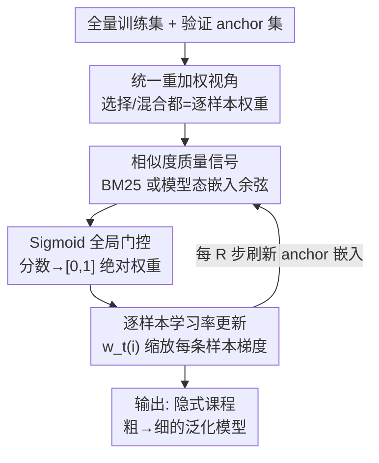

# Rethinking Data Curation in LLM Training: Online Reweighting Offers Better Generalization than Offline Methods

**会议**: ICLR 2026  
**OpenReview**: [https://openreview.net/forum?id=UFwnsmFZ6R](https://openreview.net/forum?id=UFwnsmFZ6R)  
**代码**: https://github.com/Ryan0v0/ADAPT  
**领域**: LLM预训练 / 数据筛选  
**关键词**: 数据筛选, 在线重加权, 隐式课程学习, 泛化, 逐样本学习率

## 一句话总结
这篇论文把 LLM 的数据筛选（selection）、数据混合（mixing）统一成一个"在线重加权"问题，提出 ADAPT——在训练过程中用样本与验证集的语义相似度动态调整每个样本的逐样本学习率，不删一条数据，几乎零额外开销，却在指令微调和预训练上都比离线筛选/混合方法获得更强的跨基准泛化。

## 研究背景与动机

**领域现状**：LLM 的泛化能力很大程度上取决于训练数据的质量、多样性和配比。当下主流的数据筛选（curation）几乎都走"离线"路线，分两派：一是**数据选择（selection）**，按某个质量分数把语料砍成一个子集；二是**数据混合（mixing）**，按域调整各来源的采样比例。两者通常都是同一套多阶段流水线——先用代理模型（proxy model）抽特征/打分，再在验证集上算质量信号当筛选标准，最后在筛过的数据上从头训练主模型。

**现有痛点**：作者指出离线范式有两个根本缺陷。其一是**忽略训练动态**：一条样本的价值不是静态的，会随模型的学习而变；离线选择用代理模型把价值"冻结"在训练开始前，和真正训练的模型不断演化的需求错位。其二是**牺牲多样性**：靠硬阈值砍出一个固定子集，等于丢掉了对鲁棒泛化至关重要的广分布数据。

**核心矛盾**：作者用一组实验（§4）戳破了离线选择的"幻觉"——以 MMLU 为验证集选数据训练的模型，在 MMLU 基准上表现很好，但换到 BBH 基准上泛化急剧崩塌，LESS 这种梯度影响法尤其严重。换句话说，离线方法是在**过拟合所选验证任务**，而不是学到真泛化；反倒是用全量数据 vanilla 训练在两个基准上都更稳。一个可能的原因是：离线 curation 靠重复/重采样改变数据量，会让模型用"记忆"替换掉"泛化"。

**本文目标**：要找一种数据筛选范式，既能保住数据多样性、又能随模型状态自适应、还要在统一的 FLOPs 口径下真正划算。

**切入角度 + 核心 idea**：把数据筛选从"训练前的静态预处理"重新表述为"训练中的动态损失加权"。不再硬砍子集，而是保留全量数据、用 loss 权重动态调节每条样本对梯度的贡献——这个权重相当于一个**逐样本学习率**，控制每条样本在参数更新里的"步长"。一句话：**用在线逐样本重加权替代离线硬筛选来解决泛化崩塌**。

## 方法详解

### 整体框架

ADAPT（Adaptive Data reweighting for Pretraining and FineTuning）做的事可以这样鸟瞰：训练照常在**全量训练集**上跑，但每个 mini-batch 里的每条样本不再平等——它会先被算一个与验证集（anchor set）的相似度分数，分数经过一个带温度的 sigmoid 门控变成 $[0,1]$ 的权重 $w_t(i)$，这个权重直接乘到该样本的梯度上，等价于给它一个**逐样本学习率**。整个过程嵌在训练循环里，不预处理、不删数据，所以额外开销极小。

形式上，第 $t$ 步对 mini-batch $B_t$ 的参数更新是：

$$\theta_{t+1} = \theta_t - \eta \sum_{i \in B_t} w_t(i)\, \nabla_\theta \ell\big(f_\theta(x_i), y_i\big)$$

其中 $w_t(i) \ge 0$ 越大、该样本的有效步长越大；权重小的样本被压低贡献，但**不会被删掉**。这就是它和离线"硬切"的根本区别：离线把权重写成 0/1 二值或域级固定分数，ADAPT 则让权重在 $[0,1]$ 连续浮动、并随模型状态逐步刷新。

### 关键设计

**1. 统一重加权形式化：把选择/混合/平衡都还原成逐样本权重**

离线选择和离线混合一直被当成两种不同的技术，作者证明它们其实是同一个重加权框架的特例，从而第一次能在同一把尺子下比较。所有质量信号都写成一个打分函数 $s(x) \equiv s(x;\theta,\mathcal{D}_{val})$。在这个视角下：**数据选择**等于按阈值赋二值权重 $w(x) = \mathbb{1}[s(x) \ge \tau] \in \{0,1\}$；**数据混合**等于域级的分数权重 $w_d = g(s_d)/\sum_{d'} g(s_{d'})$（常取 $g:s\mapsto\exp(s)$），决定各域分到多少训练预算；而**在线重加权**则是样本级的连续权重 $w(x)=g(s(x))$，缩放到损失里 $\mathcal{L}^*(\theta)=\frac{1}{Z}\sum_x w(x)\mathcal{L}(\theta;x)$。这个统一不仅是概念上的优雅，更直接催生了下面那个公平的 FLOPs 评测协议——把"算分的预处理开销"和"训练开销"放进同一个公式里比，离线方法那套"先跑代理模型再重训"的隐藏成本第一次被算进总账。

**2. 相似度质量信号：用模型自身表示而非冻结编码器来打分**

权重要靠一个"这条样本和我关心的下游分布有多像"的信号驱动。ADAPT 提供两档信号。一档是 model-agnostic 的 **ADAPT-BM25**，用稀疏检索 BM25 度量训练样本和验证样本的词项重叠 $s_{BM25}(x)=\frac{1}{|\mathcal{D}_{val}|}\sum_{v} BM25(x,v)$，便宜但只抓表层。真正的主角是 **ADAPT**：它不用冻结的外部编码器，而是用**模型当前的稠密表示**。对输入 $x$ 取末层隐状态 $\{h_i\}$，做一个**位置加权平均池化** $\phi(x)=\sum_i w_i h_i$，其中 $w_i = i/\sum_j j$ 让靠后的 token 权重更高——这是为了抵消 decoder-only 因果掩码带来的偏置（靠后 token 看到的上下文更全）。相似度即 $s_{ADAPT}(x)=\frac{1}{|\mathcal{D}_{val}|}\sum_v \cos(\phi(x),\phi(v))$。相比 LESS 这类梯度影响法，语义嵌入信号在训练早期不会像梯度那样剧烈抖动，也不用频繁算昂贵的梯度，提供了一个更平滑、随模型表示空间一致演化的信号。

**3. Sigmoid 全局门控：让权重只取决于自身相似度，不受 batch 构成干扰**

把相似度变成权重时，作者刻意避开了 softmax 这类"批内归一化"方案，改用带温度的 sigmoid 做**全局门控**：

$$w_t(i)=\sigma\!\left(\frac{s_{ADAPT}(x_i)}{\max(\tau,\epsilon)}\right)=\frac{1}{1+\exp(-s_{ADAPT}(x_i)/\max(\tau,\epsilon))}$$

温度 $\tau$（默认 $1.0$）控制 sigmoid 陡峭程度：大 $\tau$ 让权重分布更平，小 $\tau$ 把高低相似度样本拉得更开；$\epsilon=10^{-8}$ 保数值稳定。这样设计的好处是权重落在绝对区间 $[0,1]$，**只由该样本自己的相似度决定，而非它在当前 batch 里的排名**——同一条样本无论落在高质量还是低质量的 batch 里都拿到同样的权重，对 batch 级质量波动鲁棒。这正是 softmax 批内归一化做不到的：那种方案下权重是相对的，会被 batch 构成放大或压制。此外，算余弦前对嵌入做 L2 归一化保证尺度不变，权重还会被裁剪以防有效学习率过大导致梯度爆炸。

**4. 在线锚点刷新：让相似度始终对齐演化中的模型表示**

既然信号来自模型自己的表示，而表示在训练中一直变，那固定的 anchor 嵌入很快就会过期。ADAPT 每隔 $R$ 步用当前参数 $\theta_t$ 对验证集做一遍前向，**刷新 anchor 嵌入** $\{\phi(v)\}_{v\in\mathcal{D}_{val}}$，让相似度分数反映模型此刻的表示空间而非早期的陈旧嵌入。$R$ 是平衡"计算开销 vs 表示新鲜度"的超参。正是这个刷新机制让 ADAPT 表现出**隐式课程学习**：从 epoch 1 到 epoch 2，相似度分布从塌缩、同质的表示转向更分散、更细粒度的嵌入——模型先按粗粒度的"容易"模式聚类样本，再逐步转向更难的细粒度区分，等于在没有任何显式调度的情况下复现了课程学习的原理。

### 损失函数 / 训练策略

训练目标就是被逐样本权重缩放后的加权损失（见整体框架的更新式），没有引入额外的辅助 loss。指令微调用 LoRA 微调 LLAMA-2-7B；预训练用 120M 参数的 TinyLlama 架构（配 FlashAttention、Lit-GPT）。anchor 集通常从评测分布里采样构建（如预训练实验从 8 个基准各采 50 条验证样本）。

## 实验关键数据

### 主实验

指令微调：LoRA 微调 LLAMA-2-7B，训练数据为 FLAN V2 / COT / DOLLY / OpenAssistant1（不含目标查询的明显 in-domain 数据），用 MMLU(val) 选数据，分别在 MMLU(test，5-shot) 和 BBH(test，3-shot) 上评测泛化。

| 方法 | MMLU(val)→MMLU(test) | MMLU(val)→BBH(test，OOD) |
|------|------|------|
| BM25 (离线) | 48.7 ± 0.9 | 42.3 ± 0.8 |
| Embedding (离线) | 47.0 ± 0.6 | 40.1 ± 0.5 |
| LESS (离线，梯度影响) | 50.2 ± 0.5 | 38.7 ± 1.5 |
| PPL (离线) | 46.2 ± 1.1 | 40.9 ± 0.9 |
| Random | 43.5 ± 0.3 | 38.4 ± 1.0 |
| Full Dataset SFT | 49.7 ± 0.2 | 44.4 ± 0.3 |
| **ADAPT-BM25** | **50.9 ± 0.6** | 43.7 ± 1.2 |
| **ADAPT** | 50.7 ± 0.7 | **44.8 ± 1.3** |

关键看 OOD 列：LESS 在 in-domain（MMLU→MMLU）拿到 50.2，但换到 BBH 直接掉到 38.7，比随机选还差，暴露了离线选择的过拟合；ADAPT 则在 BBH 上达到 44.8，是全表最高，跨基准泛化甚至略超全量微调。论文称在等 FLOPs 下相对离线 baseline 最高有 7.2% 的每 FLOP 准确率提升、6.1% 更强的域外泛化。

预训练：TinyLlama-120M，从 SlimPajama 采 9B 唯一 token、训 50B token（约 5.6 epoch），在 15 个下游基准 0-shot 评测，对比 Uniform / LinUpper / DoReMi / RegMix。

| 方法 | Average (All) ↑ | Average (Unseen) ↑ | FLOPs 开销 ↓ |
|------|------|------|------|
| Uniform | 37.81 ± 0.13 | 31.98 ± 0.09 | 0 |
| LinUpper (在线) | 37.03 ± 0.12 | 30.56 ± 0.28 | 0 |
| DoReMi | 37.32 ± 0.15 | 31.95 ± 0.17 | $4.92\times10^{19}$ |
| RegMix | 37.97 ± 0.02 | 32.46 ± 0.39 | $3.07\times10^{18}$ |
| **ADAPT-BM25** | **38.05 ± 0.21** | 33.49 ± 0.37 | $\ll 1.0\times10^{14}$ |
| **ADAPT** | 38.00 ± 0.22 | **33.73 ± 0.39** | $\ll 1.1\times10^{15}$ |

ADAPT 在 Average(Unseen) 这个真正衡量泛化的指标上领先所有 baseline，而打分的 FLOPs 开销比 DoReMi/RegMix 低好几个数量级（$10^{14\sim15}$ vs $10^{18\sim19}$）。

### 消融实验

| 配置 | 关键现象 | 说明 |
|------|---------|------|
| ADAPT vs ADAPT-BM25 | OOD 44.8 vs 43.7 | 用"模型态嵌入"信号比固定的 BM25 信号泛化更好，证明随模型状态自适应的价值 |
| ADAPT-BM25 vs 离线 BM25 | 50.9/43.7 vs 48.7/42.3 | 同一质量信号，仅"在线 vs 离线"之差，在线版两项都更高 |
| Sigmoid 全局门控 vs softmax 批内归一化 | 权重不随 batch 构成变化 | 全局门控对 batch 级质量波动鲁棒 |
| 有效数据占比 | 权重求和 ≈ 0.501 | 系统自动决定"有效用了一半数据"，并会随语料整体质量自适应 |

### 关键发现
- **离线选择的"泛化崩塌"是核心动机证据**：LESS 在 in-domain 强、OOD 崩，揭示它过拟合所选验证任务；ADAPT 保住全量多样性 + 随模型态刷新，OOD 反而最稳。
- **模型态信号 > 固定信号**：ADAPT（动态嵌入）OOD 优于 ADAPT-BM25（静态 BM25），说明"适配演化中的模型状态"是泛化提升的关键来源。
- **隐式课程是涌现而非设计**：相似度分布从 epoch1 到 epoch2 由塌缩走向分散，模型自发从粗粒度模式过渡到细粒度区分，无需任何显式课程调度。
- **几乎零开销**：打分摊销在训练循环内（用现成 logits/隐状态），总 FLOPs 远低于需要代理模型重训的离线方法。

## 亮点与洞察
- **"选择/混合/重加权"三合一的统一视角**很漂亮：把数据筛选还原成逐样本权重后，原本无法直接比较的方法落到同一坐标系，还顺手催生了把预处理开销算进总账的公平 FLOPs 协议——这套协议本身就是可复用的评测贡献。
- **把数据筛选转成"逐样本学习率"**这个重新表述是最"啊哈"的地方：不删数据、只调步长，等于用优化器层面的手段实现了数据层面的 curation，从根上避开了硬筛选丢多样性的问题。
- **位置加权池化**抵消 decoder-only 因果掩码偏置，是个轻巧但有针对性的小 trick，可迁移到任何需要从自回归模型取句向量的场景。
- **全局 sigmoid 门控替代 softmax 批内归一化**：让权重"绝对化"而非"相对化"，对 batch 构成鲁棒，这个思路对任何做样本加权的训练都有借鉴价值。

## 局限与展望
- 实验规模偏小：预训练只到 TinyLlama-120M、指令微调用 LoRA 微调 7B，是否在更大模型上保持优势未验证。
- 强依赖 anchor/验证集的代表性：相似度信号本质是"向验证分布靠拢"，若 anchor 集选得不好，可能把数据导向窄分布；论文虽强调保多样性，但权重仍由相似度主导。
- 锚点刷新间隔 $R$、温度 $\tau$、裁剪阈值等超参对结果的敏感性论文给的扫描有限。
- "有效数据占比 0.501"是观察值而非可控量，实际部署中如何预判/调控这个比例还不清楚。

## 相关工作与启发
- **vs LESS（梯度影响法）**: LESS 用代理模型算梯度内积估计验证损失下降，是离线、静态、且 in-domain 易过拟合；ADAPT 用在线语义相似度，信号更平滑、随模型态演化，OOD 泛化显著更强，且开销低几个数量级。
- **vs DoReMi / RegMix（数据混合）**: 它们在**域级**调采样比例，粒度粗且要先跑代理模型；ADAPT 在**样本级**连续加权，不改数据量、几乎零额外 FLOPs，泛化（Unseen）更高。
- **vs LinUpper（在线 loss 重加权）**: LinUpper 按归一化 loss 加权并设上限防 outlier，但本质是基于 loss 的；ADAPT 用相似度信号而非 loss，避开了 loss 噪声，预训练 Unseen 上 33.73 明显高于 LinUpper 的 30.56。

## 评分
- 新颖性: ⭐⭐⭐⭐⭐ 把选择/混合统一为在线逐样本重加权、并转成"逐样本学习率"的视角切换很有思想性
- 实验充分度: ⭐⭐⭐⭐ 覆盖指令微调+预训练、多基准 OOD 评测和统一 FLOPs 协议，但模型规模偏小
- 写作质量: ⭐⭐⭐⭐ 动机—形式化—方法—评测链条清晰，统一视角讲得透
- 价值: ⭐⭐⭐⭐⭐ 几乎零开销、即插即用、跨任务无需重跑流水线，工程实用性强

<!-- RELATED:START -->

## 相关论文

- [\[ICLR 2026\] Can Small Training Runs Reliably Guide Data Curation? Rethinking Proxy-Model Practice](can_small_training_runs_reliably_guide_data_curation_rethinking_proxy-model_prac.md)
- [\[ICLR 2026\] Rewriting Pre-training Data Boosts LLM Performance in Math and Code](rewriting_pre-training_data_boosts_llm_performance_in_math_and_code.md)
- [\[ICLR 2026\] Late-to-Early Training: 让 LLM 更早学到后期知识，从而更快更好](late-to-early_training_let_llms_learn_earlier_so_faster_and_better.md)
- [\[ICML 2026\] Data Difficulty and the Generalization--Extrapolation Tradeoff in LLM Fine-Tuning](../../ICML2026/llm_pretraining/data_difficulty_and_the_generalization--extrapolation_tradeoff_in_llm_fine-tunin.md)
- [\[ICLR 2026\] Scaling with Collapse: Efficient and Predictable Training of LLM Families](scaling_with_collapse_efficient_and_predictable_training_of_llm_families.md)

<!-- RELATED:END -->
