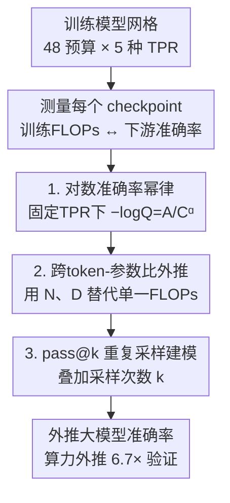

# Revisiting the Scaling Properties of Downstream Metrics in Large Language Model Training

**会议**: ICLR 2026  
**OpenReview**: [https://openreview.net/forum?id=YnJ2s4WeNF](https://openreview.net/forum?id=YnJ2s4WeNF)  
**代码**: https://github.com/apple/ml-scaling-downstream-metrics  
**领域**: LLM预训练 / Scaling Laws  
**关键词**: 下游指标 scaling law、幂律、直接预测、两阶段法、pass@k

## 一句话总结
本文挑战「下游 benchmark 准确率不可预测」的成见，提出**直接**从训练 FLOPs 建模下游准确率的两参数幂律 $-\log Q = A/C^{\alpha}$，并扩展到不同 token-参数比与重复采样 pass@k；在最大 17B 参数、350B token 的网格实验上证明它比经典的「先预测代理指标再映射到准确率」的两阶段法外推更准、更稳。

## 研究背景与动机

**领域现状**：Scaling laws 是规划大规模训练的标准工具，但传统上只对**代理指标**（如预训练 log-perplexity）建模——因为 loss 随算力下降的曲线非常光滑、可外推。研究者据此选最优的 token-参数比、规划大模型预算。

**现有痛点**：人们真正关心的是**下游能力**（常识、推理、数学、代码的 benchmark 准确率），但学界普遍认为下游指标「noisy and unreliable」，无法像 loss 那样直接预测。于是主流做法退而求其次，采用**两阶段法**：先把训练预算映射到一个代理指标（loss 或正确答案的负对数似然 NLL），再用第二个函数把代理指标映射到准确率（如 LLaMA 3、Chen et al.、Bhagia et al. 的 compute-efficient ladder）。

**核心矛盾**：两阶段法看似把难题拆解了，实则**误差会逐级累积**——第一阶段（FLOPs→NLL）的拟合误差被第二阶段（NLL→准确率）放大，最终外推方差更大、预测更差；而且当下游指标不是「按 log-prob 排序的多选题」（如代码 pass rate、exact-match 生成）时，代理指标怎么选、怎么校准都不清楚。更麻烦的是「涌现」现象——有些能力随算力出现突变台阶，让「单一全局代理→准确率映射」的假设站不住。

**本文目标**：(1) 验证下游准确率本身是否随训练预算可预测；(2) 找一个**直接**从 FLOPs 预测准确率、不依赖中间代理的简单函数形式；(3) 把它扩展到不同 token-参数比与代码任务的 pass@k 重复采样。

**切入角度**：作者在初步探索中观察到一个关键经验现象——在 log-log 坐标下，**对数准确率 $\log Q$ 与训练 FLOPs 近似呈线性**。这意味着 $-\log Q$ 本身就是 $C$ 的幂律。既然能直接拟合，就没必要绕道代理指标。

**核心 idea**：用「对数准确率的幂律」直接替代「FLOPs→代理→准确率」的两阶段链路，绕过中间环节、消除误差累积。

## 方法详解

### 整体框架
本文要解决的是「只看训练算力，能不能直接、准确地预测一个大模型在各类 benchmark 上的准确率」。整体做法是：先训练一个覆盖多种算力预算和 token-参数比的**模型网格**，逐一测量每个 checkpoint 的训练 FLOPs 与下游准确率；然后用一个**简单的两参数幂律**拟合「对数准确率 vs FLOPs」的关系；再把这个基础律分别扩展到「不同 token-参数比」和「代码任务的 pass@k 重复采样」两个维度；最后用小算力区间拟合出的系数，外推到算力大 6.7 倍的留出大模型上验证预测精度。

三个关键设计是层层递进的：设计 1 给出固定 token-参数比下的基础幂律，设计 2 把横轴从单一 FLOPs 拆成模型规模 $N$ 与数据量 $D$ 两个自由度，设计 3 再叠加推理侧的采样次数 $k$。

### 关键设计

**1. 直接幂律：把对数准确率建成训练算力的幂律，绕过中间代理**

针对「两阶段法误差累积」的痛点，作者直接对最终目标——准确率——建模。先排除了两个朴素选项：经典 BNSL（Broken Neural Scaling Law，Eq.1，带一个转折点的分段线性平滑近似 $Q = a + bC^{-c_0}(1+(C/d_1)^{1/f_1})^{-c_1 f_1}$）参数多达四个；而直接把 $Q$ 写成 $C$ 的幂律又会强制曲线**严格凹**，与实测不符（ARC-Easy、HellaSwag 在低算力段是凸、高算力段才转凹，整体呈 S 形）。作者的解法是对**对数准确率**而非准确率本身建幂律：

$$-\log(Q) = \frac{A}{C^{\alpha}}$$

其中 $A>0$、$\alpha>0$ 是每个 benchmark 各自拟合的两个系数。这个形式天然能描述 S 形曲线，且只有两个参数。对多选题还有个细节修正：幂律隐含 $Q$ 的下渐近线为 0，但多选题随机猜也有 $Q_{\text{random}}>0$，所以先把准确率归一化到 $[0,1]$：

$$Q' = \frac{Q - Q_{\text{random}}}{1 - Q_{\text{random}}}$$

其中 $Q_{\text{random}}$ 由一组算力低于 $1\times10^{17}$ FLOPs 的小模型平均表现估计。拟合时只用准确率高出随机基线至少 5 个百分点的 run（太接近随机的点方差大、会扰乱拟合）。这一招让「直接预测」成立，验证集 MAE 仅约 0.0195、MRE 约 1.95%。

**2. 跨 token-参数比外推：把单一 FLOPs 拆成规模 $N$ 与数据量 $D$ 两个自由度**

设计 1 固定 token-参数比（TPR=20，接近 Chinchilla 最优点）后只依赖总算力，但实际中模型规模和训练 token 数可以不同配比。作者把对数准确率改写成 $N$（参数量）与 $D$（数据量）的函数，思路上对标 Hoffmann et al. 的预训练 loss 律，但**关键区别是去掉了不可约项**：

$$-\log Q = \frac{A}{N^{\alpha}} + \frac{B}{D^{\beta}}$$

理由很直接——perplexity 律里的不可约项代表数据固有熵、构成性能下限；而准确率的理论上限是 1，作者假设无限算力下模型可达到完美准确率，因此**没有不可约误差项**。系数 $A,\alpha,B,\beta$ 用 L-BFGS-B 最小化 Huber loss（$\delta=10^{-3}$）拟合。在「算力 $>6\times10^{21}$ FLOPs 或 TPR $>80$」的留出集上，验证 MAE 约 0.0191、MRE 约 1.91%，说明此式能跨配比预测。

**3. pass@k 重复采样建模：把推理侧的采样次数 $k$ 也纳入律中**

代码任务常用 pass@k（采样 $k$ 次至少一次通过）衡量，增加推理算力（更大 $k$）能提升通过率，但这一维度此前未与训练 scaling 律统一。作者观察到两个规律：固定训练预算时，$-\log(\text{pass@k})$ 对 $\log k$ 近似线性（即通过率随 $k$ 呈幂律）；而这条线的**斜率随训练算力变陡**。把这两点和设计 1（对应 $k=1$）耦合，得到带交叉项的联合式：

$$\log(-\log Q(C,k)) = \log A + \alpha\log C + \beta\log k + \delta\log C\log k$$

其中 $\delta\log C\log k$ 这一交叉项正是用来刻画「斜率随算力变化」的。在 HumanEval 上用「FLOPs $<6\times10^{21}$ 且 $k\le32$」拟合、其余作验证，验证 MAE 约 0.0284、MRE 约 7.94%。附录 C 还给出 $k$ 次独立尝试通过率的解析上下界作为该式的理论支撑。

### 损失函数 / 训练策略
本文不训练新目标，而是拟合 scaling law 系数：设计 1 用最小二乘拟合 $A,\alpha$；设计 2、3 用 L-BFGS-B 最小化 Huber loss（$\delta=10^{-3}$）。模型本体是标准 pre-norm decoder-only Transformer（RoPE + SwiGLU，词表 150k，序列长 4096），数据为 75% DCLM + 15% Stack v2（代码）+ 10% OpenMathReasoning 的混合，另有一套纯 C4 混合用于验证结论不依赖单一数据配比。

## 实验关键数据

规模：48 个训练预算 × 5 种 token-参数比（10/20/40/80/160），共约 130 次实验，最大 17B 参数、训练至 350B token，12 个 benchmark（ARC-E/C、SciQ、PIQA、HellaSwag、WebQS、Winogrande、LAMBADA、TriviaQA、GSM8K、HumanEval、LBPP），两套数据混合。

### 主实验：直接幂律 vs BNSL vs 两阶段法

用 $3\times10^{18}\sim6\times10^{21}$ FLOPs 拟合、外推到算力最大 6.7 倍的留出模型，跨所有 benchmark 平均：

| Scaling Law 策略 | MRE (%) | MAE | RMSE | $R^2$ |
|------|------|------|------|------|
| PowerLaw（本文直接幂律） | **1.96** | **0.015** | 0.011 | 0.986 |
| BNSL（直接，4 参数） | 2.71 | 0.020 | **0.007** | **0.993** |
| TwoStage-Linear | 6.67 | 0.044 | 0.023 | 0.943 |
| TwoStage-Logistic | 6.35 | 0.047 | 0.017 | 0.974 |

关键反差：两阶段法在**训练集内**拟合优度常更好（$R^2$ 更高、RMSE 更低，如 TwoStage-Logistic 的 $R^2$=0.987），但**外推**时 MRE 是直接法的 3 倍以上——印证了误差累积的判断。直接幂律以仅 2 个参数取得最低验证误差。

### 代理指标相关性分析

| 代理指标 | $R^2$ | 说明 |
|------|------|------|
| C4 Loss | 0.993 | 以 ARC-Easy 为例 |
| Neg LogLikelihood Norm | 0.989 | 用逻辑函数 $\text{Acc}=1/(1+e^{-a\cdot\text{proxy}+b})$ 拟合 |
| Brier Score | 0.997 | 各代理与准确率相关性都很强 |

发现：log-prob、eval loss、Brier 等代理指标与下游准确率相关性都很高（$R^2>0.95$），说明**代理指标选哪个不是瓶颈**——两阶段法的弱点不在第一阶段选错代理，而在多阶段结构本身放大误差。

### 关键发现
- **直接 > 两阶段**：即便两阶段模型在训练数据上拟合更好，外推预测仍显著更差，根因是误差跨阶段累积。
- **简单幂律 ≈ BNSL**：两参数幂律外推质量与四参数 BNSL 相当甚至略优，更简单、更鲁棒；敏感性分析显示直接法在不同 FLOPs 阈值下稳定，两阶段法则容易高误差。
- **结论不挑数据**：换成纯 C4 数据混合后（44 个预算、TPR=20），在高出随机 10 个百分点以上的 8 个任务上拟合质量与主混合相当——scaling 趋势不局限于某一数据配比。
- **去不可约项是对的**：准确率上限为 1，无需 perplexity 律里的固有熵下限项。

## 亮点与洞察
- **「对数准确率呈幂律」这个经验观察是全文支点**：把看似不可预测的准确率，通过取对数变成 log-log 线性，既能描述 S 形又只需两个参数——朴素地直接对 $Q$ 建幂律会强制凹性而失败，取对数恰好解锁了 S 形表达力。
- **「训练集拟合更好 ≠ 外推更准」是可迁移的方法论警示**：两阶段法 $R^2$ 更高却外推更差，提醒做任何 scaling 预测都要以**留出外推误差**而非样本内拟合优度为准。
- **不可约项的取舍来自任务语义**：loss 律有固有熵下限故保留不可约项，准确率上限是 1 故去掉——这种「按指标的理论边界决定函数形式」的思路可迁移到其他指标建模。
- **pass@k 的交叉项设计**把训练算力与推理采样次数统一进一个律，对规划「训练 vs 推理算力分配」有实用价值。

## 局限与展望
- 作者把工作定位为「incremental and complementary」，不声称提出新的普适律，只在固定的预训练数据集与评测集上给出轻量配方与诊断。
- 准确率「无限算力达到 1」的假设对存在结构性上限或污染的 benchmark 未必成立；论文也承认涌现/非单调指标仍可能破坏平滑外推。
- 实验上限 17B 参数、350B token，相对前沿模型规模仍小；外推 6.7 倍虽显著但远未触及百倍级跨度。
- pass@k 律的验证 MRE（约 7.9%）明显高于分类/生成任务，重复采样建模的精度仍有提升空间。
- 改进方向：把代理无关的直接律推广到更大规模、更多指标族，以及与数据选择（如 DataDecide）等正交维度结合。

## 相关工作与启发
- **vs 两阶段法（LLaMA 3 / Chen et al. / Bhagia et al. compute-efficient ladder）**：他们先 FLOPs→代理（loss/NLL）再代理→准确率，本文直接 FLOPs→准确率；区别在于绕过中间映射，避免误差累积，且不受「代理只适用于排序多选题」的限制。
- **vs BNSL（Caballero et al.）**：BNSL 用四参数分段线性平滑近似，本文用两参数对数幂律，外推质量相当但形式更简、更鲁棒。
- **vs loss-to-loss / 涌现分析（Brandfonbrener et al.、Du et al.、Schaeffer et al.）**：这些工作解释代理指标为何/何时可预测下游，本文则把重心放在评测侧，强调跨指标族（排序分类、exact-match 生成、CoT 数学、代码 pass rate）的直接可预测性与 model-agnostic 流程。
- **vs 重复采样 scaling（Brown et al. large language monkeys 等）**：他们发现 pass@k 随 $k$ 呈幂律，本文进一步把训练算力 $C$ 与 $k$ 用交叉项耦合成统一律。

## 评分
- 新颖性: ⭐⭐⭐⭐ 不是全新律，但「直接幂律绕过两阶段」的视角转换与系统验证扎实
- 实验充分度: ⭐⭐⭐⭐⭐ 130 次实验、至 17B/350B、12 benchmark、两套数据、留出外推验证齐全
- 写作质量: ⭐⭐⭐⭐ 逻辑清晰、函数形式推导直白，公式与图表对应明确
- 价值: ⭐⭐⭐⭐⭐ 给「从小实验预测大模型下游能力」提供了简单、可复现、开源数据的实用配方

<!-- RELATED:START -->

## 相关论文

- [\[ICLR 2026\] Unveiling Downstream Performance Scaling of LLMs: A Clustering-Based Perspective](unveiling_downstream_performance_scaling_of_llms_a_clustering-based_perspective.md)
- [\[ICLR 2026\] SPICE: Submodular Penalized Information–Conflict Selection for Efficient Large Language Model Training](spice_submodular_penalized_informationconflict_selection_for_efficient_large_lan.md)
- [\[ICLR 2026\] Scaling Laws Revisited: Modeling the Role of Data Quality in Language Model Pretraining](scaling_laws_revisited_modeling_the_role_of_data_quality_in_language_model_pretr.md)
- [\[ICLR 2026\] Pretraining Scaling Laws for Generative Evaluations of Language Models](pretraining_scaling_laws_for_generative_evaluations_of_language_models.md)
- [\[ICLR 2026\] Scaling Behavior of Discrete Diffusion Language Models](scaling_behavior_of_discrete_diffusion_language_models.md)

<!-- RELATED:END -->
