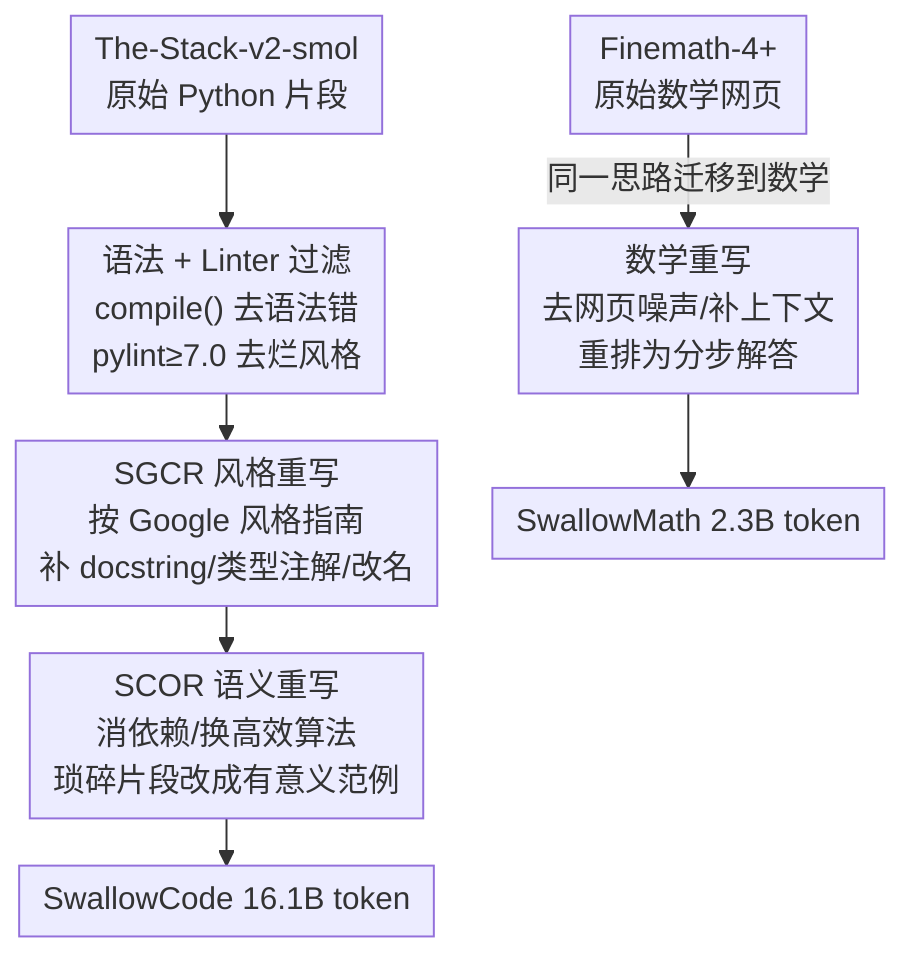

# Rewriting Pre-training Data Boosts LLM Performance in Math and Code

**会议**: ICLR 2026  
**OpenReview**: [https://openreview.net/forum?id=45btPYgSSX](https://openreview.net/forum?id=45btPYgSSX)  
**代码**: https://github.com/rioyokotalab/swallow-code-math  
**领域**: LLM预训练 / 数据工程  
**关键词**: 预训练数据, 数据重写, 代码生成, 数学推理, transform-and-retain

## 一句话总结
本文不靠"过滤丢弃"而是用一个 70B 大模型把公开代码/数学语料"重写干净再保留"，构建出 SwallowCode（≈16.1B token）与 SwallowMath（≈2.3B token）两个数据集；在固定 50B token 预算的继续预训练里，让 Llama-3.1-8B 在 HumanEval 上 pass@1 提升 +17.0、GSM8K 提升 +12.4，证明"数据质量"才是代码与数学能力的根本瓶颈。

## 研究背景与动机
**领域现状**：LLM 的代码合成与数学推理能力，本质上被预训练语料的质量卡住。当前主流的开放语料（The-Stack-v1/v2 之于代码、Finemath-4+ 之于数学）几乎都靠两类手段筛数据：基于规则从 CommonCrawl 等网爬中抽取，或训一个质量分类器给样本打分、留高分丢低分。Stack-Edu 就是后者的代表——用 Llama-3-70B 给 50 万代码片段打 0–5 分、训语言相关的分类器、阈值 3 以上保留，最终得到 125B token 的"干净"子集。

**现有痛点**：这类"排他式过滤（exclusionary filtering）"只会把低分样本扔掉，却不去修。结果是即便筛过的数据里，仍残留大量缺失上下文、命名不一致、依赖外部库、算法低效、甚至只是打印常量的"垃圾片段"。低分样本被整条丢弃，意味着其中本可被救活的有用信息和真实世界的多样性也一并损失了——数据利用率很低。

**核心矛盾**：质量 vs 数据利用率之间存在 trade-off。要质量就得激进过滤、丢掉大量样本（同时丢掉多样性）；要保留多样性就得容忍噪声。同时，从零合成代码数据又有"多样性坍缩"的风险——合成数据若缺乏多样种子，会限制模型性能。两边都不讨好。

**本文目标**：在不牺牲真实代码多样性的前提下，把低质量片段的质量"拉上来"，构建可复现、开源、可持续更新的高质量代码/数学预训练语料，并验证这套方法能跨领域迁移。

**切入角度**：作者提出 **transform-and-retain（重写并保留）** 范式——与其"过滤后丢弃"，不如"重写后保留"。低质量片段不是没价值，而是写得烂；用强 LLM 按风格/语义规范把它改写成自包含、算法高效的范例，既消除噪声又保留了真实数据的语义和多样性。为了让"性能提升确实来自数据质量"而非模型本身已经很强，作者特意选了未饱和的 Llama-3.1-8B 作起点（而非已逼近 frontier 的 Qwen2.5/3），让改进可清晰归因。

**核心 idea**：用 Llama-3.3-70B-Instruct **重写**（而非过滤）预训练语料，把脏代码/脏数学改写成自包含、风格统一、算法高效的纯净样本，从而在固定算力下显著提升下游代码与数学能力。

## 方法详解

### 整体框架
全文围绕同一条"transform-and-retain"思路落到两个领域。代码侧（SwallowCode）是一条四阶段流水线：先用两道**规则过滤**把语法错误和风格糟糕的样本筛掉（保证喂给 LLM 的输入本身不烂），再用两道**LLM 重写**把保留下来的样本逐级"提纯"——先改风格（SGCR）、再改语义（SCOR）。数学侧（SwallowMath）复用同样的"先清噪声、再补上下文、再重排步骤"思路，用一道 LLM 重写 prompt 处理 Finemath-4+。整条流水线的每一个阶段是否采用，都由"加上这一阶段前后、其他变量全控住、只换这一段语料"的数据消融实验拍板。

### 关键设计

**1. transform-and-retain：把低质量样本重写再保留，而非过滤丢弃**

这是全文的总纲，针对的痛点是"排他式过滤"把低分样本连同其中有用的信息和真实多样性一起扔了。作者的做法是：低质量片段不丢，而是交给强 LLM 按既定规范改写成高质量版本后保留下来。和 Stack-Edu 那种"打分留高分"的方式相比，重写能修掉过滤永远修不掉的残留缺陷（缺上下文、命名乱、依赖外部库），从而把数据利用率最大化。作者也特意区分了自己和"网页改写（Rephrasing the Web / Nemotron-CC）"的不同——那些方法把文本改成 QA/指令-回答格式，会隐式注入指令跟随能力；而本文坚持输出仍是纯代码片段（code-only，无 text-code 对），保证性能提升来自数据质量本身、而非偷偷蒸馏了指令微调能力。这也是为什么作者强调用未饱和的 Llama-3.1-8B 做底座、不做 SFT/RL，避免"阶段混淆"让归因失真。

**2. 两道规则过滤：先保证喂给 LLM 的输入不烂**

针对的痛点是：直接拿原始 The-Stack-v2 去重写，会在无法编译/无法 lint 的垃圾上浪费算力，且烂输入产不出好输出。第一道是**语法过滤**——用 Python 内置 `compile()` 逐样本编译，编不过就丢，样本量从约 41M 降到 37M（−9.7%）。第二道是**Linter 过滤**——用 pylint 在 0–10 分制上卡阈值 7.0 剔除违规样本，并用一个自定义启发式分对"过度冗长的注释"额外惩罚，样本量从 36.7M 降到 24.1M（−34.3%）。两道过滤各自能带来 1 分以上的 HumanEval/HumanEval+ 提升。顺序上先语法后 lint 是为了效率（不在编不过的文件上跑 linter）。作者还试过第三种"LLM 打分过滤"（直接让 Llama-3.3-70B 按 10 条标准给 0–10 分、丢 6 分以下），但发现相比 linter 只多不到 1 分、算力却贵很多，于是把这部分算力让给更划算的"重写"——这正是 transform-and-retain 优于过滤的直接证据。

**3. SGCR + SCOR：风格重写打底、语义重写补刀的两段式 LLM 改写**

这是性能提升的主力，针对的痛点是过滤后的数据仍有"风格不统一"和"语义有缺陷"两层问题，而让一个 LLM 一次性同时改两者会顾此失彼、反而降低改写质量。所以作者拆成两段串行。**SGCR（Style-Guided Code Rewriting）**只动风格不动语义：按 Google Python 风格指南补 docstring、加类型注解、统一变量重赋值模式、规范函数/类命名，覆盖变量改名、模块化、注释、类型提示、错误处理、docstring 共十条标准；它在过滤基础上再涨 7–9 分。**SCOR（Self-Contained Optimization Rewriting）**接在 SGCR 之后动语义：作者观察到 SGCR 后的数据仍有三类毛病——(i) 依赖缺失（import 不存在的库 / 调用未定义函数）、(ii) 算法低效（该用 DP/线性却用朴素递归或平方复杂度）、(iii) 琐碎片段（只打印常量或做基础算术，训练价值极低）；SCOR 用一条十规则 prompt 把依赖内联补齐保证自包含、把低效算法换成高效实现、把琐碎代码改成有教学意义的可执行范例，在 SGCR 之上再涨 5–6 分。两段合计贡献约 14 分提升，远超过滤阶段的 1–2 分。一个有意思的副作用：SGCR 的自动改名会让 MBPP 的函数名和它的单测对不上、产生"undefined"错误，掩盖模型真实能力，所以作者干脆把 MBPP 移出评测集。

**4. 数学侧的迁移：同一思路改写 Finemath-4+ 验证泛化性**

针对的问题是：这套范式是不是只对代码有效？Finemath-4+ 的数学内容嵌在大量无关网页段落里、难度从小学算术到高等数学跨度极大，规则过滤很难区分有用数学和无关碎屑。作者设计了一条对应的 LLM 重写 prompt（同样用 Llama-3.3-70B），干五件事：(1) 去残留的网页页眉页脚和隐私声明、(2) 去无关元数据（如问答时间戳）、(3) 给残缺的题目/解答补回上下文、(4) 把推导步骤重写得简洁又完整、(5) 给出清晰的分步解答。其中 (1)(2) 对应代码侧的语法/linter 过滤（清规则过滤不掉的噪声），(3)–(5) 对应代码侧的自包含与风格增强。重写后 GSM8K 涨 12.4 分、MATH 涨 7.6 分，证明这套"先去噪、再补上下文、再重排"的重写范式能跨领域迁移到数学。

## 实验关键数据

实验协议：从 Llama-3.1-8B 出发做继续预训练，固定约 50B token 预算，每个消融只换目标语料子集、其余（架构、参数量、非目标数据、token 预算、超参）全控住，每约 10B token 评一次。代码侧数据混比 84% 多语言文本 + 16% 代码；数学侧 82.2% 文本 + 13.0% 代码 + 4.79% 数学。

### 主实验

| 任务 | 指标 | 本文数据集 | 对照基线 | 提升 |
|------|------|-----------|----------|------|
| HumanEval | pass@1 | SwallowCode | Stack-Edu | **+17.0** |
| HumanEval+ | pass@1 | SwallowCode | Stack-Edu | **+16.1** |
| GSM8K | accuracy | SwallowMath | Finemath-4+ | **+12.4** |
| MATH | accuracy | SwallowMath | Finemath-4+ | **+7.6** |
| HumanEval (Qwen2-7B, 20B token) | pass@1 | SwallowCode | Stack-Edu | +10.3 |
| HumanEval+ (Qwen2-7B, 20B token) | pass@1 | SwallowCode | Stack-Edu | +10.3 |

SwallowCode 在 HumanEval / HumanEval+ 上超过所有公开可比语料（CodeParrot-Clean、The-Stack-v1、The-Stack-v2-Smol、Stack-Edu），且在 Qwen2-7B 上的 20B token 实验也复现了优势，说明方法不绑定 Llama-3 家族。

### 消融实验（逐阶段拆解，HumanEval/HumanEval+ 增益）

| 流水线阶段 | 相对前一阶段的增益 | 说明 |
|------------|-------------------|------|
| 语法过滤 | 约 +1 分 | 去编不过的样本（−9.7% 样本量） |
| Linter 过滤 | >1 分 | pylint≥7.0（−34.3% 样本量） |
| LLM 打分过滤 | <1 分（未采用） | 比 linter 多不到 1 分但算力贵，弃用 |
| SGCR 风格重写 | +7~9 分 | 风格统一、补 docstring/类型注解 |
| SCOR 语义重写 | +5~6 分 | 自包含 + 算法优化 + 琐碎片段改写 |

### 关键发现
- **重写阶段贡献最大**：两道过滤合计只涨 1–2 分，而 SGCR+SCOR 两段重写合计涨约 14 分——这是全文最强论据，说明"提质"远比"筛选"重要。
- **先过滤再重写更优**：在过滤后再做 SGCR，比直接对原始语料做 SGCR 高 0.4–2.1 分，说明干净输入能让重写更有效。
- **两段拆开做有必要**：prompt 验证发现让 LLM 同时做 SGCR+SCOR 会因"多目标难平衡"而降低改写质量，故拆成两段串行。
- **去污染检查**：作者对 SwallowCode 与 HumanEval/HumanEval+、SwallowMath 与 GSM8K/MATH 都做了严格去污染（无精确匹配/高相似文档），并用截止日期后的 benchmark 检查了重写 LLM 的自污染，排除"刷分"质疑。

## 亮点与洞察
- **"重写而非过滤"是一种数据范式的转向**：过去十年数据工程的主线是"过滤分类器"，本文给出强证据——同样算力下，把脏样本修好比丢掉它更划算。这个结论对所有受限于公开语料质量的开源社区都有直接价值。
- **坚持 code-only 输出，刻意不沾指令格式**：作者反复强调输出仍是纯代码片段、不引入 prompt-response 结构，正是为了把"性能来自数据质量"和"性能来自隐式指令微调"两件事彻底切开——这种归因上的洁癖让结论格外可信。
- **未饱和底座 + 无 SFT/RL 的干净实验设计**：选 Llama-3.1-8B 而非已饱和的 Qwen2.5/3、且只看预训练效果不掺后训练，避免了"改进到底来自数据还是模型/后训练"的混淆，是数据论文里少见的严谨。
- **可迁移的 transform-and-retain 配方**：代码的"过滤→风格→语义"三步在数学上对应"去噪→补上下文→重排步骤"，几乎一一映射，说明这套范式可以套到其他领域语料上。

## 局限与展望
- 重写流水线可能保留源数据的偏置（Stack v2 偏某些编码模式、Finemath 偏某些题型），且改写依赖 Llama-3.3-70B，结果会带上该模型的偏好（命名习惯、解题策略）。
- 评测只在 50B token 预算下做，更大规模预训练的趋势是否一致仍未知——某些需要大量数据的任务可能表现不同。
- 代码侧只在 Python 上验证（虽然流水线设计上语言无关，只需静态语法检查和 linter），其他语言的有效性缺实证。
- 重写有前期算力开销（比 LLM 打分多 22%），但作者在附录论证这笔开销会被训练阶段更高的数据效率摊平——重写语料用同样或更少 token 拿到更大增益，而噪声基线会饱和、需要多得多的 token 才可能逼近同样精度。

## 相关工作与启发
- **vs Stack-Edu（排他式过滤）**：它用分类器打分留高分丢低分，本文重写低分样本再保留；区别在于前者损失了被丢样本里的有用信息和多样性，本文用"提质"把数据利用率拉满。
- **vs Rephrasing the Web / Nemotron-CC（网页改写）**：它们把噪声网页改成 QA/指令-回答格式、会隐式提升指令跟随，本文坚持纯代码输出、只提质不沾指令能力，归因更干净。
- **vs Jain et al. 2023（最接近的工作）**：他们对指令微调样本做变量改名/模块化/加注释三类变换，本文的 SGCR 覆盖十条风格标准、SCOR 额外引入自包含与算法优化两类语义增强，且面向的是大规模、高多样性的预训练语料（更难）。
- **vs Magpie / Cosmopedia（从零合成）**：合成数据有多样性坍缩风险且代码领域难定义多样种子，本文选择"改写真实代码"以保留真实世界的多样性。

## 评分
- 新颖性: ⭐⭐⭐⭐ 把"重写而非过滤"做成完整可复现流水线并跨代码/数学验证，范式转向清晰，但单点技术（LLM 改写）非首创。
- 实验充分度: ⭐⭐⭐⭐⭐ 逐阶段数据消融、跨模型（Llama/Qwen）复现、严格去污染与自污染检查，归因扎实。
- 写作质量: ⭐⭐⭐⭐⭐ 动机—矛盾—方法—消融逻辑链顺畅，对"为什么这么设计"交代充分。
- 价值: ⭐⭐⭐⭐⭐ 开源数据集+prompt+checkpoint，给受困于公开语料质量的社区一个可直接复用的高质量资产。

<!-- RELATED:START -->

## 相关论文

- [\[ICLR 2026\] Common Corpus: The Largest Collection of Ethical Data for LLM Pre-Training](common_corpus_ethical_data_for_llm_pretraining.md)
- [\[ICLR 2026\] Nemotron-CC-Math: A 133 Billion-Token-Scale High Quality Math Pretraining Dataset](nemotron-cc-math_a_133_billion-token-scale_high_quality_math_pretraining_dataset.md)
- [\[ICLR 2026\] Pre-training LLM without Learning Rate Decay Enhances Supervised Fine-Tuning](pre-training_llm_without_learning_rate_decay_enhances_supervised_fine-tuning.md)
- [\[ICLR 2026\] Late-to-Early Training: 让 LLM 更早学到后期知识，从而更快更好](late-to-early_training_let_llms_learn_earlier_so_faster_and_better.md)
- [\[ICLR 2026\] Unveiling Downstream Performance Scaling of LLMs: A Clustering-Based Perspective](unveiling_downstream_performance_scaling_of_llms_a_clustering-based_perspective.md)

<!-- RELATED:END -->
