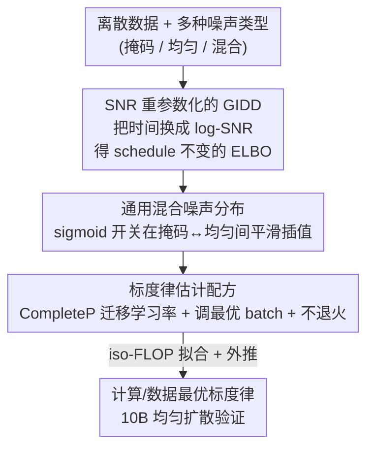

# Scaling Behavior of Discrete Diffusion Language Models

**会议**: ICLR 2026  
**OpenReview**: [https://openreview.net/forum?id=GDYaNzxt9T](https://openreview.net/forum?id=GDYaNzxt9T)  
**代码**: [https://github.com/dvruette/gidd-easydel](https://github.com/dvruette/gidd-easydel)  
**领域**: 预训练 / 扩散语言模型 / 标度律  
**关键词**: 离散扩散, 标度律, 均匀扩散, 掩码扩散, 计算最优

## 一句话总结
这篇论文系统研究了离散扩散语言模型（DLM）在不同噪声类型下的标度律：通过一套用信噪比（SNR）参数化、可在掩码扩散与均匀扩散之间平滑插值的统一扩散框架，并仔细调好 batch size 与学习率，作者发现 DLM 的标度行为强依赖噪声类型——均匀扩散在数据受限场景下更"省数据、吃参数"，最终把均匀扩散模型扩到 10B 参数 / $10^{22}$ FLOPs，验证其标度律可与自回归模型（ALM）竞争。

## 研究背景与动机
**领域现状**：现代 LLM 预训练几乎都用自回归语言模型（ALM），按 Chinchilla 那套标度律去配模型大小和数据量。离散扩散语言模型（DLM）作为替代范式近年兴起，它把生成过程拆成一串去噪步骤——整段 $N$ 个 token 从纯噪声逐步精炼到纯信号，去噪步数 $T$ 可独立于 $N$ 选取，因此天然支持并行生成多 token、并且每一步都能修改任意 token，正好补上 ALM "只能从左到右、不能回头改"的两大短板。

**现有痛点**：DLM 内部，掩码扩散（MDM）因为小规模下表现好而成了主流，但它有两个隐忧——一是已有工作（Nie et al.）报告 MDM 在计算最优设定下要比 ALM 多花 $16\times$ 算力才能追平 loss；二是 MDM 里每个 token 只经历一次状态转移（masked↔unmasked），所以和 ALM 一样无法在两个"已揭示"状态之间反复修订。与此同时，均匀扩散、混合噪声扩散这些"非掩码"变体的标度行为几乎没人认真研究过，只有小规模消融，可能被过早放弃了。

**核心矛盾**：从 ALM → 掩码 → 均匀扩散，本质上是对生成过程逐级施加更少的结构约束、提供更少的归纳偏置。约束越少，任务越难（均匀扩散不仅要补出噪声 token，还要先判断哪些 token 是噪声、哪些是干净的），因此小规模下 loss 更高；但反过来说，约束少也意味着更"可塑"，理论上需要更大容量、却也更能随算力增长而提升。问题是：这个直觉在真实标度律上到底成不成立？而且此前研究 MDM 标度律时还做了几个值得商榷的假设——把学习率和 batch size 固定成常数、并假设无穷算力下 loss 能逼近 0。

**本文目标**：在统一框架下重新、干净地估计掩码、均匀、混合三类噪声的标度律，既比计算受限（compute-bound）也比 token 受限（token-bound）的设定，并把预测外推到 3B / 10B 真实大模型上验证。

**切入角度**：作者注意到连续扩散早就知道"扩散过程对噪声 schedule 不变、时间只是 SNR 的代理"，于是把离散扩散也用 log-SNR 重新参数化，既统一理论又方便构造一族能在掩码↔均匀之间平滑滑动的混合噪声；同时彻底放开对 batch size、学习率、不可约 loss 的假设，从零重估标度律。

**核心 idea**：用 SNR 参数化的统一离散扩散族 + 精细超参标度方法，量化"噪声类型如何改变标度律"，证明均匀扩散在大算力/缺数据时代是更有前途的候选。

## 方法详解

### 整体框架
这篇论文的"方法"不是提出一个新模型去刷点，而是搭一套能公平比较不同噪声类型标度行为的实验装置，再据此拟合并外推标度律。整体可以看成三段串行：先把广义插值离散扩散（GIDD）用 log-SNR 重新参数化，得到一个更简洁、对噪声 schedule 不变的似然下界；在这个统一似然下定义一族"通用混合噪声分布"，用一个 sigmoid 开关在纯掩码与纯均匀之间平滑过渡，从而用同一套代码训练 5 种噪声类型；最后用一套去掉了旧假设的标度律估计配方（CompleteP 做学习率迁移、把 batch size 当成随 token 量变化的关键超参、并刻意不做学习率退火）去扫一大片模型/数据/batch 组合，按 iso-FLOP 方式拟合出计算最优前沿，再外推到 3B/10B 验证。

### 关键设计

**1. SNR 重参数化的 GIDD：把"时间"换成信噪比，统一离散与连续扩散理论**

离散扩散原本用时间 $t$ 描述加噪过程，但作者指出时间本身是虚的，真正起作用的是信噪比。论文采用广义插值离散扩散（GIDD）作为底座——它把加噪过程写成数据 one-hot $x$ 与某个随时间变化的混合分布 $\pi_t$ 之间的插值：$q_t(x)=\alpha_t x+\beta_t\pi_t$，其中 $\beta_t=1-\alpha_t$，掩码扩散、均匀扩散都是它在特定 $\pi_t$ 下的特例。关键一步是定义 log-SNR $\lambda=\log\frac{\alpha}{1-\alpha}$，于是信号强度 $\alpha=\sigma(\lambda)$，前向过程被改写成极简形式 $q_\lambda(x)=\sigma(\lambda)x+\sigma(-\lambda)\pi_\lambda$。在此基础上作者证明（Proposition 1）GIDD 的 ELBO 可以重写成对 log-SNR 做重要性采样的形式：

$$-\log p(x)\le \mathbb{E}_{\lambda,z}\Big[\tfrac{w_\lambda(x)z}{p(\lambda)}\{D_{\mathrm{KL}}(q_\lambda(x)\|q_\lambda(x_\theta))+D_{\mathrm{IS}}(q_\lambda(x)z\|q_\lambda(x_\theta)z)\}\Big]+C$$

这么做有三重好处：一是和连续扩散一样得到了"对噪声 schedule 不变"的结论，说明可以自由选 schedule（实验中取 $p(\lambda)=\sigma'(\lambda)$ 对应线性 schedule）；二是似然界更简洁，实现上只需算混合分布的导数 $\pi'_\lambda$；三是把离散扩散和连续扩散的理论缝上，为后面构造可微的混合噪声铺平道路。

**2. 通用混合噪声分布：一个 sigmoid 开关在掩码与均匀之间连续滑动**

要公平比较"从掩码到均匀"整条谱上的噪声类型，就需要一个能平滑插值的混合分布，而不是离散地各训一套。作者定义

$$\pi_\lambda=\sigma(a\lambda+b)\,u+(1-\sigma(a\lambda+b))\,m$$

其中 $u=\frac{1}{N-1}(1-e_m)$ 是均匀（随机替换）概率向量、$m=e_m$ 是掩码概率向量，$a,b$ 控制从掩码切换到均匀的位置与速度。它的妙处在于：固定 $a>0$ 时，$b\to-\infty$ 退化为纯掩码、$b\to+\infty$ 退化为纯均匀，中间是各种掩码/均匀混合比例；而且由 SNR 决定切换点意味着"在去噪的哪个阶段更多掩码、哪个阶段更多随机扰动"是按信噪比自然分配的。实验里固定 $a=1$，取 $b\in\{-1000,-2,0,2,1000\}$，对应纯掩码、低均匀、平衡、高均匀、纯均匀五档（切换点 $t\in\{0.12,0.5,0.88\}$）。因为第 1 个设计已把 ELBO 写成 SNR 形式，这族分布只需提供 $\pi'_\lambda=a\sigma'(a\lambda+b)(u-m)$ 就能即插即用，实现成本极低。混合扩散同时兼顾了"能修订 token"（不像纯掩码只有一次状态转移）和"似然 gap 比纯均匀小"两个优点。

**3. 干净重估标度律的配方：迁移学习率 + 把 batch size 当一等超参 + 不退火**

旧的 MDM 标度律工作把学习率和 batch size 固定成常数、还假设 loss 能趋于 0，作者认为这会污染结论，于是从零重估。三个支柱：其一，采用 CompleteP（µP 的变体）做参数化，让最优学习率能跨模型宽度和深度迁移，只在 25M/50M 上扫一次就定下基准（$\sigma_{\text{base}}=0.4,\ \eta_{\text{base}}=0.3$），后续各尺度只需按 batch size 微调学习率。其二，作者发现 batch size 不是可固定的常数，而是随训练 token 量近线性增长的关键超参——拟合出 $B^*=10^{2.4}D^{0.8225}$（$R^2=0.975$），且最优学习率又是 batch size 的幂律 $\eta^*=10^{2.06}B^{0.3412}$，两者都几乎与模型大小、噪声类型无关，所以可预测。其三，为了在"模型大小 × token 量 × batch size"三维上扫得起，作者刻意去掉学习率退火，用 warmup-stable schedule，让一次训练就覆盖所有 token horizon；并通过消融证明退火只带来一个恒定 $2.45\%\pm0.138\%$ 的提升、不改变最优超参，这个常数因子可在最终训练时随时补上。拟合时用 Hoffmann 的 iso-FLOP profile（Approach 2，比参数化 loss 拟合更稳），FLOPs-per-token 用更细的 $M=6P+12LDN$ 而非粗糙的 $6P$。

### 损失函数 / 训练策略
训练时不直接最小化加权 ELBO，而是用 $p(\lambda):=1$ 的"无权 ELBO"作为代理 loss（对混合和掩码扩散收敛更好），但拟合标度律时用真实 ELBO 评估。优化器用 LaProp（Adam 变体，对 $\beta_2$/$\epsilon$ 更稳），$\beta_2$ 默认 0.99、batch≥256 时降到 0.98。架构是标准 Transformer 加若干稳定化改动：Squared ReLU、pre-block RMSNorm、QK-norm、attention logit soft-capping、attention sink。数据用未做质量过滤的 Nemotron-CC，BPE 词表 $2^{17}=131072$（大词表利于标度）。扩散过程还设计了条件 prompt 补全（20% 样本保留前缀干净、并 mask 掉 prompt→completion 的注意力以支持 KV-cache）、Diffusion Forcing（50% 样本按 token 独立采噪声级、支持各向异性去噪）、以及随机加 $f\sim U(0,0.2)$ 空 token 以支持变长生成。

## 实验关键数据

### 主实验
作者训练了 25M–570M 共 5 档模型，每档在 $2^{14}$–$2^{20}$ token 的 7 种 batch size 下扫学习率，5 种噪声类型合计约 510 次 run 拟合标度律，再外推到 3B/10B 验证。下表为不同噪声类型拟合出的计算最优指数（$M^*\propto C^{\alpha_M}$ 模型大小、$D^*\propto C^{\alpha_D}$ 数据量、$L^*\propto C^{\alpha_L}$ loss）：

| 模型类型 | $\alpha_M$（吃参数） | $\alpha_D$（吃数据） | $\alpha_L$（loss 标度） |
|----------|------|------|------|
| 掩码 masked | 0.566 | 0.434 | -0.0496 |
| 低均匀 low-uniform | 0.535 | 0.465 | -0.0509 |
| 平衡 balanced | 0.534 | 0.466 | -0.0512 |
| 高均匀 high-uniform | 0.573 | 0.427 | -0.0514 |
| 均匀 uniform | **0.589** | **0.411** | **-0.0522** |
| ALM: Chinchilla | 0.49 | 0.51 | – |
| ALM: DeepSeek (Bi et al.) | 0.5243 | 0.4757 | – |

可以看到：所有扩散类型都比 ALM 更"吃参数、省数据"（$\alpha_M$ 更大、$\alpha_D$ 更小），其中纯均匀扩散最极端（0.589 / 0.411），且 $\alpha_L$ 最负——说明均匀扩散在计算受限下 loss 随算力下降最快、不可约 loss 项更小。

### 消融实验
| 配置 | 关键结果 | 说明 |
|------|---------|------|
| 学习率退火 vs 不退火 | 恒定提升 $2.45\%\pm0.138\%$ | 退火只平移 loss、不改最优超参，可事后补上 |
| 最优 batch size 拟合 | $B^*=10^{2.4}D^{0.8225}$, $R^2=0.975$ | batch 随 token 量近线性，几乎与模型大小/噪声类型无关 |
| 最优学习率拟合 | $\eta^*=10^{2.06}B^{0.3412}$, $R^2=0.909$ | 学习率是 batch size 的幂律 |
| 掩码 vs 均匀 似然 gap | $3.2\%\,(10^{18})\to1.7\%\,(10^{21})$ | gap 随算力增大而收缩，支持"均匀终将追平"预测 |

### 关键发现
- **噪声类型显著改变标度律**：约束越少（掩码→均匀），$\alpha_M$ 越大、$\alpha_D$ 越小，模型越该"吃参数省数据"，这在数据已开始枯竭、算力仍在变多的时代尤为重要。
- **计算受限下各噪声类型几乎收敛**：图 4 左显示 5 种噪声在 compute-bound 下 loss 趋于一致，没有谁明显占优；但 token-bound 下均匀扩散胜出（图 4 右）。
- **标度律外推极准**：拟合只用到 ≤570M 的小模型，却能准确外推到大 $50\times$ 算力的 3B/10B run；10B 均匀扩散的标度趋势甚至和自回归的 DeepSeek 对齐，暗示 DLM 在大规模可与 ALM 竞争。
- **batch size–step 沿等 loss 线呈双曲关系**：$\big((S/S_{\min})^\alpha-1\big)\big((B/B_{\min})^\alpha-1\big)=1$，说明固定模型大小下达到某目标 loss 存在最小步数 $S_{\min}$ 和最小 batch $B_{\min}$，"硬度" $\alpha$ 典型在 0.1–0.2。

## 亮点与洞察
- **用 SNR 统一离散与连续扩散**：把"时间是 SNR 代理"的连续扩散洞见迁移到离散扩散，不仅理论更干净，还顺手得到 schedule 不变性和一个只需算 $\pi'_\lambda$ 的极简实现，是可复用的建模 trick。
- **一个 sigmoid 把整条噪声谱参数化**：$\pi_\lambda=\sigma(a\lambda+b)u+(1-\sigma)m$ 让"掩码↔均匀"成了连续旋钮，公平比较成为可能——这是整篇能做"标度律 vs 噪声类型"对照的前提。
- **把 batch size 提升为标度律一等公民**：以往工作固定 batch，本文证明它随 token 量近线性且可预测，并据此把退火剥离成可事后补的常数因子，大幅省下扫参算力——这套方法论本身对做任何标度律研究都有借鉴价值。
- **最"反直觉"的结论**：小规模更差的均匀扩散，恰恰因为归纳偏置最少、最可塑，在大算力下标度最优、似然 gap 不断收缩——"小时候笨"反而是"长大有潜力"的信号。

## 局限与展望
- 作者承认 bpb 数值是条件与无条件似然的混合，**不能直接和自回归模型比**；不同数据集/tokenizer 下绝对 loss 也难横比，标度系数会随数据组成波动，因此与 Chinchilla 等的数字不可直接比大小。
- 双曲 $B$–$S$ 关系与最小步数/最小 batch 只是所观测 loss 区间内的现象学描述，作者明确不指望它一路准到不可约 loss。
- 最大只验证到 10B / $10^{22}$ FLOPs，"DLM 在更大规模超越 ALM"仍是外推推测；下游 NLP benchmark 只放在附录，生成质量与实际任务表现未在正文充分展开。
- 改进方向：把这套 SNR 框架用于设计自适应噪声 schedule、在更大规模上检验均匀扩散是否真的反超 ALM、以及结合并行/可修订生成把推理加速的优势量化出来。

## 相关工作与启发
- **vs Nie et al. (2025a) 的 MDM 标度律**：他们固定学习率/batch size、假设 loss 可趋 0，得出 MDM 要 $16\times$ 算力才追平 ALM；本文放开这些假设、精调超参后重估，结论更乐观（$\alpha_M=0.634$ vs 本文掩码 0.566），并指出旧假设可能高估了 DLM 的代价。
- **vs Ni et al. (2025)**：同为 MDM 标度律但预测更"吃 token"（$\alpha_M=0.514$），与本文及 Nie et al. 都不一致，作者归因于超参与训练数据差异——说明 DLM 标度律对实验细节高度敏感，更凸显本文"干净重估"的必要。
- **vs Chinchilla / DeepSeek 等 ALM 标度律**：ALM 普遍更"吃 token"（$\alpha_D\approx0.48$–$0.54$），DLM 则更"吃参数"；本文 10B 均匀扩散的趋势贴合 DeepSeek，是 DLM 可与 ALM 竞争的直接证据。
- **vs GIDD (von Rütte et al., 2025)**：本文以 GIDD 为底座但用 SNR 重参数化，得到更简洁灵活的似然界并缝合连续扩散理论，是对 GIDD 的方法论升级。

## 评分
- 新颖性: ⭐⭐⭐⭐ 首次系统刻画不同噪声类型 DLM 的标度律，SNR 重参数化 + 可插值混合噪声是扎实的方法贡献。
- 实验充分度: ⭐⭐⭐⭐⭐ 510 次 run 拟合 + 外推到 10B/$10^{22}$ FLOPs 验证，标度律、超参、退火消融齐全。
- 写作质量: ⭐⭐⭐⭐ 推导与方法论清晰，但绝对指标不可横比的 caveat 较多，需读者细读脚注。
- 价值: ⭐⭐⭐⭐⭐ 在数据枯竭、算力充裕的趋势下，论证均匀扩散是下一代 LLM 有力候选，对范式选择有实际指导意义。

<!-- RELATED:START -->

## 相关论文

- [\[ICLR 2026\] Soft-Masked Diffusion Language Models](soft-masked_diffusion_language_models.md)
- [\[ICLR 2026\] Pretraining Scaling Laws for Generative Evaluations of Language Models](pretraining_scaling_laws_for_generative_evaluations_of_language_models.md)
- [\[ICLR 2026\] Time is a Feature: Exploiting Temporal Dynamics in Diffusion Language Models](time_is_a_feature_exploiting_temporal_dynamics_in_diffusion_language_models.md)
- [\[ICLR 2026\] Autoregressive Models Rival Diffusion Models at Any-Order Generation](autoregressive_models_rival_diffusion_models_at_any-order_generation.md)
- [\[ICLR 2026\] The Diffusion Duality, Chapter II: Ψ-Samplers](the_diffusion_duality_chapter_ii_psi-samplers.md)

<!-- RELATED:END -->
