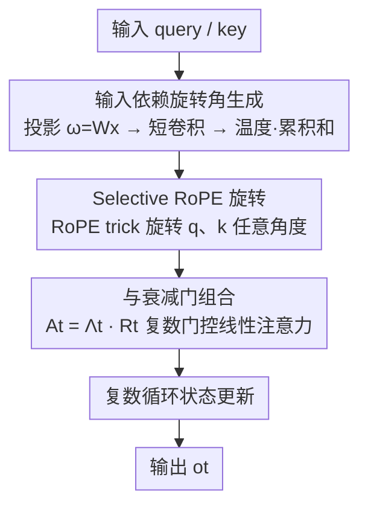

# Selective Rotary Position Embedding

**会议**: ICLR 2026  
**OpenReview**: [https://openreview.net/forum?id=AQo1SEElNb](https://openreview.net/forum?id=AQo1SEElNb)  
**代码**: 有（论文开源，集成进 flash-linear-attention）  
**领域**: LLM预训练 / 序列模型架构  
**关键词**: 旋转位置编码, 线性注意力, 门控线性注意力, 状态空间模型, 复数循环

## 一句话总结
本文从理论上论证「强召回 = 旋转 + 衰减」缺一不可，指出线性注意力恰恰缺了 softmax 隐式做的那部分「旋转」，于是提出 **Selective RoPE**——一个输入依赖、可学习、能旋转任意角度并与衰减门无缝复合的旋转位置编码，用 RoPE trick 高效实现为一层复数门控线性注意力，在合成召回任务和 370M/1.3B 语言建模上以极小代价提升了召回、表达力和困惑度。

## 研究背景与动机

**领域现状**：softmax Transformer 之所以强，是因为每个 token 都能不衰减地 attend 到所有历史 token，召回能力极好，但代价是序列长度上的二次复杂度。为降复杂度，一条平行路线发展出亚二次的循环序列模型（线性注意力、Mamba/SSM、GLA、DeltaNet），它们线性时间、常数显存，但有一个固定大小的状态瓶颈：信息必须被选择性地保留或覆盖，长程检索因此常常受损。近期进展几乎都集中在「怎么把状态管理做好」。

**现有痛点**：实践中，这些模型的状态管理主要靠**选择性门控、更表达的状态更新、更复杂的读出**——但这些机制的共同点是它们都在**调制 key-value 关联的范数（即衰减得多快）**，并不直接提供互补的能力：**旋转 query-key 表示来编码相对位置**。换句话说，门控只会「让某些记忆淡出」，却不会「转动相位」。

**核心矛盾**：作者的核心论断是——强召回需要**两个互补的机制**：(i) **旋转**，在保范数的前提下编码相对位置；(ii) **衰减**，选择性地丢弃过去的 key-value 关联。softmax 注意力之所以强，是因为它**隐式地同时做了这两件事**；而线性注意力只继承了「衰减」，丢掉了「旋转」。光有旋转也不行：纯复数（只旋转）的线性循环模型像一个固定状态大小的频谱分析仪，会发生**谱泄漏（spectral leakage）**，需要加一个指数衰减分量（相当于加窗）来压制。

**本文目标**：把缺失的「旋转」这块拼图补回线性注意力，且要做到 (a) 输入依赖、可学习、能转任意角度，(b) 能和已有的衰减门无缝复合，(c) 实现上不引入额外大开销。

**切入角度**：作者借助 softmax 与**随机傅里叶特征（RFF）**的关系，揭示 softmax 注意力其实可以被解释为对 query-key 对做**输入依赖的选择性旋转**，从而为「在循环模型里用 RoPE 式旋转矩阵」提供了理论动机。

**核心 idea**：把 RoPE 的固定角度推广成**输入依赖、可学习的旋转**，作为线性注意力状态转移矩阵的一部分，并用 RoPE trick 把这个复数参数化高效地实现在实数域里。

## 方法详解

### 整体框架

本文方法是一层即插即用的旋转位置编码，套在门控线性注意力（GLA）这类循环架构上。直观地说：标准 GLA 的状态转移只有一个衰减门 $A_t$（让历史按范数淡出），本文把它换/补成一个**输入依赖的旋转矩阵** $R_t$，让状态在「淡出」之外还能「转相位」。完整转移因此被因子化为 $A_t = \Lambda_t \bar{R}_t$——衰减门 $\Lambda_t$ 负责忘记、旋转 $\bar{R}_t$ 负责编码相对位置。

具体的前向流程是：从输入算出每个通道的**旋转角** $\omega$（投影 + 短卷积 + 温度缩放后做累积和），由角度生成 $\sin/\cos$，再用 **RoPE trick** 把旋转作用到 query 和 key 上；旋转后的 q、k 进入 GLA 的复数循环状态，与内建的衰减门一起更新状态、产生输出。因为整套旋转可以表达成「对 q/k 应用 RoPE」，所以能直接复用现有的线性注意力 / RoPE kernel，几乎零额外架构开销。

### 关键设计

**1. 统一视角：召回 = 旋转 + 衰减，缺一不可**

这是全文的理论基石，也是最让人「啊哈」的洞察。作者用 RFF 近似指数核：定义 $\phi_\omega(x)=\exp(\|x\|_2^2/2 + i\omega^\top x)$、$\omega\sim\mathcal N(0,I)$，则 $\Re\{\mathbb E_\omega[\phi_\omega(q_t)^\top\phi_\omega(k_\tau)]\}=\exp(q_t^\top k_\tau)$，恰好是 softmax 注意力分数。把这个期望写成递推，会得到一个**对角、输入依赖的旋转矩阵** $\bar R_t=\mathrm{diag}(\exp(i\Omega(q_t-q_{t-1})))$——也就是说，softmax 注意力本身就在用随机高斯特征 $\Omega$、以 $q_t-q_{t-1}$ 为条件，对 query-key 做选择性旋转。这正是线性注意力里缺失的那块。

但作者紧接着论证**光旋转还不够**：把 GLA 的对角门换成纯旋转 $\bar R_t$（公式 $S_t=S_{t-1}\bar R_t + v_t k_t^H$），展开后输出是一个**纯虚指数 $e^{-i\omega\tau}$ 对输入信号的卷积**，等价于对有限长信号做 DFT。有限采样在两端的不连续会引起**谱泄漏**；信号处理里的标准解法是加一个向两端渐弱的**非矩形窗（如 Hann 窗）**。而「向两端指数渐弱的窗」在序列模型里的对应物，恰恰就是**衰减门**。于是「旋转编码相对位置 + 衰减压制谱泄漏」这两件事被统一到同一个设计原则下：$A_t=\Lambda_t\bar R_t$，实部负责遗忘、虚部负责编码位置。

**2. Selective RoPE：把 RoPE 的固定角度变成输入依赖、可学习的旋转**

针对「线性注意力缺旋转」这个痛点，本文把标准 RoPE 推广。标准 RoPE 用固定频率 $\omega$ 的旋转矩阵给相对位置编码：

$$\text{Att}_{t,\tau}=\exp\big(k_\tau^\top R_\omega^{\,t-\tau} q_t\big)=\exp\big((R_\omega^{\tau}k_\tau)^\top(R_\omega^{t}q_t)\big),\quad R_\omega=\begin{pmatrix}\cos\omega & -\sin\omega\\ \sin\omega & \cos\omega\end{pmatrix}$$

它的角度只依赖于绝对位置索引 $t$、与内容无关。Selective RoPE 的核心是把这个旋转改成**输入依赖**的状态转移矩阵 $R_t$，写成线性注意力的递推：

$$S_t=S_{t-1}R_t+v_t k_t^\top,\qquad o_t=S_t q_t.$$

定义累积旋转 $R_{i:j}=\prod_{\kappa=i}^{j} R_\kappa$，借助 RoPE trick 的块对角结构 $R^{t-\tau}=(R^\tau)^\top R^t$，输出可等价写成「对 q、k 各自施加累积旋转」：

$$\text{Selective RoPE:}\quad o_t=\sum_{\tau=1}^{t} v_\tau\big(k_\tau^\top R_{\tau+1:t}\, q_t\big)=\sum_{\tau=1}^{t} v_\tau\big(k_\tau^\top R_{1:\tau}^\top R_{1:t}\, q_t\big).$$

实现上，旋转角由输入算出：$\omega=W_\omega x$，过一个 1D 短卷积，再乘温度后做累积和得到逐位置的相位，由相位生成 $\sin/\cos$ 再调用 RoPE。关键在于：这等于把一个**复数参数化的线性 Transformer** 用 RoPE trick 留在实数域算，从而**复用现有 kernel**、几乎零额外开销，却把 RoPE 从「只能转固定角度」升级成「能转任意、可学习、随内容变化的角度」。注意这里的 $R_t$ 是对状态转移的选择性调制，并不是把 query 写进记忆。

**3. 最优温度谱：旋转频率不是拍脑袋设的，而是理论推出来的**

RFF 与 softmax 的等价只在样本数 $D\to\infty$ 时严格成立；样本有限时，单个 query-key 对存在一个**最优方差**，正比于两向量之间的夹角。作者据此把旋转矩阵写成 $\hat R_t=\exp(i\Omega\Theta(q_t-q_{t-1}))$，其中 $\Theta$ 是一个**温度对角矩阵**。假设 query-key 夹角 $\theta$ 在 $[0,2\pi]$ 上均匀分布，推出最优温度服从 $\tan^2(\theta/2)$。有趣的是，这个分布和 RoPE 里**指数衰减的频率谱**非常接近，只是衰减略快一点。这个结果的意义在于：它从第一性原理解释了「为什么 RoPE 那套指数衰减频率是合理的」，并给 Selective RoPE 的频率初始化提供了理论依据，而不是靠经验调。

**4. 与衰减门组合及工程稳定化：让它真的能稳定训练**

光有上面的理论形式，直接训会出问题。作者发现 Selective RoPE 在较高学习率下比 RoPE/NoPE 更早出现训练不稳定。一系列工程选择把它救回来：(i) 用 $\ell_2$ 归一化的输入 $x_t$（而非 query $q_t$）来参数化旋转角，显著稳住训练；(ii) 在 $\omega$ 投影上加 **weight norm**，或改用 rank 8/16 的低秩 MLP；(iii) 让随机特征 $\omega$ 本身**可学习**（而非固定随机），按已有工作这比固定随机特征更有效；(iv) 在旋转角上加一个 **sigmoid 相位门（phase gate）**，让模型自己决定「转还是不转」；(v) 在 $\omega$ 投影后的卷积之后加 **SiLU 激活**——消融显示这一项带来的性能提升最大。衰减部分则直接复用 baseline 架构内建的遗忘门，不另起炉灶。这些细节单看都不起眼，但正是它们让「旋转+衰减」这个漂亮的理论真正能在 370M/1.3B 规模上稳定收敛。

### 损失函数 / 训练策略

语言建模用 AdamW + warmup + cosine 衰减，FineWeb 语料、上下文长度 4096、Mistral 7B tokenizer（词表 32000）。370M 模型训 10B tokens、1.3B 模型训 26B tokens。由于不同位置编码的最优学习率不同，作者对每种位置编码方案都扫学习率，用 4M held-out tokens 的困惑度选最优配置，再在 lm-eval-harness 上做零样本评测。

## 实验关键数据

### 主实验（语言建模，lm-eval-harness 零样本平均准确率）

| 架构 / 规模 | 位置编码 | LAMBADA ppl ↓ | Avg-Acc ↑ |
|------|------|------|------|
| GLA 370M / 10B | NoPE | 15.83 | 46.8 |
| GLA 370M / 10B | RoPE | 16.32 | 46.5 |
| GLA 370M / 10B | **Selective RoPE** | 16.33 | **47.1** |
| FoX 370M / 10B | NoPE | 17.76 | 45.3 |
| FoX 370M / 10B | RoPE | 17.71 | 45.1 |
| FoX 370M / 10B | **Selective RoPE** | **17.29** | **46.1** |
| Gated DeltaNet ~400M / 10B | RoPE | 16.79 | 46.7 |
| Gated DeltaNet ~400M / 10B | **Selective RoPE†** | **15.93** | **47.5** |
| GLA 1.3B / 26B | RoPE | 8.88 | 54.4 |
| GLA 1.3B / 26B | **Selective RoPE** | **8.50** | 54.6 |

作者诚实地指出：Selective RoPE 改变的是「困惑度 ↔ 下游准确率」之间的 trade-off，且这种改变**因模型/规模而异**——它常常改善困惑度和/或某些下游任务，但宏平均准确率可能持平甚至略降，并非全面碾压。

### 消融实验（GLA 370M，MAD benchmark 平均分；及语言建模消融）

| 配置 | MAD Average ↑ | 说明 |
|------|------|------|
| NoPE | 65.9 | 无位置编码 baseline |
| RoPE | 72.5 | 固定角度 RoPE |
| Selective RoPE | 72.0 | 本文基础版 |
| + phase gate | 72.3 | 加相位门 |
| + bias | 72.7 | 加可学习偏置 |
| + phase gate & bias | **73.2** | 全部组件，最好 |

| 语言建模配置（GLA 370M/10B） | Avg-PPL ↓ | Avg-Acc ↑ |
|------|------|------|
| Selective RoPE Baseline | 21.27 | 45.8 |
| + SiLU | 21.14 | 46.7 |
| + phase gate | 21.16 | **47.1** |

### 关键发现
- **SiLU 激活贡献最大**：语言建模消融里，在 $\omega$ 投影后的卷积后加 SiLU，是单项里性能提升最显著的；相位门次之。MAD 上则是 phase gate + bias 组合最强。
- **合成召回任务全面占优**：MQAR 上 GLA+Selective RoPE 相对 NoPE 提升最大；copying 任务上 Selective RoPE 不仅准确率高，还能**鲁棒地长度外推**（而 RoPE 因为不微调时外推差，在 copying 上反而很差）。
- **表达力质变（state tracking）**：在 S2 奇偶校验任务上，GLA+Selective RoPE 能学会并外推，而 NoPE/RoPE 连训练长度都学不会——因为输入依赖旋转能根据输入是 0 还是 1 建模「翻转」。Transformer+Selective RoPE 据作者所知是**唯一**能用单层解到该序列长度奇偶校验的 Transformer 变体；2 层 DeltaNet+Selective RoPE 还能解 A3。

## 亮点与洞察
- **理论桥梁很漂亮**：用 RFF 把「softmax 隐式在做输入依赖旋转」这件事讲清楚，再用「谱泄漏 ↔ 加窗 ↔ 衰减门」的信号处理类比说明为什么还需要衰减——把两个看似无关的工程技巧（RoPE、forget gate）统一进一个原则 $A_t=\Lambda_t\bar R_t$。
- **RoPE trick 复用是工程上的关键巧思**：把复数参数化的线性 Transformer 留在实数域算，等于「在 RoPE 前面加一段从输入算 $\sin/\cos$ 的前奏」，几乎零额外 kernel 成本，这让方法真正可落地。
- **统一视角能迁移**：这个原则解释了 Forgetting Transformer（softmax 已隐式有旋转、只需补遗忘门）和加了遗忘门的 DeltaNet（Householder 已提供旋转、补衰减更好）为什么有效——可以拿这把尺子去审视别的序列模型缺哪块。

## 局限与展望
- **trade-off 而非全面提升**：作者承认下游宏平均准确率可能持平甚至略降，收益高度依赖架构和规模，不是无脑加上去就更好。
- **训练稳定性是软肋**：原始形式在高学习率下比 RoPE/NoPE 更早发散，需要一整套 trick（$\ell_2$ 归一输入、weight norm、低秩 MLP）才稳，说明方法对实现细节敏感。
- **规模有限**：最大只到 1.3B / 26B tokens，是否在更大规模、更长上下文继续受益仍待验证；理论里「夹角均匀分布」等假设在真实数据上未必成立。
- **改进方向**：把温度谱 $\tan^2(\theta/2)$ 的理论进一步用于更聪明的频率初始化/调度，或探索旋转与更表达的（DPLR）状态转移的组合。

## 相关工作与启发
- **vs RoPE**：RoPE 的旋转角只依赖绝对位置索引、固定且不可学；Selective RoPE 把角度变成输入依赖、可学习、能转任意角度，并能和衰减门复合。代价是稳定性更难、需要额外 trick。
- **vs GLA / Mamba2（纯门控）**：它们只通过范数缩放（衰减）来编码历史，方向不变、缺旋转；本文补上旋转这一维，在 state tracking 这类需要「翻转」表达力的任务上带来质变。
- **vs DeltaNet**：DeltaNet 通过输入依赖的广义 Householder 变换已隐含「沿 key 维度的旋转」，本文的原则解释了「在其上再加遗忘门为何更好」，并把这种洞察推广成通用设计原则。
- **vs Performer / 学习随机特征**：本文同样用 RFF 与可学习随机特征思路，但落点不是更好的 softmax 核近似，而是把其中的「旋转」结构显式提取出来当位置编码用。

## 评分
- 新颖性: ⭐⭐⭐⭐⭐ 用 RFF 揭示 softmax 隐式旋转、再统一旋转与衰减，视角新且有解释力
- 实验充分度: ⭐⭐⭐⭐ 合成任务 + 多架构（GLA/FoX/DeltaNet）+ 370M/1.3B 语言建模，消融扎实，但规模和上下文长度仍有限
- 写作质量: ⭐⭐⭐⭐ 理论推导清晰、图示直观，工程稳定化部分如实交代
- 价值: ⭐⭐⭐⭐ 给亚二次序列模型补上「旋转」拼图，且即插即用、零额外 kernel 成本，实践与理论双重价值

<!-- RELATED:START -->

## 相关论文

- [\[ICLR 2026\] MrRoPE: Mixed-radix Rotary Position Embedding](mrrope_mixed-radix_rotary_position_embedding.md)
- [\[ICLR 2026\] LLM-JEPA: Large Language Models Meet Joint Embedding Predictive Architectures](llm-jepa_large_language_models_meet_joint_embedding_predictive_architectures.md)
- [\[ICLR 2026\] Beyond URLs: Metadata Diversity and Position for Efficient LLM Pretraining](beyond_urls_metadata_diversity_and_position_for_efficient_llm_pretraining.md)
- [\[ICLR 2026\] Pre-training Limited Memory Language Models with Internal and External Knowledge](pre-training_limited_memory_language_models_with_internal_and_external_knowledge.md)
- [\[ICLR 2026\] Pretraining with Hierarchical Memories: Separating Long-Tail and Common Knowledge](pretraining_with_hierarchical_memories_separating_long-tail_and_common_knowledge.md)

<!-- RELATED:END -->
