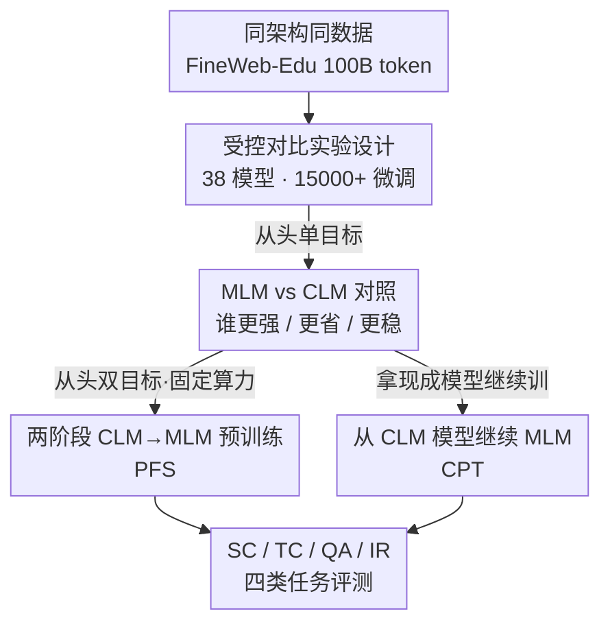

# Should We Still Pretrain Encoders with Masked Language Modeling?

**会议**: ICLR 2026  
**OpenReview**: [https://openreview.net/forum?id=jpz7e3jhRq](https://openreview.net/forum?id=jpz7e3jhRq)  
**代码**: https://hf.co/MLMvsCLM ｜ https://github.com/Nicolas-BZRD/EuroBERT/tree/MLM_vs_CLM  
**领域**: LLM预训练 / 文本表示  
**关键词**: 编码器预训练, 掩码语言建模 (MLM), 因果语言建模 (CLM), 受控消融, 两阶段预训练

## 一句话总结
作者用 38 个 210M~1B 的模型、超 1.5 万次微调跑了一场严格受控的对照实验，回答"还该不该用 MLM 预训练编码器"——结论是 MLM 在文本表示任务上整体仍更强，但 CLM 更省数据、微调更稳，因此**先 CLM 再 MLM 的两阶段策略**（尤其是直接拿现成 CLM 解码器继续 MLM）在固定算力下能拿到最优编码器。

## 研究背景与动机

**领域现状**：高质量文本表示是序列分类、命名实体识别、抽取式问答、信息检索等一大批 NLP 任务的基础。传统做法是用**掩码语言建模 (MLM)**、配双向注意力从头预训练编码器（BERT 一脉）。近年来出现一个反直觉的趋势：用**因果语言建模 (CLM)** 预训练的解码器模型，再用 MLM 适配一下，反而能在 MTEB 等嵌入榜单上超过传统编码器，似乎在挑战"MLM-only"的统治地位。

**现有痛点**：这些"CLM 解码器当编码器更强"的证据，几乎都来自**远大于普通编码器、且训练数据多得多**的模型。换句话说，CLM 路线的胜利和"模型更大、数据更多"这两个因素**深度纠缠**，没人把它们拆开过。

**核心矛盾**：到底是 CLM 这个训练目标本身带来了更好的表示，还是仅仅因为 scale 上去了？这是一个被混淆变量污染的因果问题——只看榜单结论根本无法归因。

**本文目标**：在**架构相同、参数量相同、训练数据完全相同**的前提下，公平对比 MLM、CLM、以及二者的组合，从而把"训练目标"这一个变量单独拎出来评估，并进一步回答"实践中怎么花算力最划算"。

**切入角度**：与其再训一个更大的 SOTA 去刷榜，不如做一场**大规模受控消融**——固定一切其它变量，只动训练目标和训练阶段安排，用足够多的种子和足够长的训练保证统计可靠。

**核心 idea**：通过严格控制混淆因素的对照实验证明，MLM 仍是稳健表示的必需品，但 CLM 的数据效率与微调稳定性可以被"CLM→MLM 两阶段"吃下来，于是最佳工程路径是"拿现成 CLM 模型 + 少量 MLM 继续训练"。

## 方法详解

### 整体框架

这篇本质是一篇**实证研究**，"方法"就是它的实验设计：在一个统一受控的预训练平台上，沿三条路线提出并验证训练策略。所有模型都基于 EuroBERT 架构（210M / 610M / 1B，上下文 2048，RoPE θ=10000），都在 FineWeb-Edu 的同一份英文 token 序列上训练，默认预训练 100B token（约为 Chinchilla 最优预算的 5 倍），评测覆盖序列分类 (SC)、token 分类 (TC)、问答 (QA)、信息检索 (IR) 四类共 12 个数据集，每个配置跑 6 个学习率 × 5 个随机种子，报告 95% 置信区间。

三种预训练目标先界定清楚：CLM 用因果掩码做下一个 token 预测，最小化 $L_{\text{CLM}}(x) = -\sum_{t=1}^{T}\log p_{\theta\rightarrow}(x_t\mid x_1,\dots,x_{t-1})$；MLM 用双向掩码重建被掩 token，$L_{\text{MLM}}(x) = -\sum_{i\in M}\log p_{\theta\leftrightarrow}(x_i\mid x_M)$，掩码率 $p_{\text{mask}}\in\{20\%,30\%,40\%,50\%\}$；CLM+MLM 则先 CLM 后 MLM 串行。整条研究流水线如下图：

### 关键设计

**1. 受控对比实验设计：把"训练目标"从 scale 里拆出来**

针对"CLM 解码器更强是否只是因为更大更多数据"这个混淆问题，作者的核心动作是**把所有其它变量焊死**：同一套 EuroBERT 架构、同一份 FineWeb-Edu 数据、同一段样本序列、同一套 WSD 学习率调度（2000 步 warmup + 38000 步恒定 $5\times10^{-4}$ + 2000 步衰减，共 42000 步），唯一变化的是训练目标。为了让结论统计可靠，规模被刻意拉满：3 个模型尺寸、4 个 MLM 掩码率、PFS/CPT 两种场景，共训 38 个最终模型，外加每个 checkpoint 在 12 个数据集 × 6 个学习率 × 5 个种子上微调，累计 15120 次微调跑、约 11 万 MI250X GPU 小时。正因为把 scale 这个变量按住了，后面所有"MLM vs CLM"的差异才能被干净地归因到训练目标本身，而不是模型规模——这是整篇论文可信度的地基。

在这套设计下得到的第一组关键结论是：**MLM 在文本表示任务上整体仍更强**，尤其在 SC 和 QA 上差距明显（QA 对缺少双向注意力最敏感），跨尺寸稳定；但 **CLM 并非全面落后**——它在 TC 上持平甚至在 610M 量级大幅反超，在 IR 上差距随模型变大而收窄，且在训练早期数据效率更高（SC/QA 在约 10000 步前、IR 在约 20000 步前 CLM 都领先，TC 甚至全程领先），同时**对微调学习率的敏感度更低**（图 5 显示 CLM 初始化微调更稳）。此外掩码率**没有普适最优值**：大模型偏好更高掩码率、IR 一致偏好高掩码率、TC/QA 在 610M/1B 上呈 U 形曲线，后续实验统一取 610M + 40% 作为折中。⚠️ 上述差异多以图（Fig 2–5）形式给出、正文未列精确数值，以原文为准。

**2. 两阶段 CLM→MLM 从头预训练 (PFS)：用一份算力同时吃下两种目标的长处**

既然 CLM 给的是早期数据效率、token 级表示和训练稳定性，MLM 给的是任务全面性，作者顺势提出：在**从头预训练 (PFS)** 且固定算力的前提下，先用 CLM 训一段、再切换成 MLM 训剩下的。具体在 610M、40% 掩码率上，按 100%CLM / 75%-25% / 50%-50% / 25%-75% / 100%MLM 五种切分，分别在 12K / 22K / 42K 三个算力预算下评测。这里的工程巧思是 PFS 的目标切换发生在 CLM checkpoint **尚未做学习率衰减、梯度范数仍大、还在活跃学习**的时刻，因此 MLM 阶段能在一个"还没收敛定型"的初始化上继续高效学习。

结果是 **CLM+MLM 一致优于纯 MLM**：25%-75% 切分稳定超过 MLM 基线，即便分给 CLM 高达 75% 也能与纯 MLM 持平。也就是说，"先 CLM 后 MLM"在不增加任何算力的情况下白赚了一截性能，确认了两种范式的协同。附带好处是经 CLM 预热的模型**对掩码率选择更不敏感**（图 7），初始 CLM 预训练起到了稳定作用，让 MLM 阶段对超参更鲁棒。

**3. 从 CLM 模型继续 MLM 预训练 (CPT)：把现成解码器变成最优编码器的最省路径**

PFS 是从随机初始化重训，但现实里到处都是训好的 CLM 解码器。于是作者问第三个问题：给定一笔额外算力，是把它花在"对 CLM 模型做 MLM 继续训练 (CPT)"上、还是"继续训练一个 MLM 模型"上更划算？与 PFS 不同，**CPT 的起点是已经做过学习率衰减、loss 已收敛**的现成模型，更贴近真实续训场景。实验在 610M、40% 掩码率上，对 CLM 基座和 MLM 基座分别施加 2K / 12K / 22K 步的 MLM 继续训练。

结论很干脆：**对 CLM 模型做 MLM CPT，整体优于继续训练 MLM 模型**——TC 上保持 CLM 本来的领先、QA 和 IR 上把差距彻底抹平、SC 上显著反超纯 MLM。而且**不需要训满 22K 步**，早到 12K 步效果就已经追平甚至在 TC/IR 上更好，收尾阶段的提升曲线还更陡（纯 MLM 续训在 SC 上明显见顶）。这条结论直接给出工程建议：**当前获得强编码器的最佳路径，是利用广泛可得的预训练解码器、再用少量 MLM 继续训练**，而不是从零跑 MLM。

## 实验关键数据

> 论文结论主要以折线/误差棒图呈现（Fig 2–9），下表按图中趋势定性整理，精确数值以原文为准 ⚠️。

### 主实验（MLM vs CLM，从头单目标）

| 任务 | 指标 | MLM | CLM | 趋势说明 |
|------|------|-----|-----|---------|
| 序列分类 SC | Accuracy | 更强 | 落后 | 差距随模型变大而扩大 |
| token 分类 TC | F1 | 强 | 持平/反超 | 610M 量级 CLM 大幅反超 |
| 问答 QA | F1 | 明显更强 | 落后 | QA 对缺双向注意力最敏感 |
| 信息检索 IR | NDCG@10 | 略强 | 接近 | 差距随模型变大而收窄 |

### 两阶段与续训实验

| 配置 | 场景 | 关键结论 |
|------|------|---------|
| 100% MLM | PFS 基线 | 全面但非最省 |
| 25%-75% (CLM→MLM) | PFS | 稳定超过纯 MLM 基线 |
| 75%-25% (CLM→MLM) | PFS | 仍与纯 MLM 持平 |
| MLM CPT on MLM 基座 | CPT | 提升有限、SC 见顶 |
| MLM CPT on CLM 基座 | CPT | 整体反超，SC 显著超出，12K 步即足够 |

### 关键发现
- **双向注意力仍是稳健表示的必需品**：MLM 整体最稳，QA 对缺双向最敏感；但 CLM 在 token 级任务 (TC) 上能力被低估，说明因果预训练也能学到强 token 表示。
- **CLM 的价值在"效率"而非"上限"**：早期数据效率更高、微调对学习率更不敏感，因此非常适合低资源/数据稀缺场景，或作为 MLM 前的预热阶段。
- **没有普适掩码率**：依赖模型尺寸与任务——大模型偏好高掩码率，IR 一致偏好高掩码率，TC/QA 在 610M/1B 上呈 U 形；610M+40% 是跨任务的强折中。
- **固定算力下两阶段 > 纯 MLM**，且经 CLM 预热后对掩码率更鲁棒；CPT 场景下"CLM 基座 + MLM"是性价比最高的造编码器方式。

## 亮点与洞察
- **把一个被混淆的因果问题做成了可信结论**：38 模型 + 15000+ 微调 + 95% 置信区间，专门把"训练目标"从"模型 scale"里拆出来，这种"花重金做受控对照"的研究范式本身就极有参考价值。
- **PFS 与 CPT 的本质区分很关键**：PFS 在梯度仍大、未衰减的 checkpoint 切目标，CPT 从已收敛模型续训——作者明确指出这两者的初始化状态不同，避免了"两阶段实验"被笼统混为一谈。
- **可迁移的工程结论**：手里有现成 CLM 解码器时，少量 MLM CPT 就能造出 best-in-class 编码器；这个"复用解码器 + 短续训"的思路可直接迁移到多语言、低资源语种、甚至视觉-语言等场景做表示学习预热。

## 局限与展望
- 作者承认范围被刻意收窄：只动了训练目标、模型尺寸、训练场景、数据预算、掩码率，固定了架构、tokenizer、语言、数据混合；规模封顶 1B 参数 / 100B token，而 MTEB 顶部模型常超 1B。
- 自己发现的局限：结论几乎全靠图呈现、正文缺精确数值表，复现需依赖开源 checkpoint；评测只做了预训练模型的微调，**未包含对比式后训练 (contrastive post-training) 的零样本检索**，因此对"最终嵌入模型"的结论留有缺口。
- 改进思路：探索更复杂的训练课程（如多次交替 CLM/MLM）、把研究扩展到多语言与多模态、并深入解释 TC 上 U 形掩码率曲线 vs IR 单调曲线背后的机理。

## 相关工作与启发
- **vs BehnamGhader 等 (LLM2Vec 一脉)**：他们提出把解码器适配成嵌入模型的通用框架并在大模型上刷榜，但没把"CLM 目标本身 vs scale"拆开；本文用同尺寸同数据的受控对照补上了这块归因。
- **vs Wettig 等 (2023)**：他们专注 MLM-only 下掩码率对下游的影响；本文复用其"大模型偏好高掩码率"的发现，并扩展到 CLM/MLM/混合三条路线的统一对比。
- **vs Weller 等 (2025)**：他们在 2T token 大数据上分析 MLM→CLM 课程并在生成式 benchmark 上评测；本文方向相反（CLM→MLM）、聚焦编码器专属任务，并系统扫了掩码率与 CLM-MLM 配比这些被前者略过的设计维度。

## 评分
- 新颖性: ⭐⭐⭐⭐ 不是新模型，但把"MLM 还该不该用"这个被混淆的问题做成了首个大规模受控归因，问题本身有分量
- 实验充分度: ⭐⭐⭐⭐⭐ 38 模型、15000+ 微调、11 万 GPU 小时、95% 置信区间，统计严谨度罕见
- 写作质量: ⭐⭐⭐⭐ 逻辑清晰、三条路线层层递进；但核心结论几乎全靠图、缺数值表，单看笔记/正文不易拿到精确数字
- 价值: ⭐⭐⭐⭐⭐ 直接给出"复用 CLM 解码器 + 短 MLM 续训"的可落地工程路径，对造编码器的人极有指导意义

<!-- RELATED:START -->

## 相关论文

- [\[ICLR 2026\] Soft-Masked Diffusion Language Models](soft-masked_diffusion_language_models.md)
- [\[ICLR 2026\] Learned Meta-Tokens for Language Modeling](learned_meta-tokens_for_language_modeling.md)
- [\[ICLR 2026\] Scaling Laws Revisited: Modeling the Role of Data Quality in Language Model Pretraining](scaling_laws_revisited_modeling_the_role_of_data_quality_in_language_model_pretr.md)
- [\[ICLR 2026\] Seq vs Seq: An Open Suite of Paired Encoders and Decoders](seq_vs_seq_an_open_suite_of_paired_encoders_and_decoders.md)
- [\[ICLR 2026\] Imagine How To Change: Explicit Procedure Modeling for Change Captioning](imagine_how_to_change_explicit_procedure_modeling_for_change_captioning.md)

<!-- RELATED:END -->
