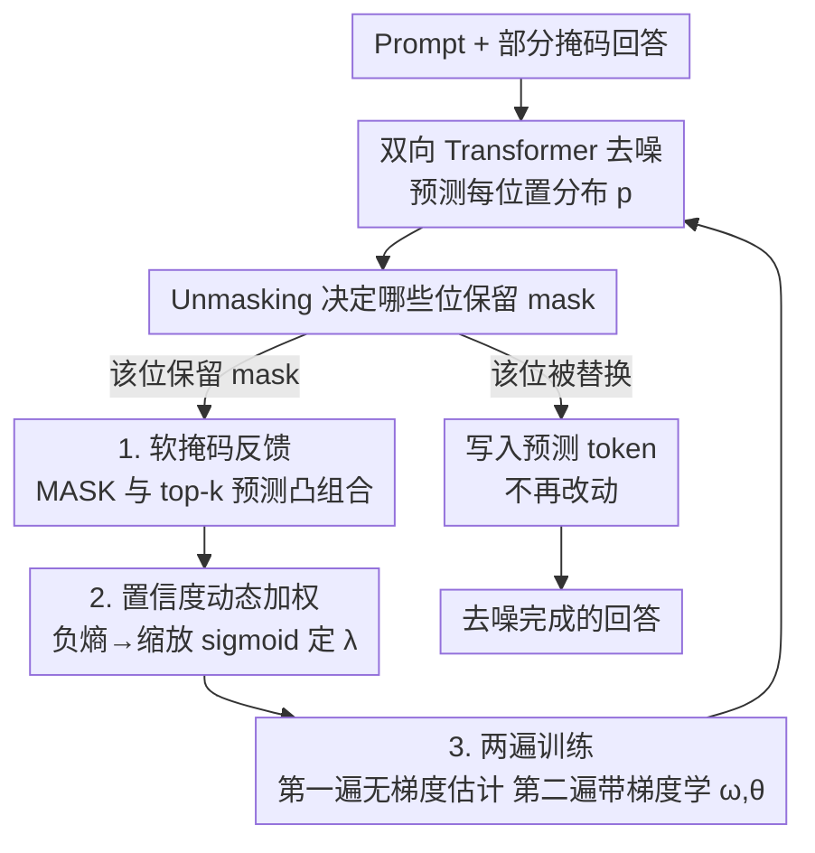

# Soft-Masked Diffusion Language Models

**会议**: ICLR 2026  
**OpenReview**: [https://openreview.net/forum?id=Gba02UMvrG](https://openreview.net/forum?id=Gba02UMvrG)  
**代码**: https://github.com/IBM/soft-masked-diffusion-language-models  
**领域**: 扩散模型 / LLM预训练  
**关键词**: 掩码扩散语言模型, 软掩码, 连续反馈, 自纠错解码, 代码生成

## 一句话总结
针对掩码扩散语言模型（MDLM）解码时"保留 mask 还是替换成预测 token"这种二元决策会丢掉预测信息的问题，本文提出 **soft-masking（SM）**：把保留下来的 `[MASK]` 嵌入与上一步 top-k 预测 token 的嵌入做一个置信度加权的凸组合，让部分信息跨步传播，仅增加 3 个可训练参数，就在小模型从头训练、预训练续训、以及 Dream-7B/Dream-Coder-7B 微调上稳定提升了困惑度、MAUVE 和代码生成准确率，尤其在低算力（少解码步数 / 高吞吐）场景增益显著。

## 研究背景与动机

**领域现状**：自回归（AR）LLM 一个 token 一个 token 地生成，推理是串行的，延迟和成本都高，在长推理链（CoT）场景尤其明显。扩散语言模型（DLM）作为替代方案，可以并行生成和修订整段回答，天然带自纠错、双向建模、训练数据效率更高等优点。其中**掩码扩散语言模型（MDLM）**是目前最可扩展、最有效的一支：前向过程把 token 逐步吸收成 `[MASK]`，反向解码时模型对每个 mask 做一个**二元选择**——要么用预测 token 替换它，要么继续保留 `[MASK]`。

**现有痛点**：这个二元 unmasking 过程在"保留 mask"时，会把模型当前对该位置的预测分布（哪怕已经很有信息量）整个丢掉。下一步重新看到的还是一个纯 `[MASK]`，等于每一步都从零重新猜这个位置，早先算出来的上下文信息没能传下去。

**核心矛盾**：AR 这边已经有一条被验证有效的思路——把**连续反馈**（而不仅是离散采样的单个 token）喂回模型，相当于让多个候选解以"叠加态"形式同时存在、并行探索，从而减少生成 token 数。但 AR 上做连续反馈训练很慢，因为它依赖前一步的连续输出，本质还是串行。MDLM 本来是并行的，却卡在了"二元 mask 丢信息"上，没把连续反馈的好处接过来。

**本文目标**：给 MDLM 设计一个**保留并传播预测信息**的反馈机制，要求：(1) 能无缝接入现有 MDLM 架构、几乎不加参数；(2) 训练仍可沿序列长度并行、不退化成 AR 那样的串行；(3) 能和已有的 unmasking 调度、缓存等效率技巧叠加。

**核心 idea**：放松 mask 的二元约束——保留下来的 mask 不再是一个纯 `[MASK]` one-hot，而是 `[MASK]` 嵌入与上一步 **top-k 预测 token** 嵌入的凸组合，混合比例由该位置的预测**置信度**动态决定。这样部分信息就能越过单步、持续传播，给下一步去噪提供更"有料"的先验。

## 方法详解

### 整体框架
SM 完全沿用标准 MDLM 的去噪骨架：给定上下文（prompt），从一段全 `[MASK]` 的回答出发，反复调用一个**双向 Transformer** $f_\theta$ 做单步去噪，再经 unmasking 函数决定哪些位置保留 mask。唯一的改动发生在"保留 mask"这一步：标准做法把这些位置重置回纯 `[MASK]`，而 SM 用一个 **soft-masking 算子**把它们替换成"`[MASK]` + 上一步 top-k 预测"的加权叠加，作为下一步的输入反馈。整套流程的输入是 prompt，输出是去噪完成的回答，中间多出来的只是每一步 unmasking 之后、喂回模型之前的那一道"软化"加工。

由于 SM 引入了对模型中间预测的动态依赖，标准 MDLM 那种"用边缘分布 $q(x_t|x_0)$ 一步采样"的高效训练不再解析可解。因此训练上采用一个**两遍前向（two-pass）**的近似：第一遍不带梯度地估计上一步的预测分布，用它算出软掩码表示；第二遍带梯度地把软掩码表示喂回模型并计算损失。整个反馈机制只新增 3 个标量参数 $\omega_a,\omega_b,\omega_s$，与骨干参数 $\theta$ 一起学。

### 关键设计

**1. 软掩码反馈：把保留的 mask 换成"MASK + top-k 预测"的凸组合**

这一步直接针对"二元保留 mask 丢信息"的痛点。对每个在 unmasking 后**仍保留为 mask** 的位置 $l$，SM 不再喂纯 `[MASK]`，而是构造一个混合反馈

$$x^l_{t-1}=\big(1-\lambda(p^l_{t-1})\big)\cdot m+\lambda(p^l_{t-1})\sum_{i\in\text{top-}k(p^l_{t-1})}\pi_i\,v_i,$$

其中 $m$ 是 `[MASK]` 的 one-hot，$v_i$ 是第 $i$ 个 token 的 one-hot，$\pi_i=[p^l_{t-1}]_i / \sum_{j\in\text{top-}k}[p^l_{t-1}]_j$ 是把上一步预测分布在 top-k 上**重新归一化**后的权重（保证 $\sum_i\pi_i=1$）。已经被替换成具体 token 的位置原样保留、不动。这样反馈 $x^l_{t-1}$ 从一个 one-hot 放松成了单纯形上的一个分布 $\in\Delta^{|V|-1}$，相当于让该位置同时"押注"若干候选，部分信息得以越过单步继续传播。注意混合是在**嵌入空间**做的，喂给模型的仍是一个嵌入向量，不增加输入维度——这是它能无缝接入现有 MDLM 的关键。论文取 $k=3$ 时语言建模整体最好，代码任务上 $k=1$ 最优。

**2. 基于置信度的动态加权：让模型自己决定信多少预测、留多少 mask**

凸组合里的比例 $\lambda$ 不是固定超参，而是随该位置的预测**置信度**动态变化：置信度高就多信预测、$\lambda$ 大，置信度低就多保留原始 `[MASK]`、$\lambda$ 小。置信度用预测分布的**负熵** $-H(p^l_{t-1})$ 来量化（分布越尖、熵越低、越自信），再经一个**缩放 sigmoid** 映射到 $[0,\omega_s]$：

$$\lambda(p_{t-1})=\omega_s\cdot\sigma\big(\omega_a(-H(p^l_{t-1})-\omega_b)\big).$$

三个可训练标量分别控制曲线的陡峭度 $\omega_a$、偏移 $\omega_b$ 和振幅 $\omega_s$。这套设计的好处是双向自适应：低置信度的预测被自动衰减、避免把噪声当信号传下去；同时即便预测很自信，也仍保留一部分 `[MASK]`——因为很多 MDLM 本就是被训练来"预测被 mask 的位置"的，`[MASK]` 本身携带了有用的位置/结构信息，这对不做时间步条件（time conditioning）的去噪模型尤其重要。实验里 $\omega_s$ 从初始接近 0 一路学到接近 1，说明模型确实学会了"越来越倚重 SM 反馈"。

**3. 两遍前向训练：在保持序列并行的前提下，近似那个解析不可解的反馈边缘分布**

SM 让输入依赖模型自己的中间预测，导致前向边缘分布 $\tilde q(x_t|x_0)$ 没有闭式解，没法像标准 MDLM 那样一步采样训练。本文用一个两遍方案近似（Algorithm 1）：先从数据采 $x_0$、按 $t\sim U(b_l,b_h)$ 的有界均匀分布加噪得到 $x_t$；**第一遍**用 detach 掉梯度的骨干 $g_{\tilde\theta}$ 估出 $\tilde p_{t-1}$，作为自条件（self-conditioning）信号算出软掩码表示；**第二遍**把软掩码表示 $\mathrm{sm}_\omega(x_t,\tilde p_{t-1})$ 带梯度地过一遍骨干，用第二遍的损失同时更新 $\theta$ 和 $\omega$。两处工程细节进一步稳住训练：把 $t$ 采样区间收窄到 $[b_l,b_h]$ 以降低批量梯度方差；并以概率 $p_{sm}$（消融里 80% 最佳）随机激活 SM，让模型既能处理软掩码输入、也能处理标准输入（解码起始阶段尤其需要）。关键是，这套两遍训练沿序列长度**完全可并行**，不像 AR 连续 CoT 那样被串行依赖拖慢，只多了一次前向的常数开销。

**4. 统一视角：SM 是"吸收态扩散"与"均匀扩散"之间的插值**

为理解 SM 在做什么，论文给了一个概念性解读。把反馈简化到 $k=1$ 看两个极端：$\lambda=0$ 时（令 $\omega_s=0$ 即可）反馈退化成纯 `[MASK]`，**完全恢复原始 MDLM**；$\lambda=1$ 时把上一步 argmax 出来的 token 直接喂回去，行为接近一个**均匀扩散 DLM（uniform DLM）**——mask 区域被允许通过自纠错去探索不同解。于是 $\lambda\in[0,1]$ 的中间取值就是在"吸收态 MDLM"和"带 mask 增强的均匀 DLM"之间做插值，而且这个插值发生在**嵌入空间**里。这个视角解释了为什么保留一部分 `[MASK]` 是有益的：它既衰减了低置信预测，又保住了 `[MASK]` 承载的位置/结构线索，把两种扩散范式的优点折中到了一起。

### 损失函数 / 训练策略
训练目标沿用 MDLM 的变分上界（负对数似然上界），但把输入换成两遍方案得到的"有效输入态" $\tilde x_t=\mathrm{sm}_\omega(x_t,g_\theta(x_t))$，即用第二遍的软掩码表示去最大化标准 ELBO：

$$\mathcal L(\theta,\omega)=\tfrac1t\sum_{l=1}^{L}\mathbf 1_{x^l_t=m}\log\big((x^l_0)^\top p^l_{t-1}\big).$$

骨干和 SM 参数用各自学习率 $\eta_{bb},\eta_{sm}$ 由 Adam 一起更新。评测按算力公平性分两种预算对比：**iso-update**（对齐梯度更新步数，SM 因两遍前向约需 2 倍墙钟时间）与 **iso-compute**（对齐前向总次数，SM 只训 $N/2$ 步，总算力与基线持平）。

## 实验关键数据

### 主实验

**小模型从头训练（169M MDLM，OpenWebText，无约束生成）**：在标准 unmasking 下，SM 在所有 NFE 预算上都大幅提升 MAUVE、降低生成困惑度；叠加更先进的 ReMDM remasking 后甚至超过等骨干 AR 模型的 MAUVE。

| 配置（NFE=1/1） | MAUVE ↑ | 生成困惑度 ↓ |
|--------|------|------|
| MDLM 二元掩码（标准 unmasking） | 0.034 | 50.46 |
| **SM（iso-compute）** | 0.596 | 24.63 |
| **SM（iso-update）** | 0.602 | 23.53 |
| ReMDM + 二元掩码 | 0.411 | 28.62 |
| **ReMDM + SM（iso-update）** | **0.774** | 16.72 |
| AR（T=1024，参考） | 0.760 | 12.1 |

标准 unmasking 下 SM 把 MAUVE 最多拉高 +0.568、生成困惑度最多降 -26.93；OWT 验证困惑度也从 23.14 续训降到 21.63（二元基线只降到 22.88）。

**大模型代码生成（Dream-Coder-7B / Dream-7B，DoRA 微调，$k=1$）**：SM 在 HumanEval / MBPP（含 plus 版）上几乎全面提升，低 NFE 预算（高吞吐）增益最大。

| NFE | 模型 | 任务 | 二元(微调) | **SM** | 增益 |
|-----|------|------|------|------|------|
| 1/4 | Dream-7B | MBPP+ | 29.2 | **36.7** | +7.5 |
| 1/4 | Dream-Coder-7B | MBPP | 25.9 | **33.2** | +7.3 |
| 1/2 | Dream-7B | MBPP+ | 39.6 | **54.7** | +15.1 |
| 1/2 | Dream-Coder-7B | MBPP | 49.8 | **56.2** | +6.4 |
| 1/1 | Dream-Coder-7B | HumanEval | 75.7 | **76.2** | +0.5 |
| 1/1 | Dream-7B | HumanEval+ | 53.0 | 50.0 | -3.0 |

### 消融实验

| 配置 | 关键发现 | 说明 |
|------|---------|------|
| SM 激活概率 $p_{sm}$ | 80% 时验证困惑度最佳 | 既学软掩码也学标准输入，解码起始阶段需要 |
| top-k 取值 | 语言建模 $k=3$ 最佳，代码 $k=1$ 最佳 | 可训练温度的 softmax 替代 top-k 没带来提升 |
| 仅前 20% 解码步用 SM | 此区间增益最明显 | 早期 mask 多、信息最稀缺，反馈价值最高 |
| 推理开销 | 仅约 +12% | SM 的额外推理成本很小 |

### 关键发现
- **低算力 / 高吞吐场景增益最大**：无论是少 NFE 步数还是 Fast-dLLM 高吞吐设置，SM 的相对优势都更突出——信息越稀缺，把预测信息传下去越划算。
- **iso-compute 有时反超 iso-update**：在较低 NFE（如 1/4）下，只训一半步数的 iso-compute SM 甚至略胜 iso-update，说明 SM 在算力受限训练中格外有效。
- **大 NFE 预算下 Dream-7B 偶有小幅掉点**（HumanEval/MBPP 在 1/1 时 -0.9~-3.0），说明 SM 的价值主要兑现在"步数紧"的场景；步数充裕时二元 MDLM 本就够用。
- **可与已有效率技巧正交叠加**：SM 能直接接 ReMDM 的 unmasking 调度、Fast-dLLM 的分块缓存与置信度感知解码，互补而非互斥。

## 亮点与洞察
- **"放松二元约束"这个切口很省**：只动 unmasking 之后那一步、只加 3 个标量参数，就把 AR 那边验证过的连续反馈思想搬进了 MDLM，且保住了序列并行——四两拨千斤。
- **置信度用负熵 + 缩放 sigmoid 动态定 λ**，比固定混合比例更稳：自信就多信预测、不自信就多留 mask，避免把噪声当信号传下去，这个加权策略可迁移到任何"要不要信中间预测"的迭代式解码场景。
- **两遍前向 = 自条件训练的巧用**：第一遍 detach 无梯度估分布、第二遍带梯度学，绕开了反馈边缘分布解析不可解的难题，又不破坏并行性，是把 self-conditioning 用在扩散反馈上的漂亮范例。
- **"吸收态↔均匀扩散插值"的统一视角**让人"啊哈"：原来 $\lambda$ 就是在两种扩散范式之间连续滑动，保留 `[MASK]` 不是浪费而是保住了位置/结构先验。

## 局限与展望
- **训练多一次前向**：两遍方案让 iso-update 设置下墙钟时间约翻倍（作者承认的主要局限），虽然推理只 +12%、且 iso-compute 能对齐算力，但训练成本仍是硬开销。
- **增益高度依赖"步数紧"的场景**：在大 NFE 预算下 Dream-7B 部分任务反而小幅掉点，说明 SM 不是无条件更好，更像是"低算力解码"的专用增益，适用范围需说清。
- **置信度只用了负熵这一种度量**，$\lambda$ 的映射形式（缩放 sigmoid）也较朴素，是否有更好的置信度量化与加权函数有待探索。
- 作者把**强化学习**列为后续方向：用 RL 类方法去更充分地利用 SM 提供的更丰富反馈信号。

## 相关工作与启发
- **vs AR 连续反馈（COCONUT 等）**: 它们把连续 token 预测喂回 AR 模型增强推理，但训练因依赖前一步连续输出而**串行、缓慢**；SM 把连续反馈直接做进 MDLM，训练/推理都保持并行、训练只多常数开销，还省掉了 AR 那种基于熵的停机启发式。
- **vs Self-conditioning（Chen et al. 2023）**: 同样用两遍训练，但它靠**拼接（concatenation）**注入自条件，抬高了输入维度、增加模型复杂度，也没有内建的平滑适配机制；SM 用嵌入空间凸组合，**输入维度恒定**，可由预训练 MDLM 平滑续训得到。
- **vs 连续 DLM / 细粒度 token 表示（Chao et al. 2025）**: 连续 DLM 维持连续隐空间但性能偏低、且无法从预训练 AR 适配；细粒度 base-b 向量表示需要 $T\gg L$ 的大量解码步才有效；SM 在维持恒定输入维度的同时改善解码，对步数预算更友好。
- **vs 效率增强技巧（ReMDM / Fast-dLLM / dLLM-Cache 等）**: 这些是 unmasking 调度、缓存、分块解码层面的加速，与 SM **正交互补**，论文已实测把 ReMDM 和 Fast-dLLM 与 SM 叠加并进一步提升。

## 评分
- 新颖性: ⭐⭐⭐⭐ 把 AR 连续反馈思想以"软化 mask"的形式干净地移植进 MDLM，切口小而新，统一视角到位。
- 实验充分度: ⭐⭐⭐⭐ 覆盖从头训练 / 续训 / 7B 微调三种规模 + 两套算力预算 + 多基准与丰富消融，仅大 NFE 偶有掉点未深究。
- 写作质量: ⭐⭐⭐⭐ 公式与算法清晰，统一视角与置信度设计动机讲得透。
- 价值: ⭐⭐⭐⭐ 低算力 / 高吞吐扩散解码的实用增益明显，几乎零成本接入，可与现有效率技巧叠加。

<!-- RELATED:START -->

## 相关论文

- [\[ICML 2026\] Tuning the Implicit Regularizer of Masked Diffusion Language Models: Enhancing Generalization via Insights from k-Parity](../../ICML2026/llm_pretraining/tuning_the_implicit_regularizer_of_masked_diffusion_language_models_enhancing_ge.md)
- [\[ICLR 2026\] Time is a Feature: Exploiting Temporal Dynamics in Diffusion Language Models](time_is_a_feature_exploiting_temporal_dynamics_in_diffusion_language_models.md)
- [\[ICLR 2026\] Autoregressive Models Rival Diffusion Models at Any-Order Generation](autoregressive_models_rival_diffusion_models_at_any-order_generation.md)
- [\[ICLR 2026\] The Diffusion Duality, Chapter II: Ψ-Samplers](the_diffusion_duality_chapter_ii_psi-samplers.md)
- [\[ICLR 2026\] Steering Language Models with Weight Arithmetic](steering_language_models_with_weight_arithmetic.md)

<!-- RELATED:END -->
