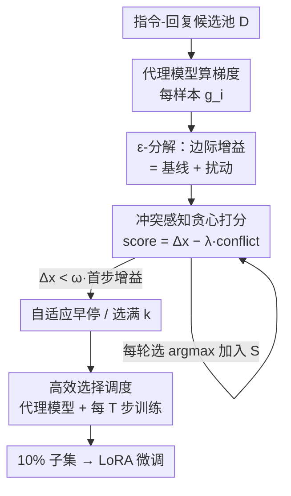

# SPICE: Submodular Penalized Information–Conflict Selection for Efficient Large Language Model Training

**会议**: ICLR 2026  
**OpenReview**: [https://openreview.net/forum?id=9rCRy58TPF](https://openreview.net/forum?id=9rCRy58TPF)  
**代码**: 有（论文标注 code，链接占位待补）  
**领域**: LLM 训练数据选择 / 指令微调 / 子模优化  
**关键词**: 数据选择, Fisher 信息, 子模性, 梯度冲突, 指令微调

## 一句话总结
SPICE 指出"基于 Fisher 信息的贪心数据选择"在实践中崩得比理论快的元凶是**样本间梯度冲突**，用一个 ε-分解把"偏离理想子模性的程度"量化成冲突统计量，进而提出一个"信息增益 − 冲突惩罚"的冲突感知贪心选择器：在 LLaMA2-7B / Qwen2-7B 上只用 10% 数据、20 GPU-hours，就在 8 个 benchmark 上追平甚至超过全量微调与 6 个基线。

## 研究背景与动机
**领域现状**：指令微调（instruction tuning）的效果高度依赖数据质量而非数量——业界反复观察到"只用 10–20% 的数据反而能打平甚至超过全量训练"的现象。于是**数据选择**成了降低大规模训练成本的关键路径。在众多方法里，基于梯度的选择最被看好，尤其是以 **Fisher 信息矩阵的 log-determinant（log-det FIM）** 为目标的方法：它的效用函数 $F(S)=\log\det(I+\alpha F_S)$ 是**单调子模函数**，因此贪心算法在基数预算 $k$ 下享有 $(1-1/e)$ 的近似保证，理论上很漂亮。

**现有痛点**：理论很美，实践很骨感。从业者发现，FisherSFT 这类贪心选择在实践中**退化得远比理论预测快**——一旦选中的子集超过某个阈值，每加一个样本带来的边际信息增益 $\Delta_t$ 就急剧塌缩，实际表现常常比 $(1-1/e)$ 界所暗示的差很多。同时这些方法计算开销巨大（有时超过 100 GPU-hours），理论却只能部分解释这种行为，理论与实践之间留着一道明显的缝。

**核心矛盾**：子模性只保证"边际收益递减"，却**对递减的速率只字未提**。而真正决定"同样预算 $k$ 下能攒到多少累计信息"的，恰恰是这个**衰减速率**——衰减越慢，曲线下面积越大，累计信息越高。是什么在控制衰减速率？作者的关键洞察是：是**样本梯度之间的冲突**（gradient conflict，即不同样本梯度方向夹角大、互相抵消）。冲突越强，子模性的"曲率"被推得越大，贪心保证越弱、信息塌缩越快。

**本文目标**：(1) 在理论上把"梯度冲突"和"边际信息增益的衰减"建立量化联系，解释理论-实践鸿沟；(2) 据此设计一个既保住信息、又压制冲突，且计算高效的选择算法。

**切入角度**：把每个边际增益 $\Delta_x(S)$ 拆成"模块化基线 + 扰动项"。基线 $\text{base}_x$ 只看样本自身信息、与已选集合无关；扰动项 $\varepsilon_x(S)$ 才捕捉"样本互动如何拖累边际效用"。子模性的全部"递减"都来自扰动项，而扰动项的大小被**梯度内积平方和**界住——这就把抽象的"曲率"翻译成了可测量、可优化的"冲突"。

**核心 idea**：用"信息增益 − $\lambda\times$ 冲突惩罚"作为贪心打分，**不丢弃**高信息但冲突的样本，只在它们冲突太强时降权，从而压低扰动 $|\varepsilon|$ 与曲率、把贪心近似保证收紧。

## 方法详解

### 整体框架
SPICE 要解决的是"在固定预算下选出一个信息量最大、且彼此梯度不互相打架的子集"。整条流水线是：先用一个**小代理模型**（如 0.5B，与目标模型同架构）算出每个候选样本的梯度 $g_i$；然后在贪心循环里，对每个候选同时算它的 **Fisher 边际信息增益** $\Delta_x$ 和它对当前平均梯度方向的**冲突** $\text{conflict}(x)$，用 $\text{score}(x)=\Delta_x-\lambda\cdot\text{conflict}(x)$ 打分，每轮选分最高的一个加进子集；循环要么选满固定预算 $k$，要么在边际增益跌破首步增益的 $\omega$ 倍时**自适应早停**；为提效，选择与训练交替进行——每攒 $T$ 步选择就做一次训练再清空缓冲。理论侧（ε-分解 + 曲率界）解释了"为什么压冲突能收紧近似保证"，方法侧把这个洞察落成可跑的算法。

### 关键设计

**1. ε-分解：把"子模性偏离"量化成梯度冲突**

这一设计直击痛点——子模性保证递减但说不清"为什么有时崩得这么快"。SPICE 把每个边际增益拆开：模块化基线 $\text{base}_x\triangleq\log(1+\alpha\lVert g_x\rVert^2)$ 只反映样本自身的 Fisher 信息、与已选集合 $S$ 无关；扰动项

$$\varepsilon_x(S)\triangleq\Delta_x(S)-\text{base}_x=\log\frac{1+\alpha\,g_x^\top(I+\alpha F_S)^{-1}g_x}{1+\alpha\lVert g_x\rVert^2}$$

才捕捉"加入 $S$ 之后边际效用被互动拖低了多少"。论文证明（Theorem 1）函数的全部"递减"完全由扰动项驱动：$\Delta_x(A)-\Delta_x(B)=\varepsilon_x(A)-\varepsilon_x(B)\ge0$，而基线项之差恒为 0。由于 $\varepsilon_x(S)\le0$ 且随 $|S|$ 增大单调不增，$|\varepsilon_x(S)|$ 恰好等于"样本 $x$ 的边际增益相对空集时的累计衰减量"。这一步把"衰减速率"这个原本只能定性观察的东西，变成了一个有闭式表达、可测量的量。

**2. 曲率界 + 梯度内积上界：把"冲突小 ⇒ 保证强"证出来**

光有分解还不够，得说明控制扰动真能换来更好的近似保证。SPICE 引入**总曲率** $c\triangleq 1-\min_x \Delta_x(D\setminus\{x\})/\Delta_x(\varnothing)\in[0,1]$，并证明曲率相关的贪心界 $F(S_{\text{greedy}})\ge\frac{1-e^{-c}}{c}F(S^*)$：$c=1$ 退回经典 $(1-1/e)$，$c\to0$ 时因子趋近 1（近乎最优）。再通过 Lemma 1 把曲率用归一化扰动界住 $c\le\max_x |\varepsilon_x(D\setminus\{x\})|/\text{base}_x$，并通过 Theorem 4 把扰动用**梯度内积平方和**界住：

$$|\varepsilon_x(S)|\le C\cdot\frac{\alpha^2\sum_{y\in S}(g_x^\top g_y)^2}{1+\alpha\lVert g_x\rVert^2}$$

串起来得到数据相关的近似保证 $F(S_{\text{greedy}})\ge\frac{1-e^{-\hat c}}{\hat c}F(S^*)$，其中 $\hat c\propto\max_x\sum_{y\ne x}(g_x^\top g_y)^2$。结论很干脆：**梯度内积越小（越不冲突）⇒ 扰动越小 ⇒ 曲率越低 ⇒ 近似保证越强**。这就为"压制冲突"提供了原理性依据，而不是拍脑袋加正则。论文也诚实标注该闭式界依赖一个假设、约 90% 的步成立、10% 可能破缺（⚠️ 以原文 App. E/F 为准）。

**3. 冲突感知贪心打分 + 自适应早停：把理论落成可跑算法**

理论指向"控制 $\sum(g_x^\top g_y)^2$"，但直接优化内积平方和太贵，SPICE 用一个**廉价代理**：对当前已选集合的平均梯度 $\bar g_S$，定义对齐 $\text{Align}(g_i)=\frac{g_i^\top\bar g}{\lVert g_i\rVert\lVert\bar g\rVert+\eta}$，冲突取负对齐的 hinge $\text{conflict}(g_i)=\max\{0,-\text{Align}(g_i)\}$（只惩罚真正"逆向"的样本，不惩罚普通相似）。打分为

$$\text{score}(x\mid S_{t-1})=\Delta_x(S_{t-1})-\lambda\,\text{conflict}(x\mid S_{t-1}),\quad\lambda\ge0$$

第一项偏好高信息样本，第二项压制与当前更新方向强烈冲突的样本。关键在于**不丢弃高价值冲突样本**：只要 $\Delta_x$ 足够大，冲突样本仍能胜出被选，这与理论一致（压冲突是为了降扰动 $|\varepsilon|$ 与曲率，而非剔除信息）。早停上，自适应规则在边际增益首次跌破首步增益的 $\omega$ 倍时停止 $t_{\text{stop}}=\min\{t:\Delta_{x_t}(S_{t-1})\le\omega\cdot\Delta_{x_1}(S_0)\}$（实验观测边际增益常在 10–30 步内半衰，早停很划算）；也支持固定预算模式以便与基线公平比较。

**4. 高效选择调度：代理模型 + 周期训练，把成本压到 20 GPU-hours**

直接在 7B 大模型上做梯度选择不现实，SPICE 用**同架构小代理模型**（0.5B/1.5B）算梯度——利用了"基于梯度的选择模式能跨模型规模迁移"这一观察。同时采用**周期化选择-训练调度**：在一个候选池内每轮贪心选一个样本累积进子集，每 $T\in\{1,10,50\}$ 轮做一次训练步，然后清空缓冲进入下一周期。整体选择复杂度 $O(k|D|d)$、峰值内存 $O(md)$，把总成本压到约 20 GPU-hours，远低于全量训练。实验显示更小代理 + 更大间隔在保持性能的同时显著降本，但跨架构代理（用 LLaMA2 代理给 Qwen2 选数据）迁移明显变差。

## 实验关键数据

### 主实验
构造 97.5K 指令语料（覆盖数学推理 GSM8K、代码 Alpaca Code、通用知识 ShareGPT/Alpaca），在 8 个 benchmark 上评测；每个基线都用各自准则选 10% 数据训练，SPICE 默认 $T=10,\lambda=0.1$，用 LoRA（r=16, α=32）在 8×H20 上微调，结果三次平均。

**Qwen2-7B（平均分）**：

| 方法 | 数据量 | 平均分 | 相对全量 |
|------|--------|--------|----------|
| Full | 100% | 56.4 | — |
| Random | 10% | 55.5 | -0.9 |
| Fisher | 10% | 55.9 | -0.5 |
| DPP | 10% | 57.0 | +0.6 |
| LEAD | 10% | 56.5 | +0.1 |
| **SPICE** | **10%** | **58.0** | **+1.6** |

SPICE 在 8 个 benchmark 中 7 个取得最佳、剩下 1 个次佳，IFEval 提升尤其大（38.6 vs 全量 33.5，+5.1）。LLaMA2-7B 上 SPICE 平均 31.1，同样优于全量 30.8（+1.8）。

### 消融实验

| 配置 | 现象 | 说明 |
|------|------|------|
| $\lambda=0$（无惩罚） | 性能显著下降 | 退化为纯信息贪心，验证冲突惩罚必要性 |
| $\lambda\in[0.1,0.5]$ | 一致更强 | 惩罚系数在合理区间稳健 |
| 代理 0.5B/1.5B/7B | 精度相近，7B 仅 +0.1 | 小代理足矣，省成本 |
| 跨架构代理 | 明显变差 | LLaMA2 代理给 Qwen2 选数据迁移差 |
| 步间隔 $T=1/10/50$ | 大间隔仍保性能 | $(T{=}10,1.5B)$、$(T{=}1,7B)$ 最优 |

多样性分析（Table 3，Qwen2-7B 10%）：SPICE 的 NovelSum/LDD（41.3 / 22.0）明显超过 Random 和多数基线、与 DPP 相当，且 code/math/general 域覆盖与全量语料接近，说明压缩到 10% 仍保持广而均衡的语义覆盖。

### 关键发现
- **冲突惩罚是命门**：$\lambda=0$ 时性能显著掉，证明"只追信息、不管冲突"的纯 Fisher 贪心确实有问题——这正是理论预测的"高冲突 ⇒ 快塌缩"。
- **冲突与衰减强相关**：step-wise Spearman 显示冲突与边际增益强负相关（$\rho=-0.792$）、与扰动幅度 $|\varepsilon|$ 强正相关（$\rho=0.901$），直接支撑 Corollary 1。
- **早停很划算**：边际增益常在 10–30 步内半衰，自适应早停能在几乎不损精度下进一步省时（SPICE+ 略准但更慢）。
- **代理可小、调度可疏**：方法对 $\lambda$、代理规模、步间隔在合理区间都不敏感，工程上很省心。

## 亮点与洞察
- **把"理论-实践鸿沟"归因到一个可测量的物理量**：不是泛泛说"贪心不够好"，而是精确指出"扰动项被梯度内积平方和界住"，把抽象的子模曲率翻译成可优化的梯度冲突——这是最"啊哈"的地方。
- **ε-分解是干净的分析工具**：基线项之差恒为 0、递减全由扰动驱动，这个分解让"衰减速率"第一次有了闭式刻画，可迁移到任何 log-det 类子模目标的分析。
- **"惩罚而非丢弃"的取舍很巧**：高信息冲突样本不一刀切删除，只在冲突过强时降权，避免了"为降冲突而扔掉宝贵信息"的常见陷阱。
- **代理 + 周期调度**这套提效组合可直接迁移到其他梯度类选择方法，把 100+ GPU-hours 压到 20。

## 局限与展望
- **闭式扰动界依赖假设**：Theorem 4 的 Neumann 级数闭式界在约 90% 的步成立、10% 可能破缺，理论保证并非处处严格（作者已诚实标注）。
- **跨架构迁移受限**：代理必须与目标模型同架构，LLaMA2 代理给 Qwen2 选数据明显变差，限制了"一套代理通吃"的设想。
- **冲突用平均梯度的余弦近似**：实际优化的是对 $\bar g_S$ 的对齐，而非理论里的两两内积平方和 $\sum(g_x^\top g_y)^2$，是一个廉价代理，二者一致性主要靠经验相关性支撑。
- **评测仍偏指令微调小模型**：虽提到 70B+、1%/5% 极端预算也有效（附录），但主战场是 7B + 10%，更大规模下的稳健性待进一步验证。

## 相关工作与启发
- **vs Fisher / FisherSFT**：同样以 log-det FIM 为目标、享子模保证，但 FisherSFT 只做纯信息贪心、忽略样本互动；SPICE 用 ε-分解揭示其"快塌缩"根因并加冲突惩罚，理论上收紧曲率界、实践上 Qwen2-7B 平均 58.0 vs Fisher 55.9。
- **vs LESS / SelectIT**：LESS 一次性梯度选择、SelectIT 用强 LLM 打分，都偏经验且常需全量推理、开销大；SPICE 有原理性的曲率-冲突分析做支撑，且代理 + 周期调度把成本压到 20 GPU-hours。
- **vs DPP / TSDS**：DPP 靠行列式点过程促多样性、TSDS 做任务条件选择，关注"覆盖/对齐"但缺乏对贪心衰减速率的理论刻画；SPICE 在多样性指标上与 DPP 相当，同时给出"为什么有效"的近似保证。
- **vs 梯度对齐 / 冲突缓解工作（如 PCGrad 系）**：以往把梯度冲突放在训练动态里讨论，SPICE 首次把冲突直接接到**子模数据选择理论**上，是连接两条线的桥。

## 评分
- 新颖性: ⭐⭐⭐⭐⭐ 首次量化把梯度冲突接到子模数据选择的近似保证上，ε-分解干净有力。
- 实验充分度: ⭐⭐⭐⭐ 8 benchmark × 2 模型 + 多样性/成本/敏感性消融较完整，但主战场集中在 7B+10%。
- 写作质量: ⭐⭐⭐⭐ 理论-实践动机讲得清楚，公式与图配合好；部分句子可读性一般。
- 价值: ⭐⭐⭐⭐⭐ 既给出可迁移的理论工具，又是 20 GPU-hours 即可落地的实用选择器。

<!-- RELATED:START -->

## 相关论文

- [\[ICLR 2026\] Joint Selection for Large-Scale Pre-Training Data via Policy Gradient-based Mask Learning](joint_selection_for_large-scale_pre-training_data_via_policy_gradient-based_mask.md)
- [\[ICLR 2026\] Train on Validation (ToV): Fast Data Selection with Applications to Fine-Tuning](train_on_validation_tov_fast_data_selection_with_applications_to_fine-tuning.md)
- [\[ACL 2025\] DavIR: Data Selection via Implicit Reward for Large Language Models](../../ACL2025/llm_pretraining/davir_data_selection_via_implicit_reward_for_large_language_models.md)
- [\[ACL 2025\] Towards Effective and Efficient Continual Pre-training of Large Language Models](../../ACL2025/llm_pretraining/towards_effective_and_efficient_continual_pre-training_of_large_language_models.md)
- [\[ICLR 2026\] Scaling with Collapse: Efficient and Predictable Training of LLM Families](scaling_with_collapse_efficient_and_predictable_training_of_llm_families.md)

<!-- RELATED:END -->
