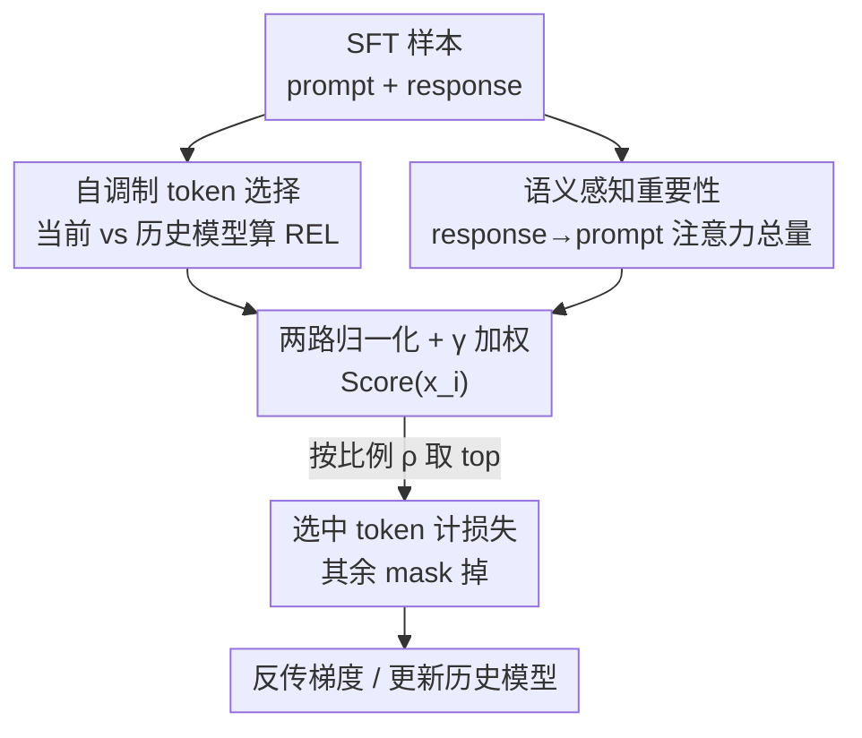

# ssToken: Self-modulated and Semantic-aware Token Selection for LLM Fine-tuning

**会议**: ICLR 2026  
**OpenReview**: [https://openreview.net/forum?id=wZ4UoRKDNa](https://openreview.net/forum?id=wZ4UoRKDNa)  
**代码**: https://github.com/jianke0604/ssToken  
**领域**: LLM 数据选择 / 监督微调 / Token 级筛选  
**关键词**: token 级数据选择, SFT, 自调制, 注意力语义, 参考模型

## 一句话总结
ssToken 在 LLM 监督微调中做 token 级数据筛选：用模型自己的历史 checkpoint 替代外部参考模型算「回顾式超额损失」（自调制信号），再叠加一个基于注意力的语义重要性指标，两路正交信号加权融合后只对 top-ρ 的 token 计损失，在 3B–14B 模型上比全量微调最高提升 4.3%、比已有 token 选择方法最高提升 2.8%，且几乎不增加训练开销。

## 研究背景与动机

**领域现状**：监督微调（SFT）阶段「数据质量 > 数据数量」已成共识，而即便经过样本级清洗的高质量数据集，内部仍残留大量 token 级噪声——非任务相关的冗余短语、模板套话。于是出现了 token 级数据选择这条更细粒度的路线，代表工作 RHO-1 和 TokenCleaning 都通过对比一个**参考模型**来给 token 打分、只训练「可学且有用」的那部分 token。

**现有痛点**：这些方法共享两个硬伤。其一，必须**训练或调用一个额外的参考模型**——要么在精选小数据集上再微调一个 reference，要么借用一个同 tokenizer 的更强模型，前者耗时耗资源，后者并不总能拿到；而且 TokenCleaning 已证明参考模型本身的能力会显著左右最终选择质量。其二，它们**只用损失信息**打分：超额损失只反映模型的预测不确定性，捕捉不到 token 在上下文里的语义重要性，高频但语义空洞的 token 可能和任务关键 token 拿到相近的损失值，导致 loss-only 选择会误删有信息量的内容。

**核心矛盾**：参考模型是「外部、静态、昂贵」的，而 token 选择本应跟着模型训练轨迹动态变化；同时单一的损失维度无法同时刻画「可学性」和「语义相关性」这两个不同的属性。

**本文目标**：去掉对外部参考模型的依赖，并补上损失之外的第二维信号，做到既省成本又选得更准。

**切入角度**：作者把当前模型自己当成「天然的老师」——随着训练推进，当前模型相对它**训练前的历史状态**已经学会了若干任务模式，这个「自我进步量」本身就是可靠的选择信号；另一方面，预训练好的模型的**注意力矩阵**天然编码了语义信息，可作为损失之外的互补信号。

**核心 idea**：用「当前模型 vs 历史模型」的回顾式超额损失（自调制）替代「当前模型 vs 外部参考」的超额损失，再用「response token 对 prompt 的注意力总量」度量语义重要性，两者归一化后加权融合做 top-ρ 筛选。

## 方法详解

### 整体框架
ssToken 是一个嵌进 SFT 训练循环里的 token 打分—筛选模块：每个训练步对一个样本的所有 response token 计算两路分数——一路是反映「可学性」的**回顾式超额损失 REL**（拿当前模型和历史 checkpoint 比损失差），另一路是反映「语义相关性」的**注意力分数 AttnScore**（统计每个 response token 对 prompt 的注意力总量）。两路分数各自归一化到 $[0,1]$，用平衡系数 $\gamma$ 线性加权得到最终 $\text{Score}(x_i)$，再按固定比例 $\rho$ 取 top 部分 token、只对它们计算并回传梯度，其余 token mask 掉。整套流程参考模型自由（reference-free），历史模型可用训练中保存的 checkpoint 或 EMA 自适应更新。

### 关键设计

**1. 回顾式超额损失 REL：用模型自己的历史替代外部参考**

针对「必须训练/调用参考模型」这个痛点，作者重新解读了参考模型的角色：它无非是用来识别「任务相关且可学」的 token、丢弃噪声或已学会的 token。既然如此，不如让当前模型回头看自己训练前的状态。已有方法用的超额损失是 $\text{EL}(x_i)=\mathcal{L}_\theta(x_i)-\mathcal{L}_{\theta_{\text{ref}}}(x_i)$，比的是「相对外部参考还能进步多少（future loss）」；ssToken 改成回顾式超额损失：

$$\text{REL}(x_i)=\mathcal{L}_{\theta_{\text{his}}}(x_i)-\mathcal{L}_{\theta}(x_i)=\log\frac{P_\theta(x_i\mid x_{<i})}{P_{\theta_{\text{his}}}(x_i\mid x_{<i})}$$

其中 $\theta_{\text{his}}$ 是历史模型（SFT 前的 base，或训练中的 checkpoint）。直觉是：如果当前模型相对历史模型在某个 token 上损失明显下降（REL 大），说明这个 token 既不是噪声也不是已经学透的内容，而是「当前阶段仍可学的有用内容」。这一改既彻底省掉了准备精选数据集 + 训练 reference 的成本，又让选择信号天然跟着优化轨迹走（self-modulated）。更进一步，历史模型不像固定参考模型那样难以更新，可以用 EMA 持续迭代 $\theta_{\text{his}}^t=\alpha\,\theta_{\text{his}}^{t-1}+(1-\alpha)\,\theta^t$，为大规模、长程训练提供更稳定的引导。

**2. 注意力语义重要性 AttnScore：补上损失之外的第二维信号**

针对「只靠损失会漏掉语义关键 token」这个痛点，作者引入一个与损失正交的注意力信号。观察是：SFT 里只需对 response token 打分，而所有 response token 都会注意一段定长的 prompt，而 prompt 恰好编码了任务指令——于是一个 response token 对 prompt 的注意力总量，就自然反映了它的任务相关性与指令遵循重要性。具体在某固定层 $l$、对每个注意力头 $h$，取 response→prompt 的子矩阵 $A^{(h)}_{\text{resp}\to\text{prompt}}=A^{(h)}[I_{\text{resp}},I_{\text{prompt}}]$，沿 prompt 维求和再对所有头取平均：

$$\text{AttnScore}(x_i)=\frac{1}{H}\sum_{h=1}^{H}\mathbf{1}^\top_{\text{prompt}}\cdot\mathrm{softmax}\!\left(\frac{q_i^{(h)}K^{(h)\top}+M_i}{\sqrt{d_k}}\right)$$

这一信号天然落在 $[0,1]$。两个工程要点：其一，作者发现**深层**注意力比浅层更适合做语义打分——浅层偏句法/位置，深层偏抽象语义和任务相关全局信息，与可解释性研究一致，故默认取深层。其二，直接输出完整注意力矩阵与 FlashAttention 不兼容，作者用 hook 在前向时存下目标层的 hidden states，事后**只对该层重算**一次拿到注意力矩阵，避免整条前向输出 attention，从而保持训练效率、几乎零额外开销。

**3. 双信号归一化加权融合 + top-ρ 筛选**

拿到 REL 和 AttnScore 后，REL 在每个样本内按 min-max 归一化到 $[0,1]$，AttnScore 本就有界，于是用平衡系数 $\gamma\in[0,1]$ 融合：

$$\text{Score}(x_i)=\gamma\cdot\text{Normalize}(\text{REL}(x_i))+(1-\gamma)\cdot\text{AttnScore}(x_i)$$

$\gamma=1$ 退化为纯损失选择、$\gamma=0$ 退化为纯注意力选择，消融显示中间值最好，默认 $\gamma=0.5$。最后按固定比例 $\rho$ 取 Score 最高的那批 token，损失只在它们上面累加：$\mathcal{L}_\theta(x)=-\frac{1}{L_{\text{resp}}\cdot\rho}\sum_i \mathbb{I}_\rho(x_i)\log P_\theta(x_i\mid x_{<i})$，其中指示函数 $\mathbb{I}_\rho(x_i)$ 标记 token 是否进入 top-ρ。默认 $\rho=0.6$（大模型如 Qwen-2.5-14B 用 0.8 更好）。关键在于两路信号正交：损失管「可学性」、注意力管「语义相关性」，融合后互相强化，单用任意一路都已超过全量微调，合在一起产生协同增益。

### 损失函数 / 训练策略
训练目标就是上面修改过的 masked SFT 损失：只对每个样本中按 $\text{Score}$ 排序的 top-$\rho$ response token 计算 next-token 负对数似然。注意被筛掉的 token 仍参与前向（只是不计损失、不回传），所以方法定位是「提性能」而非「省训练时间」。默认配置：$\gamma=0.5$、$\rho=0.6$、深层注意力、历史模型可选 EMA 更新。

## 实验关键数据

数据池从 5 个常用 SFT 数据集（Flan v2 / OpenAssistant / Alpaca / Dolly / WizardLM，共 300k）采样 50k；在 LLaMA-3.2-3B、LLaMA-3.1-8B、Qwen-2.5-7B、Qwen-2.5-14B 四个 3B–14B 模型上、10 个 benchmark（MMLU、TriviaQA、TruthfulQA、ARC、TyDiQA、Winogrande、HellaSwag、LogiQA、AGIEval 等）用 lm-eval-harness 评测。需要参考模型的对比方法，其 reference 在 DS2 筛出的 10k 子集上训练。

### 主实验

| 模型 | 方法 | 平均分 | vs FULL |
|------|------|--------|---------|
| LLaMA-3.2-3B | FULL | 50.35 | — |
| LLaMA-3.2-3B | RHO-1 | 51.65 | +1.30 |
| LLaMA-3.2-3B | TokenCleaning | 51.87 | +1.52 |
| LLaMA-3.2-3B | **ssToken** | **52.50** | **+4.3%** |
| LLaMA-3.1-8B | FULL | 57.49 | — |
| LLaMA-3.1-8B | TokenCleaning | 59.14 | +1.65 |
| LLaMA-3.1-8B | **ssToken** | **59.44** | **+3.4%** |
| Qwen-2.5-7B | FULL | 59.73 | — |
| Qwen-2.5-7B | **ssToken** | **60.48** | **+1.3%** |
| Qwen-2.5-14B | FULL | 64.50 | — |
| Qwen-2.5-14B | **ssToken** | **65.84** | **+2.1%** |

ssToken 在四个模型上都拿到最高平均分。值得注意：RHO-1 / TokenCleaning 在 Qwen 系列上仅与全量微调持平甚至更差，而 ssToken 在不同规模和系列上都稳定提升，泛化性更好。

### 消融实验

| 配置 | 关键设定 | 说明 |
|------|---------|------|
| 纯注意力 | $\gamma=0$ | 单独使用已超过全量微调 |
| 纯损失（自调制） | $\gamma=1$ | 单独使用也超过全量微调 |
| Full ssToken | $\gamma=0.5$ | 8B/14B 上最优、3B 上次优（略逊 $\gamma=0.75$） |
| 注意力层深度 | 深层 | 3B 上 10 任务赢 7、7B 上赢 6，且平均分最高 |
| 选择比例 | $\rho=0.6$（14B 用 0.8） | 适当比例下仍优于全量微调 |

### 关键发现
- **两路信号正交且协同**：纯损失（$\gamma=1$）和纯注意力（$\gamma=0$）单独都能打败全量微调，证明注意力确实提供了损失之外的语义信息；中间比例融合产生协同增益，$\gamma=0.5$ 综合最稳。
- **深层注意力更可靠**：在 QA 类和逻辑/常识推理任务上深层注意力一致最好，与「浅层管句法、深层管语义」的可解释性结论吻合，且无需任务特定调参。
- **任务类型决定收益**：MMLU、ARC 这类重度依赖预训练的知识型任务，SFT 阶段 token 选择收益有限；TyDiQA、TriviaQA、AGIEval 这类强调指令遵循的下游任务收益显著——作者把 ssToken 在 QA 任务上的优势归因于注意力分量带来的语义线索。
- **省成本不省时间**：ssToken 不训练参考模型，注意力重算开销极小，相对全量微调几乎不增训练时间；但被筛 token 仍走前向，所以不会比全量更快。

## 亮点与洞察
- **「模型自己当老师」的视角很巧**：把 token 选择从「需要外部裁判」重构成「跟自己历史比进步」，一举解决了参考模型贵、难更新、能力会反噬选择质量三个问题，而且历史模型可 EMA 更新，比固定参考更适合长程训练。
- **注意力打分的工程实现可复用**：用 hook 存 hidden states + 单层重算拿注意力，绕过「输出完整 attention 与 FlashAttention 不兼容」的坑——这套技巧可迁移到任何需要在高效注意力下做 attention 分析/打分的场景。
- **正交信号融合的范式**：损失（可学性）与注意力（语义相关性）刻画两个不同属性，归一化后线性加权即可协同。这个「找一个与现有打分正交的第二维信号」的思路可迁移到样本级选择、课程学习等数据筛选问题。

## 局限与展望
- **不省训练时间**：被筛掉的 token 仍参与前向，方法只提性能、不降成本；若想真正加速需要结合稀疏前向等手段。
- **超参随模型族漂移**：最优 $\rho$ 在 Qwen-2.5-14B 上是 0.8 而非 0.6，$\gamma$ 在 3B 上 0.75 略好于 0.5，说明默认值并非处处最优，作者也据此探索了自适应 $\rho$ 策略。
- **注意力指标的假设较强**：「response 对 prompt 注意力越多越重要」依赖 prompt 编码了清晰任务指令，对于 prompt 很短、多轮对话或指令隐含的场景，这个信号的有效性有待验证。
- **早期选择近随机**：训练初期历史模型与当前模型参数相同，REL 几乎为零，此时主要靠注意力信号兜底——冷启动阶段的选择质量是潜在改进点。

## 相关工作与启发
- **vs RHO-1**：RHO-1 首次提出 token 级选择，用「当前 vs 外部参考模型」的超额损失挑 H→L 类 token；ssToken 把参考换成模型自己的历史（reference-free），并额外加注意力语义信号，避免了参考模型的成本与能力依赖。
- **vs TokenCleaning**：TokenCleaning 在 SFT 设定下优化 token 选择，含 Fixed-model / Self-evolving 两个变体，仍需训练/迭代参考模型，且只用损失；ssToken 完全去掉参考模型，并补上正交的注意力维度，在 Qwen 系列上稳定性明显更好。

## 评分
- 新颖性: ⭐⭐⭐⭐ 「历史模型替代参考模型」+「注意力作为正交语义信号」两点结合，思路清晰且解决真实痛点。
- 实验充分度: ⭐⭐⭐⭐ 覆盖 4 个模型族/规模、10 个 benchmark，γ/ρ/层深消融完整，但主要限于通用 QA/知识类任务。
- 写作质量: ⭐⭐⭐⭐ 动机—方法—实验逻辑顺畅，公式与图示清楚。
- 价值: ⭐⭐⭐⭐ 即插即用、几乎零额外成本，对 SFT 数据筛选实践有直接参考价值。

<!-- RELATED:START -->

## 相关论文

- [\[ICLR 2026\] Token-level Data Selection for Safe LLM Fine-tuning](token-level_data_selection_for_safe_llm_fine-tuning.md)
- [\[ICLR 2026\] Task-Aware Data Selection via Proxy-Label Enhanced Distribution Matching for LLM Fine-Tuning](task-aware_data_selection_via_proxy-label_enhanced_distribution_matching_for_llm.md)
- [\[ICLR 2026\] Train on Validation (ToV): Fast Data Selection with Applications to Fine-Tuning](train_on_validation_tov_fast_data_selection_with_applications_to_fine-tuning.md)
- [\[ICLR 2026\] Pre-training LLM without Learning Rate Decay Enhances Supervised Fine-Tuning](pre-training_llm_without_learning_rate_decay_enhances_supervised_fine-tuning.md)
- [\[ICML 2026\] Data Difficulty and the Generalization--Extrapolation Tradeoff in LLM Fine-Tuning](../../ICML2026/llm_pretraining/data_difficulty_and_the_generalization--extrapolation_tradeoff_in_llm_fine-tunin.md)

<!-- RELATED:END -->
