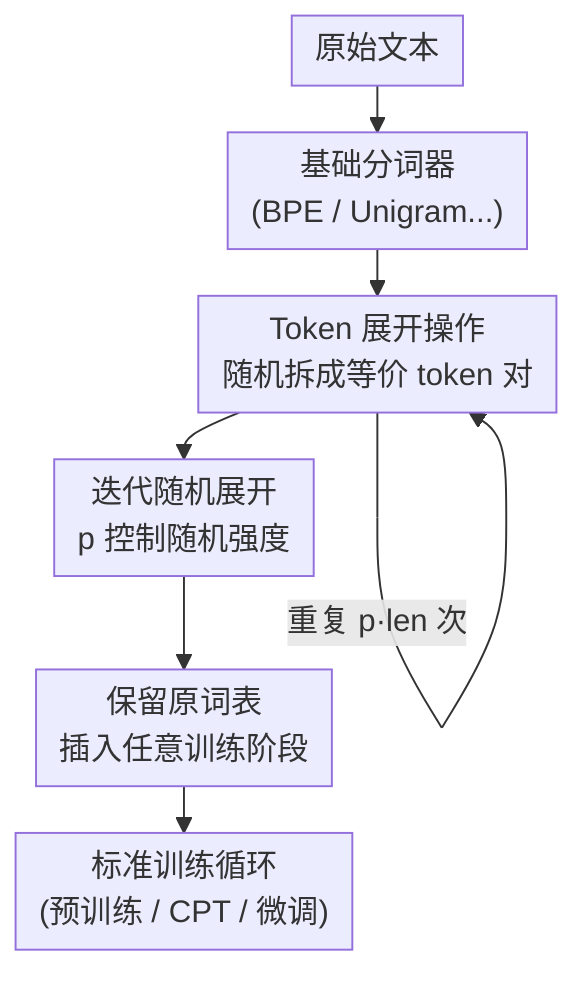

# StochasTok: Improving Fine-Grained Subword Understanding in LLMs

**会议**: ICLR 2026  
**OpenReview**: [https://openreview.net/forum?id=gqCh1k0CEX](https://openreview.net/forum?id=gqCh1k0CEX)  
**代码**: https://github.com/anyasims/stochastok (有)  
**领域**: LLM预训练 / 分词Tokenization  
**关键词**: 随机分词, 子词理解, 预训练, 字符级任务, BPE

## 一句话总结
StochasTok 在分词之后加一个极轻量的后处理步骤——按概率随机把 token 拆成词表里等价的更小 token 对，让 LLM 在预训练时"看见"token 内部结构，从而在数字母、找子串、多位数加法等细粒度子词任务上大幅超越确定性分词与 BPE-dropout，且可热插拔到任意训练阶段。

## 研究背景与动机

**领域现状**：当今主流 LLM 几乎都用 BPE 这类确定性分词器——同一段文本永远被切成同一串 token ID。分词把字符压缩成更短的 token 序列，提升了效率和建模性能，是 LLM 流水线里默认且很少被动的第一步。

**现有痛点**：确定性分词把单词的内部结构藏了起来。对人来说 `book` 和 `cook` 只差一个字母，但对模型它们是两个毫无关联的 token ID（GPT-4o 里分别是 3092 和 171691）。于是"strawberry 里有几个 r""哪个词最长""201 和 200 差多少"这类对人极简单的子词级任务，连 SOTA 模型都频频翻车；要靠 o1 这种把模型规模和推理复杂度堆到爆才勉强缓解，代价与问题本身的简单程度完全不成比例。

**核心矛盾**：要让模型理解子词结构，最直接的办法是字符级/字节级建模，但那会把序列拉长导致算力爆炸；已有的随机分词（Subword Regularization、BPE-dropout）虽然能让同一文本对应多种切法、暴露内部结构，却各自绑死某一种基础分词器、要重新分词、会改变词表、改善还不稳定——既贵又难用。

**本文目标**：找到一种又便宜、又简单、又能兼容任意分词器、还能事后打补丁到已训练模型上的随机分词方案，让模型真正"看进"token 内部。

**切入角度**：作者不去改原分词过程，而是在分词**之后**动手——既然只要让模型见到同一个词的多种切法即可，那就直接把已经切好的 token 随机"展开"成词表里等价的小 token 对。

**核心 idea**：用"分词后随机把 token 拆成等价 token 对"这一后处理步骤，替代"重写整个分词流程"，以最小改动让 LLM 学到细粒度子词结构。

## 方法详解

### 整体框架

StochasTok 的整条流程只有两步、且不碰训练循环本身：先用任意基础分词器（如 GPT-2 BPE）把文本切成 token 序列；再对这串 token 反复做"展开（expand）"操作——每次随机挑一个 token，若它能在词表里被拆成两个拼起来等价的小 token，就把它替换掉，重复 `p · len(token_ids)` 次。这样同一个词 `example` 在数据里就会以 `[example]`、`[exam|ple]`、`[ex|ample]`、`[ex|am|ple]`、`[e|x|am|ple]` 等多种形态出现，模型被迫学会它们指的是同一个词，从而捕捉到子 token 级的形态结构。展开完的序列照常喂给标准训练循环，损失、架构、优化器一概不变。

### 关键设计

**1. Token 展开操作：把一个 token 拆成词表内的等价 token 对**

这是 StochasTok 的原子操作，直接针对"确定性分词把单词内部结构藏起来"这个痛点。给定一串 token ID，每个"展开步"随机采样一个 token，检查它能否被切成两个**仍在词表里**、且拼接起来还原成原文的小 token——例如词表含 `_example, _exam, ple, ex, ample` 时，`_example` 可被换成 `_exam|ple` 或 `ex|ample`。若该 token 找不到任何等价拆分（比如它本身已是单字符），这一步就跳过。关键在于"等价"二字：解码过程和确定性分词器完全一样，无论怎么拆，decode 回去都是同一段文本，所以训练标签和文本语义都不变，模型唯一感知到的差别就是"同一个词可以有多种 token 组成"。正是这种反复的再切分，把单词的形态构成暴露给了模型。

**2. 迭代随机展开：用单一概率 p 控制随机性强度**

单次展开影响有限，StochasTok 把展开步迭代执行 `p · len(token_ids)` 次（默认 $p = 0.1$），`p` 是唯一的超参数，直接刻画"平均每个 token 有多大比例被进一步拆开"。这一设计解决的是"随机分词要么调参繁琐、要么改善不稳"的问题：因为数据可以**一次分词、按需展开**——同一份分好的 token 序列，套不同的展开步数就得到不同随机度，无需像 BPE-dropout 那样从头重新分词。作者实验证明它对 $p$ 极其鲁棒，在跨一个数量级的 $p$ 取值（如 $0.05$、$0.1$）上效果都接近，因此几乎不需要精调。这种"廉价 + 鲁棒"让随机度成了一个可自由调节、又不怕调错的旋钮。

**3. 保留原词表、可热插拔到任意训练阶段**

前两个设计带来一个极有价值的副产品：因为 StochasTok 只在已有词表内部做拆分、从不引入新 token，它**完整保留了基础分词器的词表**。这点直接区别于 BPE-dropout——后者会跳过 BPE 合并步，可能产出原词表之外的 token，导致无法直接用于预训练好的模型。词表不变意味着 StochasTok 可以在流水线任意位置无缝开关：预训练时打开、下游微调时关掉（用确定性 BPE 微调）毫无冲突；更重要的是能对**已经训练好的模型**做"续训补丁"——论文称为 continued pretraining（CPT），只需用 StochasTok 多训几千步，就能把子词理解能力注入一个原本用确定性分词训练的大模型，省去从头预训练的高昂代价。同时它对任意基础分词器（BPE、Unigram、WordPiece……）都适用，因为它只需要知道模型的词表，不需要了解分词器的合并规则等内部细节。

### 一个完整示例

以文本 `An example sentence` 为例（词表含 `An, _example, _sentence, _exam, ple, ex, ample, _sent, _se, nt, ence ...`）。基础分词得到 `[An | _example | _sentence]` 三个 token。第一个展开步随机选中 `_example`，把它拆成等价对 `_exam | ple`，序列变成 `[An | _exam | ple | _sentence]`；第二个展开步选中 `_sentence`，拆成 `_sent | ence`。换一个随机种子，第一步可能改为把 `_example` 拆成 `ex | ample`、第二步把 `ex` 进一步拆成 `e | x`。于是同一句话在不同种子下产生不同 token 序列，但解码全部还原为 `An example sentence`。模型反复见到这些"等价但形态不同"的版本，便学会了 token 之间的子词级对应关系。

## 实验关键数据

### 主实验

作者在 50M 参数模型（GPT-2 BPE 分词、OpenWebText）上对比四种设置：确定性分词、StochasTok、BPE-dropout、不预训练，再统一用确定性 BPE 微调到语言游戏任务。

| 任务集 | 评测内容 | StochasTok | 确定性 / BPE-dropout |
|--------|---------|-----------|---------------------|
| LangGame（自建 6 类子词任务） | 数字母、最长/最短词、找子串/前后缀 | 快速达到近乎满分 | 确定性几乎学不会；BPE-dropout 明显落后 |
| CUTE 基准（语言操控） | 字符级操控任务（归一化精度，0=随机、1=满分） | 显著更高 | 明显更低 |
| 标准语言理解基准 | 多个常规 benchmark | 与确定性持平（无损） | — |
| 多位数加法 | grok 加法并跨分词泛化 | 快速 grok，对训练时**没见过**的 4 种分词都近满分 | 确定性/BPE-dropout 仅线性缓慢学习，即便用匹配分词也难 grok |

字符级分词虽然在字符级问题上能 grok，但换一种分词就近乎零分；StochasTok 则在 4 种分词上全部近满分，体现出对数字关系的真正理解。

### 消融与分析实验

| 配置 / 维度 | 关键结果 | 说明 |
|------|---------|------|
| 超参 $p$ 扫描（图 5） | 跨一个数量级的 $p$ 都有效 | 对随机度选择极鲁棒，无需精调 |
| OOD 语言游戏（图 6） | StochasTok 近乎完美泛化 | 训练只见"子串≤答案一半长度"，测试为"子串>一半"；确定性有显著泛化 gap 且分布内本就更低 |
| 迁移到更大模型（图 7） | 275M GPT-2（modded-nanogpt、FineWeb、Muon 优化器）同样获益 | 架构/数据/优化器全换仍有效，提示可扩展 |
| CPT 续训（图 9/10） | 50M 模型续训 2k 步、GPT-2 续训 7k 步即注入子词能力 | 确定性 BPE 续训无效，StochasTok 续训显著提升 |

### 关键发现
- **表征对齐是机制根源**：用 PCA 可视化（图 12）和逐层平均距离（图 13）发现，StochasTok 让同一个词不同切法的内部表征随着 transformer 层逐层被映射得越来越近，确定性模型则没有这种行为——模型是真的把"等价切法"在表示空间里拉拢到一起。
- **分词鲁棒性**：同一 prompt 换不同分词时，StochasTok 模型的生成结果保持一致，确定性模型一遇到异常切法就崩（图 11）。
- **后训练即可补救**：最让人意外的是无需从头预训练——几千步 CPT 就能把子词理解"打补丁"进已有大模型，极具实用价值。

## 亮点与洞察
- **改动小、收益大**：核心就是分词后加一个 post-processing 步，训练循环、损失、架构一行不改，却带来子词任务上从"学不会"到"近满分"的质变——这种性价比在 LLM 流水线上很罕见。
- **"分词一次、按需展开"的工程巧思**：把随机度从分词器内部解耦成一个可调展开步数，既省算力又免去重新分词，是它比 BPE-dropout 更快更简单的关键。
- **保留词表 = 可热插拔**：不引入词表外 token 这一看似细节的性质，直接换来"任意阶段开关 + 给现成模型打补丁"的巨大灵活性，思路可迁移到任何"想给已训练模型加新归纳偏置又不想重训"的场景。
- **grok 行为可被分词诱发**：多位数加法从"线性缓慢学"变成"突然 grok 并跨分词泛化"，说明分词层面的归纳偏置足以改变学习动力学，值得在更多任务上探究。

## 局限与展望
- 实验规模仍偏小（50M–275M 参数），作者承认还需在更大、更强的模型上验证是否同样有效——这也是他们最期待的方向。
- 只研究了英语；不同字母表、不同形态丰富度的语言上效果未知。
- 评测集中在子词级语言游戏与多位数加法，对编程、代数、科学推理等更复杂任务的增益尚未验证。
- 与近期正交的分词改进（如 Liu et al. 2025）如何结合，仍是开放问题。

## 相关工作与启发
- **vs BPE-dropout**: BPE-dropout 通过随机跳过 BPE 合并步引入随机性，但需要分词器的完整合并层级、会改变词表（可能产出词表外 token）、只兼容 BPE、且要从头重新分词导致开销大。StochasTok 只需模型词表、保留原词表、兼容任意分词器、是分词后的轻量处理步，因此更快、更简单、可用于现成预训练模型。
- **vs Subword Regularization (Unigram)**: 后者依赖 Unigram 的概率模型与 Viterbi/FFBS 采样，复杂且只适用于 Unigram，而当前几乎所有 LLM 用 BPE，故基本无法套用；StochasTok 与分词器无关。
- **vs 字节级 / tokenizer-free 模型**: 字节级模型直接在字符上操作、天然处理拼写错误，但序列变长导致算力代价高，需要分层架构、局部卷积或 patching 等额外机制压缩序列。StochasTok 让基于分词的模型在不改框架、不增算力的前提下获得字节级理解的好处。

## 评分
- 新颖性: ⭐⭐⭐⭐ 思路简单但切入点新颖——"分词后随机展开等价 token 对"既简洁又兼容性强，是对随机分词的实质改进。
- 实验充分度: ⭐⭐⭐⭐ 覆盖语言游戏、CUTE、数学 grok、OOD 泛化、更大模型、CPT 补丁、表征分析，链条完整；但模型规模偏小。
- 写作质量: ⭐⭐⭐⭐⭐ 动机清晰、方法一图说透、实验层层递进，可读性很高。
- 价值: ⭐⭐⭐⭐⭐ 极低成本、可热插拔、能给现成模型打补丁，工程落地价值大，潜在影响面广。

<!-- RELATED:START -->

## 相关论文

- [\[ICLR 2026\] Understanding and Improving Shampoo and SOAP via Kullback-Leibler Minimization](understanding_and_improving_shampoo_and_soap_via_kullback-leibler_minimization.md)
- [\[ICLR 2026\] TNT: Improving Chunkwise Training for Test-Time Memorization](tnt_improving_chunkwise_training_for_test-time_memorization.md)
- [\[ICLR 2026\] Understanding the Emergence of Seemingly Useless Features in Next-Token Predictors](understanding_the_emergence_of_seemingly_useless_features_in_next-token_predicto.md)
- [\[ICLR 2026\] Identifying and Evaluating Inactive Heads in Pretrained LLMs](identifying_and_evaluating_inactive_heads_in_pretrained_llms.md)
- [\[ICLR 2026\] How to Train Data-Efficient LLMs](how_to_train_data-efficient_llms.md)

<!-- RELATED:END -->
