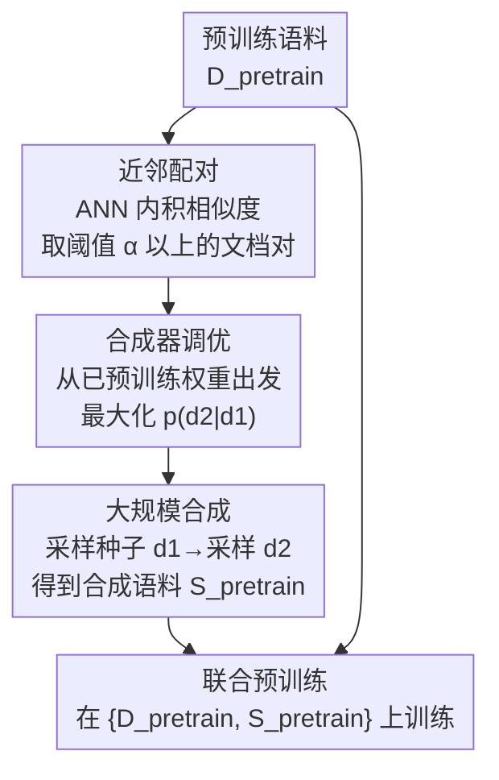

# Synthetic Bootstrapped Pretraining

**会议**: ICLR 2026  
**OpenReview**: [https://openreview.net/forum?id=5CfsI9FoAs](https://openreview.net/forum?id=5CfsI9FoAs)  
**代码**: 无  
**领域**: LLM预训练 / 合成数据 / 数据高效  
**关键词**: 合成预训练、文档间相关性、自举、条件合成器、贝叶斯概念模型

## 一句话总结
SBP（Synthetic Bootstrapped Pretraining）先从预训练语料里挖出语义相近的文档对、训练一个"给定 $d_1$ 生成相关 $d_2$"的条件合成器，再把它铺到整个语料上合成一大批新文档与真实数据联合预训练；在算力对齐的 3B / 6B、1T token 设定下，它稳定超过强复读基线，并能补回 oracle（拥有 20 倍新数据）增益的最多约 60%。

## 研究背景与动机
**领域现状**：现代 LLM 预训练靠 next-token prediction 在海量网页上学习，其威力来自**单篇文档内 token 之间的因果相关性**。数据规模越大效果越好，于是大家不断扩充语料（C4、Pile、DCLM、Dolma 等）。

**现有痛点**：高质量网页文本正在快速枯竭，逼近"scaling wall"。当唯一文档数 $\lVert D_{\text{pretrain}}\rVert$ 跟不上算力预算时，常规做法只能**重复读同一批数据**（repetition baseline），但重复 40 遍以后收益急剧衰减——单纯复读无法凭空造出新信号。

**核心矛盾**：标准预训练把每篇文档当成独立样本、只学**边际分布** $P(d)$，完全忽略了语料里另一种天然存在的信号——**文档之间的相关性**。比如 Transformer 论文和它的 PyTorch 实现源自同一个概念，《哈利波特》小说和其电影剧本结构高度相似。这种 inter-document correlation 蕴含可学习的知识，却被现有目标函数漏掉了。

**本文目标**：在**固定语料、不引入外部 teacher 模型**的前提下，把被漏掉的文档间相关性显式建模并注入训练，从而把同一批数据"用得更狠"。

**切入角度**：既然相关文档对 $(d_1, d_2)$ 大量存在，就可以直接学一个条件分布 $P(d_2 \mid d_1)$；再用它对整个语料采样，把"由一篇文档联想到相关文档"的能力外化成一大批合成文档。关键是合成器**完全从预训练语料自身训练**，避免了"借一个现成强 teacher 来自举"的取巧——改进的唯一来源就是对同一批数据的更好利用。

**核心 idea**：用"文档间相关性"这一被遗漏的信号，通过一个自训练的条件合成器把它变成可联合预训练的合成语料，实现 LM 的自举式自我提升。

## 方法详解

### 整体框架
SBP 要解决的是：在固定语料 $D_{\text{pretrain}}$、固定算力的数据受限设定下，挖出标准预训练学不到的文档间相关性并喂回训练。整条流程分三步串行：先**配对**找出语义相近的文档对，再用这些对**调出一个条件合成器** $p_\theta(d_2\mid d_1)$，最后把合成器**大规模铺到语料上**生成新文档 $S_{\text{pretrain}}$，与真实数据一起做联合预训练。三步之间一脉相承——配对决定了合成器学到什么相关性，合成器决定了铺出来的数据带什么信号。

### 关键设计

**1. 近邻配对：把"哪些文档相关"这件事先挖出来**

要建模文档间相关性，第一步得知道哪两篇文档相关。SBP 用近似最近邻（ANN）在预训练规模上做相似度检索：把每篇文档嵌入成归一化到单位球面的量化向量，用内积 $\langle d_1, d_2\rangle$ 度量相似度，然后保留所有相似度超过阈值的对，构成配对集合 $D_{\text{ST}} = \{(d_1, d_2) \in D_{\text{pretrain}} \times D_{\text{pretrain}} : \langle d_1, d_2\rangle > \alpha\}$。这里用 ANN 而不是精确检索，是因为要在 5.82 亿文档量级上做全量配对，必须靠可大规模并行的线性代数运算才扛得住。阈值 $\alpha$ 控制配对的"相关松紧"：太松会把无关文档凑成对、污染后续合成器；太紧则对子太少、学不到丰富关系。这一步本质上是把"语料里隐含的文档间关系图"显式采样出来，作为合成器的监督信号。

**2. 合成器调优：学一个会"由此及彼"的条件生成器**

有了配对集合，SBP 在同一套 Transformer 架构上最大化条件对数似然 $\theta_{\text{ST}} = \arg\max_\theta \sum_{(d_1, d_2)\in D_{\text{ST}}} \log p_\theta(d_2\mid d_1)$，即对 $d_2$ 的每个 token 累加条件概率。关键的两个设计选择让这步既高效又不退化：其一，合成器**从已经过常规预训练的权重初始化**，所以模型一上来就懂每篇文档的内容，缺的只是文档之间的条件关系——synthesizer-tuning 专门补这块短板，而不是从零学语言。其二，**同一个 $d_1$ 会配上多个不同的 $d_2$**，这逼着合成器输出高熵、多样的结果，而不是退化成把 $d_1$ 确定性地映射到唯一答案。正因如此，合成器学到的不是"复述/改写"，而是"从 $d_1$ 联想出风格、体裁、内容都可能不同的相关文档"。

**3. 大规模分层采样：把相关性铺成一片新语料**

最后 SBP 用一个分层采样过程造数据：先从 $D_{\text{pretrain}}$ 里均匀随机抽一个种子文档 $d_1$，再从合成器分布 $p_{\theta_{\text{ST}}}(\cdot\mid d_1)$ 采样得到 $d_2$，如此堆出庞大的合成语料 $S_{\text{pretrain}}$。它的多样性来自两个独立来源：一是**种子 $d_1$ 本身的多样性**（继承自原语料的丰富度），二是**条件分布 $p_{\theta_{\text{ST}}}(\cdot\mid d_1)$ 的熵**（来自配对集合里捕获的多种文档间关系）。合成数据与真实数据 $\{D_{\text{pretrain}}, S_{\text{pretrain}}\}$ 联合预训练，且**合成文档原则上不重复**——把宝贵的算力花在"读新合成文档"上，而真实数据按需重复填满剩余预算。这一步把前两步学到的相关性，真正转化成模型一篇一篇就能消化的训练 token。

### 损失函数 / 训练策略
合成器调优的目标就是条件对数似然 $\sum_{(d_1,d_2)} \log p_\theta(d_2\mid d_1)$，与标准预训练的边际似然 $\sum_d \log p_\theta(d)$ 形成对照——后者学 $P(d)$，前者学 $P(d_2\mid d_1)$。联合预训练阶段沿用统一超参：batch size 2048、上下文 4096（每步 8M token），cosine 学习率 5% warmup 到峰值 1e-2、再衰减到 5e-5。算力上 200B-scale 花 11K v5p-TPU 小时，1T-scale (3B) 59K，1T-scale (6B) 265K。

## 实验关键数据

实验采用**算力对齐**框架：固定总训练 token 数，把 SBP 与两个参照对比——**复读基线**（把 $D_{\text{pretrain}}$ 重复 20 遍填满算力）和 **oracle 上界**（可访问近乎无限的唯一数据）。三种规模：200B-scale（数据上限 10B）、1T-scale 3B（数据上限 50B）、1T-scale 6B（同 50B）。合成语料大小分别为 75B / 125B / 250B token。

### 主实验

| 规模 | 指标 | 基线 | SBP 增益 | Oracle 增益 | SBP 占 oracle |
|------|------|------|---------|------------|--------------|
| 200B | 平均 QA 准确率 | 47.66 | +2.32 | +5.54 | 42% |
| 1T (3B) | 平均 QA 准确率 | 55.35 | +0.84 | +1.73 | 48% |
| 1T (6B) | 平均 QA 准确率 | 58.29 | +1.32 | +2.26 | 58% |

单项基准上 SBP 增益差异很大：200B-scale 上 WebQS (+3.74)、TriviaQA (+3.36)、ARC-Easy (+2.65) 提升明显，而部分基准仅 +0.14；困惑度（OpenWebText2、LAMBADA、MMLU）也一致下降。规模越大相对收益越高——6B 模型补回 oracle 增益的 58%，且最优合成数据占比更大（6B 用 250B 合成 vs 3B 用 125B），说明大模型有更强容量去榨取合成语料里的额外信息。

### 合成数据质量评估（消融/分析）

| 指标（越低越好） | 200B | 1T (3B) | 1T (6B) | 真实数据 |
|------|------|---------|---------|---------|
| Repetition（重复率） | 4.3% | 3.9% | 2.6% | 1.8% |
| Duplicate@1M（去重后多样性失效率） | 0.8% | 0.8% | 0.3% | 0.7% |
| Non-factual（事实错误率） | 15.1% | 8.7% | 6.5% | 1.8% |
| Pair-irrelevance（$d_2$ 与 $d_1$ 无关率） | 25.6% | 7.8% | 6.0% | n.a. |
| Pair-copying（$d_2$ 抄 $d_1$ 率） | 0.1% | 0.9% | 0.3% | n.a. |

### 关键发现
- **合成数据超越改写**：定性分析显示合成文档既不是 $d_1$ 的复述、也不是简单 paraphrase——给一篇圣地亚哥咖啡馆指南，合成器会写出"浓缩咖啡机科普文"或"对比纽约的推广软文"，自发地换体裁、加新内容却仍扣住主题。作者认为合成器是"先抽象出种子文档的潜在概念、再在概念上展开新叙事"。
- **训练动态揭示机制**（200B-scale）：SBP 初期比基线和 oracle 都差（合成数据质量至多追平真实数据），但当基线随复读饱和、停止增长时，SBP 仍持续 scaling——说明 $S_{\text{pretrain}}$ 提供了 $D_{\text{pretrain}}$ 单独无法捕获的信号。
- **质量随规模收敛到真实数据**：事实错误率从 200B 的 15.1% 降到 6B 的 6.5%，Pair-irrelevance 从 25.6% 降到 6.0%；越大的合成器（看过更多文档、参数更多）造的数据越贴近真实数据质量。
- **Pair-copying 极低**（≤0.9%）：合成器几乎不会简单复制种子，证明它学到的是真正的"由此及彼"而非抄袭。

## 亮点与洞察
- **自举而不借外部 teacher**：现有合成数据方法基本靠蒸馏一个已对齐的强 teacher LM，收益会很快收敛到 teacher 水平；SBP 的合成器完全从同一批预训练语料里训出来，干净地证明了"改进来自对已有数据的更好利用"，而非偷偷引入外部知识。这是它和主流 synthetic-data 范式最本质的区别。
- **优雅的贝叶斯解释**：作者把自然语言建模成"先采样概念 $c$、再由 $c$ 生成文档 $d$"的分层过程。标准预训练只学边际 $P(d)=\int P(d\mid c)P(c)\,dc$；而 synthesizer-tuning 在"配对来自同一概念 $c$"假设下，被迫去算 $P(d_2\mid d_1)=\int P(d_2\mid c)P(c\mid d_1)\,dc$——即先对种子做**后验推断**反推出潜在概念 $c$，再用它生成新文档。这个"后验"正是标准预训练目标里缺失的信号，也解释了 SBP 增益的来源：一种自蒸馏式的、对数据潜在结构的推断能力。
- **可迁移思路**：把"被忽略的数据内部结构"显式建模成一个条件生成任务、再回灌训练，是一种通用配方——任何存在天然配对/相关性的语料（代码-文档、问答对、多语言平行语料）都可能套用这套"挖关系 → 学条件合成器 → 铺数据"的范式。
- **算力对齐的严谨验证**：在 1T token、3B/6B 这种接近前沿的规模上做 compute-matched 对比，并用 oracle 上界把数值增益放进"还差 oracle 多少"的语境里，比单纯报一个绝对提升更有说服力。

## 局限与展望
- **合成质量仍逊于真实数据**：事实错误率（6B 仍 6.5% vs 真实 1.8%）和重复率都高于真实数据，意味着合成语料携带了一定噪声/幻觉，规模越小越严重。
- **依赖配对质量与阈值 $\alpha$**：整套方法的上限被"配对挖得准不准"卡死；$\alpha$、ANN 召回质量、嵌入模型好坏都会直接影响合成器学到的相关性，论文未充分探讨其敏感性。
- **oracle 上界本身有近似**：1T-scale 缺乏 1T 唯一文档，用 482B 唯一 token 当 oracle 的替身，"占 oracle 60%"这类结论需带此 caveat 看待。
- **未做迭代自举**：SBP 只跑了一轮"训合成器 → 造数据 → 联合训练"，把得到的更强模型再当合成器迭代多轮是否继续涨、会不会崩塌，留作未来工作。
- **贝叶斯解释建立在理想化假设上**：分层概念模型和"配对同概念 + 条件独立"假设是为解释服务的简化，与真实 LM 行为之间仍有 gap。

## 相关工作与启发
- **vs 复读基线（repetition）**：复读只是把同一批数据多看几遍，过 40 遍后收益枯竭；SBP 在算力对齐下稳定超过 20 遍复读，因为它造出的是携带文档间相关性的**新**信号而非重复旧信号。
- **vs teacher 蒸馏式合成数据**：主流做法蒸馏一个已对齐强 teacher，性能收敛到 teacher 上界、且需大量人工对齐；SBP 不引入外部 teacher，合成器自语料训出，改进来源干净可归因。
- **vs 检索增强（RAG）**：RAG 把相关文档拼进同一上下文，受限于上下文窗口长度；SBP 把相关性编码进合成数据，让模型一篇一篇迭代吸收，不受窗口约束。早期工作（Jaccard 检索句对建模条件分布）思路相近，但未做预训练实验，SBP 首次在前沿规模验证了这条路。

## 评分
- 新颖性: ⭐⭐⭐⭐⭐ 把"文档间相关性"这一被忽略信号变成自训练条件合成器 + 优雅贝叶斯解释，视角新颖且自洽
- 实验充分度: ⭐⭐⭐⭐ 算力对齐、3B/6B、1T token、oracle 上界 + 合成数据质量多维分析，规模与严谨度都到位；缺迭代自举与阈值敏感性
- 写作质量: ⭐⭐⭐⭐⭐ 三步方法清晰、贝叶斯推导有力、定性定量分析互补
- 价值: ⭐⭐⭐⭐⭐ 直击数据枯竭痛点，给出不靠外部 teacher 的数据高效预训练路径，对前沿 LM 训练有现实意义

<!-- RELATED:START -->

## 相关论文

- [\[ICLR 2026\] OptimSyn: Influence-Guided Rubrics Optimization for Synthetic Data Generation](optimsyn_influence-guided_rubrics_optimization_for_synthetic_data_generation.md)
- [\[ECCV 2024\] Scaling Backwards: Minimal Synthetic Pre-training?](../../ECCV2024/llm_pretraining/scaling_backwards_minimal_synthetic_pre-training.md)
- [\[ICLR 2026\] Reformulation for Pretraining Data Augmentation](reformulation_for_pretraining_data_augmentation.md)
- [\[ICLR 2026\] Pretraining Scaling Laws for Generative Evaluations of Language Models](pretraining_scaling_laws_for_generative_evaluations_of_language_models.md)
- [\[ICLR 2026\] Pretraining with Hierarchical Memories: Separating Long-Tail and Common Knowledge](pretraining_with_hierarchical_memories_separating_long-tail_and_common_knowledge.md)

<!-- RELATED:END -->
