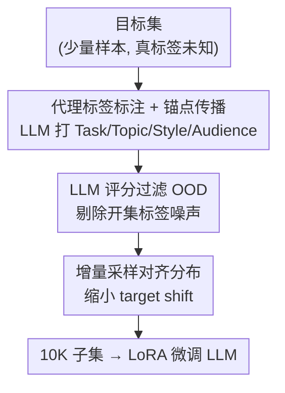

# Task-Aware Data Selection via Proxy-Label Enhanced Distribution Matching for LLM Fine-Tuning

**会议**: ICLR 2026  
**OpenReview**: [https://openreview.net/forum?id=R40WoYbYab](https://openreview.net/forum?id=R40WoYbYab)  
**代码**: https://github.com/tmlr-group/TADS  
**领域**: LLM效率 / 指令微调数据选择  
**关键词**: 任务感知数据选择, 联合分布对齐, 代理标签, 开集标签噪声, 增量采样

## 一句话总结
针对"给定一个小目标集、要从大语料池里挑出最相关指令数据来微调 LLM"这一任务，本文指出现有方法只对齐输入特征 $X$ 是不够的，提出用 LLM 推断**代理标签** $Y$、把问题重构成联合分布 $P(X,Y)$ 对齐，并配一条"标注→聚类传播→LLM 评分过滤→增量采样"的四步流水线 TADS，从 300K 池子里只选 10K 样本微调 LLaMA-3.1-8B，效果即可媲美甚至超过 LESS、TSDS 等 SOTA。

## 研究背景与动机
**领域现状**：把基础模型适配到特定下游任务，标准做法是指令微调，而微调成败高度依赖指令数据的质量与相关性。在"任务相关数据选择"（task-specific data selection）这条线上，给定一个少量的目标（target）集，要从一个大的通用源（source）池里检索出最相关的指令样本。主流方法（LESS、TSDS 等）几乎都只在**输入特征 $X$** 上做文章：用 embedding 相似度或梯度相似度来衡量源样本和目标样本有多像。

**现有痛点**：只看 $X$ 的对齐有内在缺陷。论文给了一个很直观的例子——目标集是法律领域，含"婚姻纠纷"和"建筑合同"；源池里有一条"手机合同（cell phone contract）"的样本，因为和"建筑合同"在"合同"这个概念上语义重叠，embedding 相似度高就被选中；如果用梯度相似度，模型对"contract"这种共享概念赋予高影响力，同样会误选。但这条样本真正的领域标签其实是"电信服务"，和目标的标签分布根本对不上。

**核心矛盾**：输入相似 ≠ 任务相关。两条指令的 $X$ 看着像，但它们对应的标签 $Y$（任务/领域归属）可能毫不相关甚至相互矛盾。只对齐边缘分布 $P(X)$ 会系统性地漏掉这层信息。作者用互信息把这点讲透：$I(T;(X_S,Y_S)) = I(T;X_S) + I(T;Y_S\mid X_S)$，传统方法只最大化第一项，却忽略了"在已知输入后，标签还能额外提供的任务信息"这第二项。

**本文目标与切入角度**：用联合分布 $P(X,Y)$ 替代边缘分布 $P(X)$ 来做对齐。但麻烦在于——目标集和源池里的真标签 $Y$ 都是观测不到的；同时对齐两个随机变量比对齐一个难得多，而且用 LLM 推断出来的代理标签必然带噪声。

**核心 idea**：借 LLM 的推理能力为每条指令推断出**代理标签**（proxy labels），把任务相关数据选择重构成联合分布对齐问题，再用一条专门处理"标签噪声 + 域偏移"的流水线把它落地。

## 方法详解

### 整体框架
TADS 要解决的是：在真标签 $Y$ 不可观测的前提下，让选出的子集 $S$ 的经验分布 $P_S$ 尽量逼近目标的联合分布 $P_{\text{target}}(X,Y)$。整体思路是先"造标签"再"对分布"：用 LLM 给目标集打上结构化代理标签，把这些标签聚类成稳定的语义锚点并传播到源池上，于是源池里每条样本都有了（带噪的）任务标签；接着先把传错标签的样本过滤掉，再按标签分布做增量采样，最终得到一个标签分布与目标对齐的 10K 子集去微调 LLM。

整条流水线是清晰的四步串行，自上而下为：目标集 → 代理标签标注与锚点传播 → LLM 评分过滤 OOD → 增量采样对齐分布 → 微调子集。

### 关键设计

**1. 把任务相关数据选择重构成 $P(X,Y)$ 联合对齐**

这是全文真正的贡献核心，不是某个具体模块，而是问题的重新表述。作者主张：任务相关性由数据和标签的**联合分布**定义，而非仅由输入的边缘分布定义。形式化地，目标集每条样本来自 $P_{\text{target}}(X,Y_t)$，源池由 $K$ 个域并起来 $D=\bigcup_k D_k$、各域服从 $P_k(X,Y_k)$，并假设目标分布的支撑被源分布支撑的并集覆盖；目标是选一个固定大小 $N$ 的子集 $S$ 使 $P_S$ 尽量逼近 $P_{\text{target}}$。从信息论看，只对齐 $X$ 的方法只抓住 $I(T;X_S)$，而联合对齐隐式地最大化完整目标 $I(T;(X_S,Y_S))$，把被忽略的条件项 $I(T;Y_S\mid X_S)$ 也利用起来——这正是它能区分"手机合同 vs 建筑合同"这类输入像、标签不像样本的根本原因。后面三个设计都是为了把这个原则在"真标签不可观测"的现实里落地。

**2. 结构化代理标签标注与锚点传播：把不可观测的 $Y$ 造出来**

既然真标签拿不到，就用 LLM 推断代理标签。作者设计了一个由四个语义字段组成的结构化标签空间——**Task**（核心功能意图，单标签，作为每条样本明确的功能锚）、**Topic**（主题）、**Style**（修辞风格）、**Audience**（目标受众），后三者是多标签以刻画指令的多面性。用一个结构化的摘要模板 prompt 预训练 LLM，给每条指令在这四个字段上打上自由短语标签；之所以用开放式自由短语而非固定 taxonomy，是为了让表示空间连续、便于后续 embedding 匹配。

光有标签还不够，源域的措辞和 LLM 生成的标签之间有语义鸿沟。于是先把每个字段的标签分别用句向量模型编码，对目标侧标签做 **k-means 聚类（$k=100$）**，把大量措辞各异的短语压成一组紧凑的语义中心——这些中心就是**锚点（anchors）**，相当于目标域概念版图的稳定、去噪表示。再把源样本投影到同一向量空间，按余弦相似度给每条源样本分配最相关的锚点（Task 取 top-1，Topic/Style/Audience 各取 top-3）。这是一种"软"的、可解释的测试引导式语义投影，而不是硬标签搬运，从而把目标域特征细粒度地注入源池。注意：后续对齐用的"标签"指的就是这些锚点（簇），不是 LLM 原始生成的短语标签。

**3. LLM 评分过滤开集标签噪声：把传错的样本剔掉**

把目标锚点传播到源域，必然引入**开集标签噪声**——一些和任何目标标签都不相关的指令被强行贴上了某个锚点。学习噪声标签领域常用"记忆效应"来检测：DNN 先学干净模式后记噪声，训练几轮按 loss 排序、高 loss 即噪声。但在这个多字段设定下，给每个字段训练独立 DNN 既贵又不通用，标签空间一变就得重训，扩展性差。

作者改用 LLM 的推理能力直接打分：让 LLM 评估每条样本与其被分配锚点之间的语义契合质量，给出一个分数；低于预设阈值（如 score < 6）的样本被判为分布外（OOD）即开集噪声，从源池移除。阈值是个权衡——阈值过高会把太多干净相关样本也滤掉，过低又放进太多无关样本，这和噪声标签学习里的取舍同构。实验里阈值（min score 取 5/6/7）确实对结果有可见影响。

**4. 增量采样缓解 target shift：让选出子集的标签分布贴近目标**

过滤掉 OOD 后，剩余源数据和目标集之间仍可能有分布偏移；直接随机抽 10K 不够好。作者借域适应理论指出，现实中更关键的是 **target shift（先验概率偏移）**：假设条件分布 $P(X\mid Y)$ 在目标域和清洗后源域上稳定，而标签分布 $P(Y)$ 不同——因此对齐 $P(Y)$ 比对齐协变量更有利于鲁棒性。

采样目标就写成最小化锚点分布的 $L_1$ 差距 $\lVert P^*(Y)-\hat P(Y)\rVert_1$，其中 $P^*(Y)$ 是目标集的经验锚点分布、$\hat P(Y)$ 是已选源子集的经验锚点分布。具体用一个贪心**增量采样**（Algorithm 1）：每一步算各标签的差距 $g(y)=P^*(y)-\hat P(y)$，挑出差距最大且还有未用候选的标签 $y^*$，从带该标签的候选里选一条加入 $S$ 并更新 $\hat P(Y)$，直到预算 $N$ 用完或无可用候选。该算法对每个字段（Task / Topic / …）独立运行，因为每条样本在每字段含固定数量标签，加入一条会同时更新它携带的所有标签计数，在密集语义字段里产生天然的平衡效应、加速 $\hat P(Y)$ 收敛到 $P^*(Y)$。一个好处是灵活：对齐按字段进行，可根据下游需求选择按 Task、Topic 还是别的字段对齐。

### 损失函数 / 训练策略
没有新的训练损失——TADS 是数据选择流水线，最终用选出的 10K 子集对 LLaMA-3.1-8B 做标准 LoRA 指令微调。流水线内部用三个现成模型分工：Qwen2.5-7B-Instruct 负责标注与打分，BGE-M3 负责 embedding 与聚类，LLaMA-3.1-8B 作被微调的目标模型。

## 实验关键数据

数据池由 5 个常用指令微调数据集合成共 300K（Flan V2 100K、Open-Assistant 1 33K、WizardLM 100K、Dolly 15K、Stanford Alpaca 52K）；在 MMLU / TruthfulQA / GSM8K / BBH / TyDiQA 五个基准上评测，每个基准抽 20% 测试集合并成目标集来引导选择，其余 80% 用于最终评测。除 Full(300K) 与 Vanilla 外，所有选择方法都只选 10K。

### 主实验

| 方法 | MMLU | TruthfulQA | GSM | BBH | TyDiQA |
|------|------|------------|-----|-----|--------|
| Vanilla Base Model | 64.3 | 32.8 | 51.0 | 54.8 | 22.7 |
| Full (300K) | 63.6 | 44.1 | 49.0 | 57.9 | **66.4** |
| Random | 63.7 | 29.1 | 54.0 | 60.2 | 60.5 |
| BM25 | 63.2 | 25.2 | 51.3 | 58.8 | 62.0 |
| RDS+ | 63.8 | 3.6 | 53.8 | 59.4 | 60.3 |
| LESS | 63.3 | 35.1 | 56.1 | 61.1 | 64.0 |
| TSDS | 63.6 | 44.1 | 50.0 | **62.1** | 63.5 |
| **Align_topic (本文)** | **64.5** | 46.9 | 57.0 | 60.2 | 58.6 |
| **Align_style (本文)** | 64.2 | **47.2** | **57.8** | 58.9 | 59.3 |
| **Align_task (本文)** | 64.4 | 46.5 | 57.5 | 58.9 | 59.3 |

（min score ≥7。）本文四种字段对齐在 MMLU、TruthfulQA、GSM 上全面领先 LESS/TSDS，BBH 接近 TSDS；唯独在 TyDiQA 上明显落后——作者归因于 TyDiQA 是多语言数据集，设计的四个英文语义字段没能很好捕捉其特性，导致相关源样本大多被滤掉。即便把选择规模压到 1K/5K（Table 4），Align_style 仍稳定优于同规模 Random，说明在极小预算下也有效。

### 消融实验

| 配置 | MMLU | TruthfulQA | GSM | BBH | TyDiQA |
|------|------|-----------|-----|-----|--------|
| 仅增量采样（无 OOD 过滤） | 64.3 | 3.5 | 55.0 | 49.1 | 60.5 |
| 仅 OOD 过滤 + 随机采样 | 64.8 | 42.1 | 55.0 | 61.9 | 56.4 |
| 完整方法（过滤+增量采样） | **65.1** | **42.6** | **55.5** | **62.5** | 59.1 |

| 设计对照（验证联合对齐必要性） | MMLU | TruthfulQA | GSM | BBH | TyDiQA |
|------|------|-----------|-----|-----|--------|
| RDS+ | 63.6 | 3.5 | 54.0 | 59.1 | 60.2 |
| RDS+（直接灌入语义标签信息） | 63.7 | 5.4 | 53.5 | 60.7 | 59.7 |
| 本文流水线直接作用于 $X$（去掉标注） | 63.4 | 40.8 | 54.0 | 59.9 | 58.2 |
| 用相似度过滤替换 LLM 过滤 | 63.0 | 28.3 | 51.0 | 57.4 | 61.6 |
| 本文完整流水线（align topic, min score 7） | **64.6** | **46.4** | **57.0** | 60.0 | 59.3 |

### 关键发现
- **两个模块缺一不可**：只做增量采样不过滤，TruthfulQA 崩到 3.5（噪声样本毒化）；只过滤+随机采样，BBH 仅 61.9；两者合起来才在多数基准取得最佳。其中 OOD 过滤对 TruthfulQA 这类对噪声敏感的任务贡献巨大。
- **收益来自联合对齐而非聚类采样本身**：把同一套聚类+采样流水线直接作用于 $X$（去掉 LLM 标注），TruthfulQA 从 46.4 掉到 40.8、其余也普遍下降，证明增益确实源于 $P(X,Y)$ 联合对齐；而单纯把语义标签灌进 RDS+ 几乎没改善，说明必须配合显式分布对齐才能用好标签信息。
- **LLM 过滤优于相似度过滤**：用 cosine 相似度替换 LLM 打分做 OOD 过滤后全面掉点（如 TruthfulQA 46.4→28.3），说明 LLM 的语义判断更可靠。
- **超参稳健**：聚类数 $k$ 在 50–150 之间结果稳定，$k$ 太小（如 20）会让 TruthfulQA 方差变大，最终固定 $k=100$。

## 亮点与洞察
- **用互信息分解给"为什么要看标签"一个干净的理论说法**：$I(T;(X_S,Y_S))=I(T;X_S)+I(T;Y_S\mid X_S)$，一眼点明传统方法漏掉了第二项，这种"先讲清楚漏了什么、再补上"的叙事比单纯报点更有说服力。
- **代理标签是把"不可观测的 $Y$"变可用的关键 trick**：用 LLM 造结构化标签、再聚类成锚点去噪，本质是把"标签不可得"这个硬约束转化成"带噪标签 + 噪声鲁棒处理"这个有成熟工具的问题，从而能借域适应和噪声标签学习两套理论。
- **把数据选择问题嫁接到 target shift**：明确假设 $P(X\mid Y)$ 稳定、只 $P(Y)$ 变，于是采样目标简化为对齐锚点分布的 $L_1$ 差距，配一个贪心增量算法即可，简单可解释、且按字段独立可灵活切换对齐维度——这种"选哪个字段对齐由下游决定"的设计很实用。

## 局限与展望
- **多语言/特殊任务上的字段失效**：作者自己承认在 TyDiQA 上明显落后，根因是四个通用语义字段对多语言特性刻画不足、相关样本被误滤。对这类任务需要定制更贴切的标签域。
- **强依赖 LLM 标注与打分的质量**：整条流水线的标签和过滤都建立在 Qwen2.5-7B 的输出上，标注或评分偏差会直接传导到选择结果；阈值（min score）也需按任务调，过高过低都伤性能，缺少自适应机制。
- **target shift 假设可能不成立**：方法假定 $P(X\mid Y)$ 在源、目标域间稳定，但现实中条件分布也可能偏移，此时只对齐 $P(Y)$ 未必充分。
- **评测目标集来自基准测试集本身**：用各基准 20% 测试集合成目标集来引导选择，虽与 80% 评测集不重叠，但目标集与评测同源，可能高估了在"目标信息更稀缺"真实场景下的表现。

## 相关工作与启发
- **vs LESS / TSDS**：两者都只对齐边缘输入分布——LESS 用梯度相似度估计样本影响，TSDS 把选择形式化为带多样性正则的最优传输。本文直指它们的共性缺陷：不看目标标签，无法验证候选输出和目标输出在语义上是否一致；本文用代理标签把对齐升级到联合分布 $P(X,Y)$，在多数基准上反超。
- **vs InsTag**：InsTag 同样用 LLM 生成伪标签并按 tag 统计做选择，但它是**任务无关**的，不与任何目标任务分布对齐；本文显式引入任务感知的分布对齐，更完整。
- **vs 域适应 / 噪声标签学习**：本文把"代理标签传播引入噪声"对应到噪声标签学习、把"清洗后仍存域偏移"对应到域适应，分别用 LLM 评分过滤和 target-shift 增量采样应对，相当于把两套经典理论迁移进 LLM 数据选择，这条嫁接思路本身可复用到其他"标签弱可得"的选择场景。

## 评分
- 新颖性: ⭐⭐⭐⭐ 把任务相关数据选择从 $P(X)$ 重构成 $P(X,Y)$ 联合对齐，并用代理标签落地，框架层面的重新定义有分量。
- 实验充分度: ⭐⭐⭐⭐ 五基准 + 多规模 + 双消融（模块贡献 + 联合对齐必要性）较扎实，但目标集与评测同源、TyDiQA 失效暴露泛化边界。
- 写作质量: ⭐⭐⭐⭐ 动机用具体例子和互信息讲得很清楚，流水线四步条理分明。
- 价值: ⭐⭐⭐⭐ 只选 10K/300K 即媲美 SOTA，思路（造代理标签 + 噪声鲁棒 + 分布对齐）实用且可迁移。

<!-- RELATED:START -->

## 相关论文

- [\[ICLR 2026\] ssToken: Self-modulated and Semantic-aware Token Selection for LLM Fine-tuning](sstoken_self-modulated_and_semantic-aware_token_selection_for_llm_fine-tuning.md)
- [\[ICLR 2026\] Token-level Data Selection for Safe LLM Fine-tuning](token-level_data_selection_for_safe_llm_fine-tuning.md)
- [\[ICLR 2026\] Train on Validation (ToV): Fast Data Selection with Applications to Fine-Tuning](train_on_validation_tov_fast_data_selection_with_applications_to_fine-tuning.md)
- [\[ACL 2025\] Data Whisperer: Efficient Data Selection for Task-Specific LLM Fine-Tuning via Few-Shot In-Context Learning](../../ACL2025/llm_pretraining/data_whisperer_data_selection.md)
- [\[ICLR 2026\] Pre-training LLM without Learning Rate Decay Enhances Supervised Fine-Tuning](pre-training_llm_without_learning_rate_decay_enhances_supervised_fine-tuning.md)

<!-- RELATED:END -->
