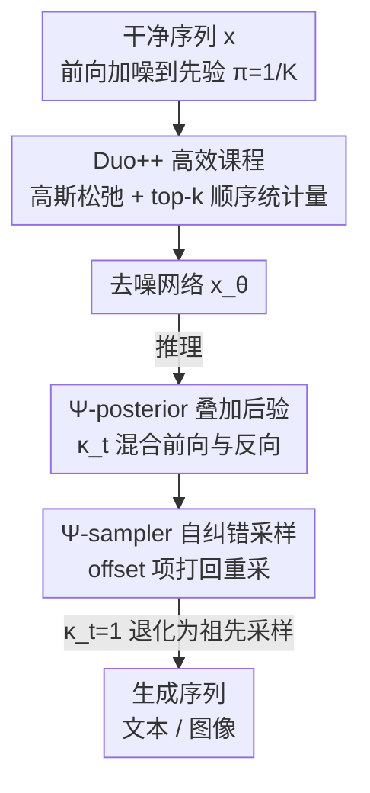

# The Diffusion Duality, Chapter II: Ψ-Samplers

**会议**: ICLR 2026  
**OpenReview**: [https://openreview.net/forum?id=RSIoYWIzaP](https://openreview.net/forum?id=RSIoYWIzaP)  
**代码**: https://s-sahoo.com/duo-ch2 (有)  
**领域**: 扩散模型 / 离散扩散语言模型  
**关键词**: 离散扩散, 均匀态扩散, 预测-纠正采样, 课程学习, 语言建模

## 一句话总结
针对均匀态离散扩散（USDM）在大采样步数下质量不升反而饱和的问题，本文提出一族「叠加后验」Ψ-posterior 及其 Ψ-sampler（预测-纠正采样器），把 ReMDM 等纠正方法推广到任意噪声先验，让 USDM 的文本/图像生成质量随采样步数持续改善；同时给出一套用 top-k 顺序统计量近似 softmax 的高效课程，把训练显存降 33%、时间降 25%。

## 研究背景与动机

**领域现状**：离散扩散语言模型主要用两类噪声先验。一类是**掩码扩散（MDM）**，把所有概率质量压在一个特殊 `[MASK]` token 上，每个 token 在生成中只被解码一次；另一类是**均匀态扩散（USDM）**，先验是均匀分布 $\pi=1/K$，token 在生成过程中可以被反复改写。后者的「可改写」特性带来**自纠错**能力，因此在少步数生成与可控引导（guidance）场景下表现突出。

**现有痛点**：USDM 虽然在少步数下占优，但用标准的**祖先采样器（ancestral sampler）**时，随着采样步数（NFE）增加，生成质量会**早早饱和**，反而被掩码扩散 + 重掩码采样器（如 ReMDM）在高步数区间反超；此外 USDM 的似然（likelihood）也一直弱于 MDM，Duo 提出的高斯松弛课程虽能缩小似然差距，却**计算极其昂贵**——它需要为每个 token 在每一步都物化一个 $K$ 维权重向量，对 $K>10^5$ 的现代词表不可行。

**核心矛盾**：MDM 之所以能随步数持续改善，靠的是 ReMDM 这类**预测-纠正（Predictor-Corrector, PC）**采样器——它允许把已经解码的 token「重掩码」回去重新修正。但针对 USDM 的 PC 采样器一直没人做好：基于连续时间马尔可夫链（CTMC）速率矩阵的 PC 方法已知比祖先采样器还差。于是 USDM「能自纠错」的潜力在高步数下没被释放出来。

**本文目标**：(1) 给任意噪声先验（不只 MDM）设计一个统一的 PC 采样框架，让 USDM 也能随步数持续提升；(2) 把昂贵的高斯松弛课程改造成显存/时间可承受的版本。

**切入角度**：作者观察到，能给出和标准离散扩散**相同边缘分布**的联合分布并不唯一。如果构造一族「非马尔可夫」的后验，让它在保持边缘分布不变的前提下额外注入噪声，就能在反向生成时把错误 token「打回去」重采，从而实现纠错。

**核心 idea**：用「前向过程 + 反向后验」的**线性叠加**构造 Ψ-posterior（叠加后验），由它导出的 Ψ-sampler 把 ReMDM 等 PC 方法收纳为特例并推广到任意先验 $\pi$；配合用顺序统计量只采样 top-k 项的高效课程，得到 **Duo++**。

## 方法详解

### 整体框架

Duo++ 由两条线组成：**训练侧**用一套高效的高斯松弛课程把去噪网络 $x_\theta$ 训出来；**推理侧**用 Ψ-sampler 做预测-纠正采样把样本生成出来。两条线共享同一套「离散扩散 ↔ 高斯扩散对偶」的底座（Chapter I 的 Diffusion Duality）。

前向过程把干净序列逐步加噪到先验：$z_t^\ell \sim q_t(\cdot|x^\ell;\alpha_t)=\mathrm{Cat}(\cdot;\alpha_t x^\ell+(1-\alpha_t)\pi)$，USDM 取 $\pi=1/K$。训练时不再从「完全损坏的离散 token」去噪，而是把高斯隐变量经低温 softmax 松弛成「干净+噪声的叠加嵌入」喂给 Transformer，降低去噪难度——这正是 Duo 的课程，但本文用 top-k 顺序统计量把它做到了不物化 $K$ 维向量。推理时，标准祖先采样器只会沿反向后验 $q_{s|t}$ 走，错误一旦写下就难以回收；Ψ-sampler 在每步用系数 $\kappa_t$ 把反向后验（预测）和一份注噪项（纠正）混合，$\kappa_t<1$ 时给每个 token 留下「被改写」的概率，从而持续纠错。

### 关键设计

**1. Ψ-posterior：用前向与反向的非马尔可夫叠加，保边缘分布地腾出纠错空间**

USDM 用祖先采样在高步数下饱和，根本原因是反向后验 $q_{s|t}$ 是马尔可夫的、一步步「越走越确定」，没有把已写错的 token 拉回来的机制。本文构造一族叠加后验，把反向后验和一份「重新加噪」的前向项按系数 $\kappa_t\in[0,1]$ 线性混合：

$$\Psi_{s|t}(\cdot|x^\ell,z_t^\ell)=\kappa_t\, q_{s|t}(\cdot|z_t^\ell,x^\ell)+(1-\kappa_t)\, q_s(\cdot|x^\ell),\qquad \Psi_1(\cdot|x^\ell)=\mathrm{Cat}(\cdot;\pi).$$

关键性质是：尽管这条轨迹**整体上不再是马尔可夫过程**（$z_t^\ell$ 同时依赖 $z_s^\ell$ 和 $x^\ell$），它的每一时刻**边缘分布仍与标准离散扩散 (1) 完全一致**，因此采样足够多时收敛到正确分布。$q_{s|t}$ 扮演「预测」，重新注入的 $q_s$ 扮演「纠正」，这与高斯扩散里 Song et al. 的 PC 采样器思路同构——纠正步注入额外噪声。这套构造对 MDM（$\pi=m$）和 USDM（$\pi=1/K$）都成立，是把 PC 从掩码扩散推广到任意先验的数学根基。

**2. Ψ-sampler：用 offset 项让每个 token 都有被改写的机会，实现真正的自纠错**

把去噪网络 $x_\theta$ 代入叠加后验，得到可直接用于采样的 Ψ-sampler：

$$[\Psi^\theta_{s|t}(\cdot|z_t)]^\ell=\kappa_t\, q_{s|t}(\cdot|z_t^\ell,x_\theta^\ell)+(1-\kappa_t)\big[\alpha_s\, q_{0|t}(\cdot|z_t^\ell,x_\theta^\ell)+(1-\alpha_s)\pi\big].$$

当 $\kappa_t=1$ 时它恰好退回 MDM 的式 (2) 或 USDM 的式 (3) 标准祖先采样器，所以 Ψ-sampler 是祖先采样的**严格超集**；而当 $\kappa_t<1$，多出来的 **offset 项 $(1-\kappa_t)(1-\alpha_s)\pi$** 就是纠错的发动机。对 MDM，这一项让已经解码的 token 有概率回到 `[MASK]` 状态被重写（祖先采样禁止重掩码）；对 USDM，它保证每个 token 都有非零采样概率——哪怕去噪器对正确 token 给了近乎 0 的概率，Ψ-sampler 也给它一次出现的机会，而祖先采样会直接把它判死。偶尔引入的错误会被「边缘分布不变」这条性质在多步中抹平。论文进一步证明：对 $\pi=m$，不同的 $\{\kappa_t\}$ 选择能精确复现 Campbell、Gat、ReMDM 等已有 PC 公式，即 Ψ 框架把它们都收纳为特例。实践中推荐 ReMDM 等价的 rescale 调度、$\eta=0.05$、nucleus $p=0.9$。

**3. Duo++ 高效课程：用顺序统计量只采 top-k 项，把 $K$ 维 softmax 课程做到不物化**

Duo 的高斯松弛课程要把高斯隐变量过一遍低温 softmax（$\tau=10^{-3}$）再和整张 $K\times d$ 嵌入表做加权和，等于每个 token 每步都要物化一个 $K$ 维权重向量，$K>10^5$ 时根本扛不住。作者的关键观察是：$\tau$ 极低时 softmax 几乎把全部质量压在**极少数**坐标上，绝大多数权重可忽略。于是只保留 top-k（$k\ll K$）项做近似。难点在于「不构造完整 $K$ 维向量就采到 top-k」：注意 $w_t^\ell=\tilde\alpha_t x^\ell+\tilde\sigma_t\epsilon$，只有真值坐标 $o$ 的均值被平移，其余 $K-1$ 个坐标是 i.i.d. 零均值高斯，可交换。利用**均匀随机变量顺序统计量可递归采样**（最大值 CDF 为 $u^m$，条件下次大值同理）的事实，再过逆正态 CDF $\Phi^{-1}(\cdot)\tilde\sigma_t$，就能只采 $O(k)$ 个随机数得到 top-k 的取值与下标，并按真值坐标 $o$ 是否进 top-k 分两种情形插入。softmax 加权嵌入近似为

$$\mathrm{softmax}(w_t^\ell)^\top\mathbf{emb}\approx\sum_{i=1}^{k}\frac{\exp(\mathcal{K}_i/\tau)}{\tilde Z}\,\mathbf{emb}[\mathcal{I}_i],$$

归一化项 $\tilde Z$ 含未采样项的闭式近似（式 14），把「top-k 项 + 干净 token 项 + 未采样零均值项」三部分加起来。此外 diffusion transformation operator $T(\cdot)$ 不再预存缓存大量 $(\alpha_t,T(\tilde\alpha_t))$ 对，而是用泰勒展开在线计算。最终在保持 top-k 与完整分布同分布的前提下，把课程阶段显存降 33%、速度翻倍。

### 损失函数 / 训练策略
课程阶段优化高斯松弛 NELBO：$L_{\text{train}}=\mathbb{E}_{x,t\sim U[\beta,\gamma],\tilde q_t}\sum_\ell f\big(z_t^\ell:=\arg\max(w_t^\ell),\,x_\theta^\ell(\mathrm{softmax}(w_t/\tau),t),\,\alpha_t:=T(\tilde\alpha_t);x^\ell\big)$，当 $\tau\to0$、$(\beta,\gamma)=(0,1)$ 时它退回标准离散 NELBO。实现上前 50% 训练步用课程（$\tau=10^{-3}$、$(\beta,\gamma)=(0.03,0.15)$），后半段切回普通离散目标；OWT/LM1B 各训 1M 步、batch 512、16×H100、bfloat16。

## 实验关键数据

### 主实验

语言建模在 OpenWebText（上下文 1024）上比生成困惑度（Gen. PPL，GPT-2 Large 度量）随 NFE 的变化：Duo++ + Ψ-sampler 在整个 NFE 区间都优于 MDLM+ReMDM 与祖先采样；当 NFE 超过序列长度后，Ψ-sampler 与 ReMDM 持续改善而祖先采样饱和。似然层面（测试集 PPL，越低越好）：

| 模型 | LM1B | OWT | 备注 |
|------|------|-----|------|
| AR Transformer | 22.3 | 17.5 | 自回归上界 |
| MDLM（掩码扩散） | 27.0 | 23.2 | — |
| SEDD Uniform（USDM） | 40.3 | 29.7 | 旧均匀态 |
| Duo（昂贵课程） | 29.9 | 25.2 | USDM SOTA |
| **Duo++ (k=2)** | **30.0** | **25.2** | 课程省 25% GPU 时 |
| Duo++ (k=3) | 30.1 | 25.3 | — |
| Duo++ (k=5) | 30.2 | 25.4 | — |

图像建模在 CIFAR-10（35M U-Net + 离散 CFG）上：Duo++ + Ψ-sampler 的 FID/IS 全面优于 MDLM（含 ReMDM）与祖先采样，整体取得最佳分数；推荐 cosine 调度 + $\kappa_t=0.95$、$t_{on}\in\{0.5,0.6\}$、$t_{off}=0.1$。

### 消融实验

| 配置 | 关键指标 | 说明 |
|------|---------|------|
| Duo++ + Ψ-sampler（rescale, η=0.05, p=0.9） | 最佳 Gen. PPL | 文本默认配置 |
| 祖先采样（κ_t=1） | 高 NFE 饱和 | 不纠错，质量到顶不再升 |
| 课程 k=2 / 3 / 5 | PPL 与显存/吞吐基本不变 | k=2 似然最好且最省 |
| 高效课程 vs Duo 课程 | 显存 −33%、时间 −25%、课程段 2× 提速 | 138M 规模端到端 |
| 下游 MCQ（Arc-e/c, HSwag, WinoG, PIQA, OQA） | Duo++ ≈ Duo，4/6 任务略升 | 但仍逊于 MDLM |

### 关键发现
- **纠错是高步数不饱和的关键**：去掉 offset 项（$\kappa_t=1$ 退回祖先采样）后，文本 Gen. PPL 随 NFE 早早饱和；只有 $\kappa_t<1$ 注噪纠错才能让质量随步数持续走低，在高 NFE 区间追平甚至反超掩码扩散。
- **k 很小就够**：课程里 $k=2$ 的似然最好、$k\in\{2,3,5\}$ 表现相近，说明低温 softmax 的稀疏性极强，只保留 2 个坐标就能逼近完整 $K$ 维加权，显存/吞吐在整段训练中稳定。
- **USDM 的短板仍在似然/下游**：Duo++ 在 MCQ 上匹配 Duo 但普遍低于 MDLM，与其更高的困惑度一致——本文修的是采样质量与训练成本，没有抹平 USDM 与 MDM 的建模容量差。

## 亮点与洞察
- **「保边缘分布」是整套方法的安全绳**：Ψ-posterior 大胆地把过程改成非马尔可夫、还注入额外噪声，之所以不偏离目标分布，全靠每步边缘分布与标准扩散对齐这条不变量——这让「激进纠错」与「分布正确」可以兼得。
- **一个 $\kappa_t$ 统一了一整片采样器**：$\kappa_t=1$ 是祖先采样，特定 $\{\kappa_t\}$ 复现 ReMDM/Campbell/Gat，连续调 $\kappa_t$ 又给出全新 USDM 采样器——把一族离散扩散采样器收进同一个标量旋钮，理论很干净。
- **顺序统计量是把昂贵课程救活的巧 trick**：「低温 softmax 几乎稀疏 → 只采 top-k → 用顺序统计量免物化 $K$ 维向量」这条链可迁移到任何需要对超大词表做低温加权嵌入的场景（如某些 Gumbel/松弛训练）。
- 训练免缓存：把 $T(\cdot)$ 从「预存大量 $(\alpha,T)$ 对」改成泰勒在线计算，工程上去掉了一个笨重的缓存依赖。

## 局限与展望
- **建模容量差未消除**：USDM（含 Duo++）的似然与下游 QA 仍逊于掩码扩散，本文只改善了采样与训练成本，没改 USDM 本身的容量上限。
- **超参偏多**：$\kappa_t$ 的调度类型（cap/rescale/loop）、步长 $\eta$、激活区间 $[t_{off},t_{on}]$、nucleus $p$、$k$ 等都需调，论文给了推荐值但跨数据集迁移性未充分验证。
- **规模有限**：语言实验主要在 1M 步、OWT/LM1B 这类中等规模；图像仅 CIFAR-10。作者引用并发工作称 Duo 在 1.7B 规模能超 AR，但本文自身未在大模型上验证 Ψ-sampler。
- **只用一阶信息**：Ψ-sampler 用一阶后验、均匀步长；与高阶采样器、自适应步长（Park、Ren 等）是互补而非整合，未来可叠加。

## 相关工作与启发
- **vs ReMDM（Wang et al. 2025）**：ReMDM 把 PC 采样从 CTMC 公式推广到掩码扩散并显著改善其推理时缩放，但只针对 $\pi=m$。本文证明 ReMDM 是 Ψ 框架在特定 $\{\kappa_t\}$ 下的特例，并把它推广到**任意先验**，从而首次让 USDM 也享受 PC 纠错。
- **vs Duo / Chapter I（Sahoo et al. 2025a）**：Chapter I 建立离散↔高斯扩散对偶并提出高斯松弛课程，但课程昂贵、采样仍用饱和的祖先采样。本文（Chapter II）一方面用 Ψ-sampler 解决采样饱和，一方面用 top-k 顺序统计量把课程提速 2×、省显存 33%。
- **vs CTMC PC 方法（Campbell 2022 / Gat 2024）**：它们依赖速率变化矩阵，实测比祖先采样还差；Ψ 框架把它们统一为特例并给出更强、更通用的采样器。
- **vs 训练额外纠正模块（Lezama 2023 / Zhao 2025 等）**：那些方法要额外训练一个 corrector，本文**不引入任何新的可学习组件**，纠错完全由采样公式实现。

## 评分
- 新颖性: ⭐⭐⭐⭐⭐ 用叠加后验把离散扩散 PC 采样统一到任意先验，理论简洁且收纳已有方法为特例
- 实验充分度: ⭐⭐⭐⭐ 文本+图像双模态、似然/生成质量/效率/下游多角度，但规模偏中等、未上大模型
- 写作质量: ⭐⭐⭐⭐ 公式与直觉解释配合清楚，takeaway 提炼到位；符号略密集
- 价值: ⭐⭐⭐⭐⭐ 让 USDM 随步数持续提升并追平掩码扩散，挑战「掩码扩散是扩散语言模型唯一未来」的成见

<!-- RELATED:START -->

## 相关论文

- [\[ICLR 2026\] Soft-Masked Diffusion Language Models](soft-masked_diffusion_language_models.md)
- [\[ICLR 2026\] Autoregressive Models Rival Diffusion Models at Any-Order Generation](autoregressive_models_rival_diffusion_models_at_any-order_generation.md)
- [\[ICLR 2026\] Time is a Feature: Exploiting Temporal Dynamics in Diffusion Language Models](time_is_a_feature_exploiting_temporal_dynamics_in_diffusion_language_models.md)
- [\[NeurIPS 2025\] Next Semantic Scale Prediction via Hierarchical Diffusion Language Models](../../NeurIPS2025/llm_pretraining/next_semantic_scale_prediction_via_hierarchical_diffusion_language_models.md)
- [\[NeurIPS 2025\] A Practical Guide for Incorporating Symmetry in Diffusion Policy](../../NeurIPS2025/llm_pretraining/a_practical_guide_for_incorporating_symmetry_in_diffusion_policy.md)

<!-- RELATED:END -->
