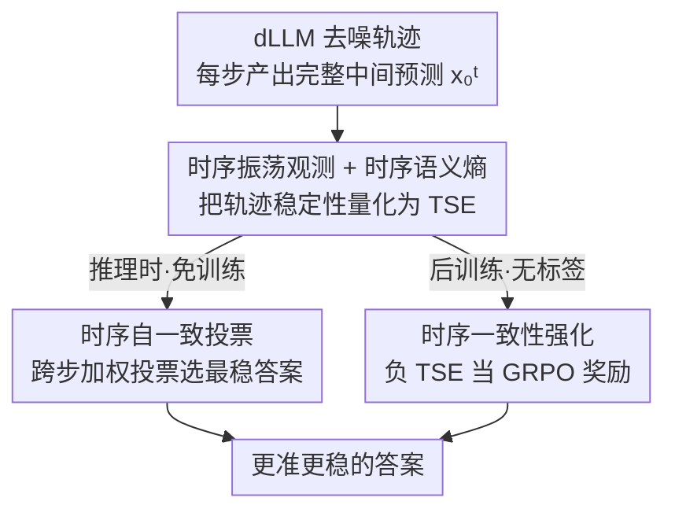

# Time is a Feature: Exploiting Temporal Dynamics in Diffusion Language Models

**会议**: ICLR 2026  
**OpenReview**: [https://openreview.net/forum?id=HsB6CtagP7](https://openreview.net/forum?id=HsB6CtagP7)  
**项目页**: https://aim-uofa.github.io/dLLM-MidTruth  
**代码**: 论文承诺接收后开源（模型 + 训练/推理代码）  
**领域**: 扩散语言模型 / LLM推理  
**关键词**: 扩散语言模型, 时序振荡, 时序语义熵, 自一致投票, 强化学习

## 一句话总结
作者发现扩散语言模型（dLLM）在去噪过程中常常"中途答对、最后又改错"（时序振荡），于是把被丢弃的中间步预测当成信号来用：一个免训练的**时序自一致投票**在单条采样轨迹内跨步投票选出最稳定答案，一个**时序一致性强化**用"负时序语义熵"作无标签奖励做 GRPO 后训练，二者在四个数学推理基准上分别带来约 1.5% 与最高 25.3% 的提升。

## 研究背景与动机

**领域现状**：扩散语言模型（如 LLaDA、Dream）是自回归 LLM 的新兴替代品，它不按从左到右逐 token 生成，而是从全 mask 序列出发反复"去噪—重新 mask"，每一步并行预测所有被 mask 的位置，只保留少数高置信 token，其余打回下一轮再精修。然而尽管架构和自回归差异巨大，现有 dLLM 的解码策略却照搬了自回归的习惯：**只取最后一步去噪的预测当作最终答案，把中间所有步的预测全部丢掉**。

**现有痛点**：作者实测发现这是个严重浪费。他们在 GSM8K、MATH500、SVAMP、Countdown 四个基准、两个代表模型（LLaDA-8B-Instruct 与 LLaDA-1.5）上对比了两个指标——"最终通过率"（final pass rate，只看最后一步对不对）和"曾经通过率"（ever-pass rate，整条轨迹任意一步答对就算）。两者之间存在稳定且显著的差距：例如 GSM8K 长度 128 上，LLaDA-8B 的最终通过率 68.5%，但曾经通过率高达 80.5%，差了 12 个百分点。也就是说很多题目**模型中途已经算对了，却在后续精修中又被改成错的**。一个具体例子里，模型在第 55 步给出正确答案 25，到第 64 步反而被替换成错误的 2。

**核心矛盾**：作者把这个现象命名为**时序振荡（temporal oscillation）**——答案在去噪过程中在"对"与"错"之间来回摆动，最终落点未必是最好的那个。根因是迭代去噪本身不稳定：早期高噪声下单步预测本就不准，而现有解码只信任最后一步，等于把整条轨迹里蕴含的"时序动态"信息白白扔掉。

**本文目标**：把时序振荡从"麻烦"重新理解为"特征"，从两条互补路径榨取轨迹里的信号——(1) 推理时不改模型，怎么从已有中间预测里挑出更稳的答案；(2) 训练时怎么显式鼓励模型生成时序上更一致、更不容易反悔的答案。

**切入角度**：作者从熵的视角刻画稳定性，提出**时序语义熵（TSE）**：把一条轨迹上的中间答案按语义等价聚成若干簇，统计这些簇分布的熵。统计上，最终答对的题 TSE 更低（语义更收敛），答错的题 TSE 更高（来回改）。这给了一个不需要真值标签、就能判断生成质量好坏的内生信号。

**核心 idea**：把"中间预测不是噪声而是信号"贯彻到底——用跨时间步的一致性，既做免训练的投票解码，又做无监督的 RL 奖励。

## 方法详解

### 整体框架

整篇工作建立在同一个观察—度量—利用的链条上：先在 dLLM 的去噪轨迹 $\{x_0^t\}_{t=1}^{T}$ 上发现时序振荡（中间对、最后错），再用时序语义熵 TSE 把"答案在轨迹上稳不稳"量化成一个数，然后分两条腿利用这个信号。两条腿共享同一条采样轨迹的中间预测，但作用在不同阶段：一条是**推理时**的时序自一致投票（免训练，跨步加权投票），另一条是**后训练**的时序一致性强化（用负 TSE 当奖励做 GRPO）。

### 关键设计

**1. 时序语义熵 TSE：把"答案在轨迹上稳不稳"变成一个可优化的数**

这是全文的地基。痛点在于 token 级熵只能反映局部不确定性，无法衡量"整条去噪轨迹里答案在语义层面有没有反复横跳"。作者借鉴语义熵的思路，把一条轨迹的 $T$ 个中间答案 $\{x_0^t\}_{t=1}^{T}$ 按语义等价聚成 $K$ 个簇 $\mathcal{C}=\{C_1,\dots,C_K\}$，每个簇的概率质量定义为出现频率 $P(C_k)=|C_k|/T$，于是这条轨迹的时序语义熵为

$$\text{TSE}(\{x_0^t\}_{t=1}^{T}) = -\sum_{k=1}^{K} P(C_k)\log P(C_k).$$

TSE 越高说明轨迹上答案换得越频繁、语义越发散；越低说明逐渐收敛到一个稳定含义。作者通过实验确立了它的价值：统计上最终答对的题（包括"最终对"和"中途对"两类）TSE 普遍低于一直答错的题，难基准（Countdown、MATH）整体 TSE 高于易基准（GSM8K、SVAMP）。这条"低 TSE ≈ 更可能对"的统计规律，正是后面两个方法能不依赖真值标签就工作的依据。

**2. 时序自一致投票：在单条轨迹内跨步投票，几乎零成本捞回被改错的答案**

针对"只信最后一步会丢掉更好答案"的痛点，作者不改模型、不重采样，而是把同一条采样轨迹上所有时间步的预测拿来加权投票。给定轨迹 $\{x_0^t\}_{t=1}^{T}$，最终答案按

$$a^{*} = \arg\max_{a}\ \sum_{t=1}^{T} f(t)\cdot \mathbf{1}\big(\text{meaning}(x_0^t)=a\big)$$

选出，其中 $\mathbf{1}(\cdot)$ 判断第 $t$ 步是否解码出答案 $a$，$f(t)$ 是时间步权重。由于准确率总体随采样推进而升高，作者让权重偏向更靠后的采样步，默认采用指数加权 $f(t)=\exp(\alpha(1-t/T))$（$\alpha=5$），并对比了等权（fixed）、线性、指数三种方案。它和自回归里的 Self-Consistency 形似神不同：经典自一致要采样多条完整推理链、做多次前向，开销高；而本方法**借扩散推理天然产出的一串中间预测，单条轨迹就够投票，不需要任何额外的模型前向**，因此几乎零额外开销、可直接插进现有框架。实现上以每步 remask 前那条"完整解码序列"作为中间输出（保证每步都是语法完整的候选），靠解析 `<answer>...</answer>` 抽取答案，没有合法答案的步直接跳过。

**3. 时序一致性强化：把负 TSE 当无标签奖励，用 GRPO 把"稳定"训进模型**

投票只在推理时补救，作者进一步想让模型从根上少反悔。他们用 GRPO 做后训练，关键是奖励设计。**无标签版**：对每个问题采一组 $G$ 个回答，每个回答的奖励直接取 $r_i=-\text{TSE}(o_i)$，优势按组内均值归一 $A_i = r_i-\text{mean}(\{r_j\}_{j=1}^{G})$，token 级概率沿用 diffu-GRPO 的"多次随机 mask 提示再平均"估计。负 TSE 越大（即 TSE 越小、轨迹越一致）奖励越高——这套**完全不需要真值答案**，是本文区别于 diffu-GRPO 等依赖标签方法的核心，特别适合无监督场景。**有标签版**：当训练能拿到真值时，把准确率奖励和一致性奖励融合，先把 TSE 归一成置信分 $c(o_i)=\frac{H_{\max}-\text{TSE}(o_i)}{H_{\max}}$（$H_{\max}=\log T$，使 $c\in[0,1]$），再过球面打分规则得到最终奖励

$$r_i = \mathbf{1}_{o_i=o^{*}} + \frac{c(o_i)}{\sqrt{c(o_i)^2+(1-c(o_i))^2}}.$$

第一项管对错、第二项管稳定，使奖励既看答案正确性、又看生成过程稳不稳。实验显示组合奖励比单用准确率奖励（d1）更强，尤其在难基准上提升巨大。

### 损失函数 / 训练策略
强化学习目标采用标准 GRPO（带重要性采样比 $\rho_i^k$、clip 阈值 $\varepsilon$、对参考策略的 KL 惩罚 $\beta$），奖励替换为上面的负 TSE / 组合奖励。训练流程上，LLaDA-8B-Instruct 先在 s1K 上 SFT 20 个 epoch（4096 token），再做强化微调（RFT）；LLaDA-1.5 因已充分后训练，做 SFT 反而掉点，故跳过 SFT 直接 RFT。全部用 8 张 H800，采用半自回归解码 + 低置信 remask、block size 32，扩散步数设为目标输出长度的一半。

## 实验关键数据

### 主实验：时序一致性强化（RFT，相对 SFT 基线的平均增益）

| 数据集 | LLaDA-8B 平均增益 | 代表性最大单点 | 说明 |
|--------|------------------|----------------|------|
| GSM8K | +2.0% | 512 长度 +2.9% | 组合奖励 |
| MATH500 | +4.3% | 128 长度 +7.4% | 组合奖励 |
| SVAMP | +6.6% | 512 长度 +9.6% | 组合奖励 |
| Countdown | +25.3% | 256 长度 +33.6%（仅负TSE） | 难任务收益最大 |

关键对比：在 Countdown 上，**仅用负 TSE（无标签）**就比依赖真值的 d1（accuracy reward）更强——LLaDA-8B 提升 24.7% vs. d1 的 15.1%；组合奖励相对 d1 再加 0.9%（GSM8K）/0.2%（MATH500）/1.7%（SVAMP）/10.2%（Countdown）。

### 消融：时序自一致投票的加权方案（LLaDA-8B-Instruct）

| 加权方案 | GSM8K-128 | MATH500-128 | SVAMP-128 | Countdown-128 |
|----------|-----------|-------------|-----------|---------------|
| baseline（仅末步） | 68.5 | 27.4 | 84.0 | 20.3 |
| 等权 fixed | 68.0 | 26.6 | 87.0 | 22.7 |
| 线性 linear | 70.0 | 28.0 | 87.0 | 24.2 |
| 指数 exp（默认 α=5） | **70.1** | **28.4** | 86.0 | **25.0** |
| 上界 EverPass@1 | 80.5 | 40.2 | 91.3 | 28.1 |

指数加权增益最大（四基准 +1.6/+1.0/+2.0/+4.7），平均约 +1.5%，几乎零额外开销；等权偶尔掉点，因为它放大了早期不准的预测。$\alpha$ 在 1~11 区间都有正收益，$\alpha=5$ 最佳。

### 关键发现
- **时序振荡普遍存在**：最终通过率与曾经通过率之间稳定存在 10%+ 的差距（如 GSM8K-128 差 12 个点），证明大量正确中间答案被后续步覆盖——这是"中间预测是信号而非噪声"的直接证据。
- **TSE 与正确性强相关**：答对的题轨迹 TSE 更低，使"负 TSE 当奖励"成立；难任务 TSE 更高也解释了为何 Countdown 收益最夸张。
- **难任务收益最大**：Countdown 这类初始准确率低、靠迭代精修的任务，从时序一致性约束中获益最多（单点甚至 +33.6%）；SVAMP 这类一开始就高的简单任务空间有限。
- **RFT 后副作用是更简洁**：负 TSE 微调后 TSE 整体下降、有效 token 数减少（输出更短），作者推测更短生成可能本身就减少了时序振荡，但留待进一步研究；同时 RFT 后曾经通过率仍高于最终通过率，说明还有进一步压榨空间。

## 亮点与洞察
- **"把丢掉的东西捡回来"**：扩散解码每一步都白送一串完整中间预测，过去全被扔掉。本文指出这是免费的"多样本"，单条轨迹就能做自一致投票，相比自回归 Self-Consistency 省掉了多次完整前向——这是个几乎零成本、可直接落地的 trick。
- **无标签 RL 奖励**：用模型自身的时序一致性（负 TSE）当奖励，绕开了对真值标签的依赖，是本文最"啊哈"的点；在无监督/弱监督场景里尤其有价值，且与准确率奖励互补叠加后更强。
- **可迁移思路**：TSE 这种"轨迹级语义稳定性"度量，原则上可迁到任何迭代式/多步生成过程（如自回归的多次重采样、思维链的步间一致性）当作内生质量信号或停止准则。

## 局限与展望
- **依赖语义聚类**：TSE 和投票都要把中间答案按语义等价聚簇，并解析 `<answer>` 块，因此对答案可抽取、可判等价的任务（数学这类有明确答案）友好；开放式生成里"语义等价"如何定义不明，方法可能退化。
- **评测局限在数学推理**：实验只覆盖 GSM8K/MATH500/SVAMP/Countdown 四个数学基准和 LLaDA 系两个模型，是否泛化到代码、常识、长文本生成未验证。
- **"更短输出 → 更少振荡"未证实**：作者自己承认 RFT 后输出变短与振荡减少之间是相关还是因果尚不清楚，可能存在为降 TSE 而牺牲内容丰富度的风险。
- **上界仍未触及**：曾经通过率始终高于最终通过率，说明即使做了投票和 RFT，仍有相当一部分"中途答对"的信号没被完全利用，留有改进空间。

## 相关工作与启发
- **vs Self-Consistency（自回归）**: 经典自一致靠采样多条推理链 + 多数投票，需多次完整前向、成本高；本文的时序自一致只在**单条扩散轨迹的时间维度**上投票，零额外前向，是把同一思想搬到 dLLM 的高效改写。
- **vs diffu-GRPO / d1**: 这些 dLLM 的 RL 后训练都依赖真值答案算奖励；本文用负 TSE 做**完全无监督**奖励，在难任务上甚至超过用真值的 d1，并能与准确率奖励组合得到更强结果。
- **vs 同期时序工作（Li et al. 2025a / He et al. 2025 / Xie et al. 2025）**: 同期也有人观察到"中间对、最后错"并提议提前停止，或用步级 RL 对齐分层推理；本文的差异在于同时给出"轻量推理时投票"和"轨迹级一致性的无监督 RL 信号"两件互补工具，并用 TSE 把稳定性显式量化。

## 评分
- 新颖性: ⭐⭐⭐⭐⭐ 把"被丢弃的中间步预测"重新定义为信号，并提出 TSE 这一可量化、可当无标签奖励的轨迹级度量，视角新颖
- 实验充分度: ⭐⭐⭐⭐ 覆盖两模型四基准、多输出长度，投票与 RFT 都有消融；但局限在数学推理领域
- 写作质量: ⭐⭐⭐⭐⭐ 观察—度量—利用的逻辑链清晰，两个 Takeaway 把动机讲得很透
- 价值: ⭐⭐⭐⭐⭐ 一个免训练即插即用、一个无标签 RL，落地门槛低，且为 dLLM 解码开辟了"时序动态"这一新方向

<!-- RELATED:START -->

## 相关论文

- [\[ICLR 2026\] Soft-Masked Diffusion Language Models](soft-masked_diffusion_language_models.md)
- [\[ICLR 2026\] Autoregressive Models Rival Diffusion Models at Any-Order Generation](autoregressive_models_rival_diffusion_models_at_any-order_generation.md)
- [\[NeurIPS 2025\] Retrospective In-Context Learning for Temporal Credit Assignment with Large Language Models](../../NeurIPS2025/llm_pretraining/ricl_temporal_credit.md)
- [\[ICLR 2026\] Intrinsic Training Dynamics of Deep Neural Networks](intrinsic_training_dynamics_of_deep_neural_networks.md)
- [\[ICLR 2026\] TNT: Improving Chunkwise Training for Test-Time Memorization](tnt_improving_chunkwise_training_for_test-time_memorization.md)

<!-- RELATED:END -->
