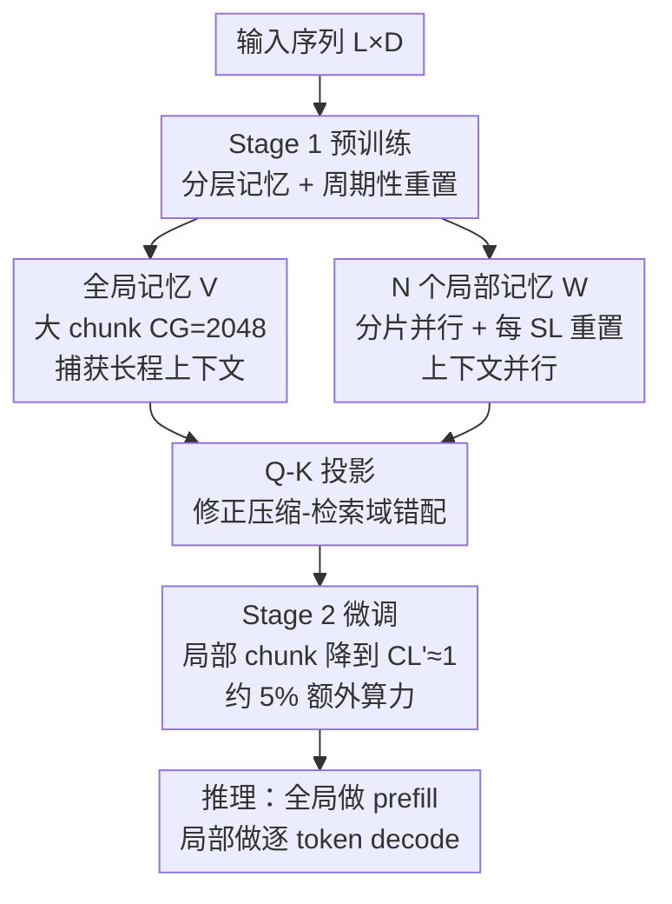

# TNT: Improving Chunkwise Training for Test-Time Memorization

**会议**: ICLR 2026  
**OpenReview**: [https://openreview.net/forum?id=rajioNWfRs](https://openreview.net/forum?id=rajioNWfRs)  
**领域**: LLM预训练 / 序列建模 / 高效训练  
**关键词**: 测试时记忆, 深度记忆模块, 分块训练, 上下文并行, Titans

## 一句话总结
本文提出 TNT 训练范式，用「分层记忆 + 周期性状态重置」打破非线性 RNN 的序列依赖以实现大规模上下文并行，再用一个轻量微调阶段把局部记忆切换到小 chunk，从而把 Titans 类深度记忆模型的训练速度提升至多 17×、同时还提升了精度。

## 研究背景与动机

**领域现状**：在替代 softmax 注意力的高效架构里，基于「测试时记忆（test-time memorization）」的深度记忆模块（deep memory module，如 Titans、TTT、Atlas）是一条很有潜力的线性扩展路线。它给模型加一套在推理/训练时都会在线更新的「快权重」$W$：每来一个 token 就把键 $k_t$ 关联到值 $v_t$，通过梯度下降把上下文压进固定大小的子网络（记忆压缩），检索时再用查询 $q_t$ 读出 $o_t = f(W_t, q_t)$。相比线性记忆模块用线性状态转移、矩阵值隐状态，深度记忆模块用非线性更新规则，表达力更强。

**现有痛点**：深度记忆模块缺少高效训练算法，硬件利用率极低——FLOPs 利用率常常低于峰值的 5–10%。为了保住细粒度学习信号，它们被迫用很小的 chunk（16–64 token）做分块并行训练（chunkwise parallel training），小 chunk 喂不饱加速器，训练变成访存受限而非计算受限，预训练慢到难以承受。

**核心矛盾**：罪魁是一个 chunksize 超参 $C$。大 chunk 提速但伤精度，小 chunk 保精度但慢到不可用，现有做法只能在两者间钉死一个折中值。更糟的是本文发现训练和推理还存在第三重错配：一个用 $C=64$ 预训练的模型，只有在推理也用 $C=64$ 时困惑度最优，换小 chunk 反而暴涨（图 2）——模型被过度特化到训练时的 chunk 分辨率上。

**本文目标**：把训练效率和推理性能解耦，让模型既能用大 chunk 高吞吐训练，又能在推理用小 chunk 拿到最佳精度。作者把它拆成三个挑战：① 缺高效训练实现（硬件利用率低）；② 记忆压缩用 $k$、检索用 $q$ 造成的域错配；③ 训练/推理 chunksize 错配。

**切入角度**：作者的核心观察是——模型的不同组件应该在不同训练阶段、以不同粒度处理信息。长程上下文交给吃大 chunk 的全局模块，细粒度细节交给一批可并行的局部模块，再用一次廉价微调消除 chunk 错配。

**核心 idea**：用「分层记忆 + 周期性重置」让非线性 RNN 也能跨序列做上下文并行（高吞吐预训练），再用一个只动局部记忆、把 chunk 缩到 1 的微调阶段恢复推理分辨率——一个通用的两阶段训练范式。

## 方法详解

### 整体框架
TNT 不是一个具体架构，而是一套可套在任意深度记忆模块上的两阶段训练范式。Stage 1 是「效率优先的预训练」：引入一个分层记忆系统，1 个全局记忆 $V$ 吃大 chunk（$C_G=2048$）捕获长程上下文，$N$ 个局部记忆 $W$ 在序列分片上并行处理细粒度信息；关键是给局部记忆加周期性重置，每隔长度 $S_L$ 就把状态复位到共享可学初始态 $W_{\text{init}}$，从而打断跨分片的序列依赖、解锁大规模上下文并行。检索时再用 Q-K 投影修正压缩-检索的域错配。Stage 2 是「性能优先的微调」：冻结大部分结构，只把局部记忆的 chunksize 从 $C_L$ 降到更小的 $C_L'$（理想到 1），用约 5% 的预训练算力把模型适配到高分辨率推理。三个创新分别对症前面三个挑战。

### 关键设计

**1. 分层记忆 + 周期性重置：让非线性 RNN 也能跨序列并行**

这一招正面解决挑战①（训练慢、硬件利用率低）。深度记忆模块的根本瓶颈是 $W_t$ 依赖 $W_{t-1}$ 的序列状态依赖，跨分片没法并行，只能靠堆小 chunk 维持信号。TNT 的破局点是：让所有并行分片都用同一个学到的初始状态 $W_{\text{init}}$ 启动局部记忆，直接砍断跨分片依赖。局部记忆的更新规则因此带了一个周期性重置——每当 $t$ 落到长度为 $S_L$ 的分片边界（$t \equiv 0 \bmod S_L$）就复位为 $W_{\text{init}}$，否则在分片内用小 chunk $C_L$ 正常做分块梯度累积：

$$W_t \leftarrow \begin{cases} W_{\text{init}} & \text{if } t \equiv 0 \ (\bmod\ S_L) \\ W_{t-1} - \sum_{\tau=\xi(t,C_L)}^{t} \eta_\tau \nabla_W L\big(f(W_{\xi(t,C_L)}, k_\tau), v_\tau\big) & \text{otherwise} \end{cases}$$

但重置会让局部记忆丢掉全局上下文，于是再并联一个全局记忆 $V$：它用很大的 chunk $C_G$（如 2048）顺序演化 $V_{(k+1)C_G} \leftarrow V_{kC_G} - \sum_t \eta_t \nabla_V L(f(V_{kC_G}, k_t), v_t)$，大 chunk 让它的更新变成吃满硬件的计算密集操作。这就形成一个分工明确的层级：全局记忆扛长程、局部记忆抠细节。效率的提升是双管齐下的——大 chunk 的全局模块把算子做成 compute-bound，局部记忆的重置则把序列拆成可分发到多设备/可在单卡上堆叠的独立块，吞吐大涨。这也是本文最硬的创新点：在 Transformer 和专用线性 RNN（能用 parallel scan）之外，跨序列高效并行化非线性递归一直是悬而未决的难题。

**2. Q-K 投影：消除「压缩用键、检索用查询」的域错配**

针对挑战②。记忆压缩时，子网络 $f(W,\cdot)$ 被优化成把键空间映射到值空间（拿 $k_t$ 关联 $v_t$）；可检索时却用查询 $q_t$ 去喂它，而 $q_t$ 可能落在学到的键域之外，破坏映射完整性、拖累检索。TNT 的解法是把 $q_t$ 投影到「已观测键张成的子空间」上，保证送进记忆函数的输入落在它被训练过的空间里。最终输出是全局记忆（用原始 $q_t$）与局部记忆（用投影后查询）之和：

$$o_t = f\big(V_{\xi(t,C_G)}, q_t\big) + f\Big(W_t, \sum_{\tau=\xi(t,C_L)}^{t} \frac{k_\tau k_\tau^\top}{\|k_\tau\|^2} q_t\Big)$$

巧妙之处在于它不需要存下所有历史键。投影矩阵 $\sum_\tau \frac{k_\tau k_\tau^\top}{\|k_\tau\|^2} \in \mathbb{R}^{d\times d}$ 可以当成一个常数大小的累加状态，按分块并行高效维护；又因为很多深度记忆模块本就对 $q$、$k$ 做了 L2 归一化，分母可直接简化为 $\sum_\tau k_\tau k_\tau^\top$。作者只在局部记忆上做投影——它更细粒度、对域错配更敏感，全局记忆则保留原始查询。

**3. Stage 2 细分辨率微调：抹平训练/推理 chunksize 错配**

针对挑战③。Stage 1 为了吞吐用了大 chunk，但图 2 已证明：直接拿大 chunk 预训练的模型去用小 chunk 推理会严重掉点，模型被过度特化。一个直觉做法是推理时换小 chunk，但会触发训练-推理错配。作者的关键观察是这种错配可以用极小代价修正：只需把预训练好的模型用更小的局部 chunk $C_L' < C_L$ 继续训练很少的步数，不仅能恢复、往往还能超过原性能。这一阶段只动局部记忆，约消耗 5% 的预训练算力。微调到 $C_L'=1$ 时，模型恰好对齐自回归生成的 prefill-and-decode 范式：全局记忆负责上下文 prefill，优化过的局部记忆负责逐 token 解码。由此「大 chunk 高吞吐训练」和「小 chunk 高精度推理」被彻底解耦。

### 损失函数 / 训练策略
基座用 150M 参数 Titans，T5 tokenizer（32k 词表），AdamW（weight decay 0.1）+ cosine 调度（峰值 LR $1\times10^{-3}$），在 TPUv4 pod（2×2×2，模型并行 2）上训 10B token。全局记忆固定 $C_G=2048$；$N$ 个局部模块用各自 chunksize 表示，如 $C_L=\{8,16\}$ 表示两个分别为 8、16 的局部模块。效率实验用上下文 2k–32k、局部窗口 $S_L=2048$；性能实验用 16k 上下文、$S_L=4096$。记忆压缩的自监督损失沿用深度记忆模块的 MSE 关联目标。

## 实验关键数据

### 主实验
在 150M 参数、10B token 设置下评测语言建模困惑度（C4 / FineWeb / PG19）与常识推理准确率（PIQA / Hella. / ARC-e / CSQA）。

| 模型 | $C$ / $C_L$ | Avg. ppl ↓ | 常识 Avg. acc ↑ |
|------|------|------|------|
| Transformer (w/o gating) | - | 23.58 | 38.3 |
| Transformer (w gating) | - | **22.39** | 39.7 |
| TTT | 256 | 27.62 | 38.1 |
| Titans | 8 | 25.07 | 39.0 |
| TNT Stage 1 | {4,8,16,32} | 23.13 | 40.6 |
| TNT Stage 2 | {2,4,8,16} | 23.09 | 40.9 |

TNT Stage 1 的最佳困惑度 23.13 已优于最强 Titans（25.07）和 vanilla Transformer（23.58）；Stage 2 进一步压到 23.09。虽未追平 Gated Transformer 的 22.39，但常识推理准确率（41.0% 的两局部模块配置）反超后者（39.7%）。

训练速度上（150M 模型达到目标 loss 3.20 的耗时）：

| 模型 | $C$ / $C_L$ | 训练时间(hrs) | 加速比 |
|------|------|------|------|
| Titans | 8 | 19.48 | 1.00× |
| Titans | 128 | 3.71 | 5.25× |
| TNT | {8} | 2.54 | 7.68× |
| TNT | {64} | **1.12** | **17.37×** |
| TNT | {128} | 1.16 | 16.75× |

同样用 chunksize 8，TNT 已比 Titans 快 7.7×；最佳配置达 17.37×。运行时随序列长度线性增长（vs 注意力的二次增长），32K 序列下 TNT($C_L=16$) 比同 chunk 的 Titans 快 5.1×，$C_L=\{128\}$ 时甚至比 FlashAttention 还快 1.3×。

### 消融实验

| 配置 | ppl ↓ | 常识 acc ↑ | 说明 |
|------|------|------|------|
| Base (Titans) | 23.53 | 38.8 | 基座 |
| TNT Stage 1, +1 局部记忆 | 21.04 | 40.6 | 单局部 |
| TNT Stage 1, +4 局部记忆 | 20.15 | 40.6 | 多分辨率局部 |
| w/o 全局记忆 | 25.60 | 35.5 | 去掉全局，长程上下文丢失 |
| w/o Q-K 投影 | 22.01 | 36.4 | 域错配未修正 |
| w Stage 2 | 20.86 | 40.9 | 加微调 |

### 关键发现
- **全局记忆不可或缺**：去掉后困惑度从 21.04 暴涨到 25.60——因为局部记忆的周期性重置会丢长程上下文，必须靠全局记忆补回来，二者是配套设计。
- **Q-K 投影贡献显著**：去掉后困惑度从 21.04 升到 22.01、常识 acc 从 40.6 跌到 36.4，证实压缩-检索域错配是真实瓶颈。
- **多分辨率局部记忆持续受益**：从 1 个加到 4 个局部模块，困惑度从 21.04 单调降到 20.15，多尺度时间动态比单一固定 chunk 抓得更好。
- **Stage 2 极其廉价**：仅多花约 5% 预训练算力，就把困惑度从 Stage 1 进一步压低并提升常识推理。

## 亮点与洞察
- **把序列依赖「主动剪断」而非绕开**：核心 trick 是让所有分片共享同一可学初始态 $W_{\text{init}}$ + 周期性重置，直接消灭跨分片依赖，再用全局记忆补回被剪掉的长程信息——这种「先破坏再补偿」的分层思路可迁移到其他难并行的非线性递归模型。
- **投影矩阵写成 running sum**：$\sum_\tau k_\tau k_\tau^\top$ 维护成常数大小状态，避免存历史键，让 Q-K 投影几乎零额外开销，是个很实用的工程巧思。
- **训练/推理彻底解耦**：「大 chunk 训、小 chunk 推、中间用 5% 算力微调过渡」这套范式与自回归的 prefill-decode 天然对齐，且 model-agnostic，可直接套到 TTT/Atlas 等任意深度记忆模块上。

## 局限与展望
- **尚无定制 kernel**：作者承认 TNT 目前是原生 JAX 实现，还追不上带 FlashAttention 的 Gated Transformer，定制 kernel 留作未来工作。
- **规模受限**：实验只到 150M 参数、10B token，是否在更大规模上仍保持加速比与精度优势未验证。
- **仍未追平 SOTA Transformer 困惑度**（23.09 vs 22.39），本文定位是「移除可扩展性障碍、为后续缩小差距铺路」，而非直接超越。
- **超参依赖**：分片长度 $S_L$、全局 chunk $C_G$、局部模块数 $N$ 与各自 chunksize 都需调，多分辨率配置的搜索空间不小。

## 相关工作与启发
- **vs Titans / TTT（深度记忆基座）**：它们用固定小 chunk 在表达力与效率间死折中，TNT 把训练效率和推理性能解耦，既快又准，且作为通用范式可直接套用。
- **vs Zhang et al. 2025（大 chunk + 局部注意力）**：那条路靠混入注意力来绕开低效，混淆了记忆与注意力的分析、也没解决推理需小 chunk 的需求；TNT 是从训练范式本身解决，不引入注意力。
- **vs Guo et al. 2025（分层记忆系统）**：那套只适用于线性记忆模块、且不支持短期记忆；TNT 面向非线性深度记忆模块并显式建模多分辨率局部记忆。

## 评分
- 新颖性: ⭐⭐⭐⭐⭐ 用周期性重置首次让非线性深度记忆模块实现跨序列上下文并行，是长期未解难题的实质突破。
- 实验充分度: ⭐⭐⭐⭐ 速度/质量/消融齐全且对照强，但规模止于 150M、缺更大模型与定制 kernel 验证。
- 写作质量: ⭐⭐⭐⭐⭐ 三挑战 → 三设计的对应清晰，公式与图表自洽。
- 价值: ⭐⭐⭐⭐⭐ 移除了表达型 RNN 的关键可扩展性障碍，为替代 softmax 注意力的路线提供了实用训练基座。

<!-- RELATED:START -->

## 相关论文

- [\[ICLR 2026\] Distilled Pretraining: A modern lens of Data, In-Context Learning and Test-Time Scaling](distilled_pretraining_a_modern_lens_of_data_in-context_learning_and_test-time_sc.md)
- [\[ICLR 2026\] FictionalQA: A Dataset for Studying Memorization and Knowledge Acquisition](fictionalqa_a_dataset_for_studying_memorization_and_knowledge_acquisition.md)
- [\[ICCV 2025\] ETA: Energy-based Test-time Adaptation for Depth Completion](../../ICCV2025/llm_pretraining/eta_energy-based_test-time_adaptation_for_depth_completion.md)
- [\[ICLR 2026\] StochasTok: Improving Fine-Grained Subword Understanding in LLMs](stochastok_improving_fine-grained_subword_understanding_in_llms.md)
- [\[ICLR 2026\] Time is a Feature: Exploiting Temporal Dynamics in Diffusion Language Models](time_is_a_feature_exploiting_temporal_dynamics_in_diffusion_language_models.md)

<!-- RELATED:END -->
