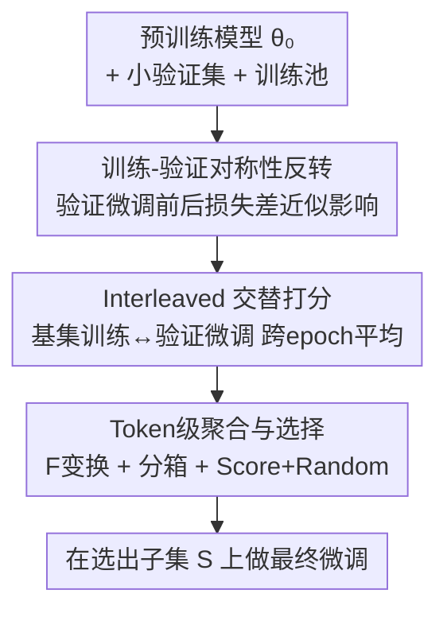

# Train on Validation (ToV): Fast Data Selection with Applications to Fine-Tuning

**会议**: ICLR 2026  
**OpenReview**: [https://openreview.net/forum?id=fWHd3yYicX](https://openreview.net/forum?id=fWHd3yYicX)  
**领域**: LLM预训练 / 数据筛选  
**关键词**: 数据选择, 指令微调, 影响函数, 训练-验证对称性, 前向损失

## 一句话总结
ToV 把"在训练池上估计每个样本对验证损失的影响"这件事，通过一阶泰勒展开揭示的训练-验证对称性，**反转**成"先在小验证集上微调一步、再看训练池里每个样本的损失变化最大"——只用前向损失评估、不需要逐样本梯度或 Hessian，就能在指令微调与 NER 上以 2–6× 的速度选出比 LESS 更好的微调数据。

## 研究背景与动机

**领域现状**：基础模型走"大规模预训练 + 任务微调"两段式，微调阶段的数据质量往往决定下游表现。当目标分布只有少量样本、训练池又来自异构来源时，如何从训练池里挑出"最像目标分布、最能降低目标测试损失"的子集，是数据选择（data selection）的核心问题。

**现有痛点**：主流做法（如 LESS、TracIn）把这少量目标样本当作验证集，用**影响函数**思想估计"往训练池里加/减一个样本"对验证损失的影响。要算这个影响，需要对每个训练样本和每个验证样本计算**逐样本梯度**，再做点积、随机投影、低秩近似，还要反传穿过训练动力学。这套流程要存储大量梯度/检查点，计算和磁盘开销都很重。

**核心矛盾**：直接评估"每个训练样本 $x$ 引起的验证损失下降"，需要对 $N$ 个样本各做一遍验证集推断（$N+1$ 次全验证集评估），代价随训练池线性膨胀；而要省这个开销就得引入逐样本梯度近似，反而把存储/反传的负担转嫁过来。两条路都贵。

**切入角度**：作者注意到一阶泰勒展开下，"在 $x$ 上走一步梯度对验证样本 $z$ 的损失下降"与"在 $z$ 上走一步对 $x$ 的损失下降"是**对称**的——式 (4) 的右端 $\eta\langle\nabla\ell(\theta,z),\nabla\ell(\theta,x)\rangle$ 关于 $x,z$ 对称。既然如此，与其逐个在训练样本上做扰动去看验证集，不如**只在验证集上微调一次**，反过来观察整个训练池里哪些样本损失变化最大。

**核心 idea**：用"在验证集上微调前后，训练样本 $x$ 的损失变化 $\ell(\theta,x)-\ell(\theta_{Z_{val}},x)$"来近似"在 $x$ 上训练带来的平均验证损失下降"，从而只用**前向损失**就完成打分，彻底绕开逐样本梯度。

## 方法详解

### 整体框架

ToV 要解决的是"给定预训练模型 $\theta_0$、小验证集 $Z_{val}$、大训练池 $X=(x_1,\dots,x_N)$，挑出大小为 $n$ 的子集 $S$，使得在 $S$ 上微调后目标分布测试损失最小"。整体只做一件事：**反转训练与验证的角色**——不在每个训练样本上做扰动，而是在验证集上微调一步，再扫训练池看谁变化最大。

推导的关键是式 (6)：对验证集做一次批量梯度步得到 $\theta_{Z_{val}}=\theta-\eta\frac{1}{m_{val}}\sum_i\nabla\ell(\theta,z_i)$，结合对称性可得

$$\frac{1}{m_{val}}\sum_{i=1}^{m_{val}}\big[\ell(\theta,z_i)-\ell(\theta_x,z_i)\big]\approx\langle\theta-\theta_{Z_{val}},\nabla\ell(\theta,x)\rangle\approx\ell(\theta,x)-\ell(\theta_{Z_{val}},x).$$

左端是"在 $x$ 上训练带来的平均验证损失下降"（理想打分），右端只需"在验证集上微调一次 + 两次训练池前向评估"。这把 $N$ 次验证集评估压成了 1 个验证 epoch + 2 次训练池扫描，且无需逐样本梯度。

落地为打分→选择→终训三步的循环（Interleaved ToV，算法 1）：先随机取小基集 $U$，交替地"在 $U$ 上训一个 epoch 得基模型 $\hat\theta^{bas}_k$ → 在验证集上以更小学习率 $\varepsilon\eta_k$ 微调一个 epoch 得 $\hat\theta^{val}_k$ → 给训练池里每个 $x_i$ 按损失差打分并跨 epoch 平均"，最后按分数选出 $S$ 去做最终微调。

### 关键设计

**1. 训练-验证角色反转：用前向损失差近似逐样本影响**

这一设计直击"算影响必须逐样本梯度"的痛点。传统做法（Pruthi 2020、Xia 2024 的 LESS）为了估计样本 $x$ 对验证损失的影响，要对每个 $x$ 和每个验证样本算梯度再点积。ToV 注意到式 (4) 的内积 $\eta\langle\nabla\ell(\theta,z),\nabla\ell(\theta,x)\rangle$ 关于 $x$ 和 $z$ 是对称的：在 $x$ 上走一步降低 $z$ 的损失，等价于在 $z$ 上走一步降低 $x$ 的损失。于是把"在 $N$ 个训练样本上各扰动一次、每次看验证集"反转成"只在验证集上微调一次、再扫训练池"，最终打分简化为 $\ell(\theta,x)-\ell(\theta_{Z_{val}},x)$（式 6）。它只依赖一阶泰勒展开成立，即要求验证步更新足够小、损失局部光滑——论文用"验证学习率 $\varepsilon=1/10$ 基学习率"来强制落在这个近似有效的区域，不需要训练与验证样本独立等额外假设。

**2. Interleaved / Parallel 两种交替打分轨迹**

单点近似只在初始 $\theta$ 附近有效，模型一旦走远打分就失真。为此 ToV 把打分嵌进一段训练轨迹：从随机基集 $U$ 出发训 $L$ 个 epoch，每个 checkpoint $\hat\theta^{bas}_k$ 都做一次"在验证集上微调得 $\hat\theta^{val}_k$"，用 $\ell(\hat\theta^{val}_k;x_i)-\ell(\hat\theta^{bas}_k;x_i)$ 给每个剩余样本打分并跨 epoch 平均（算法 1 第 10–11 行），让分数覆盖训练过程中不同阶段的影响。论文给了两个变体：**Interleaved ToV（方法 A）**在同一条基集轨迹上插入验证更新，实测效果更好；**Parallel ToV（方法 B）**并行跑两条基集轨迹、只对其中一条做验证更新，因为数学表达更简洁而被用于理论分析。两者机理同源，差别只在验证 epoch 是否回灌进基集轨迹。

**3. Token 级打分聚合 + 长度分箱 + Score+Random 选择**

预测在 token 级、选择在样本级（如指令/输出对），需要把 token 差汇成样本分。ToV 先定义每 token 的对数损失差 $\Delta_t(z;\theta,\theta')=\log\frac{p_t(z_{out}(t)\mid z;\theta')}{p_t(z_{out}(t)\mid z;\theta)}$，再过一个变换 $F$ 后沿位置平均得样本分 $\phi=\frac{1}{T}\sum_t F(\Delta_t)$。$F$ 有三种实例：$F(y)=y$（最大改进）、$F(y)=|y|$（最大绝对变化）、$F(y)=\max\{y,0\}$（只看正向改进，忽略退化）。由于短样本 token 少、方差大会被打高分，作者按序列长度分成 10 个等容量的箱、每箱取等量高分样本以消偏。最终选择用 **Score+Random**：一半取最高分样本、另一半从基集 $U$ 里均匀随机抽，以增加多样性；另有 Score-Only 全取最高分的变体。

### 损失函数 / 训练策略

训练用 token 级对数损失 $\ell(\theta,z)=-\frac{1}{T(z)}\sum_t\log p_t(z_{out}(t)\mid z;\theta)$（式 7）。打分轨迹的 epoch 数按 $L=(16\times1024)/n_{tr}$ 设定以保持**恒定计算量**（批数固定为 1024）；基集 $|U|=4\times1024$ 故 $L=4$。验证学习率取基学习率的 $\varepsilon=1/10$ 以保证一阶近似有效。全程用 LoRA（$\alpha=32$、dropout=0.2），NER 用 PEFT rank=1、指令微调用 rank=256；学习率对随机选择做超参优化（反而让 ToV 吃亏）。

## 实验关键数据

### 主实验

指令微调用 Llama-3-8B，目标/训练池在 Slim Orca、Alpaca GPT-4、Alpaca GPT-3.5 三个数据集间组合出 5 种配置；NER 用 xlm-roberta-base，在 Multinerd、Ai4p、C4、Syn-big 上设 6 种配置。指标为"测试对数损失相对随机选择的改进百分比"（$n=8\times1024$，10 次独立运行平均）。

| 任务 | 配置 | ToV 最优变体改进 | LESS | 最大不确定性 |
|------|------|------|------|------|
| 指令微调 | Exp 1/3/4/5 | 多数 +5%~+10% 优于随机 | 多数被 ToV 超过 | 基本无改进甚至变差 |
| 指令微调 | Exp 2（训练池全非目标） | 仍优于随机 | 略优于 ToV（唯一例外） | 无改进 |
| NER | Exp 1–6 | 系统性改进，增益最大（可达 ~+30%） | 不优于随机 | 多数有改进但弱于 ToV |

一个直观结论：好的数据选择带来的提升，相当于甚至超过把选样数 $n$ 翻倍的效果。

### 消融实验

| 配置 / 维度 | 关键指标 | 说明 |
|------|---------|------|
| $F(y)=y$ / $|y|$ / $\max\{y,0\}$ | 三种打分均稳定优于随机 | 三个 $F$ 变体各有优势，多数配置都超基线 |
| Interleaved vs Parallel | Interleaved 略好 | Parallel 仅用于理论分析（表达更简洁） |
| Score+Random vs Score-Only | 正文用 Score+Random | 加入随机半数提升多样性 |
| 长度分箱 | 缓解短样本偏置 | 不分箱会因短样本高方差被打高分而失衡 |

### 运行时与存储（ToV vs LESS，同硬件 5 次均值）

| 设置 | 方法 | 运行时 | 存储 |
|------|------|------|------|
| 指令微调 | LESS | 4h 5m | 4.9 GB |
| 指令微调 | ToV | 2h 3m | 1.84 GB |
| NER | LESS | 46m | 4.1 GB |
| NER | ToV | 8m | 0.24 GB |

ToV 相对 LESS 把运行时降低 2–6×、磁盘存储降低 2.5–16×。

### 关键发现
- **对称性是省算力的根源**：把"逐样本梯度点积"换成"一次验证微调 + 两次前向评估"，既快又省存储，且不丢精度。
- **NER 上优势更明显**：LESS 在 NER 上甚至不如随机选择，而 ToV 仍系统性领先，说明前向损失差的打分对序列标注这类任务更稳健。
- **唯一吃亏的场景**（指令微调 Exp 2，训练池完全来自非目标分布）LESS 略优，提示当训练池与目标分布差异极大时，纯前向损失差的判别力会被削弱。
- **理论背书**：Proposition 1 在局部凸 + 光滑假设下证明线性化理想分 $S_i^{lin}$ 能定量逼近理想分 $S_i$，为反转打分的有效性提供了数学依据。

## 亮点与洞察
- **"反转视角"非常巧妙**：同一个一阶泰勒内积，换个方向读就把 $O(N)$ 次验证评估变成 1 次验证微调，是典型的"用对称性把昂贵方向换成便宜方向"，这个 trick 可迁移到任何基于影响函数/梯度点积的归因任务。
- **只用前向损失**：彻底不碰逐样本梯度、Hessian-向量积、训练动力学反传，工程实现极简，几乎任何能算 loss 的模型都能套用。
- **恒定计算量的实验设计**：用 $L=(16\times1024)/n_{tr}$ 固定总批数，让不同选样规模在同等算力下公平比较，是值得借鉴的评测规范。
- **长度分箱消偏**：识别出"短样本因 token 少、方差大被打高分"的系统偏置并用分箱修正，是 token 级打分容易忽略的细节。

## 局限与展望
- **依赖一阶近似**：式 (6) 只在验证步更新小、损失局部光滑时成立，更新过大或损失高度非线性时近似退化；论文靠小验证学习率强行落区，但这也限制了单步能捕获的影响范围。
- **训练池与目标差异极大时失效**：指令微调 Exp 2 中训练池全为非目标分布时 ToV 反被 LESS 超过，说明纯前向损失差在强分布偏移下判别力下降。
- **理论仅覆盖批量 GD + 局部凸**：Proposition 1 的假设（局部强凸、Hessian Lipschitz）与真实 LLM 的 SGD/LoRA 训练有差距，理论保证更多是启发性的。
- **打分超参敏感**：$F$ 的选择、$\varepsilon$、分箱数等都影响结果，论文未给出在新任务上自动选配的方案。

## 相关工作与启发
- **vs LESS (Xia et al., 2024)**：LESS 同样源于影响函数，但靠逐样本梯度 + 随机投影 + 低秩近似来估影响，需存大量梯度；ToV 用训练-验证对称性把打分降到前向损失，速度 2–6×、存储省 2.5–16×，多数配置精度更高（NER 上 LESS 甚至不如随机）。
- **vs TracIn / Pruthi et al. (2020)**：两者都用梯度点积近似训练动力学影响，ToV 不需要逐样本梯度，且 Pruthi 对跨 epoch 传播做的是粗近似，ToV 用交替轨迹 + 跨 epoch 平均覆盖训练过程。
- **vs 最大不确定性（hardness score）**：用 $\psi_i=\frac{1}{T}\sum_t\log[p_t(1-p_t)]$ 选"难样本"，但难≠对目标分布有用；ToV 直接对齐目标分布的影响，多数场景更优。
- **vs TSDS / DSIR（分布对齐选择）**：它们把训练数据分布对齐到小目标集，ToV 则从单样本影响出发、用对称性高效估计，二者互补。

## 评分
- 新颖性: ⭐⭐⭐⭐⭐ 用训练-验证对称性把昂贵的影响估计反转成纯前向打分，视角新且简洁
- 实验充分度: ⭐⭐⭐⭐ 覆盖指令微调 + NER 两类任务、多种分布配置 + 运行时存储对比，但模型/数据集规模有限
- 写作质量: ⭐⭐⭐⭐ 推导清晰、动机层层递进；理论与实验衔接良好
- 价值: ⭐⭐⭐⭐⭐ 极低实现门槛 + 显著加速，对算力受限的微调数据筛选很实用

<!-- RELATED:START -->

## 相关论文

- [\[ICLR 2026\] Token-level Data Selection for Safe LLM Fine-tuning](token-level_data_selection_for_safe_llm_fine-tuning.md)
- [\[ICLR 2026\] Task-Aware Data Selection via Proxy-Label Enhanced Distribution Matching for LLM Fine-Tuning](task-aware_data_selection_via_proxy-label_enhanced_distribution_matching_for_llm.md)
- [\[ICLR 2026\] ssToken: Self-modulated and Semantic-aware Token Selection for LLM Fine-tuning](sstoken_self-modulated_and_semantic-aware_token_selection_for_llm_fine-tuning.md)
- [\[ICLR 2026\] How to Train Data-Efficient LLMs](how_to_train_data-efficient_llms.md)
- [\[ICLR 2026\] SPICE: Submodular Penalized Information–Conflict Selection for Efficient Large Language Model Training](spice_submodular_penalized_informationconflict_selection_for_efficient_large_lan.md)

<!-- RELATED:END -->
