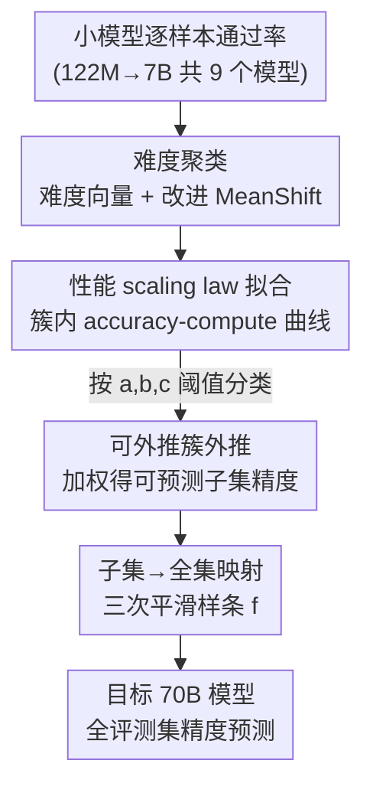

# Unveiling Downstream Performance Scaling of LLMs: A Clustering-Based Perspective

**会议**: ICLR 2026  
**OpenReview**: [https://openreview.net/forum?id=3HrDPUi4jx](https://openreview.net/forum?id=3HrDPUi4jx)  
**领域**: LLM预训练 / Scaling Law  
**关键词**: 下游性能预测, scaling law, 难度聚类, 涌现现象, 训练监控

## 一句话总结
本文提出 Clustering-On-Difficulty（COD）框架：先按"难度 scaling 特征"把评测样本聚类、筛掉不可外推的簇，再用一条新推导的下游性能 scaling law 对每个簇做 compute-性能外推，最后用一个平滑映射把"可预测子集"的精度还原到完整评测集——在 70B 模型的 8 个主流 benchmark 上把平均预测误差压到 1.55%。

## 研究背景与动机
**领域现状**：训练 loss 随 compute 呈幂律下降（$L \propto C^{-\beta}$）已是公认的 scaling law，但真正决定模型价值的是下游任务准确率。于是出现了"用小模型的评测结果去预测大模型在 benchmark 上的表现"这一需求，主流做法分两条线：一是 **loss-中介**（先预测 loss，再用 loss-性能关系换算精度），二是 **end-to-end**（直接拟合性能-compute 或性能-参数量曲线）。

**现有痛点**：两条线都不够准。loss 与下游精度的映射并不稳定——同一个 loss 值下，小模型甚至可能比大模型准确率更高（因为达到同一 loss 需要更多训练步、泛化反而更好），而且学习率 schedule 不同也会让"同 loss 不同精度"。end-to-end 这边，单一曲线族无法刻画一个评测集内部"样本难度参差不齐"的复杂分布；分段幂律（BNSL）在 70B 这种大尺度上又会因涌现/饱和出现意外拐点而失灵。

**核心矛盾**：所有现有方法都隐含一个**不合理假设——整个评测集的所有样本遵循同一条性能 scaling 曲线**。但作者在 pilot study 里观察到：即便在同一个 benchmark（如 BBH）内部，不同难度的样本有各自不同的"计算阈值、增长斜率、性能上界"，用一条公式硬套自然次优；同时低难度样本在小模型上还会出现"贴着随机猜测水平剧烈抖动"的非涌现噪声，把拟合直接带偏。

**本文目标**：找到一个对各类下游任务都可靠、且能优化最坏情况预测误差的预测方法 $\phi$，只用一组小模型 $\{M_{C_1},\dots,M_{C_n}\}$ 的评测结果去推断目标大模型 $M_{C_{\text{target}}}$（$C_i \ll C_{\text{target}}$）的精度。

**切入角度**：既然异质性来自"难度分布"，那就**先按难度把样本分组**，让每组内部 scaling 行为一致，再分组拟合外推。难度差异小（组内 loss 方差小）正是后面那条性能 scaling law 近似成立的前提。

**核心 idea**：用"按难度聚类 → 筛可外推簇 → 簇内 scaling law 外推 → 子集映射回全集"四阶段，把一个不可预测的整体拆成若干可预测的子问题再拼回去。

## 方法详解

### 整体框架
COD 把"从小模型预测大模型下游精度"拆成四个串行阶段（对应论文 Fig. 2 的 a/b/c/d）。输入是一组从 122M 到 7B 不等的小模型在评测集上的逐样本通过率，输出是目标 70B 模型在完整评测集上的预测精度。

四个阶段是：(a) 把每个样本表示成"难度向量"并做改进 MeanShift 聚类、剔除离群点；(b) 用一条新推导的下游性能 scaling law 给每个簇拟合 accuracy-compute 曲线，并据拟合参数把簇分成可外推 / 不可外推 / 非涌现三类；(c) 在可外推簇上外推到目标 compute、按簇大小加权得到"可预测子集"的精度；(d) 用一条平滑映射函数把可预测子集精度还原成完整评测集精度。

### 关键设计

**1. 难度聚类：用 passrate 向量把异质评测集切成同质子簇**

针对"一条曲线套全集"的根本痛点，COD 不再假设全集同质，而是给每个样本造一个**难度特征向量**：固定 token/compute 比例训练一组递增规模的小模型（注意**不引入目标大模型**，避免特征泄漏），对每个任务用 `top_p=0.7, temperature=1.0` 采样 100 次算通过率，把各规模下的通过率按模型从小到大拼成一条向量。大多数任务这条向量随规模单调上升，正好刻画了"能力随 scale 渐增"的难度曲线。随后用**改进 MeanShift** 聚类，相比原始 MeanShift / DBSCAN 额外加了两条约束：**限制簇直径以压低组内方差**（保证同簇外推性质一致）、**保证每簇至少有最少样本数**（≈10，压低指标抖动），并能自动确定簇数。t-SNE 可视化显示改进版能把稠密区切开，而 DBSCAN/原 MeanShift 会连成组内距离很大的大簇。组内方差小是下一步 scaling law 近似成立的关键前提。

**2. 下游性能 scaling law：从 loss 幂律严格推出 accuracy-compute 公式**

针对"loss-精度映射不稳定"，本文不绕道 loss，而是直接给一条可对 accuracy 外推的公式（Theorem 1）。它从三条假设出发：答案 loss 服从幂律 $L_P(C)=\alpha C^{-\beta}+\gamma$（$\gamma$ 是不可约 loss）、每题有唯一确定答案、精度可分解出随机猜测基线 $g$。由 $p(a_{\text{true}}|q)=\exp(-L)$，对通过率 $E[\exp(-L)]$ 做 Taylor 展开（关键在于 accuracy 算的是 passrate 的算术平均、而 loss scaling 给的是几何平均），得到：

$$E_P[\text{Acc}(C)] = g + (1-g)\left(\exp(-\alpha C^{-\beta}-\gamma) + \frac{\sigma_L^2(C)}{2\mu_L(C)}\right) + o(\sigma_L^2(C))$$

这个近似在**组内 loss 方差小**（$\sigma_L^2/\mu_L^2 \ll 1$）时才准——这正是设计 1 做难度聚类的理论动机。落到工程拟合时简化成四参数曲线：

$$y(C) = g + (1-g)\,e^{-aC^{-b}-c}$$

其中 $a,b$ 共同决定精度随 $C$ 的增长形状，$c$ 约束拟合曲线的上界，$g$ 是该簇的随机猜测期望，$a,b,c,g$ 均可训练。每个簇单独拟合这条曲线。

**3. 可外推簇筛选与外推：只信"长势稳健"的簇，并以子集做中介**

针对"小模型上低难度簇贴随机猜测乱跳、高难度簇还没涌现"，COD 在外推前先做筛选：一个簇被判为**可外推**当且仅当 (1) 期望精度随规模单调上升、(2) 性能能收敛到至少阈值 $P$。具体用 Eq. (4) 拟合出的参数卡两条规则——增长几乎为零（$a$ 或 $b$ 太小）剔除、外推可靠性差（$c$ 过大）剔除；实践阈值取 $a>1,\ b>0.1,\ 0\le c<1$。满足条件的簇合起来构成**可预测子集**，目标模型在该子集上的精度预测是各簇外推值按簇大小加权平均。之所以走"子集中介"而非直接预测全集：可预测子集指标与全集指标存在强相关，能用一条光滑曲线拟合，从而绕开非涌现样本带来的剧烈波动。

**4. 子集→全集映射：用单调平滑样条把可预测子集精度还原回全集**

可预测子集只是全集的一部分，必须把它的精度映射回完整评测集。作者的依据是：可外推与不可外推样本虽然难度不同，但**通常属于同类题型**，因而二者指标的相对序是一致的，存在稳定映射。映射函数 $f:\text{Acc}(P')\to\text{Acc}(P)$ 要求连续、在 $[0,1]$ 上光滑、单调递增，并强制过 $(0,0)$ 和 $(1,1)$；经验上**三次平滑样条**拟合最好。实现时固定端点，动态增加分段（节点）数直到拟合 RMSE 低于 0.005。映射用已有模型（甚至外部模型如 Qwen2-72B）的评测结果作锚点标定，跨架构/数据较稳健。最终对训练 compute 为 $C_0$ 的目标模型，预测为 $p = f\circ y(C_0)$，把簇内外推与子集映射串起来。

### 损失函数 / 训练策略
本文不训练新模型来做预测，而是**复用一组规模递增的小模型**（共 9 个，122M–70B，同数据分布同架构、训练数据按规模成比例缩放）。预测侧的"训练"只是用最小二乘拟合 Eq. (4) 的四个参数 $a,b,c,g$、以及拟合三次平滑样条 $f$；评测统一用 few-shot in-context learning、对齐 LLaMA3 的设置。

## 实验关键数据

### 主实验
在 8 个主流 benchmark（GSM8K / MATH / BBH / TriviaQA / MBPP / AGIEval / DROP / MMLU-pro）上用 8 个小模型预测 70B 模型，按绝对预测误差（%）评估，误差 <2% 视为准确、>5% 视为失效。

| 方法 | 平均误差↓ | 最大误差↓ |
|------|-----------|-----------|
| Loss-intermediate | 5.29 | 9.39 |
| End-to-end(exp) | 3.10 | 6.00 |
| End-to-end(passrate) | 5.02 | 8.80 |
| End-to-end(BNSL) | 5.17 | 13.05 |
| COD (w/o mapping) | 2.24 | 5.26 |
| **COD (Complete)** | **1.55** | **2.68** |

完整 COD 在平均和最大误差上都显著领先：baseline 即便在部分数据集上尚可，也总会在另一些数据集上误差爆表（如 BNSL 在 MATH 上 13.05%），可靠性差；COD 不只是延伸已有趋势，还能预测后续是否减速、刻画曲线弯折幅度。

### 消融实验

| 配置 | 平均误差 | 说明 |
|------|---------|------|
| COD (Complete) | 1.55 | 完整四阶段 |
| COD w/o mapping | 2.24 | 去掉子集→全集映射，误差升 0.69 |
| 改进 MeanShift（聚类对比，FE 均值） | 1.55 | 本文聚类 |
| 原 MeanShift | 2.51 | 组内距离大，FE 升 |
| DBScan | 6.43 | 连成大簇，最差 |
| Improved-KMeans | 2.82 | IAD 最低但 GSM8k/AGIEval 等掉点 |

跨架构上，用 dense 小模型导出的簇去预测 **32B MoE** 模型，COD 平均误差 3.11%，仍优于 loss-intermediate(3.65) 与 end-to-end(exp)(3.95)，说明难度特征/聚类大体与模型族无关、可迁移；但 dense→MoE 精度低于 dense→dense。外推公式消融显示去掉随机猜测项 $g$（BBH FE 11.65）或去掉常数 $c$（BBH FE 4.10）都明显变差。

### 关键发现
- **聚类质量直接决定预测精度**：改进 MeanShift 通过约束簇直径把组内平均距离（IAD）压低，从而拿到最低的外推误差（EE）和最终误差（FE）；DBSCAN 连簇导致 FE 高达 6.43%。
- **映射阶段是必要补丁**：去掉子集→全集映射后平均误差从 1.55% 涨到 2.24%，说明"只预测可预测子集"不够，必须还原全集。
- **难度特征是任务固有、近乎模型无关的**：聚类能跨 dense/MoE 迁移，但对齐"难度估计模型"与"目标模型"能进一步减小组内 scaling 差异、提升精度。

## 亮点与洞察
- **把"异质性"从 bug 变成可建模量**：以往方法被评测集内部难度参差所困，本文直接把难度做成可聚类的特征向量，让"一条曲线套全集"的硬假设松绑——这是整套方法成立的支点。
- **scaling law 有严格推导而非纯经验拟合**：Theorem 1 从 loss 幂律 + Taylor 展开推出 accuracy 公式，并自然解释了"为何必须先做难度聚类"（近似只在组内方差小时成立），理论与方法环环相扣。
- **"可预测子集做中介"是个可复用的范式**：与其硬啃充满涌现噪声的全集，不如锁定一个长势稳健、与全集强相关的子集先预测、再映射回去，这一思路可迁移到其它高方差指标的外推预测。

## 局限与展望
- **额外评测开销大**：COD 依赖逐样本重复采样（每任务 100 次）+ 聚类，相比直接拟合 compute 成本明显更高。
- **依赖一组同分布小模型**：需要预先训练 9 个同架构同数据分布的小模型，迁移到异质训练配方或不同数据混合时，难度特征是否仍稳定有待验证。
- **跨架构精度下降**：dense→MoE 的预测误差高于 dense→dense，说明"模型无关"只是近似；作者也承认对齐难度估计模型与目标模型才更准。
- **假设可能不严格成立**：Theorem 1 的"唯一确定答案""精度可分解"等假设在开放式生成/多解任务上未必满足，原文在附录 H 另作讨论。

## 相关工作与启发
- **vs Loss-intermediate（Chen et al. 2024）**：他们先预测 loss 再换算精度，受困于 loss-精度映射不稳定（同 loss 不同精度）；COD 直接对 accuracy 推 scaling law，绕开这层不稳定的中介。
- **vs End-to-end(exp/passrate)（Xiao/Hu/Achiam）**：他们用单一指数/通过率曲线直接外推，无法刻画评测集内部难度异质；COD 先聚类再分簇外推，能捕捉多相轨迹。
- **vs End-to-end(BNSL)（Caballero et al. 2022）**：分段幂律在 70B 这种大尺度上因涌现/饱和出现意外拐点而失灵（MATH 误差 13.05%）；COD 的难度感知 + 子集映射对弯折更鲁棒。

## 评分
- 新颖性: ⭐⭐⭐⭐⭐ 把难度聚类与一条新推导的下游 scaling law 结合，范式上跳出"全集同质"假设。
- 实验充分度: ⭐⭐⭐⭐ 8 个 benchmark + dense/MoE 跨架构 + 聚类/公式多组消融，但模型族仍较单一。
- 写作质量: ⭐⭐⭐⭐ 四阶段叙事清晰、理论与动机扣得紧，公式与 pilot study 有说服力。
- 价值: ⭐⭐⭐⭐⭐ 直接服务于大模型预训练的性能预测与训练监控，70B 平均误差 1.55% 有实用意义。

<!-- RELATED:START -->

## 相关论文

- [\[ICLR 2026\] Rewriting Pre-training Data Boosts LLM Performance in Math and Code](rewriting_pre-training_data_boosts_llm_performance_in_math_and_code.md)
- [\[ICLR 2026\] Identifying and Evaluating Inactive Heads in Pretrained LLMs](identifying_and_evaluating_inactive_heads_in_pretrained_llms.md)
- [\[ICLR 2026\] How to Train Data-Efficient LLMs](how_to_train_data-efficient_llms.md)
- [\[ACL 2025\] How Do LLMs Acquire New Knowledge? A Knowledge Circuits Perspective on Continual Pre-Training](../../ACL2025/llm_pretraining/how_do_llms_acquire_new_knowledge_a_knowledge_circuits_perspective_on_continual_.md)
- [\[ICLR 2026\] StochasTok: Improving Fine-Grained Subword Understanding in LLMs](stochastok_improving_fine-grained_subword_understanding_in_llms.md)

<!-- RELATED:END -->
