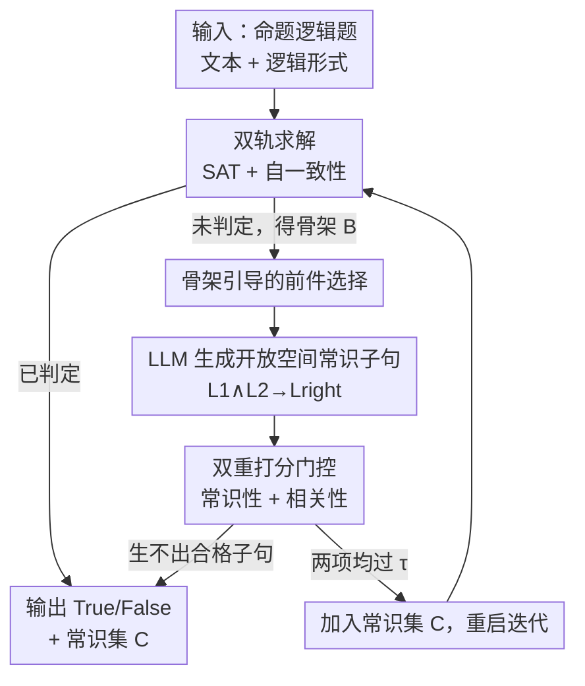

# A Balanced Neuro-Symbolic Approach for Commonsense Abductive Logic

**会议**: ICLR 2026  
**OpenReview**: [https://openreview.net/forum?id=RCsBoUr72G](https://openreview.net/forum?id=RCsBoUr72G)  
**代码**: 待确认  
**领域**: LLM推理 / 神经符号 / 溯因推理  
**关键词**: 溯因推理, 常识推理, 神经符号, SAT 求解器, 自一致性

## 一句话总结
ARGOS 让 LLM 和 SAT 求解器互相喂信息：求解器先吐出"已确定为真的文字"（骨架），LLM 据此猜出缺失的常识子句并打分过滤，再丢回求解器，如此迭代补全那些"光看题面推不出答案、缺常识假设"的逻辑题，在多个数据集上比纯神经/纯符号方法最多高 13%。

## 研究背景与动机

**领域现状**：要让 LLM 做严谨的逻辑推理，一条颇被看好的路线是"神经符号"——LLM 负责把自然语言题目翻译成形式逻辑，再交给 SAT/逻辑求解器去做真正的演绎。求解器在逻辑上既快又可靠，正好补上 LLM 不擅长"证明规划"（proof planning）的短板。

**现有痛点**：这类系统本质上是**纯演绎**的——求解器只会用题目里**明写出来的**前提去推导，但凡缺一条"人人都知道、所以没人会写出来"的常识，它就只能返回 "unknown"。论文用一个童书阅读题举例：题目说"北极狐冬天毛变白"，问"是因为白色吸收阳光更暖吗？"。求解器推不出对错，因为题面里没有"白色表面反光"这条常识；而人类一眼就能补上 $\text{turns\_white}(\text{fox},\text{winter}) \to \text{reflects}(\text{fox},\text{sun})$ 把题做出来。这种"补全缺失信息"的能力就是**溯因推理**（abductive reasoning）。

**核心矛盾**：已经有工作想用 LLM 来补常识，但它们都把"能补什么"的搜索空间卡得太死。Toroghi 等（LLM-Tres）只在题目已有命题上做穷举式的单步 modus ponens；Liu 等（Logic-of-Thought）只让 LLM 产出"本就能从已知逻辑演绎出来"的子句——可问题是，**真正能演绎出来的子句根本不增加新信息**，而真实题目缺的恰恰是题面里压根没出现过的命题。搜索空间太窄 → 补不出有用的常识；搜索空间放开 → 组合爆炸、还可能补进错误/无关的子句把题目逻辑搞坏。

**本文目标**：在**不严格限制常识子句形状与内容**的前提下做溯因，既要能引入题面从未出现过的新命题，又要让搜索代价可控、不破坏题目逻辑。

**核心 idea**：用**逻辑求解器的反馈**（具体是 SAT 问题的"骨架" backbone）来引导 LLM 的常识搜索——求解器告诉 LLM"目前哪些文字已确定为真、哪些实体最相关"，LLM 据此生成候选常识子句，再用两个 LLM 打分器（常识性 + 相关性）把关，迭代地把题目补全到可解。作者把这套系统命名为 **ARGOS**（Abductive Reasoning with Generalization Over Symbolics）。

## 方法详解

### 整体框架

ARGOS 把一道"缺常识、求解器推不动"的命题逻辑题，通过**迭代式补全**变成可解的题。每一轮分两件事：① **判定**——同时用 SAT 求解器和 LLM 自一致性尝试给出答案，谁成功就收工；② **扩充**——若都失败，就借助求解器返回的骨架，让 LLM 生成一条新的常识子句，过门控后加进题目，再回到第①步。这样神经和符号两侧不断互相喂信息，直到题目可判定或预算耗尽。

几个关键概念先交代清楚：题目是一组前提 $P=\{P_1,\dots,P_K\}$ 加一个查询 $Q$，目标是判定 $P\vdash Q$ 还是 $P\vdash\neg Q$。**溯因题**的特点是 $P$ 既推不出 $Q$ 也推不出 $\neg Q$（欠定），必须补上一组常识命题 $C$，使 $(P\wedge C)\vdash Q$ 或 $(P\wedge C)\vdash\neg Q$。求解器返回的**骨架**（backbone）定义为所有被前提蕴含的文字 $\text{backbone}(P)=\{L\in\mathcal{L}\mid P\vdash L\}$——直观说，就是"在当前题目下已经板上钉钉为真的那些命题"。论文还证明（附录 A）：只要补进的 $C$ 与 $P$ 不矛盾，最终答案不依赖于具体补了哪组 $C$，这是整套迭代式补全在逻辑上站得住脚的根基。

### 关键设计

**1. 双轨求解与自适应自一致性预算：先尝试判定，把算力花在难题上**

每一轮，ARGOS 先用 SAT 求解器 `sat_solve` 测当前 $(P\wedge C)$ 能否推出 $Q$ 或 $\neg Q$；推出来就结束，推不出来也至少拿到副产品——骨架 $B$，这正是后续搜索的燃料。与此同时，它用 $k$-shot 自一致性（实验取 $k=5$）让 LLM 直接投票判 True/False，当某一边的票数比例超过阈值 $\gamma$ 时也直接收工。妙处在 $\gamma$ 是**会衰减的**：初始 $\gamma=1$（要求全票一致才信 LLM），每轮 $\gamma\leftarrow\gamma-\alpha$（$\alpha=0.1$）。这等于说"一开始我只在 LLM 极度自信时才听它的，随着迭代越来越多、说明这题确实难，我就逐步放宽对 LLM 的信任门槛"。由于 $\gamma$ 降到 $0.5$ 时二分类投票必然过线，整体 COT 调用代价被卡在 $\text{cost}<k\,\frac{\gamma-0.5}{\alpha}$。实验也验证了这套机制让难题（需要更多 ARGOS 迭代的题）自动分到更多算力，而 SC 在这些题上准确率明显下滑，ARGOS 却没掉。

**2. 骨架引导的前件选择：用求解器反馈缩小常识搜索范围**

放开搜索空间后最大的风险是组合爆炸，ARGOS 用骨架把它压下来。它只在骨架文字里挑前件，构造形如 $L_1\wedge L_2\to L_{right}$ 的子句（$L_1,L_2\in B$）。挑选顺序按**实体重合度打分**：$\text{score}_B(L)=\#\{L'\in B\mid L'\text{ 与 }L\text{ 共享实体}\}$，分高的先挑。背后的直觉很朴素——若题目里关于 John 的关系有六条、关于 Jane 的只有一条，那这题多半是在问 John，因为"题目大部分信息都是干扰项"是罕见情况。通过 $L_1=L_2$ 可退化成单前件 $L_1\to L_{right}$，把 $\varnothing$ 也算进骨架则允许零前件 $\varnothing\to L_{right}$，于是 0/1/2 前件都覆盖到。这一步把"该往哪个方向补常识"从盲目枚举变成由求解器当前状态导引的有方向搜索。

**3. LLM 生成开放空间的常识子句：能溯因出题面从未出现的新命题**

这是 ARGOS 区别于前作的核心。给定一对前件 $L_1,L_2$，它让 LLM（`llm_generate`）**生成**右端文字 $L_{right}$，而且 $L_{right}$ 允许引入题目里**从未实例化过**的新变量/命题——这正是 LLM-Tres、Logic-of-Thought 不敢做、因而解不了实际题的地方。作者特意选**前向链式**（forward chaining，类似 COT）而非目标导向的后向链式，理由很实在：LLM 被 prompt 去做"从已知往前推"远比做"从目标递归回溯"（如 LAMBADA）容易、稳定。前面北极狐的例子里，ARGOS 正是这样三步生成 $\text{turns\_white}\to\text{reflects}$、$\text{reflects}\to\neg\text{absorbs}(\text{fox})$、最后 $\to\neg\text{absorbs}(\text{white},\text{sun})$，把"白色不吸光"这条题面完全没有的命题溯因出来，从而判出查询为假。

**4. 双重打分门控：常识性 + 相关性，挡住会污染逻辑的子句**

LLM 生成的子句不能照单全收——补错会改变题目答案。ARGOS 用同一个 LLM 打两道分：`llm_commonsense_score` 判 $L_1\wedge L_2\to L_{right}$ 是否真的是常识（论文对"常识"的操作定义是"无任何上下文时 LLM 也觉得它为真"），`llm_relevance_score` 判它与当前题目是否相关，两者各返回 $[0,1]$ 的概率。只有**两项都超过阈值 $\tau$**（实验取 $\tau=0.3$）的第一条子句才被采纳、加入 $C$ 并重启迭代；若一轮搜不出合格子句，或自一致性阈值已降到 0，就退回当前自一致性的最佳猜测作答。常识性打分对应附录 A 的理论保证（只要子句确为常识就不会破坏逻辑），相关性打分则避免补进一堆正确但跑题的废话。实测在 CLUTRR 上 ARGOS **从未污染过任何题目**，且在 65% 的题里补出了对求证真正关键的新变量。

### 一个完整示例：北极狐为什么不靠白毛取暖

以引言里的北极狐题走一遍（为简化只用 SAT 求解器、不用自一致性）。初始 $C=\varnothing$。

1. 调 SAT 求解器，推不出结论，但返回初始骨架。算法从骨架挑 $L_1=L_2=\text{turns\_white}(\text{fox},\text{winter})$，让 LLM 生成 $\text{turns\_white}(\text{fox},\text{winter})\to\text{reflects}(\text{fox},\text{sun})$；常识且相关，采纳。
2. 再调求解器，骨架新增 $\text{reflects}(\text{fox},\text{sun})$。算法挑该文字生成 $\text{reflects}(\text{fox},\text{sun})\to\neg\text{absorbs}(\text{fox},\text{sun})$，同样过关。
3. 求解器再跑，骨架新增 $\neg\text{absorbs}(\text{fox},\text{sun})$。第三轮挑 $L_1=\neg\text{absorbs}(\text{fox},\text{sun})$、$L_2=\text{turns\_white}(\text{fox},\text{winter})$，生成 $\neg\text{absorbs}(\text{fox},\text{sun})\wedge\text{turns\_white}(\text{fox},\text{winter})\to\neg\text{absorbs}(\text{white},\text{sun})$。
4. 最后一次调求解器，得出 $\neg\text{absorbs}(\text{white},\text{sun})$ 为真，与查询"白色吸光更暖"矛盾，于是判 $P\wedge C\vdash\neg Q$——查询为假。

每一步"挑骨架 → 生成子句 → 求解器扩骨架"的滚动，正是神经与符号互相喂信息把题做出来的缩影。

## 实验关键数据

**模型**：Llama3-8B（L8B）、Llama3-70B（L70B）、Mistral-7B（M7B）。因为方法依赖 logit 级输出，闭源模型被排除。逻辑求解器用 Cadical。为公平对比，把 ARGOS 超参设到平均每题 COT 调用 ≤ 20 次，对齐 20-shot 自一致性与 LoT-20。

### 主实验

二分类（True/False）准确率，下表取 Llama3-8B 上的代表性数据集（FOLIO 最贴近人类生成的逻辑题，QUAIL 是格式混乱的高歧义阅读理解题）：

| 数据集 (L8B) | SC-20 | COT | SAT-LM | LoT-20 | LLM-Tres | ARGOS |
|--------------|-------|-----|--------|--------|----------|-------|
| FOLIO | 71% | 68% | 43% | 69% | 63% | **81%** |
| CLUTRR | 69% | 68% | 50% | 70% | 51% | **76%** |
| QUAIL | 68% | 65% | 53% | 56% | 60% | **82%** |
| ProntoQA | 95% | 90% | 50% | 97% | 83% | 97% |

ARGOS 相对最强基线最多 +13%（QUAIL）。纯符号方法（SAT-LM、LoT-20、LLM-Tres）在缺常识的题上大面积崩塌，SAT-LM 多个数据集退化成 50% 瞎猜；LLM-Tres 虽有溯因能力，但搜索空间太窄，几乎补不出 CLUTRR/ESNLI 所需的规则。在 ProntoQA/ESNLI/CosmosQA 这类已被自一致性"刷满"的简单任务上，ARGOS 也能持平神经基线、不像符号方法那样性能崩盘。

### 消融实验

去掉两大核心组件（FOLIO，Llama3-8B）：

| 配置 | 准确率 | 说明 |
|------|--------|------|
| ARGOS（完整） | 81% | 完整模型 |
| ARGOS − No T | 79% | 去掉打分阈值，每轮取第一条采样子句 |
| ARGOS − No BB | 79% | 去掉骨架追踪，随机选两个变量当前件 |
| ARGOS − No Both | 76% | 两者都去 |
| SC-20（基线） | 71% | 最强基线 |

### 关键发现

- **两组件协同 > 各自之和**：同时去掉打分与骨架（76%）比单去任一（各 79%）掉得更多，说明"骨架引导选前件"和"打分过滤子句"是配套的——前者管"往哪搜"，后者管"信不信"，缺一就互相拖累。
- **全消融仍强于基线**：即便两者都去，ARGOS 仍有 76% > SC-20 的 71%，说明"用求解器反馈迭代补常识"这个总框架本身就有效。
- **难题自动分到更多算力**：随 ARGOS 迭代轮数增加，SC 的正确率明显下滑（题更难），ARGOS 却保持平稳，证明衰减阈值机制确实把缺信息越多的题分配了越多迭代来溯因。
- **补的子句几乎不"帮倒忙"**：CLUTRR L70B 上，ARGOS 把答案从错翻对 112 次、从对翻错仅 35 次；且随迭代增加，正确翻转增长远快于错误翻转。CLUTRR 上更是从未污染过任何题目。
- **翻译鲁棒性**：即便混入失败的逻辑翻译，FOLIO 上 ARGOS 仅从 80% 微降到 78%、QUAIL 从 82% 降到 73%，仍是各自最佳方法，说明"翻译"和"推理"解耦是合理的。

## 亮点与洞察

- **把求解器的"副产品"变成搜索的导航**：别人调 SAT 只关心"解没解出来"，ARGOS 抓住失败时返回的骨架，把它当成"该往哪补常识"的信号。这种"让符号端的中间状态去引导神经端的生成"的思路，可迁移到任何 LLM+工具的迭代系统。
- **衰减阈值是个低成本的自适应算力分配器**：不需要额外训练难度预测器，仅靠"迭代越多越说明题难、就越放宽对 LLM 的信任"这一条规则，就实现了"难题多花算力、易题快收工"，还顺带给出了 COT 调用次数的硬上界。
- **"放开搜索空间 + 双重打分把关"是一对**：敢让 LLM 引入题面没有的新命题（提升上限），同时用常识性+相关性双门控兜底（保住下限），且有附录 A 的理论保证背书——这套"放开但可控"的范式很值得借鉴。
- **前向链式而非后向链式的工程取舍**：作者直白承认选前向是因为 LLM 更好 prompt，是务实而非追求理论优雅的选择，对落地有参考意义。

## 局限与展望

- **依赖 logit 级输出**：自一致性投票与打分都需要概率，直接把强闭源模型（GPT-4 类）排除在外，限制了能用的模型范围。
- **常识打分不完美**：理论保证只在"补进的确为常识"时成立，而 `llm_commonsense_score` 并不可靠，仍可能放进非常识子句污染逻辑（CLUTRR 上恰好没翻车，但这依赖该数据集结构严格、可校验，不保证泛化）。
- **假设有干净的逻辑翻译**：主实验默认从命题逻辑形式出发，部分数据集还是用 Claude Opus 4 翻译并过滤掉失败样本；虽然补充实验显示混入失败翻译只微降，但"翻译质量"始终是这条流水线的外部依赖。
- **可用数据集稀缺**：天然"强逻辑结构 + 需常识溯因"的自然语言数据集很少，作者只能对现有数据集做改造（去掉部分常识、把多选改 True/False），评测设定多少带人工痕迹。
- **改进方向**：把常识/相关性打分换成更可靠的校准模型或引入外部知识库做交叉验证，或将骨架引导扩展到一阶逻辑层面而非先 grounding 成命题逻辑。

## 相关工作与启发

- **vs Chain-of-Thought / Self-Consistency（Wei、Wang）**：纯神经方法，靠 LLM 一路推；强在简单任务，弱在证明规划——步骤常"事实正确但无价值"。ARGOS 把符号求解器接进来补规划能力，并在 SC 失败的难题上靠迭代溯因把答案翻对。
- **vs SAT-LM / Logic-LM（Ye、Pan）**：纯符号路线，LLM 只管翻译、求解器做演绎；缺常识就直接 "unknown"，多个数据集退化成瞎猜。ARGOS 的扩充模块正是补上它们最缺的"缺失常识"。
- **vs Logic-of-Thought（Liu）**：用 LLM 产出"可由已知演绎出来"的子句——但这些子句不增加新信息，搜索空间封闭。ARGOS 允许溯因出题面从未有过的新命题，信息量真正增加。
- **vs LLM-Tres（Toroghi）**：同样有溯因能力，但只在题目已有命题上穷举单步 modus ponens，搜索空间极窄，CLUTRR/ESNLI 上几乎补不出必要规则。ARGOS 用骨架引导 + 开放生成，在不爆炸的前提下覆盖远大的搜索空间。

## 评分
- 新颖性: ⭐⭐⭐⭐ 把 SAT 骨架当反馈引导 LLM 做开放空间溯因，并配双重打分门控，框架清晰且有理论保证。
- 实验充分度: ⭐⭐⭐⭐ 8 数据集 × 3 模型 + 消融 + 翻译鲁棒性 + 子句有用性/污染分析，较全面；受限于可用数据集稀缺需自行改造。
- 写作质量: ⭐⭐⭐⭐ 北极狐贯穿全文、概念铺垫扎实，符号-语言谱系图定位清楚。
- 价值: ⭐⭐⭐⭐ 把神经符号推理从"纯演绎"推进到"可溯因"，为缺常识的真实逻辑题给出可落地范式。

<!-- RELATED:START -->

## 相关论文

- [\[ICLR 2026\] VERICOT: Neuro-Symbolic Chain-of-Thought Validation via Logical Consistency Checks](vericot_neuro-symbolic_chain-of-thought_validation_via_logical_consistency_check.md)
- [\[ACL 2025\] Commonsense Abductive Reasoning using Knowledge from Multiple Sources](../../ACL2025/llm_reasoning/commonsense_abductive_reasoning_using_knowledge_from_multiple_sources.md)
- [\[AAAI 2026\] NeSTR: A Neuro-Symbolic Abductive Framework for Temporal Reasoning in Large Language Models](../../AAAI2026/llm_reasoning/nestr_a_neuro-symbolic_abductive_framework_for_temporal_reasoning_in_large_langu.md)
- [\[ICLR 2026\] ProofFlow: A Dependency Graph Approach to Faithful Proof Autoformalization](proofflow_a_dependency_graph_approach_to_faithful_proof_autoformalization.md)
- [\[ICLR 2026\] Strategic Scaling of Test-Time Compute: A Bandit Learning Approach](strategic_scaling_of_test-time_compute_a_bandit_learning_approach.md)

<!-- RELATED:END -->
