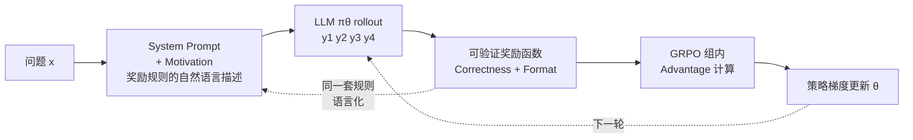

# A Simple "Motivation" Can Enhance Reinforcement Finetuning of Large Reasoning Models

**会议**: ICLR 2026  
**OpenReview**: [https://openreview.net/forum?id=3owSlsYDQf](https://openreview.net/forum?id=3owSlsYDQf)  
**代码**: 待确认  
**领域**: LLM 推理 / 强化学习  
**关键词**: RLVR, 上下文学习, 奖励函数描述, GRPO, 可验证奖励, 探索效率  

## 一句话总结
MeRF 把可验证奖励函数用自然语言写进 prompt，作为"游戏规则说明书"在 RL 训练时直接告诉模型优化目标，让大推理模型不再盲目试错，在逻辑/数学推理任务上显著超越 RLVR baseline。

## 研究背景与动机
**领域现状**：RLVR（Reinforcement Learning with Verifiable Rewards）已成为提升大推理模型能力的主流范式——把推理当作序贯决策，用规则可验证的奖励（如答案是否匹配 ground truth、代码能否通过单测）来优化模型，DeepSeek-R1、OpenAI-o1 都是其代表。

**现有痛点**：RLVR 沿袭了传统 RL 的"试错"本质。训练时模型对优化目标是**黑盒无感知**的，只能靠反复 rollout、采样、比较奖励，从碎片化的稀疏奖励信号里慢慢拼凑出任务规律。当奖励空间稀疏、期望行为难以触达时，模型常常陷入"你需要学会一件你既不知道怎么做、甚至不知道它存在的事"的悖论，要么需要海量算力，要么直接 reward hacking 收敛到局部最优（只拿格式分）。

**核心矛盾**：一方面 RLVR 的奖励函数是**规则可验证**的，天然能用自然语言完整描述；另一方面 LLM 本身具有强大的 **in-context learning** 能力，能从 prompt 上下文中学习。既然如此——**为什么不在训练时直接把"评分规则"告诉模型**？这正像人类学习：开工前先理解任务规则和目标，能让努力对齐期望产出，学得更快更准。

**本文目标**：在不改变 RL 算法、不增加训练成本的前提下，把奖励函数的信息流以更直接的方式注入训练过程，让模型在生成时就"知道游戏规则"，从而提升 RL finetuning 的效率与效果。

**核心 idea**：**「把奖励函数写成自然语言塞进 prompt 当 motivation」**——MeRF 直接把评分规则（correctness score + format score）作为 in-context motivation 注入训练时的 system prompt，让模型在内在动机（motivation）与外在奖励（reward function）双重驱动下生成期望输出。

## 方法详解

### 整体框架
MeRF（Motivation-enhanced Reinforcement Finetuning）对标准 RLVR 管线只做一个改动：在训练 rollout 时，把奖励函数的自然语言描述（motivation）拼进 system prompt。其余流程——GRPO 采样一组响应、用规则化奖励函数打分、计算 advantage、policy gradient 更新 $\theta$——全部保持不变。关键直觉是：标准 RLVR 让模型只能通过参数更新间接、碎片化地感知奖励空间，而 MeRF 让模型在生成那一刻就对整个奖励空间有全局认知，把"间接黑盒学习"变成"内在动机 + 外在奖励"的双通道对齐。

### 关键设计

**1. In-context Motivation 注入：把奖励函数语言化塞进 prompt。** MeRF 的全部魔法都在这一步。由于 RLVR 的奖励是规则可验证的，作者把它逐条翻译成自然语言写进 system prompt。以 K&K 逻辑谜题为例，奖励含两部分：Correctness Score（答案正确 +2，可理解但错误 -1.5，无法解析/不完整 -2）和 Format Score（严格遵守 `<think>...</think><answer>...</answer>` 标签 +1，否则 -1），最终分数为两者之和。这段"Evaluation Scoring Rules"原封不动写进 prompt，模型在生成时就对照规则优化，让生成分布 $\pi_\theta(\cdot|x)$ 直接对齐优化目标 $\arg\max_\theta \mathbb{E}[R(y)]$。这一步不引入任何额外可学习参数、不改奖励函数本身，只是改了喂给模型的上下文。

**2. 内外双驱动对齐：内在 motivation 与外在 reward 协同。** 标准 RLVR 中模型只有外部奖励这一根"绳子"牵引，且只有当某条 rollout 恰好拿到高奖励时才学得到。MeRF 则让模型同时受内在动机（prompt 里的规则认知）和外在奖励（实际打分）两路信号驱动。作者通过对照实验厘清了这两路的分工（Figure 2 Right）：Base 模型单凭 motivation 推理并不涨点，说明光"读规则"不训练没用；而把 motivation 用进训练（MeRF）才带来显著提升（相对 RLVR 涨 27%/25%）。结论是——**性能增益主要来自训练过程，而非推理时的 in-context 提示**。motivation 的作用是在训练早期给探索"指方向"，让模型把算力花在更有希望的输出空间区域。

**3. 探索能力放大：用 entropy 维持避免坍缩。** MeRF 之所以训练更高效，机制在于它改善了 RL 探索动力学。作者用 pass@k 和 entropy 两个指标拆解：MeRF 在训练全程维持比 RLVR 更高的 entropy——训练初期 MeRF entropy 反而略低（结构化探索聚焦于有希望的区域），但随训练推进 RLVR 的 entropy 快速衰减、坍缩到次优解（只拿格式分），而 MeRF 凭借奖励空间的全局信息维持住探索能力。由于 GRPO 的 rollout 组大小恰为 8，pass@8 的持续改善尤其关键：训练过程会**逐步放大**初始来自 motivation 的 pass@8 优势，使模型更可能采到正奖励样本用于优化。这也解释了为什么"推理时加不加 motivation"差别很小（仅 2-4%），但"训练时加不加"差别巨大。

**4. Motivation 一致性与对抗鲁棒性。** 作者进一步探究 motivation 与真实奖励函数的一致性如何影响效果，设计了三档：Ground-Truth（完全匹配奖励函数）、Suboptimal（只描述 correctness 分、信息不全）、Adverse（描述完整但所有分值取反，故意误导模型给错答案）。结果显示一致性越高效果越好：Ground-Truth 最优，Suboptimal 因多了一条 correctness 描述也强于 RLVR baseline。最有意思的是 Adverse——初期因 motivation 与真实奖励矛盾出现性能下降和不稳定学习，但经过若干轮 RL 后**模型学会了"打折/反转"这个误导信号**，要么把它当无信息噪声，要么理解其故意取反的语义，最终仍能超过 RLVR baseline 和 Suboptimal（因为它至少提供了完整的奖励结构描述）。这说明 motivation 的"完整性"比"正确性"更有价值，且 RL 训练赋予模型对抗错误提示的适应能力。

## 实验关键数据

### 主实验表格（K&K 逻辑谜题，按人数难度，验证时**均不带 motivation**）

| 模型 | Avg (3-7人, in-domain) | 2人 (OOD) | 8人 (OOD) | 总 Avg |
|------|:---:|:---:|:---:|:---:|
| Qwen2.5-7B-Instruct (起点) | 0.10 | 0.43 | 0.00 | 0.13 |
| +RLVR (baseline) | 0.51 | 0.71 | 0.28 | 0.51 |
| **+MeRF (ours)** | **0.65** | **0.76** | **0.39** | **0.63** |
| Qwen2.5-14B-Instruct (起点) | 0.23 | 0.63 | 0.06 | 0.27 |
| +RLVR (baseline) | 0.75 | 0.90 | 0.42 | 0.72 |
| **+MeRF (ours)** | **0.83** | **0.99** | **0.65** | **0.83** |
| DeepSeek-R1-Distill-Llama-8B + MeRF | **0.88** | **0.99** | **0.64** | **0.86** |

MeRF 在 6 个不同规模/家族/指令微调阶段的模型上全部超越 RLVR baseline，14B 版本甚至追平商业模型水平，且 OOD（2 人 / 8 人）场景同样提升明显。

### 消融/分析实验表格（MATH 数学推理，Qwen2.5-7B-Base 起点，pass@k）

| 数据集 | RLVR pass@1 | MeRF pass@1 | RLVR pass@8 | MeRF pass@8 |
|------|:---:|:---:|:---:|:---:|
| AIME24 | 16.7 | **20.0** | 26.7 | **30.0** |
| AIME25 | 6.7 | 6.7 | 20.0 | **26.7** |
| AMC23 | 47.5 | **55.0** | 72.5 | **77.5** |
| MATH500 | 62.6 | **65.4** | 82.6 | **85.6** |
| **平均** | 33.38 | **36.78 (+3.40)** | 50.45 | **54.95 (+4.50)** |

pass@1/2/4/8 平均分别提升 +3.40 / +1.13 / +3.50 / +4.50。

### 关键发现
- **训练效率显著**：K&K 上 MeRF 在 step 140 的 pass@4/pass@8 就超过 RLVR 训到 step 280 的最终模型；RLVR 的 pass@4/8 在 step 140 后几乎不再提升，MATH500 上 RLVR pass@8 在 step 80 后停滞。
- **增益来自训练而非推理**：推理时加/不加 motivation 仅差 2-4%，但 MeRF 相对 RLVR 涨 25-27%。
- **训练-验证 gap 可忽略**：训练带 motivation、验证不带 motivation，两种验证设置性能相当，说明模型能泛化。
- **entropy 不坍缩**：MeRF 全程维持更高 entropy，避免 RLVR 式的快速坍缩到次优解；correct ratio 也持续更高。
- **对抗适应**：即便给故意误导的 Adverse motivation，模型经 RL 训练后仍能学会打折/反转该信号并超过 baseline。

## 亮点与洞察
- **极简却有效**：方法本质是"改 prompt"，零额外参数、零额外算力、不动 RL 算法，却带来一致且显著的提升，工程落地几乎无成本。
- **重新诠释 RLVR 的信息流问题**：把 RLVR 效率低的根因归结为"模型对奖励空间的盲视"，并巧妙利用 RLVR 奖励"可被自然语言描述"这一被忽视的性质——可验证 ⟹ 可语言化 ⟹ 可作为 in-context 信号。
- **机制分析扎实**：用 pass@k 放大效应 + entropy 维持两条线索把"为什么有效"讲清楚，而非只给 SOTA 数字；尤其 pass@8 与 GRPO 组大小的对应关系很有说服力。
- **对抗 motivation 实验**：揭示了 LLM 在 RL 中对错误上下文的鲁棒性与自适应能力，是有独立价值的观察。

## 局限与展望
- **motivation 是静态的**：整个训练过程 motivation 固定不变，作者指出未来可探索**动态 motivation**（随训练阶段调整规则描述的详略/侧重）。
- **弱泛化模型受限**：对泛化能力弱的小模型（如 1.5B），如何高效实现 RLVR 并更好利用 in-context motivation 仍是开放问题——表中 DeepSeek-R1-Distill-Qwen-1.5B 的提升幅度明显小于大模型。
- **依赖奖励可语言化**：方法前提是奖励函数能被清晰地自然语言描述，对于难以言述（如复杂偏好、隐式人类反馈）的奖励，motivation 的构造本身会成为瓶颈。
- **prompt 长度成本**：把完整评分规则塞进每条训练样本会增加 context 长度，对长上下文任务的开销与影响未充分讨论。

## 相关工作与启发
- **RL for LLMs**：从 RLHF（对齐人类偏好）到 RLVR（用可验证成功标准替代主观人类判断），本文延续 RLVR 路线但指出其未充分利用 LLM 的 in-context 能力。
- **In-context Learning**：ICL 让 LLM 无需梯度更新即可从 prompt 学习，催生了 few-shot、CoT、self-consistency 等 prompting 策略；本文首次把 ICL 与 RL finetuning 结合——**用 prompt 注入的规则信息去引导梯度更新的方向**。
- **启发**：这条思路提示，凡是"奖励/目标可被语言描述"的 RL 场景（代码、工具调用、agent 任务），都可考虑把奖励规格直接作为 in-context motivation 注入训练，把外部奖励的"事后反馈"前置为"事前认知"，从而缓解稀疏奖励下的探索难题。

## 评分
- **新颖性**: ⭐⭐⭐⭐ — 想法极简但角度新颖，"把可验证奖励语言化注入训练 prompt"此前未被系统研究，对 RLVR 信息流的重新诠释有启发性。
- **实验充分度**: ⭐⭐⭐⭐ — 覆盖 6 个模型、逻辑/数学/数字游戏多类任务、in-domain 与 OOD，并配 pass@k/entropy/correct-ratio/对抗 motivation 等多维机制分析，较为扎实；但缺少代码生成等更广任务、prompt 开销分析。
- **写作质量**: ⭐⭐⭐⭐ — 动机叙述清晰（人类学习类比贴切），机制分析用 Q1-Q4 层层递进，takeaway 总结到位。
- **价值**: ⭐⭐⭐⭐ — 近乎零成本即插即用，对 RLVR 训练效率有实际提升，适用面广，工程与研究价值兼具。

<!-- RELATED:START -->

## 相关论文

- [\[ICLR 2026\] GPG: A Simple and Strong Reinforcement Learning Baseline for Model Reasoning](gpg_a_simple_and_strong_reinforcement_learning_baseline_for_model_reasoning.md)
- [\[ICLR 2026\] Conditional Advantage Estimation for Reinforcement Learning in Large Reasoning Models](conditional_advantage_estimation_for_reinforcement_learning_in_large_reasoning_m.md)
- [\[ICLR 2026\] Dynamics-Predictive Sampling for Active RL Finetuning of Large Reasoning Models](dynamics-predictive_sampling_for_active_rl_finetuning_of_large_reasoning_models.md)
- [\[ICLR 2026\] Learning What Reinforcement Learning Can't: Interleaved Online Fine-Tuning for Hardest Questions](learning_what_reinforcement_learning_cant_interleaved_online_fine-tuning_for_har.md)
- [\[ICLR 2026\] R-HORIZON: How Far Can Your Large Reasoning Model Really Go in Breadth and Depth?](r-horizon_how_far_can_your_large_reasoning_model_really_go_in_breadth_and_depth.md)

<!-- RELATED:END -->
