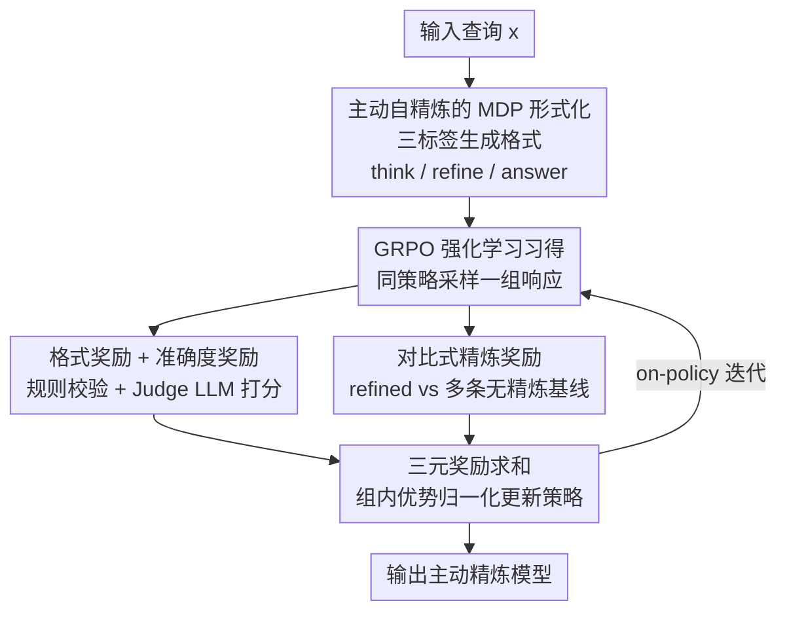

# A Stitch in Time Saves Nine: Proactive Self-Refinement for Language Models

**会议**: ICLR2026  
**OpenReview**: [https://openreview.net/forum?id=0GaCfBRFnf](https://openreview.net/forum?id=0GaCfBRFnf)  
**代码**: https://github.com/JinyiHan99/Proactive-Self-Refine-in-LLMs/  
**领域**: LLM推理  
**关键词**: 自精炼, 强化学习, GRPO, 过程内精炼, 奖励设计

## 一句话总结
PASR 用强化学习（GRPO）训练 LLM 在**生成过程中**主动决定"是否/何时/如何"精炼自己的推理轨迹（而非生成完再返工），并设计了一套"对比式精炼奖励"鼓励有价值的修正；在 Qwen3-8B 上相比标准生成把平均 token 消耗降低 41.6% 的同时准确率提升 8.2%。

## 研究背景与动机

**领域现状**：自精炼（self-refinement）被认为是 LLM 提升输出质量的重要方向。现有方法几乎都是"事后打补丁"（patch-after-failure / post-hoc）范式：先生成一个完整答案，再基于反馈一轮一轮地改。实现上分两派——一派靠精心设计的 prompt 显式命令模型"检查并改正上一次输出"；另一派靠在"劣质答案→改进答案"配对的合成数据上做 SFT，让模型学会自动改写。

**现有痛点**：这类 post-hoc 方法本质上是**被动反应式**的，缺乏对"是否/何时/如何"精炼的主动判断能力。论文把痛点拆成三个字：

- **Whether（是否）**：精炼常常被无脑地套在初始生成之后，需要多轮迭代，但最优轮数说不清，往往要大量调参。
- **When（何时）**：初始生成阶段产生的错误会沿着后续步骤传播，等整段生成完再回头改，纠错难度更大——"小洞不补，大洞吃苦"（A stitch in time saves nine）。
- **How（如何）**：这些方法高度依赖外部反馈（工具评测、辅助模型），而不恰当的反馈反而会让性能变差。

**核心矛盾**：真正想要的是让模型在**生成进行中**就能根据上下文自主判断要不要改、改哪里。虽然 DeepSeek-R1、o1 这类推理模型表现出一些"过程中修正"的苗头，但这些行为既不是为主动自精炼显式设计的，也没被系统评估过其对输出质量的影响，机制不明。

**切入角度**：一个直接想法是"用主动精炼的示范数据去训练模型"，但作者指出这条路有两个硬伤：① 示范数据难构造——"生成过程中精炼的最优时机"本身就难以定义，从更强的 LLM 蒸馏也不现实；② 单纯模仿示范不足以让模型真正习得该能力，模型很难把自适应精炼泛化到没见过的任务，有时性能反而下降。

**核心 idea**：用**强化学习**而非模仿来习得这一能力。提出 PASR（ProActive Self-Refinement），通过同策略（on-policy）rollout 让模型自己去探索"是否/何时/如何"精炼，并用一套**对比式奖励**告诉模型"什么样的精炼才算有效"——只在精炼带来可度量收益时给正奖励，否则惩罚多余或有害的修改。

## 方法详解

### 整体框架

PASR 把"主动自精炼"形式化为一个序列决策（MDP）问题，并用 GRPO 强化学习来训练。给定输入查询 $x$，模型一边生成一条中间轨迹 $z=(z_1,\dots,z_T)$ 一边在每一步从动作空间中二选一：**内容生成** $a_{\text{gen}}$（把推理往前推一步，续写在轨迹末尾）或**轨迹精炼** $a_{\text{refine}}$（不前进，而是回看已生成内容、找出薄弱处并补上纠正/澄清）。最终答案 $y'$ 由完整轨迹导出。

训练时，模型的输出被强制套进 `<think> / <refine> / <answer>` 三个标签构成的结构化格式里（rollout 阶段由 system prompt 引导），然后对每条采样响应算一个总奖励 $R_{y'}$，再用 GRPO 做组内优势归一化更新策略。总奖励由三部分相加：格式奖励、准确度奖励、以及最关键的"对比式精炼奖励"。整条管线如下图：

### 关键设计

**1. 主动自精炼的 MDP 形式化与三标签生成格式：让"过程中精炼"成为可生成的结构**

针对 post-hoc 方法"生成完才返工、错误已传播"的 When 痛点，PASR 把精炼搬进生成过程本身。它先把任务形式化为 MDP：在第 $i$ 步，状态 $s_i$ 由输入 $x$ 与已生成轨迹 $z_{1:i-1}$ 决定，动作 $a_i$ 从 $\{a_{\text{gen}}, a_{\text{refine}}\}$ 中选，训练目标是学到最大化期望精炼奖励的策略 $\max_\pi \sum_x \mathbb{E}_{y'\sim\pi(\cdot|x)}[R_{y'}]$。论文还把"精炼"细化为四种语义类型：**纠错**（修正事实/逻辑/计算错误）、**信息补全**（补上缺失但关键的细节）、**方案改进**（换更优策略或更精炼表述）、**任务对齐**（发现跑偏时拉回任务目标）。

落地手段是一套三标签格式：`<think>` 包住整条推理轨迹，`<refine>` **必须嵌套在 `<think>` 内部**、标记模型回头修订/改进先前内容的片段，`<answer>` 给最终答案。每个 `<refine>` 段之后模型基于更新后的内容继续推理，使精炼能直接影响后续步骤；模型还被鼓励**递归精炼**——在一次生成里多次触发 `<refine>`。这种结构让"推理 / 精炼 / 作答"三个阶段语义上清晰可分，也让"是否/何时/如何精炼"变成模型可以自己生成、并被奖励信号塑造的行为。

**2. 用 GRPO 强化学习习得，而非 prompt 或 SFT**

针对动机里点明的两个硬伤（示范数据难构造、模仿学不会泛化），PASR 选择用 RL 让模型自己探索而不是模仿示范。具体采用 GRPO（PPO 的一个变体，靠组内优势归一化稳定训练）：对每个查询 $x$，策略 $\pi_\theta$ 采样一组候选响应 $G_x=\{(y'_1,R_{y'_1}),\dots,(y'_n,R_{y'_n})\}$，每条响应的优势按组内均值方差归一化

$$A_i(y'_i|x)=\frac{R_{y'_i}-\mu_x}{\sigma_x+\xi}$$

目标函数 $J_{\text{GRPO}}(\theta)$ 在 PPO 式的裁剪比率项之外再加一项对参考策略的 KL 惩罚 $-\beta D_{\text{KL}}(\pi_\theta\|\pi_{\text{ref}})$，防止策略偏移过大、过度优化。论文用实验证明这一选择是必要的：把同样的能力改用 prompt 注入（PASR+prompt）会让性能全面下滑（两个 backbone 平均跌 16.9 和 9.5），改用指令微调注入（PASR+IFT）则泛化很差（Qwen3-8B 上比基座还低 8.3）——说明主动自精炼不是模型天生就有、也不是 SFT 能可靠习得的能力，必须靠奖励信号去塑造。

**3. 格式奖励 + Judge 准确度奖励：混合奖励的基座**

RL 要可训练就得有可算的奖励。PASR 用规则 + 模型混合的方式构造前两项奖励。**格式奖励** $r_{\text{format}}$ 检查三条结构约束：C1 输出必须同时含 `<think>` 和 `<answer>` 标签对（`<refine>` 可选）、C2 若出现 `<refine>` 必须正确嵌套在 `<think>` 内、C3 三个标签的相对顺序不能乱。当且仅当三条全满足才给 +1，否则 −1：

$$r_{\text{format}}(y')=2\big(C_1(y')\,C_2(y')\,C_3(y')\big)-1$$

这种严格二值方案保证只有完全规整的输出才被正向强化。**准确度奖励** $r_{\text{acc}}$ 则因为训练数据来自开放域指令（答案自由形式、规则匹配/精确字符串失效），改用一个更强的 LLM 当裁判：把原始问题 $x$、生成答案 $y'$、参考答案 $\hat y$ 一起喂给判定函数 $J$，输出 $[0,1]$ 的连续分 $r_{\text{acc}}(y')=J(x,\hat y,y')$，反映生成答案相对参考的语义质量与任务相关性。

**4. 对比式精炼奖励：用代理评估告诉模型"什么精炼才算有效"**

这是 PASR 的核心创新，针对的是 RL 里最难的问题——奖励一旦没对齐，模型要么错过该精炼的机会，要么对已经正确的输出做多余修改。难点在于"自适应精炼是否有效"很难直接度量，于是作者用**代理评估**：把带精炼的响应 $y'$ 与一批**不带精炼**的标准响应 $y$ 作比较。考虑生成的随机性，对每个查询采样多条标准响应来估计模型的期望准确度 $\bar r_{\text{acc}}(y)$，再按下式打分：

$$r_{\text{refine}}(y')=\begin{cases}1,& r_{\text{acc}}(y')>\bar r_{\text{acc}}(y)+\zeta\\ -1,& r_{\text{acc}}(y')<\bar r_{\text{acc}}(y)-\zeta\\ -0.5,& |r_{\text{acc}}(y')-\bar r_{\text{acc}}(y)|\le\zeta\end{cases}$$

其中 $\zeta$ 是容忍参数，对噪声和微小波动提供鲁棒性。三条原则一目了然：**奖励有效精炼**（精炼后显著比基线均值好给 +1）、**惩罚有害精炼**（比基线均值差给 −1）、**抑制多余精炼**（与基线均值相当时给小惩罚 −0.5，劝退冗余改动）。最终总奖励是三者相加

$$R_{y'}=r_{\text{format}}(y')+r_{\text{acc}}(y')+r_{\text{refine}}(y')$$

相比只用二值信号的方法，这种细粒度奖励既鼓励有意义的建设性精炼，又显式打压"改太多"和"改太少"两种失败。消融显示：把多答案基线换成单参考比较（w/o multi-answer）平均掉 4.5，把对比式奖励换成"只要触发精炼就给正分"（w/o comparison）平均掉 5.5——证明"多答案估期望 + 对比判定收益"两点都不可少。

### 一个完整示例

以论文 Figure 1 的逻辑谜题为例（"很多盒子，恰有一条陈述为真，金子在哪个盒子"）：

- **直接作答 / post-hoc**：模型一口气推出"金子在 A 盒"，事后被追问"再想想、重新检查"，第二轮又改口"金子在 B 盒"——整段重答、来回横跳，token 翻倍还不一定对。
- **PASR**：在 `<think>` 里先列系统化策略，遇到矛盾时进入 `<refine>`——"假设金子在 A，内部快速核验发现……；换个假设，若在 B……"，在精炼段里就地排除错误假设，退出 `<refine>` 后基于更新后的结论继续推理，最终 `<answer>` 给出"金子在 C 盒"。精炼是**生成途中**发生的、针对性的局部修订，而非整段重写。

定量分析也印证了这种"该改才改"：随机抽 384 题，其中 267 题基座答错，PASR 修正了其中 235 题，而原本答对的几乎不动；约 80% 样本精炼前后的语义一致性分超过 0.9，超过 85% 样本的"精炼过程与最终答案"对齐分超过 0.9——说明精炼是连贯地建立在初始生成之上、并真正导向了正确答案。

## 实验关键数据

### 主实验

在 Qwen2.5-7B 与 Qwen3-8B 两个 backbone、10 个数据集（GSM8K/MATH/AIME24 数学、ARC/GPQA 复杂推理、Wino/CSQA 常识、MMLU 知识、DROP 多跳、XSum 摘要）上评测泛化能力（训练只用通用指令数据 alpaca_evol_instruct 清洗后约 4 万条）。PASR† 指完整 RL 版本。

| Backbone | 方法 | AVG | 相对 Vanilla |
|----------|------|-----|--------------|
| Qwen2.5-7B | Vanilla | 55.9 | — |
| Qwen2.5-7B | Self-Refine+（带 oracle） | 62.3 | +6.4 |
| Qwen2.5-7B | PTR (ICLR'25) | 61.6 | +5.7 |
| Qwen2.5-7B | **PASR†** | **61.7** | **+5.8（论文记为 +4.8）** |
| Qwen3-8B | Vanilla | 60.9 | — |
| Qwen3-8B | Self-Refine+（带 oracle） | 72.8 | +11.9 |
| Qwen3-8B | SCoRe (ICLR'25) | 64.0 | +3.1 |
| Qwen3-8B | **PASR†** | **69.1** | **+8.2** |

关键观察：① PASR 在更难的任务上增益更明显（Qwen2.5-7B 的 MATH +5.2、Qwen3-8B 的 DROP +14.1）；② 唯一稳定超过 PASR 的是 **Self-Refine+，但它依赖 ground-truth 当 oracle**，而 PASR 不用任何外部反馈/任务专属监督，纯靠生成中的内在自适应决策；③ 更强的基座（Qwen3-8B）更能发挥主动自精炼，说明该能力与基座强度相关。⚠️ Qwen2.5-7B 上 Vanilla 55.9→PASR 61.7 实为 +5.8，但论文表注与正文均记作 +4.8，此处以原文表述为准。

### 消融实验

精炼奖励设计消融（Qwen2.5-7B）：

| 配置 | AVG | 说明 |
|------|-----|------|
| PASR（完整对比式奖励） | 61.7 | 多答案基线 + 对比判定 |
| w/o multi-answer | 57.2（−4.5） | 只跟单条标准答案比 |
| w/o comparison | 56.2（−5.5） | 只要触发精炼就给正分 |

能力注入方式消融：PASR+prompt（仅靠 prompt 命令模型精炼）两个 backbone 平均跌 16.9 / 9.5；PASR+IFT（指令微调注入）在 Qwen3-8B 上比基座还低 8.3。

### 关键发现

- **对比式奖励的两块都重要**：去掉多答案估计（单参考）掉 4.5，去掉对比判定（无脑奖励精炼动作）掉 5.5，后者掉得更狠，说明"必须比出收益才给奖励"是防止冗余精炼的关键。
- **效率因基座而异**：在会长篇思考的 Qwen3-8B 上，PASR 相比标准生成把 token 降 41.6% 还涨准确率（精炼比整段重写省）；而在思考较短的 Qwen2.5-7B 上 token 仅增约 8.4%。对照 PTR——它每步重写整段答案，token 开销显著更高。⚠️ token 数值据 Figure 3 与正文，柱状图原始数字以原文为准。
- **RL 是必要条件**：prompt 和 SFT 都无法可靠诱导出主动自精炼，强化学习的奖励塑造才行。

## 亮点与洞察

- **把"精炼时机"从超参变成可学的策略**：post-hoc 方法纠结"迭代几轮"，PASR 直接让模型在生成中自己决定是否/何时/如何精炼，绕开了调轮数这个老大难——这是从"被动反应"到"主动决策"的范式切换。
- **`<refine>` 嵌套在 `<think>` 内的格式设计很巧**：用纯文本标签就把"精炼是推理的一部分、且会反过来影响后续推理"这件事编码进生成格式，无需改架构，任何能 RL 的 LLM 都能套。
- **对比式代理奖励解决了"精炼有效性无法直接度量"的死结**：拿"带精炼 vs 多条不带精炼的期望准确度"作差，把一个抽象的"这次精炼值不值"问题变成可算的标量奖励，三档（+1/−1/−0.5）同时管住"漏改"和"乱改"。这套奖励思路可迁移到任何"额外动作是否划算"的 RL 场景（如是否调用工具、是否多想一步）。

## 局限与展望

- **依赖 Judge LLM 算准确度奖励**：开放域答案用更强 LLM 当裁判，裁判的偏差/成本会直接影响训练信号质量，论文未深入讨论裁判可靠性边界。
- **泛化有上限**：作者承认 PASR 在某些领域专属任务上不一定全面超过 baseline（尤其 Qwen2.5-7B），因为这些任务需要训练数据里没有的专门知识；且弱基座发挥不出该能力。
- **多答案采样带来训练开销**：对比式奖励需要为每个查询采样多条标准响应来估期望准确度，训练成本相比单参考更高，论文未给出开销-收益的量化权衡。
- **改进方向**：把裁判换成可验证奖励（数学/代码可自动判分）以减少对 LLM 裁判的依赖；探索 $\zeta$ 容忍参数与精炼频率的关系；在更长上下文/Agent 多步任务上验证递归精炼。

## 相关工作与启发

- **vs Self-Refine / Self-Refine+（NeurIPS'23）**：它们是 prompt 驱动的 post-hoc 单轮/多轮重写，Self-Refine+ 还要 ground-truth 当 oracle 才有明显增益；PASR 在生成过程中局部精炼、且完全不需外部反馈，省 token 又能涨分。
- **vs PTR（ICLR'25）**：PTR 用渐进式精炼数据做指令微调、每步重写整段答案，token 开销大且增益在强基座上衰减；PASR 用 RL 学"何时该改"，做的是针对性局部修订。
- **vs SCoRe（ICLR'25）**：SCoRe 也用多轮 RL 训自我纠正、不依赖 oracle，但仍是"答完再纠"的回合制；PASR 把精炼内嵌进单次生成轨迹，是过程内（in-process）而非回合间（turn-level）。
- **vs STaR / ISC / RISE（模仿/微调派）**：这些靠构造精炼轨迹做 SFT，PASR 的消融正说明这条路泛化差，强化学习的探索 + 对比式奖励才是习得主动自精炼的关键。

## 评分
- 新颖性: ⭐⭐⭐⭐⭐ 把自精炼从"事后回合制"推进到"生成过程内主动决策"，对比式精炼奖励是真正原创的奖励设计。
- 实验充分度: ⭐⭐⭐⭐ 10 任务 ×2 backbone + 奖励/注入方式双消融 + 三视角行为分析，扎实；token 图原始数字与个别 AVG 标注略有出入。
- 写作质量: ⭐⭐⭐⭐ 三个字（Whether/When/How）串起动机清晰，公式与图配合好；少量表述/数值不一致。
- 价值: ⭐⭐⭐⭐⭐ 既省 token 又涨准确率、不依赖外部反馈，奖励设计思路可迁移到工具调用等"额外动作是否划算"的 RL 场景。

<!-- RELATED:START -->

## 相关论文

- [\[ICLR 2026\] Plan-Answer-Refine-on-Graph: Structured Planning and Self-Refinement for Large Language Model Reasoning on Knowledge Graphs](plan-answer-refine-on-graph_structured_planning_and_self-refinement_for_large_la.md)
- [\[ICLR 2026\] Native Reasoning Models: Training Language Models to Reason on Unverifiable Data](native_reasoning_models_training_language_models_to_reason_on_unverifiable_data.md)
- [\[ICLR 2026\] Co-rewarding: Stable Self-supervised RL for Eliciting Reasoning in Large Language Models](co-rewarding_stable_self-supervised_rl_for_eliciting_reasoning_in_large_language.md)
- [\[ICLR 2026\] Vision-R1: Incentivizing Reasoning Capability in Multimodal Large Language Models](vision-r1_incentivizing_reasoning_capability_in_multimodal_large_language_models.md)
- [\[ICLR 2026\] Efficient Test-Time Scaling for Small Vision-Language Models](efficient_test-time_scaling_for_small_vision-language_models.md)

<!-- RELATED:END -->
