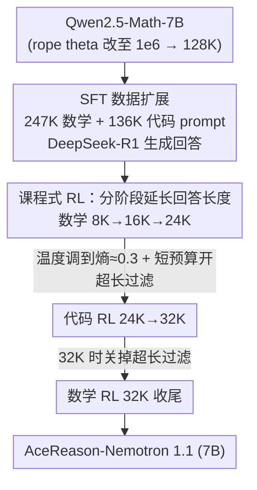

# AceReason-Nemotron 1.1: Advancing Math and Code Reasoning through SFT and RL Synergy

**会议**: ICLR2026  
**OpenReview**: [https://openreview.net/forum?id=IaEqjWXd1d](https://openreview.net/forum?id=IaEqjWXd1d)  
**代码**: 待确认  
**领域**: LLM推理  
**关键词**: 数学代码推理, SFT-RL协同, 课程式强化学习, 采样温度, 超长过滤

## 一句话总结
NVIDIA 系统性拆解了"监督微调（SFT）+ 大规模强化学习（RL）"在打造推理模型时的协同关系——通过扩 SFT 数据、按"熵≈0.3"调 RL 采样温度、分阶段延长回答长度，把一个 7B 模型（AceReason-Nemotron-1.1）刷到了 Qwen2.5-7B 同规模数学/代码推理的新 SOTA（AIME25 64.8、LiveCodeBench v6 52.1）。

## 研究背景与动机
**领域现状**：自 OpenAI o1 和 DeepSeek-R1 之后，"长思维链（long CoT）推理"成了前沿 LLM 推理能力跃升的主引擎，而它主要靠大规模、基于规则验证器（rule-based verifier）的 RL 习得。社区里两条路线并行：一条是把前沿大模型蒸馏进中小模型、只做 SFT（如 DeepSeek-R1-Distill-Qwen、Light-R1）；另一条是在 7B/14B 的 base 或 SFT 模型上复现大规模 RL（多以 DeepSeek-R1-Distill-Qwen 当初始化）。

**现有痛点**：几乎所有工作都把 SFT 和 RL 当成两个孤立环节，**SFT 与 RL 之间的协同关系几乎没人系统研究过**——前沿模型的技术报告里普遍缺这一块。具体来说，三个关键问题悬而未决：(1) 更强的 SFT 起点，经过大规模 RL 之后是不是一定换来更强的终点？(2) 给定一个 SFT 初始化，RL 训练的采样温度该怎么定，才能在探索与利用之间取得平衡？(3) 当回答被长度预算（如 24K token）截断、没产出最终答案时，到底该给负奖励还是直接整条样本屏蔽（超长过滤）？

**核心矛盾**：RL 训练的探索-利用权衡极其依赖采样温度，但温度太低会过度利用、熵塌缩，太高又会过度探索、初期奖励低导致学不动；同时 SFT 起点的"强弱"和 RL 终点的"高低"之间的因果关系并不是想当然的线性。

**本文目标**：把 SFT 和 RL 当成一条完整的后训练管线整体研究，回答上述三个问题，并据此产出一个 SOTA 级 7B 推理模型作为佐证。

**核心 idea**：先用"多 prompt + 多回答"两条轴扩 SFT 数据建一个强基座，再用"分阶段延长回答长度 + 温度调到熵≈0.3 + 超长过滤分阶段开关"的课程式 RL 把它推到极致——证明在足够强的 SFT 起点上，精心设计的 RL 配方仍能大幅涨点。

## 方法详解

### 整体框架
整篇工作的产物 AceReason-Nemotron-1.1-7B 由一条"SFT → 多阶段 RL"的后训练管线产出。先在预训练 base 模型 Qwen2.5-Math-7B 上做数学+代码的 SFT，得到一个强基座；然后进入课程式 RL：先做三阶段纯数学 RL，回答长度预算从 8K → 16K → 24K 逐级放大，练出数学专精模型；接着切到纯代码 RL（24K → 32K）补强编码能力；最后再补一轮 32K 的纯数学 RL 收尾，得到 1.1 版。由于 Qwen2.5-Math-7B 原生只支持 4096 上下文，作者把 rope theta 从 $10{,}000$ 改到 $1{,}000{,}000$ 以支持 128K 上下文。RL 统一用 GRPO，严格 on-policy：每个 question 在 128 prompt 的全局 batch 内采 $G=8$ 或 $16$ 条 rollout，只做一次策略梯度更新，去掉 KL 项，用 token 级策略梯度损失（答对时给更长样本更大奖励、答错时更重惩罚）。

### 关键设计

**1. SFT 数据沿"prompt 数 / 每 prompt 回答数"两轴扩展，prompt 多样性收益更大**

要让 RL 有个强起点，SFT 基座必须够强。作者从 AceMath、NuminaMath、OpenMathReasoning（数学）和 TACO、APPs、OpenCoder、OpenCodeReasoning（代码）收集 prompt，去重 + 用 9-gram 重叠做去污染，再用 DeepSeek-R1 生成回答；并按"回答越长题越难"的直觉随机滤掉一批过于简单的样本（回答 ≤2000 token 的占比太高），最终得到 247K 数学 + 136K 代码 = 383K prompt。在此之上构造了 v1→v7 七个数据集（36K→2.2M 样本）做对照：v1–v4 主要扩 prompt 数（每 prompt 只留 1 个回答），v5 起同时扩 prompt 数和每 prompt 回答数。结论是**两条轴都涨点，但扩 prompt 多样性的边际收益更大**——光加 15K–20K 个新 prompt 就能看到明显涨幅（如数学从 v3 到 v4 加 16K 样本，AIME24 +4%、AIME25 +2%）；而 v7 在 prompt 数不变下单纯加每 prompt 回答数，AIME25 又从 41.3 涨到 49.3。另外 SFT 在第 1→5 epoch 持续涨点、第 5–6 epoch 才趋平，作者认为这种轻度"过拟合"反而因缓解了自回归模型的 exposure bias 而提升了长 CoT 生成的测试精度。

**2. 分阶段延长回答长度的课程式 RL：从易到难、先数学后代码**

直接在长预算上 RL 既慢又不稳。作者沿用 AceReason-1.0 的 stage-wise 配方，把 RL 拆成"逐级放大回答长度预算"的课程：数学 Stage-1（8K，简单题热身，DeepSeek-R1 在这些题上回答多在 2K–4K）→ Stage-2（16K，提高难题比例，平均回答变长、性能显著上升）→ Stage-3（24K，只保留约 2500 道硬题）；之后才切到代码 Stage-I（24K，放在数学 RL 之后做以保证稳定）→ Stage-II（32K，用 epoch 级过滤剔掉上一个 checkpoint 已能全 rollout 通过的题）→ 最后数学 Stage-4（32K，同样只留硬题）收尾。涨点主要发生在 Stage-2/3，且伴随平均回答 token 数上升，说明模型确实学会了"用更长推理去啃更难的题"。这条曲线还揭示了一个关键现象（见设计 3 的前提）：**强 SFT 起点经 RL 后确实终点更高，但起点间的差距会被 RL 大幅抹平**——SFT v5 与 v7 在 AIME24 上初始差 6.6%，RL 后缩到 1.6%。

**3. 用"温度调整后的熵≈0.3"当 RL 采样温度的经验法则**

RL 训练温度是探索-利用的总闸门，但"多少合适"没有现成答案。作者发现一个可迁移的经验法则：**把策略 LLM 的训练采样温度调到使"温度调整后的熵（temperature-adjusted entropy）"维持在 0.3 附近**，通常就能得到有效的 RL（这里的熵是策略在 token 级别、按温度归一后的不确定性度量，原文以轨迹图给出数值如 0.15 / 0.26 / 0.4，⚠️ 具体定义以原文为准）。机制上：训练温度 0.6 时熵起步只有 ~0.15 并全程低于 0.2，模型过度利用、保守学习，最终次优；温度 1.0 时熵从 ~0.4 一路掉到 ~0.22，因为该 SFT 模型在 1.0 下采样质量差、早期奖励比 0.85 低 3–4%，低奖励反过来压制了探索；唯有温度 0.85 时熵从 ~0.26 稳步升到 ~0.38，探索-利用平衡最好，Stage-2 后 AIME24 达 67.6（对比 0.6 的 64.6、1.0 的 65.3）。注意这里要区分两个温度：训练采样温度按"熵≈0.3"调（本例 0.85 最佳），而推理温度统一用 0.6（实测推理 0.6 平均最好）。

**4. 超长过滤要分阶段开关：短预算开、长预算关**

当回答超出当前长度预算被截断时，是给负奖励还是整条屏蔽（超长过滤），此前结论互相打架（DAPO 主张过滤、Skywork-OR1 说没区别、DeepCoder 说过滤能泛化到 64K）。作者跨全部 RL 阶段做了系统消融，给出一个清晰的"开关时机"答案：**短预算阶段开、长预算阶段关**。Stage-1（8K）时约 30% 输出会超界，若不过滤，这些被截断样本的负奖励会给训练注入大量噪声，所以**必须开过滤**；随着预算放大，超界比例下降、过滤收益递减——Stage-2（16K）收益变小、Stage-3（24K）几乎持平；到 Stage-4（32K）则**关掉过滤反而更好**，因为去掉过滤会让模型在 32K 预算内学会更 token-高效、更简洁的生成。即便把推理最大长度放到 64K，不开过滤训练出的模型（生成更简洁）仍在编码基准上反超开过滤的版本，与 DeepCoder 的结论相反。

### 损失函数 / 训练策略
RL 用 GRPO，严格 on-policy（每 question 采 $G=8/16$ rollout、batch 128、单步更新），**去掉 KL 散度项**，采用 token 级策略梯度损失——答对时奖励随样本变长而增大、答错时惩罚随之加重，意图是鼓励"为更难的题生成更长推理"；去 KL + on-policy 的组合用于稳住 RL、防止熵塌缩。RL 数据直接复用 AceReason-1.0 的高质量数学/代码集，作者强调 RL 数据的"质 > 量"：prompt 难度要适中（一组 rollout 内能拿到正负奖励的均衡混合），答案标注必须尽量准确（验证式 RL 唯一的信号来源）。

## 实验关键数据

### 主实验
评测覆盖数学（AIME24/25、MATH500、HMMT2025、BRUMO2025）与代码（LiveCodeBench v5/v6、EvalPlus），统一 temperature=0.6 / top-p=0.95 / 最大长度 32K，pass@1 按 avg@n 报告（AIME 类 n=64）。

| 模型 | AIME24 | AIME25 | MATH500 | LCB v5 | LCB v6 |
|------|--------|--------|---------|--------|--------|
| DeepSeek-R1-Distill-Qwen-7B | 55.5 | 39.0 | 92.8 | 37.6 | 34.1 |
| AceReason-Nemotron-1.0-7B | 69.0 | 53.6 | 94.1 | 51.8 | 44.1 |
| 本文 SFT-7B（RL 起点） | 62.0 | 48.4 | 94.1 | 48.8 | 43.8 |
| **AceReason-Nemotron-1.1-7B** | **72.6** | **64.8** | **95.3** | **57.2** | **52.1** |

同一套 AceReason RL 配方作用在本文更强的 SFT 起点上，相对 SFT 仍带来 AIME24 +10.6、AIME25 +16.4、LCB v5 +8.4、LCB v6 +8.3 的绝对涨幅，最终在 AIME25 与 LCB v6（污染风险更低的较新基准）上拿到 7B 规模最高分。

### 消融实验

| 配置 | 关键指标 | 说明 |
|------|---------|------|
| SFT v6 → v7（加每 prompt 回答数） | AIME25 41.3 → 49.3 | prompt 数不变、单纯加回答数仍 +8% |
| RL 训练温度 0.6 / 0.85 / 1.0（Stage-2 后 AIME24） | 64.6 / **67.6** / 65.3 | 0.85 对应熵≈0.3，平衡最好 |
| 超长过滤 Stage-1（8K，AIME24） | 开过滤更优 | 30% 超界，过滤去噪声 |
| 超长过滤 Stage-4（32K，AIME24，推理 32K） | 70.2（开）vs **71.4**（关） | 长预算下关过滤更 token-高效 |

### 关键发现
- **强 SFT 起点确有更高 RL 终点，但差距被 RL 大幅抹平**：v5 与 v7 在 AIME24 初始差 6.6%，RL 后缩到 1.6%——意味着"先把 SFT 堆到极致"的边际价值在强 RL 下会衰减。
- **扩 prompt 多样性 > 扩每 prompt 回答数**：两轴都有效，但加新 prompt 的边际收益更大，是 SFT 扩数据的首选方向。
- **训练温度与推理温度要分开调**：训练按"熵≈0.3"（本例 0.85），推理固定 0.6；用错温度会过度利用（熵塌缩）或过度探索（奖励太低学不动）。
- **超长过滤无统一答案，取决于预算长度**：短预算（8K/16K）开、长预算（32K）关，这调和了 DAPO / Skywork-OR1 / DeepCoder 互相冲突的结论。

## 亮点与洞察
- **把"SFT↔RL 协同"当一等公民系统研究**：用 v1–v7 七个 SFT 数据集 × 多个 RL 起点做对照，明确回答了"强起点是否换强终点""差距会不会被抹平"，填补了前沿模型技术报告普遍缺失的一块。
- **"熵≈0.3"是一条可迁移的工程经验**：把抽象的探索-利用权衡落到一个可观测、可调的标量（温度调整后的熵）上，比盲调温度更可操作。
- **超长过滤的"分阶段开关"很反直觉但解释得很干净**：用"超界样本比例随预算下降→负奖励噪声递减"这条机制，统一解释了前人三套矛盾结论，是可复用的训练心法。
- **强 SFT 起点的边际收益衰减**这一观察对算力分配有直接指导：当后面要接强 RL 时，未必值得把 SFT 数据堆到天花板。

## 局限与展望
- **结论绑定 Qwen2.5-Math-7B 这一基座**：rope theta 修改、温度法则、过滤时机都是在 7B + 该 base 上测得，是否迁移到更大模型或其他 base（如 Llama 系）未充分验证。
- **"温度调整后的熵"缺少明确定义公式**：正文以轨迹图给数值（0.15/0.26/0.4），但"0.3"这个目标值如何精确计算、是否对不同任务普适，读者难以照搬（⚠️ 以原文/附录为准）。
- **只覆盖数学+代码这类有规则验证器的任务**：验证式 RL 的整套配方依赖"答案可自动判对错"，对开放式推理（无 verifier）能否照搬未知。
- **大量分析挪到附录**：stage-1 RL 的必要性与时长、数学 RL 对代码的影响、pass@k 大 k 行为等关键论证在附录，正文自洽性依赖读者补读。

## 相关工作与启发
- **vs AceReason-Nemotron-1.0**：1.0 提出 math-only / code-only 的 stage-wise RL 并主张严格 on-policy GRPO；本文继承这套 RL 配方，但把焦点前移到 SFT 起点的构建与"SFT↔RL 协同"，证明同一 RL 配方在更强 SFT 上仍大幅涨点，且把过滤时机、温度法则讲清楚了。
- **vs DAPO / DeepCoder（超长惩罚）**：DAPO 在数学域主张去掉超长惩罚、DeepCoder 认为过滤能泛化到 64K；本文用跨阶段消融给出更细的结论——短预算该开过滤、长预算（32K/64K）该关，且关过滤的模型生成更简洁反而更强，与 DeepCoder 相反。
- **vs SFT-only 蒸馏路线（DeepSeek-R1-Distill-Qwen / Light-R1 / OpenMathReasoning）**：这些只做蒸馏 SFT；本文的 SFT 基座同样从 Qwen2.5-Math-7B 蒸馏起步却质量更高（SFT 单独就超过 Light-R1 和 R1-Distill-Qwen），再叠加 RL 把上限进一步抬高。

## 评分
- 新颖性: ⭐⭐⭐⭐ 不发明新算法，但把"SFT↔RL 协同"做成了系统性、可复现的工程科学，温度法则与过滤时机是真有信息量的发现。
- 实验充分度: ⭐⭐⭐⭐⭐ 七个 SFT 数据集 × 多 RL 起点 × 多阶段 × 大 n（AIME avg@64）的对照，扎实且统计可靠。
- 写作质量: ⭐⭐⭐⭐ 问题驱动、结论清晰，但核心指标（温度调整后的熵）缺明确定义、大量论证压在附录。
- 价值: ⭐⭐⭐⭐⭐ 给 7B 推理模型后训练提供了一份可直接照搬的 SOTA 配方与一组反直觉但好用的工程心法。

<!-- RELATED:START -->

## 相关论文

- [\[ICLR 2026\] Executable Counterfactuals: Improving LLMs' Causal Reasoning Through Code](executable_counterfactuals_improving_llms_causal_reasoning_through_code.md)
- [\[ICML 2026\] Beyond Two-Stage Training: Cooperative SFT and RL for LLM Reasoning](../../ICML2026/llm_reasoning/beyond_two-stage_training_cooperative_sft_and_rl_for_llm_reasoning.md)
- [\[ICLR 2026\] On Code-Induced Reasoning in LLMs](on_code-induced_reasoning_in_llms.md)
- [\[ICLR 2026\] DeepMath-103K: A Large-Scale, Challenging, Decontaminated, and Verifiable Mathematical Dataset for Advancing Reasoning](deepmath-103k_a_large-scale_challenging_decontaminated_and_verifiable_mathematic.md)
- [\[ICLR 2026\] Front-Loading Reasoning: The Synergy between Pretraining and Post-Training Data](front-loading_reasoning_the_synergy_between_pretraining_and_post-training_data.md)

<!-- RELATED:END -->
