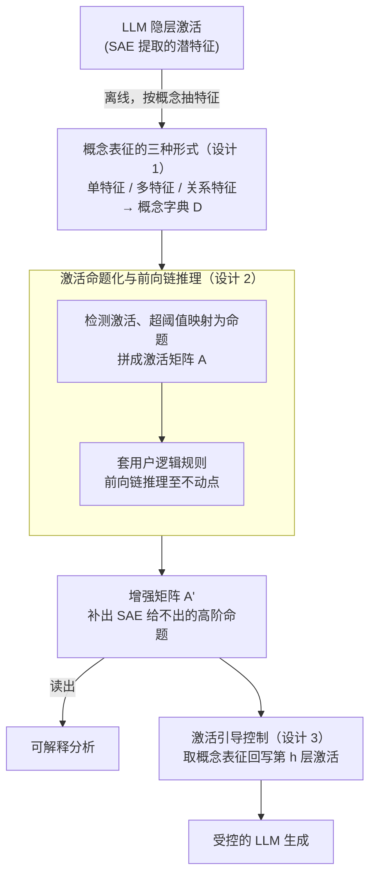

# ActivationReasoning: Logical Reasoning in Latent Activation Spaces

**会议**: ICLR 2026  
**arXiv**: [2510.18184](https://arxiv.org/abs/2510.18184)  
**代码**: [https://github.com/ml-research/ActivationReasoning](https://github.com/ml-research/ActivationReasoning)  
**领域**: LLM可解释性 / 推理  
**关键词**: 稀疏自编码器, 逻辑推理, 潜空间干预, 概念组合, 模型控制  

## 一句话总结
提出 ActivationReasoning (AR) 框架，在 LLM 的潜在激活空间（通过 SAE 提取的特征）上嵌入显式逻辑推理，通过三阶段流程（发现概念表征→检测激活命题→逻辑规则推理）实现多跳推理、概念组合和安全控制，在 PrOntoQA 上 8B 模型达到 95%+ 准确率超越 GPT-4o。

## 研究背景与动机

**领域现状**：SAE 使 LLM 的隐含激活更可解释，暴露了与人类概念对齐的潜在特征。推理型 LLM (如 o1, R1) 通过扩展推理链提升性能但推理过程不透明。

**现有痛点**：SAE 特征是被动和脆弱的——可能多义 (polysemous)、上下文不稳定、或过于底层。关键缺陷是 SAE 没有组合和高阶推理的机制。无法从"桥"+"旧金山"+"美国"推导出"金门大桥"。

**核心矛盾**：逻辑推理需要离散命题单元和组合规则，但 LLM 依赖连续、纠缠的表征。SAE 虽提供了近似离散的特征，但缺乏推理的形式化框架。

**本文目标** 在 LLM 的潜在空间中嵌入显式逻辑推理能力，实现可解释且可控的结构化推理。

**切入角度**：将 SAE 特征视为逻辑命题，在其上定义和应用逻辑规则（合取、析取、蕴含、否定），通过前向链推理产生新的高阶命题。

**核心 idea**：把 SAE 特征当命题、把用户定义的逻辑规则当推理引擎、在激活空间做前向链推理，再通过激活引导来控制 LLM 生成。

## 方法详解

### 整体框架
AR 想解决的事很具体：LLM 的激活里其实已经"藏着"很多人类概念，但这些概念是被动、零散、不会自己组合的——模型可能同时激活了"桥""旧金山""美国"，却推不出"金门大桥"。AR 的做法是把整条推理搬到 SAE 的潜在空间里显式地做一遍。整个流水线分三阶段：先离线在 SAE 空间里为每个目标概念找到它的潜表征，建成概念字典 $\mathcal{D}$；推理时检测每个 token 的激活强度，把超过阈值的概念映射成逻辑命题，拼成激活矩阵 $A$；再对 $A$ 套用用户定义的逻辑规则做前向链推理，得到补充了高阶命题的增强矩阵 $A'$。$A'$ 既可以直接读出来做可解释分析，也可以反过来回写激活、引导 LLM 的生成。

### 关键设计

**1. 概念表征的三种形式：让 SAE 特征真的能当命题用**

直接"一个 SAE 特征 = 一个概念"听上去干净，但这个假设经常不成立——SAE 特征常常是多义的（polysemous），同一维既可能编码"仇恨"也可能编码无关内容。AR 因此提供三种由弱到强的表征：单特征 $\mathcal{R}_{single}$ 沿用一对一假设；多特征 $\mathcal{R}_{multi}$ 把多个 SAE 特征加权聚合成一个概念；关系特征 $\mathcal{R}_{relation}$ 进一步用决策树建模特征之间的结构化交互。后两者解决的是不同层次的问题：多特征应对单维表达力不够，关系特征应对"概念是若干特征的逻辑组合"这种情形——比如"仇恨"需要"诽谤"和"刻板印象"同时激活、却要排除教育用途的语境，这种带条件的交互只有决策树这类结构能刻画。三种表征都靠同一个统计准则自动提取，即挑出在正负样本上激活差异最大的特征：

$$r_c = \arg\max\big(\mathbb{E}[l_t \mid y=1] - \mathbb{E}[l_t \mid y=0]\big)$$

用决策树而非端到端训练，是为了在表达力和可解释性之间取一个能被人读懂的折中。

**2. 激活命题化与前向链推理：用逻辑组合补上 SAE 缺失的高阶概念**

有了概念字典，推理时把激活离散成命题。AR 对每个概念 $c$ 计算两种激活：token 级的 $A_{local}[c,t] = \max(a_{c,t} - \tau_c,\, 0)$ 保留"在哪个位置触发"，全局级的 $A_{global}[c] = \max(\mathrm{Agg}_t\, a_{c,t} - \tau_c,\, 0)$ 把整段聚合成一个概念是否被激活。超过阈值 $\tau_c$ 的命题进入激活矩阵 $A$，然后套用户写的逻辑规则——例如 "Bridge ∧ SF ∧ USA → Golden Gate Bridge"——做前向链推理，反复触发规则直到不再有新命题被点亮（到达不动点）。这一步正是填补 SAE 表达力缺口的关键：潜空间里可能根本没有"金门大桥"这个特征，但"桥""旧金山""美国"三个特征都在，逻辑组合就把它们推导成了一个 SAE 自己给不出的高阶概念。多跳推理也是同理，靠规则一层层链下去而不是靠模型的连续表征硬扛。

**3. 激活引导控制：把推理结果回写激活，从"看得懂"变成"管得住"**

推理完成得到的 $A'$ 不止能读，还能反过来改写模型的隐状态。AR 取出某个想强化或抑制的概念表征 $SAE_D[r_c]$，按下式把它注入第 $h$ 层激活：

$$h' = h + \alpha \cdot \frac{(SAE_D[r_c] \times w) \times \|h\|_2}{\|SAE_D[r_c]\|_2}$$

其中 $w$ 控制方向（促进取正、抑制取负）、$\alpha$ 控制强度，分式做的是范数归一以保持注入幅度可控。纯分析其实已经有用，但这条回写通路让 AR 从一个事后看的可解释性工具，升级成能在推理时主动施加约束的对齐工具——比如检测到某条安全规则被触发，就当场压低对应概念、强制安全行为。

### 损失函数 / 训练策略
AR 不训练 LLM 本身。概念提取只用到均值差、决策树这类轻量统计方法，逻辑规则由用户定义，因此推理时几乎不带额外训练成本。

## 实验关键数据

### 主实验

**PrOntoQA 多跳推理 (准确率%↑):**

| 模型 | 1跳 | 3跳 | 5跳 |
|------|-----|-----|-----|
| Llama-3.1-8B | 51.0 | 50.8 | 50.3 |
| **+ AR** | **95.0** | **95.6** | **95.3** |
| Gemma-2-9B | 48.5 | 47.5 | 47.9 |
| **+ AR** | **93.5** | **93.5** | **93.5** |
| GPT-4o | 95.5 | 88.0 | 79.5 |
| DeepSeek-R1-8B | 86.0 | 79.5 | 67.5 |

**Rail2Country 元概念泛化:**

| 模型 | 显式概念 | 元概念(比喻) |
|------|---------|-----------|
| Llama-3.1-8B | 41.0 | 29.7 |
| **+ AR** | **74.7** | **62.7** |

### 消融实验

| 概念表征类型 | BeaverTails 安全检测 F1 |
|------------|---------------------|
| $\mathcal{R}_{single}$ | 较低 |
| $\mathcal{R}_{multi}$ | 中等 |
| $\mathcal{R}_{relation}$ | **最高** |

### 关键发现
- AR 使 8B 模型在多跳推理上超越 GPT-4o 和 DeepSeek-R1——8B+AR(95.3%) vs GPT-4o(79.5%) 在 5 跳推理上
- 关键：AR 的性能不随推理深度退化，而所有基线模型（包括 GPT-4o）在跳数增加时准确率显著下降
- 元概念泛化（如"像番茄一样的颜色"→"红色"）验证了 AR 超越字面匹配的能力
- BeaverTails 安全任务中 $\mathcal{R}_{relation}$ 优于 $\mathcal{R}_{single}$ 和 $\mathcal{R}_{multi}$——说明安全概念需要结构化特征交互

## 亮点与洞察
- **SAE 特征作为逻辑命题的桥梁**：这是连接神经网络连续表征和符号推理离散命题的最自然方式——SAE 特征本身就设计为近似单义的，天然适合作为命题
- **8B 超越 GPT-4o 的推理**：不是通过更好的训练而是通过在已有表征上加逻辑推理层——模型已经"知道"答案，只是缺乏组合推理的能力
- **模块化和可审计**：整个推理链条是透明的——概念从哪来、规则如何应用、结论如何得出，每一步都可检查和修改
- **跨模型迁移**：同样的框架在 Llama 和 Gemma 上都有效，说明 SAE 特征的命题化是模型无关的

## 局限与展望
- 逻辑规则需要用户手动定义，自动规则发现是重要的未来方向
- 概念提取依赖 token 级标签数据，跨领域泛化可能需要新的标注
- 目前仅支持命题逻辑，一阶逻辑（含量词和变量）的扩展有待探索
- SAE 特征质量直接影响 AR 性能——如果 SAE 特征不够单义，推理可能不可靠
- 规则应用的计算开销随概念数和规则数增长

## 相关工作与启发
- **vs 推理 LLM (o1, R1)**: 推理 LLM 通过链式推理改善但过程不透明；AR 在激活空间做推理，每步可审计
- **vs 神经符号方法 (DeepProbLog)**: 传统神经符号需要端到端可微训练；AR 不训练模型，直接在推理时应用规则
- **vs SAE 分析 (Anthropic)**: SAE 通常用于被动分析和特征可视化；AR 将 SAE 特征主动用于推理和控制

## 评分
- 新颖性: ⭐⭐⭐⭐⭐ 将逻辑推理嵌入 LLM 潜在空间的思路既自然又强大，是 SAE 应用的重大拓展
- 实验充分度: ⭐⭐⭐⭐⭐ 四个互补任务（多跳推理/元概念/自然语言推理/安全），双模型验证
- 写作质量: ⭐⭐⭐⭐⭐ 从动机到方法到实验叙述流畅，Golden Gate Bridge 的运行示例贯穿全文
- 价值: ⭐⭐⭐⭐⭐ 为 LLM 的可解释推理和可控对齐提供了全新范式

<!-- RELATED:START -->

## 相关论文

- [\[ICLR 2026\] Learning to Reason via Mixture-of-Thought for Logical Reasoning](learning_to_reason_via_mixture-of-thought_for_logical_reasoning.md)
- [\[ICLR 2026\] LogicReward: Incentivizing LLM Reasoning via Step-Wise Logical Supervision](logicreward_incentivizing_llm_reasoning_via_step-wise_logical_supervision.md)
- [\[ACL 2026\] Logical Phase Transitions: Understanding Collapse in LLM Logical Reasoning](../../ACL2026/llm_reasoning/logical_phase_transitions_understanding_collapse_in_llm_logical_reasoning.md)
- [\[ICLR 2026\] Rethinking LLM Reasoning: From Explicit Trajectories to Latent Representations](rethinking_llm_reasoning_from_explicit_trajectories_to_latent_representations.md)
- [\[ICLR 2026\] KaVa: Latent Reasoning via Compressed KV-Cache Distillation](kava_latent_reasoning_via_compressed_kv-cache_distillation.md)

<!-- RELATED:END -->
