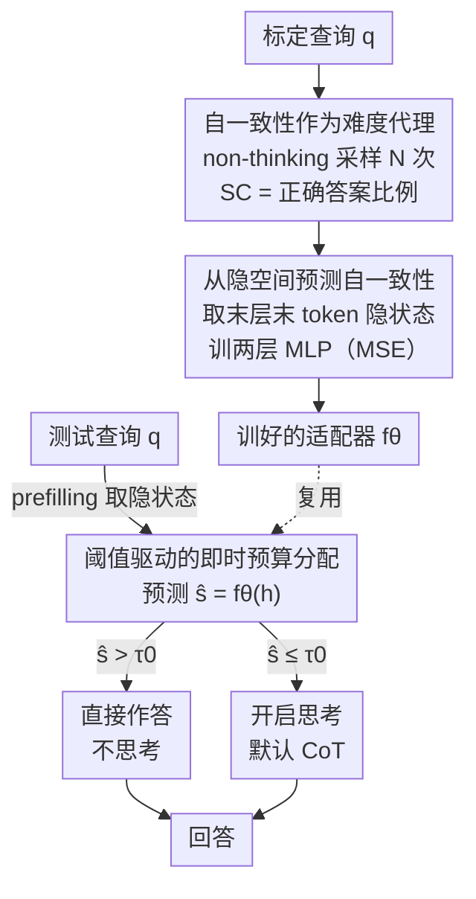

# Adaptive Thinking: Large Language Models Know When to Think in Latent Space

**会议**: ICLR 2026  
**OpenReview**: [https://openreview.net/forum?id=2i6Rp0gCq6](https://openreview.net/forum?id=2i6Rp0gCq6)  
**领域**: LLM推理  
**关键词**: 自适应思考、自一致性、隐空间表示、测试时计算、思考预算分配

## 一句话总结
本文提出 Sonata：用一个轻量 MLP 适配器，在 prefilling 阶段从查询的最后一层隐状态直接预测"自一致性"，据此在解码前决定一道题该不该思考、思考多少，从而在维持精度的同时把思考 token 砍掉 20%–60%。

## 研究背景与动机
**领域现状**：推理型大模型（如 Qwen3、GPT-OSS）通过在回答前生成一段链式思考（CoT, chain-of-thought）来提升复杂问题的准确率，这就是"测试时计算扩展"。给的思考预算（thinking budget）越多，性能往往越好。

**现有痛点**：思考预算是一把双刃剑。简单题目上过度思考（overthinking）不仅浪费算力，甚至会拖低准确率；复杂题目上思考不足又会出错。但"一道具体查询到底需要多少思考"这件事，在生成回答之前几乎无从判断。现有方法要么用熵这类**表层代理**（next-token logits 熵、attention 熵），抓不到真正的推理难度；要么依赖**昂贵的在线计算**或逐样本标定，落地成本高。

**核心矛盾**：性能与效率之间存在 trade-off，而要把这个 trade-off 调到"按需分配"的最优点，前提是能在**解码开始之前**就估出每道题的内在推理难度——这恰恰是最难的一环。

**本文目标**：(1) 找到一个能可靠反映"该不该思考"的难度代理信号；(2) 让这个信号在推理时几乎零成本地预测出来；(3) 据此即时分配思考预算。

**切入角度**：作者观察到，多次采样多条推理路径之间的"自一致性"（self-consistency，多次回答收敛到同一答案的比例）与查询难度强相关——难度越高、自一致性越低（图 1）。更关键的是，作者发现不同自一致性水平的查询在隐空间里高度可分（PCA 可视化里自然聚成簇），意味着这个信号**可以从隐状态里学出来**，无需真的去多次采样。

**核心 idea**：用一个离线训练的轻量适配器，从查询最后一层隐状态直接预测自一致性，把"采样才能得到的难度信号"变成"前向一次就能拿到的难度信号"，并用它在思考前做预算分配。

## 方法详解

### 整体框架
Sonata（Self-Consistency-Guided Adapter for Thinking Allocation）的核心是把"难度判断"前移到 prefilling 阶段，用一次额外的 MLP 前向取代昂贵的多次采样。整条管线分两段：**离线**在一个标定集上训练适配器——对每道标定查询，在 non-thinking 模式下采样 N 条答案算出真实自一致性标签，同时取该查询最后一层、最后一个 token 的隐状态，训练一个两层 MLP 把隐状态映射到自一致性（MSE 损失）；**在线**对测试查询，在 prefilling 阶段（解码尚未开始）取出同样的隐状态，用训好的适配器预测自一致性 $\hat{s}$，再拿它和阈值 $\tau_0$ 比较来决定是否开启思考。整个适配器在推理时引入 < 1‰ 的计算开销，且是"模型相关、任务无关"——为每个 LLM 训一次，就能跨数学、科学、代码等多种下游任务通用。

### 关键设计

**1. 自一致性作为"该不该思考"的代理信号：把难度判断锚在模型自身的把握上**

现有方法用 logits 熵、attention 熵这类表层不确定性当代理，但一个 token 级的高熵可能只是"有多种合理措辞"，并不代表题目真的难。本文换了一个更本质的信号：自一致性，定义为多次重复采样里答对的比例 $SC(q) = \frac{1}{N}\sum_{i=1}^{N} \mathbb{I}[a_i = a^*]$（$N=32$，用一个 verifier 判对错而非简单多数投票，以便给标定提供准确标签）。作者先验证它确实指示"该不该思考"：对每道标定查询，测 non-thinking 模式下的自一致性，以及开启思考带来的准确率增益 $\Delta_{\text{think}}(q) = \text{Acc}_{\text{think}}(q) - \text{Acc}_{\text{non-think}}(q)$，发现两者强负相关——自一致性低的查询从思考中获益巨大，自一致性高的查询几乎没增益（图 2）。这说明自一致性直接度量了"模型对这道题有没有把握"，比表层熵更贴近真实推理难度。

**2. 从隐空间预测自一致性：用一次前向取代昂贵的多次采样**

自一致性虽好，但算它本身就要多次采样，这与"高效推理"的初衷矛盾。作者的关键发现是：自一致性的模式在隐空间里高度可分。取查询最后一个位置、最后一层的隐状态 $H \in \mathbb{R}^d$ 做 PCA 投影后，高自一致性查询自然聚成紧簇、低自一致性查询则更分散（图 3，观察 1）；而且这种可分性随层数加深而增强，最后一层分离最明显（观察 2），与"深层编码更抽象、更偏推理的知识"这一已知规律吻合。基于此，本文训练一个两层 MLP 适配器 $f_\theta$（末接 sigmoid）把末层隐状态映射到自一致性分数，用 MSE 损失在标定集上离线训练（算法 1）。一旦训好，跨任务直接迁移、无需再微调，推理时只需对已经算好的 prefilling 隐状态多走一次轻量 MLP 前向，不增加任何额外的 LLM 前向。

**3. 阈值驱动的即时预算分配：在解码前决定思考与否**

有了能即时预测的难度信号，分配策略就极简：测试时取查询的 prefilling 隐状态 $h = \text{LLM}_L(q)$，预测 $\hat{s} = f_\theta(h)$，与预设阈值 $\tau_0$ 比较（全文统一取 $\tau_0 = 0.3$）。若 $\hat{s} > \tau_0$，说明模型对这道题很有把握，直接作答、不开启思考；否则按模型默认流程开启思考（算法 2）。这一对比反映了"高预测自一致性 → 简单题 → 省掉思考"的直觉。整个分配只需一次 MLP 前向，相对 LLM 推理时间几乎零延迟。更妙的是 $\tau_0$ 从 0 调到 1 可以平滑地在精度与 token 之间滑动，给出一条优于固定预算的 Pareto 前沿。该控制器是"外层的 when-to-think 开关"，与已有的 CoT 压缩/早停方法（如 REFRAIN）正交，可叠加：先用 Sonata 决定要不要思考，思考时再用早停方法决定何时停，获得进一步的 token 节省。

### 损失函数 / 训练策略
适配器在标定集上用 MSE 回归自一致性标签训练。标定集从 OpenMathReasoning 随机采 1000 道难度 6/7 的数学题；每道题在 non-thinking 模式下采 $N=32$ 个答案算真实自一致性。适配器为两层 MLP + sigmoid，模型相关、任务无关。推理用 temperature=0.6、top-p=0.95，报 pass@1。

## 实验关键数据

### 主实验
在 4 个不同规模模型（Qwen3-8B / 32B、GPT-OSS-120B、Qwen3-235B-A22B）和 5 个基准（AIME25、MATH-500、GSM8K、LiveCodeBench、GPQA）上评测，对比 vanilla、固定预算（Const. Budget）、自评预算（Self-Judge）。下表为各模型的平均结果（#Tokens 括号内为相对 vanilla 的占比）：

| 模型 | 方法 | 平均 Acc.↑ | 平均 #Tokens↓ |
|------|------|-----------|--------------|
| Qwen3-8B | vanilla | 74.1 | 9154 (100%) |
| Qwen3-8B | Const. Budget | 64.9 | 4096 (45%) |
| Qwen3-8B | Self-Judge | 72.7 | 8364 (91%) |
| Qwen3-8B | **Sonata** | **75.3** | **7535 (82%)** |
| Qwen3-32B | vanilla | 78.0 | 7853 (100%) |
| Qwen3-32B | **Sonata** | **77.8** | **7074 (90%)** |
| GPT-OSS-120B | vanilla | 86.6 | 6708 (100%) |
| GPT-OSS-120B | **Sonata** | **85.4** | **5973 (89%)** |
| Qwen3-235B-A22B | vanilla | 82.8 | 6878 (100%) |
| Qwen3-235B-A22B | **Sonata** | **84.0** | **5698 (83%)** |

在简单任务上节省尤其明显：GSM8K 上 Qwen3-8B/32B 的 token 直接砍掉约 55%–56% 而精度不降；GPQA（域外科学推理）上 Qwen3-8B 精度反升 1.9%、token 砍 52%。端到端效率（表 2，MATH-500，B200 GPU）显示延迟下降 27%（Qwen3-8B）到 36%（Qwen3-235B-A22B），内存增加 < 1%，越大的模型从自适应分配中获益越多。

### 消融实验

| 配置 | 维度 | Qwen3-8B 平均 Acc. | Qwen3-8B 平均 #Tokens |
|------|------|-------------------|----------------------|
| Self-Consistency (Sonata) | 代理信号 | 79.6 | 6156 (79%) |
| LM Logits Entropy | 代理信号 | 66.3 | 3518 (45%) |
| Attention Entropy | 代理信号 | 68.3 | 3647 (47%) |
| 2-Layer MLP (Sonata) | 适配器结构 | 79.6 | 6156 (79%) |
| Linear | 适配器结构 | 76.8 | 6122 (78%) |
| 3-Layer MLP | 适配器结构 | 79.3 | 6144 (78%) |
| Sonata (1k samples) | 标定集大小 | 79.6 | 6156 (79%) |
| Sonata (200 samples) | 标定集大小 | 78.4 | 6272 (80%) |
| Sonata (100 samples) | 标定集大小 | 79.0 | 6472 (83%) |
| Sonata + REFRAIN | 叠加早停 | 78.7 | 64% of vanilla |

### 关键发现
- **代理信号的选择是胜负手**：两种熵代理在难题（AIME25）上严重欠分配预算——Qwen3-8B 上 LM logits 熵只有 23.3% 准确率、attention 熵 30.0%，因为单 token 级不确定性抓不到真正的推理难度；自一致性把准确率拉到 63.3%。这正面验证了"自一致性比表层熵更贴近难度"的核心假设。
- **轻量非线性适配器就够**：两层 MLP 显著优于线性投影（约高 3% 精度），但再加到三层几乎无增益——印证了"自一致性簇在隐空间里本就分得很开，一个轻量非线性边界就能拟合"。
- **标定极省**：只用 100 条标定样本仍能拿到 79.0% 平均精度、省 17% token，与 1000 条（79.6%、省 21%）几乎持平，适合低资源部署。
- **跨域泛化**：仅在数学题上标定，却能迁移到 GPQA（物理/化学/生物）和 LiveCodeBench（代码生成），且 GPQA 的 token 节省（17%–52%）与数学任务相当，说明自一致性捕捉的是跨学科通用的推理难度。
- **可叠加**：与 REFRAIN 早停组合，在 Sonata 基础上再省 15% token（降到 vanilla 的 64%），精度仅微降，证明它是与现有压缩方法正交的"外层开关"。

## 亮点与洞察
- **把"采样才能得到的标签"蒸馏成"前向就能得到的预测"**：自一致性本身要多次采样，与高效推理矛盾；本文用隐空间可分性这一观察，把它变成离线训练的回归目标，推理时零额外采样。这种"贵信号 → 轻量预测器"的思路可迁移到任何"需要多次试错才能评估"的指标上。
- **先做可视化验证再上方法**：作者先用 PCA + 跨层分析证明自一致性在隐空间可分（且深层更可分），再决定用末层隐状态做输入——方法的每一步都有可解释的实证支撑，而非拍脑袋。
- **正交可组合的设计哲学**：Sonata 定位成"要不要思考"的外层控制器，把"思考时怎么省"留给已有方法，天然能叠加，扩大了实用价值。

## 局限与展望
- **适配器是模型相关的**：每换一个 LLM 架构都要重训适配器（虽然标定成本很低），不能跨模型直接复用。
- **二值思考决策较粗**：在线策略本质是"思考 / 不思考"的阈值二分，预测的连续自一致性分数尚未被用来做更细粒度的"思考多少 token"的连续预算映射（虽然调 $\tau_0$ 能滑动整体 Pareto，但单查询仍是开关式）。
- **依赖 verifier 标定**：训练时用 verifier 判对错来算真实自一致性，对没有可验证答案的开放式任务，自一致性标签如何获取仍是开放问题。
- **阈值固定**：全文统一 $\tau_0=0.3$，跨任务/模型未做自适应阈值，极端难度分布下可能不是最优。

## 相关工作与启发
- **vs 固定预算 / 自评预算**：固定预算对所有查询一刀切，要么在难题上欠思考、要么在简单题上浪费；自评预算（让模型自己先报预算）在大模型上偶尔不错但不稳定。Sonata 用学出来的隐空间难度信号做细粒度、查询自适应的分配，Pareto 前沿全面占优。
- **vs 熵类代理（logits 熵 / attention 熵）**：它们抓的是 token 级表层不确定性，在难题上系统性欠分配预算；自一致性度量"模型能否多次稳定解出"，更贴近内在推理难度。
- **vs CoT 压缩/早停（REFRAIN、长度正则 RL 等）**：那些方法管"思考时怎么省 token"，Sonata 管"要不要思考"，两者正交，可叠加进一步省 token。
- **vs 隐空间推理研究**：已有工作发现 LLM 在隐状态里隐式做潜在推理；本文把"隐表示与推理能力相关"这一洞察落地成一个可预测难度的实用工具。

## 评分
- 新颖性: ⭐⭐⭐⭐ 用自一致性的隐空间可预测性做思考预算分配，视角新且有实证支撑
- 实验充分度: ⭐⭐⭐⭐⭐ 4 模型 × 5 基准 + 代理信号/结构/标定集/叠加方法的完整消融
- 写作质量: ⭐⭐⭐⭐ 动机—观察—方法链路清晰，图表支撑到位
- 价值: ⭐⭐⭐⭐ 近零开销、跨任务通用、可与现有方法叠加，落地性强

<!-- RELATED:START -->

## 相关论文

- [\[ICLR 2026\] On the Thinking-Language Modeling Gap in Large Language Models](on_the_thinking-language_modeling_gap_in_large_language_models.md)
- [\[ICLR 2026\] StreamingThinker: Large Language Models Can Think While Reading](streamingthinker_large_language_models_can_think_while_reading.md)
- [\[ICLR 2026\] Latent-Guided Reasoning: Empowering Small LLMs with Large-Model Thinking](latent-guided_reasoning_empowering_small_llms_with_large-model_thinking.md)
- [\[ICLR 2026\] ∇-Reasoner: LLM Reasoning via Test-Time Gradient Descent in Latent Space](nabla-reasoner_llm_reasoning_via_test-time_gradient_descent_in_latent_space.md)
- [\[ICLR 2026\] Deep Think with Confidence](deep_think_with_confidence.md)

<!-- RELATED:END -->
