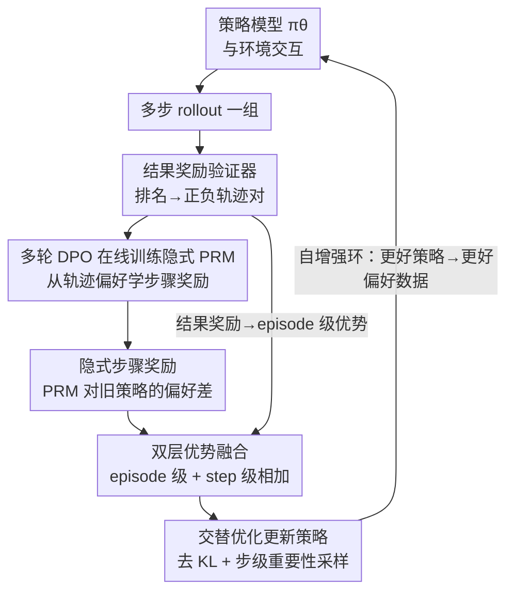

# Agentic Reinforcement Learning with Implicit Step Rewards

**会议**: ICLR2026  
**OpenReview**: [https://openreview.net/forum?id=ooROvpmxMV](https://openreview.net/forum?id=ooROvpmxMV)  
**代码**: https://github.com/Tongyi-ConvAI/Qwen-Character/tree/main/CharacterRL-iStar  
**领域**: LLM Agent / 强化学习 / 信用分配  
**关键词**: agentic RL、隐式过程奖励、信用分配、多轮 DPO、步骤级优势

## 一句话总结
本文提出 iStar，一种面向 LLM 智能体多轮强化学习的通用信用分配策略：用一个**隐式过程奖励模型（PRM）**和策略模型交替优化，通过多轮 DPO 目标在线学出每一步动作的稠密奖励，再把步骤级优势和 episode 级优势相加去更新策略，在 WebShop、VisualSokoban 和开放式社交 SOTOPIA 上都拿到 SOTA，且样本效率与训练稳定性都更好。

## 研究背景与动机
**领域现状**：LLM 正从被动的文本生成器变成能在交互环境里推理、行动、跨长时序调整策略的自主智能体（搜索智能体、网页/移动端导航、软件工程助手、社交与具身智能）。训练这类智能体普遍用强化学习（agentic RL），让 LLM 充当策略模型。

**现有痛点**：和传统单轮、静态任务上的 RLHF 不同，agentic RL 有三个特有困难。其一，奖励**稀疏且延迟**——往往只有轨迹末尾才有一个结果奖励，中间动作拿不到反馈，信用分配极难。其二，轨迹**又长又非马尔可夫**，每一步都是「一段思维链 + 一个可执行动作」，如果把信用强行推到 token 级，方差会被放大。其三，环境和对手**非平稳、开放式**，奖励常常**不可验证**（比如对话）。结果是：只靠一个结果奖励做轨迹级优化，信用分配失败，策略学习方差高、探索脆弱，在智能体任务上收益有限。

**核心矛盾**：要给中间步骤更稠密的反馈，但现有的过程监督路线各有死穴。手工设计的步骤标签（给工具调用、元推理标签打分）成本高、有偏、容易被 reward hacking；生成式奖励模型（LLM-as-judge）省了标注但跨域噪声大、不一致；隐式 PRM（如 PRIME）在单轮任务有效，但它产出的是 **token 级**奖励，在智能体训练里**过于细粒度**，随轨迹变长会放大方差、把训练带崩；还有一类方法（GiGPO）靠**相同状态分组**算步骤级优势，但在开放式语言环境里相同状态几乎不会重现，假设直接失效。于是核心问题变成：怎样设计一个**标签高效、稳定、能扩展到多轮交互、对（不）可验证奖励都鲁棒**的信用分配策略？

**本文目标**：在不依赖额外 rollout、不依赖显式步骤标签的前提下，给多轮 agentic RL 提供稠密、低方差、可跨域通用的步骤级信用信号。

**切入角度**：作者注意到，隐式奖励建模本身就能从偏好里反推出奖励（DPO 即一例，且 DPO 被证明能自动学出 Q 函数）。如果把这个思路从「单轮 token 级」抬到「多轮 step 级」，让一个隐式 PRM 直接对**整个动作序列**打分，就既能保留稠密性、又能把粒度控制在「每一步」这个不太细的层级上。

**核心 idea**：用一个隐式 PRM 与策略**交替优化**，把「PRM 比旧策略更偏好某个动作」这件事转化为该动作的步骤奖励，再和结果奖励一起做双层优势更新策略——形成一个互相增强的自循环。

## 方法详解

### 整体框架
iStar 的目标是在多轮、长时序的智能体 RL 里把信用精确分到每一步动作上。它在标准 RL 循环之外多挂了一个隐式 PRM，并让这个 PRM 和策略模型**轮流更新**。一轮训练里的数据流是这样转的：策略模型 $\pi_\theta$ 在环境中跑出一组多步 rollout；结果奖励验证器（或模型）按成败给这些轨迹打分，组成「正轨迹 $\tau^+$ / 负轨迹 $\tau^-$」偏好对；隐式 PRM $\pi_\phi$ 用一个**多轮 DPO 目标**在这些偏好对上在线更新；更新后的 PRM 对每个动作算出一个**隐式步骤奖励**（衡量该动作在新 PRM 下比在旧策略 $\pi_{\theta_{old}}$ 下「更可能」多少）；最后把结果奖励算出的 **episode 级优势**和步骤奖励算出的 **step 级优势**相加，去更新策略模型。策略变强 → 偏好数据更好 → PRM 更准 → 步骤奖励更准 → 策略再变强，构成自增强环。整个方法不需要标注步骤标签、也不需要额外 rollout，可以套在 GRPO / RLOO / REINFORCE++ / DAPO 等多种 RL 算法上。

### 关键设计

**1. 隐式步骤奖励：把「PRM 比旧策略更偏好」当成每步的稠密信号**

这一条直击「稀疏奖励 + 信用分配难」的痛点。作者不去显式标注每一步的好坏，而是给出一个隐式定义：对轨迹 $\tau=(o_1,a_1,\dots,o_T,a_T)$ 中第 $t$ 步的动作 $a_t$，其步骤奖励为

$$r_\phi(o_{1:t}, a_t) = \beta \log \frac{\pi_\phi(a_t \mid o_{1:t}, x)}{\pi_{\theta_{old}}(a_t \mid o_{1:t}, x)}$$

其中 $\pi_\phi$ 是隐式 PRM，$\pi_{\theta_{old}}$ 是策略的上一份快照，$\beta\in[0,1]$ 是缩放温度。直观含义是：这个动作在「刚学出来的 PRM」下比在「旧策略」下更可能多少。正值表示 PRM 认为该动作对近期进步有功、应鼓励；负值表示该动作应被压制。关键在于它是**逐步**计算的，所以反馈足够稠密、能引导探索；但又停在「每个动作序列」这个层级而不是 token 级，因此粗到足以把方差压住——这正是它相对 PRIME 那种 token 级隐式奖励的核心区别。

**2. 多轮 DPO 在线训练隐式 PRM：从轨迹偏好学出步骤级奖励函数**

设计 1 里的 $\pi_\phi$ 怎么来？作者不另开一个打标流程，而是直接用旧策略采到的正负轨迹对在线训练 PRM，目标为

$$J_{PRM}(\phi) = -\mathbb{E}_{(\tau^+,\tau^-)}\Big[\log \sigma\big(\beta \log \tfrac{\pi_\phi(\tau^+\mid x)}{\pi_{\theta_{old}}(\tau^+\mid x)} - \beta \log \tfrac{\pi_\phi(\tau^-\mid x)}{\pi_{\theta_{old}}(\tau^-\mid x)}\big)\Big]$$

这里 $\pi(\tau\mid x)=\prod_t \pi(a_t\mid o_{1:t},x)$ 是整条轨迹上各步动作概率的乘积，正负标签来自结果奖励验证器。它和标准 DPO 有两点关键不同：其一，参考模型用的是**会随训练变化的旧策略快照** $\pi_{\theta_{old}}$，而不是冻结的初始策略；其二，目标是从**多步 MDP**而非单步 bandit 推导出来的。作者在理论分析里证明（第 3.2 节）：该目标等价于一个带**步骤级奖励函数**的 Bradley-Terry 模型，即对任意起点相同的轨迹对，$P(\tau_1\succ\tau_2)=\sigma\big(\sum_t r^*_\phi(o^1_{1:t},a^1_t) - \sum_t r^*_\phi(o^2_{1:t},a^2_t)\big)$，且 $r^*_\phi$ 正好就是设计 1 的形式。换句话说，「在轨迹偏好上做多轮 DPO」这件事，数学上保证了你学到的就是一个合法的步骤级奖励，而非随手拼的启发式。注意 loss 只在动作 token 上计算，环境返回的 token 不计入。

**3. 双层优势融合：episode 级管全局成败、step 级管单步贡献**

光有步骤奖励还不够——只奖励中间动作而不用最终成败「把关」，容易让模型钻空子刷奖励（reward hacking）。作者的做法是把两种优势在**优势层**相加。对同一个 prompt 采 $N$ 条轨迹，先用结果奖励算 episode 级优势 $A_E(\tau_i)=(r_o(\tau_i)-\text{mean}(R_o))/\text{std}(R_o)$；再用最新 PRM 给每个动作算步骤奖励、并在组内所有步骤奖励集合 $R_s$ 上标准化得到 step 级优势 $A_S(a^i_t)=(r_\phi(a^i_t)-\text{mean}(R_s))/\text{std}(R_s)$；最终优势为

$$A(a^i_t) = A_E(\tau_i) + \alpha\, A_S(a^i_t)$$

$\alpha$ 平衡两层信号。这样得到的优势既能区分「好轨迹 vs 坏轨迹」，又能在同一组（同初始状态）的轨迹里区分「有益步骤 vs 有害步骤」。在组内用同初始状态的多条轨迹相当于造了多个反事实场景，能给出更准、更稳的 state-value 基线，从而把单步优势估得更准——这比在单条轨迹里估优势（不同步骤处于不同状态、被策略噪声污染）方差小得多。消融里专门验证了：把步骤奖励**直接加到结果奖励上**（merged rewards）只有小幅提升，必须在优势层组合才行。

**4. 交替优化的自增强环 + 去 KL 与步级重要性采样**

最后策略用标准 surrogate 目标更新：$J_{policy}(\theta)=\mathbb{E}\big[\frac{1}{NT}\sum_i\sum_t \min(\rho_\theta(a^i_t)A(a^i_t),\,\text{clip}(\rho_\theta(a^i_t),1\pm\epsilon)A(a^i_t))\big]$，其中重要性采样比 $\rho_\theta(a^i_t)=\pi_\theta(a^i_t\mid o^i_t,x)/\pi_{\theta_{old}}(a^i_t\mid o^i_t,x)$ 取在**步骤级**，与步骤级奖励对齐，保证多步 rollout 上的低方差。两个细节让自增强环更稳：其一，PRM 和策略**交替优化**、且都用当前策略产出的 rollout 训练，使两者数据分布大致一致，最小化 off-policy 偏差和协变量漂移，让步骤奖励始终校准到智能体当前行为；其二，作者**不加 KL 惩罚**——在线 agentic RL 里成功行为往往需要大幅偏离冻结语言模型的默认输出，去掉 KL 让策略能更自由地探索解题关键区域（表 7 验证了去 KL 更好）。

### 损失函数 / 训练策略
- **PRM 损失**：多轮 DPO 目标 $J_{PRM}(\phi)$（式 2），参考模型为滚动更新的旧策略快照；只在动作 token 上算 log 概率比。
- **策略损失**：步骤级裁剪 surrogate（式 6），优势用双层融合 $A(a^i_t)=A_E+\alpha A_S$，**不加 KL 惩罚**。
- **关键超参**：策略学习率 $5\times10^{-7}$、PRM 学习率 $10^{-6}$（AdamW）；batch size 64、micro-batch 8；优势系数 $\alpha=1.0$、DPO 温度 $\beta=0.05$；每 prompt rollout 8 条；8×A100 训练。PRM 默认从基座策略初始化（VisualSokoban 例外：策略用 Qwen2.5-VL-7B、PRM 用 Qwen2.5-7B）。正轨迹判定：WebShop/VisualSokoban 成功率 >0，SOTOPIA 目标完成分 >6。

## 实验关键数据

### 主实验
三个环境：WebShop（文本网购，多步决策）、VisualSokoban（6×6 推箱子，空间推理+长期规划，多模态）、SOTOPIA（开放式社交对话，奖励不可验证）。基座 Qwen2.5-7B-Instruct / Qwen2.5-VL-7B-Instruct。

| 方法 | WebShop Success | WebShop Score | VisualSokoban Success |
|------|------|------|------|
| GPT-5 (ReAct) | 37.5 | 66.1 | 16.6 |
| Claude-Sonnet-4-Thinking | 35.2 | 62.0 | 19.1 |
| Base (ReAct) | 21.5 | 47.3 | 14.1 |
| + GRPO | 80.1 | 89.3 | 85.6 |
| + PRIME（token 级过程奖励） | 81.5 | 91.3 | - |
| + GiGPO（同态分组） | 84.1 | 91.2 | 85.9 |
| **+ RLOO w/ iStar** | **86.5** | **93.6** | **91.7** |

SOTOPIA（目标完成分 0-10，GPT-4o 评判）：iStar 在 hard 社交场景下，self-chat 目标完成相对提升 14%（7.92→8.06），与 GPT-4o 对话时最高提升 48%（6.68→7.16）。前沿 LLM（GPT-5/Gemini-2.5-Pro 等）和 GiGPO/PRIME 在这里要么不适用（开放状态空间、奖励不可验证），要么被超过。

iStar 还能即插即用提升多种 RL 算法：套在 RLOO 上 WebShop 和 VisualSokoban 成功率各涨 6.3%，REINFORCE++ 和 GRPO 上也有同样趋势。

### 消融实验

| 配置 | WebShop Success | WebShop Score | VisualSokoban Success |
|------|------|------|------|
| RLOO（仅结果奖励） | 76.6 | 84.2 | 85.9 |
| w/ 环境原始步骤奖励 | - | - | 87.5 |
| w/ merged rewards（步骤奖励直接加进结果奖励） | 81.3 | 90.7 | 88.3 |
| w/ token 级过程奖励 | 82.0 | 90.0 | 89.1 |
| **w/ iStar（优势层融合 + step 级）** | **89.1** | **94.7** | **93.0** |

### 关键发现
- **优势层融合是关键**：把步骤奖励直接加到结果奖励上（merged）只有小幅提升；只有在优势层把 episode 级和 step 级分开组合，才能既奖励中间动作又用最终成败「把关」，防止投机性刷奖励。
- **step 级 > token 级**：token 级过程奖励（PRIME 式）在多轮长序列里过细，引入噪声、训练不稳；iStar 的 step 级奖励稠密但不过细，方差可控。图 4 显示 PRIME 早期与 iStar 相当但随后停滞、剧烈波动，iStar 持续上升。
- **样本效率**：iStar 在 WebShop 仅 105 步就达到 vanilla RLOO 的分数（约 2× 提速），165 步达到 94.7% 峰值。算力越多，稳定性优势越明显——vanilla RLOO 和 GiGPO 训练后期会变不稳甚至退化。
- **探索更高效**：步骤奖励先涨、episode 奖励随后跟上，说明方法先抓住局部好动作启发式、再组合成高回报轨迹；副产物是 episode 长度变短（减少无谓动作）却不损成功率。
- **环境原始步骤奖励效果有限**：直接用 VisualSokoban 自带的步骤惩罚几乎没比 vanilla RL 好多少，说明 iStar 学出的隐式步骤奖励是更好的信用信号。

## 亮点与洞察
- **「把 DPO 抬到步骤级」是核心巧思**：单轮 token 级隐式奖励早有人做，但作者把它从单步 bandit 推到多步 MDP，并证明多轮 DPO 等价于带步骤级奖励函数的 BT 模型——这给「隐式步骤奖励」提供了理论合法性，不是随手拼的启发式。
- **参考模型用滚动旧策略而非冻结初始策略**，是让 PRM 始终校准到智能体当前行为的关键，也是自增强环能稳住的原因之一；这一改动看似小，却是从「离线对齐」迁到「在线 agentic RL」的必要条件。
- **「优势层融合而非奖励层相加」这个发现可迁移**：很多过程奖励工作习惯把稠密奖励直接加进 reward，本文消融说明这会削弱「最终成败把关」的作用；在优势层组合能保留 reward gating，这个 trick 对任何「outcome + process」混合信用分配都值得借鉴。
- **去 KL 惩罚 + 步级重要性采样**的组合，对长时序探索友好，也提示在线智能体 RL 里不该照搬 RLHF 的 KL 约束。

## 局限与展望
- **PRM 与策略目前是两个分离的模型**，多占显存；作者展望可统一成一个模型用不同目标训练，既省显存又可能共享表示。
- **SOTOPIA 里 PRM 只学了「目标完成」单一偏好**，未来可扩展成多目标隐式 PRM（同时管安全、empathy 等）。
- **未在数学/代码生成上验证**：作者只在交互式智能体任务上做了实验，方法是否能给数学 CoT 的中间步骤提供好的隐式奖励、是否能用于 test-time search guidance，仍是 future work。
- 自己看到的一点：正负轨迹的划分依赖一个结果奖励验证器/模型，在 SOTOPIA 用的是「目标完成分 >6」这种阈值 + GPT-4o 评判，验证器本身的噪声会传导到 PRM；横向比较不同环境的提升幅度时也要注意任务难度不同，不能直接比大小。

## 相关工作与启发
- **vs PRIME（Cui et al., 2025）**：两者都是「隐式 PRM 与生成器联合训练」，但 PRIME 产出 **token 级**过程奖励、用交叉熵 loss 优化 PRM（只适用二元结果奖励的任务）；iStar 产出 **step 级**奖励、用多轮 DPO 优化，粒度更粗因而方差更低、且能用于不可验证奖励的开放环境。这是本文最直接的对手，主实验和消融都点名超过它。
- **vs GiGPO（Feng et al., 2025）**：GiGPO 不学 PRM，而是靠**相同状态分组**算步骤级优势，在有限状态-动作空间有效，但依赖精确状态重叠，在开放式语言环境（相同状态罕见）失效；iStar 用隐式奖励而非状态分组，因此能泛化到 SOTOPIA 这类开放环境。
- **vs 手工/judge 式过程奖励（Zeng/Zou/Liu et al.）**：手工步骤标签或 LLM-as-judge 成本高、有偏、易被 reward hacking、跨域噪声大；iStar 的步骤奖励从轨迹偏好里隐式学出，标签高效。
- **vs 学步骤 Q 值（Choudhury, 2025）**：固定 PRM 估 Q 值在推理时对未见动作估不准；iStar 的 PRM 与策略交替在线更新，分布一致性更好。

## 评分
- 新颖性: ⭐⭐⭐⭐⭐ 把隐式 DPO 奖励从单轮 token 级抬到多轮 step 级，并给出 BT 等价性证明，切口清晰、理论扎实。
- 实验充分度: ⭐⭐⭐⭐⭐ 三类异质环境（含不可验证奖励的开放社交）、多基座、多 RL 算法即插即用、样本效率/稳定性/探索全维度分析 + 细致消融。
- 写作质量: ⭐⭐⭐⭐ 动机层层递进、方法与理论衔接好；图较多但部分依赖附录，正文略紧。
- 价值: ⭐⭐⭐⭐⭐ 提供了一个通用、标签高效、对（不）可验证奖励都鲁棒的 agentic RL 信用分配策略，可直接插进主流 RL 算法，实用价值高。

<!-- RELATED:START -->

## 相关论文

- [\[ACL 2026\] HISR: Hindsight Information Modulated Segmental Process Rewards for Multi-turn Agentic Reinforcement Learning](../../ACL2026/llm_reasoning/hisr_hindsight_information_modulated_segmental_process_rewards_for_multi-turn_ag.md)
- [\[CVPR 2026\] Scaling Agentic Reinforcement Learning for Tool-Integrated Reasoning in VLMs](../../CVPR2026/llm_reasoning/scaling_agentic_reinforcement_learning_for_tool-integrated_reasoning_in_vlms.md)
- [\[ICLR 2026\] Emergent Hierarchical Reasoning in LLMs through Reinforcement Learning](emergent_hierarchical_reasoning_in_llms_through_reinforcement_learning.md)
- [\[ICLR 2026\] Process-Verified Reinforcement Learning for Theorem Proving via Lean](process-verified_reinforcement_learning_for_theorem_proving_via_lean.md)
- [\[ICLR 2026\] Learning to Reason over Continuous Tokens with Reinforcement Learning (HyRea)](learning_to_reason_over_continuous_tokens_with_reinforcement_learning.md)

<!-- RELATED:END -->
