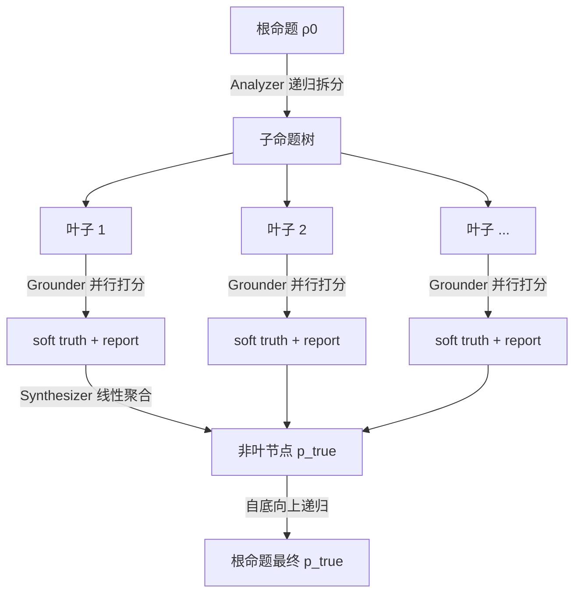

# Analytica: Soft Propositional Reasoning for Robust and Scalable LLM-Driven Analysis

**会议**: ICLR 2026  
**OpenReview**: [https://openreview.net/forum?id=9cFT6u82uh](https://openreview.net/forum?id=9cFT6u82uh)  
**代码**: [https://github.com/chengjunyan1/analytica](https://github.com/chengjunyan1/analytica)  
**领域**: LLM 推理 / Agent 架构 / 神经符号混合系统  
**关键词**: soft propositional reasoning, bias-variance decomposition, divide-and-conquer agent, forecasting, linear synthesis  

## 一句话总结
把复杂分析重构成"估计命题软真值"的问题，用偏差-方差分解作为设计原则：分治拆树降偏差、线性综合规则降方差，得到一个可验证、可扩展、抗噪的 LLM 预测 agent 架构 Analytica。

## 研究背景与动机
**领域现状**：LLM agent 越来越多地被用于金融预测、科学发现这类开放式复杂分析，而近期的大推理模型和 Deep Research 架构都靠 test-time scaling 来鼓励"深度思考"。

**现有痛点**：这些方法本质上都依赖**自由文本推理**——推理过程随机不稳定（多次跑结果飘），且缺乏可验证、可组合的结构，难以满足金融、科学决策对精度和可靠性的要求。CoT/ToT/GoT/FoT 这类结构化推理也大多停留在离散文本空间，并未把模型置信度直接整合进聚合过程。

**核心矛盾**：纯文本推理灵活但不可控；传统关系/概率 AI（如 PGM、Markov logic）可控但难以处理开放世界的语言任务。如何在两者之间取得平衡？

**本文目标**：构建一个既能利用 LLM 语言理解能力、又有数学可分析误差结构的分析框架。

**核心 idea（Soft Propositional Reasoning, SPR）**：把复杂分析重新表述为"给每个候选结局命题赋一个软真值（degree of belief）"的估计问题。一旦这样形式化，就能用**均方误差的偏差-方差分解**把"做得准不准"拆成两个可分别优化的来源，从而系统性地最小化误差。

## 方法详解

### 整体框架
Analytica 基于 SPR，用一个高度并行的三阶段分治策略运作。给定一个根假设（如"做多 NVDA 持有一年是最优策略"），先由 **Analyzer** 递归把它拆成一棵子命题树，直到落到一批可测试的叶子节点；再由 **Grounder** 用带工具的 LLM agent 并行验证、打分每个叶子；最后由 **Synthesizer** 自底向上递归聚合，算出根命题的软真值。整个设计的灵魂是把误差按偏差-方差拆开：**拆树（让叶子简单 + 用强 grounder）降偏差，线性综合（平均掉子节点噪声）降方差**。

### 关键设计

**1. SPR 与偏差-方差分解：把"分析做得好"翻译成可优化的数学目标。** SPR 的目标是准确估计复杂命题的真实软真值 $p^{gt}_{true}$，而一个鲁棒 agent 就是让估计的均方误差最小。论文把 MSE 标准分解为 $\text{MSE}(p_{true}) = \underbrace{(E[p_{true}]-p^{gt}_{true})^2}_{\text{Bias}^2} + \underbrace{E[(p_{true}-E[p_{true}])^2]}_{\text{Variance}}$，其中期望取在推理过程的随机性上（采样随机、工具输出波动）。这一步是整篇文章的支点：它把"agent 不稳定、不准"这个模糊抱怨，变成了"分别压低 bias 和 variance"两个有明确数学含义、可分头攻击的子目标，后续所有架构选择都是为这两项服务。

**2. 分治拆树降偏差：让叶子简单到强 grounder 能判准。** SPR 假设复杂命题的真值由子命题递归支撑，即 $\rho_p.p_{true} = f(\rho_{c1}.p_{true}, \dots, \rho_{cn}.p_{true})$。Analyzer 把根递归拆成可测试叶子后，根的偏差可写成叶子偏差的加权和 $\text{Bias}(p_{true}) = \sum_i \beta'_i \text{Bias}(l_{i,true})$。偏差从两条路下降：一是随分析加深，叶子逐渐逼近简单原子命题，假设 $\text{Bias}(l_{i,true}) = \delta_i \text{Bias}(\text{root})$（$0<\delta_i<1$），则加权和严格小于直接评估根的偏差；二是用更强的 grounder 进一步压低叶子偏差。其中最先进的 grounder 是一个 **Jupyter Notebook agent**，它模仿真人分析师，在 notebook 里交替写 markdown（定性推理）和 Python（程序执行）单元格，接金融/搜索 API、跑模拟、报错就自己 debug，最后把整段会话编译成报告并给出 $p_{true}$——这是把"工具增强"做到实处的关键，也是后面 cost-effectiveness 的来源。

**3. 线性综合规则降方差：用因子模型式的加权平均抹平随机噪声。** Synthesizer 用线性规则聚合子节点：$\rho_i.p_{true} = \beta_0 + \sum_j \beta_j \cdot \bar{\rho}_{ij}.p_{true}$，其中 $|\beta_j|<1$、$|\beta_0|<c$，由 LLM 以 JSON 输出系数。展开整棵树后，根方差为 $\text{Var}(p_{true}) = \sum_i \beta'^2_i \text{Var}(l_{i,true}) + \sum_{i\ne j}\beta'_i\beta'_j \text{Cov}(l_{i,true},l_{j,true})$，当叶子数 $k\to\infty$ 时趋于 0：叶子方差被平方权重 $\beta'^2_i$ 压制，且 Analyzer 被要求自顶向下挖掘相互独立的因子以最小化协方差。论文还从第一性原理证明（Proposition 1）线性规则对输入噪声的敏感度恒为常数 $\partial P / \partial C_j = \beta_j$，满足"有界敏感、平滑平均、优雅退化"三条理想综合规则条件——这解释了为何线性规则比 vanilla（直接让 LLM 输出真值）和 simple logic（模糊逻辑算子组合）更抗噪、更稳。

**4. 递归自相似与"what-if"重综合：兼顾无界扩展和交互式情景分析。** Analytica 可在叶子处递归调用自身（记作 Analytica$^n$，$n$ 为递归深度），每个叶子又作为新根展开一棵树，从而突破单个 Analyzer 的树规模上限，实现无界扩展。由于 synthesizer/grounder/Analytica 自身都具有局部性（每次只看一个节点及其孩子），整个系统可大规模并行，时间复杂度对分析深度近线性。同样的局部性带来 **Resynthesis**：树跑完后用户可手动改任意节点的真值/陈述/报告或增删节点（如"假如通胀不降温"），系统只对受影响的分支到根做快速重算，无需重跑整个流程，支持交互式反事实探索。

## 实验关键数据

### 主实验表格（结构化推理对比，o3 模型，736 个真实预测任务）

| 方法 | Accu. | Imp. | Var | Cost | Time |
|------|-------|------|-----|------|------|
| Random | 48.10 | - | 48.53 | - | - |
| Basic Search | 53.94 | - | 10.30 | $0.02 | 0.54m |
| + Tree of Thoughts | 60.19 | 11.59 | 9.21 | $0.28 | 6.55m |
| + Graph of Thoughts | 57.88 | 7.30 | 10.12 | $0.18 | 4.72m |
| + Forest of Thoughts | 60.73 | 12.59 | 8.28 | $0.55 | 10.32m |
| + Analytica-V (vanilla) | 63.18 | 17.13 | 10.89 | $0.24 | 5.42m |
| + Analytica-S (simple logic) | 57.61 | 6.80 | 7.45 | $0.23 | 5.38m |
| **+ Analytica-L (linear)** | **65.62** | **21.65** | **6.46** | $0.26 | 5.49m |

线性规则在同一 Basic Search grounder 下取得最高准确率和最低方差，验证了"线性综合降方差"的理论。

### 消融实验表格（不同 grounder，对比 Deep Research）

| Grounder + 规则 | Accu. | Var | Cost | Time |
|------|-------|-----|------|------|
| Deep Research | 63.04 | 9.28 | $4.02 | 7.60m |
| + Analytica-L | **71.06** | **6.02** | $14.10 | 30.01m |
| Jupyter NB | 61.96 | 12.28 | $0.07 | 2.61m |
| + Analytica-L | 70.11 | 7.28 | $1.36 | 14.15m |

### 关键发现
- **平均提升 15.84% 准确率**，最佳变体配 Deep Research grounder 达 **71.06% 准确率 + 最低 6.02% 方差**。
- **Jupyter NB grounder 极具性价比**：70.11% 准确率仅比 Deep Research 低 1.34%，却省 **90.35% 成本、52.85% 时间**——grounder 选择是成本/性能的最大决定因素。
- **可扩展性**：节点数指数增长（最多 54×），计算时间仅近线性上升（12×），且准确率随分析深度稳定提升（Fig. 4）。
- **抗噪鲁棒性**：注入 normal/uncertain/reverse 噪声后，simple logic 规则极易崩，linear 规则高度稳健，印证 Proposition 1。
- simple logic 规则提升最低（4.22%），与"模糊逻辑算子敏感度不稳"的理论一致。

## 亮点与洞察
- **把偏差-方差分解当成 agent 架构的设计语言**，是这篇文章最优雅的地方：不是"试了很多 trick"，而是"每个组件对应误差的一个数学来源"，分治降 bias、线性综合降 variance，可解释性极强。
- **线性综合规则的反直觉之处**：人们直觉上会觉得用模糊逻辑/概率算子更"正确"，但论文从噪声敏感度证明朴素的线性加权反而更抗噪、更稳——简单即鲁棒。
- **Jupyter Notebook grounder** 把"agent 当数据分析师"落到实处（写代码、跑模拟、debug、接 API、出报告），且在性价比上完胜重量级 Deep Research，工程价值很高。
- **Resynthesis 的局部性**让交互式 what-if 分析几乎免费，这是纯文本 CoT/ToT 做不到的实用特性。

## 局限与展望
- **线性可加假设**：根真值被建模为叶子的线性组合，对存在强非线性交互（如阈值效应、临界点）的现实问题可能失真，论文也承认这是一种"软松弛"。
- **依赖 Analyzer 拆出独立因子**：降方差的前提是子节点协方差小，但实际中 LLM 拆出的子命题往往高度相关，独立性难保证。
- **成本仍主要来自 grounder**：虽然 analyze/synthesize 开销可忽略，但配 Deep Research 时单任务 $14/30 分钟，规模化部署成本不低。
- **评测域偏预测市场**：736 个任务集中在金融/政治预测，虽扩展到了科学声明验证（Matter-of-Fact），但 SPR 在更广开放式分析上的普适性仍待验证。
- LLM 输出的系数 $\beta_j$ 本身可能不准/不稳，把"综合规则的可靠性"又部分推回到 LLM 上。

## 相关工作与启发
- **结构化推理**：CoT/ToT/GoT/FoT 等沿线性或搜索路径推理；Analytica 的不同在于聚合的是**不同子问题的解**（递归分治），而非同一问题的不同推理路径。
- **LLM agent for 真实分析**：金融预测、经济机制设计、科学发现等；本文聚焦不确定性高、数据丰富的经济/金融/政治预测。
- **混合神经符号推理**：相比直接接符号求解器（如 Logic-LM），本文走的是"把 LLM 输出蒸馏成经典模型"路线——把 agent 输出当成 if-then 结构，用软化、带噪的逻辑算子去推理，可视作一种特殊的线性贝叶斯网络。
- **启发**：当一个 agent 任务"不稳定/不可靠"时，先想办法把它形式化成一个有明确误差结构的估计问题，往往比堆 prompt 更能从根本上改进——这套"误差分解驱动架构设计"的思路可迁移到很多 agent 场景。

## 评分
- **新颖性**: ⭐⭐⭐⭐⭐ —— 用偏差-方差分解作为 agent 架构第一性原理，SPR 视角和"分治降偏差+线性降方差"的对应关系非常新颖且自洽。
- **实验充分度**: ⭐⭐⭐⭐ —— 736 任务、多 grounder、多基线、可扩展性/抗噪/性价比三组 RQ 齐全，McNemar 显著性检验到位；略弱在评测域偏预测市场。
- **写作质量**: ⭐⭐⭐⭐ —— 理论与实验对应清晰，公式推导完整，图示直观；信息密度高、部分推导需结合附录。
- **价值**: ⭐⭐⭐⭐ —— Jupyter grounder 的性价比和 Resynthesis 的交互性都有很强落地价值，方法论对 agent 设计有普适启发。

<!-- RELATED:START -->

## 相关论文

- [\[ICLR 2026\] Are Reasoning LLMs Robust to Interventions on Their Chain-of-Thought?](are_reasoning_llms_robust_to_interventions_on_their_chain-of-thought.md)
- [\[AAAI 2026\] Chain-of-Thought Driven Adversarial Scenario Extrapolation for Robust Language Models](../../AAAI2026/llm_reasoning/chain-of-thought_driven_adversarial_scenario_extrapolation_for_robust_language_m.md)
- [\[ICLR 2026\] TumorChain: Interleaved Multimodal Chain-of-Thought Reasoning for Traceable Clinical Tumor Analysis](tumorchain_interleaved_multimodal_chain-of-thought_reasoning_for_traceable_clini.md)
- [\[ICLR 2026\] Compositional Generalization from Learned Skills via CoT Training: A Theoretical and Structural Analysis for Reasoning](compositional_generalization_from_learned_skills_via_cot_training_a_theoretical_.md)
- [\[ICLR 2026\] Nudging the Boundaries of LLM Reasoning](nudging_the_boundaries_of_llm_reasoning.md)

<!-- RELATED:END -->
