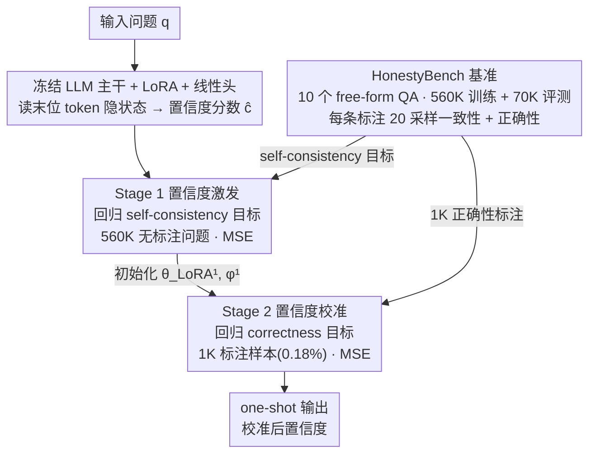

# Annotation-Efficient Universal Honesty Alignment

**会议**: ICLR 2026  
**arXiv**: [2510.17509](https://arxiv.org/abs/2510.17509)  
**代码**: 有（GitHub 链接）  
**领域**: LLM推理  
**关键词**: honesty alignment, confidence calibration, self-consistency, annotation efficiency, LLM trustworthiness

## 一句话总结
提出 EliCal（先激发后校准）两阶段框架，先用无标注的 self-consistency 信号教 LLM 表达内部置信度，再用极少量正确性标注（仅 1k 个，占 0.18%）进行校准，在 HonestyBench（560K 训练 + 70K 评估）上达到接近全量标注 98% 的诚实性对齐性能，并在未见 MMLU 任务上泛化优于仅校准基线。

## 研究背景与动机
**领域现状**：LLM 诚实性对齐（honesty alignment）要求模型准确认识自己的知识边界并表达校准后的置信度。现有方法分两类：免训练的置信度估计（token 概率、self-consistency）和基于训练的校准（需正确性标注）。

**现有痛点**：基于训练的方法效果更好，但实现跨任务的"通用"诚实性对齐需要大规模正确性标注——对每个问题都需要 ground truth 答案来判断模型是否回答正确。这成本极高。

**核心矛盾**：正确性标注同时承担两个角色——(1) 教模型表达置信度；(2) 将置信度与正确性校准。如果第一个角色可以用更廉价的信号实现，那么只需少量标注做第二步。

**本文目标** 如何用最少的正确性标注实现高质量的诚实性对齐？

**切入角度**：观察到 self-consistency 置信度（多次采样的语义一致性比例）与实际正确率高度相关，且是免费生成的。用它先教模型表达置信度（Stage 1），再用少量标注校准（Stage 2）。

**核心 idea**："先激发，后校准"——用 self-consistency 做预训练级别的置信度学习，用极少标注做微调级别的校准。

## 方法详解

### 整体框架
EliCal 的出发点是把"通用诚实性对齐"里最贵的那部分省掉。正确性标注同时承担两件事——教模型**表达**自己的置信度、再把这个置信度**校准**到真实正确率——而第一件事其实不必依赖昂贵的 ground truth。EliCal 据此拆成两阶段：Stage 1（置信度激发）在 HonestyBench 的 560K 个问题上，用免费的 self-consistency 信号训练模型一次性吐出内部置信度，全程不碰正确性标注；Stage 2（置信度校准）从 Stage 1 的参数接着出发，只拿 1K 个带正确性标注的样本，把"会表达置信度"的模型微调到与真实正确率对齐。

模型这一侧很轻：冻结 LLM 主干参数 $\theta$，只在所有线性层挂上 LoRA，并在最后一层接一个线性头 $f_\phi$，读取问题末位 token 的隐状态 $\mathbf{h}^{(L)}_T$，输出一个标量置信度 $\hat c=\mathbf{w}^\top\mathbf{h}^{(L)}_T+b$。两阶段共用这一套结构、共用 MSE 损失，差别只在回归目标（self-consistency vs. correctness）和数据量（560K vs. 1K）。这正是一个"预训练—微调"范式：重活压在无标注的激发阶段，标注只用来收尾，所以远比"从零校准"（Cal-Only）省标注、且更易泛化到未见任务。

### 关键设计

**1. Stage 1 置信度激发：用免费的 self-consistency 信号教模型"感知自己有多确定"**

通用诚实性对齐最贵的地方在于，正确性标注既要教模型表达置信度、又要做校准，而"表达"这件事本不该靠 ground truth。Stage 1 就把表达能力的学习改成完全无标注：对每个问题在解码策略 $\pi$ 下采样 $k=20$ 个回答 $\hat{\mathcal{R}}$，统计其中与 greedy 回答 $\tilde r$ 语义一致的比例，作为 self-consistency 目标 $\text{Confidence}_\theta(q)=\frac{1}{k}\sum_{r\in\hat{\mathcal{R}}}s(r,\tilde r)$（$s(\cdot)=1$ 表示语义一致）；再用 MSE 损失 $\frac{1}{|\mathcal{Q}|}\sum_q\big(\hat c(q)-\text{Confidence}_\theta(q)\big)^2$ 训练 LoRA + 线性头去预测这个量。训练完，模型在推理时只需一次前向（one-shot）就能给出这个置信度，不必真的再采样 20 次。之所以这个免费信号管用，是因为 self-consistency 与真实正确率高度相关（Figure 2）——它不等于正确率，但足够好地刻画了"模型对自己答案有多笃定"，先把这层感知建立起来。

**2. Stage 2 置信度校准：用极少量标注完成"最后一公里"的对齐**

self-consistency 只反映模型对自己回答有多一致，而模型普遍过度自信，"一致"并不等于"答对"，所以还差一步把置信度拉到真实正确率上。Stage 2 从 Stage 1 得到的 $\theta_{\text{LoRA}}^1,\phi^1$ 出发，继续用同样的 MSE 损失微调，但把回归目标从 self-consistency 换成基于 ground truth 的正确率 $\text{Accuracy}_\theta(q)$（20 个采样回答中命中标准答案的比例），即 $\frac{1}{|\mathcal{Q}_{\text{small}}|}\sum_q\big(\hat c(q)-\text{Accuracy}_\theta(q)\big)^2$。关键在于此时只需约 1K 个标注样本：表达置信度的能力已在 Stage 1 学到，这一步只是把已有的"内部笃定度"映射重定到真实正确率上，因而走的是微调而非从头训练——这也是 EliCal 比 Cal-Only 省标注、且校准后泛化更好的根因。

**3. HonestyBench 基准：把通用诚实性对齐放到大规模、跨任务的尺度上评测**

此前的诚实性研究多在单个小数据集上做 in-domain 评估，无法说明方法是否"通用"。HonestyBench 整合 10 个 free-form factual QA 数据集，给出 560K 训练 + 38K in-domain 评估 + 33K OOD 评估的划分，覆盖 3 个代表性 LLM（Qwen2.5-7B/14B、Llama-3-8B）。它为每个模型-问题对存下 20 个采样回答 + 1 个 greedy 回答，并同时标注 self-consistency 一致性与正确性——前者直接喂给 Stage 1 的激发、后者供 Stage 2 校准与最终评测，从而能在 in-domain 和 OOD（如完全未见的 MMLU）两侧检验对齐是否真正泛化。

### 损失函数 / 训练策略
两阶段共用同一套 MSE 回归损失与同一套可训练参数（LoRA + 线性头，LLM 主干始终冻结），区别只在回归目标和数据规模：Stage 1 在全量 560K 无标注问题上回归 self-consistency 目标，Stage 2 在 1K 正确性标注样本上接着回归 correctness 目标。这种"先大规模无标注激发、后小样本标注校准"的两段式安排，正是 EliCal 标注效率比从头校准高 500 倍以上的来源。

## 实验关键数据

### 主实验

| 方法 | 标注量 | In-Domain 性能 | OOD 性能 |
|------|--------|---------------|----------|
| 最佳免训练方法 (Self-Consistency) | 0 | 基线 | 基线 |
| Cal-Only（全量标注） | 560K | Upper bound | - |
| EliCal + Cal-Only (全量) | 560K | Upper bound（比免训练高 17%+） | - |
| **EliCal (仅 1K 标注)** | **1K (0.18%)** | **~98% of upper bound** | **显著优于 Cal-Only** |
| Cal-Only (仅 1K 标注) | 1K | 显著低于 EliCal | 较差 |

### 消融实验

| 配置 | 效果 | 说明 |
|------|------|------|
| Cal-Only (从头校准) | 需要 >>1K 标注 | 没有 elicitation 阶段，大量标注才能收敛 |
| EliCal 1K | ~98% upper bound | 预训练-微调范式极大提升标注效率 |
| MMLU (OOD) | EliCal >> Cal-Only | 泛化到未见任务 |

### 关键发现
- EliCal 仅用 0.18% 的标注量达到 98% 的最佳性能，标注效率提升超 500 倍
- 在 MMLU（完全 OOD 的任务）上，EliCal 一致优于 Cal-Only——说明 self-consistency 预训练提供了更好的泛化基础
- Self-consistency 置信度与正确率的相关性在多个模型上都很高，但模型普遍过度自信——这正是需要 Stage 2 校准的原因
- 全量标注时 EliCal 和 Cal-Only 性能持平（都达到 upper bound），但少标注时 EliCal 显著更好

## 亮点与洞察
- **预训练-微调范式迁移到置信度学习**：用廉价信号做"预训练"、用昂贵标注做"微调"的思路非常优雅，具有方法论上的泛用性
- **Self-consistency 作为免费监督信号的价值**：虽然 self-consistency ≠ correctness（模型可能一致地错），但它是一个足够好的代理信号来教会模型"表达置信度"
- **HonestyBench 基准的实用价值**：560K 规模、三个模型、10 个数据集的标注资源，为社区提供了标准化的诚实性评估平台

## 局限与展望
- Self-consistency 需要多次采样（k=20）来生成训练信号，虽然只在 Stage 1 构建数据时需要，推理时是 one-shot
- 仅在 free-form QA 上验证，对 reasoning/math 等需要更精确置信度的任务未覆盖
- 线性头 + LoRA 的架构选择是否最优尚未充分探索
- 校准后的置信度是否在 RAG 触发等下游应用中真正有效尚需验证

## 相关工作与启发
- **vs Cal-Only (Zhang et al., 2024)**: Cal-Only 在少标注时性能大幅下降，EliCal 通过 elicitation 阶段解决了这个问题
- **vs 训练免方法 (Self-Consistency)**: EliCal 的 one-shot 推理比 self-consistency 的 20 次采样高效得多，且校准后更准确
- **vs R-Tuning (Yang et al., 2023)**: R-Tuning 只在单数据集上训练和测试，EliCal 瞄准跨任务的通用诚实性

## 评分
- 新颖性: ⭐⭐⭐⭐ 两阶段框架的设计理念有创新，免标注的 elicitation 阶段很巧妙
- 实验充分度: ⭐⭐⭐⭐⭐ 大规模 benchmark、多模型、in-domain+OOD、详细的标注效率分析
- 写作质量: ⭐⭐⭐⭐⭐ 动机清晰，形式化完整，叙事流畅
- 价值: ⭐⭐⭐⭐⭐ HonestyBench + EliCal 构成了诚实性对齐方向的重要基础设施和方法论

<!-- RELATED:START -->

## 相关论文

- [\[ICLR 2026\] The Path of Least Resistance: Guiding LLM Reasoning Trajectories for Efficient Consistency](the_path_of_least_resistance_guiding_llm_reasoning_trajectories_for_efficient_co.md)
- [\[ICLR 2026\] A State-Transition Framework for Efficient LLM Reasoning](a_state-transition_framework_for_efficient_llm_reasoning.md)
- [\[AAAI 2026\] SPARE: Single-Pass Annotation with Reference-Guided Evaluation for Automatic Process Supervision](../../AAAI2026/llm_reasoning/spare_single-pass_annotation_with_reference-guided_evaluation_for_automatic_proc.md)
- [\[ICLR 2026\] DRPO: Efficient Reasoning via Decoupled Reward Policy Optimization](drpo_efficient_reasoning_via_decoupled_reward_policy_optimization.md)
- [\[ICML 2026\] The Role of Feedback Alignment in Self-Distillation](../../ICML2026/llm_reasoning/the_role_of_feedback_alignment_in_self-distillation.md)

<!-- RELATED:END -->
