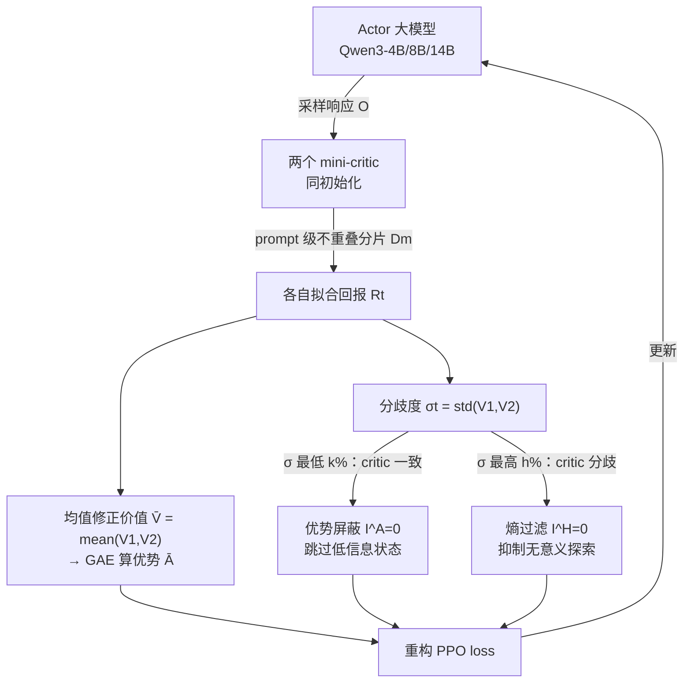

# Asymmetric Proximal Policy Optimization: Mini-Critics Boost LLM Reasoning

**会议**: ICLR 2026  
**OpenReview**: [https://openreview.net/forum?id=0vgzrcv4Dr](https://openreview.net/forum?id=0vgzrcv4Dr)  
**代码**: 待确认  
**领域**: LLM 推理 / RL4LLM  
**关键词**: PPO, 非对称 actor-critic, mini-critic 集成, 价值估计, 熵正则, RLVR  

## 一句话总结
AsyPPO 用两个轻量 mini-critic（在 prompt 级别不重叠的数据分片上训练）替代与 actor 同等大小的笨重 critic，既恢复了 PPO 价值函数的作用又保持 GRPO 级别的开销，并进一步用两个 critic 的"分歧度"信号去做优势屏蔽和熵过滤，在 Qwen3-4B/8B/14B 上稳定超越 GRPO 和经典 PPO。

## 研究背景与动机
**领域现状**：PPO 是经典深度 RL 中最有效的 actor-critic 算法，迁移到 LLM 后训练成"做对题给奖励"的 RLVR 也很成功。但 PPO 默认采用对称设计——critic 和 actor 一样大。在 LLM 尺度上训练一个全尺寸 critic 既昂贵，又在稀疏奖励、超长推理链下估不准。于是 GRPO/DAPO/GSPO 这批主流方法干脆扔掉 critic，用一组采样的平均优势作 baseline 来粗粒度估计优势。

**现有痛点**：丢掉 critic 看似省事，却也丢掉了 RL 的一个核心能力——鲁棒的状态价值估计本可以缓解优势偏差导致的训练崩溃，尤其在 off-policy（样本被重复利用）场景下。GRPO 这类无 critic 方法在高样本复用比下容易不稳。

**核心矛盾**：想要 critic 带来的细粒度、鲁棒价值估计，又不想付出"critic 和 actor 一样大"的算力代价。能不能重新设计 PPO，跳出对称 actor-critic 架构，做到轻量却鲁棒的价值估计？

**本文目标**：把 RL4LLM 的 critic 瓶颈重新定义为一个**架构问题**而非纯算法/优化问题，恢复 critic 的角色同时保持 LLM 尺度下的高效。

**核心 idea**：作者的关键洞察是——**预训练模型自带的丰富表征能力，让"小 critic 指导大 actor"的非对称架构在 RL4LLM 里变得可行**（这是和"从零学起"的经典 RL agent 最大的区别）。一个 0.6B 的 critic 居然能给 8B 的 actor 提供有意义的指导。但单个小 critic 不如对称 PPO，于是引入 critic 集成；又因为 LLM critic 都从同一预训练 checkpoint 初始化导致集成无效，于是提出**不重叠数据分片**来制造差异；最后发现两个 critic 之间的"一致 / 分歧"模式本身就是宝贵信号，可用来重构 policy loss。

## 方法详解

### 整体框架
AsyPPO 把 PPO 的对称 actor-critic 改成"一个大 actor + 两个轻量 mini-critic"。两个 mini-critic 从同一预训练模型初始化，但分别在 prompt 级别互不重叠的数据子集上训练，从而学出有差异、却仍校准的价值估计；取二者均值修正优势，喂给 GAE。在此基础上，进一步把两 critic 价值估计的标准差 $\sigma_t$ 当作"状态信息量/不确定性"的代理信号，反过来改写 PPO 的损失：在 critic 高度一致的状态屏蔽优势，在 critic 严重分歧的状态过滤掉熵正则。

### 关键设计

**1. 非对称 mini-critic + prompt 级不重叠分片：让小 critic 集成真正有差异**。作者先验证单个 0.6B 小 critic 能指导 8B actor，说明非对称架构可行，但单 critic 价值估计能力有限、跑不过对称 PPO。自然想到用 critic 集成降偏差，可这里有个 LLM 特有的坑：经典 RL 的 critic 是随机初始化的，天生有参数多样性；而 LLM 的 critic 都从同一预训练 checkpoint 出发、只换了 value head，又在同一份数据上训，结果两个 critic 行为几乎一模一样，集成等于没集成。作者的解法是给每个 critic **喂不同的数据**——但不能随机切，随机切会让不同 critic 看到不同 prompt 的推理模式，产生 prompt 级"感知不同步"甚至导致策略崩溃。于是改成在 prompt（group）层面均匀切分：每个 critic 在每道题内拿到等量但不重叠的响应，既保持题内感知同步、又制造了奖励/观测的差异。集成 critic 训练目标为
$$L_{\text{critic}}(\phi)=\sum_{m=1}^{M}\mathbb{E}_{(s_t,R_t)\sim D_m}\big[(V(s_t;\phi_m)-R_t)^2\big],\quad D=\bigcup_m D_m,\ D_i\cap D_j=\varnothing$$
修正后的优势用两 critic 均值价值算 GAE：$\bar V(s_t)=\frac1M\sum_m V_m(s_t;\phi_m)$，$\bar A_t=\sum_l(\gamma\lambda)^l\delta_{t+l}$，$\delta_t=r_t+\gamma\bar V(s_{t+1})-\bar V(s_t)$。实验发现**两个 critic 就是甜点**——一举提升估计可靠性，再加更多 critic 只增算力不增收益。

**2. 基于价值一致度的优势屏蔽：丢掉学不到东西的状态**。有了两个有差异的 critic，它们价值估计的标准差 $\sigma_t=\mathrm{std}(\{V(s_t;\phi_m)\})$ 就成了状态信息量的天然度量。作者观察到：当两个 critic 对某状态高度一致（$\sigma_t$ 很小），往往说明这个状态的下游动态已被策略很好地建模、回报方差低，是高频、低信息的样本——继续在上面更新只会过拟合。于是把 $\sigma$ 最低的 $k\%$ 状态的优势屏蔽掉，损失里加一个指示符 $I^A_t$：
$$J_{\text{PPO}}(\theta)=\mathbb{E}\frac1{|o|}\sum_{t=1}^{|o|}I^A_t\cdot\min\!\big(IS_t\cdot\bar A_t,\ \mathrm{clip}(IS_t,1-\epsilon,1+\epsilon)\bar A_t\big),\quad I^A_t=\begin{cases}0,&\sigma_t\in\mathrm{Low}_k(\sigma)\\1,&\text{otherwise}\end{cases}$$
在高样本复用（UTD=4，每个样本训四遍）下屏蔽底部 20% 能稳住学习动态、提升约 6 个点。作者还把这种 **critic 侧不确定性（value-std）和 policy 侧不确定性（entropy）**对比：value-std 屏蔽的学习收益更强，且低 value-std 状态总是对应低熵，说明 value-std 是更精准的不确定性度量。

**3. 基于价值分歧的熵过滤：别在"非决策状态"上瞎探索**。反过来，当两个 critic 对某状态评估**严重分歧**（$\sigma_t$ 很大），往往意味着这个状态和最终结果耦合很弱、未来动态复杂——比如经过它的轨迹里混着推理无关的 token（副词、感叹词）或语义噪声，配合较大的 $\lambda$，回报分布的离散会回传到各状态放大分歧。在这种"非决策状态"上做熵探索是浪费。作者因此引入一个加权 $\beta$ 的"安全熵正则"，把 value-std 最高的 $h\%$ 状态从熵项里过滤掉：
$$J_{\text{PPO}}(\theta)=\mathbb{E}\frac1{|o|}\sum_{t=1}^{|o|}\Big[I^A_t\cdot\min(\cdots)+\beta\cdot I^H_t\cdot H[\pi_\theta(\cdot|s_t)]\Big],\quad I^H_t=\begin{cases}0,&\sigma_t\in\mathrm{Top}_h(\sigma)\\1,&\text{otherwise}\end{cases}$$
naive 熵正则容易把策略推向熵崩溃，而这种过滤后的熵正则缓解了崩溃、稳住训练、把策略导向更高回报的收敛。有意思的是 value-std 高的集合和 entropy 高的集合几乎不重叠：过滤掉 40% 高 value-std 状态熵仍稳定，过滤同比例高熵状态却会熵崩溃——再次说明两种信号本质不同。

## 实验关键数据

### 主实验（泛化到大模型，14B actor，average@4）
在 MATH-500、Minerva Math、AMC 2023、OlympiadBench 四个难基准上，actor 固定 Qwen3-14B-Base，UTD=4（off-policy），batch 1024、最大长度 8192、lr 1e-6。

| 方法 | 配置 | 相对表现 |
|------|------|---------|
| GRPO | 无 critic，平均优势 baseline | 基线 |
| Naive 非对称 PPO | 单 1.7B critic 指导 14B | **失败**（capacity 不够） |
| Naive 非对称 PPO | 单 4B critic 指导 14B | 恢复有效学习 |
| 经典对称 PPO | 14B critic | 高开销 |
| **AsyPPO** | 双 4B critic + 20% 屏蔽 + 20% 过滤 | **四项最强，比 GRPO 平均高约 3 点** |

关键现象：单 critic 存在明显的"critic 容量阈值"——1.7B critic 能指导 8B actor 却带不动 14B actor，要升到 4B 才行；而 **AsyPPO 把这个门槛降下来了，1.7B 双 critic 就能给 14B actor 带来可观的推理增益**。算力上非对称架构相比对称 PPO 峰值显存降约 20%、每步训练快约 20 秒，停在 GRPO 级别。

### 消融实验

| 维度 | 结论 |
|------|------|
| critic 尺寸 | 类似 scaling-law：critic 越大策略峰值越高，建议用显存能放下的最大 critic |
| critic 数量 | **两个 mini-critic 即出现质变**，再加更多只增算力不增收益 |
| group size | 32 最稳健 |
| 价值聚合方式 | 取均值优于取 min，说明 RL4LLM 里高估不是主要问题 |
| 优势屏蔽比例 | 屏蔽 20% 最低 value-std 状态收益最强 |
| 熵过滤比例 | 20% 平衡探索-利用最好，过滤更多（30/40%）会熵崩溃 |

### 关键发现
- 仅用 5k 开源样本（DeepMath-103K 采样）训练，AsyPPO 在 Qwen3-4B-Base 上比经典 PPO 提升 >6%，在 8B/14B 上约 3%，且无额外 trick。
- value-std 屏蔽（约 6 点）和熵过滤（约 7 点）两个改动各自都带来可观增益。
- 低 value-std 状态总伴随低熵，但低熵状态未必低 value-std——value-std 是更精准的状态不确定性度量。

## 亮点与洞察
- **把"要不要 critic"重新定义为架构问题**。社区主流是算法层面绕开 critic（GRPO 系），本文反其道而行：critic 没问题，问题是"和 actor 一样大"这个对称假设——拆掉它就能两全。视角很清新。
- **善用预训练先验**。经典 RL 从零学，小 critic 表征弱；LLM 的小 critic 继承了预训练表征，所以"小指导大"才成立。这个 RL4LLM vs 经典 RL 的根本差异被作者讲得很到位。
- **一个信号、两种用法**。两 critic 的标准差既当"信息量"（一致→屏蔽优势）又当"非决策性"（分歧→过滤熵），把集成的副产品榨成了优化信号，设计很经济。
- **"双 critic 是甜点"**有实用价值：直接告诉工程实践只需两个 mini-critic，省去了集成规模调参。

## 局限与展望
- 所有实验 actor/critic 都来自 Qwen3 系列，未验证 Llama 等其他模型族，也未做跨族 critic 集成。
- 最大生成长度固定 8k，未评估超长推理预算（更长 CoT）下的表现。
- 随机种子较少，作者自己也承认需要更多种子来加固结论的鲁棒性。
- 未来方向：异构（不同族/尺寸）critic 集成、置信度加权的集成 critic、以及 value 不确定性与 entropy 关系的更深入分析。

## 相关工作与启发
- **无 critic RL4LLM**：GRPO、DAPO、GSPO 用 group 采样的平均优势替代价值函数，是本文要"补回 critic"的对照面。
- **critic 增强**：T-PPO 用 critic 稳定长尾异步训练；Implicit PRM、PRIME 用类 critic 模型提供 token 级监督，与本文都在强调价值/过程信号的价值。
- **非对称架构**：连续控制 RL 里早有"actor 可以比 critic 小"的研究（稀疏化/剪枝 actor），本文反过来是**首次系统探索"小 critic 指导大 actor"**，并放进 RL4LLM 场景。
- 启发：集成不确定性当优化信号（Osband 等 bootstrapped DQN 的思路）在 LLM RL 里被重新激活；"用什么不确定性"（critic 侧 value-std vs policy 侧 entropy）的对比，对后续 RLVR 的探索机制设计有参考价值。

## 评分
- **新颖性**: ⭐⭐⭐⭐⭐ 在 GRPO 系"无 critic"成为主流的当下逆向恢复 critic，且把它做成轻量非对称架构 + 不重叠分片 + 集成分歧信号三件套，视角和方法都新。
- **实验充分度**: ⭐⭐⭐⭐ 覆盖 4B/8B/14B 三个规模、多个数学基准，消融把 critic 尺寸/数量/group size/聚合/屏蔽-过滤比例都扫了；扣分在仅 Qwen3 一个模型族、8k 长度、种子偏少。
- **写作质量**: ⭐⭐⭐⭐ 三个 Takeaway 收束清晰，动机递进（单 critic→集成失败→分片→分歧信号）讲得有逻辑，图示直观；公式略多但都服务于主线。
- **价值**: ⭐⭐⭐⭐⭐ 给 RL4LLM 提供了一条"既要 critic 鲁棒性又要 GRPO 级开销"的实用路线，5k 样本、显存降 20%、可观增益，工程落地性强。

<!-- RELATED:START -->

## 相关论文

- [\[ICLR 2026\] Reference-guided Policy Optimization for Molecular Optimization via LLM Reasoning](reference-guided_policy_optimization_for_molecular_optimization_via_llm_reasonin.md)
- [\[ICLR 2026\] HiPO: Self-Hint Policy Optimization for RLVR](hipo_self-hint_policy_optimization_for_rlvr.md)
- [\[ICLR 2026\] Slow-Fast Policy Optimization: Reposition-Before-Update for LLM Reasoning](slow-fast_policy_optimization_reposition-before-update_for_llm_reasoning.md)
- [\[ICLR 2026\] Scaf-GRPO: Scaffolded Group Relative Policy Optimization for Enhancing LLM Reasoning](scaf-grpo_scaffolded_group_relative_policy_optimization_for_enhancing_llm_reason.md)
- [\[ICLR 2026\] Inpainting-Guided Policy Optimization for Diffusion Large Language Models](inpainting-guided_policy_optimization_for_diffusion_large_language_models.md)

<!-- RELATED:END -->
