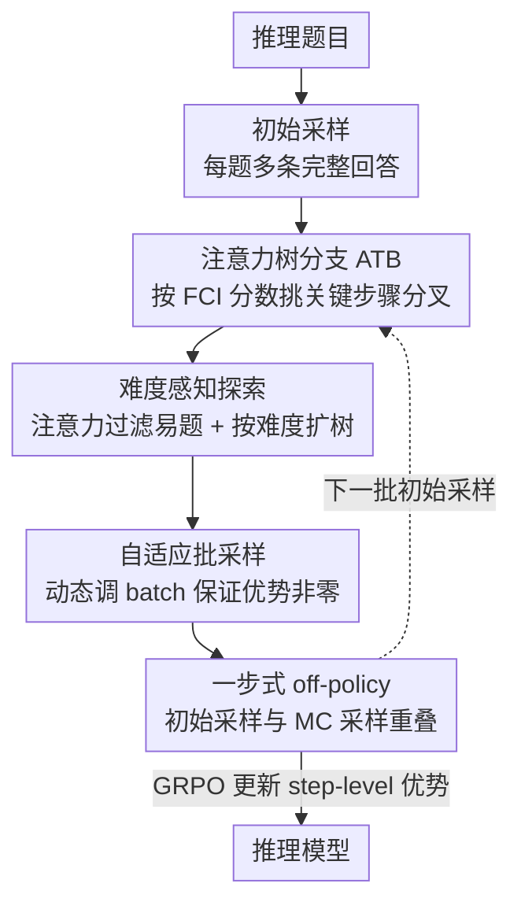

# Attention as a Compass: Efficient Exploration for Process-Supervised RL in Reasoning Models

**会议**: ICLR2026  
**OpenReview**: [https://openreview.net/forum?id=NCN8oUsiNf](https://openreview.net/forum?id=NCN8oUsiNf)  
**代码**: https://github.com/RyanLiu112/AttnRL  
**领域**: 强化学习 / LLM 推理  
**关键词**: 过程监督 RL、注意力分支、自适应采样、探索效率、数学推理

## 一句话总结
AttnRL 用模型自身的注意力分数当"指南针"，在推理过程中最关键的步骤上做树分支（而不是按固定长度或熵切分），再配合按题目难度自适应的采样和一步式 off-policy 训练流水线，让过程监督 RL（PSRL）在数学推理上既涨点又省算力——1.5B 上平均提升 7.5%，墙钟时间还比 TreeRL 更短。

## 研究背景与动机
**领域现状**：用可验证奖励的强化学习（RLVR）已经成为提升 LLM 推理能力的主流后训练范式，DeepSeek-R1 之后尤其如此。其中最常见的是 GRPO 这类**结果监督 RL（OSRL）**——只看最终答案对不对，把同一条回答里所有 token 都赋予相同的训练信号。更精细的一支是**过程监督 RL（PSRL）**，它用蒙特卡洛（MC）采样在推理路径中间"分叉"出多条续写，从而估计出每一步（step-level）的优势值，做更细粒度的信用分配。

**现有痛点**：现有 PSRL 方法在"探索效率"上有三个具体毛病。其一，**在哪里分叉是瞎选的**——要么按固定 token 长度切，要么按熵值切，都忽略了输出的语义，导致分支位置经常落在不重要的步骤上。其二，**对所有题目一视同仁地均匀采样**——简单题（初始采样就 100% 正确）在两轮采样里有约 70%-80% 概率全对，优势值恒为 0、对训练毫无贡献，却白白吃掉了采样预算。其三，**每次更新要采样两轮**（先初始采样、再 MC 采样），而采样往往是整个 RL 训练里最耗时的部分，两步采样把成本直接翻倍。

**核心矛盾**：PSRL 想要细粒度的过程信号，就必须靠 MC 采样去"试探"中间步骤；但试探的位置、试探的对象、试探的轮数全是低效的，于是"想精细"和"算力贵"之间形成了尖锐的 trade-off。要让 PSRL 真正实用，必须同时把这三处低效都修掉。

**切入角度**：作者注意到一条来自可解释性研究的线索——自注意力里的"巨大注意力值（massive attention values）"往往标记着对回答最关键的 token。作者顺着这个观察追问：在复杂推理任务里，这种高注意力步骤是否对应着规划、自我验证这类**推理行为**？如果是，那注意力就能当成一个现成的、不需要额外训练奖励模型的"重要性指南针"。

**核心 idea**：用注意力分数定位推理中最关键的步骤，**在这些步骤上分支**（哪里重要就在哪里探索），再叠加难度自适应的采样过滤与一步 off-policy 流水线，把 PSRL 的探索和训练效率一起拉起来。

## 方法详解

### 整体框架
AttnRL 是一个建立在 TreeRL（树状优势估计）之上的 PSRL 框架，输入是数学推理题目，输出是经 RL 微调后的推理模型。它把一次训练迭代拆成三块协同工作：先做一次初始采样得到若干完整回答，然后用**注意力树分支（ATB）**在每条回答里挑出最该探索的步骤、从那里做 MC 续写形成树并估计 step-level 优势；与此同时，用**自适应采样**在题目层面做难度感知的过滤与扩展、在 batch 层面动态调整采样规模，保证最终进入训练的样本优势值非零；最后用**一步式 off-policy 流水线**把"为下一批做初始采样"和"为当前批做 MC 采样"重叠进同一次生成，消掉重复采样。三者分别对应三处痛点：分支位置、采样对象/规模、采样轮数。

### 关键设计

**1. 注意力树分支 ATB：让分支落在"真正在推理"的步骤上**

这一点针对"分支位置瞎选"的痛点。作者先把回答按连续两个换行（`\n\n`）切成 $T_k$ 个 step，用一次前向传播取出 token 到 token 的注意力，再聚合到 step 级，得到 step-to-step 的注意力矩阵 $\alpha^{l,h}_{j,k}$（第 $j$ 步对第 $k$ 步在第 $l$ 层第 $h$ 头上的注意力）。在此基础上定义**前向上下文影响力（Forward Context Influence, FCI）分数**：把某一步 $k$ 被后续各步关注的注意力加总，$y^{l,h}_k = \sum_{j=k+\Delta}^{T_k} \alpha^{l,h}_{j,k}$，其中 $\Delta=4$ 用来跳过紧邻的几步、只看足够远的下文影响；再跨层跨头取最大值 $y_k = \max_{l,h}\{y^{l,h}_k\}$。$y_k$ 越大，说明第 $k$ 步对下游生成的影响越深。作者用两组实验论证它有效：可视化显示高 FCI 步骤大多对应"让我算一下""等等，我验证一下"这类规划/自我验证行为；扰动实验里，把 FCI 排前 20% 步骤的注意力置零会让准确率显著下滑，而扰动其余步骤几乎无影响，且越靠前的步骤被扰动伤害越大。据此 ATB 取 FCI 排前 $\rho=0.2$ 分位的步骤集合 $C=\{k \mid k \ge \text{Quantile}(y_1,\dots,y_{T_k}, \rho)\}$ 作为候选，又因为"早期错误步骤容易把整条路径带偏"（即所谓 Tunnel Vision），从 $C$ 里只选**最靠前的 $N=2$ 个**步骤当真正的分叉点。这样分支既落在高影响力位置、又分散在早期，能撑开更多样的推理路径。

**2. 难度感知探索：注意力过滤易题 + 按难度自适应扩树**

这一点针对"对所有题均匀采样"的浪费。作者复用同一套注意力信号做**注意力过滤**：统计每道题所有步骤的平均 FCI 分数 $\frac{1}{G}\sum_i \frac{1}{T_{i,k}}\sum_k y_{i,k}$，经验发现初始采样全对、且平均注意力偏低的题目极大概率优势恒为 0（怎么采都全对、学不到东西），于是只保留注意力高于全局均值的题目 $D_{\text{MC}}$。过滤之后再做**难度自适应扩展**：用初始采样正确率定义难度分 $z_n = \frac{1}{G}\sum_i \mathbb{1}(o_i\ \text{correct})$，越难的题越该多探，于是展开的树数量 $M = \text{Round}(\exp(-z_n)\times M')$（$M'=6$ 是基础树数）——难题 $z_n$ 小、$\exp(-z_n)$ 大，分到更多树；简单题反之。注意力当过滤器、难度当分配器，把有限的 MC 预算从简单题挪向真正需要探索的难题。

**3. 自适应批采样：动态调 batch，保证整批样本优势非零**

即便过滤了易题，MC 采样后仍有大量回答优势为 0、对训练无贡献，导致每个 batch 的"有效样本"忽多忽少。作者引入动态 batch 机制：设目标训练 batch 为 $B'$、第 $m$ 步实际有效的训练 batch 为 $B''_m$、采样的 prompt batch 为 $B_m$，则下一步采样规模按 $B_{m+1} = \text{Round}(\lambda B_m + (1-\lambda)\frac{B'}{B''_m}B_m)$ 更新（$\lambda=0.9$ 是 EMA 平滑权重）——本步有效样本偏少就调大采样、偏多就调小。MC 采样后丢弃所有零优势回答，确保最终训练 batch 里**每个样本都有非零优势**。与 DAPO 的动态采样相比，它有两个区别：每个训练步只需一轮 prompt 采样与生成（DAPO 可能反复补采）；不会在有效样本超过 $B'$ 时白白丢弃，使实际 batch 自然在 $B'$ 附近小幅波动而非剧烈起伏。

**4. 一步式 off-policy 流水线：把两轮采样压成一次生成**

这一点针对 PSRL "每次更新采样两轮"的根本低效。传统做法每个迭代要先初始采样、再 MC 采样两次生成；AttnRL 借鉴近期高效 RL 训练思路，每个训练步只做**一次**采样：在第 $m$ 步，一边为第 $m{+}1$ 批做初始采样、一边为第 $m$ 批做 MC 采样，让"某批的初始采样发生在第 $m{-}1$ 步、它的 MC 采样发生在第 $m$ 步"自然衔接，从而消除冗余生成。代价是 MC 采样用的策略比当前策略落后一步（即 one-step off-policy），但实测这点偏离对性能无害，却把采样这个最耗时的环节砍掉一半，墙钟时间相比原版 TreeRL 实现减少约 8%。

### 损失函数 / 训练策略
策略优化沿用 GRPO 目标（式 1 的 clip + KL 正则），与 OSRL 一致，差别只在优势的粒度——AttnRL 的优势来自 TreeRL 的树状估计：节点价值 $V(s_k)$ 取其所有子节点正确率均值，最终 step-level 优势 $\hat{A}_{i,k} = \frac{1}{\sqrt{|L(s_k)|}}\big[(V(s_k)-V(s_1)) + (V(s_k)-V(p(s_k)))\big]$，由全局优势与局部优势相加、再用 $\sqrt{|L(s_k)|}$ 弱化非叶节点的优化强度以防过拟合。训练用 verl 框架、vLLM 生成，采用 token-level policy loss、Clip-Higher（$\varepsilon_{\text{high}}=0.28$）、KL 权重 0.001，batch 64、PPO minibatch 32、学习率 $1\times10^{-6}$。

## 实验关键数据

### 主实验
在六个数学推理 benchmark（AIME24/25、AMC23、MATH-500、Minerva、OlympiadBench）上，以 DS-R1-Distill-Qwen-1.5B / 7B 为基座，与 GRPO、TreeRL、DeepScaleR-Preview-1.5B 对比（Pass@1 平均）：

| 模型 / 方法 | AIME24 | AIME25 | AMC23 | MATH-500 | Minerva | Olympiad | 平均 |
|------------|--------|--------|-------|----------|---------|----------|------|
| DS-R1-Distill-Qwen-1.5B（基座） | 28.3 | 23.0 | 71.8 | 84.8 | 35.6 | 54.9 | 49.7 |
| GRPO | 36.9 | 27.2 | 77.7 | 88.4 | 39.5 | 60.4 | 55.0 |
| DeepScaleR-Preview-1.5B | 40.5 | 28.3 | 81.0 | 89.5 | 38.1 | 61.8 | 56.5 |
| TreeRL | 36.7 | 27.1 | 78.9 | 88.5 | 38.7 | 60.9 | 55.1 |
| **AttnRL (1.5B)** | 39.7 | 28.5 | **83.2** | **90.0** | 40.3 | 61.4 | **57.2** |
| DS-R1-Distill-Qwen-7B（基座） | 54.0 | 40.0 | 89.8 | 94.1 | 48.1 | 70.0 | 66.0 |
| TreeRL (7B) | 55.4 | 40.0 | 92.2 | 94.3 | 49.0 | 70.7 | 66.9 |
| **AttnRL (7B)** | **59.3** | **42.5** | **92.5** | **95.4** | **49.3** | **73.3** | **68.7** |

1.5B 上比基座平均 +7.5%、比 GRPO/TreeRL 各高约 1.9%/1.8%，且超过用三段式上下文扩展（8K→16K→24K、1750 步）训练的 DeepScaleR——而 AttnRL 只用 8K 响应长度、500 步就做到。7B 上比 TreeRL 平均 +1.8%（AIME24 提升尤为明显）。

### 消融实验
DS-R1-Distill-Qwen-1.5B 上逐组件拆解（平均 Pass@1）：

| 配置 | 平均 | 说明 |
|------|------|------|
| TreeRL | 55.1 | 基线（按熵分支 + 均匀采样 + 两步采样） |
| w/ 前 2 步分支 | 55.4 | 只取最早 2 步分支但不看 FCI |
| w/ ATB | 56.3 | 加注意力树分支，比 TreeRL +1.2% |
| w/ ATB + ADS（去注意力过滤） | 56.4 | 自适应采样里拿掉易题过滤 |
| w/ ATB + ADS（去难度自适应扩展） | 56.8 | 拿掉按难度扩树 |
| **AttnRL（完整）** | **57.2** | ATB + 完整自适应采样 |

### 关键发现
- **ATB 是涨点主力**：单加 ATB 就比 TreeRL +1.2%，说明"在高 FCI 步骤分支"确实比按熵分支采到更有效的样本——可视化里 ATB 的 solve-all/solve-none 比例都更低、valid 比例更高，意味着在简单题和难题上都探得更准。
- **过滤易题要"适度"**：消融里把初始全对的题全过滤掉反而略掉点，因为即便是"简单题"在 MC 采样下也可能出错、提供有价值的训练信号；所以 AttnRL 用注意力阈值做软过滤而非一刀切。
- **效率换得漂亮**：训练效率对比中，AttnRL 墙钟时间 62.6（GRPO 54.0、TreeRL 67.7）却拿到 930.4M 有效训练 token（TreeRL 仅 274.6M）和最高性能 57.2；单看 one-step off-policy 就把 TreeRL 的 67.7 压到 62.2、降约 8%。
- **训练动态更健康**：AttnRL 全程熵高于 TreeRL（探索更多样）、奖励/测试准确率上升更快、平均响应长度反而更短，说明它在"更强"和"更简洁"上同时占优。

## 亮点与洞察
- **把可解释性信号直接变成 RL 的探索指南针**：注意力本来是模型副产物，作者用 FCI 分数把"哪一步重要"量化出来当分支位置，省掉了额外训练奖励模型的开销——这是"零成本重要性估计"的漂亮迁移，思路可推广到任何需要定位关键步骤的场景（如 token 级信用分配、关键步骤蒸馏）。
- **三处低效逐一对症**：分支位置（ATB）、采样对象与规模（难度感知 + 动态 batch）、采样轮数（one-step off-policy）三个设计各打一个痛点、又彼此独立可插拔，工程上很容易往现有 PSRL 框架里逐件嫁接。
- **"早期步骤更要紧"被实验坐实**：扰动越靠前的步骤伤害越大、Tunnel Vision 现象，促使作者从高 FCI 候选里只选最早的 2 步分支——这个"高影响力 ∩ 靠前"的双重约束很反直觉但有效，值得借鉴到其他树搜索/分支策略里。
- **保证整批优势非零**：动态 batch 让每个训练 step 的有效样本稳定在目标附近、且不浪费超额样本，这对 RLVR 里普遍存在的"零优势浪费"是个干净的工程解法。

## 局限与展望
- **只在数学推理上验证**：所有实验都是数学 benchmark + 蒸馏自 R1 的推理模型，注意力与推理行为的强相关在代码、科学、多模态等任务上是否同样成立、FCI 分支是否依旧有效，没有证据。
- **依赖若干经验阈值**：$\rho=0.2$、$N=2$、$\Delta=4$、$M'=6$、注意力过滤用"全局均值"当门槛，这些超参多半是跟随前作或经验设定，跨模型规模/数据集的鲁棒性未充分扫描；7B 上增益（+1.8%）明显小于 1.5B（+7.5%），作者归因于训练集对 7B 偏易，但也提示方法收益可能随基座变强而衰减。
- **off-policy 偏离的边界未探**：一步 off-policy 在当前设置下无害，但更大的策略滞后（多步重叠）或更长上下文是否仍稳定，没有进一步分析。
- **可改进方向**：把 FCI 从"取层头最大值"升级为更细的层/头选择；把注意力过滤与难度扩展统一成一个更原则化的预算分配目标；在非数学领域验证注意力-推理行为相关性的普适性。

## 相关工作与启发
- **vs GRPO（OSRL）**：GRPO 只用结果奖励、对整条回答所有 token 给同一信号，忽略过程质量；AttnRL 属 PSRL，用 MC 采样估 step-level 优势做细粒度信用分配，并把探索集中到关键步骤，因此在难题上学得更准、平均更高。
- **vs TreeRL**：AttnRL 直接建在 TreeRL 的树状优势估计之上，但 TreeRL 按熵选分支、对所有题均匀采样、每步两轮采样；AttnRL 三处都换：按 FCI 选分支（+1.2%）、难度感知采样、一步 off-policy（省时约 8%），最终性能与效率双赢。
- **vs DeepScaleR-Preview-1.5B**：后者靠多段上下文扩展（8K→24K、1750 步）堆出性能；AttnRL 只用 8K、500 步就反超，体现的是"探索/采样效率"而非"算力堆叠"的路线。
- **vs DAPO 的动态采样**：两者都想保证有效样本，但 DAPO 可能反复补采、且丢弃超额有效样本；AttnRL 每步单轮采样、用 EMA 动态 batch 让规模平滑围绕目标波动，更省也更稳。
- **vs 基于 PRM 的过程监督**：判别式/生成式 PRM 需要额外训练奖励模型、易被 reward hacking；AttnRL 走在线 MC 估计这一支，且进一步用模型自带注意力定位关键步骤，无需任何额外打分模型。

## 评分
- 新颖性: ⭐⭐⭐⭐ 把注意力可解释性信号（FCI）转成 PSRL 的分支指南针，视角新颖且有扰动实验支撑。
- 实验充分度: ⭐⭐⭐⭐ 六个 benchmark + 1.5B/7B 双规模 + 逐组件消融 + 效率对比齐全，但仅限数学领域。
- 写作质量: ⭐⭐⭐⭐ 痛点-设计一一对应、动机有观察支撑，逻辑清晰。
- 价值: ⭐⭐⭐⭐ 三个可插拔设计对 PSRL 的探索与训练效率都有实在改进，工程落地友好。

<!-- RELATED:START -->

## 相关论文

- [\[ICLR 2026\] Co-rewarding: Stable Self-supervised RL for Eliciting Reasoning in Large Language Models](co-rewarding_stable_self-supervised_rl_for_eliciting_reasoning_in_large_language.md)
- [\[ICLR 2026\] FROST: Filtering Reasoning Outliers with Attention for Efficient Reasoning](frost_filtering_reasoning_outliers_with_attention_for_efficient_reasoning.md)
- [\[ICLR 2026\] Beyond Markovian: Reflective Exploration via Bayes-Adaptive RL for LLM Reasoning](beyond_markovian_reflective_exploration_via_bayes-adaptive_rl_for_llm_reasoning.md)
- [\[ICLR 2026\] NFT: Bridging Supervised Learning and Reinforcement Learning in Math Reasoning](nft_bridging_supervised_learning_and_reinforcement_learning_in_math_reasoning.md)
- [\[ACL 2026\] Reinforced Efficient Reasoning via Semantically Diverse Exploration](../../ACL2026/llm_reasoning/reinforced_efficient_reasoning_via_semantically_diverse_exploration.md)

<!-- RELATED:END -->
