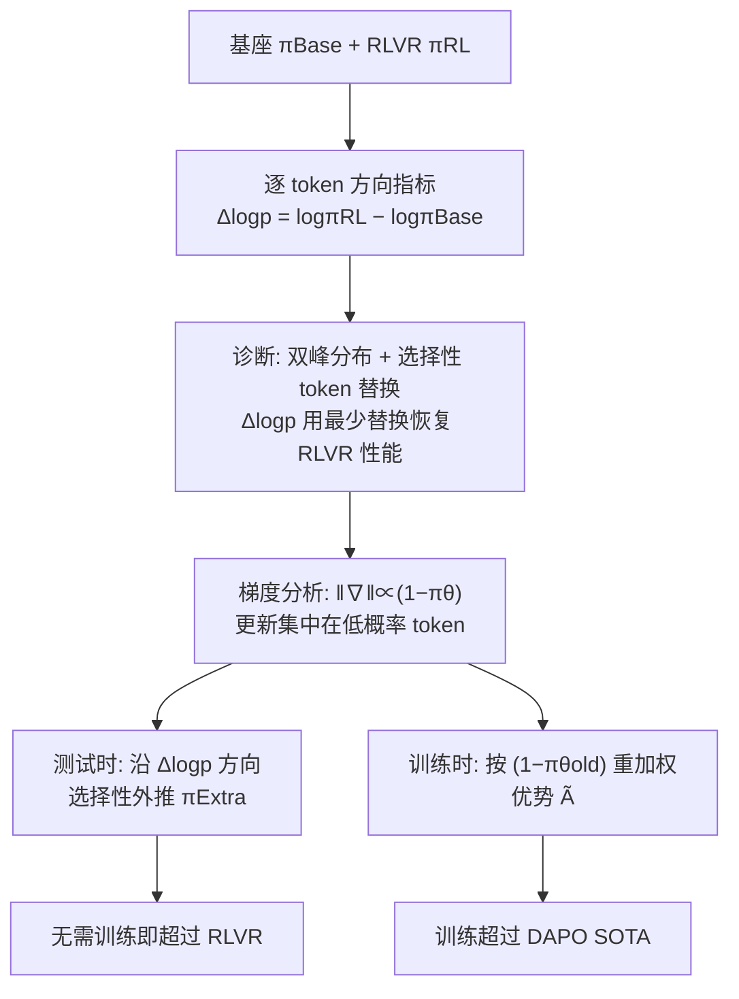

# Beyond Magnitude: Leveraging Direction of RLVR Updates for LLM Reasoning

**会议**: ICLR 2026  
**OpenReview**: [https://openreview.net/forum?id=r6Pw3RiMYL](https://openreview.net/forum?id=r6Pw3RiMYL)  
**代码**: [https://github.com/Hesse73/RLVR-Directions](https://github.com/Hesse73/RLVR-Directions)  
**领域**: LLM 推理 / 强化学习 (RLVR)  
**关键词**: RLVR, GRPO/DAPO, 更新方向, log-prob 差, 低概率 token, 测试时外推, 优势重加权  

## 一句话总结
本文指出过去分析 RLVR 只看更新「幅度」(熵、KL)，而真正的关键是更新「方向」——用带符号的逐 token 对数概率差 $\Delta\log p$ 就能精准定位稀疏但决定推理的 token，并据此提出测试时外推与训练时低概率 token 重加权两种即插即用的增强方法。

## 研究背景与动机
- **领域现状**: RLVR (Reinforcement Learning with Verifiable Rewards) 已成为 o1、DeepSeek-R1、Qwen3 等推理模型的核心算法。为理解 RLVR 到底改变了什么，主流做法是对比基座模型 $\pi_{\text{Base}}$ 与 RL 后模型 $\pi_{\text{RL}}$ 的 token 级差异。已有共识是：RLVR 的改动是**稀疏**的，只动了序列中一小撮 token。
- **现有痛点**: 既有工作衡量稀疏性时几乎只关注改动的**幅度**——用高熵 token (Wang et al.)、KL 散度 (Huan et al.)、或梯度范数 (Yang et al.) 来刻画。但这些幅度指标在基座与 RL 模型输出上的直方图几乎完全重合 (Fig. 1b)，说明仅凭幅度根本区分不出「从 Base 到 RLVR 的转变」。
- **核心矛盾**: 幅度指标只回答了「这个 token 变了多少」，却丢掉了「往哪个方向变」——到底是 RLVR 更偏好它，还是基座更偏好它。缺了方向，就无法判断哪些改动是真正增益推理的。
- **本文目标**: 用一个带符号、含方向信息的指标精确锁定「稀疏却关键」的推理 token，并把这个诊断结论转化为可直接提升推理准确率的实用方法。
- **核心 idea**: **【方向 > 幅度】** 提出带符号的逐 token 对数概率差 $\Delta\log p = \log\pi_{\text{RL}} - \log\pi_{\text{Base}}$ 作为方向诊断指标，它在直方图上呈现清晰的**双峰**(正尾=RLVR 偏好、负尾=基座偏好)，而熵/KL 不具备这种方向特征；并进一步揭示**高 $\Delta\log p$ token 恰是低概率 token**，由此衍生两种增强策略。

## 方法详解

### 整体框架
论文分两段：先做**诊断**(Sec. 3)——证明 $\Delta\log p$ 比幅度指标更能识别推理关键 token，并用梯度分析解释稀疏性来源；再做**利用**(Sec. 4)——把诊断结论落成两个方法：测试时沿 $\Delta\log p$ 方向外推、训练时给低概率 token 加权。

### 关键设计

**1. 方向诊断指标 $\Delta\log p$：用符号区分「谁偏好这个 token」。** 给定 token $y_t$，定义 $\Delta\log p(y_t|x,y_{<t}) = \log\pi_{\text{RL}}(y_t|x,y_{<t}) - \log\pi_{\text{Base}}(y_t|x,y_{<t})$，正值表示 RLVR 提升了该 token 的概率、负值表示压低。与熵 $H_\pi = \mathbb{E}[-\log\pi]$、KL 散度 $D_{\text{KL}}$ 这类只衡量「变化大小」的对称量不同，$\Delta\log p$ 自带方向。统计分析显示：在 AIME-24 上，熵和 KL 在 Base/RLVR 输出上的直方图几乎重叠，唯独 $\Delta\log p$ 出现两条分得很开的尾巴，这是幅度指标根本看不到的方向信号，且该现象在 ORZ、DAPO、UniReason 多对模型上都成立。

**2. 选择性 token 替换：用「恢复 RLVR 性能所需替换数」验证指标精度。** 沿用 Meng et al. 的干预实验：解码时每步先从 $\pi_{\text{Base}}$ 采样，再用各指标的判据 $f^\tau$ 决定是否换成 $\pi_{\text{RL}}$ 的选择(对 $\Delta\log p$ 用 $f^\tau_{\text{logp}}=\mathbb{I}(\Delta\log p < \tau)$，专门替换被 RLVR 压低的 token)。通过调阈值 $\tau$ 控制替换率做公平比较。结论是替换 5–30% 的 token 即可让基座追平 RLVR，而随机替换则慢得多——证明这些 token 稀疏但极重要；更关键的是排序 **$\Delta\log p$ > KL 散度 > 熵**：$\Delta\log p$ 只需约 10% 替换就达到 RLVR 准确率，幅度指标要明显更多，说明方向信息确实定位得更准。

**3. 梯度解释稀疏性：更新天然集中在低概率 token。** 论文给出 Lemma 3.1：对 softmax 策略，DAPO 目标对 logits 的梯度 $\ell_1$ 范数为 $\|\nabla_z J_{\text{DAPO}}\|_1 = 2|w_{i,t}|\cdot(1-\pi_\theta(y_{i,t}|x,y_{i,<t}))$，其中 $w_{i,t}=r_{i,t}\hat A_{i,t}$。由于含 $(1-\pi_\theta)$ 因子，概率越低的 token 梯度越大——尽管低概率 token 采样很少，却贡献了大部分梯度质量 (Fig. 3a)。再结合 Fig. 3b 显示高 $\Delta\log p$ 的 token 在两个模型里概率都偏低，于是「稀疏更新 = 梯度集中于低概率 token」与「高 $\Delta\log p$ token」被打通；top-p 过滤掉低概率 token 会使训练性能急剧下降 (Fig. 3c)，因果验证了这些 token 不可或缺。

**4. 测试时选择性外推：把 $\Delta\log p$ 当方向继续往前走。** 既然 $\Delta\log p$ 是从 Base 指向 RLVR 的「推理方向」，那就沿这个方向再外推一步以超过 RLVR。外推策略定义为 $\log\pi^\gamma_{\text{Extra}} = (1+\gamma)\log\pi_{\text{RL}} - \gamma\log\pi_{\text{Base}} + z(\cdot)$，等价于在概率空间对 RLVR 分布按 $\exp(\gamma\,\Delta\log p)$ 重加权，即把 $\Delta\log p$ 当作 token 级奖励做奖励引导解码。由于多数 token 的 $\Delta\log p$ 可忽略，全局外推会破坏已校准 token，故只在 $f^\tau_{\text{logp}}$ 选中的大负 $\Delta\log p$ 位置上采样外推分布。理论上 Theorem 4.1 在 NPG tabular softmax 简化设定下证明存在 $\gamma>0$ 使外推策略期望奖励不低于原策略，无需额外训练即可提升准确率。

**5. 训练时优势重加权：直接放大低概率 token 的学习信号。** 既然高 $\Delta\log p$ 对应低概率 token，那训练阶段就主动加强它们。在 DAPO 的优势上乘一个概率相关因子：$\tilde A_{i,t} = \big(1+\alpha\cdot(1-\pi_{\theta_{\text{old}}}(y_{i,t}|x,y_{i,<t}))\big)\cdot\hat A_{i,t}$，$\alpha$ 控制强度，概率越低的 token 优势被放得越大。该改动只动优势项、其余 DAPO 超参不变，把学习重心引向 $\Delta\log p$ 所指的推理关键位置，与「top-p 过滤会掉点」的发现一致。

## 实验关键数据

### 主实验表格（训练时重加权 vs DAPO，三个数学推理 benchmark）

| 模型 | 方法 | AIME24 Avg@32 | AIME25 Avg@32 | AMC Avg@32 | 平均 Avg@32 | 平均 Pass@16 |
|------|------|------|------|------|------|------|
| Qwen2.5-Math-7B | Base | 14.79 | 6.67 | 40.62 | 20.69 | 51.52 |
| Qwen2.5-Math-7B | DAPO | 35.73 | 17.60 | 73.04 | 42.12 | 57.86 |
| Qwen2.5-Math-7B | **Ours** | **39.06** | **18.54** | **73.64** | **43.75** | **62.33** |
| Qwen3-8B-Base | DAPO | 36.98 | 26.67 | 69.13 | 44.26 | 69.19 |
| Qwen3-8B-Base | **Ours** | **38.13** | **31.15** | **71.05** | **46.78** | **72.52** |

准确率(Avg@32)与探索能力(Pass@16)同时提升，说明增益不靠牺牲多样性。

### 消融实验表格（不同重加权策略对比，Qwen2.5-Math-7B）

| 指标 | PPL (Deng et al.) | Dominate (Yang et al.) | **Ours** |
|------|------|------|------|
| AIME24 Avg@32 | 35.63 | 36.35 | **39.06** |
| AIME25 Avg@32 | 16.46 | 13.02 | **18.54** |
| 平均 Avg@32 | 41.38 | 43.11 | **43.75** |
| 平均 Pass@16 | 61.08 | 53.63 | **62.33** |

直接放大低概率 token (Ours) 在 Avg@32 与 Pass@16 上整体最优；Dominate 因更激进的 clip-higher 导致训练熵更低、探索受限，Pass@k 反而下降。

### 关键发现
- **测试时外推**：在 ORZ-32B / DAPO-32B / UniReason-14B 上，Selective Extrapolate 的 AIME24 Avg@32 均超过原 RLVR 模型(如 DAPO-32B 52.50→55.42)，而 Selective Replace 只能追平不能超越。
- **在 $\pi_{\text{RL}}$ 上外推同样有效**：直接对 RLVR 模型按递增阈值外推，AIME24 性能先随干预比例上升后趋于平台(Table 1: 52.50→55.31)，再次印证「只放大少数关键 token 有效、激进干预收益递减」的稀疏性规律。
- **指标精度排序稳定**：$\Delta\log p$ > KL 散度 > 熵，在多种熵/KL 变体下均成立；KL 始终优于熵，说明 RLVR 的改动并不局限于高熵位置。
- **训练动态健康**：重加权方法的响应长度随训练稳步增长且准确率同步提升，这是有效推理 RLVR 训练的典型信号。
- **稀疏性根因**：RLVR 增益不来自全局分布偏移，而来自对少数低概率 token 的高强度梯度更新；外推过度则收益递减，与稀疏性一致。

## 亮点与洞察
- **「方向 vs 幅度」是一个干净且反直觉的切入点**：一句「大家都在看大小，却没人看符号」就把一堆幅度类分析统一批判了，$\Delta\log p$ 的双峰图极具说服力。
- **诊断到方法闭环漂亮**：同一个 $\Delta\log p$ 既当分析显微镜(token 替换)，又当测试时奖励(外推)，还间接导出训练时重加权，逻辑链条自洽。
- **打通三件事**：高 $\Delta\log p$ ⟺ 低概率 token ⟺ 大梯度，由 Lemma 3.1 的 $(1-\pi_\theta)$ 因子给出机理解释而非纯经验。
- **两种方法都极轻**：外推零训练成本、重加权只改一行优势公式，落地门槛低。
- **同时涨准确率与多样性**：训练时重加权在 Avg@32 与 Pass@16 上双双超过 DAPO，说明聚焦低概率 token 并不会牺牲探索能力，这点对 RLVR 常见的「准确率涨、Pass@k 掉」困境是正面反例。

## 局限与展望
- **外推需两个模型**：测试时要同时跑 Base 与 RLVR，显存/算力翻倍；作者建议结合参数高效微调缓解。
- **超参敏感**：外推引入选择阈值 $\tau$ 与强度 $\gamma$ 两个超参，目前需手调，未来可探索自适应组合。
- **评测范围有限**：主要在数学推理(AIME/AMC)、7B–32B 规模上验证，跨更大模型、跨非数学任务的泛化性待考。
- **理论与实践有缝**：Theorem 4.1 依赖理想化 NPG 的单调更新假设，与「真实 RLVR 只动少数 token」存在落差，故必须做选择性外推。

## 相关工作与启发
- **RLVR 算法谱系**：GRPO (group-relative 优势、去 critic) → DAPO (clip-higher、动态采样、token 级 loss、去 KL)，本文以 DAPO 为基线。
- **RLVR 效果理解**：高熵 token (Wang et al.)、KL 散度 (Huan et al.)、梯度范数 (Yang et al.)、token 替换 (Deng et al., Meng et al.) 都指向「稀疏更新」，本文补上被忽视的「方向」维度，并把方向从单步梯度扩展到 Base→RLVR 的整体分布偏移。
- **奖励引导解码**：外推方法与 reward-guided decoding (Khanov et al., Liu et al.) 同框架，$\Delta\log p$ 充当 token 级奖励，提示「用一对模型的对数概率差做引导」是通用可迁移的解码增强思路。
- **对调参的启发**：低概率 token 不可过滤(top-p 不能太小)、优势重加权比「压制低概率 token」(Dominate)或「偏好低 PPL 响应」(PPL)更稳，给 RLVR recipe 的设计提供了直接可操作的经验。

## 评分
- **新颖性**: ⭐⭐⭐⭐⭐ 「方向而非幅度」的视角清晰且反直觉，$\Delta\log p$ 双峰证据有力，把诊断指标直接转成两类方法，原创性高。
- **实验充分度**: ⭐⭐⭐⭐ 覆盖多对模型、多 benchmark、外推/重加权双线验证 + 梯度因果干预，较完整；但局限于数学推理与中小规模，跨域跨尺度验证不足。
- **写作质量**: ⭐⭐⭐⭐ 故事线(诊断→机理→利用)流畅，图 1 一图胜千言；公式与定理穿插，部分理论假设与实践的差距交代清楚。
- **价值**: ⭐⭐⭐⭐ 提供了理解 RLVR 的新原则，两个方法即插即用、低成本可复现(已开源)，对做 RLVR 分析与调优的研究者有直接借鉴价值。

<!-- RELATED:START -->

## 相关论文

- [\[ICLR 2026\] Quantile Advantage Estimation: Stabilizing RLVR for LLM Reasoning](quantile_advantage_estimation_stabilizing_rlvr_for_llm_reasoning.md)
- [\[ICLR 2026\] HiPO: Self-Hint Policy Optimization for RLVR](hipo_self-hint_policy_optimization_for_rlvr.md)
- [\[ICLR 2026\] Beyond Markovian: Reflective Exploration via Bayes-Adaptive RL for LLM Reasoning](beyond_markovian_reflective_exploration_via_bayes-adaptive_rl_for_llm_reasoning.md)
- [\[ICLR 2026\] ChainGPT: Dual-Reasoning Model with Recurrent Depth and Multi-Rank State Updates](chaingpt_dual-reasoning_model_with_recurrent_depth_and_multi-rank_state_updates.md)
- [\[ICLR 2026\] MAGO: Beyond Fixed Hyperparameters with Multi-Objective Pareto Optimization for Hybrid LLM Reasoning](mago_beyond_fixed_hyperparameters_with_multi-objective_pareto_optimization_for_h.md)

<!-- RELATED:END -->
