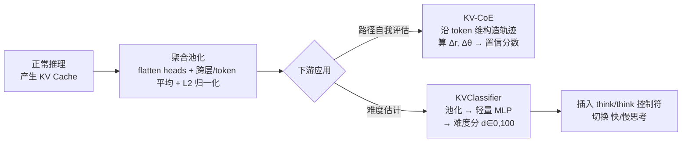

# Beyond Speedup - Utilizing KV Cache for Sampling and Reasoning

**会议**: ICLR 2026  
**OpenReview**: [https://openreview.net/forum?id=GUhmiJaAzv](https://openreview.net/forum?id=GUhmiJaAzv)  
**代码**: [https://github.com/cmd2001/ICLR2026_KV-Embedding](https://github.com/cmd2001/ICLR2026_KV-Embedding)  
**领域**: LLM 推理 / 高效推理 / 表示复用  
**关键词**: KV Cache, KV-Embedding, Chain-of-Embedding, 自适应推理, Fast/Slow Thinking, 自我评估  

## 一句话总结
把推理时本就存在、却只被用来加速解码的 KV cache 当作"免费的轻量表示"复用，无需额外存储隐藏状态，就能驱动推理路径的自我评估（KV-CoE）和难度自适应的快/慢思考切换（KVClassifier），在几乎零开销下把推理 token 量最多压到原来的 1/5.7。

## 研究背景与动机
- **领域现状**：KV cache 是现代 LLM 推理的核心抽象——vLLM 的 PagedAttention、Ollama 的会话级缓存都把它当作一等公民来管理，它把每步注意力复杂度从 $O(T^2)$ 降到 $O(T)$。但学界几乎只把它视作"加速器"，唯一例外是 cache steering 这类修改缓存初值来引导生成的工作。
- **现有痛点**：另一条火热的研究线——用模型内部状态做自我评估（Chain-of-Embedding、INSIDE/EigenScore、置信度探针）和自适应推理（ASRR、PATS、DOTS）——全都依赖**存储完整隐藏状态**。这在显存上代价高昂：论文 Figure 1 显示，Qwen3-32B 在长上下文下，额外存隐藏状态会让显存占用膨胀到 1.86×。
- **核心矛盾**：隐藏状态信息丰富但存储昂贵；KV cache 已经免费存在于推理流程中（$C_{\text{hidden}} \gg C_{\text{KV}} \approx 0$），却被当作只能加速的"废料"。能不能让这个免费副产物承担下游任务？
- **本文目标**：系统性地把 KV cache 当作可复用的任务表示，验证它在自我评估和自适应推理两个场景下"够用"，且几乎零额外开销、无需改模型架构、能直接对接现有推理栈。
- **核心 idea**：**【表示复用】** KV cache 虽然不是为通用 embedding 训练的（它只为 next-token prediction 服务），但经过简单的池化聚合后，仍编码了足以支撑"局部、任务条件化"判别的语义信号；**【够用论证】** 关键洞察是这两个应用只需要候选集内的**相对可分性**，而不是全局校准的语义，所以弱 embedding 反而够用。

## 方法详解

### 整体框架
论文提出 KV-Embedding 框架：把推理中本就缓存的键值张量 $\{K^{(l)}_{1:T}, V^{(l)}_{1:T}\}$ 通过沿层/头/token 维度的池化聚合成轻量 embedding，再分别喂给两个下游模块——KV-CoE（推理路径自我评估）和 KVClassifier（快/慢思考切换）。整条链路不存储隐藏状态、不做重前向、不加 hook，因此额外显存 $\Delta M \approx 0$。

### 关键设计

**1. KV 作为 embedding 源的"够用论证"：为什么弱表示反而能成事。** 作者先在 MTEB 分类基准上诚实地证明 KV-derived embedding 远逊于专用模型（gemini-embedding-001）：原因有三——它为因果语言建模而非对比学习优化导致各向异性差、它天生是 token/位置相关的需要启发式池化、它投影到低维 head 空间 $d_{\text{head}} \ll d_{\text{model}}$ 损失了判别力。但论文给出关键论证：两个目标应用都只需**局部、受限候选集内**的正确排序，而非全局可分。形式化地，对决策规则 $f$ 和打分间隔 $\gamma(x) = f_{y_i}(x) - f_{y_j}(x)$，只需在小候选集 $\mathcal{C}$ 上满足 $\min_{y \in \mathcal{C}} \gamma(y) > 0$，而不要求全局结构良好的 embedding 空间。再加上池化 embedding $e = g(x, \iota)$ 已被输入和指令条件化、天然偏向当前任务，于是"弱但免费"的 KV cache 在这两个受限场景里就足够好用。

**2. KV-CoE：把 Chain-of-Embedding 从层维搬到 token 维。** 原版 CoE 沿**层**维聚合隐藏状态，对每层得一个句级表示 $s_l = \frac{1}{T}\sum_t h_l^{(t)}$，再用相邻层的幅度变化 $\Delta r_l = \|s_{l+1}-s_l\|_2$ 和方向变化 $\Delta\theta_l = \arccos\frac{s_{l+1}\cdot s_l}{\|s_{l+1}\|\|s_l\|}$ 刻画推理轨迹的几何，聚合成置信分（实空间 CoE-R 与复空间 CoE-C）。KV-CoE 的巧思是**换轴**：因为 KV cache 是沿 token 存的，作者改为对每个 token $t$ 跨层聚合得 $e_t = \frac{1}{L}\sum_{l=1}^{L}\text{flatten}(K^{(l,t)}, V^{(l,t)})$，构成沿 token 维的轨迹 $\{e_1, \dots, e_T\}$，再把 CoE 的 $\Delta r$、$\Delta\theta$ 公式里的层索引直接换成 token 索引来算同样的几何分数。这样既完整保留了 CoE 的分析框架，又把它最贵的"存隐藏状态/重算"环节彻底省掉——所需的归约相比一次完整前向可忽略不计，可直接对接 Transformers 的 `past_key_values` 或 vLLM。

**3. KVClassifier：用池化 KV 预测连续难度分驱动快/慢切换。** 不直接做"快/慢"二分类，而是从池化后的 KV 表示估计一个连续难度分 $d = f_\theta(\text{Pool}(KV^{(1:L)}_{1:T})) \in [0,100]$，其中 Pool 跨层、跨头、跨 token 做均值池化，$f_\theta$ 是轻量两层 MLP（隐层 512、ReLU）。训练监督来自一个巧妙的标注方案：对每道训练题用基座模型各生成一份快思考（无 CoT）和慢思考（有 CoT）答案，按对错与长度赋离散难度标签——$d{=}0$（快答对且短 <128 token）、$d{=}25$（快答对但长）、$d{=}75$（快错慢对）、$d{=}100$（都错），构成平滑的难度梯度让 $f_\theta$ 学到既关联正确性又关联推理代价的分数。

**4. 控制符注入实现一步与两步切换。** 推理模式靠在解码流里注入特殊控制符 `<think>` / `</think>` 来切换。**一步切换（KV-Classification）**：生成开始前把 $d$ 与阈值 $\tau$ 比，$d > \tau$ 就 prepend `<think>` 触发慢思考、否则走快思考，全程不变，是分类式控制器。**两步切换（KV-Generative）**：在初始决策之外，解码途中按预设检查点用更新后的 KV cache 重算 $d$——慢思考时若 $d < \tau_{\text{fast}}$ 就 append `</think>` 提前终止推理，快思考时若 $d > \tau_{\text{slow}}$ 就注入 `<think>` 中途重新启用慢思考，是生成式控制器，能做细粒度、难度感知的推理深度调节。由于 KV cache 在 prefill 阶段就已就绪，初始与持续的难度评估都几乎零开销。

## 实验关键数据

### 主实验 1：KV-CoE 自我评估（MATH / TheoremQA）
评估指标 AUROC↑ 与 FPR95↓，对比 MaxProb / PPL / Entropy 及原版 CoE：

| 模型 | 方法 | MATH AUROC↑ | MATH FPR95↓ | TheoremQA AUROC↑ | TheoremQA FPR95↓ |
|------|------|-------------|-------------|------------------|------------------|
| Llama-3.1-8B | Entropy | 62.74 | 84.14 | 47.37 | 97.82 |
| Llama-3.1-8B | CoE-R†(隐藏状态) | 72.54 | 75.61 | 63.12 | 89.83 |
| Llama-3.1-8B | KV-CoE-R (ours) | 64.36 | **63.82** | **74.74** | **62.93** |
| Llama-3.1-8B | KV-CoE-C (ours) | 64.13 | 67.42 | 74.93 | 62.46 |
| Qwen2-7B | CoE-C(隐藏状态) | 76.68 | 64.48 | 62.70 | 87.42 |
| Qwen2-7B | KV-CoE-R (ours) | 76.92 | 49.83 | **88.87** | 54.30 |
| Qwen2-7B | KV-CoE-C (ours) | **84.12** | **44.82** | 83.27 | 58.35 |

KV-CoE 全面碾压 MaxProb/PPL/Entropy，且在 TheoremQA 上甚至明显超过用隐藏状态的原版 CoE，FPR95 大幅降低。

### 主实验 2：快/慢思考切换（GSM8K / MATH500，准确率 / 平均 token 数）

| 数据集 | 方法 | DeepSeek-R1-14B | Qwen3-8B |
|--------|------|------------------|----------|
| GSM8K | Fast Thinking | 0.845 / 218 | 0.904 / 211 |
| GSM8K | Reasoning(全慢) | 0.847 / 432 | 0.933 / 1632 |
| GSM8K | KV-Classification | 0.845 / 218 (-49.5%) | 0.914 / 554 (-66.1%) |
| GSM8K | KV-Generative | 0.835 / 242 (-44.0%) | 0.892 / 273 (-83.3%) |
| MATH500 | Reasoning(全慢) | 0.590 / 1839 | 0.610 / 4150 |
| MATH500 | KV-Classification | 0.578 / 1506 (-18.1%) | 0.604 / 3963 (-4.5%) |
| MATH500 | KV-Generative | 0.566 / 657 (-64.3%) | 0.578 / 727 (-82.5%) |

在 Qwen3-8B / MATH500 上，两步生成式切换把平均 token 从 4150 压到 727（**5.7× 缩减**），准确率仅掉 3.2%（0.610→0.578）；一步分类式更保守，token 多但准确率几乎不掉（0.604 vs 0.610）。

### 关键发现
- **KV embedding 是弱通用 embedding 但够用**：MTEB 上 KV-derived embedding（如 DBpedia 0.5937）远逊 Gemini（0.9476），但在受限候选集任务上仍捕捉到有意义语义。
- **换轴有效**：把 CoE 从层维换到 token 维后，KV cache 的 token 级演化对识别正确推理路径提供了丰富信号，尤其在多步问题上。
- **难度分跨模型/任务泛化**：同一套 KV 难度估计器在不同模型和数据集上都能有效平衡准确率与效率。
- **一步 vs 两步权衡**：一步分类保准确率、两步生成省 token，对应不同部署偏好。

## 亮点与洞察
- **"免费午餐"视角**：把已存在的推理副产物（KV cache）重新定义为可复用表示，是个少有人正面挖掘的角度——成本几乎为零却能撑起自我评估和自适应推理两类任务。
- **诚实的"够用论证"**：论文没有夸大 KV embedding 的能力，反而先证明它在 MTEB 上很弱，再用"局部受限候选集只需相对可分"的形式化论证解释为什么弱表示在目标场景里够用，逻辑严谨。
- **零侵入工程友好**：方法直接对接 `past_key_values`、vLLM，无需改架构、重前向或装 hook，落地门槛极低。
- **换轴的优雅**：KV-CoE 把"沿层聚合"换成"沿 token 聚合"，几乎不改 CoE 框架就消除了它最贵的隐藏状态存储。

## 局限与展望
- **作者自陈适用边界**：KV embedding 不适合需要"跨多样查询全局可比语义"的任务（如宽域检索/相似度），结论只限于受限候选集与 CoE 式局部轨迹几何。
- **基线对齐瑕疵**：CoE-R/C 基线数字取自原论文且跑在 Llama3-8B 上，而本文用的是 Llama3.1-8B，作者承认数字可能不完全对齐。
- **池化与超参的启发式**：embedding 构造（concat 哪些维度、是否归一化、选哪些层/token）和切换阈值 $\tau, \tau_{\text{fast}}, \tau_{\text{slow}}$ 都需调，论文报告的是 Appendix 最优配置，鲁棒性与自动选参待探讨。
- **可延伸方向**：把 KV 复用拓展到更多下游（如检索增强、安全检测）、与 cache steering 等"写"操作结合形成读写闭环、研究更系统的 KV 池化表示学习。

## 相关工作与启发
- **隐藏状态自我评估**：CoE（轨迹几何打分）、INSIDE/EigenScore（协方差特征谱测一致性）、InternalInspector（对比探针估置信度）——本文与它们的区别是"只用已存在的 KV cache"而非完整隐藏状态。
- **自适应快/慢推理**：ASRR（长度奖励 + 隐式恢复）、PATS（过程奖励模型 + beam search 做步级切换）、DOTS（把推理看作原子动作搜索）——这些通常需显式 CoT、外部奖励模型或重解码，本文是正交的：池化 KV 特征即可驱动一步与生成式切换。
- **KV cache 干预**：KV Cache Steering（prefill 后加层级 steering 向量诱导推理）是"写"缓存，本文是"读"缓存做难度感知门控，两者互补，启发未来读写结合。

## 评分
- **新颖性**: ⭐⭐⭐⭐ 把"只用来加速"的 KV cache 重新定位为免费可复用表示，并配上严谨的"弱但够用"论证，角度新颖且少有人系统挖掘。
- **实验充分度**: ⭐⭐⭐⭐ 覆盖两个应用、4 个模型、4 个基准，主实验 + MTEB 诚实对照 + Appendix 消融，结论扎实；扣分在基线版本对齐瑕疵与超参依赖。
- **写作质量**: ⭐⭐⭐⭐ 动机清晰、图（VRAM 对比、换轴示意）直观、"够用论证"形式化到位，逻辑连贯。
- **价值**: ⭐⭐⭐⭐ 零侵入、可直接对接 vLLM/Transformers，5.7× token 缩减对推理服务降本有现实意义，且开辟"复用推理时副产物"的新方向。

<!-- RELATED:START -->

## 相关论文

- [\[ICLR 2026\] KaVa: Latent Reasoning via Compressed KV-Cache Distillation](kava_latent_reasoning_via_compressed_kv-cache_distillation.md)
- [\[ICLR 2026\] Bottlenecked Transformers: Periodic KV Cache Consolidation for Generalised Reasoning](bottlenecked_transformers_periodic_kv_cache_consolidation_for_generalised_reason.md)
- [\[ICML 2026\] ForesightKV: Optimizing KV Cache Eviction for Reasoning Models by Learning Long-Term Contribution](../../ICML2026/llm_reasoning/foresightkv_optimizing_kv_cache_eviction_for_reasoning_models_by_learning_long-t.md)
- [\[ICLR 2026\] Taming Imperfect Process Verifiers: A Sampling Perspective on Backtracking](taming_imperfect_process_verifiers_a_sampling_perspective_on_backtracking.md)
- [\[ICLR 2026\] Reasoning with Sampling: Your Base Model is Smarter Than You Think](reasoning_with_sampling_your_base_model_is_smarter_than_you_think.md)

<!-- RELATED:END -->
