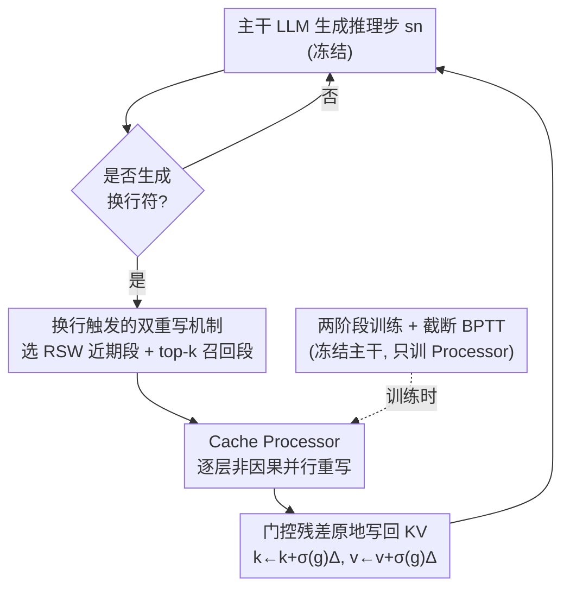

# Bottlenecked Transformers: Periodic KV Cache Consolidation for Generalised Reasoning

**会议**: ICLR2026  
**OpenReview**: [https://openreview.net/forum?id=fWgKnl4itC](https://openreview.net/forum?id=fWgKnl4itC)  
**代码**: 待确认  
**领域**: LLM推理  
**关键词**: KV 缓存重写, 信息瓶颈, 记忆巩固, 隐空间计算, 数学推理

## 一句话总结
给冻结的主干 LLM 外挂一个小型 Cache Processor，在每个推理步结束（换行符）时**原地重写** KV 缓存——既"巩固"刚写入的近期条目，又"再巩固"按注意力召回的少量历史条目——用信息瓶颈理论解释为什么这样能提升泛化，在七个数学推理基准上最高 +6.6pp。

## 研究背景与动机

**领域现状**：让 LLM 在推理时花更多算力以提升表现，最主流的做法是在 **token 空间**生成显式思维链（chain-of-thought）。另一条新兴路线是把额外计算压进模型的**隐空间**，作者统称为 Auxiliary Latent-Space Computation（ALSC，辅助隐空间计算）：在解码步之间，对模型的 KV 缓存或最终隐状态做变换，而不真的吐出中间自然语言 token。

**现有痛点**：作者把已有的序列级 ALSC 归成三类，并指出它们的共同缺口：(i) **token 中介**——注入 pause/filler token 或把隐状态回喂（如 Coconut），本质是把缓存撑长；(ii) **残差算子**——只改当前隐状态 $o_t$ 做风格/安全控制，不动缓存；(iii) **缓存算子**——几乎都是为了**压缩内存占用**（驱逐、合并、摘要）而非提升推理。三类里，专门为"重写工作记忆以改善推理泛化"而设计的机制几乎是空白。

**核心矛盾**：作者用信息瓶颈（Information Bottleneck, IB）视角点出一个反直觉的结论——**自回归训练会把 KV 缓存逼向"过度保留输入信息"**。IB 认为泛化来自在"压缩输入信息 $I(X;Z)$"与"保留预测信息 $I(Z;Y)$"之间取得最优平衡；而自回归的下一 token 目标同时鼓励 $I(S_{0:n};\hat{Z})$ 与 $I(\hat{Z};S_{n+1})$ 都尽量大，导致缓存里塞满了对未来"序列级预测"并无用处的历史细节，反而拖累泛化。已有压缩类缓存方法虽然降了 $I(X;Z)$，却**不加区分地连 $I(Z;Y)$ 也一起砍**，所以掉到更差的泛化区。

**本文目标**：找一种推理时机制，能**选择性地压低 $I(X;Z)$ 的同时保住甚至增强 $I(Z;Y)$**，从而提高"预测效率" $I(Z;Y)/I(X;Z)$。

**切入角度**：作者借用神经科学里的**记忆巩固（consolidation）与再巩固（reconsolidation）**——新记忆形成后被稳定下来（巩固），旧记忆被唤起时短暂进入可塑状态、整合新信息后再稳定（再巩固）。在 Transformer 里，这恰好对应"对新写入的 KV 段做原地重写"和"对被召回的历史 KV 段做原地重写"。

**核心 idea**：用一个外挂的 Cache Processor，在推理步边界周期性地**原地重写 KV 缓存**（不做任何降维压缩），把缓存训练成一个新的、预测效率更高的瓶颈，从而提升推理泛化。

## 方法详解

### 整体框架

Bottlenecked Transformer 在一个**预训练好的解码器主干** $M^{\text{LLM}}_\theta$ 之外，挂一个比主干更小的 **Cache Processor** $T^{\text{proc}}_\omega$。主干照常自回归生成 token；每当一个推理步 $s_n$ 结束（以生成换行符为信号），Processor 被触发一次，对缓存里的两类条目做原地重写——(i) 刚写入的近期段（巩固），(ii) 与近期段注意力最相关的 top-$k$ 历史条目（再巩固）——其余条目原样不动；重写完成后，解码以新缓存为条件继续。整个机制无需重新训练主干，是一个推理时的"工作记忆整理"插件。

### 关键设计

**1. 信息瓶颈动机：用 IB 理论论证"为什么要重写 KV"**

这是全文的理论地基，回答"凭什么原地重写缓存能帮推理"。作者先形式化地证明（定理 4.1）：在解码器 Transformer 里，由输入序列 $S_{0:n}$ 算出的 **KV 缓存加最终隐状态** $C_{0:n}=(K_{0:n},V_{0:n},O_n)$ 恰好是连接输入与输出的**终端瓶颈** $\hat{Z}$。再证明（定理 4.2）自回归训练给出对数似然的两个上界：

$$L(\theta) \le \sum_n I(S_{0:n};C_{0:n}) - \sum_n H(S_{n+1}\mid S_{0:n}), \quad L(\theta) \le \sum_n I(C_{0:n};S_{n+1}) - H(S_{n+1})$$

最大化 $L(\theta)$ 会**同时抬高** $I(S_{0:n};C_{0:n})$ 和 $I(C_{0:n};S_{n+1})$。换句话说，缓存被逼成一份"逐步、高保真"的右移 token 预测轨迹，而不是被压缩过的历史摘要——它保留了大量对序列级泛化无用的输入细节。由于数据处理不等式，任何对 $\hat{Z}$ 的变换 $\hat{Z}'=T(\hat{Z})$ 都满足 $I(X;\hat{Z})\ge I(X;\hat{Z}')$；只要把 $T$ 训成"尽量保住未来预测"，就能压低 $I(X;Z)$ 而不伤 $I(Z;Y)$，恰好把缓存推向高泛化区。这一论证直接区分了本文与压缩类方法：后者不分青红皂白地砍 $I(Z;Y)$，本文则有针对性地只削冗余。

**2. 换行触发的双重写机制：consolidation 巩固 + reconsolidation 再巩固**

这一设计回答"重写谁、什么时候重写"。Processor 不是随时随地动整个缓存，而是在每个推理步结束（换行符）被触发，且只动两类条目：(i) **近期步窗口（Recent Step Window, RSW）**，即刚生成的步 $s_n$ 对应的、长度为 $R$ 的近期 KV 段——对应"巩固"，把新记忆稳定下来；(ii) **top-$k$ 召回段**，即在 $s_{0:n-1}$ 的历史里，按与近期段 $s_n$ 的**注意力质量**选出的前 $k$ 个条目——对应"再巩固"，让被唤起的旧记忆在新上下文下被改写。被选中的集合记为 $(k_{(s)},v_{(s)})$，其余条目保持不变。把"换行=推理步边界"当触发点，是因为数学推理的解题轨迹天然按行分步，步边界正是工作记忆该被整理的时刻；注意力 top-$k$ 召回则保证再巩固只花在真正相关的历史上，而非全量重算。

**3. Cache Processor：逐层非因果并行 + 门控残差原地重写**

这一设计回答"具体怎么重写"。对 $L$ 层、$H$ 头的主干，Processor 由 $L$ 个小 Transformer 块组成，每块对齐一层。第 $\ell$ 层先把选中的 KV 拼成"KV-token"（跨头拼接）并投影进 Processor 的隐空间：$u^{(\ell)}=[k^{(\ell)}_{(s)},v^{(\ell)}_{(s)}]W^{(\ell)}_{\text{in}}$。关键在于这个小块**不加因果掩码**地并行处理整段 $u^{(\ell)}$——召回段与近期段彼此可见，让每个被选条目都能用上"全局可得"的信息来更新自己；这正是普通自回归缓存做不到的"回头看"。块的输出投回 KV 维度得到增量 $(\Delta_k,\Delta_v)$，再以**门控残差**原地写回：

$$k^{(\ell)}_{(s)} \leftarrow k^{(\ell)}_{(s)} + \sigma(g^{(\ell)})\,\Delta^{(\ell)}_k, \qquad v^{(\ell)}_{(s)} \leftarrow v^{(\ell)}_{(s)} + \sigma(g^{(\ell)})\,\Delta^{(\ell)}_v$$

其中 $g^{(\ell)}$ 是逐层可学习标量门、初始化得很小，$\sigma$ 是 logistic 函数。门控初值小的作用是**抑制早期漂移**：在 Processor 还没学会有用更新之前，避免它对缓存做大幅、破坏性的改动而毁掉主干能力。全程**不做降维压缩**，正是为了规避压缩方法那种"连预测信息一起砍"的毛病。

**4. 两阶段训练与截断 BPTT：只把 Processor 训成"利于下一步预测"**

训练分两阶段。第一阶段主干照常做 SFT（标准下一 token 交叉熵）。第二阶段**冻结主干，只更新 Processor 参数 $\omega$**：把训练序列按推理步切开，对每个步 $s_n$，主干先把该步 token 写进缓存，Processor 随即选条目并原地重写，然后以重写后的缓存为条件算下一步 $s_{n+1}$ 的交叉熵损失、反传进 Processor。作者在**步边界处截断 BPTT**，让 Processor 只为"改善下一推理步预测"而重写缓存。值得注意的是，作者**故意不加显式的 IB/压缩损失**：只用下一步预测损失等价于最大化 $I(S_{n+1};\tilde{Z})$；而一旦撤掉了"最大化 $I(S_{0:n};\tilde{Z})$"的压力（这正是普通 Transformer 被逼着做的），就给 SGD 噪声留出了**隐式压缩** $I(X;Z)$ 的通道——压缩交给训练动力学自己发生，而非硬塞一个项。

### 损失函数 / 训练策略
- 第一阶段：主干 SFT，标准下一 token 交叉熵。
- 第二阶段：冻结主干，仅训 Processor；目标是重写缓存后下一推理步的交叉熵，步边界截断 BPTT。
- Processor 配置：隐维 $d_p=512$、中间维 2240、每块 16 头、再巩固预算 $k=32$；数据为 OpenMathInstruct-2 的 128k 样本。

## 实验关键数据

### 主实验
在七个推理基准（GSM8K、MATH、SVAMP、TheoremQA、LogiQA、Gaokao-Math、GSM-Hard，其中 LogiQA 为逻辑推理用来测迁移）、四个主干上，对比 SFT、SFT+pause（16 个 pause token）、SFT+latent rollout（仿 Coconut）与本文。所有分数为贪心解码下 pass@1。

| 主干 | 任务 | 本文 | SFT | 提升 |
|------|------|------|------|------|
| Llama-3.2 1B | SVAMP | 44.6 | 38.0 | **+6.6** |
| Llama-3.2 3B | GSM8K | 51.33 | 46.78 | +4.6 |
| Qwen-3 0.6B | MATH | 29.08 | 26.68 | +2.4 |
| Llama-3.1 8B | LogiQA | 23.81 | 20.74 | +3.1 |

本文在几乎所有"主干×任务"组合上都优于两个 ALSC 基线，且在分布内数学基准（GSM8K/MATH/SVAMP/GSM-Hard）增益最强。主要失利点是 Gaokao-MathQA（中文，存在分布/语言迁移，超出 Processor 训练暴露范围）。pause-token 基线只在"先继续预训练再 SFT"时才稳定有效，仅做微调时常低于普通 SFT；latent rollout 通常更差，8B 上甚至因持续隐空间 rollout 严重失稳而崩溃。

### 消融实验

| 配置 | 关键观察 | 说明 |
|------|---------|------|
| top-$k$（Table 2，Llama-3.2 1B） | $k\approx32$–$64$ 多数任务最优；MATH 偏好 $k\approx128$–$256$ | MATH 题更难、解更长、长程依赖更强，需更大再巩固预算 |
| 近期窗 $R$（Table 3） | 在 $R\approx16$–$96$ 大范围内稳定，$R\approx64$–$96$ 略好 | Processor 需要一段中等局部上下文，但不需逐 token 细更新 |
| 等 epoch 预算（Fig. 3） | Bottleneck@N 在 GSM8K/GSM-Hard/SVAMP/LogiQA 多数 N 上胜 SFT@N | 同等训练预算下，加 Processor 比多训 SFT 更划算 |
| 重写幅度分析（Fig. 4） | value 向量显著变、key 向量几乎不变；改动集中在最浅层 | Processor 改"记忆内容"而非"寻址"，且重塑底层表征再前向传播 |

### 关键发现
- **改内容不改寻址**：重写主要作用在 value 向量、key 向量几乎不动，说明 Processor 在改"记忆里存了什么"而非"怎么检索"；改动集中在最早几层，意味着它重塑底层表征、让其前向传播去影响后续层。
- **非退化也非崩坏**：重写幅度在前约十次调用最大、随后进入稳定平台，既没塌成恒等映射，也没失控漂移——门控小初值起了作用。
- **MATH 的弱项有解释**：等预算实验里 MATH 偏弱，正因为再巩固窗固定在 $k=32$；top-$k$ 消融显示 MATH 在更大 $k$ 下更好，二者互相印证。
- 由于高维变长缓存的 $I(X;Z)$ 不可直接估计，作者把重写幅度当作"工作记忆被重塑程度"的**定性代理**，而非直接的信息论度量。

## 亮点与洞察
- **把"自回归缓存其实在过拟合历史"讲成了定理**：定理 4.1/4.2 把 KV 缓存认定为终端瓶颈、并证明自回归训练会同时抬高 $I(X;Z)$ 与 $I(Z;Y)$，给"为什么该重写缓存"提供了少见的形式化依据，而不是拍脑袋。
- **不压缩反而是卖点**：明确不做降维，避开压缩类方法"连预测信息一起砍"的坑——这把一个看似反直觉的设计（缓存不缩反改）讲得很有说服力。
- **非因果并行 + 门控残差**这套小手术可复用：在任何"想原地修改一段隐状态又怕毁掉主干"的场景里，"小初值门控残差 + 无掩码并行块"都是一个稳妥的注入范式。
- **神经科学类比落到了可实现的机制上**：巩固=重写近期段、再巩固=重写 top-$k$ 召回段，类比不止停在叙事，而是直接定义了"动谁"。

## 局限与展望
- **信用分配噪声大**：仅靠下一步交叉熵训练 Processor，监督弱、方差高、难逃主干的强局部最优；作者建议从头训练或换更稳的目标。
- **缺显式压缩项**：没有显式最小化 $I(X;Z)$ 的项，压缩只能靠数据处理不等式或 SGD 噪声被动发生；一个有前景的方向是对选中 KV 注入受控噪声再迭代去噪，相当于在记忆空间做迭代隐式推理。
- **把两个生物过程压成了一个**：巩固（数小时到数天、系统级重组、睡眠回放）与再巩固（短暂、检索触发、依赖预测误差）在生物上时间尺度与触发条件都不同，本文用单一在线 Processor 合并了两者；更贴切的做法是配一个离线回放式巩固器 + 一个在线、按"惊讶/预测误差"门控触发的再巩固器，而非固定的换行触发。
- **跨分布迁移弱**：中文 Gaokao-MathQA 等超出训练暴露的分布上常失利，泛化范围受 Processor 训练数据限制。

## 相关工作与启发
- **vs token 中介 ALSC（pause token / Coconut latent rollout）**：它们靠注入额外 token 或回喂隐状态把缓存撑长，本文不加 token、而是**原地重写**既有缓存；实验中本文稳定优于二者，且 latent rollout 在大模型上会失稳崩溃。
- **vs 压缩类缓存算子（驱逐/合并/摘要，如 H2O、StreamingLLM、Transformer-XL/Compressive Transformer/RMT）**：它们以**降内存占用**为目标、不加区分地砍信息；本文属同一"缓存算子"家族但**不压缩、不降维**，目标是提升预测效率 $I(Z;Y)/I(X;Z)$ 而非省内存。
- **vs 残差算子（activation steering / SAE 引导）**：它们只改当前隐状态 $o_t$ 做风格/安全控制、不动缓存；本文专门改缓存 $h_t$，因为缓存才是承载冗余历史信息的主要部件。

## 评分
- 新颖性: ⭐⭐⭐⭐⭐ 把神经科学的（再）巩固落成可训练的 KV 原地重写，并用 IB 理论给出形式化动机，角度新。
- 实验充分度: ⭐⭐⭐⭐ 四主干七基准 + top-$k$/$R$/等预算/重写幅度多组消融，但规模偏小（≤8B）、且 MATH/中文任务有明显短板。
- 写作质量: ⭐⭐⭐⭐ 理论—机制—实验链条清晰，定理与图示配合好；公式较密集，需要一定背景。
- 价值: ⭐⭐⭐⭐ "不压缩反而重写缓存"的视角与门控注入范式具启发性，但增益幅度与适用范围仍有限。

<!-- RELATED:START -->

## 相关论文

- [\[ICLR 2026\] KaVa: Latent Reasoning via Compressed KV-Cache Distillation](kava_latent_reasoning_via_compressed_kv-cache_distillation.md)
- [\[ICLR 2026\] Beyond Speedup - Utilizing KV Cache for Sampling and Reasoning](beyond_speedup_-_utilizing_kv_cache_for_sampling_and_reasoning.md)
- [\[ICML 2026\] ForesightKV: Optimizing KV Cache Eviction for Reasoning Models by Learning Long-Term Contribution](../../ICML2026/llm_reasoning/foresightkv_optimizing_kv_cache_eviction_for_reasoning_models_by_learning_long-t.md)
- [\[ICLR 2026\] MoDr: Mixture-of-Depth-Recurrent Transformers for Test-Time Reasoning](modr_mixture-of-depth-recurrent_transformers_for_test-time_reasoning.md)
- [\[ICLR 2026\] Attention as a Compass: Efficient Exploration for Process-Supervised RL in Reasoning Models](attention_as_a_compass_efficient_exploration_for_process-supervised_rl_in_reason.md)

<!-- RELATED:END -->
