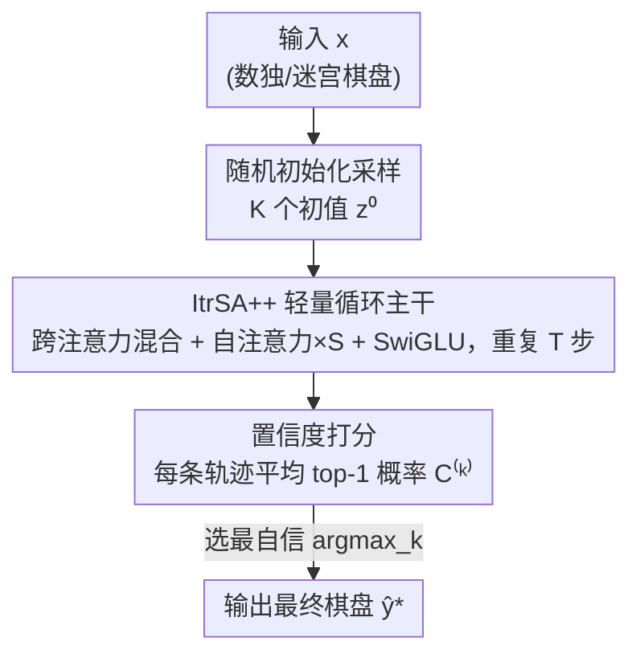

# C-Voting: Confidence-Based Test-Time Voting without Explicit Energy Functions

**会议**: ICLR2026  
**OpenReview**: [https://openreview.net/forum?id=kYQFfEKtx5](https://openreview.net/forum?id=kYQFfEKtx5)  
**代码**: 待确认  
**领域**: LLM推理 / 测试时扩展  
**关键词**: 测试时扩展, 循环模型, 投票策略, 置信度校准, 数独求解  

## 一句话总结
针对"反复套用同一层"的循环推理模型，本文提出一种不需要显式能量函数的测试时投票策略 C-voting——从多个随机初始隐状态出发跑出多条轨迹，挑出"平均 top-1 概率最高（即模型最自信）"的那条作为答案；它在 AKOrN 上比能量投票 E-voting 在 Sudoku-hard 高 4.9%，配合一个仅 300 万参数的轻量模型 ItrSA++ 还能在 Sudoku-extreme 上把 HRM 从 55.0% 抬到 95.2%。

## 研究背景与动机

**领域现状**：近年来一类"循环模型"（recurrent model）被视为通往推理能力的有希望路径——它把同一个网络层 $f$ 反复作用在隐状态上 $z_{t+1}=f(z_t, x;\theta)$，等价于一个时不变的非线性动力系统。这类模型（如 HRM、AKOrN）能在数独、迷宫这类需要在复杂约束下做一致逻辑推理的任务上做得很好，而这些任务连主流 LLM 都很吃力。它们最大的卖点是**测试时扩展（test-time scaling）**：不再训练，只在推理阶段就能涨点。

**现有痛点**：测试时扩展有两条路。第一条是"加深递归步数"——多迭代几步，但它有两个硬伤：性能会**饱和**（步数加到一定程度就不再涨），而且迭代是串行的、**无法并行**，推理越久越慢。第二条是"采样多条轨迹再挑一条"，也就是投票。AKOrN 给出的投票方案叫 **E-voting（能量投票）**：从不同随机初值跑出多条轨迹，选最终能量最低的那条，靠 4096 个候选能让数独棋盘准确率涨约 40%。

**核心矛盾**：E-voting 效果很好，但它有个致命的适用性限制——**必须有显式定义的能量函数** $E$，使得动力学能写成 $z_{t+1}=z_t-\alpha\nabla_z E(z_t;\theta)$ 的梯度下降形式。可现实中最有希望的推理模型（HRM、递归 Transformer 等）压根没有显式能量函数；尤其带残差连接的 $z_{t+1}=z_t+g(z_t;\theta)$，一般情况下 $g$ 根本写不成某个标量函数的梯度。于是 E-voting 在这些模型上**用不了**。

**本文目标**：拆成两个研究问题——(RQ1) 能否设计一个**模型无关、不需要能量函数**的测试时投票策略？(RQ2) 是否存在一个**简单轻量**的循环架构，配上这个投票就能追平甚至超过 SOTA？

**切入角度**：作者注意到，能量低之所以能当"好答案"的代理，本质是想找"模型最有把握"的那条轨迹。那为什么不直接量化模型的"把握"呢？分类任务里 readout 出来的 softmax 概率天然就是置信度信号——**只要模型校准得还行，预测概率越高就越可能对**。这个信号任何分类型循环模型都有，不依赖能量函数。

**核心 idea**：用"置信度"代替"能量"做投票判据——把每条候选轨迹终态的"平均 top-1 概率"当作置信度，选最自信的那条。一句话就是：**sample & choose，take the most confident one**。

## 方法详解

### 整体框架
C-voting 是一个**纯推理阶段、即插即用**的投票策略：拿一个已经训练好的循环模型，从一个概率分布（如标准高斯）里采 $K$ 个不同的初始隐状态 $\{z^{(k)}_{i,0}\}_{k\in[1,K]}$，每个初值独立地跑完 $T$ 步递归得到终态 $z^{(k)}_{i,T}$；对每条轨迹的终态做 readout + softmax 算出每个位置的预测概率，再算出整条轨迹的"置信度"分数；最后选置信度最高的那条轨迹作为最终预测。整个过程不改动模型权重、不需要能量函数、$K$ 条轨迹彼此独立可**完全并行**。

为了验证"为 C-voting 量身定制的简化模型能否更强"，作者还顺手搭了一个极简循环模型 **ItrSA++**（约 300 万参数），把它和 C-voting 配在一起当作端到端的演示。所以整篇方法其实是两块：投票判据（C-voting 本身）+ 配套的轻量主干（ItrSA++）。

### 关键设计

**1. 置信度投票判据：用平均 top-1 概率代替能量**

这是全文的核心。痛点很直接——E-voting 要能量函数，绝大多数循环模型没有。C-voting 改用一个任何分类型模型都现成的信号：模型自己的预测把握。对第 $k$ 条候选轨迹，先从终态 readout 出 logits 并在类别维做 softmax，得到位置 $l$ 上类别 $j$ 的概率 $P_{j,l}(z^{(k)}_{i,T})=\mathrm{Softmax}(\mathrm{Readout}(z^{(k)}_{i,T}))_{j,l}$；取每个位置的 top-1 概率 $\hat{P}_l(z^{(k)}_{i,T})=\max_j P_{j,l}(z^{(k)}_{i,T})$；再对所有待预测位置（如数独里所有空格）求平均，定义这条轨迹的置信度

$$C^{(k)}_i=\frac{1}{|L|}\sum_{l\in L}\hat{P}_l(z^{(k)}_{i,T}).$$

最后选 $k^*_i=\arg\max_k C^{(k)}_i$ 这条最自信的轨迹，它在各位置的 argmax 类别就是最终答案。

为什么这样有效？作者给了一个校准视角的论证：如果模型校准良好，那么 $\Pr[y_{i,l}=\hat{y}^{(k)}_{i,l}\mid \hat{P}_l]\simeq \hat{P}_l$——即 top-1 概率近似等于该位置预测正确的概率。于是"挑平均置信度最高的候选"近似等价于"挑各位置平均准确率最高的候选"：

$$\arg\max_k \frac{1}{|L|}\sum_{l\in L}\Pr[y_{i,l}=\hat{y}^{(k)}_{i,l}\mid \hat{P}_l]\simeq\arg\max_k \frac{1}{|L|}\sum_{l\in L}\hat{P}_l=k^*_i.$$

相比能量这个间接代理，作者认为至少在数独任务上，**置信度是比能量更直接的棋盘准确率代理**——这也解释了为什么 C-voting 反而能赢过专门为 AKOrN 设计的 E-voting。值得强调的是：C-voting 实际依赖的是候选之间置信度的**相对排序**，而非绝对校准值（这一点在可视化里被验证）。

**2. 随机初始化驱动的轨迹多样性：让投票有得可选**

投票要有意义，前提是 $K$ 条轨迹得**真的不一样**。C-voting 要求模型从随机采样的初值出发：把 $z_{i,0}$ 从标准高斯里采，不同候选用不同初值。这一步看似平凡，却是整个策略的命门。作者引用了"路径无关性（path independence）"的发现——用随机初始化训练的循环模型会学到"不同初值最终收敛到同一稳态"，这既帮助泛化，又让同一输入下采样出的多条轨迹能演化成**有意义的不同预测**，从而给投票提供真正有区分度的候选池。反过来，如果模型训练时用的是固定初值（如 HRM 全程共享同一个初始状态），强行在推理时注入随机性会破坏它的假设、导致候选轨迹要么雷同要么不稳定——这正是 C-voting 在 HRM 上收益受限的根因。

**3. ItrSA++ 轻量循环主干：为 C-voting 量身定制的极简架构**

AKOrN、HRM 里塞了 Kuramoto 振子、双层时序结构、一步梯度近似、ACT 等一堆技巧，其中不少和 C-voting 是冗余的。作者想验证"去掉这些花活、专为 C-voting 优化的简单模型能不能更强"，于是设计了 ItrSA++。它的核心是反复套用一个由三部分组成的块、循环 $T$ 次：(i) **跨注意力混合输入与随机初值**——把随机采样的隐状态当 query、嵌入后的输入当 key/value 做 cross-attention（类似 Perceiver），$\tilde{z}_{i,t}=\mathrm{Norm}(z_{i,t})+\mathrm{CrossAttn}(q=\mathrm{Norm}(z_{i,t}),k=v=x^{emb}_i)$；(ii) **重复 $S$ 次自注意力层**做 token 间推理 $\bar{z}_{i,t,s+1}=\mathrm{Norm}(\bar{z}_{i,t,s})+\mathrm{SelfAttn}(\mathrm{Norm}(\bar{z}_{i,t,s}))$；(iii) **周期性插入 SwiGLU** 做非线性变换。归一化统一用 RMSNorm，位置编码用 Geometry-Aware Attention。这些设计选择（cross-attention 优于线性层、周期性 SwiGLU、归一化位置）都是实验消融定下来的。整个模型只有约 300 万参数，约为 HRM 的九分之一，却因为"天生用随机初值训练"而和 C-voting 完美契合。

### 损失函数 / 训练策略
ItrSA++ 按标准分类（棋盘逐格预测）训练，初值从标准正态采样，循环步数 $T$ 在数独上取 32、迷宫上取 64。C-voting 本身**不引入任何训练改动**——它纯粹是推理阶段的候选选择规则，可以套在任意"用随机初值训练"的已有模型上（实验中直接套到了 AKOrN 上，零修改）。

## 实验关键数据

### 主实验
任务为数独（Sudoku / Sudoku-hard / Sudoku-extreme）与迷宫（Maze-hard），指标是 **board accuracy**（整张棋盘所有格全对才算对的比例）。

| 任务 | 对比对象 | 之前 SOTA | 本文 (ItrSA++ + C-voting) | 提升 |
|--------|------|------|----------|------|
| Sudoku-hard | AKOrN | 89.5% | 94.4% | +4.9% |
| Sudoku-extreme | HRM | 55.0% | 95.2% | +40.2% |
| Maze-hard | HRM | 74.5% | 78.6% | +4.1% |

另一组关键对照是**同一个 AKOrN 模型上换投票策略**：在 Sudoku-hard、4096 个候选下，C-voting 得 $94.4\pm0.1\%$，比 E-voting 报告的 $89.5\pm2.5\%$ 高 4.9%——说明即便模型**有**能量函数，置信度也是比能量更好的判据。

### 消融实验

| 配置 | 关键现象 | 说明 |
|------|---------|------|
| C-voting vs E-voting (AKOrN) | C-voting 全程领先且随候选数增加差距稳定 | 置信度是比能量更直接的准确率代理 |
| ItrSA++ 无投票 | 仍在三个任务全面超 AKOrN/HRM | 轻量主干本身已经够强 |
| C-voting 套到 HRM | 仅有 non-trivial 但有限的增益 | HRM 固定初值的设计与随机初始化假设冲突 |
| 温度缩放（ECE 分析） | ECE 在 T=2 最低，但平均准确率几乎不变 | C-voting 靠相对排序而非绝对校准 |

### 关键发现
- **置信度 > 能量**：在有能量函数的 AKOrN 上，C-voting 仍稳赢 E-voting，说明"模型把握"比"能量"更贴近真实正确率。
- **随机初值是前提**：C-voting 对 AKOrN、ItrSA++（都用随机初值训练）效果显著，对 HRM（固定初值训练）效果有限——投票策略的成败取决于候选轨迹是否真有意义地分化。
- **迷宫为何不如数独**：通过置信度可视化发现，数独里错误预测的置信度分布更宽、且置信度随迭代步数上升时错样本明显偏低；而迷宫里即便预测错了置信度分布也很"紧"——模型对错误答案抱有"错误的自信"，这让靠置信度排序的投票在迷宫上吃力。
- **校准不是关键**：温度缩放能改变 ECE，但因为不改变每格 top-1 的相对顺序，平均准确率几乎不动——印证 C-voting 依赖的是候选间相对置信度排序。

## 亮点与洞察
- **把"能量低"换成"模型自信"**，一招解开了 E-voting 对显式能量函数的依赖——这个判据任何分类型循环模型现成就有，是真正的模型无关、即插即用。最"啊哈"的是它不仅更通用，还在 AKOrN 上把更专用的 E-voting 给打赢了。
- **校准视角的等价性论证**很漂亮：在模型校准良好的假设下，"选最自信候选"约等于"选平均准确率最高候选"，给了启发式判据一个理论支点；而后续可视化又诚实地指出实际靠的是相对排序、不是绝对校准。
- **可迁移性强**：只要一个推理模型是"用随机初值训练 + 分类型 readout"，就能零成本套上 C-voting 拿并行化的测试时扩展——比串行加深递归步数既快又能突破饱和点。
- **置信度可视化当诊断工具**：用"错误样本的置信度分布是宽是紧"来解释投票在不同任务上的成败，这套分析方法本身可以复用到其他测试时投票场景。

## 局限与展望
- **依赖良好校准与随机初值训练**：C-voting 的有效性建立在模型校准还行、且候选轨迹能有意义分化之上。对固定初值训练的模型（如原版 HRM），强行注入随机性会破坏其更新稳定性，收益十分有限——这是作者明确承认的边界。
- **"错误的自信"会失灵**：在迷宫任务上模型对错误预测也很自信，导致置信度排序失去区分力、扩展曲线疲软。说明 C-voting 在"模型系统性高估错误答案"的任务上会退化，何时会发生缺乏先验判断。
- **机理尚不清晰**：作者坦言"为何置信度比能量更好"目前没有理论解释，只是经验观察。
- **仅验证于逻辑谜题分类任务**：实验集中在数独/迷宫这类逐格分类、可定义"平均 top-1 概率"的任务，对生成式、序列决策或没有清晰位置集合 $L$ 的推理任务能否迁移仍是开放问题。
- **计算开销线性增长**：C-voting 的代价随候选数 $K$ 线性上升，虽然可并行，但相比 ACT 这类次线性的递归扩展，在算力受限时的性价比需要权衡。

## 相关工作与启发
- **vs E-voting (AKOrN)**：E-voting 选能量最低的轨迹，必须有显式能量函数；C-voting 选置信度最高的轨迹，只要分类型 readout 即可。两者都靠随机初值采多条轨迹，区别在判据——C-voting 更通用，且实测在 Sudoku-hard 上反超 E-voting 4.9%。
- **vs HRM**：HRM 靠加深递归（双层时序 + ACT）做测试时扩展，固定初值；本文指出"加深步数"会饱和且串行慢，改用并行的投票扩展，并用仅 1/9 参数的 ItrSA++ 在 Sudoku-extreme 上把 HRM 从 55.0% 抬到 95.2%。
- **vs LLM 的 self-consistency**：思想同源——都是"采样多条 + 选一条"。但 self-consistency 靠多数表决答案文本，C-voting 靠单条轨迹的内部置信度，且作用在循环模型的隐状态轨迹层面，而非离散采样序列上。

## 评分
- 新颖性: ⭐⭐⭐⭐ 用置信度替能量、解开 E-voting 的适用性枷锁，简单但切中要害且反超原方法。
- 实验充分度: ⭐⭐⭐⭐ 三任务 + 跨模型（AKOrN/HRM/ItrSA++）+ 校准可视化诊断，覆盖较全；但任务局限于逻辑谜题。
- 写作质量: ⭐⭐⭐⭐ RQ 驱动、方法推导清晰，对 HRM 收益受限和机理不明都很诚实。
- 价值: ⭐⭐⭐⭐ 即插即用、模型无关、可并行，对循环推理模型的测试时扩展有实用迁移价值。

<!-- RELATED:START -->

## 相关论文

- [\[AAAI 2026\] Stable Voting and the Splitting of Cycles](../../AAAI2026/llm_reasoning/stable_voting_and_the_splitting_of_cycles.md)
- [\[ICLR 2026\] CaTS: Calibrated Test-Time Scaling for Efficient LLM Reasoning](cats_calibrated_test-time_scaling_for_efficient_llm_reasoning.md)
- [\[ICLR 2026\] Understanding the Role of Training Data in Test-Time Scaling](understanding_the_role_of_training_data_in_test-time_scaling.md)
- [\[ICLR 2026\] Optimal Aggregation of LLM and PRM Signals for Efficient Test-Time Scaling](optimal_aggregation_of_llm_and_prm_signals_for_efficient_test-time_scaling.md)
- [\[ICLR 2026\] ROC-n-Reroll: How Verifier Imperfection Affects Test-Time Scaling](roc-n-reroll_how_verifier_imperfection_affects_test-time_scaling.md)

<!-- RELATED:END -->
