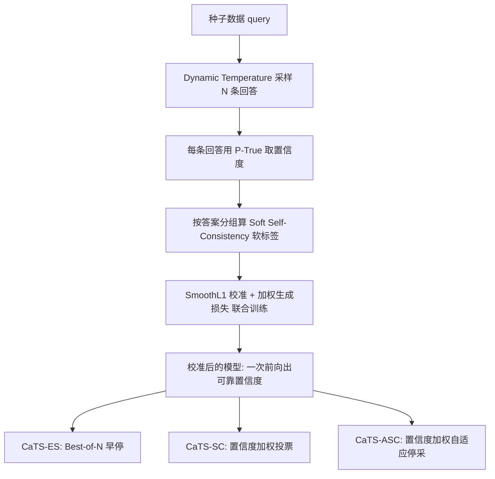

# CaTS: Calibrated Test-Time Scaling for Efficient LLM Reasoning

**会议**: ICLR 2026  
**OpenReview**: [https://openreview.net/forum?id=jrSc4RJXy1](https://openreview.net/forum?id=jrSc4RJXy1)  
**代码**: [https://github.com/Chengsong-Huang/Self-Calibration](https://github.com/Chengsong-Huang/Self-Calibration)  
**领域**: LLM 推理 / 测试时扩展  
**关键词**: 测试时扩展, 置信度校准, 自一致性, Best-of-N, 自适应采样, 早停  

## 一句话总结
通过把自一致性导出的置信度蒸馏回模型本身（Self-Calibration），让 LLM 在一次前向就能给出可靠的置信度，再以此对 Best-of-N / 自一致性等重复采样做"按题难度动态分配算力"的校准式测试时扩展，相同采样预算下显著提升精度、相同精度下大幅省算力。

## 研究背景与动机
**领域现状**：增大测试时算力是提升 LLM 回答质量最直接的手段，其中重复采样类方法——Best-of-N（采 N 条选最高分）与 Self-Consistency（采 N 条多数投票）——简单又有效，已成为推理任务的主力。

**现有痛点**：这些方法对每个 query 都固定采样 N 条，完全无视题目难度。对"2+3=?"这种简单题白白浪费算力，对难题又探索不足。已有的自适应采样（ASC、ESC、RASC）虽能动态停采，但大多依赖人工设计的特征或启发式规则（如"连续三次输出相同答案就停"），跨任务、跨模型的泛化性受限。

**核心矛盾**：模型置信度本是反映自身不确定性的内在信号，天然适合驱动动态采样；但 LLM 出了名地**过度自信**，原始 P(True)/logit 给出的置信度与真实准确率严重不符（尤其小模型），无法直接用。而自一致性虽能给出较准的置信度，却又需要先采一大堆样本，回到了"算力贵"的老问题。

**本文目标**：设计一个**任务无关、模型无关、不依赖人工启发式**的测试时采样框架，用一次前向就能得到可靠置信度，从而把算力按题难度自适应分配。

**核心 idea**：**置信度自蒸馏**——既然自一致性能给出准的置信度但太贵，那就把它当作"软标签"蒸馏进模型本身，让模型学会一次前向直接输出校准后的置信度；再把这个便宜可靠的置信度插进 Best-of-N / SC / ASC，变成校准式测试时扩展 CaTS。

## 方法详解

### 整体框架
方法分两阶段：**离线 Self-Calibration 训练** + **在线 CaTS 推理**。训练阶段无需任何人工标注，先在种子数据上自采样、用 Soft Self-Consistency 给每条回答打软置信度标签，再用 SmoothL1（校准）+ 生成损失（保推理能力）联合训练模型；推理阶段直接复用训练好的模型一次前向得到的置信度，把它作为质量指标插进三种重复采样策略，实现按难度动态分配采样预算。

### 关键设计

**1. Soft Self-Consistency 软置信度标签：把"投票频率"升级成"置信度加权频率"。** 训练数据无人工标注，关键在于如何给每条回答打出一个准的置信度。直接用 P(True)（取"Is the answer correct? (Yes/No)"中 Yes token 概率）会过度自信；纯自一致性（数答案出现次数）又只看频率不看单条质量。本文把两者融合：对 query 采 N 条回答 $\{(x,y_n,c_n)\}$，每条先有自身置信 $c_n$，再按答案聚合得 $\mathrm{SSC}(y)=\frac{\sum_{i:y_i=y} c_i}{\sum_{i=1}^N c_i}$，即"投我这个答案的所有回答的置信度之和占总和的比例"。这样既反映了答案被多少回答支持，又对低质量回答降权。Table 1 显示 SSC 的 ECE 在 GSM8K/SVAMP 上低至 3.42/3.75，优于 P(True)（12.03/28.94）和纯 SC（4.48/4.94），随后 $(x,y_i,\mathrm{SSC}(y_i))$ 即为训练三元组。

**2. 联合损失：一边校准置信度，一边守住推理能力。** 单纯训模型去拟合置信度，容易让它"只会报分、不会做题"。本文用 SmoothL1 把模型预测的 $p_\theta(\text{Yes}\mid x,y,I)$ 拉向软标签 $c$ 做校准，同时把高质量回答的标准 CoT 生成损失加进来共同优化——但只挑置信度高于阈值 $\eta$ 的回答参与生成损失，保证学的是靠谱推理路径。总损失为
$$\mathcal{L}_{total}(\theta)=\sum_{(x_j,y_j)\in D}\mathrm{SmoothL1}\!\big(p_\theta(\text{Yes}\mid x_j,y_j,I),\,c_j\big)+\omega\!\!\sum_{\substack{(x_i,y_i)\\ c_i>\eta}}\!\!\big(-\log p_\theta(y_i\mid x_i)\big),$$
权重 $\omega$ 平衡两项。采样时还用 Entropy-based Dynamic Temperature（EDT）：输出分布熵低时自动升温，提升多样性又不损质量。

**3. 三种 CaTS 推理变体：同一套置信度，三种省算力姿势。** 训练好的模型一次前向即给出可靠 $c_i$，本文把它分别插进三种重复采样。**CaTS-ES**（对应 Best-of-N 的早停）顺序采样，一旦某条 $c_i\ge\tau$ 立刻停采并选它，难题才会多采，简单题秒停。**CaTS-SC**（对应自一致性）把"一票一权"改成置信度加权投票 $y=\arg\max_z\sum_{i=1}^N c_i\mathbf{1}(y_i=z)$，让高置信回答话语权更大。**CaTS-ASC**（对应自适应自一致性）把累计频率换成置信度加权频率 $\hat r_k(z)=\frac{\sum_{i=1}^k c_i\mathbf{1}(y_i=z)}{\sum_{i=1}^k c_i}$，再按 ASC 原规则判停。

**4. 理论保证：置信度足够准时 CaTS-SC 指数级优于普通自一致性。** 本文给出严格证明，当置信度信号满足
$$\frac{\mu_q^2}{2v_q+\frac{2}{3}\mu_q}>\frac{\mu_{MV}^2}{2v_{MV}+\frac{2}{3}\mu_{MV}}$$
时（其中 $\mu$、$v$ 分别为加权投票/普通多数投票的边际均值与方差，$q$ 为给定置信度下的真实正确概率），CaTS-SC 的错误率以指数速率优于 vanilla SC。直觉上即：只要置信度信号"够准"，加权投票就稳赢均匀投票。

## 实验关键数据

### 主实验表格
三模型 × 三个域外数据集（Object Counting / MathQA / ARC Challenge），采样预算固定为 16，括号内为相对各自基线的提升：

| 方法 | Llama-8B Obj C. | Llama MathQA | Llama ARC C. | Qwen MathQA | DS-R1-1.5B ARC C. |
|---|---|---|---|---|---|
| SC | 69.1 | 73.7 | 85.2 | 83.3 | 60.8 |
| **CaTS-SC** | **76.8 (+7.7)** | **83.6 (+9.9)** | **87.7 (+2.5)** | **87.8 (+4.5)** | **66.5 (+5.7)** |
| Best-of-N | 62.3 | 73.7 | 84.5 | 83.8 | 54.1 |
| **CaTS-ES** | **76.8 (+14.5)** | **83.6 (+9.9)** | **87.7 (+3.2)** | **87.8 (+4.0)** | **66.5 (+12.4)** |
| ASC | 67.9 | 72.7 | 84.6 | 83.2 | 59.5 |
| **CaTS-ASC** | **75.2 (+7.3)** | **81.9 (+9.2)** | **86.6 (+2.0)** | **87.2 (+4.0)** | **65.1 (+5.6)** |

三种 CaTS 变体在三模型九数据集上一致优于各自基线；CaTS-ES 把 DeepSeek-R1-1.5B 在 Object Counting 上从 48.1 拉到 70.8（+22.7）。相比 ESC/RASC 等强自适应基线也整体占优。

### 消融实验表格
**置信度 vs. 外接奖励模型**（Best-of-16，验证自校准置信度能替代额外 reward model）：

| 模型 | 数据集 | Reward Model | CaTS 置信度 |
|---|---|---|---|
| Llama | MathQA | 82.1 | **84.0** |
| Llama | ARC Challenge | 86.2 | **86.6** |
| Qwen | ARC Challenge | 89.6 | **89.8** |

自校准置信度与外接 reward model 精度相当甚至略高，却省掉了额外模型的显存、推理时间和"奖励分需逐数据集归一化"的麻烦。

### 关键发现
- **省算力极猛**：Fig. 1 中 CaTS-SC 在 MathQA 上达到 85.0 精度时，比 vanilla SC 节省 **94.2%** 的采样量；不同精度档位分别省 39.8% / 50.4% / 94.2%。
- **预算小时 Best-of-N 反而略胜 CaTS-ES**：阈值偏低时早停可能停得太早错过更优回答，说明阈值需按数据集校准。
- **SSC 校准最准**：ECE 优于 P(True) 与纯 SC，是软标签可靠的根基。

## 亮点与洞察
- **"置信度自蒸馏"闭环很优雅**：用贵但准的自一致性当老师，蒸馏出便宜又准的一次前向置信度，把"算力换置信度"变成"训练一次、推理永久受益"。
- **一个置信度通吃三种采样**：Best-of-N / SC / ASC 全部能即插即用地升级成 CaTS 版本，方法通用性强、落地成本低。
- **理论 + 经验双支撑**：不只刷点，还给出 CaTS-SC 指数级优于 SC 的充分条件，把"置信度够准就稳赢"说清楚了。
- **替代 reward model 的实用价值**：省掉额外评分模型的显存与延迟，对大规模部署友好。

## 局限与展望
- **依赖阈值校准**：CaTS-ES/ASC 的停采阈值需按数据集调，论文中是用目标预算反推阈值，真实场景下未知预算时的鲁棒性待验证。
- **训练成本前置**：虽然推理省，但需要先在多数据集上自采样并微调模型，对闭源/超大模型不一定可行。
- **置信度准度上限决定收益**：理论与实验都表明收益取决于置信度是否"够准"，在分布外或对抗性难题上若校准退化，优势可能缩水。
- **评测集中在中小模型**：主要在 1.5B–8B 上验证，更大模型与更复杂推理（长链 CoT）上的表现仍待探索。

## 相关工作与启发
- **重复采样**：Best-of-N、Self-Consistency、Adaptive Self-Consistency 是本文直接改造的对象；ESC、RASC 为自适应停采的强基线。
- **置信度估计**：P(True)、自一致性置信度、CISC、Self-Certainty 是置信度信号的来源与对比项，本文用 SSC 把它们融合并蒸馏。
- **启发**：把"昂贵但可靠的聚合信号蒸馏进模型一次前向"这一思路，可迁移到其他需要在线昂贵估计的场景（如过程奖励、难度预测）；置信度加权投票的理论分析框架也可推广到其他加权聚合策略。

## 评分
- **新颖性**: ⭐⭐⭐⭐ 把自一致性置信度自蒸馏回模型、再统一驱动三种测试时扩展，组合新颖且配有理论保证。
- **实验充分度**: ⭐⭐⭐⭐ 三模型九数据集、域内外都测，含与 reward model、强自适应基线的对比及理论分析，较充分。
- **写作质量**: ⭐⭐⭐⭐ 框架清晰、图表到位（省算力曲线很有说服力），公式与符号定义规整。
- **价值**: ⭐⭐⭐⭐ 显著降低测试时扩展成本、即插即用、可替代 reward model，工程落地价值高。

<!-- RELATED:START -->

## 相关论文

- [\[ICLR 2026\] Optimal Aggregation of LLM and PRM Signals for Efficient Test-Time Scaling](optimal_aggregation_of_llm_and_prm_signals_for_efficient_test-time_scaling.md)
- [\[ICLR 2026\] ROC-n-Reroll: How Verifier Imperfection Affects Test-Time Scaling](roc-n-reroll_how_verifier_imperfection_affects_test-time_scaling.md)
- [\[ICLR 2026\] Efficient Test-Time Scaling for Small Vision-Language Models](efficient_test-time_scaling_for_small_vision-language_models.md)
- [\[ICLR 2026\] Plan and Budget: Effective and Efficient Test-Time Scaling on Reasoning LLMs](plan_and_budget_effective_and_efficient_test-time_scaling_on_reasoning_large_lan.md)
- [\[ICLR 2026\] Strategic Scaling of Test-Time Compute: A Bandit Learning Approach](strategic_scaling_of_test-time_compute_a_bandit_learning_approach.md)

<!-- RELATED:END -->
