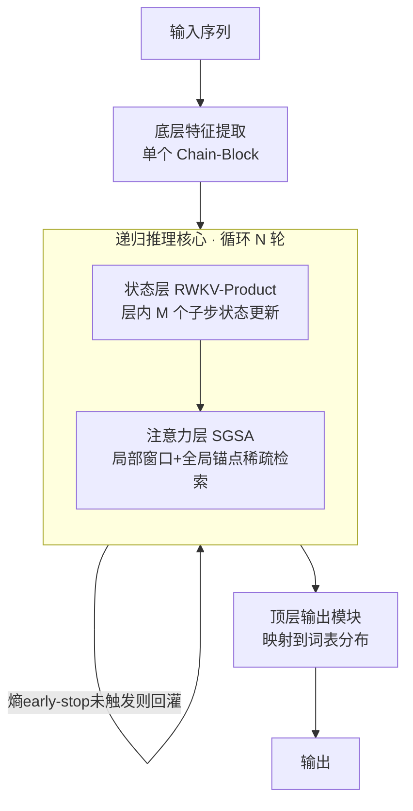

# ChainGPT: Dual-Reasoning Model with Recurrent Depth and Multi-Rank State Updates

**会议**: ICLR 2026  
**OpenReview**: [https://openreview.net/forum?id=kdZbxizwGK](https://openreview.net/forum?id=kdZbxizwGK)  
**代码**: 待确认  
**领域**: 基础模型架构 / LLM 推理  
**关键词**: 隐空间推理, 循环深度, 多秩状态更新, RWKV, 稀疏注意力, 混合架构  

## 一句话总结
ChainGPT 把推理从"生成更多 token"搬进隐空间，通过**层内多子步状态更新（RWKV-Product）+ 状态引导稀疏注意力（SGSA）**做深层局部计算，再叠加**跨层循环深度**做迭代精炼，在近线性复杂度下让小模型获得超出固定深度 Transformer 的推理能力。

## 研究背景与动机
**领域现状**：固定深度的标准 Transformer 在计算复杂度理论上落在 AC⁰/TC⁰ 这类电路类里，有限精度下并非图灵完备，难以端到端解决随问题规模增长的多步规划、符号操作、组合搜索等任务。主流的破解办法是 Chain-of-Thought（CoT），靠生成中间自然语言步骤来"加深"有效计算深度。

**现有痛点**：CoT 把推理表示成离散 token 序列，受语言表达力限制、难以刻画非线性/并行推理，且计算开销随生成长度快速膨胀；ToT、Self-Consistency 等策略改进进一步把成本推到指数级。另一条提效路线靠 RNN/混合架构（RWKV-7、Mamba、Jamba、Samba），但纯 RNN 的有限维状态矩阵装不下精细上下文（多跳推理掉点严重），而混合架构多是简单的顺序拼接：保留全局注意力撞上 O(N²) 可扩展性瓶颈，限制成局部窗口又解决不了状态矩阵容量不足的问题。

**核心矛盾**：一个好方案必须同时啃下两块硬骨头——既要让推理超越简单的 token 生成（够深），又要在保持长程依赖的前提下维持计算效率（够省）。现有工作总是顾此失彼。

**本文目标**：设计一种把推理迁入隐式计算空间的架构，在近线性复杂度下兼得推理深度与效率。

**核心 idea**：**双重递归推理**——层内用多子步状态更新做"一层里跑多轮推理"，层间用循环深度做迭代精炼；两者都把"迭代"从 token 生成挪进隐空间优化。

## 方法详解

### 整体框架
ChainGPT 由多个 Chain-Block 堆叠而成，每个 Block = 一个状态层（State Layer，核心是 RWKV-Product）+ 一个注意力层（SGSA）。在更高层面，整个模型被切成三段：底层特征提取器 → 递归推理核心 → 顶层输出模块，递归核心对隐状态反复精炼直到收敛。这样就形成"层内多子步 + 跨层循环深度"的双重递归。

### 关键设计

**1. RWKV-Product：用 LoRA 多子步把"低秩"叠成"高秩"。** 状态矩阵按 $s_t = A(x_t)s_{t-1} + B(x_t)$ 演化，关键是把单步更新拆成 $M$ 个子步，转移矩阵写成连乘形式 $A(x_t)=\prod_{j=0}^{M-1}\big(\mathrm{diag}(a_{t,j}) - \beta_{b,j}\,k^{(b)}_{t,j}{k^{(b)}_{t,j}}^{\top}\big)$，每个子步是"通道衰减 diag + 一个 rank-1 修正"，$M$ 个子步累乘后整体呈"diagonal + rank-M"结构。这正是它相对 RWKV-7（每步只 rank-1，表达力受限）和 DeltaProduct（多步 Householder 但参数开销大到不实用）的折中：所有 key/value 采用"共享基线 + LoRA 增量"（$k^{(b)}_{t,j}=k^{base}_t + x_t W^{(b,k1)}_j W^{(b,k2)}_j$ 之类），子步专属步长 $\beta_{b,j},\beta_{c,j}$ 由 sigmoid 门控给出。于是只增加约 0.1M 参数，就能把状态更新的有效秩动态拉到可调超参 $M$，相当于"一层之内跑多轮推理"，收敛更快、表征更强；且理论上 $M$ 越大表达力严格单调上升（Appendix A）。

**2. State-Guided Sparse Attention（SGSA）：把全局召回拆成"写入 + 指针读"。** 与"把整段历史压进有限状态"的纯 RNN 不同，SGSA 在状态层输出之上只关注两类 key：query 周围的局部窗口 $W$ 邻居，以及每隔 stride $G$ 采样一次的全局锚点。机制上 RWKV-Product 把局部片段聚合后写入锚点，SGSA 再通过稀疏寻址按"指针"取回内容，从而让状态空间随序列长度自然扩张、把记忆分散到 block 级片段里。复杂度从稠密注意力的 $O(T^2)$ 降到 $O(T(W + T/G))$，近线性。论文进一步证明在合适超参下 Chain-Block 能在任意长序列上解 Multi-Query Associative Recall（MQAR）：只要 $q_j=k_i$ 就能取回 $v_i$（Appendix B）。这一设计精准回应了"纯窗口注意力（Samba）有状态瓶颈、保留全局注意力（Jamba）有 O(N²) 瓶颈"的两难。

**3. 循环深度 + 自适应早停：在"推理多深"和"算多久"之间可控权衡。** 跨层用递归核心反复迭代隐状态，理论上配合足够内存与时间即可模拟任意图灵机、建模任意可计算函数（Appendix C 给出形式化证明）。为避免冗余迭代，引入基于熵的早停：每轮把核心输出解码成 $p_t=\mathrm{softmax}(\ell_t)$，算预测熵 $H_t(b)=-\sum_i p_{t,i}(b)\log(p_{t,i}(b)+\varepsilon)$，当相邻间隔的熵下降 $\Delta H_t(b)=H_{t-k}(b)-H_t(b)\le\tau$ 时停止递归。阈值 $\tau$ 为固定常数，这样模型对简单样本少迭代、对难样本多迭代。

**4. 两阶段训练稳定化：梯度免 warmup + 截断反传。** 直接对深递归做端到端反传会面临梯度爆炸/消失与显存压力。论文采用"gradient-free warmup + truncated backpropagation"两阶段策略：先让递归核心在不回传梯度的情况下迭代到接近稳定，再只对末尾若干步做截断反向传播，配合上面的熵早停，使得不定步数的循环深度训练既稳定又可控算力。

## 实验关键数据

实验统一在 8×NVIDIA L20 上完成；预训练用 FineWeb，评测走 lm-eval-harness 零样本。

### 主实验表格（综合性能，FineWeb 20B/40B token，零样本）

| Model | ARC-c | ARC-e | HellaSwag | PIQA | SciQ | GLUE | Avg. |
|---|---|---|---|---|---|---|---|
| Qwen2.5-0.5B | 0.2218 | 0.4082 | 0.3224 | 0.6425 | 0.5290 | 0.4664 | 0.4317 |
| **ChainGPT-0.5B** | 0.2389 | 0.4773 | 0.3644 | 0.6632 | 0.5330 | 0.4679 | **0.4575** |
| Qwen2.5-1.5B | 0.2696 | 0.5488 | 0.4091 | 0.6915 | 0.6380 | 0.4783 | 0.5059 |
| **ChainGPT-1.5B** | 0.2986 | 0.5779 | 0.4269 | 0.7018 | 0.6860 | 0.4836 | **0.5291** |

同参数量下 ChainGPT 全面领先，且在更吃推理的 ARC-Challenge / HellaSwag 上提升明显。

### 算术推理对比（GOAT 数据集，全部 from scratch，同切分/同优化）

| Model | Accuracy |
|---|---|
| Qwen3 | 33.82% |
| RWKV-7 | 23.69% |
| Qwen3 + Loop | 50.54% |
| RWKV-7 + Loop | 24.81% |
| HRM | 54.00% |
| **ChainGPT** | **57.53%** |
| Qwen3 + CoT | 88.43% |
| **ChainGPT + CoT** | **99.98%** |

无 CoT 监督时 ChainGPT 就超过所有循环推理基线（含 HRM）；叠加 CoT 后近乎打满。

### 消融实验表格

**(a) LoRA 子步机制有效性**（modded-nanogpt-rwkv）

| Model | Training Steps | Validation Loss |
|---|---|---|
| GPT2 | 19560 | ≈3.28 |
| RWKV-7 | 3200 | 3.2715 |
| RWKV-Product | 2500 | 3.2684 |
| RWKV-Product | 3200 | 3.1901 |

仅 +0.1M 参数，更少步数即达更低 loss。

**(b) MQAR 关联召回**（SGSA 解状态瓶颈）

| Model | (128,8) | (256,16) | (512,64) | (1024,128) | (2048,256) |
|---|---|---|---|---|---|
| RWKV-7 | >99% | >99% | 98.43% | 95.01% | 72.93% |
| **ChainGPT** | >99% | >99% | >99% | >99% | **>99%** |

**(c) 全局锚点策略**（PG-19 困惑度）：纯滑窗注意力（Samba 式）超 8K 上下文后退化；只加稀疏周期锚点（G=32/64/128）的困惑度轨迹几乎与昂贵的全局注意力（Jamba 式）重合（16K 处 ~16.08）。

### 关键发现
- **子步数 $M$**：验证 loss 随 $M$ 单调下降，$M=2$ 性价比最佳。
- **解耦状态传播路径**：在参数近似匹配下，解耦版全程优于耦合版。
- **循环深度**：×1→×16 迭代，验证困惑度稳步下降，×12 处最优。

## 亮点与洞察
- **"双重递归"的视角统一了两条提深路线**：层内多子步（横向加宽有效秩）+ 层间循环深度（纵向加深迭代），都把"迭代"从昂贵的 token 生成搬进隐空间，思路干净。
- **RWKV-Product 用 LoRA 把"多步高秩更新"做到几乎零参数代价**，直击 RWKV-7 rank-1 表达力不足与 DeltaProduct 参数过重之间的空白地带。
- **SGSA 的"写入-指针读"抽象很优雅**：把"RNN 状态压缩"和"注意力精确召回"焊在一起，既保近线性又证明能解任意长 MQAR，理论与工程都给了交代。
- **小模型也能拿到推理增益**：0.5B/1.5B 量级即对 Qwen2.5 形成稳定优势，且 GOAT 上无 CoT 就压过 HRM。

## 局限与展望
- **规模天花板**：实验最大到 1.5B、token 量 20–40B，是否在 7B+/万亿 token 尺度上保持优势未验证，图灵完备是"理想条件下"的理论结论。
- **基线口径**：综合评测主要对标 Qwen2.5 同尺寸，缺与 Mamba-2、RWKV-7、Jamba/Samba 在同等预训练预算下的端到端正面对比表（这些多出现在分项消融里）。
- **超参较多**：子步数 $M$、锚点间隔 $G$、窗口 $W$、熵阈值 $\tau$、循环上限均需调，最优值（$M=2$、×12 迭代）的跨任务普适性待考。
- **推理时开销**：循环深度虽有早停，但不定步数迭代对实际吞吐/延迟的影响、与 KV-cache 友好度的工程权衡论文着墨不多。

## 相关工作与启发
- **RNN 表达力瓶颈**：Merrill et al.、Grazzi et al.、Jelassi et al. 指出有限精度对角 RNN（Mamba）连基本状态追踪都难——这是 RWKV-Product 引入多子步、SGSA 引入锚点的直接动因。
- **混合架构**：Jamba（1:7 Mamba+Transformer，保留全局注意力）、Samba（Mamba+滑窗）是主要对照，ChainGPT 用稀疏锚点同时绕开二者的瓶颈。
- **超越固定深度的推理**：从 CoT/ToT/Self-Consistency（生成式）到 Universal Transformer、Looped Transformer、HRM、Depth-Recurrent（内部状态迭代）——ChainGPT 属后者但加了层内多子步这一新维度。
- **启发**：把"加深推理"拆成"加宽有效秩 × 加深迭代"两个正交旋钮，并各自配低开销实现，是设计高效推理架构的一个可复用范式。

## 评分
- **新颖性**: ⭐⭐⭐⭐ — 层内多子步（RWKV-Product）+ 跨层循环深度的"双重递归"组合，RWKV-Product 的 LoRA 多秩更新与 SGSA 的写入-指针读抽象都有原创性。
- **实验充分度**: ⭐⭐⭐ — 消融（子步数/解耦/锚点/循环深度/MQAR/GOAT）相当扎实，但主对比仅同尺寸 Qwen2.5、规模偏小，缺统一预算下与多种混合架构的端到端正面表。
- **写作质量**: ⭐⭐⭐⭐ — 动机-矛盾-方案逻辑清晰，公式与理论证明（图灵完备/MQAR）齐备，图表配套到位。
- **价值**: ⭐⭐⭐⭐ — 为"高效且能深推理"的下一代语言模型架构提供了有原则的设计模板，对小模型推理增强尤其有参考价值。

<!-- RELATED:START -->

## 相关论文

- [\[ICLR 2026\] MoDr: Mixture-of-Depth-Recurrent Transformers for Test-Time Reasoning](modr_mixture-of-depth-recurrent_transformers_for_test-time_reasoning.md)
- [\[ICLR 2026\] R-HORIZON: How Far Can Your Large Reasoning Model Really Go in Breadth and Depth?](r-horizon_how_far_can_your_large_reasoning_model_really_go_in_breadth_and_depth.md)
- [\[ICLR 2026\] Enhancing Language Model Reasoning with Structured Multi-Level Modeling](enhancing_language_model_reasoning_with_structured_multi-level_modeling.md)
- [\[ICLR 2026\] A State-Transition Framework for Efficient LLM Reasoning](a_state-transition_framework_for_efficient_llm_reasoning.md)
- [\[ICLR 2026\] Beyond Magnitude: Leveraging Direction of RLVR Updates for LLM Reasoning](beyond_magnitude_leveraging_direction_of_rlvr_updates_for_llm_reasoning.md)

<!-- RELATED:END -->
