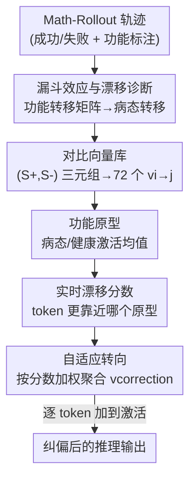

# Characterizing and Mitigating Reasoning Drift in Large Language Models

**会议**: ICLR2026  
**OpenReview**: [https://openreview.net/forum?id=OphrMOQCCY](https://openreview.net/forum?id=OphrMOQCCY)  
**代码**: 待确认  
**领域**: LLM推理  
**关键词**: 推理漂移、激活转向、思维链可靠性、功能状态转移、推理时干预

## 一句话总结
本文先用数千条数学推理轨迹诊断出大语言模型一种被称为"推理漂移"的失败模式——模型在早期高可塑阶段一旦发生病态的功能状态转移就会被锁死在错误链路上，再据此提出 Reasoning-Aware Activation Steering（RAAS），用一组从对比样本预算好的转向向量在推理时实时把激活轻推回健康路径，在 GSM8K / AIME / GPQA 上稳定提升准确率且能迁移到分布外任务。

## 研究背景与动机
**领域现状**：思维链（CoT）让 LLM 能把多步推理显式写出来，但这条链的生成本质是随机采样的。为了对抗随机性带来的不可靠，主流做法是自一致性（self-consistency，多次采样后多数投票）和路径搜索（Tree-of-Thoughts、beam search、PiCSAR 等，探索并剪枝多条路径）。

**现有痛点**：这两类方法都有两个硬伤。一是计算昂贵——它们靠大规模重复采样和缺乏明确指引的状态探索来"碰运气"。二是更根本的，它们把 LLM 当黑盒，只是增加试错次数，并不去探究模型内部到底怎么推理、为什么会失败，因此对推理机制本身几乎没有洞见。

**核心矛盾**：作者抓住一个反常现象提问——为什么在推理链中间只是重采样一句话，最终答案就可能从对翻成错、或从错翻成对？这背后一定有结构化的机制，而不是纯噪声。要回答它，就得从"黑盒外面加采样"转向"打开盒子看内部状态怎么流转"。

**本文目标**：(1) 刻画清楚单步替换为何能左右全局结果，找出决定可靠性的转移模式；(2) 设计一种轻量、可解释、有针对性的干预，主动把模型从失败模式拉回。

**切入角度**：作者借助 Math-Rollout 数据集——每个推理步都带 100 条随机 rollout 且标注了最终成败，还把每步标注成 8 类"功能角色"（Problem Setup、Plan Generation、Fact Retrieval、Active Computation、Result Consolidation、Uncertainty Management、Self Checking、Final Answer Emission）。有了这把"功能尺"，就能把原始文本变成功能状态序列，统计哪些状态转移和失败强相关。

**核心 idea**：把推理失败诊断为特定的病态功能转移（"推理漂移"），再用激活转向（activation steering）在这些转移即将发生时实时给激活一个微小修正向量，把它推回健康转移——用机理诊断指导精准干预，而不是盲目堆采样。

## 方法详解

### 整体框架
本文是"先诊断、后干预"的两段式工作。诊断段（Section 2）回答"推理为什么会崩"：在 Math-Rollout 上量化重采样的影响，发现推理早期高度可塑、后期迅速固化的"漏斗效应"，再用功能转移矩阵把失败归因到具体的病态状态转移，并区分出 Llama 的"惯性漂移"与 Qwen 的"混沌漂移"。干预段（Section 3，即 RAAS）回答"怎么救"：离线从对比样本里抽出一个最多 $9\times 8=72$ 个的转向向量库和一组功能原型；推理时对每个 token 实时算"漂移分数"判断它正往哪个病态功能滑，再按分数加权聚合相应转向向量、直接加到 token 激活上做实时纠偏。

### 关键设计

**1. 漏斗效应与推理漂移诊断：把"为什么崩"量化成可定位的病态转移**

这是全文的地基。作者先定义 **Outcome Polarity Flip Rate**——某条 rollout 的最终成败与原始路径相反的概率，并把推理过程切成早/中/晚三段（各占三分之一步数）。统计发现：rollout 与原句文本完全相同的只有 $5\%\sim7\%$，绝大多数（$\ge 93\%$）都引入了文字变化；而早期段的翻转率高得惊人，两个模型都超过 $47\%$，中期降到约 $30\%$、晚期继续走低。这就是"漏斗效应"——开头几步极度可塑、像抛硬币一样能决定全局，越往后路径越固化越确定。

接着作者要判断这些早期变化是噪声还是有意义的模式转移。他们用 Math-Rollout 的功能标注训练了一个 DistilBERT 分类器，给每条 rollout 句子打上功能标签，再补一个第 0 类 **Initial Question** 作统一起点，构造功能转移矩阵。诊断框架定义两组关键事件：对某步 $S_t$，若其 rollout 平均成功率高于保留 $S_t$ 则称该步 **unpromising**（该重采）、反之 **promising**（不该动）；rollout $T_t$ 导向成功为 **corrective**、导向失败为 **erroneous**。"漂移场景"即一个 promising 的 $S_t$ 被 erroneous 的 $T_t$ 带偏。把"漂移矩阵 − 纠正矩阵"画成热图，暴露出三类病态：① 共性失败——从 Initial Question 直接跳到 Plan Generation（没充分 Problem Setup 就急着求解）强烈预示失败；② 共性失败——系统性回避 Uncertainty Management（进入自我反思本是强力纠错机制，失败轨迹却因过度自信绕开它）；③ 模型特异签名——Llama 表现为对角线上强烈的自循环卡死（**惯性漂移 / Inertial Drift**），Qwen 表现为非线性乱跳、频繁回退到旧功能态（**混沌漂移 / Chaotic Drift**）。正是这套诊断给后面的干预指明了"该往哪推"。

**2. 对比向量库：把"健康转移 − 病态转移"压缩成 72 个可复用的转向方向**

诊断之后，作者要把"健康"与"病态"之间的差异提炼成可注入的方向。每条数据是三元组 $(S_{<t}, S^+, S^-)$：共享上文 $S_{<t}$、偏好的下一步 $S^+$、不偏好的下一步 $S^-$。角色按场景分配——纠正场景里（$S_t$ unpromising）令 corrective rollout 为 $S^+$、原 unpromising 步为 $S^-$；漂移场景里（$S_t$ promising）令 promising 步为 $S^+$、erroneous rollout 为 $S^-$。这样每个三元组的方向都"从次优指向更优"。

转向向量按"源功能类 $i$ → 目标功能类 $j$"细分：对子集 $D_{i\to j}$（$S_{t-1}$ 标签为 $i$、$S^-$ 标签为 $j$）取偏好与不偏好激活之差的均值

$$v_{i\to j} = \mathbb{E}_{(S^+,S^-)\in D_{i\to j}}\left[\mathrm{act}(S^+) - \mathrm{act}(S^-)\right]$$

其中句子激活取第 $L$ 层 token 激活的均值池化 $\mathrm{act}(S)=\frac{1}{|S|}\sum_{k=1}^{|S|} a_L(\text{token}_k)$。源类 9 个、目标类 8 个（排除 Initial Question），共得最多 $9\times 8=72$ 个细粒度向量。关键在于 $v_{i\to j}$ 不是要阻断所有 $i\to j$ 转移（很多此类转移是正确推理必需的），而只纠正那些显出漂移迹象的具体实例——这是它比"一个全局转向向量"更精准的地方。

**3. 实时漂移分数：在当前步功能还未知时，逐 token 判断它正滑向哪个失败模式**

干预的最大难点是时序错配：生成时上一步 $S_{t-1}$ 的功能类 $i$ 可以分类得到，但当前正在生成的 $S_t$ 功能未知，而回溯或前瞻又太贵。作者的解法是先离线算 **功能原型**——病态原型 $a^-_{i,j}=\mathbb{E}_{(\cdot,S^-)\in D_{i\to j}}[\mathrm{act}(S^-)]$ 是所有失败例的平均激活，健康原型 $a^+_{i,j}=\mathbb{E}_{(S^+,\cdot)\in D_{i\to j}}[\mathrm{act}(S^+)]$ 是所有成功例的平均。推理时取当前 token 激活 $a_{\text{token}}$，对每个潜在目标类 $j$ 算

$$\mathrm{DriftScore}(i,j) = \mathbb{I}\!\left(\cos(a_{\text{token}}, a^-_{i,j}) > \cos(a_{\text{token}}, a^+_{i,j})\right)\cdot \cos(a_{\text{token}}, a^-_{i,j})$$

即只有当 token 明显更靠近病态原型时分数才非零，且数值等于它与病态原型的余弦相似度；更靠近健康原型时分数为零。分数越高，说明当前生成不仅方向不对，还强烈对齐到某个已知失败模式 $j$。这把"功能未知"这个障碍绕了过去——不必先知道当前步是什么功能，只要看激活更像哪个原型即可。

**4. 推理时自适应转向：按漂移分数加权聚合，给激活一个上下文感知的纠偏**

最后把向量库和原型整合成在线算法，在每个 token 生成步执行。先对已完成的上一步 $S_{t-1}$（$t=1$ 时取初始问题）用分类器定其功能类 $i$；再对全部 8 个潜在目标类算 $\mathrm{DriftScore}(i,j)$；然后以漂移分数为权重，把所有源自上下文 $i$ 的转向向量加权求和成纠偏向量

$$v_{\text{correction}} = \sum_{j=1}^{8} \mathrm{DriftScore}(i,j)\cdot v_{i\to j}$$

并直接叠加到原始 token 激活 $a'_{\text{token}} = a_{\text{token}} + v_{\text{correction}}$。这样修正强度随漂移程度自适应：没漂移时分数全 0、激活不动；越偏向某个失败模式，对应方向的推力越大。相比微调需要大规模重训、相比自一致性/路径搜索靠海量采样，RAAS 是一种轻量、可解释、且只在该出手时出手的推理时干预。

### 损失函数 / 训练策略
RAAS 本身无需训练或微调主模型——转向向量库与功能原型都是从 Math-Rollout 数据集上离线统计（取激活差均值与激活均值）得到的，唯一需要训练的是用于打功能标签的 DistilBERT 分类器。干预层 $L$ 的选择细节见原文附录 F（⚠️ 以原文为准）。

## 实验关键数据

### 主实验
在与 Math-Rollout 同源风格的数学推理基准上评测，主模型为 R1-Distill-Llama-8B 与 R1-Distill-Qwen-14B。注意这些评测集相对抽向量所用数据是数学域内的分布外（OOD）集合。

| 模型 | 方法 | GSM8K | AIME2024 | AIME2025 | GPQA-Diamond |
|------|------|------|----------|----------|--------------|
| R1-Distill-Llama-8B | Vanilla | 82.45 | 34.99 | 25.56 | 50.50 |
| R1-Distill-Llama-8B | CAAum | 85.06 | 45.00 | 30.00 | 52.52 |
| R1-Distill-Llama-8B | **Ours** | **87.56** | **55.56** | **31.70** | **55.52** |
| R1-Distill-Qwen-14B | Vanilla | 93.69 | 54.44 | 26.67 | 55.55 |
| R1-Distill-Qwen-14B | **Ours** | **95.60** | **62.49** | **36.67** | **57.57** |

提升在 AIME2024 / AIME2025 这类需要复杂多步演绎的难题上尤其显著（Llama 上 AIME2024 从 34.99 → 55.56）。由于评测集是 OOD，作者据此论证细粒度功能向量没有过拟合源分布，而是捕捉到了可泛化的逻辑推理原则。CAAum 是只取 Uncertainty Management 单一向量的对照，已能涨不少，但全库自适应更强。

### 消融实验

| 配置 | 现象 | 说明 |
|------|------|------|
| Ours（精确 $i\to j$ 映射） | 最高 | 完整方法 |
| Random Source（$i_{\text{rand}}\to j$） | 略优于 Vanilla | 源类随机，仅剩通用纠正方向 |
| Random Target（$i\to j_{\text{rand}}$） | 略优于 Vanilla | 目标类随机，同上 |
| Fully Random | 严重退化 | 随机选库内向量，破坏推理 |

### 关键发现
- **精确的上下文映射 $(i\to j)$ 才是收益主力**：所有向量都来自"偏好−不偏好"之差，因此天然带一个通用纠正方向，随机源/随机目标仍能当作测试时正则带来微弱提升；但完全随机会严重破坏推理，说明功能上下文不可或缺。
- **机理验证（RQ1）确凿对应诊断**：干预后转移矩阵显示，方法在开头充当护栏，抑制"初始问题→直接计划生成"的早跳、鼓励更慎重的 Problem Setup，并持续提升从各步进入 Uncertainty Management 的概率（即压制过度自信）；早—中期的病态自循环明显减弱，干预在高可塑早期最有效，而晚期的惯性模式仍较顽固。
- **跨模型泛化（RQ3）**：把蒸馏模型上学到的向量零重训直接迁移到非蒸馏底座 Llama3.1-8B、Qwen2.5-14B 仍稳定带来正向提升（如 Llama3.1-8B GSM8K 83.91 → 85.22），但幅度小于主模型，提升大小取决于模型自身的推理能力与预训练数据。

## 亮点与洞察
- **"漏斗效应 + 功能转移矩阵"是很漂亮的诊断范式**：把"重采样一句就翻盘"这个直觉现象，拆成可量化的翻转率曲线和可定位的病态转移格子，让失败从"黑盒玄学"变成"哪一类功能跳到哪一类"的具体账目，非常有解释力。
- **模型特异的漂移签名（惯性 vs 混沌）很有"啊哈"感**：同样叫"推理漂移"，Llama 是卡在自循环、Qwen 是乱跳回退，说明干预不该一刀切——这对设计模型定制化的推理增强很有启发。
- **DriftScore 巧妙绕开"当前步功能未知"的死结**：不预测当前步是什么功能，只比它的激活更像病态还是健康原型，用指示函数+余弦相似度把"该不该纠、纠多重"压成一个标量，工程上轻量可落地。
- **可迁移 trick**：这套"对比抽向量库 + 实时原型打分 + 加权注入"的框架，不限于数学推理——任何能把过程切成可标注功能态、且有成败标签的任务（如代码推理、多步规划），都能照搬来做推理时纠偏。

## 局限与展望
- **强依赖功能标注与 Math-Rollout 这类细粒度数据**：向量库、原型、分类器都建立在 8 类功能标注 + 每步 100 rollout 的昂贵标注上，迁到没有此类数据的新领域要先解决"功能体系怎么定、标注怎么来"。
- **诊断与评测集中在数学推理**：8 类功能角色是为数学解题设计的，能否覆盖开放域问答、长程 agent 规划等不同推理形态尚待验证。
- **晚期惯性漂移仍难纠**：实验自承干预在早期高可塑阶段最有效，晚期固化后的惯性模式依旧顽固，说明"早干预"窗口之外的失败仍是开放问题。
- **关键超参（干预层 $L$、激活池化方式）的敏感性正文未充分展开**（⚠️ 细节以原文附录为准），跨模型迁移时这些选择可能需要重新调。

## 相关工作与启发
- **vs 自一致性 / 路径搜索（SC、ToT、PiCSAR）**：它们把模型当黑盒，靠海量采样+投票/剪枝压住随机性，算力贵且不解释失败；本文打开盒子诊断病态转移，再用轻量推理时向量精准纠偏，既省采样又给出机理。
- **vs 经典激活转向（Turner/Rimsky/Arditi 等）**：经典 steering 多用一个全局向量调某种行为（如拒答、风格）；本文把它细化到"功能态 $i$→$j$"的 72 维向量库，并用实时漂移分数动态决定何时、用哪条、用多重，专门适配多步推理这种细腻场景。
- **vs CAAum（只取 Uncertainty Management 单向量）**：CAAum 验证了"补反思能纠漂移"的直觉并已有效，但本文全库自适应在难题上提升更大，说明漂移是多模式的、单一向量不足以覆盖。

## 评分
- 新颖性: ⭐⭐⭐⭐⭐ 把推理失败诊断成可定位的功能态漂移、再用细粒度激活转向实时纠偏，诊断与干预闭环新颖
- 实验充分度: ⭐⭐⭐⭐ 覆盖 4 个基准 + 机理验证 + 随机消融 + 跨模型迁移，较扎实；但功能体系局限数学域、晚期漂移仍弱
- 写作质量: ⭐⭐⭐⭐⭐ 从现象到诊断到方法层层递进，热图与公式配合清晰，逻辑链条完整
- 价值: ⭐⭐⭐⭐ 提供一套低成本、可解释、可迁移的推理时纠偏范式，对提升 reasoning model 可靠性有实用价值

<!-- RELATED:START -->

## 相关论文

- [\[ICLR 2026\] DRIFT: Decompose, Retrieve, Illustrate, then Formalize Theorems](drift_decompose_retrieve_illustrate_then_formalize_theorems.md)
- [\[AAAI 2026\] Answering the Unanswerable Is to Err Knowingly: Analyzing and Mitigating Abstention Failures in Large Reasoning Models](../../AAAI2026/llm_reasoning/answering_the_unanswerable_is_to_err_knowingly_analyzing_and.md)
- [\[ICLR 2026\] On the Thinking-Language Modeling Gap in Large Language Models](on_the_thinking-language_modeling_gap_in_large_language_models.md)
- [\[ICLR 2026\] StreamingThinker: Large Language Models Can Think While Reading](streamingthinker_large_language_models_can_think_while_reading.md)
- [\[ICLR 2026\] Vision-R1: Incentivizing Reasoning Capability in Multimodal Large Language Models](vision-r1_incentivizing_reasoning_capability_in_multimodal_large_language_models.md)

<!-- RELATED:END -->
