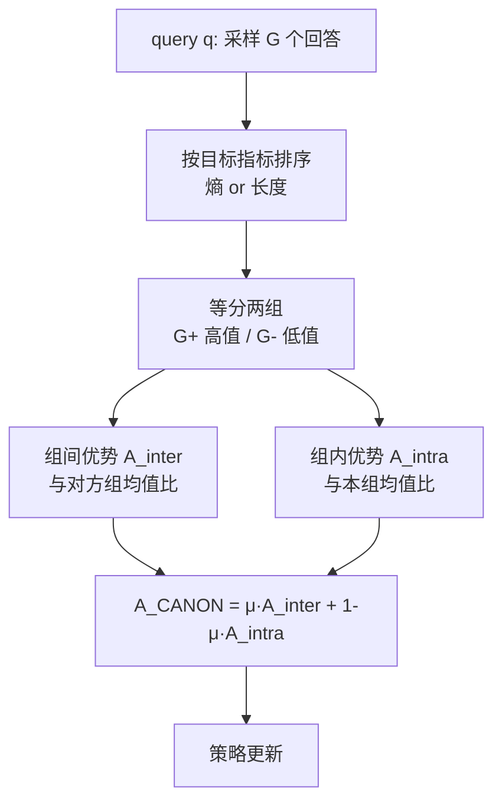

# Conditional Advantage Estimation for Reinforcement Learning in Large Reasoning Models

**会议**: ICLR 2026  
**OpenReview**: [https://openreview.net/forum?id=CTEXdHB1BB](https://openreview.net/forum?id=CTEXdHB1BB)  
**代码**: [https://github.com/the-secret-key/CANON](https://github.com/the-secret-key/CANON)（论文标注 §CANON，以仓库为准）  
**领域**: LLM 推理 / RLVR  
**关键词**: RLVR, GRPO, 优势估计, 条件分组, 熵, token 效率, 推理模型  

## 一句话总结
CANON 不再人为规定「熵越高越好」或「越短越好」这类方向性先验，而是把同一 query 的采样回答按目标指标（熵 / 长度）排序切成两组，用**组间比较**自动发现「哪个指标趋势更有利于正确率」、用**组内比较**挑出同趋势里更优的回答，从而在不调惩罚项的前提下放大目标指标的有效影响。

## 研究背景与动机
**领域现状**：RLVR（带可验证奖励的强化学习）已是提升大推理模型（LRM）数学/逻辑推理能力的核心手段，GRPO 及其变体 DR.GRPO 是主流算法。研究者还发现一些训练指标（熵、回答长度等）与推理行为强相关，于是想把这些「人类先验」注入训练。

**现有痛点**：主流做法是通过 **reward shaping**（如超长惩罚提效率）或 **advantage shaping**（如用熵信号维持探索）把先验塞进去，但这些方法本质上假定某个指标「higher-is-better 或 lower-is-better」，并靠手工惩罚/偏好系数实现。一旦超参没调好，方向性先验会过度偏置，直接把指标硬推高或压低，反而损害性能。

**核心矛盾**：同一个指标的「好方向」其实是**情境相关**的——高熵回答偏探索，能答对复杂题；低熵回答更确定，在能力范围内的题上准确率更高。预设单一方向必然在另一类场景翻车。

**本文目标**：在不预设指标方向偏好的前提下，**放大目标指标变化对优势估计的影响**，让模型自己从 rollout 中发现「当前该往哪个方向走」，从而自然习得有益行为（增强探索 or 提升 token 效率）。

**核心 idea**：**条件分组 + 双路优势**。把回答按指标值排序切两组，用「组间优势」回答方向问题、「组内优势」回答优选问题，再用一个权重 $\mu$ 把两者融合——而 DR.GRPO 恰好是 $\mu=0.5$ 的特例。

## 方法详解

### 整体框架
对每个 query，先按 GRPO 那样采样 $G$ 个回答；CANON 在算优势前插入一步**条件重分组**：按目标指标（如 per-token 熵或回答长度）排序，等分成高值组 $G^+_q$ 与低值组 $G^-_q$。随后并行计算两种优势——**组间优势**让每个回答和「对方组」的均值比，揭示哪种指标趋势带来更高奖励；**组内优势**让回答和「自己组」均值比，在同趋势内挑更优者。最后按 $\mu$ 加权融合成最终优势送入 PPO/GRPO 式的策略更新。

### 关键设计

**1. 条件重分组：把模糊的全局基线换成有明确对照目标的两组。** GRPO 用「组内全部回答的均值」作基线，但这个基线对照目标模糊，优化信号不清晰。CANON 引入任意条件 $c$，把满足条件的回答记为 $C^+_q=\{o\mid o\text{ 满足 }c\}$、其余为 $C^-_q=G_q\setminus C^+_q$。本文聚焦「相对条件」——按熵或长度的数值排序等分，使分组本身携带了「指标高 vs 低」这个可对照的语义，为后续两路优势提供清晰的比较锚点。

**2. 组间优势：让模型自动发现指标的「有利方向」。** 组间优势把每个回答和**对方组**的均值比较：

$$\hat A^{\text{inter}}_{q,o,t}=\begin{cases}R_o-\text{mean}(\{R_{o'}\mid o'\in G^+_q\}), & o\in G^-_q\\ R_o-\text{mean}(\{R_{o'}\mid o'\in G^-_q\}), & o\in G^+_q\end{cases}$$

以熵为例：若低熵组（更确定）平均奖励更高，组间优势就会更偏向「低熵且正确」的回答，高效利用已有特征提分；这一切无需预设熵的方向，方向由数据里两组奖励的高低自动决定。论文用 **Theorem 1** 证明：当两组等大时，$|\hat A^{\text{inter}}|/|\hat A^{\text{DR.GRPO}}|>1$，即组间优势相对 DR.GRPO **放大了分组指标对优势的影响**，且 **Theorem 2** 进一步保证这种放大是「选择性」的——只放大用于分组的那个指标，不会连带放大其他独立因素的影响。

**3. 组内优势：在同趋势内优选，并自动救济「弱势组」的正确回答。** 组内优势把回答和**自己组**均值比：

$$\hat A^{\text{intra}}_{q,o,t}=\begin{cases}R_o-\text{mean}(\{R_{o'}\mid o'\in G^+_q\}), & o\in G^+_q\\ R_o-\text{mean}(\{R_{o'}\mid o'\in G^-_q\}), & o\in G^-_q\end{cases}$$

它形似在更小范围内做 DR.GRPO，但因两组均值不同会产生关键差异：当某组平均奖励更低时，该组里的正确回答会拿到**更大**优势（$1-\text{mean}(G^+_q)>1-\text{mean}(G^-_q)$ 当 $\text{mean}(G^+_q)<\text{mean}(G^-_q)$）。落到熵场景，就是给「高熵但答对」的探索性 rollout 更多激励，从而鼓励真正有效的探索。

**4. 统一加权与训练目标对齐：一个 $\mu$ 串起 DR.GRPO，一个 $\alpha$ 调 token 效率。** 两路优势融合为 $\hat A^{\text{CANON}}_{q,o,t}=\mu\hat A^{\text{inter}}_{q,o,t}+(1-\mu)\hat A^{\text{intra}}_{q,o,t}$，$\mu=0.5$ 恰好还原 DR.GRPO（式 7），$\mu=1$/$\mu=0$ 即 CANON-Inter/CANON-Intra，还可在训练中调度 $\mu$（如先 Inter 后 Intra）。此外在组间优势里给某组加权重 $\alpha$：

$$\hat A^{\text{inter}}_{q,o,t,\alpha}=\begin{cases}R_o-\alpha\cdot\text{mean}(\{R_{o'}\mid o'\in G^+_q\}), & o\in G^-_q\\ \alpha\cdot R_o-\text{mean}(\{R_{o'}\mid o'\in G^-_q\}), & o\in G^+_q\end{cases}$$

把长回答组当 $G^+_q$、令 $\alpha=0.9$，即可在几乎不掉点的情况下显著压缩长度，实现高 token 效率推理。

## 实验关键数据

### 主实验表格
基于 Qwen2.5-Math-7B，统一设置下与各类优势估计基线对比（数学 6 benchmark 平均 Acc / 平均 Tokens；ZebraLogic 高复杂逻辑 Acc）：

| 方法 | Math Acc | Math Tokens | Logic Acc | Logic Tokens |
|------|----------|-------------|-----------|--------------|
| GRPO | 53.8 | 3730 | 17.2 | 9406 |
| DR.GRPO ($\mu=0.5$) | 55.7 | 1522 | 26.2 | 4896 |
| Entropy Adv | 56.3 | 2389 | 18.5 | 8207 |
| Clip-Cov | 56.1 | 1344 | 26.5 | 4045 |
| CANON-Inter（按熵） | **57.6** | 1466 | 25.7 | 4415 |
| CANON-Intra（按熵） | 54.7 | 2959 | 29.1 | 3101 |
| CANON-Dynamic（按熵） | 56.7 | 1452 | 29.2 | 3535 |
| CANON-Inter（按长度） | 55.3 | **1008** | **29.5** | 3652 |

要点：组间优势（按熵）在数学上拿到最高 57.6，比 DR.GRPO 提升约 1.9 分；组内优势在高复杂逻辑题上优势明显（XLarge 子集最高提升 5.2 分）。

### 消融实验表格
CANON-Dynamic（调度 $\mu$）跨三模型两任务的稳健性：

| 模型 | 方法 | Math Acc | Logic Acc |
|------|------|----------|-----------|
| Qwen2.5-Math-7B | DR.GRPO | 55.7 | 26.2 |
| Qwen2.5-Math-7B | First-Inter-Later-Intra | **57.0** | 28.3 |
| Qwen2.5-Math-1.5B | DR.GRPO | 46.4 | 12.8 |
| Qwen2.5-Math-1.5B | First-Inter-Later-Intra | 46.8 | **17.0** |
| Llama3.1-8B | DR.GRPO | 22.0 | 14.9 |
| Llama3.1-8B | Cosin-First-Inter-Later-Intra | 22.6 | **18.9** |

### 关键发现
- **方向自适应**：组间 vs 组内的相对重要性随任务变化——数学题更吃组间（找对方向即提分），高复杂逻辑题更吃组内（激励弱势组的探索）；动态调度能同时拿下两者。
- **效率前沿**：按长度分组 + $\alpha<1$ 加权，建立性能-成本新 Pareto 前沿；低 token 预算下数学性能提升 2.63×，同性能下 token 消耗减少 45.5%。
- **理论支撑落地**：等大分组下组间优势确实相对 DR.GRPO 放大了目标指标影响（Theorem 1），且不污染其他独立因素（Theorem 2）。

## 亮点与洞察
- **「不预设方向」是真正的概念创新**：把「该往哪走」从超参变成由数据组间奖励差自动推断，绕开了 reward/advantage shaping 最脆弱的方向假设。
- **优雅的统一视角**：DR.GRPO = CANON($\mu=0.5$)，让人看清主流 group-relative 优势其实是「组间+组内」的均匀混合，CANON 只是解耦并允许重新配比。
- **同一框架两用**：换分组指标（熵→长度）就从「提探索」切到「提效率」，泛化性强。

## 局限与展望
- 分组只做「等分两组」，理论保证（Theorem 1）也依赖两组等大；多组、不等分、连续条件下的最优分组方式尚未探索。
- $\mu$ 的调度策略（First-Inter-Later-Intra、cosine 等）仍带启发式色彩，不同模型最优调度不一致（如 Llama 偏好 cosine 版），自动化调度仍待研究。
- 指标局限在熵和长度两类，能否推广到更抽象的推理行为指标（如反思次数、子目标分解）尚未验证。

## 相关工作与启发
- **优势估计谱系**：从 PPO 的 GAE 到免 critic 的 ReMax/RLOO/GRPO/REINFORCE++，CANON 沿着 group-relative 这条线，把「单一基线」升级为「双组对照」。
- **RLVR + 行为塑形**：相较 Arora & Zanette、Luo 等的超长惩罚和 Chen、Cheng 等的熵 advantage shaping，CANON 的差异在于不加惩罚项、不预设方向，理论上还能避免对无关因素的连带放大。
- **启发**：「把方向性先验替换为数据驱动的方向发现」这一思路，或可迁移到 RLHF/对齐中其他需要人为指定偏好强度的场景。

## 评分
- **新颖性**: ⭐⭐⭐⭐ — 「条件重分组 + 组间/组内双路优势、不预设方向」是干净且新颖的视角，DR.GRPO 作为特例的统一也很漂亮。
- **实验充分度**: ⭐⭐⭐⭐ — 三模型、两任务、六数学 + 三逻辑 benchmark，含动态调度与效率前沿，并配两条定理；但分组方式消融较单一。
- **写作质量**: ⭐⭐⭐⭐ — 动机—方法—理论—实验逻辑闭环，公式与图示清晰。
- **价值**: ⭐⭐⭐⭐ — 给 RLVR 优势塑形提供了少调参、可迁移的实用范式，效率前沿结果对落地有直接意义。

<!-- RELATED:START -->

## 相关论文

- [\[ICLR 2026\] Quantile Advantage Estimation: Stabilizing RLVR for LLM Reasoning](quantile_advantage_estimation_stabilizing_rlvr_for_llm_reasoning.md)
- [\[ACL 2026\] Revisiting Entropy in Reinforcement Learning for Large Reasoning Models](../../ACL2026/llm_reasoning/revisiting_entropy_in_reinforcement_learning_for_large_reasoning_models.md)
- [\[ICLR 2026\] A Simple "Motivation" Can Enhance Reinforcement Finetuning of Large Reasoning Models](a_simple_motivation_can_enhance_reinforcement_finetuning_of_large_reasoning_mode.md)
- [\[ICLR 2026\] Learning What Reinforcement Learning Can't: Interleaved Online Fine-Tuning for Hardest Questions](learning_what_reinforcement_learning_cant_interleaved_online_fine-tuning_for_har.md)
- [\[ICLR 2026\] NFT: Bridging Supervised Learning and Reinforcement Learning in Math Reasoning](nft_bridging_supervised_learning_and_reinforcement_learning_in_math_reasoning.md)

<!-- RELATED:END -->
