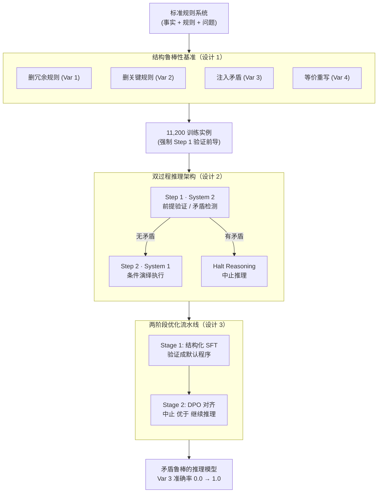

# Conflict-Aware Fusion: Resolving Logic Inertia in Large Language Models via Structured Cognitive Priors

**会议**: ICLR 2026  
**arXiv**: [2512.06393](https://arxiv.org/abs/2512.06393)  
**代码**: [https://github.com/14H034160212/lemo](https://github.com/14H034160212/lemo)  
**领域**: LLM推理  
**关键词**: logic inertia, contradiction detection, dual-process reasoning, structural robustness, rule-based reasoning

## 一句话总结
揭示了 LLM 的"逻辑惯性"现象——在遇到矛盾前提时仍沿学习到的推理轨迹继续推理（准确率降至 0.0），提出 Conflict-Aware Fusion 双过程架构，通过强制前提验证先于推理执行，在矛盾检测上实现 100% 准确率。

## 研究背景与动机

**领域现状**：LLM 在多步逻辑推理基准上表现出色（基准准确率 1.0），但这些基准通常只测试正常条件下的推理能力，不考察规则系统被扰动后的鲁棒性。

**现有痛点**：现有评估将语言能力与逻辑鲁棒性混为一谈。缺乏能够在统一框架下隔离缺失规则、冗余规则和矛盾前提各自影响的诊断框架。

**核心矛盾**：LLM 是否真正进行逻辑推理，还是仅通过模式匹配模拟推理？当规则系统的结构完整性被破坏时（特别是注入矛盾），答案是后者——所有测试模型在矛盾条件下准确率均降至 0.0。

**本文目标** (a) 建立系统化的结构鲁棒性评估框架；(b) 识别并形式化"逻辑惯性"现象；(c) 设计能消除逻辑惯性的推理框架。

**切入角度**：认知结构假说（Cognitive Structure Hypothesis）——可靠的多步推理需要在前提验证和演绎执行之间进行显式的结构分离。这种归纳偏置在当前端到端训练范式中完全缺失。

**核心 idea**：在推理过程中强制插入"验证先于推理"的结构约束——先用 System 2 检测矛盾，再用 System 1 执行推理，矛盾时中止。

## 方法详解

### 整体框架
这篇论文想回答一个尖锐的问题：LLM 在矛盾前提下崩溃，到底是模型不会推理，还是它根本没去验证前提？为此作者做了三件环环相扣的事。第一步先造一个**结构鲁棒性基准**，从同一套标准规则系统出发只动一个结构属性，把"语言能力"和"逻辑鲁棒性"拆开来测，从而把逻辑惯性暴露出来。第二步针对暴露出的病根，设计一个**双过程推理架构**，在 Chain-of-Thought 的生成路径里强行插入"先验证、后执行"的两阶段结构。第三步用一条**两阶段优化流水线**（结构化 SFT + DPO 对齐）把这个"先验证后执行"的结构真正训练进模型，让验证从"可选动作"变成"默认程序"。整条链路从规则系统出发，经基准造数据、用架构定义推理结构、再由优化把结构内化，最终得到一个在矛盾前提下也不会盲目往下推的模型。

### 关键设计

**1. 结构鲁棒性基准：把"语言能力"和"逻辑鲁棒性"拆开测**

现有评估把语言能力和逻辑鲁棒性混在一起，看不出模型到底在哪一环出问题。这个基准的做法是从同一标准规则系统出发，每次只控制一个结构属性，构造四种受控扰动：Variant 1 删冗余规则（结论不变，测对冗余信息的容忍度）、Variant 2 删关键规则（推理链断裂，测能否发现证据不足）、Variant 3 注入与现有事实矛盾的证据（测矛盾检测）、Variant 4 用逻辑等价变换重写规则（表面形式变、语义不变，测形式不变性）。因为四个变体共享同一规则系统、只差一个被操纵的属性，性能差异就能干净地归因于推理鲁棒性，而不是领域偏移——这正是它能把"逻辑惯性"单独拎出来的关键。

**2. 双过程推理架构：把"验证"从可选行为变成必经结构**

基准暴露的病根是 LLM 优先完成推理链、而不去验证推理前提。这个架构直接在 CoT 生成路径里强制加入两阶段：Step 1 由 System 2 做前提验证，检查前提的完整性与一致性、检测是否存在矛盾；Step 2 才是 System 1 的条件执行，**只有当 Step 1 通过时**才执行演绎推理，一旦检测到矛盾就输出"Halt Reasoning"中止。它的有效之处在于把验证从一个可有可无的行为变成了结构上必经的前置步骤，从而打破"推理优于验证"的惯性——模型不再有机会绕过验证直接往下推。这套 System 2 先于 System 1 的安排也正好对应认知科学的 dual-process theory。

**3. 两阶段优化流水线：先把结构建起来，再强化中止行为**

光有 prompt 结构还不够，得把它训练进模型。Stage 1 是结构化 SFT，在 11,200 个实例（含标准、扰动、矛盾三类变体）上训练，所有样本都强制带"Step 1: 验证事实"前导，让前提检查成为模型的默认程序。Stage 2 是 DPO 逻辑对齐，构造偏好对——"在矛盾处正确中止"优于"继续做不受支持的推理"，以此直接惩罚那种跳过验证的"幻觉快捷方式"，强化有纪律的终止行为。两阶段分工明确：SFT 负责把验证结构立起来，DPO 负责把矛盾检测这个具体行为打磨到位，二者缺一不可（实验里单 SFT 0.705、单 DPO 0.510，合起来才到 1.000）。

### 损失函数 / 训练策略
- SFT: 标准自回归损失 + LoRA (r=8, α=16)，lr=2e-5，3 epochs
- DPO: 偏好对（验证+中止 vs 继续推理），直接优化策略与偏好对齐
- 模型：BERT-base, Qwen2-1.5B, TinyLlama-1.1B，全部使用 LoRA 微调

## 实验关键数据

### 主实验

| 方法 | Base Acc | Var 2 (规则删除) | Var 3 (矛盾) |
|------|---------|-----------------|--------------|
| Stage 1 (SFT Baseline) | 0.512 | 0.250 | 0.210 |
| DPO (Direct Alignment) | 0.475 | 0.267 | 0.510 |
| CoT (Standard) | 0.500 | 0.390 | 0.865 |
| Mixed-Aug (数据增强) | 0.525 | 0.405 | 0.972 |
| Fusion-LRA (Conflict-Aware SFT) | 0.988 | 0.753 | 0.705 |
| **Fusion-Conflict (完整)** | **1.000** | **0.735** | **1.000** |

### 消融实验

| 配置 | Base | Var 3 (矛盾) | 说明 |
|------|------|-------------|------|
| 所有基线 (无 Fusion) | 1.000 | 0.000 | 逻辑惯性：矛盾时完全崩溃 |
| + SFT 预训练 | ~0.53 | 0.000 | SFT 不能解决矛盾问题 |
| + CoT | 0.500 | 0.865 | CoT 有一定帮助但不够 |
| + Fusion-LRA (SFT only) | 0.988 | 0.705 | 验证结构显著提升 |
| **+ Fusion-Conflict (SFT+DPO)** | **1.000** | **1.000** | 完全消除逻辑惯性 |

### 关键发现
- **逻辑惯性的普遍性**：BERT、Qwen2、TinyLlama 在矛盾条件下准确率均为 0.0——这不是某个模型的问题，而是当前 LLM 训练范式的结构性缺陷
- **鲁棒性不对称**：模型在语义保持变换下高度稳定（Variant 4），但在矛盾下完全崩溃——说明模型能识别逻辑等价但不能检测逻辑矛盾
- **Human Last Exam 外部验证**：所有 top-tier 模型（包括 GPT-4 级别）也在构造的矛盾案例上失败，确认这是通用问题
- **验证结构 + DPO 的协同效应**：单独 SFT（0.705）或单独 DPO（0.510）在矛盾检测上都不够，两者结合才达到 1.000

## 亮点与洞察
- **逻辑惯性的形式化**：首次命名和形式化这个失败模式——LLM 优先完成推理链而非验证推理前提。这个洞察对 AI 安全有深远影响
- **双过程架构的精确性**：System 2 先于 System 1 的设计直接映射到认知科学的 dual-process theory，将其从心理学概念转化为可工程化的 AI 架构
- **验证即结构约束**：不是让模型"学会验证"，而是让模型"必须验证"——通过 prompt 结构 + DPO 强化将验证内化为推理的必要前置条件

## 局限与展望
- 评估仅在受控的规则系统上进行，规模很小（100 个基组），未在大规模自然语言推理基准上验证
- 模型规模小（最大 Qwen2-1.5B），在更大模型上逻辑惯性是否依然存在需要验证
- 双过程架构依赖于 prompt 结构设计，如何推广到不同推理任务（数学、代码等）不明确
- Variant 2（关键规则删除）上的准确率仍然只有 0.735，证据不足场景未完全解决

## 相关工作与启发
- **vs Standard CoT**: CoT 鼓励模型"多想"但不保证"先验证再想"，在矛盾条件下只能达到 0.865
- **vs ChatLogic (外部符号引擎)**: 依赖外部 Prolog 引擎做推理验证，本文将验证内化到模型自身的推理过程中
- **vs Reversal Curse 研究**: Reverse Curse 揭示了双向推理的缺失，Logic Inertia 揭示了前提验证的缺失——都是 LLM "非真正推理"的证据

## 评分
- 新颖性: ⭐⭐⭐⭐ "逻辑惯性"概念的提出和形式化有重要价值
- 实验充分度: ⭐⭐⭐ 评估规模太小（100 组），模型规模也小，缺乏大规模验证
- 写作质量: ⭐⭐⭐⭐ 问题定义清晰，双过程架构的动机推导合理
- 价值: ⭐⭐⭐⭐ 揭示了 LLM 推理的根本性缺陷，对 AI 安全和可靠推理有重要启示

<!-- RELATED:START -->

## 相关论文

- [\[ACL 2026\] Self-Awareness before Action: Mitigating Logical Inertia via Proactive Cognitive Awareness](../../ACL2026/llm_reasoning/self-awareness_before_action_mitigating_logical_inertia_via_proactive_cognitive_.md)
- [\[ICLR 2026\] Vision-R1: Incentivizing Reasoning Capability in Multimodal Large Language Models](vision-r1_incentivizing_reasoning_capability_in_multimodal_large_language_models.md)
- [\[ICLR 2026\] AgentMath: Empowering Mathematical Reasoning for Large Language Models via Tool-Augmented Agent](agentmath_empowering_mathematical_reasoning_for_large_language_models_via_tool-a.md)
- [\[ICLR 2026\] InftyThink: Breaking the Length Limits of Long-Context Reasoning in Large Language Models](inftythink_breaking_the_length_limits_of_long-context_reasoning_in_large_languag.md)
- [\[ICLR 2026\] Co-rewarding: Stable Self-supervised RL for Eliciting Reasoning in Large Language Models](co-rewarding_stable_self-supervised_rl_for_eliciting_reasoning_in_large_language.md)

<!-- RELATED:END -->
