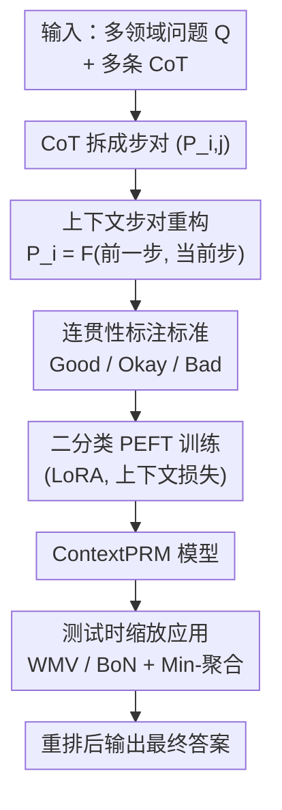

# ContextPRM: Leveraging Contextual Coherence for multi-domain Test-Time Scaling

**会议**: ICLR2026  
**OpenReview**: [https://openreview.net/forum?id=9H0gBsNjCv](https://openreview.net/forum?id=9H0gBsNjCv)  
**代码**: https://github.com/shintaro329/ContextPRM  
**领域**: LLM推理  
**关键词**: 过程奖励模型, 测试时缩放, 上下文连贯性, 跨领域泛化, CoT 标注

## 一句话总结
ContextPRM 把过程奖励模型（PRM）的学习目标从"验证某一步是否事实正确"换成"评估相邻推理步之间的逻辑过渡是否连贯"，配套提出一套连贯性标注标准与上下文感知训练方法，让仅在数学数据上训练的 PRM 也能泛化到法律、历史、哲学等非数学领域，在 MMLU-Pro 非数学领域上相对多数投票基线取得 6.5% 的平均准确率提升，远超此前 SOTA VersaPRM 的 2.2%。

## 研究背景与动机
**领域现状**：测试时缩放（test-time scaling, TTS）是当前提升 LLM 推理能力的主流路线之一——对同一个问题采样 N 条思维链（CoT），再用一个验证器对它们打分、重排，挑出最好的答案。过程奖励模型（PRM）是这类验证器里最强的一档：它不是只看最终答案对不对（那是 Outcome Reward Model 的做法），而是给 CoT 里**每一步**都打一个标量奖励，因此能提供更细粒度的引导信号。

**现有痛点**：绝大多数 PRM 的研究和数据都集中在数学领域。一旦把数学 PRM 直接搬到法律、历史、哲学这些非数学任务上，性能就严重退化。VersaPRM 第一个系统地指出了这个问题，并提出了一套自动生成多领域训练数据的方法，把非数学领域的表现往上抬了一点——但提升有限（非数学领域只比多数投票基线高 2.2%）。

**核心矛盾**：传统 PRM 把"评估推理步"建模成一个**二分类**任务——给定问题 $Q$ 和到第 $i$ 步为止的累积前缀 $T_i = Q \oplus S_1 \oplus \cdots \oplus S_i$，让模型预测第 $i$ 步是对（1）还是错（0）。这种"累积前缀 + 孤立正确性"的范式有两个硬伤：一是随着推理变长，上下文越堆越长，模型越来越难定位**当前步失败的真正根因**；二是它学到的是"这一步事实上对不对"，本质依赖**领域知识**，而不同学科的知识千差万别，导致跨领域迁移困难。

**本文目标**：找到一种**领域无关**的监督信号，让 PRM 学到的能力能跨学科迁移，统一从理科那种符号密集的形式推导到人文那种细腻论证的异质推理风格。

**切入角度**：作者的观察是——无论哪个领域，"好推理"都共享一个底层结构：**步与步之间的逻辑过渡是否连贯**。一个步骤即便孤立看是正确的，如果它建立在前一步的误读之上、或引入了与解题路径无关的跑题信息，那它对整条 CoT 仍然是有害的。这种"上下文连贯性"是**领域无关**的，正适合做跨领域泛化的学习目标。

**核心 idea**：把学习目标从"验证某一步的孤立正确性"换成"建模相邻步之间的上下文连贯性"，并用一套与之匹配的连贯性标注标准 + 上下文感知训练方法来落地。

## 方法详解

### 整体框架
ContextPRM 的目标是训练一个评估"逻辑过渡"而非"孤立正确性"的 PRM。整条流水线是：给定一个多领域问题 $Q$ 及其多条 CoT，先把每条 CoT 拆成一系列**步对**（step pair）$P_{i,j}$；每个步对用新提出的连贯性标准（correctness / understanding / logic / relevance 四个维度）打上连贯/不连贯标签；在上下文感知训练阶段，把每个标注后的步对与原问题 $Q$ 拼成一条二分类训练样本，用 LoRA 做参数高效微调（PEFT），最终得到 ContextPRM 模型；推理时把它当验证器插进 WMV / BoN 这类测试时缩放方法里重排候选答案。

这里有三个真正出力的设计点：**怎么把一步重构成"带上下文的步对"**（换掉累积前缀范式）、**怎么标注这个步对才与新目标对齐**（连贯性标准），以及**训练好的模型怎么用在测试时缩放**。注意一个关键事实：作者**没有重新生成数据**，而是直接复用 VersaPRM 的训练数据，只把它的标签按新标准重打——这保证了和 VersaPRM 的公平对比，所有增益都来自"训练范式 + 标注标准"，而非数据量。

### 关键设计

**1. 上下文步对重构：把"累积前缀"换成"前一步 + 当前步"的最小连贯单元**

传统 PRM 的输入是 $T_i = Q \oplus S_1 \oplus \cdots \oplus S_i$——整段累积前缀，模型在最后一步的 token 位置输出对/错 logit，损失只在该位置计算：
$$\mathcal{L}_{\text{PRM}}(\theta) = \sum_{i=1}^{k} \text{CrossEntropy}\big(o_{i,p_i}^{\{t_-,t_+\}},\, l_i\big)$$
问题就出在"累积"：上下文越长，模型越难分清当前步的失败到底是"自身的孤立事实错误"还是"建立在前文谬误之上的上下文性错误"。ContextPRM 的做法是为每一步 $S_i$ 构造一个**上下文化表示** $P_i = F(\tilde{S}_i, S_i)$，其中 $\tilde{S}_i = Q$（当 $i=1$）或 $\tilde{S}_i = S_{i-1}$（当 $i>1$）——也就是说，给模型看的"上下文"只保留**直接前一步**，并用特殊 token 显式标出上下文段和当前步段的边界。这样一条 $k$ 步的 CoT 被拆成 $k$ 条独立训练样本，输入为 $\tilde{T}_i = Q \oplus P_i$，监督信号变成连贯性标签 $c_i \in \{0,1\}$（1 表示连贯过渡），损失为：
$$\mathcal{L}_{\text{ContextPRM}}(\theta) = \sum_{i=1}^{k} \text{CrossEntropy}\big(\tilde{o}_{i,\tilde{p}_i}^{\{t_-,t_+\}},\, c_i\big)$$
这一改动迫使模型**不再纠结某步孤立对错，而是聚焦相邻两步之间过渡的逻辑有效性**。前一步当上下文这个最小单元，正好把"逻辑过渡"这件领域无关的事单独拎出来让模型学，是跨领域泛化的来源。

**2. 连贯性标注标准：让标签和"逻辑过渡"目标对齐，而非沿用旧的正确性标签**

作者强调一个容易被忽视的点——训练范式换了，监督信号也必须跟着换，否则会出现"目标学连贯、标签却标正确性"的根本错位。于是他们提出一套三级标注标准（受 Lightman 等的 3-level 标注启发），对每个步对评判：**Good**（正确、可验证、上下文恰当且对解题有实质贡献）、**Okay**（正确可验证但冗余或推进甚微）、**Bad**（满足以下任一缺陷：事实/计算错误 Incorrect、误读前提或目标 Misinterpretation、推理结构性谬误如非因果跳跃或自相矛盾 Logical Fallacy、引入与解题无关的跑题信息 Misdirection）。标注沿 CoT 顺序进行，**一旦命中第一个 Bad，其后所有步对自动标为不连贯**——这是为了防止模型从"建立在谬误前提之上的步骤"里学到错误信号。

这套标准的价值用 gpt-4o-mini 重标后量化（见 Table 1）：在原本被判"完全正确"的 CoT 里，新标准在 24.67% 的样本中识别出了错误（更严格的逻辑一致性门槛）；在原本就含错误的 CoT 里，57.04% 的情况下把首个错误定位得**更早**；总体修改率（Earlier Wrong 占比）达 42.82%。值得注意的是，消融实验显示这套标注**单独使用时几乎不涨点**（非数学领域只比 VersaPRM 高 0.84%）——这恰恰是作者刻意为之的证据：标注标准的作用是"纠正逻辑不一致"，而不是靠提升标签质量来人为刷分，真正的增益来自它与上下文训练方法的**协同**。

**3. 测试时缩放应用：把上下文 PRM 当验证器插进 WMV / BoN 重排**

训练好的 ContextPRM 在推理时充当步级打分器，配合重排式 TTS 使用。对一个问题采样 $N$ 条独立 CoT，PRM 给每条 CoT 的各步打分，用**聚合函数**（min / mean / max）压成单条 CoT 的整体分数；本文统一用 **Min-Aggregation**（取最低步分，对应"一条链最弱的一环决定整链质量"的直觉）。在此之上：**Best-of-N (BoN)** 直接选聚合分最高的那条 CoT 的答案；**Weighted Majority Voting (WMV)** 则在多数投票的基础上，用每条 CoT 的分数给它的答案票"加权"，同时融合"出现频次"与"质量"两路信号。多数投票（MV）作为不依赖 PRM 的通用基线。ContextPRM 提供的"连贯性分数"比传统"正确性分数"更能区分那些孤立看对、放进上下文却逻辑站不住的步骤，因此重排信号更干净，在非数学领域的增益尤其明显。

### 损失函数 / 训练策略
基座沿用 VersaPRM 的设置：以 Llama-PRM800K（在 PRM800K 数据上从 Llama-3.1-8B-Instruct 全量微调而来）为起点，对所有线性层做 LoRA（$r=16$、$\alpha=32$），训练 3 个 epoch，学习率 1e-4，总 batch size 32，损失即上文式 (2) 的上下文交叉熵。训练数据**只更新标签、不改内容**，与 VersaPRM 用同一批数据，确保对比公平。硬件为 8×RTX 5090。

## 实验关键数据

### 主实验
评测用 VersaPRM 发布的 MMLU-Pro-CoT-Eval（Unlabeled）测试集，共 2063 题均匀覆盖 MMLU-Pro 各领域，每题配 128 条由 Llama-3.1-8B-Instruct 生成的候选 CoT。测试集进一步划分为 math-adjacent（化学/计算机/工程/物理）与 non-math-adjacent（生物/健康/心理/商业/经济/法律/历史/哲学/其他）两部分。对比对象包括数学 PRM（Qwen2.5-Math-PRM、Math-Shepherd、RLHFlow-Deepseek）、多领域 SOTA VersaPRM，以及基座 Llama-PRM800K。

| 采样方法 | 领域范围 | 基线 | 本文相对多数投票提升 | 对比 |
|--------|------|------|----------|------|
| WMV | 全领域平均 | Majority Voting | **+5.4%** | SOTA |
| WMV | 非数学邻接领域 | Majority Voting | **+6.5%** | VersaPRM 仅 +2.2% |
| BoN | 非数学邻接领域 | Majority Voting | **+6.3%** | — |

在非数学领域，ContextPRM 把相对多数投票的提升从 VersaPRM 的 2.2%、其他数学 PRM 的约 0.5% 一举拉到 6.5%；同时在数学领域仍保持有竞争力的表现，且在"All"综合领域上维持 SOTA。

### 消融实验
拆开"上下文训练方法"与"上下文标注方法"两个组件单独评估（非数学邻接领域，相对 VersaPRM）：

| 配置 | 上下文训练 | 上下文标注 | 非数学领域增益 | 说明 |
|------|---------|---------|------|------|
| VersaPRM（基线） | ✗ | ✗ | — | 两者都不用 |
| Context-label Only | ✗ | ✓ | +0.84% | 只换标签，几乎不涨 |
| Context-train Only | ✓ | ✗ | +1.07% | 只换训练法，小涨（数学域 +0.67%） |
| ContextPRM（完整） | ✓ | ✓ | **+4.3%** | 两者协同，大涨 |

### 关键发现
- **强协同效应**：两个组件单用各自只涨约 1%，合起来却涨 4.3%，远超线性叠加——说明"上下文训练范式"必须配"连贯性标签"才能充分发挥，二者是一对锁死的搭配。
- **数学域的可接受 trade-off**：完整 ContextPRM 在数学域反而掉 2.2%，作者认为这是为换取泛化的合理代价——它仍显著超过基座 Llama-PRM800K，且综合"All"领域保持 SOTA。
- **单领域泛化惊人**：只用法律/心理/哲学等**单一领域**数据微调，多领域评测仍很强，部分单领域模型甚至超过 VersaPRM 的全量数据表现（非数学领域 2.7% 平均增益）。
- **逻辑密度决定收益**：在逻辑密集型领域（哲学 +3.4%、心理 +3.6%、健康 +2.9%）训练效果远好于知识密集型领域（历史 +1.2%、物理 +1.7%）——印证方法吃的是"逻辑结构"而非"领域事实知识"。
- **错误类型分析**：在"VersaPRM 失败而 ContextPRM 成功"的 Fixed Set 上，ContextPRM 主要修复的是逻辑类错误（谬误、误读），尤其在人文领域；性能提升与领域逻辑错误占比强正相关（$r = 0.80$），直接证明增益来自"增强上下文连贯性"而非"提升事实准确率"。

## 亮点与洞察
- **目标层面的重定义最关键**：把"验证孤立正确性"换成"建模逻辑过渡连贯性"，一句话点破了数学 PRM 难泛化的根因——它学的是领域知识，而连贯性才是领域无关的。这个视角的转换比任何工程 trick 都更值钱。
- **"只改标签不改数据"的干净实验设计**：复用 VersaPRM 同一批数据、只重打标签，把所有增益归因到"范式+标注"而非数据规模，是非常有说服力的对照。
- **故意不涨点的消融反而最有说服力**：作者特意指出"光换标签几乎不涨"，用来证明标注标准的目的是纠偏逻辑而非刷分质量——这种反直觉的诚实论证值得学习。
- **可迁移性**："用前一步当最小上下文单元 + 连贯性而非正确性标签"这套思路，可迁移到任何需要跨领域泛化的步级评估器（如 agent 轨迹评估、代码推理验证），核心是把要学的"领域无关结构"从"领域相关内容"里剥离出来。

## 局限与展望
- **作者承认的 trade-off**：数学领域掉 2.2% 是用泛化换来的，对纯数学场景未必划算。
- **上下文窗口极简**：只取"前一步"做上下文，跨越多步的长程逻辑依赖（如第 3 步的谬误要到第 8 步才暴露）可能捕捉不到，扩展到可变长度上下文是自然的改进方向。
- **标注依赖 LLM 重标**：连贯性标签由 gpt-4o-mini 生成，标注质量受该模型能力上限约束，且"第一个 Bad 之后全判错"的硬传播规则可能误伤后续本该独立成立的步骤。
- **基座与规模单一**：实验只在 Llama-PRM800K（8B）上验证，方法在更大规模或不同基座上的可扩展性未知。

## 相关工作与启发
- **vs VersaPRM**：VersaPRM 的贡献是"自动生成多领域训练数据"，但仍沿用传统的孤立正确性训练范式，因此非数学领域只涨 2.2%；ContextPRM 不在数据量上做文章，而是改训练目标与标注标准，用同一批数据把非数学增益拉到 6.5%。两者互补——一个解决"数据从哪来"，一个解决"目标该学什么"。
- **vs 数学 PRM（Qwen2.5-Math-PRM / Math-Shepherd / RLHFlow-Deepseek）**：这些方法在数学域内很强但跨领域几乎不迁移（非数学约 +0.5%），因为它们学的是数学特定的正确性模式；ContextPRM 学的是领域无关的逻辑流，泛化能力本质不同。
- **vs 生成式/纠错式 PRM（先生成中间推理再打分、或加错误类型标签）**：这类方法仍局限在知识密集的数学域，且要付出额外的测试时生成开销；ContextPRM 是判别式、聚焦"步间过渡"，不增加推理时生成成本，且明确面向多领域。

## 评分
- 新颖性: ⭐⭐⭐⭐⭐ 把 PRM 学习目标从"孤立正确性"重定义为"上下文连贯性"，视角转换清晰且直击跨领域泛化根因
- 实验充分度: ⭐⭐⭐⭐⭐ 主实验 + 双组件消融 + 单领域泛化热图 + 错误类型相关性分析，多角度坐实"增益来自逻辑而非知识"
- 写作质量: ⭐⭐⭐⭐ 动机与方法链条清晰，部分句子有笔误，图表细节需配合 Appendix 才完整
- 价值: ⭐⭐⭐⭐⭐ 为多领域测试时缩放确立新 SOTA，且"剥离领域无关结构"的思路对更广的步级评估器有迁移价值

<!-- RELATED:START -->

## 相关论文

- [\[ICLR 2026\] Understanding the Role of Training Data in Test-Time Scaling](understanding_the_role_of_training_data_in_test-time_scaling.md)
- [\[ICLR 2026\] TUMIX: Multi-Agent Test-Time Scaling with Tool-Use Mixture](tumix_multi-agent_test-time_scaling_with_tool-use_mixture.md)
- [\[ICLR 2026\] ATTS: Asynchronous Test-Time Scaling via Conformal Prediction](atts_asynchronous_test-time_scaling_via_conformal_prediction.md)
- [\[ICLR 2026\] Optimal Aggregation of LLM and PRM Signals for Efficient Test-Time Scaling](optimal_aggregation_of_llm_and_prm_signals_for_efficient_test-time_scaling.md)
- [\[ICLR 2026\] Plan and Budget: Effective and Efficient Test-Time Scaling on Reasoning LLMs](plan_and_budget_effective_and_efficient_test-time_scaling_on_reasoning_large_lan.md)

<!-- RELATED:END -->
